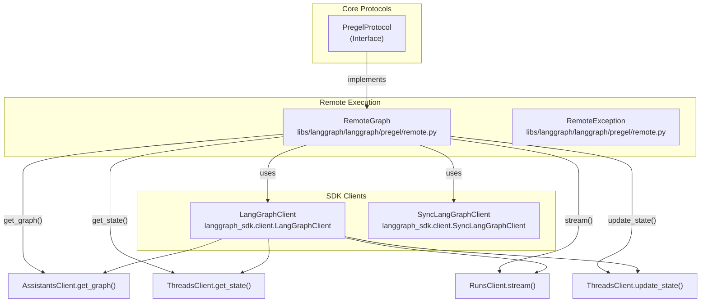
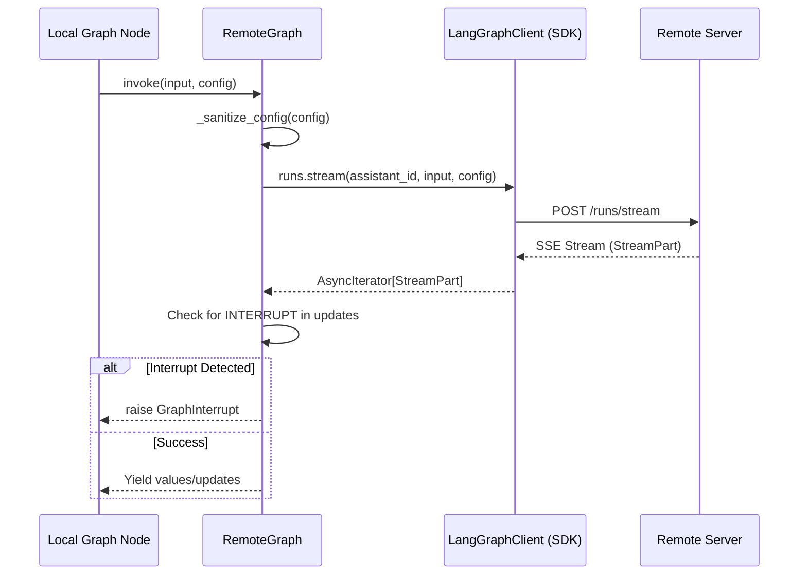

`RemoteGraph` is a client implementation for calling remote LangGraph APIs that conform to the LangGraph Server API specification. It implements the `PregelProtocol` interface [libs/langgraph/langgraph/pregel/protocol.py:25-224]() and behaves identically to a local `Graph`, enabling it to be used as a node in another graph for building distributed, multi-tier LangGraph applications.

For information about the LangGraph Server API endpoints, see [Server API](#7). For details on the Python SDK client classes used internally, see [Python SDK](#5.1). For information on using graphs as subgraphs locally, see [Graph Composition and Nested Graphs](#3.6).

## Class Structure

The `RemoteGraph` class is located in [libs/langgraph/langgraph/pregel/remote.py:112-1002]() and implements the `PregelProtocol` interface. This enables it to be used interchangeably with locally-compiled `Pregel` instances.

### Entity Relationship Diagram

Sources: [libs/langgraph/langgraph/pregel/remote.py:112-121](), [libs/langgraph/langgraph/pregel/protocol.py:25-224](), [libs/langgraph/langgraph/pregel/remote.py:26-31]()

## Initialization and Configuration

The `RemoteGraph` constructor [libs/langgraph/langgraph/pregel/remote.py:126-174]() accepts either client instances or connection parameters to create default clients.

### Constructor Parameters

| Parameter | Type | Description |
|-----------|------|-------------|
| `assistant_id` | `str` | The assistant ID or graph name of the remote graph (positional) [libs/langgraph/langgraph/pregel/remote.py:159]() |
| `url` | `str \| None` | The URL of the remote API server [libs/langgraph/langgraph/pregel/remote.py:131]() |
| `api_key` | `str \| None` | Authentication API key [libs/langgraph/langgraph/api_key:132]() |
| `headers` | `dict[str, str] \| None` | Additional HTTP headers [libs/langgraph/langgraph/pregel/remote.py:133]() |
| `client` | `LangGraphClient \| None` | Pre-configured async client [libs/langgraph/langgraph/pregel/remote.py:134]() |
| `sync_client` | `SyncLangGraphClient \| None` | Pre-configured sync client [libs/langgraph/langgraph/pregel/remote.py:135]() |
| `config` | `RunnableConfig \| None` | Default configuration [libs/langgraph/langgraph/pregel/remote.py:136]() |
| `name` | `str \| None` | Human-readable name (defaults to `assistant_id`) [libs/langgraph/langgraph/pregel/remote.py:137]() |
| `distributed_tracing` | `bool` | Enable LangSmith distributed tracing headers [libs/langgraph/langgraph/pregel/remote.py:138]() |

At least one of `url`, `client`, or `sync_client` must be provided. If `url` is provided, default clients are created using `get_client()` and `get_sync_client()` from `langgraph_sdk` [libs/langgraph/langgraph/pregel/remote.py:167-174]().

Sources: [libs/langgraph/langgraph/pregel/remote.py:126-174]()

## Configuration Sanitization

Before sending configuration to the remote API, `RemoteGraph` sanitizes it to remove non-serializable fields and internal checkpoint state.

### Configuration Droplist
The constant `_CONF_DROPLIST` [libs/langgraph/langgraph/pregel/remote.py:74-81]() defines fields removed from `config["configurable"]`:
- `CONFIG_KEY_CHECKPOINT_MAP` [libs/langgraph/langgraph/_internal/_constants.py]()
- `CONFIG_KEY_CHECKPOINT_ID` [libs/langgraph/langgraph/_internal/_constants.py]()
- `CONFIG_KEY_CHECKPOINT_NS` [libs/langgraph/langgraph/_internal/_constants.py]()
- `CONFIG_KEY_TASK_ID` [libs/langgraph/langgraph/_internal/_constants.py]()

### Implementation
The `_sanitize_config()` method [libs/langgraph/langgraph/pregel/remote.py:369-396]() processes:
1. **recursion_limit**: Copied directly if present.
2. **tags**: Filters to include only string values.
3. **metadata**: Recursively sanitizes values using `_sanitize_config_value()`.
4. **configurable**: Filters droplist keys and recursively sanitizes values.

The `_sanitize_config_value()` helper [libs/langgraph/langgraph/pregel/remote.py:84-103]() ensures only primitives (str, int, float, bool, UUID), dicts, and lists/tuples containing primitives are passed.

Sources: [libs/langgraph/langgraph/pregel/remote.py:74-103](), [libs/langgraph/langgraph/pregel/remote.py:369-396]()

## State Management

`RemoteGraph` provides methods to read and write thread state on the remote graph by wrapping SDK calls.

### get_state() / aget_state()
[libs/langgraph/langgraph/pregel/remote.py:398-468]()
Retrieves the current or historical state of a thread. It calls `ThreadsClient.get_state()` or `ThreadsClient.get_state_checkpoint()` depending on whether a specific checkpoint ID is provided in the config.

### update_state() / aupdate_state()
[libs/langgraph/langgraph/pregel/remote.py:564-632]()
Updates thread state on the remote graph. It calls `ThreadsClient.update_state()` and returns a `RunnableConfig` representing the new checkpoint.

### Data Model Mapping

| SDK Schema (`ThreadState`) | Pregel Model (`StateSnapshot`) | Source |
|-------------------|---------------------|--------|
| `values` | `values` | [libs/langgraph/langgraph/pregel/remote.py:304]() |
| `next` | `next` (as tuple) | [libs/langgraph/langgraph/pregel/remote.py:305]() |
| `checkpoint` | `config["configurable"]` | [libs/langgraph/langgraph/pregel/remote.py:308-315]() |
| `tasks` | `tasks` (as `PregelTask`) | [libs/langgraph/langgraph/pregel/remote.py:321-337]() |

Sources: [libs/langgraph/langgraph/pregel/remote.py:284-340](), [libs/langgraph/langgraph/pregel/remote.py:32-37]()

## Execution and Streaming

The core of `RemoteGraph` is the implementation of `stream()` and `astream()` which translate local Pregel stream requests into LangGraph Server API requests.

### Stream Mode Mapping
The `_get_stream_modes()` method [libs/langgraph/langgraph/pregel/remote.py:634-683]() handles conversion:
- Maps local `"messages"` to remote `"messages-tuple"` [libs/langgraph/langgraph/pregel/remote.py:657]().
- Always adds `"updates"` mode internally to detect interrupts [libs/langgraph/langgraph/pregel/remote.py:662]().
- Filters out `"events"` as it is not supported in remote execution [libs/langgraph/langgraph/pregel/remote.py:666]().

### Subgraph Execution Data Flow

Sources: [libs/langgraph/langgraph/pregel/remote.py:685-903](), [libs/langgraph/langgraph/pregel/remote.py:764-769]()

## Integration Features

### Interrupt Propagation
When `RemoteGraph` is used as a node in a local graph, it monitors the remote stream for the `__interrupt__` key [libs/langgraph/langgraph/pregel/remote.py:764-769](). If found, it raises a `GraphInterrupt` [libs/langgraph/langgraph/errors.py:84]() locally, effectively pausing the local graph execution at that node.

### Parent Command Support
Remote graphs can issue commands to the local parent graph. If a stream event has mode `"command"` and the target is `Command.PARENT`, `RemoteGraph` raises a `ParentCommand` exception [libs/langgraph/langgraph/pregel/remote.py:754-755]().

### Distributed Tracing
If `distributed_tracing=True` is set, `RemoteGraph` uses `langsmith.get_current_run_tree()` to extract tracing headers and injects them into the remote API request [libs/langgraph/langgraph/pregel/remote.py:1004-1015](). This ensures trace continuity between the local orchestrator and remote executors.

Sources: [libs/langgraph/langgraph/pregel/remote.py:138](), [libs/langgraph/langgraph/pregel/remote.py:754-769](), [libs/langgraph/langgraph/pregel/remote.py:1004-1015]()