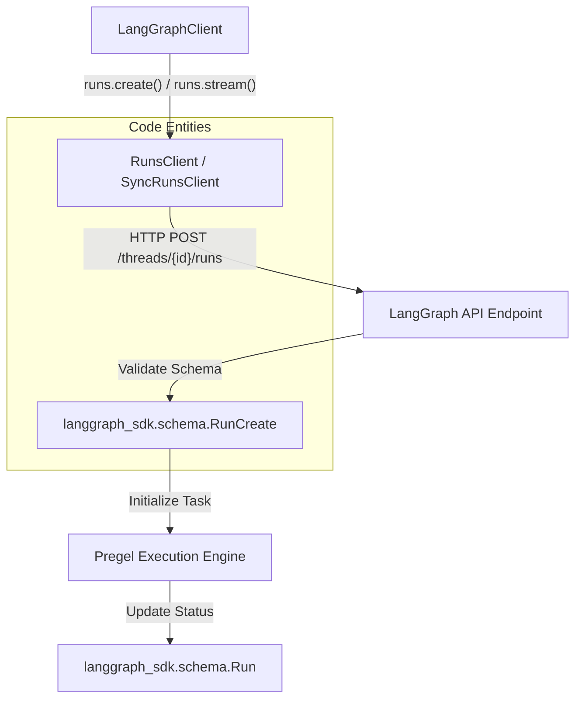
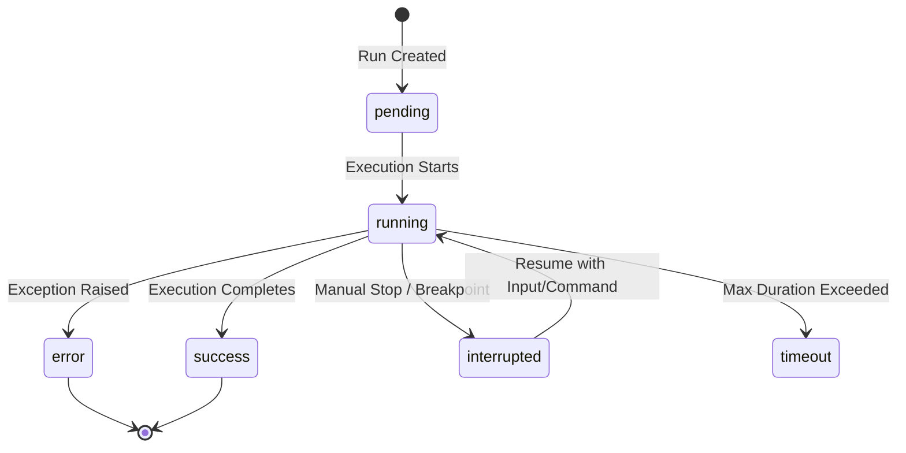

A **Run** represents a single invocation of a LangGraph assistant. It is the primary resource for executing graph logic, whether statefully (associated with a `Thread`) or statelessly. Runs provide the interface for streaming execution data, managing lifecycle states, and handling concurrent execution strategies.

## Overview of Run Execution

Runs are managed via the `RunsClient` (async) or `SyncRunsClient` (sync) [libs/sdk-py/langgraph_sdk/client.py:38-44](). A run can be triggered as a background task or as a streaming response. When a run is created, it executes the graph associated with an `Assistant` using the provided input and configuration.

### Data Flow: Triggering a Run

The following diagram illustrates the flow from a client request to the initialization of a run within the LangGraph Server ecosystem.

**Run Initialization Flow**

Sources: [libs/sdk-py/langgraph_sdk/_async/runs.py:55-67](), [libs/sdk-py/langgraph_sdk/schema.py:236-250]()

## Streaming Modes

LangGraph supports multiple streaming modes that determine what data is pushed to the client during execution. These are defined by the `StreamMode` type [libs/sdk-py/langgraph_sdk/schema.py:51-61]().

| Mode | Description |
| :--- | :--- |
| `values` | Streams the full state of the graph after each step. |
| `updates` | Streams only the incremental updates applied to the state in the current step. |
| `messages` | Streams complete messages (useful for chat-based graphs). |
| `events` | Streams fine-grained events occurring during execution (e.g., node start/end). |
| `tasks` | Streams task-specific metadata, including start and finish events. |
| `debug` | Streams detailed internal execution information for troubleshooting. |
| `checkpoints` | Streams checkpoint metadata as state is persisted. |

### SSE Protocol and Decoding
Streaming is implemented using Server-Sent Events (SSE). The `SSEDecoder` [libs/sdk-py/langgraph_sdk/sse.py:78-84]() processes the raw byte stream into `StreamPart` objects. The SDK provides a `version="v2"` option in the `stream` method which wraps the raw SSE stream to provide a standardized dictionary format via `_sse_to_v2_dict` [libs/sdk-py/langgraph_sdk/_async/runs.py:45-53]().

Sources: [libs/sdk-py/langgraph_sdk/schema.py:51-72](), [libs/sdk-py/langgraph_sdk/sse.py:91-140](), [libs/sdk-py/langgraph_sdk/_async/runs.py:194-202]()

## Run Status Lifecycle

A run transitions through several statuses defined by the `RunStatus` literal [libs/sdk-py/langgraph_sdk/schema.py:23-32]().

**Run State Transitions**

### Lifecycle Details
- **pending**: The task is enqueued and waiting for an available worker.
- **running**: The graph's `Pregel` loop is actively processing nodes.
- **interrupted**: Execution paused due to an `interrupt()` call in the graph or a pre-configured breakpoint.
- **rollback**: A specific cancellation action that not only stops the run but also deletes associated checkpoints [libs/sdk-py/langgraph_sdk/schema.py:137-142]().

Sources: [libs/sdk-py/langgraph_sdk/schema.py:23-32](), [libs/sdk-py/langgraph_sdk/schema.py:137-142]()

## Multitask Strategies

When multiple runs are triggered on the same `Thread`, the server applies a `MultitaskStrategy` to handle the concurrency [libs/sdk-py/langgraph_sdk/schema.py:81-88]().

| Strategy | Behavior |
| :--- | :--- |
| `reject` | Default. Rejects the new run request if the thread is already `busy`. |
| `interrupt` | Interrupts the currently running task and starts the new one. |
| `rollback` | Rolls back the state to the last successful checkpoint before starting the new run. |
| `enqueue` | Queues the new run to start automatically after the current run completes. |

Sources: [libs/sdk-py/langgraph_sdk/schema.py:81-88](), [libs/sdk-py/langgraph_sdk/_async/runs.py:94]()

## Key Functions and Classes

### `RunsClient` / `SyncRunsClient`
The primary interface for run operations. Key methods include:
- `create`: Triggers a run and returns the `Run` object immediately [libs/sdk-py/langgraph_sdk/_async/runs.py:307]().
- `stream`: Returns an `AsyncIterator` or `Iterator` of `StreamPart` objects [libs/sdk-py/langgraph_sdk/_async/runs.py:194]().
- `wait`: Blocks (or awaits) until the run reaches a terminal state and returns the final state [libs/sdk-py/langgraph_sdk/_async/runs.py:381]().
- `cancel`: Sends a cancellation request with a specific `CancelAction` (`interrupt` or `rollback`) [libs/sdk-py/langgraph_sdk/_async/runs.py:441]().

### `Run` Schema
The `Run` TypedDict defines the structure of the resource returned by the API:
- `run_id`: Unique identifier for the run.
- `status`: Current `RunStatus`.
- `input`: The initial input provided to the graph.
- `config`: `Config` object containing recursion limits and configurable parameters [libs/sdk-py/langgraph_sdk/schema.py:185-206]().
- `checkpoint_id`: The ID of the checkpoint associated with the run's current state.

Sources: [libs/sdk-py/langgraph_sdk/_async/runs.py:55-70](), [libs/sdk-py/langgraph_sdk/schema.py:185-206](), [libs/sdk-py/langgraph_sdk/schema.py:23-32]()