## Purpose and Scope

This document explains LangGraph's runtime dependency injection system (v0.6.0+). This system enables nodes and tools to receive execution-scoped dependencies—such as context, stores, stream writers, and execution metadata—without manual parameter passing. The `Runtime` class bundles these dependencies and makes them available to node functions through automatic parameter injection based on type annotations and function signatures.

---

## Runtime Class Structure

The `Runtime` class is a generic dataclass that bundles run-scoped dependencies and utilities available to nodes during graph execution. It is designed to be injected into graph nodes and middleware.

### Runtime and Execution Entities

The following diagram associates the natural language concepts of execution context with the specific code entities used in the LangGraph runtime.

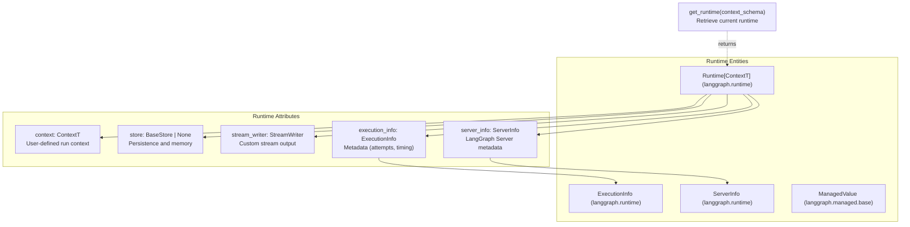

**Sources:** [libs/langgraph/langgraph/runtime.py:25-186](), [libs/langgraph/langgraph/managed/base.py:18-23]()

### Runtime Attributes and Execution Info

| Attribute | Type | Purpose |
|-----------|------|---------|
| `context` | `ContextT` | Static context for the graph run (e.g., `user_id`, `db_conn`), defined by `context_schema`. [libs/langgraph/langgraph/runtime.py:163-166]() |
| `store` | `BaseStore \| None` | Key-value store for persistence and long-term memory. [libs/langgraph/langgraph/runtime.py:168-169]() |
| `stream_writer` | `StreamWriter` | Function for writing to the custom stream mode. [libs/langgraph/langgraph/runtime.py:171-172]() |
| `execution_info` | `ExecutionInfo` | Read-only metadata about the current execution (checkpoint IDs, task IDs). [libs/langgraph/langgraph/runtime.py:180-183]() |
| `server_info` | `ServerInfo \| None` | Metadata injected by LangGraph Server (assistant ID, graph ID, user). [libs/langgraph/langgraph/runtime.py:185-186]() |
| `previous` | `Any` | Previous return value for the thread (functional API with checkpointer only). [libs/langgraph/langgraph/runtime.py:174-178]() |

The `ExecutionInfo` class provides specific tracking data for the current node execution:
*   `node_attempt`: Current node execution attempt number (1-indexed), used for retry logic. [libs/langgraph/langgraph/runtime.py:47-48]()
*   `node_first_attempt_time`: Unix timestamp for when the first attempt started. [libs/langgraph/langgraph/runtime.py:50-51]()

**Sources:** [libs/langgraph/langgraph/runtime.py:25-56](), [libs/langgraph/langgraph/runtime.py:163-186]()

---

## Injectable Dependencies

LangGraph supports automatic injection of multiple dependencies into node functions, tools, and tasks. This is managed by the `RunnableCallable` (internal) and the `Pregel` execution loop.

### Injection Association Diagram

This diagram maps the internal configuration keys to the parameters available in a user's node function.

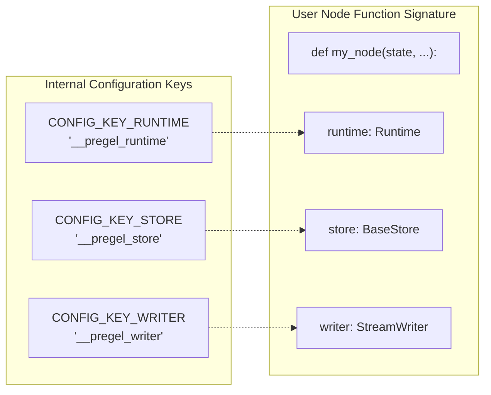

**Sources:** [libs/langgraph/langgraph/_internal/_constants.py:73-75](), [libs/langgraph/langgraph/runtime.py:89-106]()

### Supported Injectable Parameters

The system recognizes the following parameters in node signatures:

1.  **`runtime: Runtime[Context]`**: The complete runtime object, providing access to `execution_info`, `server_info`, and `context`. [libs/langgraph/langgraph/runtime.py:89-106]()
2.  **`store: BaseStore`**: Direct access to the cross-thread memory store. [libs/langgraph/langgraph/runtime.py:168-169]()
3.  **`writer: StreamWriter`**: Function for writing custom data to the stream. [libs/langgraph/langgraph/runtime.py:171-172]()
4.  **`config: RunnableConfig`**: The standard LangChain configuration object. [libs/langgraph/langgraph/runtime.py:98-100]()

**Sources:** [libs/langgraph/langgraph/runtime.py:89-106](), [libs/langgraph/langgraph/pregel/main.py:145-150]()

---

## Managed Values

Managed values provide a way to inject "calculated" or "derived" execution context into nodes. Unlike the `Runtime` object which is passed via config, `ManagedValue` implementations calculate values based on the `PregelScratchpad`.

| Class | Type | Purpose |
|-------|------|---------|
| `IsLastStepManager` | `bool` | Injected as `IsLastStep`. Returns `True` if the current step is the final allowed step (recursion limit). [libs/langgraph/langgraph/managed/is_last_step.py:9-12]() |
| `RemainingStepsManager` | `int` | Injected as `RemainingSteps`. Returns the number of steps remaining before the recursion limit. [libs/langgraph/langgraph/managed/is_last_step.py:18-21]() |

**Sources:** [libs/langgraph/langgraph/managed/is_last_step.py:9-25](), [libs/langgraph/langgraph/managed/base.py:18-23]()

---

## Runtime and Retry Integration

The runtime system is deeply integrated with the graph's retry mechanism. During retries, the `Runtime` object is patched to update `ExecutionInfo`, allowing nodes to know their current attempt count.

### Retry Loop and Runtime Patching

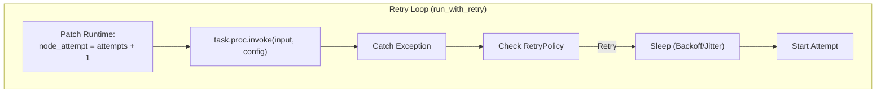

When a task fails and matches a `RetryPolicy`, the execution engine:
1.  Increments the internal `attempts` counter. [libs/langgraph/langgraph/pregel/_retry.py:161]()
2.  Calls `runtime.patch_execution_info(node_attempt=attempts + 1)`. [libs/langgraph/langgraph/pregel/_retry.py:118-121]()
3.  Updates the `RunnableConfig` with the new patched `Runtime` before the next invocation. [libs/langgraph/langgraph/pregel/_retry.py:112-121]()

**Sources:** [libs/langgraph/langgraph/pregel/_retry.py:86-121](), [libs/langgraph/langgraph/runtime.py:53-55]()

---

## Implementation Details

### Context Coercion
When a graph is invoked with a `context` argument, LangGraph attempts to coerce the input into the `context_schema` provided during graph definition.
*   **Dataclasses**: If the schema is a dataclass, dict inputs are unpacked into the constructor. [libs/langgraph/tests/test_runtime.py:114-151]()
*   **Pydantic**: If the schema is a Pydantic model, it is validated using `model_validate`. [libs/langgraph/tests/test_runtime.py:153-192]()
*   **TypedDict**: Dict inputs are passed through as-is. [libs/langgraph/tests/test_runtime.py:194-212]()

### Runtime Retrieval
While parameter injection is the preferred method, the `get_runtime` function allows retrieving the current `Runtime` instance from within a function that does not have it in its signature, provided the `context_schema` is known.

**Sources:** [libs/langgraph/langgraph/runtime.py:221-229](), [libs/langgraph/tests/test_runtime.py:35-55]()

---

## Configuration Summary

The runtime system relies on internal configuration keys defined in `_constants.py`.

| Constant | Value | Description |
|----------|-------|-------------|
| `CONFIG_KEY_RUNTIME` | `"__pregel_runtime"` | Key in `configurable` for the `Runtime` instance. [libs/langgraph/langgraph/_internal/_constants.py:73]() |
| `CONFIG_KEY_TASK_ID` | `"langgraph_task_id"` | Key for the unique task ID in the current step. [libs/langgraph/langgraph/_internal/_constants.py:76]() |
| `CONFIG_KEY_CHECKPOINT_NS` | `"checkpoint_ns"` | Key for the current graph namespace (for subgraphs). [libs/langgraph/langgraph/_internal/_constants.py:67]() |

**Sources:** [libs/langgraph/langgraph/_internal/_constants.py:62-86](), [libs/langgraph/langgraph/pregel/_algo.py:174-210]()

# Caching System


This page documents the LangGraph caching system, which provides result memoization for nodes and tasks to avoid redundant re-execution. It covers the `CachePolicy` configuration, the `BaseCache` interface, specific backend implementations (Memory, SQLite, Redis), and how the system integrates with the Pregel execution loop.

---

## Overview

The caching system allows individual nodes in a `StateGraph` or tasks in the Functional API to skip execution if their inputs have been processed previously. This is distinct from checkpointing, which persists the entire graph state for recovery and time travel.

| Component | Responsibility |
|:---|:---|
| **`CachePolicy`** | Defines *how* a node should be cached (TTL, key generation function). |
| **`BaseCache`** | Abstract interface for cache storage backends. |
| **`FullKey`** | A unique identifier for a specific execution attempt, consisting of a `Namespace` (tuple of strings) and a string key. |
| **`PregelRunner`** | Orchestrates the lookup and storage of results during the execution tick. |

Sources: [libs/checkpoint/langgraph/cache/base/__init__.py:11-16](), [libs/langgraph/langgraph/types.py:74-82]()

---

## Cache Configuration

### CachePolicy
`CachePolicy` is a dataclass that configures caching behavior for a specific node or task.

| Field | Type | Description |
|:---|:---|:---|
| `key_func` | `Callable` | Function to generate a string/byte key from node inputs. |
| `ttl` | `int | None` | Time-to-live in seconds. `None` indicates no expiration. |

Sources: [libs/langgraph/langgraph/types.py:74-82](), [libs/langgraph/langgraph/pregel/_algo.py:115-138]()

### CacheKey
The execution engine uses `FullKey` to perform lookups. It combines a namespace (to prevent collisions between different nodes) with the specific key generated by the policy.
* **`Namespace`**: A tuple of strings, typically representing the graph and node hierarchy. [libs/checkpoint/langgraph/cache/base/__init__.py:11-11]()
* **`FullKey`**: A tuple of `(Namespace, str)`. [libs/checkpoint/langgraph/cache/base/__init__.py:12-12]()

---

## Cache Backend Interface

All caching backends must implement the `BaseCache` interface. This interface supports both synchronous and asynchronous operations and uses a `SerializerProtocol` (defaulting to `JsonPlusSerializer`) to handle data conversion.

**Core Interface Methods:**
* `get(keys: Sequence[FullKey]) -> dict[FullKey, ValueT]` [libs/checkpoint/langgraph/cache/base/__init__.py:25-27]()
* `set(pairs: Mapping[FullKey, tuple[ValueT, int | None]])` [libs/checkpoint/langgraph/cache/base/__init__.py:33-35]()
* `clear(namespaces: Sequence[Namespace] | None)` [libs/checkpoint/langgraph/cache/base/__init__.py:41-43]()

### Implementations

#### 1. InMemoryCache
A thread-safe, non-persistent cache stored in a Python dictionary.
* **File:** `libs/checkpoint/langgraph/cache/memory/__init__.py` [libs/checkpoint/langgraph/cache/memory/__init__.py:11-15]()
* **Storage:** `dict[Namespace, dict[str, tuple[str, bytes, float | None]]]` [libs/checkpoint/langgraph/cache/memory/__init__.py:14-14]()
* **Concurrency:** Uses `threading.RLock` to manage concurrent access. [libs/checkpoint/langgraph/cache/memory/__init__.py:15-15]()

#### 2. SqliteCache
A persistent, file-based cache using SQLite.
* **File:** `libs/checkpoint-sqlite/langgraph/cache/sqlite/__init__.py` [libs/checkpoint-sqlite/langgraph/cache/sqlite/__init__.py:13-15]()
* **Schema:** A `cache` table with columns `ns`, `key`, `expiry`, `encoding`, and `val`. [libs/checkpoint-sqlite/langgraph/cache/sqlite/__init__.py:35-42]()
* **Concurrency:** Enables WAL (Write-Ahead Logging) mode and uses `threading.RLock` to serialize access to the shared connection. [libs/checkpoint-sqlite/langgraph/cache/sqlite/__init__.py:30-32]()

#### 3. RedisCache
A distributed cache implementation using Redis.
* **Namespace Handling:** Maps `FullKey` to Redis keys using a configurable prefix (e.g., `test:cache:`). [libs/checkpoint/tests/test_redis_cache.py:24-24]()
* **TTL Support:** Leverages Redis native expiration for keys when a TTL is provided. [libs/checkpoint/tests/test_redis_cache.py:72-83]()

---

## Execution Integration

Caching is integrated directly into the `PregelRunner` and the retry logic. Before a task is executed, the runner checks for existing cached writes.

### Data Flow Diagram

The following diagram illustrates how the `PregelRunner` interacts with the `BaseCache` during a single execution "tick".

**Pregel Execution and Cache Lookup**

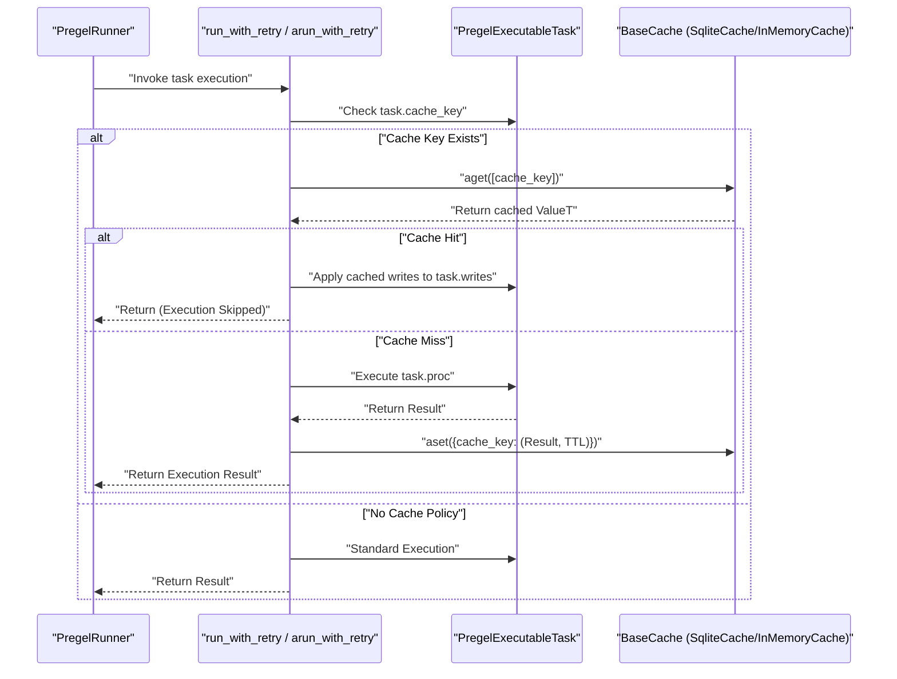

Sources: [libs/langgraph/langgraph/pregel/_runner.py:164-184](), [libs/langgraph/langgraph/pregel/_retry.py:158-187](), [libs/langgraph/langgraph/pregel/_algo.py:115-138]()

---

## Code Entity Mapping

This diagram bridges the conceptual "Cache System" with the specific classes and files in the codebase.

**Caching System Code Map**

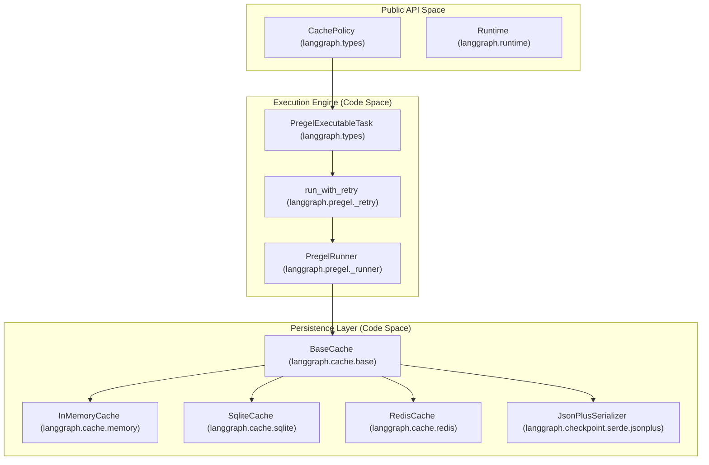

Sources: [libs/langgraph/langgraph/types.py:74-82](), [libs/langgraph/langgraph/pregel/_runner.py:122-140](), [libs/langgraph/langgraph/pregel/_retry.py:57-61](), [libs/checkpoint/langgraph/cache/base/__init__.py:15-23](), [libs/checkpoint/tests/test_redis_cache.py:9-9]()

---

## Key Functions and Classes

### `run_with_retry` and `arun_with_retry`
These functions wrap the execution of a `PregelExecutableTask`. They are responsible for checking the cache before calling the node's underlying procedure (`task.proc`). If a `cache_key` is present and a hit is found in the backend, the cached writes are applied directly to the task, bypassing the function call.
* **File:** `libs/langgraph/langgraph/pregel/_retry.py` [libs/langgraph/langgraph/pregel/_retry.py:158-187]()

### `BaseCache.get` / `BaseCache.set`
These methods handle the serialization and TTL logic.
* In `SqliteCache.get`, expired entries are automatically purged if the current timestamp exceeds the `expiry` value stored in the database. [libs/checkpoint-sqlite/langgraph/cache/sqlite/__init__.py:63-68]()
* In `InMemoryCache.get`, the lock ensures that reading and purging expired entries is atomic. [libs/checkpoint/langgraph/cache/memory/__init__.py:19-31]()

### `Runtime` Integration
The `Runtime` object, injected into nodes, provides metadata like `node_attempt` and `node_first_attempt_time` via `ExecutionInfo`. While not the cache itself, this metadata is often used by custom `key_func` implementations to determine if a result should be cached or recomputed.
* **File:** `libs/langgraph/langgraph/runtime.py` [libs/langgraph/langgraph/runtime.py:17-25]()

Sources: [libs/langgraph/langgraph/pregel/_retry.py:57-187](), [libs/checkpoint-sqlite/langgraph/cache/sqlite/__init__.py:46-72](), [libs/langgraph/langgraph/runtime.py:133-135]()

# Persistence and Memory


## Overview

LangGraph's persistence and memory system is divided into two distinct layers that serve complementary purposes for stateful applications.

| Layer | Interface | Scope | Primary Purpose |
|-------|-----------|-------|-----------------|
| **Checkpointer** | `BaseCheckpointSaver` | Per-thread | Durable execution, error recovery, and "Time Travel" (state replay) |
| **Store** | `BaseStore` | Cross-thread | Long-term memory, shared knowledge, user profiles, and global state |

**Checkpointers** save a full snapshot of the graph state after every superstep. They are indexed by a `thread_id`, allowing a specific conversation or workflow to be paused and resumed. [libs/checkpoint/langgraph/checkpoint/base/__init__.py:122-146](). **Stores** provide a global, namespace-keyed document store that any thread can access, making them ideal for information that must persist across different conversations (e.g., remembering a user's name across multiple independent threads).

### System Architecture

The following diagram illustrates how these two systems interact with graph execution threads.

**Persistence Architecture Overview**
```mermaid
graph TD
    subgraph "Execution Contexts"
        T1["Thread A (thread_id='A')"]
        T2["Thread B (thread_id='B')"]
    end

    subgraph "Checkpointer Layer (Per-Thread)"
        CP_A["Checkpoint History for A"]
        CP_B["Checkpoint History for B"]
    end

    subgraph "Store Layer (Cross-Thread)"
        NS_USER["Namespace: ('users', '123')"]
        NS_GLOBAL["Namespace: ('memories',)"]
    end

    T1 -->|"read/write"| CP_A
    T2 -->|"read/write"| CP_B
    
    T1 -->|"InjectedStore"| NS_USER
    T2 -->|"InjectedStore"| NS_USER
    T1 -->|"InjectedStore"| NS_GLOBAL

    CP_A -.["BaseCheckpointSaver"]-> BACKEND_CP["PostgresSaver\nSqliteSaver\nInMemorySaver"]
    NS_USER -.["BaseStore"]-> BACKEND_STORE["PostgresStore\nInMemoryStore"]
```
Sources: [libs/checkpoint/langgraph/checkpoint/base/__init__.py:122-153](), [libs/checkpoint/langgraph/checkpoint/memory/__init__.py:31-64]()

---

## The Checkpointer Layer

The checkpointer is responsible for the durability of the graph's execution state. It captures the values of all channels (state variables) at the end of every superstep.

### Key Data Models
- **`Checkpoint`**: A `TypedDict` containing the raw state, including `channel_values`, `channel_versions`, and `versions_seen`. [libs/checkpoint/langgraph/checkpoint/base/__init__.py:65-96]()
- **`CheckpointTuple`**: A container returned by the saver that bundles the `Checkpoint` with its `config`, `metadata`, and any `pending_writes`. [libs/checkpoint/langgraph/checkpoint/base/__init__.py:112-120]()
- **`CheckpointMetadata`**: Metadata about the step, such as the `source` (e.g., "loop", "input", "update") and `step` number. [libs/checkpoint/langgraph/checkpoint/base/__init__.py:35-60]()

### Implementations
LangGraph provides several concrete implementations of `BaseCheckpointSaver`:
- **`PostgresSaver`**: Recommended for production. Supports high-concurrency and robust persistence. [libs/checkpoint/langgraph/checkpoint/memory/__init__.py:40-40]()
- **`SqliteSaver`**: Ideal for local development and lightweight applications.
- **`InMemorySaver`**: Volatile storage used primarily for testing and ephemeral sessions. It uses `defaultdict` to store checkpoints and writes in memory. [libs/checkpoint/langgraph/checkpoint/memory/__init__.py:31-75]()

For more details on the architecture and lifecycle, see [Checkpointing Architecture](#4.1) and [Checkpoint Implementations](#4.2).

---

## The Store System

The `BaseStore` (interface) provides a hierarchical, document-style storage system. Unlike checkpointers, which are tied to a specific `thread_id`, the Store allows nodes to share data across different threads using **Namespaces**.

### Features
- **Namespacing**: Data is organized by a hierarchy, allowing for scoped access (e.g., per-user or per-organization).
- **Persistence**: Store implementations (Postgres, SQLite) ensure that memories survive across application restarts.
- **InjectedStore**: The store can be automatically injected into graph nodes for easy access to cross-thread memory.

For more details on cross-thread memory, see [Store System](#4.3).

---

## Serialization and Security

LangGraph uses a specialized serialization protocol to convert complex Python objects into storable formats.

- **`JsonPlusSerializer`**: The default serializer. It handles extended types beyond standard JSON. [libs/checkpoint/langgraph/checkpoint/base/__init__.py:155-155]()
- **`EncryptedSerializer`**: Provides a wrapper for encrypting sensitive state data before persistence. [libs/checkpoint/langgraph/checkpoint/base/__init__.py:19-19]()
- **`SerializerProtocol`**: Defines the interface for implementing custom serialization logic, including `loads_typed` and `dumps_typed`. [libs/checkpoint/langgraph/checkpoint/base/__init__.py:18-18]()

For more details on how data is encoded, see [Serialization](#4.4).

---

## Time Travel and State Forking

Because every superstep is persisted as a unique checkpoint, LangGraph supports "Time Travel." This allows developers to:
1. **View State History**: Re-examine what the graph looked like at any previous step.
2. **Replay**: Resume execution from a past checkpoint using its `checkpoint_id`. [libs/checkpoint/langgraph/checkpoint/memory/__init__.py:135-151]()
3. **Fork**: Create a new execution branch by updating the state of a past checkpoint and resuming from there.

This is managed via the `configurable` fields in `RunnableConfig`. If a `checkpoint_id` is provided, the checkpointer retrieves that specific snapshot. [libs/checkpoint/langgraph/checkpoint/memory/__init__.py:149-179]()

For more details on these capabilities, see [Time Travel and State Forking](#4.5).

---

## Summary of Core Entities

The following diagram maps the conceptual persistence entities to their specific code implementations.

**Entity to Code Mapping**
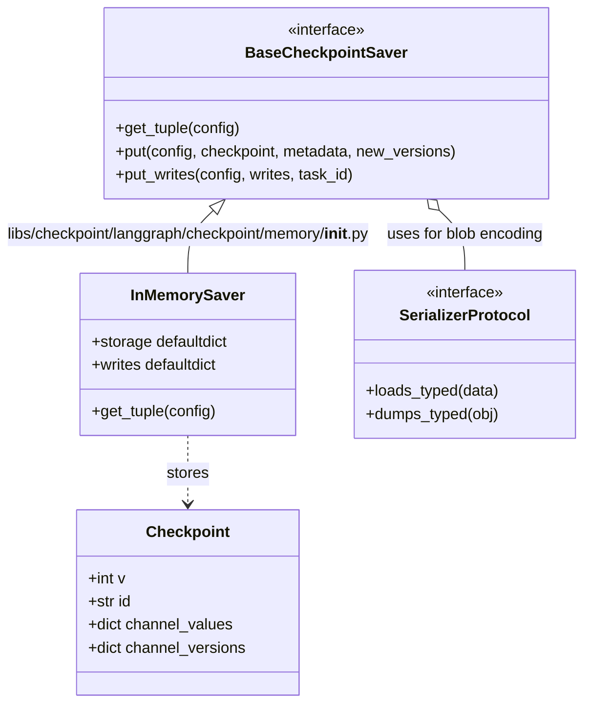
Sources: [libs/checkpoint/langgraph/checkpoint/base/__init__.py:122-153](), [libs/checkpoint/langgraph/checkpoint/memory/__init__.py:31-75](), [libs/checkpoint/langgraph/checkpoint/base/__init__.py:65-88]()

**Sources**:
- [libs/checkpoint/langgraph/checkpoint/base/__init__.py]()
- [libs/checkpoint/langgraph/checkpoint/memory/__init__.py]()
- [libs/checkpoint/pyproject.toml]()

# Checkpointing Architecture


## Purpose and Scope

This document describes the checkpointing architecture that enables LangGraph's durable, stateful execution. Checkpoints capture the complete state of a graph at specific points in time, enabling persistence, resumability, time-travel debugging, and human-in-the-loop workflows.

This page covers the checkpoint data model (`Checkpoint`, `CheckpointTuple`, `CheckpointMetadata`), the `BaseCheckpointSaver` abstract interface (`get_tuple`, `list`, `put`, `put_writes`, `delete_thread` and their async counterparts), and how the Pregel execution loop interacts with the checkpointer. For concrete implementations (InMemorySaver, SqliteSaver, PostgresSaver), see page 4.2. For serialization details, see page 4.4. For time-travel and state forking capabilities, see page 4.5.

---

## Core Data Structures

The checkpoint system is built around three primary data structures that work together to capture and restore graph state.

### Checkpoint TypedDict

The `Checkpoint` TypedDict [[libs/checkpoint/langgraph/checkpoint/base/__init__.py:65-97]]() represents a complete snapshot of graph state at a specific point in time.

**Checkpoint Structure Diagram**:
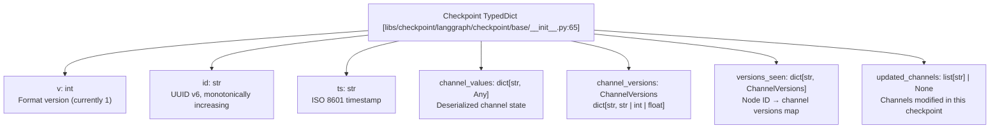
Sources: [[libs/checkpoint/langgraph/checkpoint/base/__init__.py:65-97]]()

**Checkpoint Structure Fields**:

| Field | Type | Description |
|-------|------|-------------|
| `v` | `int` | Checkpoint format version (currently `1`) [[libs/checkpoint/langgraph/checkpoint/base/__init__.py:68-69]]() |
| `id` | `str` | Unique identifier generated via `uuid6`, monotonically increasing [[libs/checkpoint/langgraph/checkpoint/base/__init__.py:70-74]]() |
| `ts` | `str` | Creation timestamp in ISO 8601 format [[libs/checkpoint/langgraph/checkpoint/base/__init__.py:75-76]]() |
| `channel_values` | `dict[str, Any]` | Deserialized state values indexed by channel name [[libs/checkpoint/langgraph/checkpoint/base/__init__.py:77-81]]() |
| `channel_versions` | `ChannelVersions` | Version identifier for each channel (str/int/float) [[libs/checkpoint/langgraph/checkpoint/base/__init__.py:82-87]]() |
| `versions_seen` | `dict[str, ChannelVersions]` | Maps node ID to channel versions that node has processed [[libs/checkpoint/langgraph/checkpoint/base/__init__.py:88-93]]() |
| `updated_channels` | `list[str] \| None` | List of channel names modified in this checkpoint [[libs/checkpoint/langgraph/checkpoint/base/__init__.py:94-96]]() |

The `id` field uses UUID v6 [[libs/checkpoint/langgraph/checkpoint/base/__init__.py:17]]() which is monotonically increasing, ensuring checkpoints can be sorted chronologically. The `versions_seen` mapping enables the Pregel algorithm to determine which nodes need execution by comparing against `channel_versions`.

Sources: [[libs/checkpoint/langgraph/checkpoint/base/__init__.py:65-97]](), [[libs/checkpoint/langgraph/checkpoint/base/__init__.py:17]]()

### CheckpointTuple NamedTuple

`CheckpointTuple` [[libs/checkpoint/langgraph/checkpoint/base/__init__.py:112-119]]() wraps a `Checkpoint` with its associated metadata and configuration.

**CheckpointTuple Relationship Diagram**:
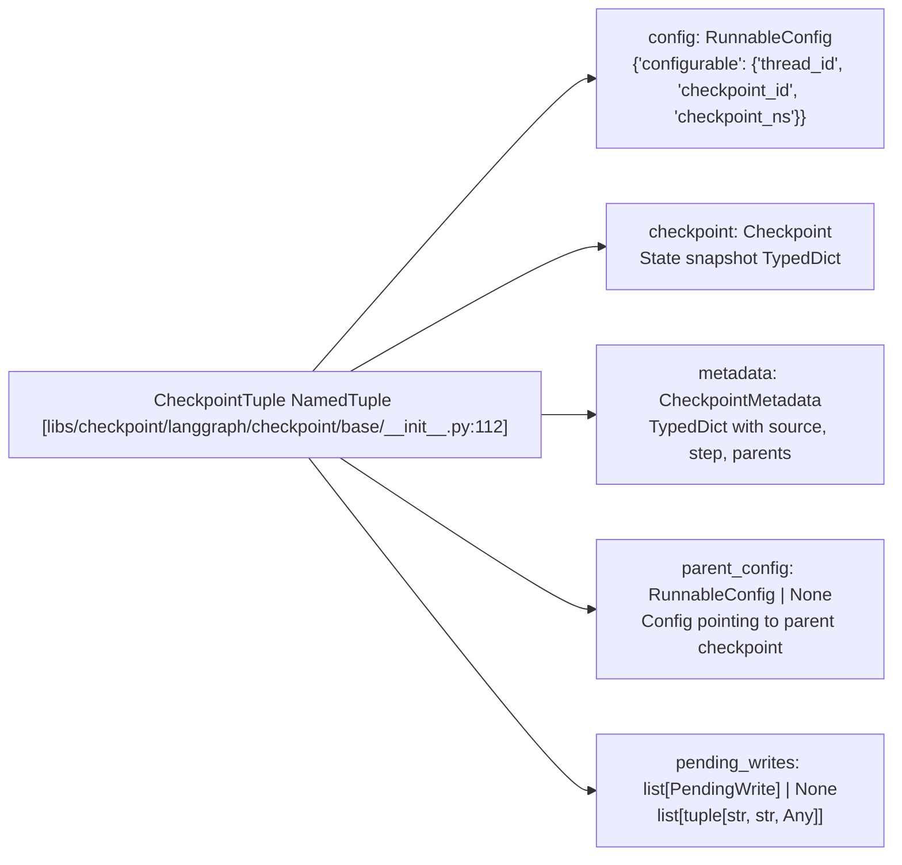
Sources: [[libs/checkpoint/langgraph/checkpoint/base/__init__.py:112-119]]()

**CheckpointTuple Fields**:

| Field | Type | Description |
|-------|------|-------------|
| `config` | `RunnableConfig` | Contains `configurable` dict with `thread_id`, `checkpoint_id`, `checkpoint_ns` [[libs/checkpoint/langgraph/checkpoint/base/__init__.py:115]]() |
| `checkpoint` | `Checkpoint` | Complete state snapshot TypedDict [[libs/checkpoint/langgraph/checkpoint/base/__init__.py:116]]() |
| `metadata` | `CheckpointMetadata` | Metadata TypedDict with `source`, `step`, `parents`, and custom fields [[libs/checkpoint/langgraph/checkpoint/base/__init__.py:117]]() |
| `parent_config` | `RunnableConfig \| None` | Config pointing to parent checkpoint (enables backward traversal) [[libs/checkpoint/langgraph/checkpoint/base/__init__.py:118]]() |
| `pending_writes` | `list[PendingWrite] \| None` | List of `(task_id, channel, value)` tuples not yet applied [[libs/checkpoint/langgraph/checkpoint/base/__init__.py:119]]() |

The `parent_config` field creates a linked list structure through checkpoint history. The `pending_writes` field (type alias `PendingWrite = tuple[str, str, Any]` from [[libs/checkpoint/langgraph/checkpoint/base/__init__.py:30]]()) contains writes recorded via `put_writes()` but not yet incorporated into `channel_values`.

Sources: [[libs/checkpoint/langgraph/checkpoint/base/__init__.py:112-119]](), [[libs/checkpoint/langgraph/checkpoint/base/__init__.py:30]]()

### CheckpointMetadata TypedDict

`CheckpointMetadata` [[libs/checkpoint/langgraph/checkpoint/base/__init__.py:35-61]]() stores contextual information about how and why a checkpoint was created.

| Field | Type | Description |
|-------|------|-------------|
| `source` | `"input" \| "loop" \| "update" \| "fork"` | How the checkpoint was created [[libs/checkpoint/langgraph/checkpoint/base/__init__.py:38-45]]() |
| `step` | `int` | Step number (-1 for initial input, 0+ for execution steps) [[libs/checkpoint/langgraph/checkpoint/base/__init__.py:46-52]]() |
| `parents` | `dict[str, str]` | Parent checkpoint IDs by namespace (for nested graphs) [[libs/checkpoint/langgraph/checkpoint/base/__init__.py:53-57]]() |
| `run_id` | `str` | The ID of the run that created this checkpoint [[libs/checkpoint/langgraph/checkpoint/base/__init__.py:58-59]]() |

Sources: [[libs/checkpoint/langgraph/checkpoint/base/__init__.py:35-61]]()

The `source` field distinguishes checkpoints created from initial input (`"input"`), during execution loops (`"loop"`), from manual state updates (`"update"`), or from forking existing checkpoints (`"fork"`). 

---

## BaseCheckpointSaver Interface

The `BaseCheckpointSaver` abstract class [[libs/checkpoint/langgraph/checkpoint/base/__init__.py:122]]() defines the contract that all checkpoint implementations must fulfill. It provides both synchronous and asynchronous methods for checkpoint persistence and retrieval.

### Core Methods

**`BaseCheckpointSaver` Functional Map**:
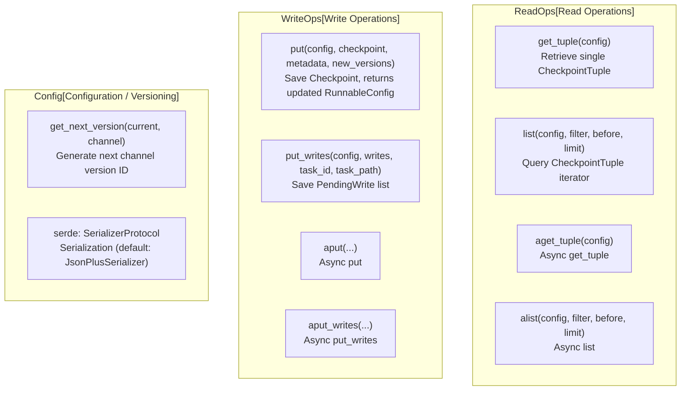
Sources: [[libs/checkpoint/langgraph/checkpoint/base/__init__.py:122-396]]()

#### Retrieval Pattern

`get_tuple(config)` resolves a checkpoint from a `RunnableConfig`. Two lookup modes are supported based on whether `checkpoint_id` is present in `config["configurable"]`:

- **With `checkpoint_id`**: retrieves the exact checkpoint matching `(thread_id, checkpoint_ns, checkpoint_id)` [[libs/checkpoint/langgraph/checkpoint/base/__init__.py:185-186]]().
- **Without `checkpoint_id`**: retrieves the latest checkpoint for the given `(thread_id, checkpoint_ns)`.

The convenience method `get(config)` [[libs/checkpoint/langgraph/checkpoint/base/__init__.py:173]]() delegates to `get_tuple()` and returns just the `Checkpoint` dict.

`list(config, filter, before, limit)` [[libs/checkpoint/langgraph/checkpoint/base/__init__.py:199]]() returns an iterator of `CheckpointTuple` objects, ordered newest-first. The `filter` parameter accepts a dict of metadata fields to match. The `before` parameter accepts a config with a `checkpoint_id` to return only older checkpoints [[libs/checkpoint/langgraph/checkpoint/base/__init__.py:202-205]]().

Sources: [[libs/checkpoint/langgraph/checkpoint/base/__init__.py:173-215]]()

#### Persistence Pattern

`put(config, checkpoint, metadata, new_versions)` [[libs/checkpoint/langgraph/checkpoint/base/__init__.py:221]]() saves a `Checkpoint` snapshot and returns an updated `RunnableConfig`. The `new_versions` dict maps channel names to their new version identifiers.

`put_writes(config, writes, task_id, task_path)` [[libs/checkpoint/langgraph/checkpoint/base/__init__.py:243]]() saves a list of `PendingWrite` tuples associated with a specific task execution. These writes are stored separately and surfaced as `pending_writes` on the next `get_tuple()` call.

Sources: [[libs/checkpoint/langgraph/checkpoint/base/__init__.py:221-259]]()

---

## Storage Model and Conformance

Checkpoint implementations must follow a specific storage logic to support LangGraph's state management features.

### Implementation Requirements

All checkpointers must support:
1.  **Monotonic Ordering**: Checkpoints for a thread must be retrievable in reverse chronological order via `list()` [[libs/checkpoint-conformance/langgraph/checkpoint/conformance/spec/test_list.py:96-106]]().
2.  **Metadata Filtering**: Ability to filter checkpoints by metadata keys like `source` or `step` [[libs/checkpoint-conformance/langgraph/checkpoint/conformance/spec/test_list.py:109-142]]().
3.  **Pagination**: Using the `before` parameter to fetch checkpoints older than a specific ID [[libs/checkpoint-conformance/langgraph/checkpoint/conformance/spec/test_list.py:144-164]]().
4.  **Pending Writes**: Correctly storing and retrieving writes associated with a checkpoint that have not yet been reduced into the state [[libs/checkpoint-conformance/langgraph/checkpoint/conformance/spec/test_list.py:231-232]]().

Sources: [[libs/checkpoint-conformance/langgraph/checkpoint/conformance/spec/test_list.py:1-232]]()

### Special Write Index Values

When storing writes via `put_writes`, certain index values carry special meaning for the Pregel engine:

| Constant | Index | Meaning |
|----------|-------|---------|
| `ERROR` | `-1` | Node error write [[libs/checkpoint/langgraph/checkpoint/serde/types.py:22]]() |
| `SCHEDULED` | `-2` | Scheduled task write [[libs/checkpoint/langgraph/checkpoint/serde/types.py:25]]() |
| `INTERRUPT` | `-3` | Interrupt write [[libs/checkpoint/langgraph/checkpoint/serde/types.py:23]]() |
| `RESUME` | `-4` | Resume value write [[libs/checkpoint/langgraph/checkpoint/serde/types.py:24]]() |

Sources: [[libs/checkpoint/langgraph/checkpoint/serde/types.py:21-27]](), [[libs/checkpoint/langgraph/checkpoint/base/__init__.py:17]]()

---

## Checkpoint Lifecycle

Checkpoints flow through a lifecycle as graphs execute, with version tracking ensuring consistent state evolution.

### Creation and Versioning

**Checkpoint Creation Sequence**:
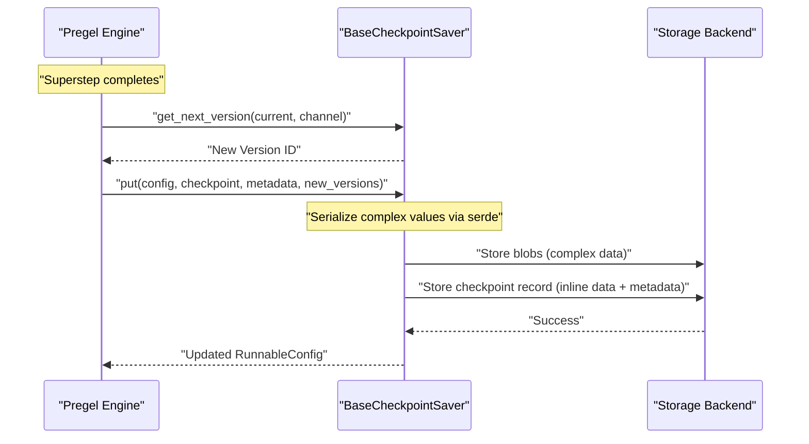
Sources: [[libs/checkpoint/langgraph/checkpoint/base/__init__.py:221-241]](), [[libs/checkpoint/langgraph/checkpoint/memory/__init__.py:123-133]]()

Channel versions are generated by `get_next_version(current, channel)` defined on the checkpointer. The base class provides a default implementation that increments integer versions or generates new strings.

### Pending Writes Lifecycle

Pending writes flow through a two-phase process:

1.  **Phase 1 (Task Execution)**: Node tasks record outputs via `put_writes()`. These are stored in a temporary "writes" table or dictionary [[libs/checkpoint/langgraph/checkpoint/memory/__init__.py:72-75]]().
2.  **Phase 2 (Next Checkpoint)**: When the next checkpoint is loaded via `get_tuple()`, the `pending_writes` are retrieved [[libs/checkpoint/langgraph/checkpoint/memory/__init__.py:165-167]](). The Pregel loop applies these writes to the channels to move state forward.

Sources: [[libs/checkpoint/langgraph/checkpoint/memory/__init__.py:151-179]]()

---

## Implementation Variants

LangGraph provides multiple checkpoint implementations with different performance and durability characteristics.

**Checkpoint Implementation Summary**:

| Class | Module | Storage | Persistence | Concurrency |
|-------|--------|---------|-------------|-------------|
| `InMemorySaver` | `langgraph.checkpoint.memory` | `defaultdict` | None (process lifetime) | Sync + async [[libs/checkpoint/langgraph/checkpoint/memory/__init__.py:31]]() |
| `SqliteSaver` | `langgraph.checkpoint.sqlite` | SQLite file | File-based | Sync only |
| `AsyncSqliteSaver` | `langgraph.checkpoint.sqlite.aio` | SQLite via `aiosqlite` | File-based | Async |
| `PostgresSaver` | `langgraph.checkpoint.postgres` | PostgreSQL | Durable | Sync + pipeline |
| `AsyncPostgresSaver` | `langgraph.checkpoint.postgres.aio` | PostgreSQL | Durable | Async + pipeline |

The `InMemorySaver` is intended for debugging and testing purposes [[libs/checkpoint/langgraph/checkpoint/memory/__init__.py:38-40]](). It uses three internal storage structures: `storage` for checkpoints, `writes` for pending writes, and `blobs` for serialized channel values [[libs/checkpoint/langgraph/checkpoint/memory/__init__.py:66-81]]().

Sources: [[libs/checkpoint/langgraph/checkpoint/memory/__init__.py:31-81]]()

---

## Summary

The checkpointing architecture provides the foundation for LangGraph's durability through:

-   **Structured Data Model**: `Checkpoint` and `CheckpointTuple` capture execution state precisely.
-   **Abstract Interface**: `BaseCheckpointSaver` allows swapping backends (Memory, SQLite, Postgres).
-   **Decoupled Writes**: Separation of task output recording (`put_writes`) from state application (`put`) to support interrupts and error handling.
-   **Monotonic Versioning**: Monotonically increasing checkpoint and channel IDs for sorting and conflict resolution.

This architecture enables advanced features like time-travel debugging, human-in-the-loop review, and fault-tolerant execution.

# Checkpoint Implementations


This document describes the concrete implementations of the checkpoint persistence layer. These implementations provide different storage backends for saving and retrieving graph execution state, including PostgreSQL, SQLite, and in-memory options.

For the abstract checkpoint interface and base concepts, see page **4.1** (Checkpointing Architecture). For serialization of checkpoint data, see page **4.4** (Serialization).

---

## Overview

LangGraph provides multiple checkpoint saver implementations, each suited for different use cases:

| Implementation | Module | Async Support | Production Ready | Use Case |
|---|---|---|---|---|
| `PostgresSaver` | `langgraph.checkpoint.postgres` | Yes (`AsyncPostgresSaver`) | ✓ | Production workloads, full history |
| `SqliteSaver` | `langgraph.checkpoint.sqlite` | Yes (`AsyncSqliteSaver`) | Limited | Local development, small projects |
| `InMemorySaver` | `langgraph.checkpoint.memory` | Yes (native async) | ✗ | Testing, debugging |
| `ShallowPostgresSaver` / `AsyncShallowPostgresSaver` | `langgraph.checkpoint.postgres.shallow` | Yes | Deprecated | Replaced by `durability='exit'` mode |

All implementations inherit from `BaseCheckpointSaver` [libs/checkpoint/langgraph/checkpoint/base/__init__.py:122-155]() and must implement the following core methods:
- `get_tuple()` / `aget_tuple()` - Retrieve a checkpoint [libs/checkpoint/langgraph/checkpoint/base/__init__.py:185-197]()
- `list()` / `alist()` - List checkpoints with filtering [libs/checkpoint/langgraph/checkpoint/base/__init__.py:199-231]()
- `put()` / `aput()` - Save a checkpoint [libs/checkpoint/langgraph/checkpoint/base/__init__.py:233-261]()
- `put_writes()` / `aput_writes()` - Save intermediate writes [libs/checkpoint/langgraph/checkpoint/base/__init__.py:263-286]()

**Sources:** [libs/checkpoint/langgraph/checkpoint/base/__init__.py:122-286](), [libs/checkpoint-postgres/langgraph/checkpoint/postgres/__init__.py:32-35](), [libs/checkpoint-sqlite/langgraph/checkpoint/sqlite/__init__.py:38-47](), [libs/checkpoint/langgraph/checkpoint/memory/__init__.py:31-64]()

---

## PostgreSQL Implementation

### Class Hierarchy

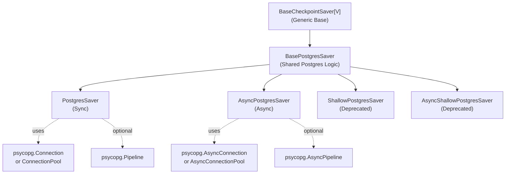

**Sources:** [libs/checkpoint-postgres/langgraph/checkpoint/postgres/base.py:156-165](), [libs/checkpoint-postgres/langgraph/checkpoint/postgres/__init__.py:32-53](), [libs/checkpoint-postgres/langgraph/checkpoint/postgres/aio.py:32-54](), [libs/checkpoint-postgres/langgraph/checkpoint/postgres/shallow.py:169-183]()

### Database Schema

The PostgreSQL implementation uses several tables to store checkpoint data, optimized to handle both small primitive values and large binary objects:

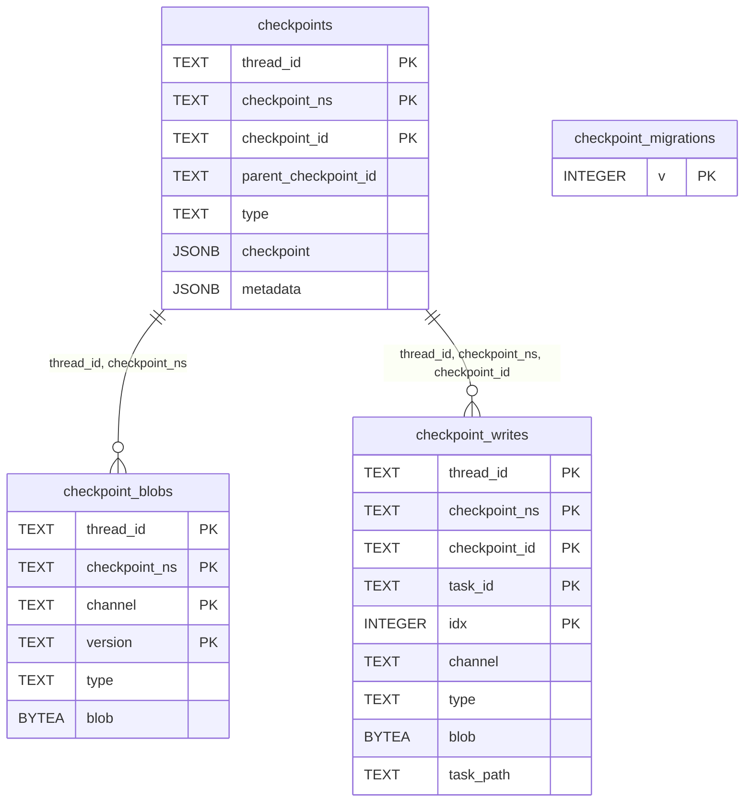

The schema is designed with two key optimizations:

1. **Blob Separation**: The `checkpoints` table stores the checkpoint structure as JSONB [libs/checkpoint-postgres/langgraph/checkpoint/postgres/base.py:41-50](), but complex channel values are stored in the `checkpoint_blobs` table [libs/checkpoint-postgres/langgraph/checkpoint/postgres/base.py:51-59]().
2. **Write Separation**: The `checkpoint_writes` table stores intermediate task outputs separately, allowing the system to handle multi-step execution and pending writes [libs/checkpoint-postgres/langgraph/checkpoint/postgres/base.py:60-70]().

**Sources:** [libs/checkpoint-postgres/langgraph/checkpoint/postgres/base.py:37-85]()

### PostgresSaver

The synchronous `PostgresSaver` class provides checkpoint persistence using psycopg3's synchronous API.

#### Connection Modes

The implementation supports multiple connection modes [libs/checkpoint-postgres/langgraph/checkpoint/postgres/__init__.py:37-53]():

| Mode | Connection Type | Use Case |
|---|---|---|
| Single Connection | `psycopg.Connection` | Simple applications |
| Connection Pool | `psycopg_pool.ConnectionPool` | Multi-threaded apps |
| Pipeline Mode | `psycopg.Pipeline` | High throughput batching |

```python
# Single connection with context manager
with PostgresSaver.from_conn_string(conn_string) as saver:
    saver.setup()
    
# With pipeline
with PostgresSaver.from_conn_string(conn_string, pipeline=True) as saver:
    saver.setup()
```

**Sources:** [libs/checkpoint-postgres/langgraph/checkpoint/postgres/__init__.py:54-76]()

#### Migration System

The PostgreSQL implementation includes a versioned migration system [libs/checkpoint-postgres/langgraph/checkpoint/postgres/base.py:37-85](). The `setup()` method automatically runs any pending migrations tracked in `checkpoint_migrations` [libs/checkpoint-postgres/langgraph/checkpoint/postgres/__init__.py:77-102]().

#### Key Operations

**Checkpoint Retrieval (get_tuple)**
The `get_tuple()` method [libs/checkpoint-postgres/langgraph/checkpoint/postgres/__init__.py:184-253]() queries the `checkpoints` table. It uses a complex `SELECT_SQL` query [libs/checkpoint-postgres/langgraph/checkpoint/postgres/base.py:87-112]() that joins with `checkpoint_blobs` to reconstruct the full state.

**Checkpoint Storage (put)**
The `put()` method [libs/checkpoint-postgres/langgraph/checkpoint/postgres/__init__.py:255-334]() performs an upsert. It extracts channel values and stores them using `UPSERT_CHECKPOINT_BLOBS_SQL` [libs/checkpoint-postgres/langgraph/checkpoint/postgres/base.py:125-129]() and `UPSERT_CHECKPOINTS_SQL` [libs/checkpoint-postgres/langgraph/checkpoint/postgres/base.py:131-138]().

**Sources:** [libs/checkpoint-postgres/langgraph/checkpoint/postgres/base.py:87-147](), [libs/checkpoint-postgres/langgraph/checkpoint/postgres/__init__.py:184-334]()

---

## SQLite Implementation

### SqliteSaver

The `SqliteSaver` class provides a lightweight checkpoint implementation using SQLite [libs/checkpoint-sqlite/langgraph/checkpoint/sqlite/__init__.py:38-73]().

#### Schema

The SQLite schema is simpler than Postgres, using two primary tables: `checkpoints` and `writes` [libs/checkpoint-sqlite/langgraph/checkpoint/sqlite/__init__.py:135-157]().

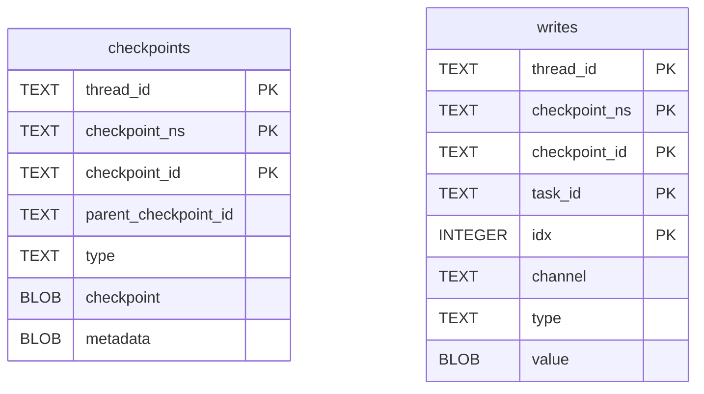

#### Thread Safety
`SqliteSaver` uses a `threading.Lock` [libs/checkpoint-sqlite/langgraph/checkpoint/sqlite/__init__.py:88]() to ensure thread-safe access to the database connection, as SQLite's write performance is limited in multi-threaded environments [libs/checkpoint-sqlite/langgraph/checkpoint/sqlite/__init__.py:41-44]().

**Sources:** [libs/checkpoint-sqlite/langgraph/checkpoint/sqlite/__init__.py:132-157](), [libs/checkpoint-sqlite/langgraph/checkpoint/sqlite/__init__.py:161-182]()

### AsyncSqliteSaver

The `AsyncSqliteSaver` class provides async support using `aiosqlite` [libs/checkpoint-sqlite/langgraph/checkpoint/sqlite/aio.py:31-44]().

```python
async with AsyncSqliteSaver.from_conn_string("checkpoints.db") as saver:
    graph = builder.compile(checkpointer=saver)
    # ... execution ...
```

**Sources:** [libs/checkpoint-sqlite/langgraph/checkpoint/sqlite/aio.py:124-138]()

---

## InMemory Implementation

### InMemorySaver

The `InMemorySaver` class stores checkpoints in memory using nested `defaultdict` structures [libs/checkpoint/langgraph/checkpoint/memory/__init__.py:31-64]().

#### Storage Structure

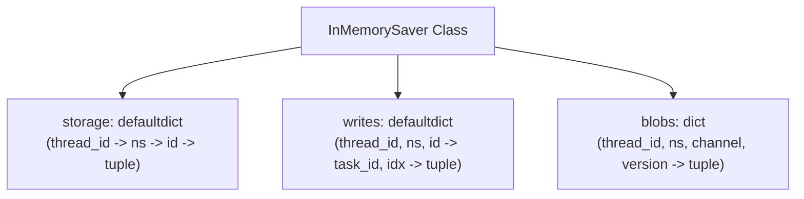

The internal storage [libs/checkpoint/langgraph/checkpoint/memory/__init__.py:67-81]() maps:
- `storage`: Maps thread and namespace to checkpoint data.
- `writes`: Maps checkpoint IDs to task writes.
- `blobs`: Maps channel versions to serialized data.

**Sources:** [libs/checkpoint/langgraph/checkpoint/memory/__init__.py:66-92]()

#### Usage and Persistence
While primarily for testing, it can be made persistent using the `PersistentDict` factory [libs/checkpoint/langgraph/checkpoint/memory/__init__.py:533-604](), which pickles the data to disk.

---

## Implementation Comparison

### Feature Matrix

| Feature | PostgresSaver | SqliteSaver | InMemorySaver |
|---|---|---|---|
| **Backend** | PostgreSQL | SQLite | Memory (RAM) |
| **Async Support** | Native (`AsyncPostgresSaver`) | Native (`AsyncSqliteSaver`) | Native |
| **Durability** | High | Medium | Low (Process life) |
| **Blob Handling** | Separate Table | Inline BLOB | Dictionary |
| **Time Travel** | Supported | Supported | Supported |

### Code Entity Association

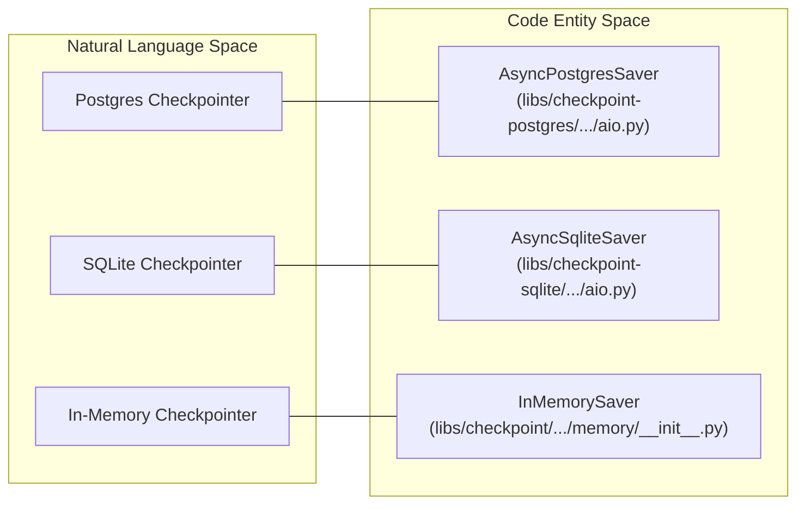

**Sources:** [libs/checkpoint-postgres/langgraph/checkpoint/postgres/aio.py:32-33](), [libs/checkpoint-sqlite/langgraph/checkpoint/sqlite/aio.py:31-32](), [libs/checkpoint/langgraph/checkpoint/memory/__init__.py:31-34]()

### Summary of Deprecations
`ShallowPostgresSaver` and `AsyncShallowPostgresSaver` are deprecated as of version 2.0.20 [libs/checkpoint-postgres/langgraph/checkpoint/postgres/shallow.py:192-197](). Users are encouraged to use `PostgresSaver` with the `durability='exit'` configuration during graph invocation.

**Sources:** [libs/checkpoint-postgres/langgraph/checkpoint/postgres/shallow.py:169-197]()