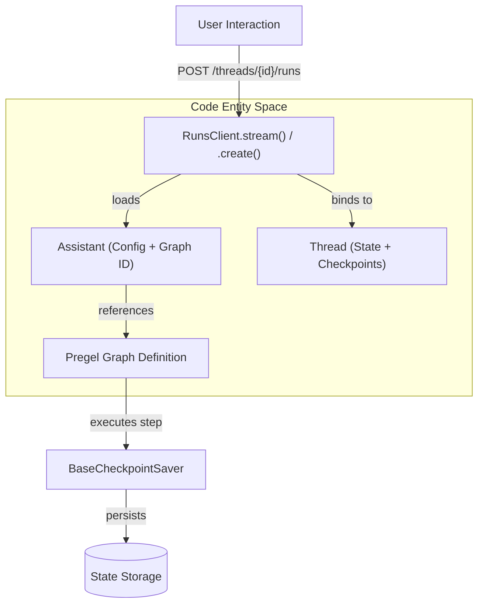
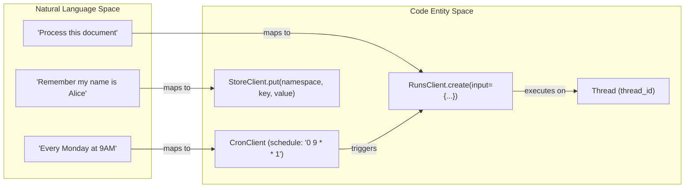

The LangGraph Server API provides a structured interface for deploying, managing, and executing stateful multi-actor applications. It abstracts the underlying graph execution engine into a set of RESTful resources: **Assistants**, **Threads**, **Runs**, **Cron Jobs**, and a persistent **Store**.

This API is designed to handle the complexities of long-running agentic workflows, including state persistence, human-in-the-loop interactions, and background scheduling.

## API Resource Overview

The Server API is organized around five primary resource types, each managed by dedicated clients in the [langgraph-sdk](libs/sdk-py/pyproject.toml:6-14).

| Resource | Purpose | Code Entity |
| :--- | :--- | :--- |
| **Assistant** | Versioned configurations of a graph, including specific parameters and metadata. | `AssistantsClient` [libs/sdk-py/langgraph_sdk/_async/assistants.py:28-40]() |
| **Thread** | Stateful sessions that persist the progress of a conversation or task across multiple runs. | `ThreadsClient` [libs/sdk-py/langgraph_sdk/_async/threads.py:27-40]() |
| **Run** | An individual execution of an Assistant on a Thread, supporting various streaming modes. | `RunsClient` [libs/sdk-py/langgraph_sdk/_async/runs.py:55-67]() |
| **Cron** | Scheduled triggers that initiate Runs based on a defined frequency. | `CronClient` [libs/sdk-py/langgraph_sdk/client.py:17-17]() |
| **Store** | A cross-thread persistent document store for long-term memory and shared state. | `StoreClient` [libs/sdk-py/langgraph_sdk/client.py:20-20]() |

**Sources:**
- [libs/sdk-py/langgraph_sdk/client.py:1-32]()
- [libs/sdk-py/langgraph_sdk/schema.py:1-109]()

## Lifecycle and Execution Flow

The following diagram illustrates how natural language interactions map to the underlying code entities and API resources during a typical execution lifecycle.

### From Interaction to Execution

**Sources:**
- [libs/sdk-py/langgraph_sdk/_async/runs.py:73-102]()
- [libs/sdk-py/langgraph_sdk/_async/assistants.py:45-88]()
- [libs/sdk-py/langgraph_sdk/_async/threads.py:45-96]()

## Core Resources

### Assistants and Threads
**Assistants** act as templates or deployments. They wrap a specific `graph_id` with a set of `config` parameters and `metadata` [libs/sdk-py/langgraph_sdk/schema.py:246-261](). This allows developers to deploy multiple "personalities" or configurations of the same underlying graph.

**Threads** provide the context for stateful execution. A thread maintains a history of checkpoints, allowing an agent to "remember" previous interactions. The `ThreadsClient` manages thread creation, state updates, and history retrieval [libs/sdk-py/langgraph_sdk/_async/threads.py:98-173]().

For details, see [Assistants and Threads](#7.1).

### Runs
A **Run** is the active execution of an assistant. The API supports both stateful runs (associated with a thread) and stateless runs. Execution can be monitored via Server-Sent Events (SSE) using various `StreamMode` options such as `values`, `updates`, `messages`, or `debug` [libs/sdk-py/langgraph_sdk/schema.py:51-72]().

The `RunsClient` provides methods for:
- `stream`: Real-time execution with event streaming [libs/sdk-py/langgraph_sdk/_async/runs.py:73-102]().
- `create`: Background execution [libs/sdk-py/langgraph_sdk/_async/runs.py:311-330]().
- `wait`: Blocking execution that returns the final state [libs/sdk-py/langgraph_sdk/_async/runs.py:421-440]().

For details, see [Runs](#7.2).

### Cron Jobs
**Cron Jobs** automate graph execution. They allow users to schedule runs on a specific thread or for a specific assistant using standard cron syntax [libs/sdk-py/tests/test_crons_client.py:100-128](). This is useful for periodic tasks like daily summaries or automated health checks.

For details, see [Cron Jobs](#7.3).

### Store API
The **Store** is a specialized resource for persistent, cross-thread memory. Unlike Thread state, which is local to a specific conversation, the Store allows agents to persist information (like user preferences or global knowledge) that can be accessed across different threads and assistants [libs/sdk-py/langgraph_sdk/client.py:20-20]().

For details, see [Store API](#7.4).

## System Architecture Mapping

The following diagram bridges the high-level API concepts to the internal server-side components used to process requests.

### API to System Mapping

**Sources:**
- [libs/sdk-py/langgraph_sdk/client.py:1-32]()
- [libs/sdk-py/langgraph_sdk/schema.py:166-178]()
- [libs/sdk-py/tests/test_crons_client.py:34-62]()