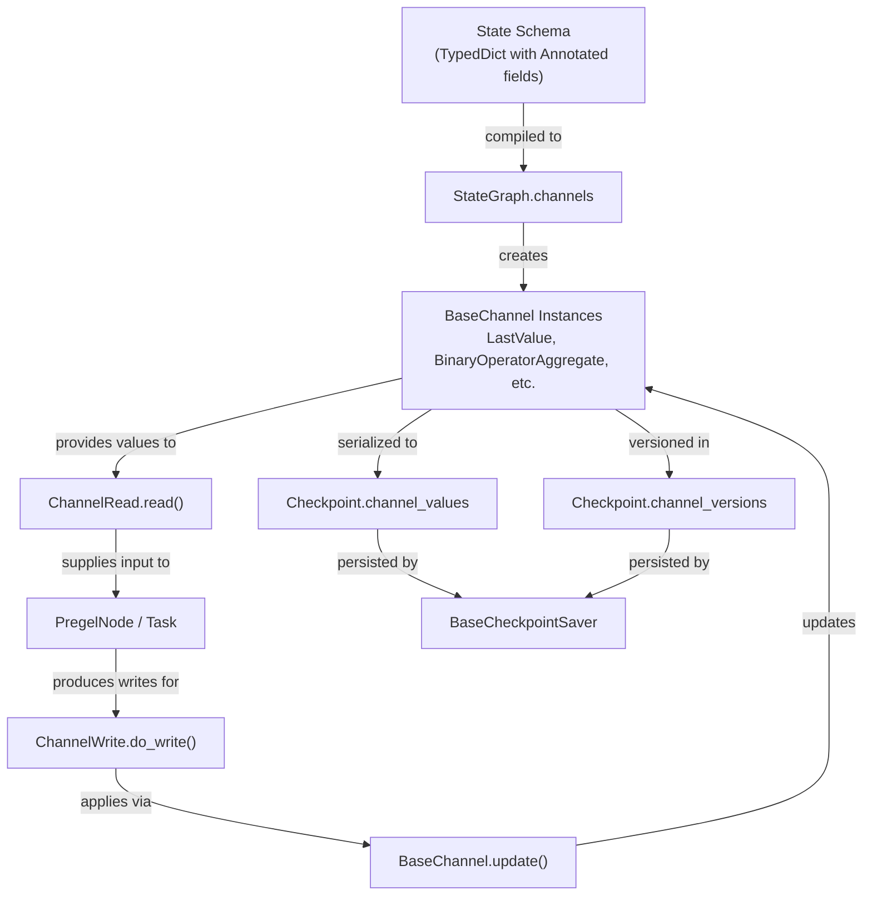
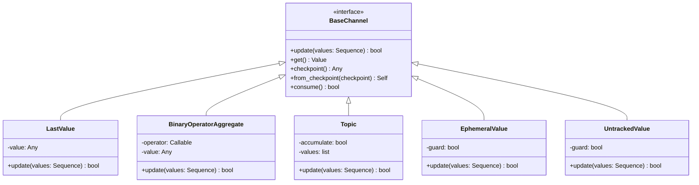
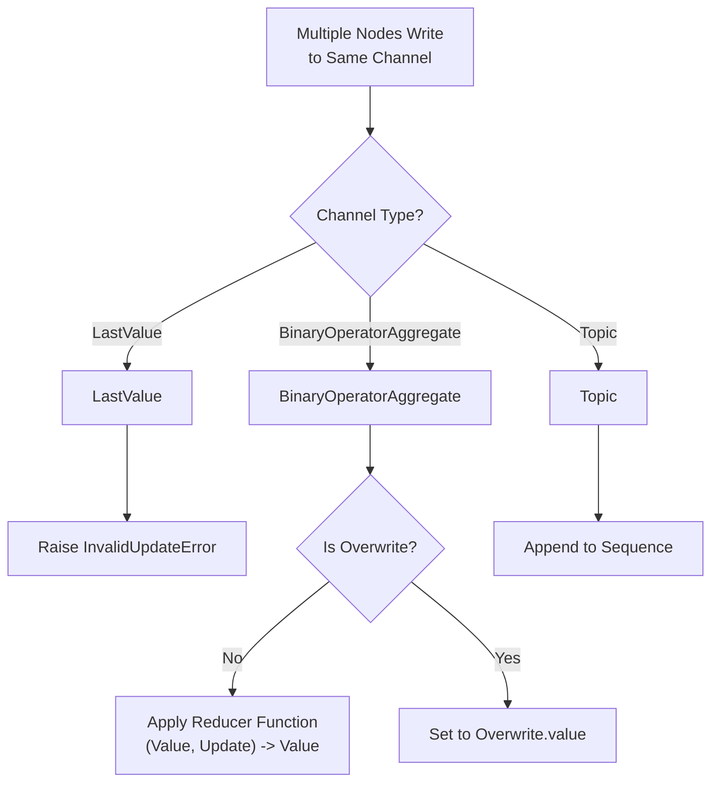

## Purpose and Scope

This document describes LangGraph's channel system, which provides the core state management primitives for graphs. Channels control how state flows between nodes, how concurrent updates are resolved, and how state persists across graph executions.

For information about the StateGraph API that uses channels, see [StateGraph API](3.1). For information about checkpointing and state persistence, see [Checkpointing Architecture](4.1). For control flow primitives that interact with state, see [Control Flow Primitives](3.5).

## Channel System Overview

Channels are the fundamental abstraction for state management in LangGraph. Each key in a graph's state schema maps to a channel that governs how that key's value is read, updated, and persisted.

### Channels in the Execution Architecture

The diagram below illustrates how state defined in a schema is transformed into runtime `BaseChannel` instances and managed by the `Pregel` loop.



**Sources:** [libs/langgraph/langgraph/graph/state.py:189-191](), [libs/langgraph/langgraph/pregel/_read.py:1-50](), [libs/langgraph/langgraph/pregel/_write.py:1-50](), [libs/langgraph/langgraph/checkpoint/base.py:28-32]()

### Channel Interface

All channels implement the `BaseChannel` interface, which defines the lifecycle of state within a single superstep and across checkpoints.

- **`update(values)`**: Applies a sequence of updates to the channel [libs/langgraph/langgraph/channels/base.py:90-99]().
- **`get()`**: Retrieves the current value [libs/langgraph/langgraph/channels/base.py:70-73]().
- **`checkpoint()`**: Returns a serializable representation [libs/langgraph/langgraph/channels/base.py:49-59]().
- **`from_checkpoint(checkpoint)`**: Restores a new channel instance from a checkpoint [libs/langgraph/langgraph/channels/base.py:61-65]().



**Sources:** [libs/langgraph/langgraph/channels/base.py:19-122](), [libs/langgraph/langgraph/channels/last_value.py:15-20](), [libs/langgraph/langgraph/channels/binop.py:41-49](), [libs/langgraph/langgraph/channels/topic.py:10-20](), [libs/langgraph/langgraph/channels/ephemeral_value.py:11-20](), [libs/langgraph/langgraph/channels/untracked_value.py:15-25]()

## State Schema to Channel Mapping

`StateGraph` automatically converts state schemas into channels during compilation. It analyzes type hints to determine which channel type to use for each field [libs/langgraph/langgraph/graph/state.py:115-184]().

### Mapping Rules

| State Schema Type | Channel Type | Behavior |
|-------------------|--------------|----------|
| `str`, `int`, `SomeClass` | `LastValue` | Replaces value on each update [libs/langgraph/langgraph/channels/last_value.py:49-60](). |
| `Annotated[T, reducer]` | `BinaryOperatorAggregate` | Applies reducer function to merge updates [libs/langgraph/langgraph/channels/binop.py:102-123](). |
| `list` without annotation | `LastValue` | Replaces entire list. |
| `Annotated[list, operator.add]` | `BinaryOperatorAggregate` | Appends to list. |
| `Annotated[dict, operator.or_]` | `BinaryOperatorAggregate` | Merges dictionaries. |

### Example: Schema to Channel Conversion

```python
class State(TypedDict):
    name: str                                    # → LastValue(str)
    age: int                                     # → LastValue(int)
    messages: Annotated[list, operator.add]      # → BinaryOperatorAggregate(list, operator.add)
```

**Sources:** [libs/langgraph/langgraph/graph/state.py:158-166](), [libs/langgraph/tests/test_pregel.py:88-106]()

## Channel Types

### LastValue
Stores the most recent value. It raises an `InvalidUpdateError` if multiple nodes write to the same `LastValue` channel in a single step, ensuring deterministic state transitions [libs/langgraph/langgraph/channels/last_value.py:53-58]().

### BinaryOperatorAggregate (Reducers)
Uses a binary operator (reducer) to combine the current value with new updates. It supports the `Overwrite` primitive to bypass the reducer [libs/langgraph/langgraph/channels/binop.py:102-123]().

### Topic
Accumulates all values received into a list. If `accumulate=True`, it keeps history across steps; otherwise, it only contains values from the current step [libs/langgraph/langgraph/channels/topic.py:53-70]().

### EphemeralValue
Values are cleared after being consumed or after the superstep ends. Useful for transient signals or one-time triggers [libs/langgraph/langgraph/channels/ephemeral_value.py:52-65]().

### UntrackedValue
Stores values during execution but returns `MISSING` during `checkpoint()`. This prevents large or non-serializable data from being persisted [libs/langgraph/langgraph/channels/untracked_value.py:48-54]().

### NamedBarrierValue
Coordinates synchronization between multiple nodes. It waits for a specific set of named triggers to be fired before becoming available [libs/langgraph/langgraph/channels/named_barrier_value.py:65-85]().

**Sources:** [libs/langgraph/langgraph/channels/last_value.py:15-20](), [libs/langgraph/langgraph/channels/binop.py:41-49](), [libs/langgraph/langgraph/channels/topic.py:10-20](), [libs/langgraph/langgraph/channels/ephemeral_value.py:11-20](), [libs/langgraph/langgraph/channels/untracked_value.py:15-25](), [libs/langgraph/langgraph/channels/named_barrier_value.py:15-25]()

## Concurrent Updates and Reducers

Channels handle concurrent updates based on their internal logic:



**Sources:** [libs/langgraph/langgraph/channels/last_value.py:53-58](), [libs/langgraph/langgraph/channels/binop.py:102-123](), [libs/langgraph/langgraph/channels/topic.py:53-70]()

## The Overwrite Primitive

The `Overwrite` class allows a node to explicitly replace the state in a `BinaryOperatorAggregate` channel, ignoring the reducer [libs/langgraph/langgraph/types.py:80-80]().

- **Validation**: Only one `Overwrite` value can be received per super-step [libs/langgraph/langgraph/channels/binop.py:112-117]().
- **Behavior**: If an `Overwrite` is present, it becomes the new base value, and subsequent non-overwrite values in the same step are reduced into it [libs/langgraph/langgraph/channels/binop.py:118-122]().

**Sources:** [libs/langgraph/langgraph/types.py:80-80](), [libs/langgraph/langgraph/channels/binop.py:32-38](), [libs/langgraph/langgraph/channels/binop.py:110-123]()

## Channel Versioning

LangGraph tracks state changes using versioning. Every time a channel's `update()` method returns `True`, its version is incremented [libs/langgraph/langgraph/pregel/_loop.py:57-57]().

- **`ChannelVersions`**: A mapping of channel names to their current version [libs/langgraph/langgraph/checkpoint/base.py:29-29]().
- **Persistence**: These versions are stored in the checkpoint to ensure that nodes only trigger when their input channels have actually changed [libs/langgraph/langgraph/checkpoint/base.py:28-32]().

**Sources:** [libs/langgraph/langgraph/checkpoint/base.py:28-32](), [libs/langgraph/langgraph/pregel/_loop.py:57-57](), [libs/langgraph/tests/test_pregel.py:179-182]()