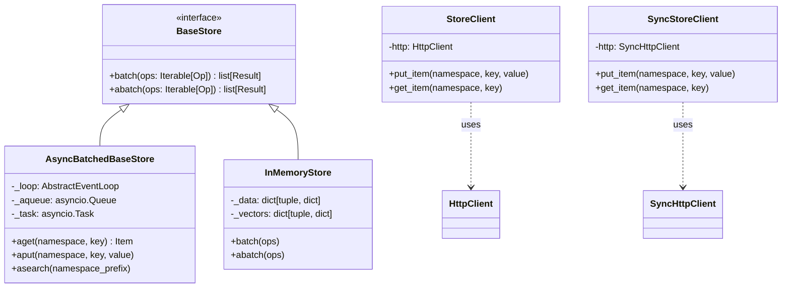
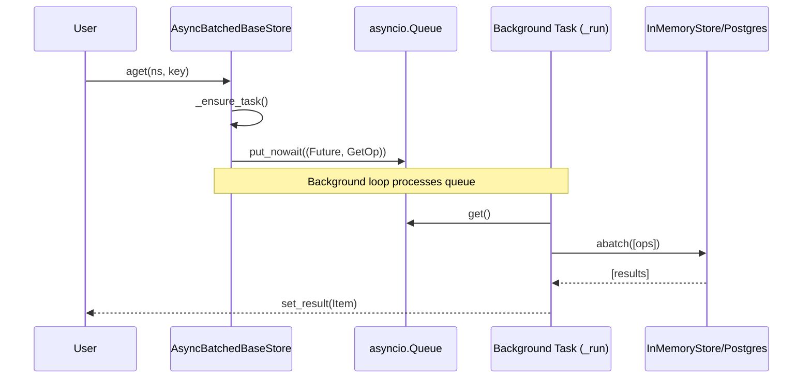

This page documents the Store API for cross-thread persistent storage. It covers the namespace model, core operations (`put`, `get`, `search`, `delete`, `list_namespaces`), data types, and implementation details for both synchronous and asynchronous backends.

---

## Architecture Overview

The Store system provides a unified interface for long-term memory that persists across different threads and conversations [libs/checkpoint/langgraph/store/base/__init__.py:1-10](). It supports hierarchical namespaces, key-value storage, and optional vector search [libs/checkpoint/langgraph/store/base/__init__.py:1-10]().

**Store Entity Relationship Diagram**

Sources: [libs/checkpoint/langgraph/store/base/__init__.py:7-10](), [libs/checkpoint/langgraph/store/base/batch.py:58-68](), [libs/checkpoint/langgraph/store/memory/__init__.py:136-190](), [libs/sdk-py/langgraph_sdk/_async/store.py:18-33](), [libs/sdk-py/langgraph_sdk/_sync/store.py:18-33]()

---

## Namespace Model

Items are organized into **namespaces**: ordered tuples of strings forming a hierarchical path [libs/checkpoint/langgraph/store/base/__init__.py:57-59]().

| Concept | Representation | Example |
|---|---|---|
| **Namespace** | `tuple[str, ...]` | `("documents", "user123")` |
| **Key** | `str` | `"profile_prefs"` |
| **Item** | `Item` object | Contains `value` (dict), `key`, and `namespace` |

Namespaces allow for nested categorization. For example, `("users", "123", "settings")` is distinct from `("users", "456", "settings")` [libs/checkpoint/langgraph/store/base/__init__.py:57-60](). Labels within a namespace cannot contain periods (`.`) when used via the SDK [libs/sdk-py/langgraph_sdk/_async/store.py:71-75]().

Sources: [libs/checkpoint/langgraph/store/base/__init__.py:51-115](), [libs/checkpoint/langgraph/store/base/batch.py:141-151](), [libs/sdk-py/langgraph_sdk/_async/store.py:71-75]()

---

## Data Models

### Item and SearchItem
The `Item` class represents a stored document with its metadata [libs/checkpoint/langgraph/store/base/__init__.py:51-52]().

| Field | Type | Description |
|---|---|---|
| `value` | `dict[str, Any]` | The actual stored data. Keys are filterable [libs/checkpoint/langgraph/store/base/__init__.py:55](). |
| `key` | `str` | Unique identifier within the namespace [libs/checkpoint/langgraph/store/base/__init__.py:56](). |
| `namespace` | `tuple[str, ...]` | Hierarchical path [libs/checkpoint/langgraph/store/base/__init__.py:57](). |
| `created_at` | `datetime` | Timestamp of creation [libs/checkpoint/langgraph/store/base/__init__.py:60](). |
| `updated_at` | `datetime` | Timestamp of last update [libs/checkpoint/langgraph/store/base/__init__.py:61](). |

`SearchItem` extends `Item` by adding a `score` field for relevance/similarity in vector searches [libs/checkpoint/langgraph/store/base/__init__.py:118-121]().

Sources: [libs/checkpoint/langgraph/store/base/__init__.py:51-155]()

---

## Core Operations

The API utilizes a batching pattern where operations are encapsulated as `Op` objects and processed together [libs/checkpoint/langgraph/store/base/__init__.py:9]().

### Operation Types

| Operation | Code Entity | Description |
|---|---|---|
| **Get** | `GetOp` | Retrieve an item by namespace and key [libs/checkpoint/langgraph/store/base/__init__.py:157-161](). |
| **Put** | `PutOp` | Create or update an item; `value=None` performs a delete [libs/checkpoint/langgraph/store/base/batch.py:160](). |
| **Search** | `SearchOp` | Query items using filters or natural language (vector search) [libs/checkpoint/langgraph/store/base/__init__.py:203-208](). |
| **List** | `ListNamespacesOp` | List available namespaces with prefix/suffix matching [libs/checkpoint/langgraph/store/base/__init__.py:310-315](). |

**Data Flow: Async Batched Operations**

Sources: [libs/checkpoint/langgraph/store/base/batch.py:58-101](), [libs/checkpoint/langgraph/store/base/batch.py:113-129](), [libs/checkpoint/langgraph/store/base/batch.py:189-230]()

---

## Vector Search and Indexing

Store implementations can optionally support semantic search using embeddings [libs/checkpoint/langgraph/store/base/embed.py:1-7]().

### Configuration
The `IndexConfig` defines how fields are embedded [libs/checkpoint/langgraph/store/memory/__init__.py:119]().

- **`dims`**: Dimensionality of the vector [libs/checkpoint/langgraph/store/memory/__init__.py:148]().
- **`embed`**: Embedding function (sync `EmbeddingsFunc` or async `AEmbeddingsFunc`) [libs/checkpoint/langgraph/store/base/embed.py:19-31]().
- **`fields`**: List of JSON paths in the `value` dict to index. Defaults to `["$"]` (the entire document) [libs/checkpoint/langgraph/store/memory/__init__.py:197-200]().

### Field Extraction
The `get_text_at_path` utility extracts strings from nested dictionaries for embedding [libs/checkpoint/langgraph/store/base/embed.py:32](). It supports dot notation (`info.age`), wildcards (`items[*].value`), and multi-field selection (`{name,info.age}`) [libs/checkpoint/tests/test_store.py:73-110]().

Sources: [libs/checkpoint/langgraph/store/base/embed.py:19-106](), [libs/checkpoint/langgraph/store/memory/__init__.py:183-205](), [libs/checkpoint/tests/test_store.py:73-140]()

---

## Implementation Details

### In-Memory (`InMemoryStore`)
Uses Python dictionaries for storage. It is suitable for testing or ephemeral data [libs/checkpoint/langgraph/store/memory/__init__.py:1-10]().

- **`_data`**: A `defaultdict` mapping `tuple[str, ...]` (namespace) to a dictionary of keys to `Item` objects [libs/checkpoint/langgraph/store/memory/__init__.py:186]().
- **`_vectors`**: A nested `defaultdict` storing float vectors for similarity search, indexed by `[namespace][key][path]` [libs/checkpoint/langgraph/store/memory/__init__.py:188-190]().
- **Batching**: `batch` and `abatch` methods handle the extraction of texts, generation of embeddings via `self.embeddings`, and application of operations [libs/checkpoint/langgraph/store/memory/__init__.py:206-224]().

### Remote Client (`StoreClient` / `SyncStoreClient`)
The SDK provides clients to interact with a LangGraph server's store over HTTP [libs/sdk-py/langgraph_sdk/_async/store.py:18-30]().

- **`put_item`**: Sends a `PUT` request to `/store/items` with a JSON payload containing namespace, key, and value [libs/sdk-py/langgraph_sdk/_async/store.py:35-85]().
- **`get_item`**: Sends a `GET` request to `/store/items` with query parameters [libs/sdk-py/langgraph_sdk/_async/store.py:87-142]().
- **`search_items`**: Sends a `POST` request to `/store/items/search` to perform filtering and semantic search [libs/sdk-py/langgraph_sdk/_async/store.py:180-218]().

Sources: [libs/checkpoint/langgraph/store/memory/__init__.py:136-224](), [libs/sdk-py/langgraph_sdk/_async/store.py:18-218](), [libs/sdk-py/langgraph_sdk/_sync/store.py:18-142]()

---

## TTL (Time-to-Live) Management

The Store API supports expiring items after a specific duration, defined in minutes [libs/sdk-py/langgraph_sdk/_async/store.py:42]().

1. **Setting TTL**: When calling `put` or `aput`, a `ttl` value can be provided. This is passed via `PutOp` to the backend [libs/checkpoint/langgraph/store/base/batch.py:148]().
2. **Refresh on Read**: `GetOp` and `SearchOp` include a `refresh_ttl` flag [libs/checkpoint/langgraph/store/base/__init__.py:194-203](). If `True`, the backend updates the expiration timestamp upon access [libs/checkpoint/langgraph/store/base/batch.py:97]().
3. **SDK Integration**: The `StoreClient` allows setting `ttl` during `put_item` and requesting `refresh_ttl` during `get_item` [libs/sdk-py/langgraph_sdk/_async/store.py:42, 93]().

Sources: [libs/checkpoint/langgraph/store/base/__init__.py:194-203](), [libs/checkpoint/langgraph/store/base/batch.py:97, 148](), [libs/sdk-py/langgraph_sdk/_async/store.py:42-93]()