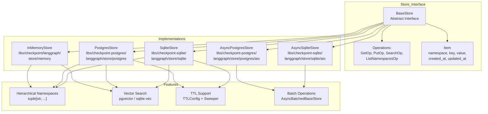
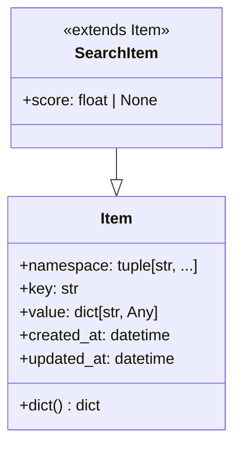
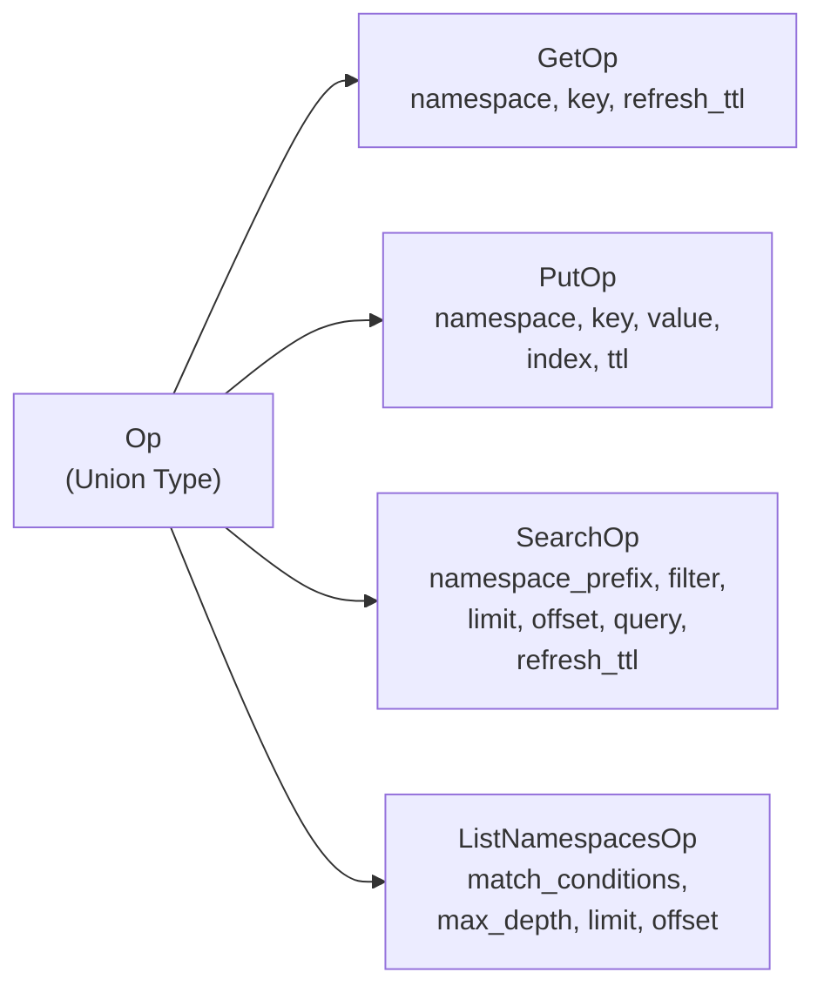
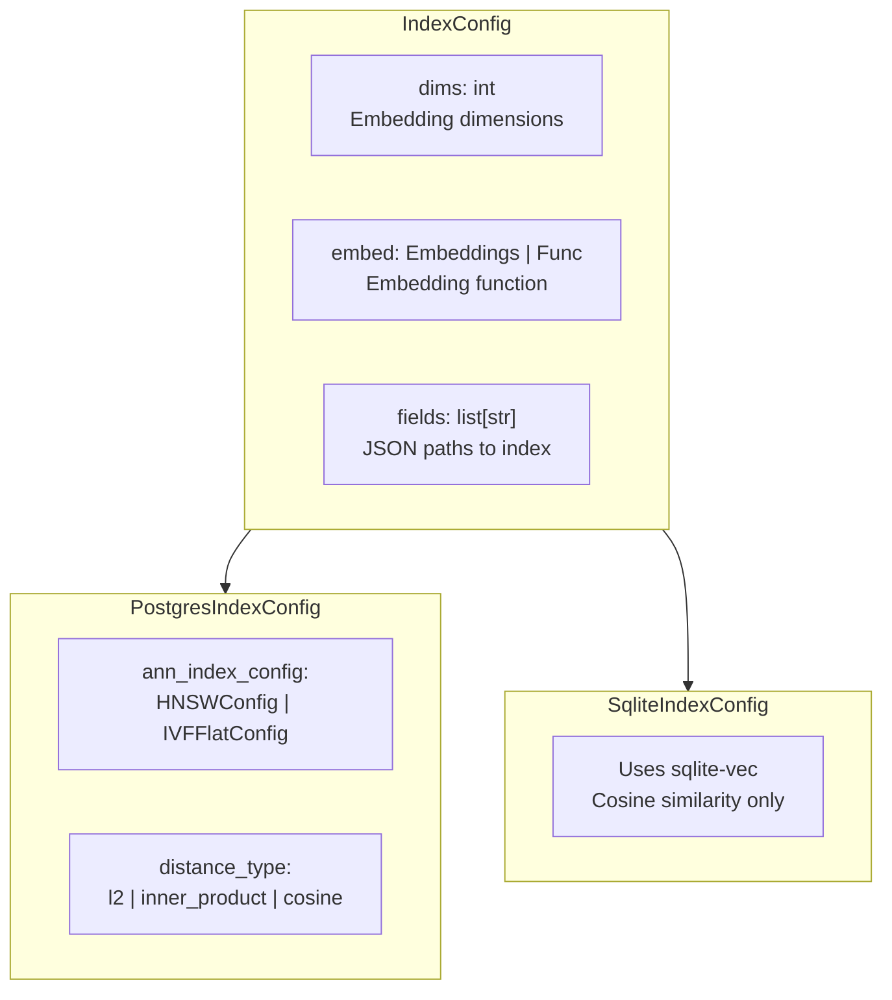
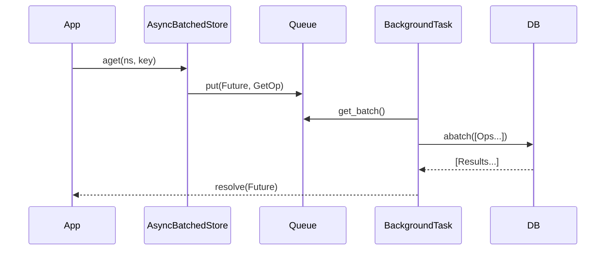
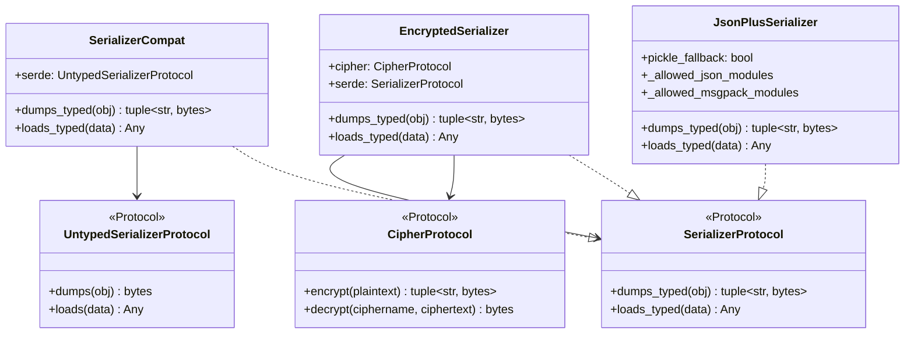
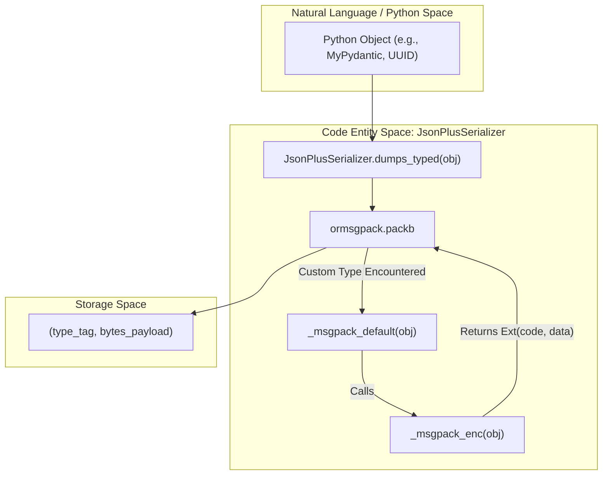
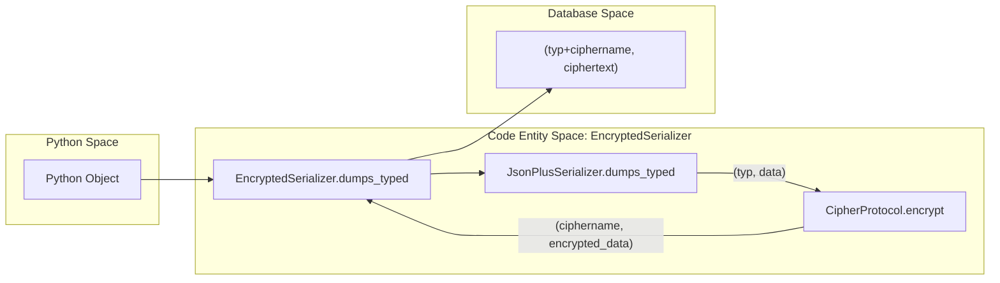

The Store System provides persistent key-value storage with hierarchical namespaces for LangGraph applications. It enables long-term memory that persists across threads and conversations, with optional vector search and TTL (time-to-live) capabilities.

**Scope**: This page covers the Store interface, operations, implementations, and data model. For graph state persistence via checkpointing, see [Checkpointing Architecture](4.1). For checkpoint implementations, see [Checkpoint Implementations](4.2). For serialization mechanisms, see [Serialization](4.4).

---

## Core Architecture

The Store System is built around a base interface with pluggable implementations supporting different storage backends, including PostgreSQL, SQLite, and In-Memory variants.

### Store System Overview

**Code Entity Mapping**:
- `BaseStore`: Abstract interface at [libs/checkpoint/langgraph/store/base/__init__.py:700-721]()
- `InMemoryStore`: In-memory implementation at [libs/checkpoint/langgraph/store/memory/__init__.py:136-174]()
- `PostgresStore`: PostgreSQL sync implementation at [libs/checkpoint-postgres/langgraph/store/postgres/base.py:640-716]()
- `SqliteStore`: SQLite sync implementation at [libs/checkpoint-sqlite/langgraph/store/sqlite/base.py:211-218]()
- `AsyncPostgresStore`: PostgreSQL async implementation with batching at [libs/checkpoint-postgres/langgraph/store/postgres/aio.py:42-118]()
- `AsyncSqliteStore`: SQLite async implementation with batching at [libs/checkpoint-sqlite/langgraph/store/sqlite/aio.py:39-87]()

**Sources**: [libs/checkpoint/langgraph/store/base/__init__.py:700-721](), [libs/checkpoint-postgres/langgraph/store/postgres/base.py:640-716](), [libs/checkpoint-sqlite/langgraph/store/sqlite/base.py:211-218](), [libs/checkpoint/langgraph/store/memory/__init__.py:136-174](), [libs/checkpoint-postgres/langgraph/store/postgres/aio.py:42-118](), [libs/checkpoint-sqlite/langgraph/store/sqlite/aio.py:39-87]()

---

## Base Store Interface

### BaseStore Class

The `BaseStore` abstract class defines the storage interface with both synchronous and asynchronous methods.

| Method | Description | Returns |
|--------|-------------|---------|
| `batch(ops)` | Execute multiple operations synchronously | `list[Result]` |
| `abatch(ops)` | Execute multiple operations asynchronously | `list[Result]` |
| `get(namespace, key)` | Retrieve a single item | `Item \| None` |
| `put(namespace, key, value)` | Store or update an item | `None` |
| `search(namespace_prefix, ...)` | Search items with filters | `list[SearchItem]` |
| `delete(namespace, key)` | Delete an item | `None` |
| `list_namespaces(...)` | List namespaces with filters | `list[tuple[str, ...]]` |

**Sources**: [libs/checkpoint/langgraph/store/base/__init__.py:700-995]()

### Item Data Model

The `Item` class represents a stored document with metadata.

**Sources**: [libs/checkpoint/langgraph/store/base/__init__.py:51-116](), [libs/checkpoint/langgraph/store/base/__init__.py:118-155]()

---

## Operations

### Operation Types

The Store System uses typed operations for batch processing:

**Sources**: [libs/checkpoint/langgraph/store/base/__init__.py:157-201](), [libs/checkpoint/langgraph/store/base/__init__.py:203-308](), [libs/checkpoint/langgraph/store/base/__init__.py:431-535](), [libs/checkpoint/langgraph/store/base/__init__.py:368-429]()

### PutOp - Store Items

Stores or updates an item. Setting `value=None` deletes the item.

**Parameters**:
- `namespace`: Hierarchical path as tuple
- `key`: Unique identifier
- `value`: Dictionary data or `None` for deletion
- `index`: Field paths to index for search (default: uses store config)
- `ttl`: Time-to-live in minutes (optional)

**Sources**: [libs/checkpoint/langgraph/store/base/__init__.py:431-535]()

---

## Hierarchical Namespaces

Namespaces organize data in a hierarchical structure similar to file system paths.

### Namespace Structure

**Namespace Rules**:
1. Represented as tuples of strings [libs/checkpoint/langgraph/store/base/__init__.py:57-59]()
2. Cannot be empty tuple `()` [libs/checkpoint/langgraph/store/base/batch.py:141]()
3. Individual components cannot contain dots (`.`) in certain implementations (Postgres/SQLite) [libs/checkpoint-postgres/langgraph/store/postgres/base.py:1561-1590](), [libs/checkpoint-sqlite/langgraph/store/sqlite/base.py:96-102]()

**Sources**: [libs/checkpoint/langgraph/store/base/__init__.py:57-59](), [libs/checkpoint/langgraph/store/base/batch.py:141]()

---

## Vector Search

Vector search enables semantic similarity queries using embeddings.

### Vector Search Configuration

**Sources**: [libs/checkpoint/langgraph/store/base/__init__.py:570-698](), [libs/checkpoint-postgres/langgraph/store/postgres/base.py:177-233](), [libs/checkpoint-sqlite/langgraph/store/sqlite/base.py:90-93]()

---

## TTL Support

Time-to-live (TTL) enables automatic expiration of store items.

### TTL Configuration

The `TTLConfig` controls expiration behavior [libs/checkpoint/langgraph/store/base/__init__.py:545-568]().

| Field | Description |
|-------|-------------|
| `default_ttl` | Default minutes until expiration |
| `refresh_on_read` | Whether to refresh TTL on get/search |
| `sweep_interval_minutes` | How often to delete expired items |

**Sources**: [libs/checkpoint/langgraph/store/base/__init__.py:545-568]()

---

## Store Implementations

### InMemoryStore

Non-persistent dictionary-backed store for development and testing.

**Implementation Details**:
- Data stored in: `_data: dict[tuple[str, ...], dict[str, Item]]` [libs/checkpoint/langgraph/store/memory/__init__.py:186]()
- Vectors stored in: `_vectors: dict[tuple[str, ...], dict[str, dict[str, list[float]]]]` [libs/checkpoint/langgraph/store/memory/__init__.py:188-190]()

**Sources**: [libs/checkpoint/langgraph/store/memory/__init__.py:136-190]()

### PostgresStore & AsyncPostgresStore

Production-ready PostgreSQL-backed store using `pgvector`.

**Key Features**:
- Sync version uses `psycopg` connection/pool [libs/checkpoint-postgres/langgraph/store/postgres/base.py:640-650]()
- Async version supports `AsyncPipeline` and `AsyncConnectionPool` [libs/checkpoint-postgres/langgraph/store/postgres/aio.py:133-161]()
- Supports HNSW and IVFFlat index types [libs/checkpoint-postgres/langgraph/store/postgres/base.py:177-218]()

**Sources**: [libs/checkpoint-postgres/langgraph/store/postgres/base.py:640-650](), [libs/checkpoint-postgres/langgraph/store/postgres/aio.py:42-161]()

### SqliteStore & AsyncSqliteStore

SQLite-backed store using `sqlite-vec` for vector search.

**Key Features**:
- Sync version uses `sqlite3` [libs/checkpoint-sqlite/langgraph/store/sqlite/base.py:211-218]()
- Async version uses `aiosqlite` [libs/checkpoint-sqlite/langgraph/store/sqlite/aio.py:89-111]()
- Requires `sqlite-vec` extension for vector search [libs/checkpoint-sqlite/langgraph/store/sqlite/aio.py:182-184]()

**Sources**: [libs/checkpoint-sqlite/langgraph/store/sqlite/base.py:211-218](), [libs/checkpoint-sqlite/langgraph/store/sqlite/aio.py:39-111]()

---

## Batching and Async Processing

The `AsyncBatchedBaseStore` class provides an efficient background task for batching store operations.

**Sources**: [libs/checkpoint/langgraph/store/base/batch.py:58-101](), [libs/checkpoint/langgraph/store/base/batch.py:368-450]()

---

## Database Schemas

### PostgreSQL Schema
- `store` table: Primary storage for key-value pairs [libs/checkpoint-postgres/langgraph/store/postgres/base.py:64-72]()
- `store_vectors` table: Storage for vector embeddings [libs/checkpoint-postgres/langgraph/store/postgres/base.py:104-114]()

### SQLite Schema
- `store` table: Primary storage [libs/checkpoint-sqlite/langgraph/store/sqlite/base.py:43-51]()
- `store_vectors` table: Storage for vector embeddings [libs/checkpoint-sqlite/langgraph/store/sqlite/base.py:76-85]()

**Sources**: [libs/checkpoint-postgres/langgraph/store/postgres/base.py:64-114](), [libs/checkpoint-sqlite/langgraph/store/sqlite/base.py:43-85]()

# Serialization

This page covers the serialization layer used by checkpointers and stores to encode and decode Python objects to and from bytes. The primary implementation is `JsonPlusSerializer`, which lives in `libs/checkpoint/langgraph/checkpoint/serde/`. This layer is internal to the persistence subsystem — for how checkpointers use it during the execution loop, see [4.1 Checkpointing Architecture](). For how stores persist items, see [4.3 Store System]().

---

## Overview

Checkpointers must serialize arbitrary Python objects (graph state, channel values, metadata) to bytes for storage in SQLite, Postgres, or other backends. The serialization layer provides:

- A **protocol interface** (`SerializerProtocol`) that any serializer must implement [[libs/checkpoint/langgraph/checkpoint/serde/base.py:15-27]]().
- A **default implementation** (`JsonPlusSerializer`) backed by `ormsgpack` with a rich set of natively supported types [[libs/checkpoint/langgraph/checkpoint/serde/jsonplus.py:67-80]]().
- A **pickle fallback** for types not handled natively, disabled by default for security [[libs/checkpoint/langgraph/checkpoint/serde/jsonplus.py:85-85]]().
- A **security allowlist mechanism** (`allowed_msgpack_modules`) to restrict deserialization to known-safe types [[libs/checkpoint/langgraph/checkpoint/serde/jsonplus.py:86-89]]().
- An **encryption wrapper** (`EncryptedSerializer`) that transparently encrypts serialized bytes [[libs/checkpoint/langgraph/checkpoint/serde/encrypted.py:8-10]]().

---

## Serializer Interfaces

**Module:** `libs/checkpoint/langgraph/checkpoint/serde/base.py`

### `SerializerProtocol`

The central protocol that all serializers must satisfy. It uses typed pairs `(type_tag: str, payload: bytes)` rather than raw bytes so that the deserializer can dispatch on format [[libs/checkpoint/langgraph/checkpoint/serde/base.py:15-27]]().

| Method | Signature | Description |
|---|---|---|
| `dumps_typed` | `(obj: Any) → tuple[str, bytes]` | Serialize an object; returns `(type_tag, bytes)` |
| `loads_typed` | `(data: tuple[str, bytes]) → Any` | Deserialize from `(type_tag, bytes)` |

### `UntypedSerializerProtocol`

A simpler protocol for legacy serializers with only `dumps(obj) → bytes` / `loads(data) → Any` [[libs/checkpoint/langgraph/checkpoint/serde/base.py:6-12]](). The adapter `SerializerCompat` wraps these to satisfy `SerializerProtocol` [[libs/checkpoint/langgraph/checkpoint/serde/base.py:29-38]]().

### `CipherProtocol`

Protocol for encryption backends used by `EncryptedSerializer` [[libs/checkpoint/langgraph/checkpoint/serde/base.py:51-65]]().

| Method | Signature | Description |
|---|---|---|
| `encrypt` | `(plaintext: bytes) → tuple[str, bytes]` | Returns `(cipher_name, ciphertext)` |
| `decrypt` | `(ciphername: str, ciphertext: bytes) → bytes` | Returns decrypted plaintext |

---

**Protocol hierarchy diagram:**

Sources: [[libs/checkpoint/langgraph/checkpoint/serde/base.py:6-65]](), [[libs/checkpoint/langgraph/checkpoint/serde/jsonplus.py:67-111]](), [[libs/checkpoint/langgraph/checkpoint/serde/encrypted.py:8-36]]()

---

## `JsonPlusSerializer`

**File:** `libs/checkpoint/langgraph/checkpoint/serde/jsonplus.py`

`JsonPlusSerializer` is the default serializer. It uses `ormsgpack` for performance and supports a wide variety of Python types [[libs/checkpoint/langgraph/checkpoint/serde/jsonplus.py:67-80]]().

| Parameter | Type | Default | Description |
|---|---|---|---|
| `pickle_fallback` | `bool` | `False` | Enable `pickle` for types not otherwise supported |
| `allowed_json_modules` | `Iterable[tuple[str,...]] \| True \| None` | `None` | Allowlist for legacy JSON constructor deserialization |
| `allowed_msgpack_modules` | `AllowedMsgpackModules \| True \| None` | `_SENTINEL` | Allowlist for msgpack extension deserialization. Defaults to `STRICT_MSGPACK_ENABLED` check [[libs/checkpoint/langgraph/checkpoint/serde/jsonplus.py:92-99]]() |

### `dumps_typed` dispatch

`dumps_typed` inspects the object type and returns a tagged byte payload [[libs/checkpoint/langgraph/checkpoint/serde/jsonplus.py:1010-1029]]():

| Type tag | Condition | Payload |
|---|---|---|
| `"null"` | `obj is None` | `b""` (empty) |
| `"bytes"` | `isinstance(obj, bytes)` | raw bytes |
| `"bytearray"` | `isinstance(obj, bytearray)` | raw bytearray |
| `"msgpack"` | all other types | `ormsgpack.packb(...)` result |
| `"pickle"` | msgpack fails and `pickle_fallback=True` | `pickle.dumps(obj)` |

### `loads_typed` dispatch

`loads_typed` dispatches on the type tag [[libs/checkpoint/langgraph/checkpoint/serde/jsonplus.py:1031-1052]]():

| Type tag | Deserialization |
|---|---|
| `"null"` | returns `None` |
| `"bytes"` | returns raw bytes |
| `"bytearray"` | returns `bytearray(data)` |
| `"json"` | `json.loads` with `_reviver` as the `object_hook` (legacy) |
| `"msgpack"` | `ormsgpack.unpackb` with the `_unpack_ext_hook` |
| `"pickle"` | `pickle.loads` (only if `pickle_fallback=True`) |

---

## msgpack Extension Type System

`JsonPlusSerializer` uses `ormsgpack` extension types to handle complex Python objects that msgpack does not support natively [[libs/checkpoint/langgraph/checkpoint/serde/jsonplus.py:1055-1100]]().

### Extension Codes

Defined as integer constants [[libs/checkpoint/langgraph/checkpoint/serde/jsonplus.py:1004-1011]]():

| Constant | Value | Used for |
|---|---|---|
| `EXT_CONSTRUCTOR_SINGLE_ARG` | `0` | Reconstructed with `Cls(arg)` (UUID, Decimal, Enum, set, deque, ZoneInfo) |
| `EXT_CONSTRUCTOR_POS_ARGS` | `1` | Reconstructed with `Cls(*args)` (Path, Pattern, timedelta, date, timezone) |
| `EXT_CONSTRUCTOR_KW_ARGS` | `2` | Reconstructed with `Cls(**kwargs)` (namedtuple, time, dataclass, Item) |
| `EXT_METHOD_SINGLE_ARG` | `3` | Reconstructed via `Cls.method(arg)` (e.g., `datetime.fromisoformat`) |
| `EXT_PYDANTIC_V1` | `4` | Pydantic v1 `BaseModel` |
| `EXT_PYDANTIC_V2` | `5` | Pydantic v2 `BaseModel` |
| `EXT_NUMPY_ARRAY` | `6` | `numpy.ndarray` |

### Supported Type Summary

| Python type | Extension code | Encoding method |
|---|---|---|
| `pydantic.BaseModel` (v2) | `EXT_PYDANTIC_V2` | `.model_dump()` [[libs/checkpoint/langgraph/checkpoint/serde/jsonplus.py:1144-1145]]() |
| `pydantic.v1.BaseModel` | `EXT_PYDANTIC_V1` | `.dict()` [[libs/checkpoint/langgraph/checkpoint/serde/jsonplus.py:1152-1153]]() |
| `uuid.UUID` | `EXT_CONSTRUCTOR_SINGLE_ARG` | `.hex` [[libs/checkpoint/langgraph/checkpoint/serde/jsonplus.py:1166-1167]]() |
| `decimal.Decimal` | `EXT_CONSTRUCTOR_SINGLE_ARG` | `str(d)` [[libs/checkpoint/langgraph/checkpoint/serde/jsonplus.py:1170-1171]]() |
| `datetime.datetime` | `EXT_METHOD_SINGLE_ARG` | `.isoformat()` [[libs/checkpoint/langgraph/checkpoint/serde/jsonplus.py:1205-1206]]() |
| `numpy.ndarray` | `EXT_NUMPY_ARRAY` | `(dtype, shape, order, buffer)` [[libs/checkpoint/langgraph/checkpoint/serde/jsonplus.py:1229-1237]]() |

---

## Encoding / Decoding Flow

**Diagram: Data flow from Python Space to Serialized Space**

Sources: [[libs/checkpoint/langgraph/checkpoint/serde/jsonplus.py:1010-1029]](), [[libs/checkpoint/langgraph/checkpoint/serde/jsonplus.py:1103-1237]](), [[libs/checkpoint/langgraph/checkpoint/serde/jsonplus.py:1428-1439]]()

---

## Security and Allowlists

Security is managed via `STRICT_MSGPACK_ENABLED` (environment variable `LANGGRAPH_STRICT_MSGPACK`) and explicit allowlists [[libs/checkpoint/langgraph/checkpoint/serde/_msgpack.py:12-16]]().

### `SAFE_MSGPACK_TYPES`

The framework provides a built-in list of safe types in `libs/checkpoint/langgraph/checkpoint/serde/_msgpack.py` [[libs/checkpoint/langgraph/checkpoint/serde/_msgpack.py:21-84]](). This includes:
- Standard library types (`datetime`, `uuid`, `decimal`, `ipaddress`, `pathlib`, `zoneinfo`).
- LangChain primitives (`BaseMessage`, `HumanMessage`, `Document`).
- LangGraph internal types (`Send`, `Interrupt`, `Command`, `Item`).

### Deserialization Enforcement

During msgpack deserialization, `_create_msgpack_ext_hook` generates a hook that validates incoming extension data [[libs/checkpoint/langgraph/checkpoint/serde/jsonplus.py:1240-1246]]().

- If strict mode is enabled, only types in `SAFE_MSGPACK_TYPES` or the user-provided `allowed_msgpack_modules` are allowed [[libs/checkpoint/langgraph/checkpoint/serde/jsonplus.py:1305-1311]]().
- If a type is blocked, it logs a warning and returns a raw dictionary representation to prevent code execution [[libs/checkpoint/langgraph/checkpoint/serde/jsonplus.py:1320-1325]]().

---

## `EncryptedSerializer`

**File:** `libs/checkpoint/langgraph/checkpoint/serde/encrypted.py`

`EncryptedSerializer` wraps another serializer (typically `JsonPlusSerializer`) and a cipher to provide transparent at-rest encryption [[libs/checkpoint/langgraph/checkpoint/serde/encrypted.py:8-15]]().

**Diagram: Encrypted Data Flow**

Sources: [[libs/checkpoint/langgraph/checkpoint/serde/encrypted.py:17-36]](), [[libs/checkpoint/langgraph/checkpoint/serde/base.py:51-65]]()

### AES Implementation

The factory method `from_pycryptodome_aes` configures an AES cipher using the `pycryptodome` library [[libs/checkpoint/langgraph/checkpoint/serde/encrypted.py:39-44]](). 

- **Key Management:** Reads from `LANGGRAPH_AES_KEY` environment variable if not provided in `kwargs` [[libs/checkpoint/langgraph/checkpoint/serde/encrypted.py:51-57]]().
- **Format:** Uses `AES.MODE_EAX` by default [[libs/checkpoint/langgraph/checkpoint/serde/encrypted.py:61-63]](). The stored ciphertext format is `nonce + tag + actual_ciphertext` [[libs/checkpoint/langgraph/checkpoint/serde/encrypted.py:66-69]]().

Sources: [[libs/checkpoint/langgraph/checkpoint/serde/encrypted.py:39-80]]()