This page documents the testing setup, pytest configuration, test matrices, integration tests, benchmarking, and test helper utilities used across the LangGraph monorepo. The infrastructure is designed to validate the core graph engine, persistence layers, and prebuilt components across multiple Python versions and database backends.

---

## Overview

The test suite is built around a parameterized pytest fixture system that runs the same test against multiple backend implementations (in-memory, SQLite, PostgreSQL). Fixtures are conditionally parameterized at collection time based on the `NO_DOCKER` environment variable, which determines whether Docker-dependent backends like PostgreSQL and Redis are included in the test matrix.

The central configuration resides in `libs/langgraph/tests/conftest.py`, which wires together checkpointer, store, and cache fixtures.

---

## Fixture Architecture

The testing infrastructure uses a layered fixture approach to provide interchangeable components for graphs.

**Fixture Dependency and Data Flow**

```mermaid
graph TD
    subgraph "pytest_Fixtures [libs/langgraph/tests/conftest.py]"
        SC["sync_checkpointer"]
        AC["async_checkpointer"]
        SS["sync_store"]
        AS["async_store"]
        CF["cache"]
        DU["durability"]
        DUUID["deterministic_uuids"]
    end

    subgraph "Checkpointer_Factories [tests/conftest_checkpointer.py]"
        CM["_checkpointer_memory()"]
        CMS["_checkpointer_memory_migrate_sends()"]
        CS["_checkpointer_sqlite()"]
        CSA["_checkpointer_sqlite_aes()"]
        CSAI["_checkpointer_sqlite_aio()"]
        CP["_checkpointer_postgres()"]
        CPP["_checkpointer_postgres_pipe()"]
        CPAIO["_checkpointer_postgres_aio()"]
    end

    subgraph "Store_Factories [tests/conftest_store.py]"
        SM["_store_memory()"]
        SP["_store_postgres()"]
        SPAIO["_store_postgres_aio()"]
    end

    SC --> CM
    SC --> CMS
    SC --> CS
    SC --> CP
    AC --> CM
    AC --> CSAI
    AC --> CPAIO
    SS --> SM
    SS --> SP
    AS --> SM
    AS --> SPAIO
```

Sources: [libs/langgraph/tests/conftest.py:1-227](), [libs/langgraph/tests/conftest.py:42-141]()

---

## The `NO_DOCKER` Environment Variable

A critical control for the testing environment is the `NO_DOCKER` flag. It determines if the test runner expects external services (Postgres, Redis) to be available via Docker.

[libs/langgraph/tests/conftest.py:39]() defines:
```python
NO_DOCKER = os.getenv("NO_DOCKER", "false") == "true"
```

When `NO_DOCKER=true`, fixtures fall back to in-process or file-based backends (SQLite/Memory) to allow testing in restricted environments or for fast local iterations.

**Fixture Parameterization Matrix**

| Fixture | `NO_DOCKER=false` (Default) | `NO_DOCKER=true` |
|---|---|---|
| `sync_checkpointer` | memory, memory_migrate_sends, sqlite, sqlite_aes, postgres, postgres_pipe, postgres_pool | memory, sqlite, sqlite_aes |
| `async_checkpointer` | memory, sqlite_aio, postgres_aio, postgres_aio_pipe, postgres_aio_pool | memory, sqlite_aio |
| `sync_store` | in_memory, postgres, postgres_pipe, postgres_pool | in_memory |
| `async_store` | in_memory, postgres_aio, postgres_aio_pipe, postgres_aio_pool | in_memory |
| `cache` | sqlite, memory, redis | sqlite, memory |

Sources: [libs/langgraph/tests/conftest.py:60-63](), [libs/langgraph/tests/conftest.py:92-96](), [libs/langgraph/tests/conftest.py:144-161]()

---

## Checkpointer and Store Fixtures

### Checkpointer Implementation Testing
The `sync_checkpointer` and `async_checkpointer` fixtures ensure that `StateGraph` persistence works identically across all supported `BaseCheckpointSaver` implementations.

- **Sync variants**: Include `SqliteSaver`, `PostgresSaver` (with pipeline and pool variants), and `InMemorySaver` [libs/langgraph/tests/conftest.py:165-186]().
- **Async variants**: Include `AsyncSqliteSaver` and `AsyncPostgresSaver` [libs/langgraph/tests/conftest.py:209-225]().

### Store Implementation Testing
The `sync_store` and `async_store` fixtures provide instances of `BaseStore` (e.g., `InMemoryStore`, `PostgresStore`) to test cross-thread memory and semantic search capabilities [libs/langgraph/tests/conftest.py:98-141]().

### Conformance Testing
The `checkpoint-conformance` package provides a standardized test suite to ensure third-party checkpointer implementations adhere to the LangGraph interface requirements. This includes tests for listing checkpoints [libs/checkpoint-conformance/langgraph/checkpoint/conformance/spec/test_list.py:42-51](), handling metadata filters [libs/checkpoint-conformance/langgraph/checkpoint/conformance/spec/test_list.py:109-128](), and pagination logic [libs/checkpoint-conformance/langgraph/checkpoint/conformance/spec/test_list.py:144-166]().

---

## Cache Fixture and Parallelism

The `cache` fixture [libs/langgraph/tests/conftest.py:60-89]() yields `BaseCache` implementations. For `RedisCache`, the infrastructure handles parallel test isolation using `pytest-xdist`.

- **Isolation**: It retrieves the `workerid` from the pytest config [libs/langgraph/tests/conftest.py:71]().
- **Prefixing**: It applies a worker-specific prefix `test:cache:{worker_id}:` to avoid key collisions between parallel processes [libs/langgraph/tests/conftest.py:77]().
- **Cleanup**: Teardown logic ensures only keys with the worker's specific prefix are deleted [libs/langgraph/tests/conftest.py:81-87]().

---

## Benchmarking Infrastructure

LangGraph includes a dedicated benchmarking suite in `libs/langgraph/bench/` to track execution performance, latency, and serialization overhead.

**Benchmarking Components**

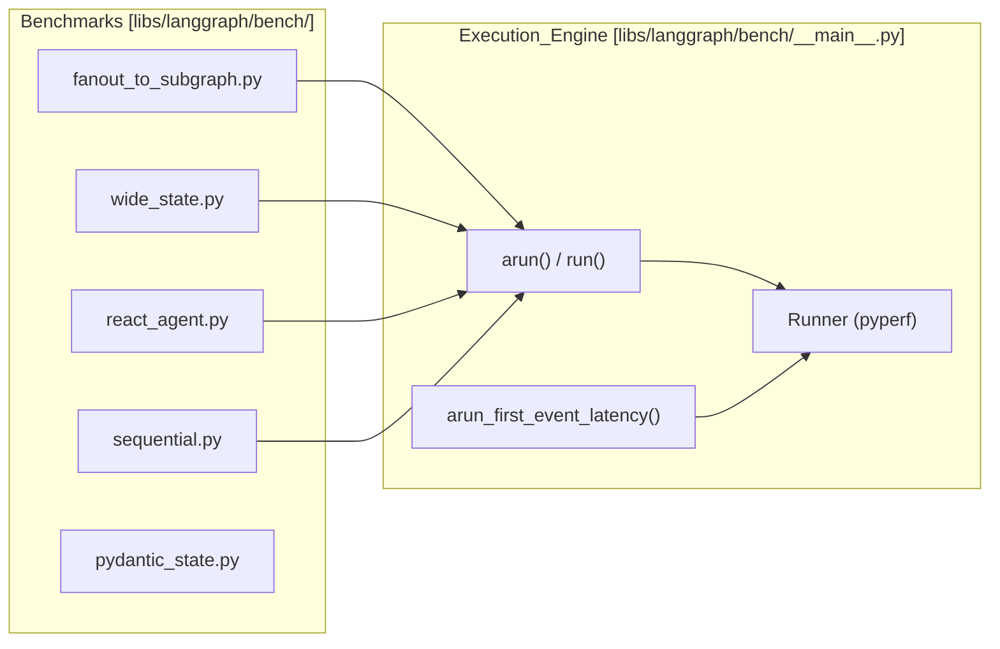

### Key Benchmarks
- **Fanout to Subgraph**: Measures performance of `Send` operations and nested graph execution [libs/langgraph/bench/fanout_to_subgraph.py:11-58]().
- **Wide State**: Tests overhead of managing large state objects with many fields and frequent updates [libs/langgraph/bench/wide_state.py:12-135]().
- **Sequential**: Measures the overhead of a graph with thousands of no-op nodes [libs/langgraph/bench/sequential.py:7-28]().
- **Latency**: Measures "Time to First Event" using `arun_first_event_latency` [libs/langgraph/bench/__main__.py:36-55]().

### Running Benchmarks
Benchmarks are executed via the `Makefile`:
- `make benchmark`: Runs the suite rigorously using `pyperf` [libs/langgraph/Makefile:17-20]().
- `make profile`: Generates a flamegraph using `py-spy` for a specific graph [libs/langgraph/Makefile:29-31]().

Sources: [libs/langgraph/bench/__main__.py:99-238](), [libs/langgraph/Makefile:10-31]()

---

## Test Utilities and Helpers

### Deterministic UUIDs
The `deterministic_uuids` fixture [libs/langgraph/tests/conftest.py:47-52]() patches `uuid.uuid4` to return a predictable sequence. This is essential for tests that compare full state snapshots where internal task IDs must be stable.

### Interruption and Durability Testing
Tests in `libs/langgraph/tests/test_interruption.py` validate the interaction between `interrupt_after` settings and checkpointer durability. For example, they verify that interrupting does not require state updates [libs/langgraph/tests/test_interruption.py:11-15]() and that the number of checkpoints created varies correctly based on whether `durability` is set to `"exit"` or other modes [libs/langgraph/tests/test_interruption.py:39-40]().

---

## Service Management (Docker)

External services required for integration tests (Postgres, Redis) are managed via Docker Compose.

**Service Topology**
| Service | Image | Port | Configuration File |
|---|---|---|---|
| PostgreSQL | `pgvector/pgvector:pg16` | 5441 | `tests/compose-postgres.yml` |
| Redis | `redis:alpine` | 6379 | `tests/compose-redis.yml` |

The `Makefile` provides targets to orchestrate these:
- `make start-services`: Starts Postgres and Redis with `--wait` to ensure they are ready [libs/langgraph/Makefile:40-41]().
- `make test_pg_version`: Specifically tests against multiple Postgres versions (e.g., 15, 16) by cycling the `POSTGRES_VERSION` env var [libs/checkpoint-postgres/Makefile:18-33]().

Sources: [libs/langgraph/Makefile:40-45](), [libs/checkpoint-postgres/Makefile:7-15]()

---

## Test Execution Summary

| Command | Scope | Features |
|---|---|---|
| `uv run pytest` | Unit Tests | Core logic, Pregel algo, StateGraph builder |
| `make integration_tests` | Integration | End-to-end flows, external service connectivity [libs/langgraph/Makefile:85-86]() |
| `make test_parallel` | All | Uses `pytest-xdist` with `worksteal` distribution [libs/langgraph/Makefile:76-83]() |
| `make coverage` | Unit/Int | Generates XML reports for CI and terminal summaries [libs/langgraph/Makefile:34-38]() |

Sources: [libs/langgraph/Makefile:61-106](), [libs/cli/Makefile:8-11](), [libs/sdk-py/Makefile:3-4]()

# CI/CD Workflows


This page documents all GitHub Actions workflows in the LangGraph monorepo: the main CI pipeline, reusable job workflows, benchmarking pipelines, the weekly dependency lock upgrade, and the release workflow. For the release process itself (PyPI publishing, tagging, and release notes), see [9.4](). For test infrastructure details (fixtures, Docker services, conftest setup), see [9.2](). For the monorepo build system and `make` targets that these workflows invoke, see [9.1]().

---

## Workflow Inventory

All workflow files live under `.github/workflows/`. Filenames prefixed with `_` are reusable workflows, invoked via `workflow_call` from other workflows.

| File | Name | Trigger | Purpose |
|---|---|---|---|
| `ci.yml` | CI | `push` to `main`, `pull_request` | Orchestrates lint, test, schema and integration checks |
| `_lint.yml` | lint | `workflow_call` | Runs ruff and mypy per package |
| `_test.yml` | test | `workflow_call` | Runs `make test` per package across Python versions |
| `_test_langgraph.yml` | test | `workflow_call` | Runs `make test_parallel` for `libs/langgraph` specifically |
| `_integration_test.yml` | CLI integration test | `workflow_call` | Builds and smoke-tests Docker images via `langgraph build` |
| `bench.yml` | bench | `pull_request` on `libs/**` | Runs benchmarks and compares to baseline |
| `baseline.yml` | baseline | `push` to `main`, `workflow_dispatch` | Saves benchmark baseline to cache |
| `uv_lock_ugprade.yml` | UV Lock Upgrade | Weekly cron, `workflow_dispatch` | Runs `make lock-upgrade` and opens a PR |
| `release.yml` | release | `workflow_dispatch` | Full release pipeline (build → test PyPI → pre-check → publish → tag) |
| `_test_release.yml` | test-release | `workflow_call` | Builds and publishes to test PyPI |

Sources: [.github/workflows/ci.yml:1-10](), [.github/workflows/_lint.yml:1-10](), [.github/workflows/_test.yml:1-10](), [.github/workflows/_test_langgraph.yml:1-10](), [.github/workflows/_integration_test.yml:1-10](), [.github/workflows/bench.yml:1-10](), [.github/workflows/baseline.yml:1-10](), [.github/workflows/uv_lock_ugprade.yml:1-10](), [.github/workflows/release.yml:1-10]()

---

## Main CI Pipeline (`ci.yml`)

The CI workflow is the primary gate on all pull requests and pushes to `main`.

### Concurrency

A concurrency group keyed on `${{ github.workflow }}-${{ github.ref }}` ensures that if a new push arrives while CI is still running for the same branch, the older run is cancelled [.github/workflows/ci.yml:21-23]().

### Path Filtering (`changes` job)

The first job uses the `dorny/paths-filter` action to determine which areas of the repository changed [.github/workflows/ci.yml:26-50](). Two output flags control downstream jobs:

| Flag | Paths Watched |
|---|---|
| `python` | `libs/langgraph/**`, `libs/sdk-py/**`, `libs/cli/**`, `libs/checkpoint/**`, `libs/checkpoint-sqlite/**`, `libs/checkpoint-postgres/**`, `libs/checkpoint-conformance/**`, `libs/prebuilt/**` |
| `deps` | `**/pyproject.toml`, `**/uv.lock` |

Downstream jobs only run if `python == 'true'` or `deps == 'true'`, which prevents unnecessary work on documentation-only changes [.github/workflows/ci.yml:67]().

### Job Graph

**CI pipeline job dependency diagram:**

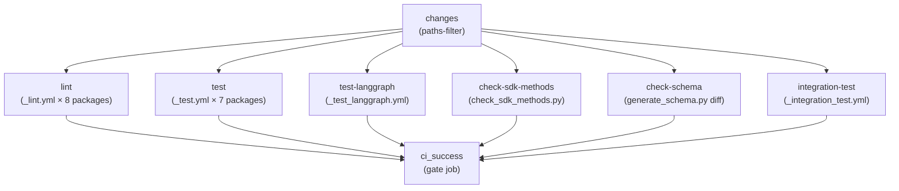

Sources: [.github/workflows/ci.yml:25-169]()

### `ci_success` Gate Job

The final `ci_success` job [.github/workflows/ci.yml:159-184]() always runs (via `if: always()`) and exits non-zero if any upstream job resulted in `failure` or `cancelled`. This provides a single required status check that branch protection rules can target, regardless of which jobs were skipped due to path filtering [.github/workflows/ci.yml:176-183]().

---

## Reusable Workflows

### `_lint.yml` — Per-Package Linting

Triggered via `workflow_call` with a `working-directory` input. Runs on Python 3.12 only (chosen to represent both min and max supported, balancing coverage with CI speed) [.github/workflows/_lint.yml:19-32]().

Steps:

1. **Changed-file detection** — uses `Ana06/get-changed-files` filtered to `${{ inputs.working-directory }}/**` [.github/workflows/_lint.yml:35-40](). Remaining steps are skipped if no files changed.
2. **Install lint deps** — `uv sync --frozen --group lint` [.github/workflows/_lint.yml:52]()
3. **mypy cache restore** — caches `.mypy_cache` keyed on `uv.lock` hash to speed up type checking [.github/workflows/_lint.yml:54-62]()
4. **`lint_package`** — runs `make lint_package` (falls back to `make lint` if target absent) [.github/workflows/_lint.yml:64-73]()
5. **Install test lint deps** — `uv sync --group lint` (adds test deps for type-checking test files) [.github/workflows/_lint.yml:78]()
6. **mypy test cache restore** — separate `.mypy_cache_test` cache [.github/workflows/_lint.yml:80-88]()
7. **`lint_tests`** — runs `make lint_tests` (skipped if target absent) [.github/workflows/_lint.yml:90-98]()

The `RUFF_OUTPUT_FORMAT: github` environment variable causes ruff to emit inline PR annotations [.github/workflows/_lint.yml:16]().

Sources: [.github/workflows/_lint.yml:1-99]()

### `_test.yml` — Per-Package Tests

Triggered via `workflow_call` with a `working-directory` input. Runs a matrix across **Python 3.10, 3.11, 3.12, 3.13, 3.14** [.github/workflows/_test.yml:17-24]().

Steps:

1. **Docker Hub login** — authenticates to avoid pull rate limits (skipped on fork PRs) [.github/workflows/_test.yml:35-40]()
2. **Install deps** — `uv sync --frozen --group test --no-dev` [.github/workflows/_test.yml:45]()
3. **Run tests** — `make test` [.github/workflows/_test.yml:50]()
4. **Clean working tree check** — fails if tests created untracked files [.github/workflows/_test.yml:52-63]()

Sources: [.github/workflows/_test.yml:1-64]()

### `_test_langgraph.yml` — LangGraph-Specific Tests

Nearly identical to `_test.yml` but hardcoded to `libs/langgraph` and invokes `make test_parallel` instead of `make test` [.github/workflows/_test_langgraph.yml:46](), allowing parallelized pytest execution. It also includes a specific run for strict msgpack pregel tests on Python 3.13 [.github/workflows/_test_langgraph.yml:48-53]().

Sources: [.github/workflows/_test_langgraph.yml:1-66]()

---

## Schema and SDK Consistency Checks

### `check-sdk-methods`

Runs the script `.github/scripts/check_sdk_methods.py` [.github/workflows/ci.yml:102-114](). This verifies that methods defined in the SDK match those expected by the server API. It only runs if Python source files changed [.github/workflows/ci.yml:104]().

### `check-schema`

Generates the `langgraph.json` configuration schema via `uv run python generate_schema.py` inside `libs/cli`, then diffs the result against the committed `schemas/schema.json` [.github/workflows/ci.yml:116-150](). If the generated schema differs from the committed one, CI fails with instructions to regenerate and commit the file [.github/workflows/ci.yml:145-149](). Runs on Python 3.13.

Sources: [.github/workflows/ci.yml:102-150]()

---

## CLI Integration Tests (`_integration_test.yml`)

This reusable workflow builds real Docker images using `langgraph build` and, when a `LANGSMITH_API_KEY` is available, runs the built containers against the LangGraph server API.

### Matrix

The matrix is two-dimensional: Python versions (3.10, 3.14) × example directories [.github/workflows/_integration_test.yml:13-33]():

| Example | Working Dir | Tag |
|---|---|---|
| A | `libs/cli/examples` | `langgraph-test-a` |
| B | `libs/cli/examples/graphs` | `langgraph-test-b` |
| C | `libs/cli/examples/graphs_reqs_a` | `langgraph-test-c` |
| D | `libs/cli/examples/graphs_reqs_b` | `langgraph-test-d` |

### Additional Builds (Example A only)

When the matrix entry is Example A, the workflow also builds:

- A JavaScript service from `libs/cli/js-examples` (tag `langgraph-test-e`) [.github/workflows/_integration_test.yml:76-80]()
- A JS monorepo service from `libs/cli/js-monorepo-example` with custom `--build-command` and `--install-command` (tag `langgraph-test-f`) [.github/workflows/_integration_test.yml:82-86]()
- A Python monorepo service from `libs/cli/python-monorepo-example` (tag `langgraph-test-g`) [.github/workflows/_integration_test.yml:88-92]()
- A pre-release requirements service from `libs/cli/examples/graph_prerelease_reqs` (tag `langgraph-test-h`) [.github/workflows/_integration_test.yml:103-107]()
- A pre-release failure scenario `libs/cli/examples/graph_prerelease_reqs_fail` expected to fail (tag `langgraph-test-i`) [.github/workflows/_integration_test.yml:134-138]()

The test runner script is `.github/scripts/run_langgraph_cli_test.py`, wrapped in a 60-second timeout [.github/workflows/_integration_test.yml:74]().

Sources: [.github/workflows/_integration_test.yml:1-139]()

---

## Benchmarking Workflows

### `baseline.yml` — Save Baseline

**Trigger:** Push to `main` or `workflow_dispatch`, when `libs/**` changes [.github/workflows/baseline.yml:1-8]().

Runs `make benchmark` in `libs/langgraph` and saves the output as `out/benchmark-baseline.json` to the Actions cache under a key of the form `${{ runner.os }}-benchmark-baseline-${{ env.SHA }}` [.github/workflows/baseline.yml:31-37](). This gives each `main` commit its own cached baseline.

### `bench.yml` — PR Comparison

**Trigger:** Pull requests touching `libs/**` [.github/workflows/bench.yml:4-6]().

**Benchmark comparison diagram:**

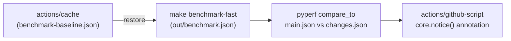

Steps [.github/workflows/bench.yml:17-71]():

1. Restore baseline from cache [.github/workflows/bench.yml:32-40]().
2. Run `make benchmark-fast` → writes `out/benchmark.json` [.github/workflows/bench.yml:41-48]().
3. Rename files and run `uv run pyperf compare_to out/main.json out/changes.json --table --group-by-speed` [.github/workflows/bench.yml:49-58]().
4. Post both raw results and the comparison table as PR annotations via `core.notice()` [.github/workflows/bench.yml:59-71]().

Sources: [.github/workflows/bench.yml:1-71](), [.github/workflows/baseline.yml:1-37]()

---

## Weekly Dependency Lock Upgrade (`uv_lock_ugprade.yml`)

**Trigger:** Cron at `0 0 * * 0` (midnight every Sunday UTC) or `workflow_dispatch` [.github/workflows/uv_lock_ugprade.yml:4-8]().

Runs `make lock-upgrade` at the repo root [.github/workflows/uv_lock_ugprade.yml:28](), which calls `uv lock --upgrade` across all Python packages. Then uses `peter-evans/create-pull-request` to open a PR on branch `deps/uv-lock-upgrade` with the label `dependencies` [.github/workflows/uv_lock_ugprade.yml:30-46]().

Sources: [.github/workflows/uv_lock_ugprade.yml:1-46]()

---

## Release Pipeline

The release workflow is documented in detail on page [9.4](). The section below covers only the structural relationship between workflow files and job sequencing.

### Job Sequence

**Release workflow job dependency diagram:**

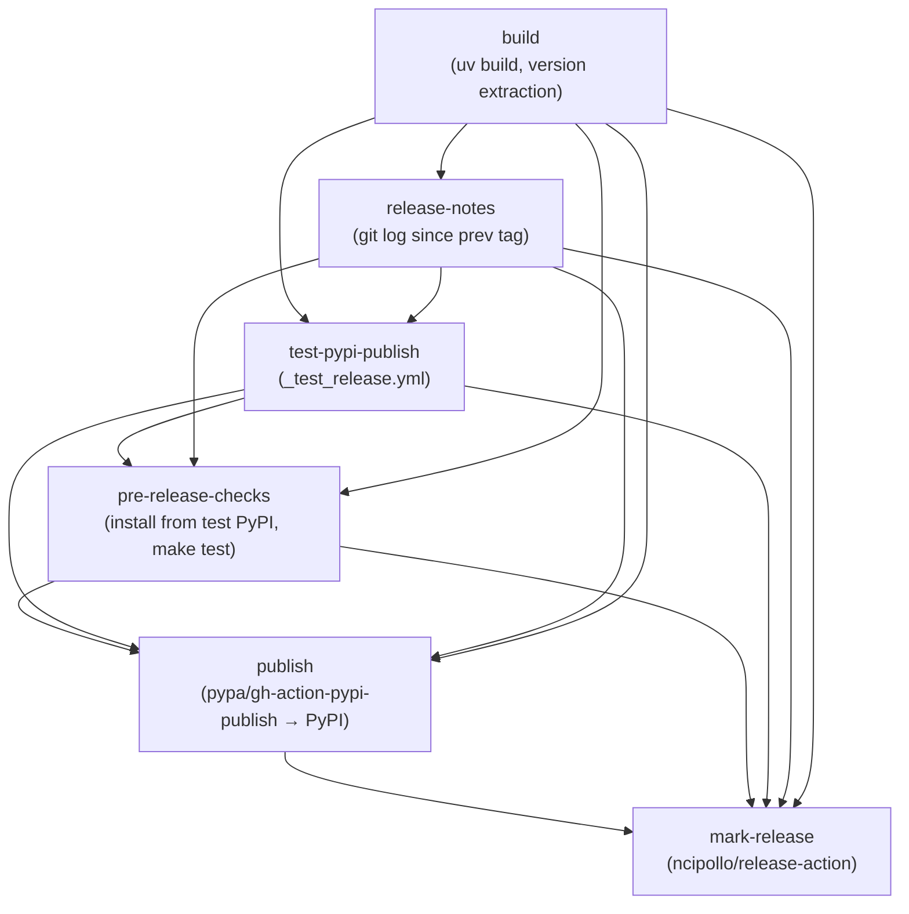

### Permission Isolation

The `build` job runs with only `contents: read` [.github/workflows/release.yml:11-12](). The `test-pypi-publish` job requires `id-token: write` (for PyPI trusted publishing) [.github/workflows/release.yml:145-147](). These permissions are intentionally kept in separate jobs so that a compromised build step cannot access publishing credentials [.github/workflows/release.yml:37-47]().

### `_test_release.yml` Reusable Workflow

Called by the `test-pypi-publish` job in `release.yml` [.github/workflows/release.yml:148-151](). It builds the package with `uv build`, uploads to test PyPI using `pypa/gh-action-pypi-publish` with `repository-url: https://test.pypi.org/legacy/` [.github/workflows/_test_release.yml:84-90]().

Sources: [.github/workflows/release.yml:1-157](), [.github/workflows/_test_release.yml:1-98]()

---

## Reusable Workflow Pattern

All reusable workflows use `on: workflow_call` and accept a `working-directory` input. The main `ci.yml` invokes them with a strategy matrix to fan out across all packages.

**Reusable workflow call structure:**

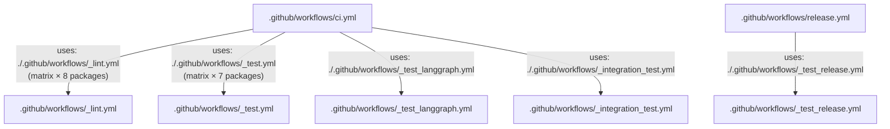

Secrets are forwarded with `secrets: inherit` in every caller [.github/workflows/ci.yml:71](), so repository secrets (e.g. `DOCKERHUB_USERNAME`, `LANGSMITH_API_KEY`) are available to reusable workflows.

Sources: [.github/workflows/ci.yml:68-157](), [.github/workflows/release.yml:148-151]()

---

## Python Version Coverage Summary

| Workflow | Python Versions |
|---|---|
| `_lint.yml` | 3.12 only |
| `_test.yml` | 3.10, 3.11, 3.12, 3.13, 3.14 |
| `_test_langgraph.yml` | 3.10, 3.11, 3.12, 3.13, 3.14 |
| `_integration_test.yml` | 3.10, 3.14 |
| `bench.yml` | 3.11 |
| `baseline.yml` | 3.11 |
| `release.yml` | 3.11 |
| `_test_release.yml` | 3.10 |
| `uv_lock_ugprade.yml` | 3.10 |

Sources: [.github/workflows/_lint.yml:31](), [.github/workflows/_test.yml:20-24](), [.github/workflows/_test_langgraph.yml:15-19](), [.github/workflows/_integration_test.yml:18-19](), [.github/workflows/bench.yml:24](), [.github/workflows/baseline.yml:22](), [.github/workflows/release.yml:15](), [.github/workflows/_test_release.yml:12](), [.github/workflows/uv_lock_ugprade.yml:24]()

# Release Process


The LangGraph release process is implemented as a manually-triggered GitHub Actions workflow ([.github/workflows/release.yml:1-328]()) that publishes packages to PyPI. The workflow enforces permission isolation between build and publish stages, validates packages on TestPyPI before production release, and creates GitHub releases with git-based changelogs.

## Workflow Jobs

The `release.yml` workflow executes six jobs with strict dependency ordering:

| Job Name | Depends On | Purpose |
|----------|------------|---------|
| `build` | - | Execute `uv build` and extract `pkg-name`, `version`, `tag` outputs |
| `release-notes` | `build` | Compare git tags and generate changelog via `git log` |
| `test-pypi-publish` | `build`, `release-notes` | Invoke `.github/workflows/_test_release.yml` to publish to test.pypi.org |
| `pre-release-checks` | `build`, `release-notes`, `test-pypi-publish` | Install from TestPyPI with `--extra-index-url` and run `make test` |
| `publish` | `build`, `release-notes`, `test-pypi-publish`, `pre-release-checks` | Publish to pypi.org via `pypa/gh-action-pypi-publish@release/v1` |
| `mark-release` | `build`, `release-notes`, `test-pypi-publish`, `pre-release-checks`, `publish` | Create GitHub release via `ncipollo/release-action@v1` |

Sources: [.github/workflows/release.yml:17-328]()

## Job Dependency Graph

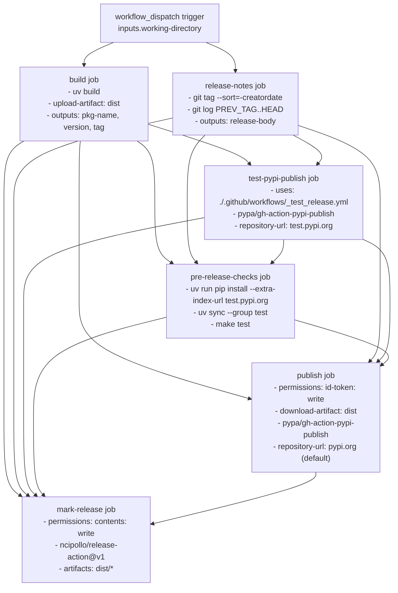

**Purpose**: Maps GitHub Actions workflow job dependencies with key actions and permissions used in each job.

Sources: [.github/workflows/release.yml:17-328]()

## Trigger and Inputs

The release workflow is triggered manually via `workflow_dispatch` with a single required input:

| Input | Type | Default | Description |
|-------|------|---------|-------------|
| `working-directory` | string | `libs/langgraph` | Package directory to release |

**Supported packages**:

| Package | Directory | Version File |
|---------|-----------|--------------|
| `langgraph` | `libs/langgraph` | [libs/langgraph/pyproject.toml:7]() |
| `langgraph-checkpoint` | `libs/checkpoint` | [libs/checkpoint/pyproject.toml:7]() |
| `langgraph-prebuilt` | `libs/prebuilt` | [libs/prebuilt/pyproject.toml:7]() |

Sources: [.github/workflows/release.yml:3-9](), [libs/langgraph/pyproject.toml:5-7](), [libs/checkpoint/pyproject.toml:5-7](), [libs/prebuilt/pyproject.toml:5-7]()

## Build Stage

The `build` job extracts version information and creates distribution artifacts using `uv build` ([.github/workflows/release.yml:49]()).

### Version Detection

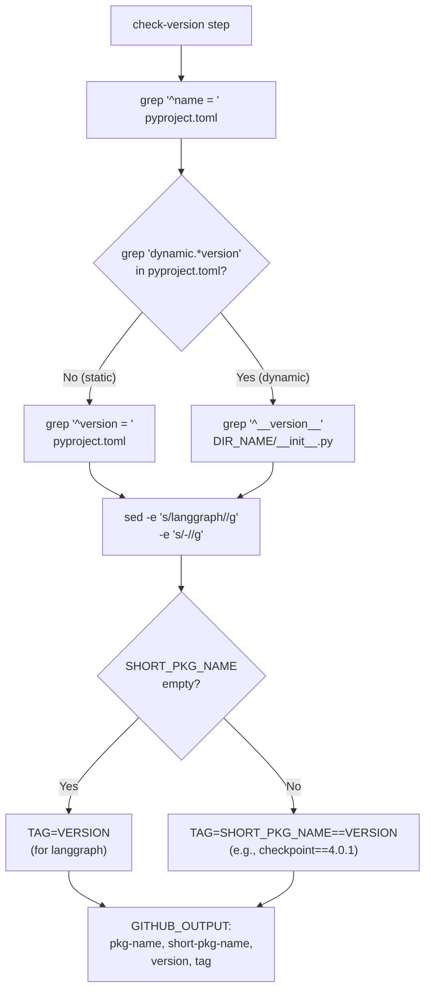

**Purpose**: Shows bash script logic for extracting version information from `pyproject.toml` or `__init__.py`.

The version detection script performs the following ([.github/workflows/release.yml:58-80]()):

1. **Extract package name**: `PKG_NAME=$(grep -m 1 "^name = " pyproject.toml | cut -d '"' -f 2)`
2. **Check for dynamic versioning**: `grep -q 'dynamic.*=.*\[.*"version".*\]' pyproject.toml`
3. **Extract version**:
   - **Static (e.g., langgraph)**: `VERSION=$(grep -m 1 "^version = " pyproject.toml | cut -d '"' -f 2)`
   - **Dynamic**: `DIR_NAME=$(echo "$PKG_NAME" | tr '-' '_')` then `VERSION=$(grep -m 1 '^__version__' "${DIR_NAME}/__init__.py" | cut -d '"' -f 2)`
4. **Generate short name**: `SHORT_PKG_NAME="$(echo "$PKG_NAME" | sed -e 's/langgraph//g' -e 's/-//g')"` → `checkpoint` for `langgraph-checkpoint`
5. **Create tag**:
   - **langgraph package**: `TAG="$VERSION"`
   - **Other packages**: `TAG="${SHORT_PKG_NAME}==${VERSION}"` → `checkpoint==4.0.1`

### Build Artifacts

The build step uses `uv build` at [.github/workflows/release.yml:49-50]() to create source and wheel distributions. Artifacts are uploaded via `actions/upload-artifact@v7` at [.github/workflows/release.yml:52-56]() with artifact name `dist`.

Build output uses `hatchling` as the build backend, as specified in package configurations:
- `langgraph`: [libs/langgraph/pyproject.toml:1-3]()
- `langgraph-checkpoint`: [libs/checkpoint/pyproject.toml:1-3]()
- `langgraph-prebuilt`: [libs/prebuilt/pyproject.toml:1-3]()

## Release Notes Generation

The `release-notes` job creates a changelog by comparing the current version tag against the most recent previous tag using `git log` ([.github/workflows/release.yml:136]()).

### Tag Comparison Logic

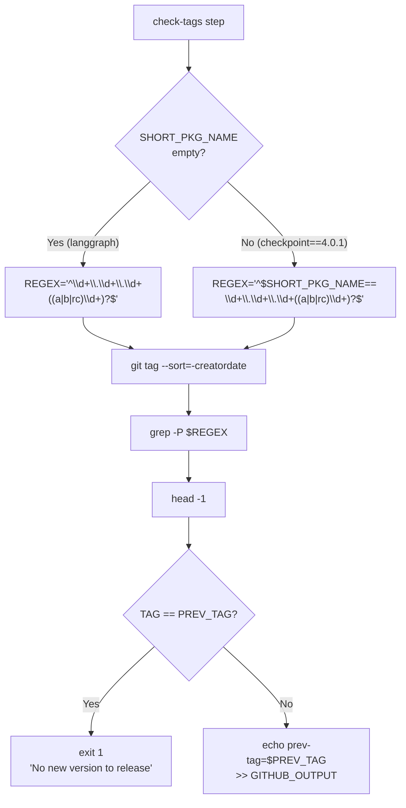

**Purpose**: Shows bash script logic for finding the previous version tag and validating the new release.

The tag comparison at [.github/workflows/release.yml:97-119]() filters existing tags using regex patterns based on whether the package is the core `langgraph` package or a sub-package like `langgraph-checkpoint`.

### Changelog Generation

The `generate-release-body` step ([.github/workflows/release.yml:120-139]()) creates release notes by extracting commit subjects since the last tag. If no previous tag is found, it defaults to "Initial release" ([.github/workflows/release.yml:131-137]()).

## TestPyPI Publishing

The `test-pypi-publish` job ([.github/workflows/release.yml:141-151]()) uses the reusable workflow `_test_release.yml` to publish the package to TestPyPI.

### TestPyPI Workflow

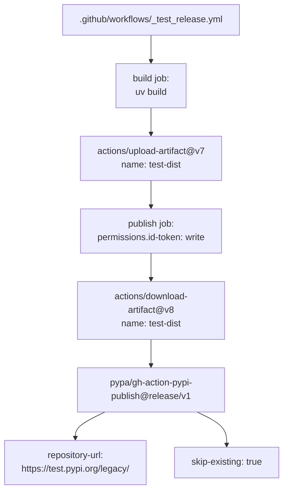

**Purpose**: Shows the TestPyPI release workflow structure and artifact flow.

The workflow uses Trusted Publishing with OIDC, requiring `id-token: write` permissions ([.github/workflows/release.yml:147]()).

## Pre-Release Checks

The `pre-release-checks` job ([.github/workflows/release.yml:153-242]()) verifies the published TestPyPI package by installing it in a fresh environment and running the test suite.

### Package Installation from TestPyPI

The installation logic at [.github/workflows/release.yml:182-221]() performs a `pip install` using `test.pypi.org` as an extra index URL. It includes a retry mechanism with a 5-second sleep to account for TestPyPI indexing delays ([.github/workflows/release.yml:188-200]()).

**Cache Exclusion**: Caching is explicitly disabled for this job ([.github/workflows/release.yml:179]()) to ensure tests are sensitive to missing dependencies that might otherwise be satisfied by a cached environment ([.github/workflows/release.yml:162-173]()).

## PyPI Publishing

The `publish` job ([.github/workflows/release.yml:243-285]()) performs the final production release to PyPI.

### Production Publishing Workflow

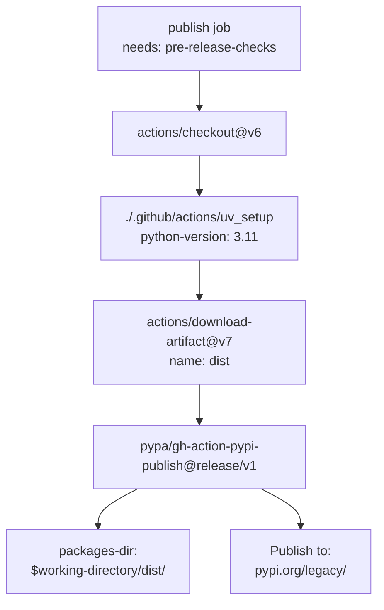

**Purpose**: Shows the production publish job steps and `pypa/gh-action-pypi-publish` configuration.

The job uses Trusted Publishing via `id-token: write` permissions ([.github/workflows/release.yml:256]()) and points to the `dist/` directory containing artifacts from the `build` job ([.github/workflows/release.yml:280]()).

## GitHub Release Creation

The `mark-release` job ([.github/workflows/release.yml:286-328]()) creates the final GitHub release.

### Release Creation Workflow

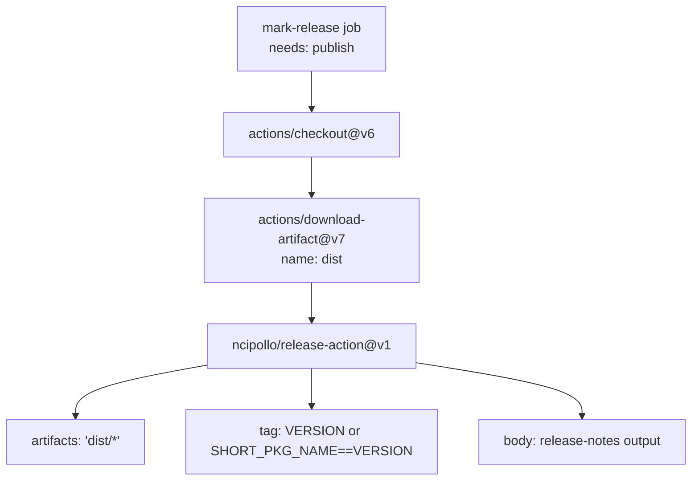

**Purpose**: Shows the `ncipollo/release-action` configuration for creating the GitHub Release.

The release is created using the `GITHUB_TOKEN` with `contents: write` permissions ([.github/workflows/release.yml:297]()). It uploads all artifacts from the `dist/` directory ([.github/workflows/release.yml:321]()) and uses the body generated by the `release-notes` job ([.github/workflows/release.yml:326]()).

Sources: [.github/workflows/release.yml:1-328](), [libs/langgraph/pyproject.toml:1-33](), [libs/checkpoint/pyproject.toml:1-17](), [libs/prebuilt/pyproject.toml:1-29]()

# Glossary


This glossary defines codebase-specific terms, jargon, and domain concepts used throughout the LangGraph repository. It serves as a technical reference for onboarding engineers to understand the implementation details and data flow of the framework.

## Core Concepts

### Pregel
The underlying execution engine for LangGraph. It is based on the Pregel graph processing model, where nodes execute in "supersteps." In each step, nodes that have received updates (triggers) execute in parallel and write updates to shared state (channels), which then trigger subsequent nodes.

*   **Implementation**: The main loop is managed by `SyncPregelLoop` and `AsyncPregelLoop` in [libs/langgraph/langgraph/pregel/_loop.py:1-57]().
*   **Task Orchestration**: `PregelRunner` handles the actual execution of node logic [libs/langgraph/langgraph/pregel/_runner.py:1-58]().
*   **Entry Point**: The `Pregel` class is the compiled executable form of a graph [libs/langgraph/langgraph/pregel/main.py:1-115]().

### Channel
A state container within a graph. Channels are not just variables; they have specific behaviors for how they handle updates (e.g., overwriting, appending, or aggregating).

| Channel Type | Code Entity | Description |
| :--- | :--- | :--- |
| **LastValue** | `LastValue` [libs/langgraph/langgraph/channels/last_value.py:1-52]() | Stores only the most recent value written to it. |
| **Topic** | `Topic` [libs/langgraph/langgraph/channels/topic.py:1-47]() | A queue-like channel that accumulates values until they are consumed. |
| **BinaryOperatorAggregate** | `BinaryOperatorAggregate` [libs/langgraph/langgraph/channels/binop.py:1-43]() | Applies a reducer function (e.g., `operator.add`) to aggregate new values with existing ones. |
| **EphemeralValue** | `EphemeralValue` [libs/langgraph/langgraph/channels/ephemeral_value.py:1-44]() | Values that exist only for the duration of a single step. |

### Checkpoint
A persisted snapshot of the graph's state at a specific point in time (a "thread"). Checkpoints allow for "Time Travel," error recovery, and human-in-the-loop interactions.

*   **Data Model**: Defined by the `Checkpoint` TypedDict [libs/langgraph/langgraph/checkpoint/base.py:27-32]().
*   **Interface**: All savers must implement `BaseCheckpointSaver` [libs/langgraph/langgraph/checkpoint/base.py:27-32]().
*   **Validation**: The system ensures valid checkpointer types using `ensure_valid_checkpointer` [libs/langgraph/langgraph/types.py:105-115]().

### Thread
A unique identifier for a specific instance of a graph execution. All checkpoints within the same `thread_id` share a history.

### Reducer
A function used by a `BinaryOperatorAggregate` channel to combine a new update with the current state.
*   **Signature**: `(current_state, update) -> new_state`.
*   **Usage**: Defined via `Annotated[Type, reducer_function]` in a `TypedDict` state schema [libs/langgraph/langgraph/graph/state.py:152-159]().

---

## Control Flow Primitives

### Command
A control object returned by a node to dynamically influence graph execution. It can update state, route to a specific node, or trigger an interrupt.

*   **Definition**: `Command` dataclass [libs/langgraph/langgraph/types.py:77-81]().
*   **Usage**: Used to specify `goto` targets and `update` state keys [libs/langgraph/tests/test_pregel.py:140-155]().

### Send
A primitive used for dynamic fan-out (map-reduce patterns). It allows a node to schedule multiple instances of another node with different inputs.

*   **Definition**: `Send` class [libs/langgraph/langgraph/types.py:76-83]().
*   **Implementation**: Handled by the graph builder during compilation to manage branching [libs/langgraph/langgraph/graph/state.py:83-85]().

### Interrupt
A mechanism to pause graph execution and wait for external input.

*   **Function**: `interrupt()` used within a node to halt and return a value to the caller [libs/langgraph/langgraph/types.py:71-79]().
*   **Types**: Represented by the `Interrupt` dataclass [libs/langgraph/langgraph/types.py:71-71]().

---

## Code Mapping Diagrams

### Execution Flow: From User Call to Pregel Loop
This diagram maps high-level API calls to the internal classes handling the Pregel execution loop, specifically showing the association between user-facing `StateGraph` and internal `Pregel` entities.

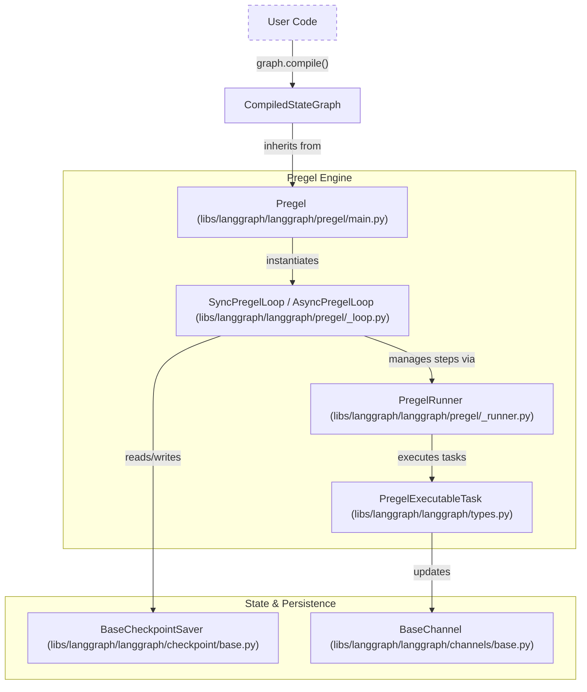
**Sources**: [libs/langgraph/langgraph/pregel/main.py:1-3](), [libs/langgraph/langgraph/pregel/_loop.py:57-58](), [libs/langgraph/langgraph/graph/state.py:115-184]()

### Remote Execution: SDK to API Server
This diagram shows how the `LangGraphClient` interacts with remote resources and how the CLI facilitates local development of these services.

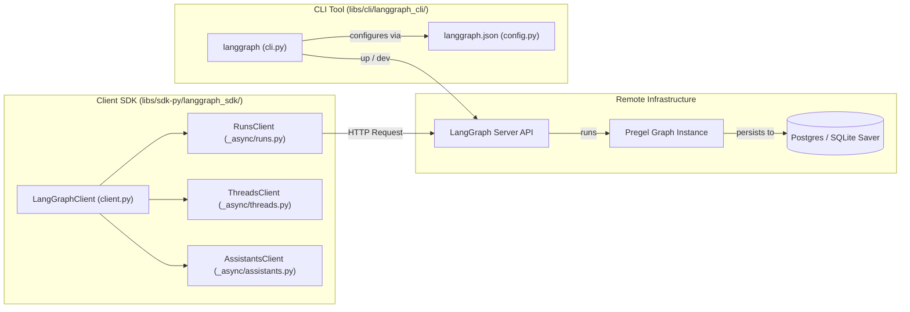
**Sources**: [libs/sdk-py/langgraph_sdk/client.py:1-55](), [libs/cli/langgraph_cli/cli.py:37-101](), [libs/cli/langgraph_cli/config.py:152-209]()

---

## Technical Abbreviations & Jargon

| Term | Full Name | Context |
| :--- | :--- | :--- |
| **Durability** | Execution Durability | Controls when changes are persisted (`sync`, `async`, `exit`) [libs/langgraph/langgraph/types.py:85-91](). |
| **StreamMode** | Streaming Mode | Determines output format (`values`, `updates`, `messages`, etc.) [libs/langgraph/langgraph/types.py:118-132](). |
| **HIL** | Human-in-the-Loop | Patterns involving `interrupt` and state snapshots for manual approval [libs/langgraph/langgraph/types.py:71-79](). |
| **Managed Value** | Managed Value | Values provided by the framework like `BaseStore` or `BaseCache` [libs/langgraph/langgraph/graph/state.py:66-69](). |
| **Checkpointer** | Checkpoint Saver | Interface for persisting graph state across steps [libs/langgraph/langgraph/types.py:96-102](). |

## Deployment & CLI Jargon

*   **langgraph.json**: The primary configuration file for the LangGraph CLI, defining dependencies, graphs, and environment variables [libs/cli/langgraph_cli/cli.py:41-92]().
*   **Image Distro**: The base operating system for the generated Docker image (e.g., `debian`, `wolfi`) [libs/cli/langgraph_cli/config.py:52-167]().
*   **Distributed Mode**: A runtime mode where executor and orchestrator containers are separated [libs/cli/langgraph_cli/cli.py:165-170]().

**Sources**:
*   `Pregel` imports: [libs/langgraph/langgraph/pregel/__init__.py:1-3]()
*   `StateGraph` definition: [libs/langgraph/langgraph/graph/state.py:115-208]()
*   `task` and `entrypoint` decorators: [libs/langgraph/langgraph/func/__init__.py:47-190]()
*   `LangGraphClient` exports: [libs/sdk-py/langgraph_sdk/client.py:12-55]()
*   CLI command structure: [libs/cli/langgraph_cli/cli.py:178-216]()
*   Config validation: [libs/cli/langgraph_cli/config.py:152-209]()

e:{"metadata":[["$","title","0",{"children":"langchain-ai/langgraph | DeepWiki"}],["$","meta","1",{"name":"description","content":"LangGraph is a low-level orchestration framework for building stateful, multi-actor applications with Large Language Models (LLMs). Unlike high-level abstractions, LangGraph provides infrastructure wi"}],["$","meta","2",{"name":"keywords","content":"langchain-ai/langgraph,langchain-ai,langgraph,documentation,wiki,codebase,AI documentation,Devin,Overview"}],["$","link","3",{"rel":"canonical","href":"https://deepwiki.com/langchain-ai/langgraph"}],["$","meta","4",{"property":"og:title","content":"langchain-ai/langgraph | DeepWiki"}],["$","meta","5",{"property":"og:description","content":"LangGraph is a low-level orchestration framework for building stateful, multi-actor applications with Large Language Models (LLMs). Unlike high-level abstractions, LangGraph provides infrastructure wi"}],["$","meta","6",{"property":"og:url","content":"https://deepwiki.com/langchain-ai/langgraph"}],["$","meta","7",{"property":"og:site_name","content":"DeepWiki"}],["$","meta","8",{"property":"og:image","content":"https://deepwiki.com/langchain-ai/langgraph/og-image.png?page=1"}],["$","meta","9",{"property":"og:type","content":"website"}],["$","meta","10",{"name":"twitter:card","content":"summary_large_image"}],["$","meta","11",{"name":"twitter:site","content":"@cognition"}],["$","meta","12",{"name":"twitter:creator","content":"@cognition"}],["$","meta","13",{"name":"twitter:title","content":"langchain-ai/langgraph | DeepWiki"}],["$","meta","14",{"name":"twitter:description","content":"LangGraph is a low-level orchestration framework for building stateful, multi-actor applications with Large Language Models (LLMs). Unlike high-level abstractions, LangGraph provides infrastructure wi"}],["$","meta","15",{"name":"twitter:image","content":"https://deepwiki.com/langchain-ai/langgraph/og-image.png?page=1"}],["$","link","16",{"rel":"icon","href":"/favicon.ico","type":"image/x-icon","sizes":"16x16"}],["$","link","17",{"rel":"icon","href":"/icon.png?1ee4c6a68a73a205","type":"image/png","sizes":"48x48"}],["$","link","18",{"rel":"apple-touch-icon","href":"/apple-icon.png?a4f658907db0ab87","type":"image/png","sizes":"180x180"}],["$","$L4c","19",{}]],"error":null,"digest":"$undefined"}