graph.invoke(None, fork_config)
```

The `update_state` call creates a new checkpoint whose `parent_checkpoint_id` points to the historical checkpoint [libs/langgraph/langgraph/pregel/main.py:1462-1529](). Crucially, it clears pending writes, forcing the graph to re-evaluate the next steps based on the new state values [libs/langgraph/tests/test_time_travel.py:143-180]().

Sources: [libs/langgraph/langgraph/pregel/main.py:1462-1529](), [libs/langgraph/tests/test_time_travel.py:143-180]()

### Fork as Copy Pattern

A "pure" fork can be created by calling `update_state(config, None)` [libs/langgraph/tests/test_time_travel.py:9-9](). This creates a new checkpoint with the exact same values as the parent but without the original execution's pending tasks, allowing for a fresh execution from that state.

Sources: [libs/langgraph/tests/test_time_travel.py:9-9]()

## State History API

### StateSnapshot Structure

The `get_state_history` method yields `StateSnapshot` objects [libs/langgraph/langgraph/types.py:27-37]().

| Field | Description |
|-------|-------------|
| `values` | The state (channel values) at this checkpoint [libs/langgraph/langgraph/types.py:34-34](). |
| `next` | Tuple of node names that were scheduled to run next [libs/langgraph/langgraph/types.py:34-34](). |
| `config` | The `RunnableConfig` containing `checkpoint_id` for this snapshot [libs/langgraph/langgraph/types.py:34-34](). |
| `parent_config` | The config of the checkpoint that preceded this one [libs/langgraph/langgraph/types.py:34-34](). |
| `tasks` | The `PregelTask` objects representing pending work [libs/langgraph/langgraph/types.py:34-34](). |

Sources: [libs/langgraph/langgraph/pregel/main.py:1155-1244](), [libs/langgraph/langgraph/types.py:27-37]()

### Remote Time Travel

`RemoteGraph` implements the `PregelProtocol`, providing `get_state_history` and `update_state` by proxying calls to a LangGraph API server. This allows time travel to be performed on threads managed by a remote service.

Sources: [libs/langgraph/langgraph/_internal/_constants.py:44-54](), [libs/langgraph/langgraph/pregel/_loop.py:148-210]()

## Implementation Details

### Configuration Keys for Time Travel

The following internal keys in `configurable` [libs/langgraph/langgraph/_internal/_constants.py:79-80]() drive the time travel logic:

*   `CONFIG_KEY_CHECKPOINT_ID` (`checkpoint_id`): The ID of the specific checkpoint to load [libs/langgraph/langgraph/_internal/_constants.py:53-54]().
*   `CONFIG_KEY_REPLAY_STATE` (`__pregel_replay_state`): Holds the `ReplayState` object used to coordinate subgraph checkpoint loading [libs/langgraph/langgraph/_internal/_constants.py:44-46]().
*   `CONFIG_KEY_CHECKPOINT_MAP` (`checkpoint_map`): A mapping of `checkpoint_ns` to `checkpoint_id` for nested graph replay [libs/langgraph/langgraph/_internal/_constants.py:51-52]().

Sources: [libs/langgraph/langgraph/_internal/_constants.py:40-60]()

### PregelLoop Initialization

During `PregelLoop.__init__` [libs/langgraph/langgraph/pregel/_loop.py:217-240](), the engine prepares the execution environment. If a `checkpoint_id` is provided in the config, the loop is initialized from that specific point in the history. If `CONFIG_KEY_REPLAY_STATE` is present, the loop uses it to resolve checkpoints for any subgraphs encountered during execution [libs/langgraph/langgraph/_internal/_replay.py:52-74]().

Sources: [libs/langgraph/langgraph/pregel/_loop.py:148-210](), [libs/langgraph/langgraph/_internal/_replay.py:52-74]()

# Client SDKs and Remote Execution


## Purpose and Scope

This document provides an overview of the client libraries for interacting with deployed LangGraph applications via HTTP APIs. The SDKs enable programmatic access to remote graph deployments from both Python and JavaScript/TypeScript applications. Key capabilities include:

- Creating and managing assistants, threads, runs, and cron jobs.
- Streaming execution results via Server-Sent Events (SSE).
- Using remote graphs as nodes within local graphs via `RemoteGraph`.
- Custom authentication and authorization.
- Cross-thread persistent storage via the Store API.

For deployment information, see [CLI and Deployment](#6). For API endpoint details, see [Server API](#7).

**Related Pages:**
- [Python SDK](#5.1) - Python client implementation details.
- [JavaScript/TypeScript SDK](#5.2) - JavaScript client implementation.
- [HTTP Client and Streaming](#5.3) - HTTP layer and SSE streaming.
- [Authentication and Authorization](#5.4) - Custom auth handlers and `AuthContext`.
- [Data Models and Schemas](#5.5) - `TypedDict` schemas for API resources.
- [RemoteGraph](#5.6) - Using remote graphs as local nodes.

**Sources:** [libs/sdk-py/langgraph_sdk/client.py:1-8](), [libs/langgraph/langgraph/pregel/remote.py:112-121]()

---

## Architecture Overview

The LangGraph SDK architecture provides client libraries in multiple languages that communicate with deployed LangGraph applications via HTTP APIs. Each SDK provides typed interfaces for resource management, streaming execution, and authentication.

### Multi-Language Client Architecture

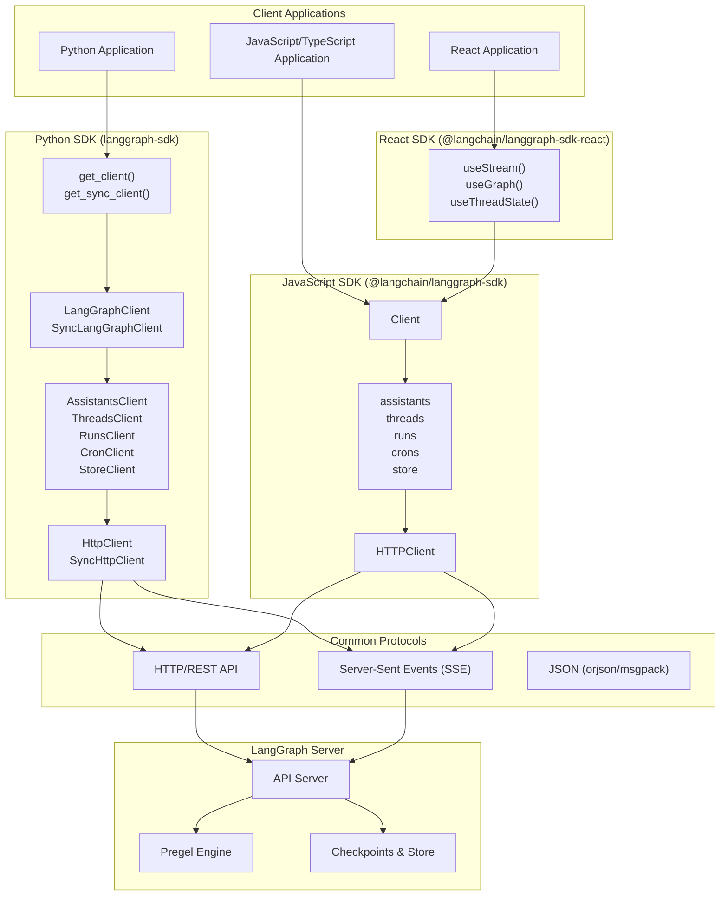

**Sources:** [libs/sdk-py/langgraph_sdk/client.py:12-31](), [libs/sdk-py/pyproject.toml:5-14](), [libs/sdk-py/langgraph_sdk/__init__.py:1-8]()

---

## Client Factory Functions

The SDK provides two factory functions that create configured client instances with automatic authentication and connection handling.

### get_client() - Async Client

```python
def get_client(
    *,
    url: str | None = None,
    api_key: str | None = NOT_PROVIDED,
    headers: Mapping[str, str] | None = None,
    timeout: TimeoutTypes | None = None,
) -> LangGraphClient
```

Creates an async `LangGraphClient` instance. It resolves API keys from environment variables: `LANGGRAPH_API_KEY`, `LANGSMITH_API_KEY`, or `LANGCHAIN_API_KEY`. It uses `httpx.AsyncClient` and supports `configure_loopback_transports` for in-process communication.

**Sources:** [libs/sdk-py/langgraph_sdk/client.py:16](), [libs/sdk-py/langgraph_sdk/__init__.py:2](), [libs/sdk-py/langgraph_sdk/client.py:52-53]()

### get_sync_client() - Synchronous Client

```python
def get_sync_client(
    *,
    url: str | None = None,
    api_key: str | None = NOT_PROVIDED,
    headers: Mapping[str, str] | None = None,
    timeout: TimeoutTypes | None = None,
) -> SyncLangGraphClient
```

Creates a synchronous `SyncLangGraphClient` with identical configuration options as the async version, using `httpx.Client`.

**Sources:** [libs/sdk-py/langgraph_sdk/client.py:26](), [libs/sdk-py/langgraph_sdk/__init__.py:2]()

---

## Top-Level Client Classes

### LangGraphClient (Async)

The async top-level client exposes resource-specific sub-clients for interacting with the server's lifecycle.

| Sub-Client | Class | Purpose |
|------------|-------|---------|
| `assistants` | `AssistantsClient` | Manage graph configurations and metadata. |
| `threads` | `ThreadsClient` | Manage conversation state and history. |
| `runs` | `RunsClient` | Execute graphs and stream results. |
| `crons` | `CronClient` | Schedule periodic graph executions. |
| `store` | `StoreClient` | Cross-thread key-value storage. |

**Sources:** [libs/sdk-py/langgraph_sdk/client.py:12-21]()

### SyncLangGraphClient

The synchronous equivalent provides the same sub-clients with blocking I/O: `SyncAssistantsClient`, `SyncThreadsClient`, `SyncRunsClient`, `SyncCronClient`, and `SyncStoreClient`.

**Sources:** [libs/sdk-py/langgraph_sdk/client.py:23-31]()

---

## RemoteGraph - Remote Execution as Local Nodes

The `RemoteGraph` class implements the `PregelProtocol` interface [libs/langgraph/langgraph/pregel/protocol.py:25](), allowing remote graphs to be used as nodes within local graphs. This enables complex, distributed graph architectures.

### RemoteGraph System Integration

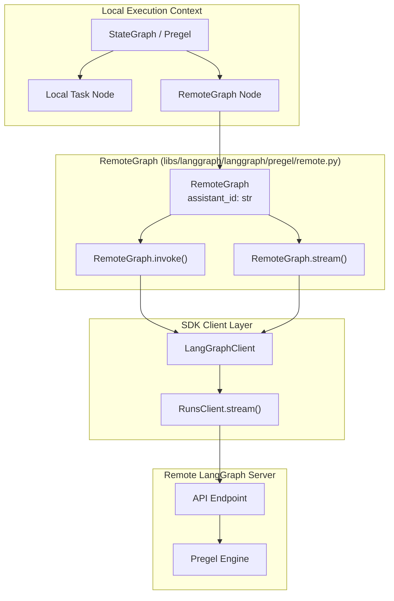

**Sources:** [libs/langgraph/langgraph/pregel/remote.py:112-139](), [libs/langgraph/langgraph/pregel/protocol.py:25-50]()

### Key Capabilities

- **Distributed Tracing**: Supports `distributed_tracing` via LangSmith headers [libs/langgraph/langgraph/pregel/remote.py:138-165]().
- **State Synchronization**: Implements `get_state` and `aget_state` to retrieve `StateSnapshot` from the remote server [libs/langgraph/langgraph/pregel/remote.py:398-410]().
- **Streaming**: Implements `stream` and `astream` to pipe remote execution events into the local execution loop [libs/langgraph/langgraph/pregel/remote.py:685-700]().

---

## Data Models and Schemas

The SDK uses `TypedDict` classes for type-safe data structures. All schemas are defined in `langgraph_sdk.schema`.

- **Resource Status**: `RunStatus` ("pending", "running", "error", etc.) [libs/sdk-py/langgraph_sdk/schema.py:23-32]() and `ThreadStatus` [libs/sdk-py/langgraph_sdk/schema.py:34-41]().
- **Streaming Modes**: `StreamMode` defines the granularity of updates ("values", "messages", "updates", "events", "debug", etc.) [libs/sdk-py/langgraph_sdk/schema.py:51-72]().
- **Execution Strategies**: `MultitaskStrategy` defines behavior when multiple tasks target the same thread ("reject", "interrupt", "rollback", "enqueue") [libs/sdk-py/langgraph_sdk/schema.py:81-88]().

**Sources:** [libs/sdk-py/langgraph_sdk/schema.py:1-185]()

---

## Authentication and Authorization

The SDK provides a framework for custom authentication and authorization via the `Auth` class.

- **Custom Authenticator**: Use `@auth.authenticate` to resolve user identities from request headers.
- **Resource Authorization**: Use `@auth.on` to define authorization handlers for specific resources (Assistants, Threads, Runs, etc.) and actions (create, read, update, delete).

**Sources:** [libs/sdk-py/langgraph_sdk/__init__.py:1](), [libs/sdk-py/langgraph_sdk/client.py:1-8]()

---

## Package Structure

The SDK is distributed as the `langgraph-sdk` package, depending on `httpx` for networking and `orjson` for performance.

**Sources:** [libs/sdk-py/pyproject.toml:6-14](), [libs/sdk-py/langgraph_sdk/__init__.py:1-8]()

# Python SDK


The Python SDK provides client libraries for interacting with LangGraph API servers. It offers both asynchronous and synchronous clients for managing assistants, threads, runs, cron jobs, and persistent storage. The SDK handles HTTP communication, Server-Sent Events (SSE) streaming with automatic reconnection, and provides strongly-typed data models for all API resources.

For information about the JavaScript/TypeScript SDK, see [JavaScript/TypeScript SDK](#5.2). For details on authentication and authorization configuration (server-side), see [Authentication and Authorization](#5.4). For RemoteGraph usage (using deployed graphs as nodes), see [RemoteGraph](#5.6).

---

## Package Structure and Dependencies

The SDK is a standalone package located at `libs/sdk-py` with minimal dependencies. It uses `hatchling` as its build backend and `uv` for dependency management. [libs/sdk-py/pyproject.toml:1-3]()

**Dependencies**:
- `httpx>=0.25.2` - HTTP client with async support. [libs/sdk-py/pyproject.toml:14-14]()
- `orjson>=3.11.5` - Fast JSON serialization. [libs/sdk-py/pyproject.toml:14-14]()
- Python 3.10+ [libs/sdk-py/pyproject.toml:10-10]()

**Installation**:
```bash
pip install langgraph-sdk
```

Sources: [libs/sdk-py/pyproject.toml:1-57]()

---

## Client Architecture

The SDK is organized into resource-specific clients that wrap an underlying HTTP client.

### Code Entity Space to System Names

This diagram maps the Python classes to the logical resources they manage within the LangGraph ecosystem.

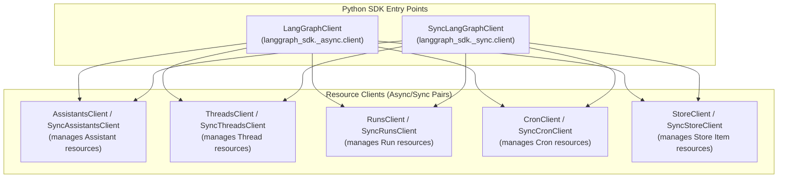
Sources: [libs/sdk-py/langgraph_sdk/client.py:12-31](), [libs/sdk-py/langgraph_sdk/_async/client.py:1-20]()

### Client Factory and Hierarchy

The main entry points are factory functions that instantiate the primary client classes.

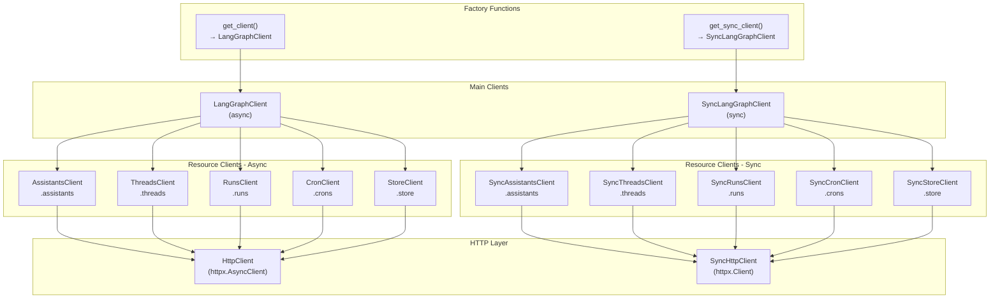

**Main Client Structure**

The SDK provides two main client classes that serve as entry points:

| Client | Purpose | Import Path |
|--------|---------|-------------|
| `LangGraphClient` | Async operations | `from langgraph_sdk import get_client` |
| `SyncLangGraphClient` | Synchronous operations | `from langgraph_sdk import get_sync_client` |

Each main client provides access to resource-specific sub-clients through properties (`.assistants`, `.threads`, `.runs`, `.crons`, `.store`). [libs/sdk-py/langgraph_sdk/client.py:12-31]()

Sources: [libs/sdk-py/langgraph_sdk/client.py:1-55](), [libs/sdk-py/langgraph_sdk/__init__.py:1-9]()

---

## Resource Client APIs

### AssistantsClient / SyncAssistantsClient

Manages `Assistant` resources, which are versioned configurations of a graph (linking a `graph_id` to specific `config`, `metadata`, and `context`). [libs/sdk-py/langgraph_sdk/schema.py:221-236]()

**Key Methods**:

| Method | Description | Returns |
|--------|-------------|---------|
| `create(graph_id, ...)` | Create new assistant. [libs/sdk-py/langgraph_sdk/_async/assistants.py:246-246]() | `Assistant` |
| `get(assistant_id)` | Retrieve assistant by ID. [libs/sdk-py/langgraph_sdk/_async/assistants.py:45-45]() | `Assistant` |
| `update(assistant_id, ...)` | Update assistant properties. [libs/sdk-py/langgraph_sdk/_async/assistants.py:307-307]() | `Assistant` |
| `delete(assistant_id)` | Delete assistant. [libs/sdk-py/langgraph_sdk/_async/assistants.py:348-348]() | `None` |
| `search(metadata=None, ...)` | Search assistants with filters. [libs/sdk-py/langgraph_sdk/_async/assistants.py:365-365]() | `list[Assistant]` |
| `get_graph(assistant_id)` | Get graph structure (nodes/edges). [libs/sdk-py/langgraph_sdk/_async/assistants.py:90-90]() | `dict` |
| `get_schemas(assistant_id)` | Get input/output/state schemas. [libs/sdk-py/langgraph_sdk/_async/assistants.py:148-148]() | `GraphSchema` |

Sources: [libs/sdk-py/langgraph_sdk/_async/assistants.py:28-440](), [libs/sdk-py/langgraph_sdk/_sync/assistants.py:1-435]()

---

### ThreadsClient / SyncThreadsClient

Manages `Thread` resources, which maintain the state of a graph across multiple interactions. [libs/sdk-py/langgraph_sdk/_async/threads.py:27-40]()

**Key Methods**:

| Method | Description | Returns |
|--------|-------------|---------|
| `create(metadata=None, ...)` | Create new thread. [libs/sdk-py/langgraph_sdk/_async/threads.py:98-98]() | `Thread` |
| `get(thread_id)` | Retrieve thread by ID. [libs/sdk-py/langgraph_sdk/_async/threads.py:45-45]() | `Thread` |
| `update(thread_id, metadata)` | Update thread metadata or TTL. [libs/sdk-py/langgraph_sdk/_async/threads.py:175-175]() | `Thread` |
| `get_state(thread_id, ...)` | Get current thread state. [libs/sdk-py/langgraph_sdk/_async/threads.py:253-253]() | `ThreadState` |
| `update_state(thread_id, values, ...)` | Manually update thread state. [libs/sdk-py/langgraph_sdk/_async/threads.py:322-322]() | `ThreadUpdateStateResponse` |
| `get_history(thread_id, ...)` | Get state history (checkpoints). [libs/sdk-py/langgraph_sdk/_async/threads.py:410-410]() | `list[ThreadState]` |

Sources: [libs/sdk-py/langgraph_sdk/_async/threads.py:1-450](), [libs/sdk-py/langgraph_sdk/_sync/threads.py:1-445]()

---

### RunsClient / SyncRunsClient

Manages the execution of an assistant on a thread. A `Run` represents a single invocation. [libs/sdk-py/langgraph_sdk/_async/runs.py:55-67]()

**Key Methods**:

| Method | Description | Returns |
|--------|-------------|---------|
| `stream(thread_id, assistant_id, ...)` | Stream execution events (SSE). [libs/sdk-py/langgraph_sdk/_async/runs.py:73-192]() | `AsyncIterator[StreamPart]` |
| `create(thread_id, assistant_id, ...)` | Start a background run. [libs/sdk-py/langgraph_sdk/_async/runs.py:317-317]() | `Run` |
| `wait(thread_id, assistant_id, ...)` | Start run and block for result. [libs/sdk-py/langgraph_sdk/_async/runs.py:416-416]() | `dict` |
| `cancel(thread_id, run_id, action=None)` | Cancel a running execution. [libs/sdk-py/langgraph_sdk/_async/runs.py:539-539]() | `None` |

**Streaming Modes**: The `stream_mode` parameter determines what data is yielded: `values`, `messages`, `updates`, `events`, `tasks`, `checkpoints`, `debug`, `custom`, `messages-tuple`. [libs/sdk-py/langgraph_sdk/schema.py:51-61]()

Sources: [libs/sdk-py/langgraph_sdk/_async/runs.py:1-600](), [libs/sdk-py/langgraph_sdk/schema.py:23-41]()

---

### CronClient / SyncCronClient

Manages recurring runs scheduled via cron syntax. [libs/sdk-py/langgraph_sdk/_async/cron.py:29-52]()

**Key Methods**:

| Method | Description | Returns |
|--------|-------------|---------|
| `create_for_thread(thread_id, assistant_id, schedule, ...)` | Schedule recurring run on thread. [libs/sdk-py/langgraph_sdk/_async/cron.py:57-57]() | `Run` |
| `create(assistant_id, schedule, ...)` | Schedule stateless recurring run. [libs/sdk-py/langgraph_sdk/_async/cron.py:175-175]() | `Run` |
| `delete(cron_id)` | Remove a cron job. [libs/sdk-py/langgraph_sdk/_async/cron.py:284-284]() | `None` |

Sources: [libs/sdk-py/langgraph_sdk/_async/cron.py:1-350](), [libs/sdk-py/langgraph_sdk/_sync/cron.py:1-340]()

---

## HTTP Layer and Streaming

The SDK utilizes `httpx` for underlying transport and implements a custom SSE (Server-Sent Events) decoder.

### Streaming Data Flow

This diagram traces how raw bytes from the LangGraph API are transformed into typed Python objects.

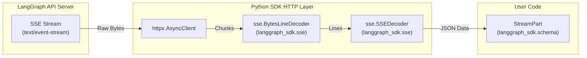

**SSE Decoding**:
- `BytesLineDecoder`: Splits incoming byte streams into lines, handling various line endings (`\n`, `\r`, `\r\n`). [libs/sdk-py/langgraph_sdk/sse.py:17-76]()
- `SSEDecoder`: Parses lines into SSE fields (`event`, `data`, `id`, `retry`) and yields `StreamPart` objects. [libs/sdk-py/langgraph_sdk/sse.py:78-140]()

Sources: [libs/sdk-py/langgraph_sdk/sse.py:1-158](), [libs/sdk-py/langgraph_sdk/schema.py:1-41]()

---

## Data Models and Schemas

The SDK uses `TypedDict` and `Literal` types to provide static type checking for API resources.

**Common Enums**:
- `RunStatus`: `pending`, `running`, `error`, `success`, `timeout`, `interrupted`. [libs/sdk-py/langgraph_sdk/schema.py:23-32]()
- `ThreadStatus`: `idle`, `busy`, `interrupted`, `error`. [libs/sdk-py/langgraph_sdk/schema.py:34-41]()
- `MultitaskStrategy`: `reject`, `interrupt`, `rollback`, `enqueue`. [libs/sdk-py/langgraph_sdk/schema.py:81-88]()
- `Durability`: `sync`, `async`, `exit`. [libs/sdk-py/langgraph_sdk/schema.py:104-109]()

**Resource Schemas**:
- `Assistant`: Represents a configured graph instance. [libs/sdk-py/langgraph_sdk/schema.py:246-278]()
- `Thread`: Represents a stateful conversation. [libs/sdk-py/langgraph_sdk/schema.py:283-315]()
- `Checkpoint`: Represents a saved state snapshot. [libs/sdk-py/langgraph_sdk/schema.py:208-219]()

Sources: [libs/sdk-py/langgraph_sdk/schema.py:1-315]()

---

## Usage Examples

### Async Client Initialization
```python
from langgraph_sdk import get_client

async with get_client(url="http://localhost:2024") as client:
    # Use client.assistants, client.threads, etc.
    assistants = await client.assistants.search()
```
Sources: [libs/sdk-py/langgraph_sdk/client.py:16-16](), [libs/sdk-py/langgraph_sdk/_async/client.py:1-20]()

### Streaming a Run
```python
async for chunk in client.runs.stream(
    thread_id=None, # Stateless run
    assistant_id="agent",
    input={"messages": [{"role": "user", "content": "hello"}]},
    stream_mode="values"
):
    if chunk.event == "values":
        print(chunk.data)
```
Sources: [libs/sdk-py/langgraph_sdk/_async/runs.py:194-210]()

# JavaScript/TypeScript SDK


This page documents the JavaScript/TypeScript SDK for interacting with a deployed LangGraph API server. It covers the client class structure, available resource sub-clients, SSE-based streaming, and the UI integration patterns supported by the SDK.

For the Python counterpart to this SDK, see page [5.1](). For the HTTP transport and streaming internals shared across both SDKs, see page [5.3](). For the server-side data models that both SDKs operate on, see page [5.5]().

---

## Overview

The JS/TS SDK (formerly in `libs/sdk-js`, now moved to `langchain-ai/langgraphjs`) provides a `Client` class that communicates with the LangGraph API server over HTTP and SSE [libs/sdk-js/README.md:1-1](). The SDK mirrors the Python SDK's resource sub-client model, providing a consistent interface for managing Assistants, Threads, Runs, and the Store.

**Diagram: JS/TS SDK Package Role in the Ecosystem**

```mermaid
graph TD
    subgraph "Browser / Node.js"
        [JSSDK] -- "@langchain/langgraph-sdk Client" --> [UI_LAYER]
        [UI_LAYER] -- "UI Components React/Next.js" --> [JSSDK]
    end

    subgraph "LangGraph API Server"
        [API] -- "LangGraph HTTP API /threads /runs /assistants /store" --> [PREGEL]
    end

    subgraph "Execution Engine"
        [PREGEL] -- "Pregel / StateGraph" --> [UI_MOD]
        [UI_MOD] -- "UIMessage / push_ui_message" --> [PREGEL]
    end

    [UI_LAYER] -->|"calls"| [JSSDK]
    [JSSDK] -->|"HTTP + SSE"| [API]
    [API] -->|"invokes"| [PREGEL]
    [PREGEL] -->|"emits custom stream events"| [UI_MOD]
    [UI_MOD] -->|"returned via SSE"| [JSSDK]
    [JSSDK] -->|"surfaced to UI"| [UI_LAYER]
```

Sources: [libs/sdk-js/README.md:1-1](), [libs/cli/js-examples/package.json:23-26]()

---

## Client Structure

The JS/TS SDK exposes a top-level `Client` class. After construction, the client provides typed sub-clients for each API resource as properties. This architecture matches the Python SDK's `LangGraphClient` [libs/sdk-py/README.md:17-30]().

**Diagram: JS Client Class Hierarchy**

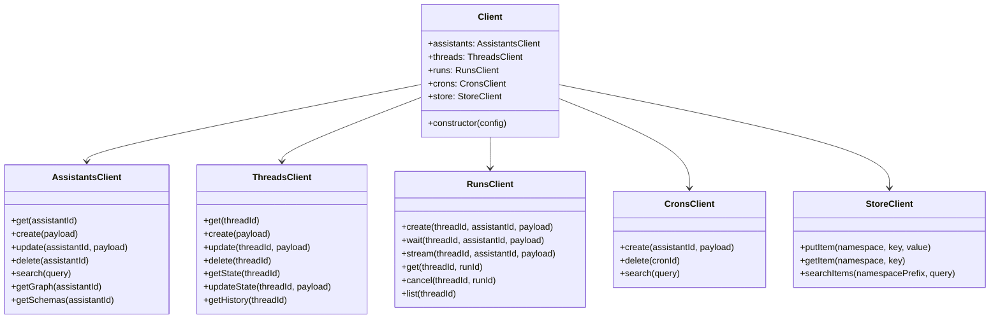

Sources: [libs/sdk-py/README.md:17-35](), [libs/cli/js-examples/package.json:23-26]()

---

## UI Integration and Message Handling

The SDK facilitates "Generative UI" patterns by handling specific message types designed for frontend rendering.

### UI Message Types
The SDK supports `UIMessage` and `RemoveUIMessage` structures, which allow the graph execution to signal UI changes.

| Type | Attributes | Purpose |
|---|---|---|
| `UIMessage` | `id`, `name`, `props`, `metadata` | Instructs the UI to render a specific component by name with provided props. |
| `RemoveUIMessage` | `id` | Instructs the UI to remove a previously rendered component. |

### State Reduction for UI
To manage the list of active UI components, the SDK logic handles merging new messages and applying removals.

- **Merging**: If a `UIMessage` arrives with an existing ID and `merge: true` in metadata, the SDK merges the new `props` with existing ones.
- **Removal**: If a `RemoveUIMessage` arrives, the message with the corresponding ID is filtered out of the state.

Sources: [libs/cli/js-examples/package.json:11-22](), [libs/cli/js-examples/yarn.lock:5-20]()

---

## Message State Management

The SDK handles complex message state updates using `add_messages`. This is critical for chat-based UIs where messages might be appended or updated (e.g., streaming LLM responses).

### `add_messages` Logic
The `add_messages` function ensures that the message list remains consistent by:
1. **Appending**: New messages are added to the end of the list.
2. **Updating**: If a message in the update list has an ID matching an existing message, the old message is replaced.
3. **Removing**: Supports `RemoveMessage` to delete specific entries from the state.

**Example: State Evolution**
```typescript
// Initial state
const left = [{ id: "1", content: "Hello" }];
// Update
const right = { id: "1", content: "Hello world" };
// Result
const result = add_messages(left, right); 
// [{ id: "1", content: "Hello world" }]
```

Sources: [libs/cli/js-examples/package.json:23-26](), [libs/cli/js-examples/yarn.lock:21-29]()

---

## Streaming and Events

The JS/TS SDK utilizes the `RunsClient.stream()` method to consume Server-Sent Events (SSE).

**Diagram: Streaming Data Flow**

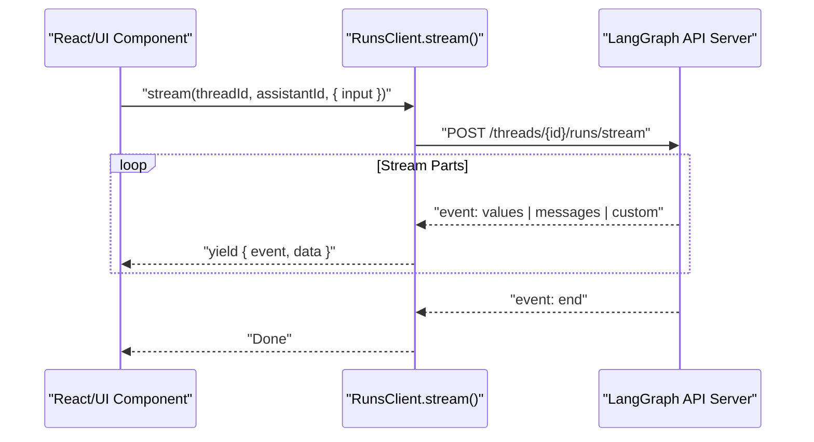

### Stream Modes
The SDK supports multiple stream modes that determine what data is pushed to the client:
- `values`: Full state snapshots after each step.
- `messages`: Incremental message updates (useful for chat).
- `custom`: Used for UI-specific events.

Sources: [libs/sdk-py/README.md:31-35](), [libs/cli/js-examples/package.json:14-15]()

# HTTP Client and Streaming


This document describes the underlying HTTP client layer and streaming protocol implementation in the LangGraph Python SDK. It covers the core `HttpClient` abstractions, the Server-Sent Events (SSE) decoding logic, JSON serialization via `orjson`, and the typed error handling system.

## HTTP Client Architecture

The SDK provides two primary HTTP client implementations: `HttpClient` for asynchronous operations and `SyncHttpClient` for synchronous operations. These classes wrap `httpx.AsyncClient` and `httpx.Client` respectively, adding LangGraph-specific features like automatic reconnection, typed error mapping, and specialized SSE streaming.

### HttpClient and SyncHttpClient

The clients serve as the foundational transport layer for all resource-specific clients (Assistants, Threads, Runs, etc.).

**Code Entity Mapping: HTTP Client Hierarchy**
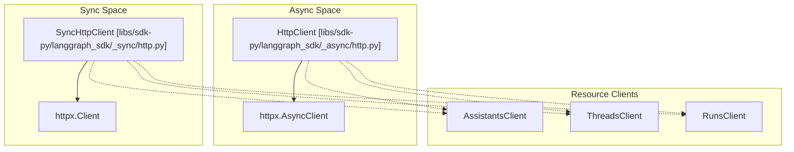
Sources: [libs/sdk-py/langgraph_sdk/_async/http.py:26-37](), [libs/sdk-py/langgraph_sdk/_sync/http.py:25-37]()

### Request Lifecycle and Methods

Both clients implement a standard set of HTTP methods. Each method performs the following steps:
1.  **Encoding**: Serializes the request body using `orjson` [libs/sdk-py/langgraph_sdk/_async/http.py:64-65]().
2.  **Execution**: Dispatches the request via the underlying `httpx` client [libs/sdk-py/langgraph_sdk/_async/http.py:71-73]().
3.  **Validation**: Calls `_araise_for_status_typed` (async) or `_raise_for_status_typed` (sync) to convert HTTP error codes into specific LangGraph exceptions [libs/sdk-py/langgraph_sdk/_async/http.py:76]().
4.  **Decoding**: Deserializes the response JSON [libs/sdk-py/langgraph_sdk/_async/http.py:77]().

| Method | Purpose | Implementation Details |
| :--- | :--- | :--- |
| `get` | Fetch resources | Supports query params and custom headers [libs/sdk-py/langgraph_sdk/_async/http.py:39-52]() |
| `post` | Create resources | Handles JSON encoding and multipart content [libs/sdk-py/langgraph_sdk/_async/http.py:54-77]() |
| `put` | Replace resources | Standard idempotent update [libs/sdk-py/langgraph_sdk/_async/http.py:79-98]() |
| `patch` | Partial update | Merges updates into existing resources [libs/sdk-py/langgraph_sdk/_async/http.py:100-119]() |
| `delete` | Remove resources | Standard deletion [libs/sdk-py/langgraph_sdk/_async/http.py:121-137]() |
| `stream` | SSE Streaming | Returns an iterator of `StreamPart` [libs/sdk-py/langgraph_sdk/_async/http.py:187-210]() |

Sources: [libs/sdk-py/langgraph_sdk/_async/http.py:39-137](), [libs/sdk-py/langgraph_sdk/_sync/http.py:39-137]()

## Server-Sent Events (SSE) Protocol

LangGraph uses SSE to stream graph execution updates (e.g., node transitions, token streams, debug info). The SDK implements a custom decoder to handle the specific requirements of the LangGraph API.

### BytesLineDecoder

The `BytesLineDecoder` is responsible for incrementally reading bytes and splitting them into lines according to the SSE specification (handling `\n`, `\r`, and `\r\n`).

**Code Entity Mapping: Streaming Data Flow**
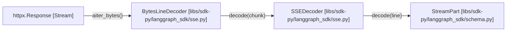
Sources: [libs/sdk-py/langgraph_sdk/sse.py:17-75](), [libs/sdk-py/langgraph_sdk/sse.py:142-149]()

### SSEDecoder and StreamPart

The `SSEDecoder` parses the raw SSE fields (`event`, `data`, `id`, `retry`).
-   **Event Accumulation**: It accumulates `data` lines until an empty line is encountered, which signals the end of the event [libs/sdk-py/langgraph_sdk/sse.py:103-114]().
-   **JSON Parsing**: The `data` field is parsed using `orjson.loads` [libs/sdk-py/langgraph_sdk/sse.py:105]().
-   **StreamPart**: The result is a `StreamPart` object containing the event name and the parsed payload [libs/sdk-py/langgraph_sdk/sse.py:103-107]().

Sources: [libs/sdk-py/langgraph_sdk/sse.py:78-139]()

### Reconnection Logic

The `stream` method implements a robust reconnection strategy:
1.  **Last-Event-ID**: It tracks the `id` field from the SSE stream [libs/sdk-py/langgraph_sdk/_async/http.py:211]().
2.  **Location Header**: If a connection is interrupted, the client looks for a `Location` header to determine where to resume [libs/sdk-py/langgraph_sdk/_async/http.py:228-232]().
3.  **Resume Headers**: Upon reconnection, it sends the `Last-Event-ID` header to ensure no data is lost during the gap [libs/sdk-py/langgraph_sdk/_async/http.py:236-240]().

Sources: [libs/sdk-py/langgraph_sdk/_async/http.py:211-260](), [libs/sdk-py/langgraph_sdk/_shared/utilities.py:166-193]()

## Error Handling

The SDK provides a typed exception hierarchy that maps HTTP status codes to specific Python classes.

### APIStatusError Hierarchy

When a request returns a status code >= 400, `_raise_for_status_typed` (or its async counterpart) is triggered. It decodes the error body to extract human-readable messages and error codes.

| HTTP Status | Exception Class | Description |
| :--- | :--- | :--- |
| 400 | `BadRequestError` | Invalid request parameters or body. |
| 401 | `AuthenticationError` | Missing or invalid API key. |
| 403 | `PermissionDeniedError` | Authenticated but unauthorized for the resource. |
| 404 | `NotFoundError` | Resource (thread, run, etc.) does not exist. |
| 409 | `ConflictError` | Resource state conflict (e.g., concurrent updates). |
| 422 | `UnprocessableEntityError` | Validation error (e.g., invalid graph state). |
| 429 | `RateLimitError` | Too many requests. |
| 5xx | `InternalServerError` | Server-side failures. |

Sources: [libs/sdk-py/langgraph_sdk/errors.py:108-137](), [libs/sdk-py/langgraph_sdk/errors.py:190-210]()

### Error Decoding Logic

The SDK attempts to find an error message in the response body by checking keys like `message`, `detail`, or `error` [libs/sdk-py/langgraph_sdk/errors.py:140-155](). If the body is structured as `{"error": {"message": "..."}}`, it correctly traverses the nested object [libs/sdk-py/langgraph_sdk/errors.py:148-154]().

Sources: [libs/sdk-py/langgraph_sdk/errors.py:140-188]()

## Shared Utilities

### Header Management

The SDK automatically injects standard headers, including `User-Agent` and the `x-api-key`. It prevents the use of reserved headers in `custom_headers` to maintain security [libs/sdk-py/langgraph_sdk/_shared/utilities.py:51-70]().

### JSON Serialization Fallbacks

The `_orjson_default` function provides serialization support for types not natively handled by `orjson`, such as:
-   Pydantic models (via `model_dump` or `dict`) [libs/sdk-py/langgraph_sdk/_shared/utilities.py:74-87]().
-   Python `set` and `frozenset` (converted to lists) [libs/sdk-py/langgraph_sdk/_shared/utilities.py:88-89]().

Sources: [libs/sdk-py/langgraph_sdk/_shared/utilities.py:21-91]()

# Authentication and Authorization


This page documents the authentication and authorization system available in the `langgraph-sdk` Python package. It covers the `Auth` class, how to register authentication and authorization handlers, the `FilterType` for server-side query filtering, all relevant user and context types, and how to wire everything together through `langgraph.json`.

For information about the HTTP client layer and error types (including `AuthenticationError`, `PermissionDeniedError`) raised when auth fails on the client side, see [HTTP Client and Streaming](#5.3). For the `langgraph.json` `auth` configuration block, see [Configuration System (langgraph.json)](#6.2).

---

## Overview

The auth system has two distinct stages that run server-side on every incoming request to the LangGraph API server:

1. **Authentication** — verifies the caller's identity and produces a user object.
2. **Authorization** — decides whether the authenticated user may perform the requested action on the requested resource, and optionally injects filters to limit what data is returned.

Both stages are configured by creating an `Auth` instance in a Python module, registering handlers on it with decorators, and pointing `langgraph.json` at that module.

**Request processing flow:**

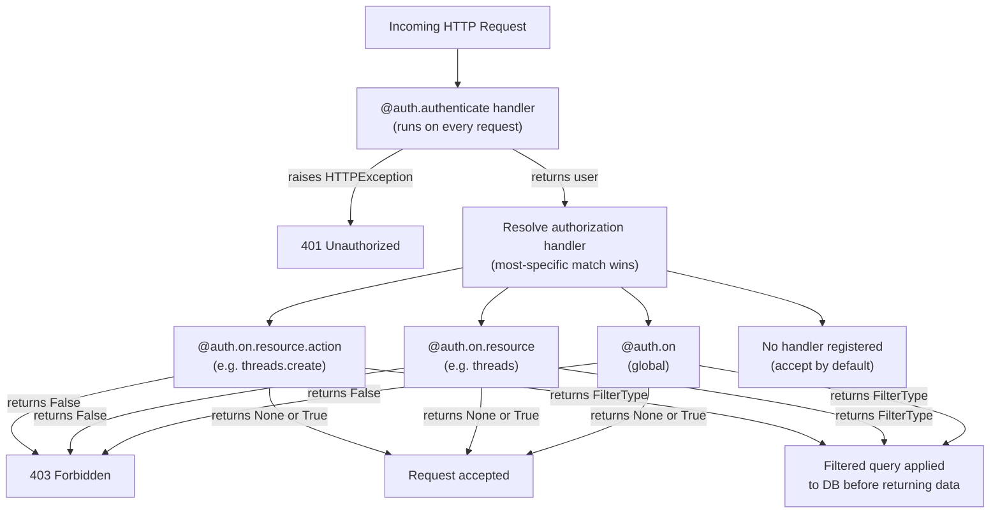

Sources: [libs/sdk-py/langgraph_sdk/auth/__init__.py:96-107]()

---

## The `Auth` Class

`Auth` is defined in [libs/sdk-py/langgraph_sdk/auth/__init__.py:13-301]() and exported from `langgraph_sdk` directly.

```python
from langgraph_sdk import Auth
```

Instantiate once per module; then use its decorators to register handlers.

| Attribute / Method | Type | Purpose |
|---|---|---|
| `authenticate` | decorator | Registers the single authentication handler |
| `on` | `_On` instance | Entry point for all authorization handler registration |
| `types` | module reference | Shortcut to `langgraph_sdk.auth.types` |
| `exceptions` | module reference | Shortcut to `langgraph_sdk.auth.exceptions` |

**Internal state** (accessed by the API server at runtime):

| Slot | Type | Purpose |
|---|---|---|
| `_authenticate_handler` | `Authenticator \| None` | The single registered auth function |
| `_handlers` | `dict[tuple[str,str], list[Handler]]` | Per `(resource, action)` handler lists |
| `_global_handlers` | `list[Handler]` | Handlers registered on `@auth.on` with no resource/action |
| `_handler_cache` | `dict[tuple[str,str], Handler]` | Resolved handler cache |

Sources: [libs/sdk-py/langgraph_sdk/auth/__init__.py:109-224]()

---

## Authentication — `@auth.authenticate`

Registers one async function as the credential verifier. Only one authenticator may be registered per `Auth` instance [libs/sdk-py/langgraph_sdk/auth/__init__.py:225-231]().

The server injects the following parameters by name into the handler (any subset can be declared):

| Parameter | Type | Description |
|---|---|---|
| `request` | `Request` | Raw ASGI request object |
| `body` | `dict` | Parsed request body |
| `path` | `str` | URL path, e.g. `/threads/…/runs/…/stream` |
| `method` | `str` | HTTP method, e.g. `GET` |
| `path_params` | `dict[str, str] \| None` | URL path parameters |
| `query_params` | `dict[str, str] \| None` | URL query parameters |
| `headers` | `dict[bytes, bytes] \| None` | Request headers |
| `authorization` | `str \| None` | Value of the `Authorization` header |

The handler must return one of:
- A `str` (treated as `identity`)
- A `MinimalUserDict` (TypedDict with `identity` required)
- Any object implementing `MinimalUser` or `BaseUser`
- Any `Mapping[str, Any]` with at least an `"identity"` key

If authentication fails, raise `Auth.exceptions.HTTPException(status_code=401, ...)` [libs/sdk-py/langgraph_sdk/auth/exceptions.py:9-44]().

**Usage example:**

```python
@auth.authenticate
async def authenticate(authorization: str) -> Auth.types.MinimalUserDict:
    user = await verify_token(authorization)
    if not user:
        raise Auth.exceptions.HTTPException(status_code=401, detail="Unauthorized")
    return {"identity": user["id"], "permissions": user.get("permissions", [])}
```

Sources: [libs/sdk-py/langgraph_sdk/auth/__init__.py:225-301](), [libs/sdk-py/langgraph_sdk/auth/types.py:277-370]()

---

## Authorization — `auth.on`

`auth.on` is an instance of `_On` [libs/sdk-py/langgraph_sdk/auth/__init__.py:130](). It serves as the root for registering authorization handlers at three levels of specificity.

**Authorization handler class structure:**

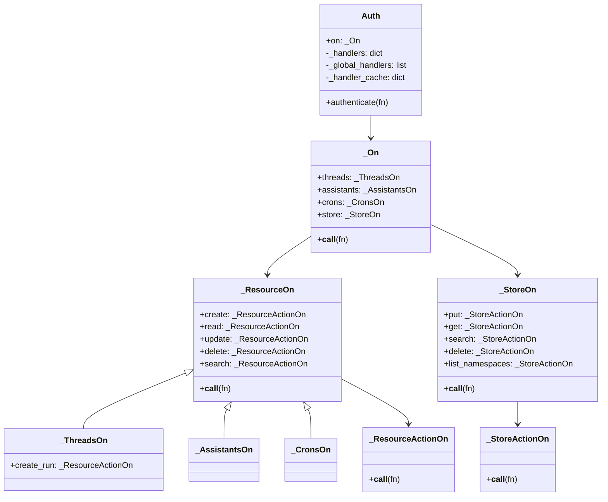

Sources: [libs/sdk-py/langgraph_sdk/auth/__init__.py:318-744]()

### Handler Levels

**Global handler** — runs for all resources and actions not matched by a more specific handler:

```python
@auth.on
async def deny_all(ctx: Auth.types.AuthContext, value: Any) -> bool:
    return False
```

**Resource-level handler** — runs for all actions on the specified resource:

```python
@auth.on.threads
async def allow_threads(ctx: Auth.types.AuthContext, value: Any) -> Auth.types.FilterType:
    return {"owner": ctx.user.identity}
```

**Resource + action handler** — most specific; overrides both of the above:

```python
@auth.on.threads.create
async def on_thread_create(ctx: Auth.types.AuthContext, value: Auth.types.on.threads.create.value):
    value.setdefault("metadata", {})["owner"] = ctx.user.identity
```

**Multi-resource / multi-action** — parameterized form:

```python
@auth.on(resources=["threads", "assistants"], actions=["read", "search"])
async def allow_reads(ctx: Auth.types.AuthContext, value: Any) -> Auth.types.FilterType:
    return {"owner": ctx.user.identity}
```

### Handler Precedence

When a request arrives, the server selects the most specific registered handler:

```
(resource, action)  →  (resource, "*")  →  global  →  accept (no handler)
```

Only one handler is invoked per request. The first matching level wins [libs/sdk-py/langgraph_sdk/auth/__init__.py:96-107]().

### Handler Signature

Every authorization handler must be `async` and accept exactly two parameters (by name) [libs/sdk-py/langgraph_sdk/auth/__init__.py:140-142]():

| Parameter | Type | Description |
|---|---|---|
| `ctx` | `AuthContext` | Authenticated user, permissions, resource, action |
| `value` | resource-specific TypedDict | The operation payload (see resource value types below) |

---

## Handler Return Values

| Return value | Meaning |
|---|---|
| `None` or `True` | Accept the request |
| `False` | Reject with HTTP 403 |
| `FilterType` | Apply the filter to the database query before returning data |

`HandlerResult` is defined as `None | bool | FilterType` in [libs/sdk-py/langgraph_sdk/auth/types.py:138-143]().

---

## `FilterType`

`FilterType` [libs/sdk-py/langgraph_sdk/auth/types.py:58-109]() is a `dict` returned by authorization handlers to restrict which records the server returns. The server applies it as a WHERE-clause equivalent.

**Supported operators:**

| Syntax | Meaning |
|---|---|
| `{"field": "value"}` | Exact match (shorthand) |
| `{"field": {"$eq": "value"}}` | Exact match (explicit) |
| `{"field": {"$contains": "value"}}` | Field list/set contains `value` |
| `{"field": {"$contains": ["v1", "v2"]}}` | Field list/set contains all of `v1`, `v2` |
| Multiple keys | Logical AND of all conditions |

**Examples:**

```python
# Exact match
{"owner": ctx.user.identity}

# Membership check
{"participants": {"$contains": ctx.user.identity}}

# AND combination
{"owner": ctx.user.identity, "participants": {"$contains": "user-efgh456"}}
```

> Subset containment (`$contains` with a list) requires `langgraph-runtime-inmem >= 0.14.1` [libs/sdk-py/langgraph_sdk/auth/types.py:75-76]().

Sources: [libs/sdk-py/langgraph_sdk/auth/types.py:58-109]()

---

## User Types

**Class / type hierarchy for user objects:**

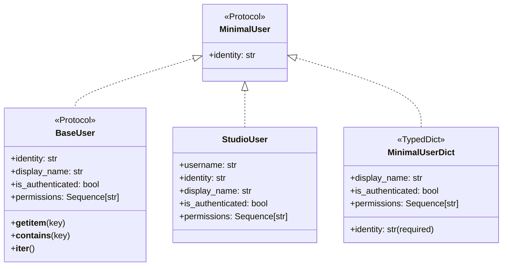

| Type | Location | Purpose |
|---|---|---|
| `MinimalUser` | [libs/sdk-py/langgraph_sdk/auth/types.py:150-161]() | Protocol: only requires `identity` property |
| `MinimalUserDict` | [libs/sdk-py/langgraph_sdk/auth/types.py:164-178]() | TypedDict returned by most authenticators |
| `BaseUser` | [libs/sdk-py/langgraph_sdk/auth/types.py:181-215]() | Full ASGI user protocol |
| `StudioUser` | [libs/sdk-py/langgraph_sdk/auth/types.py:218-275]() | Populated for requests from LangGraph Studio UI |
| `Authenticator` | [libs/sdk-py/langgraph_sdk/auth/types.py:277-370]() | `Callable` type alias for authenticate functions |

### `StudioUser`

`StudioUser` is set as `ctx.user` when a request originates from the LangGraph Studio frontend. Studio auth can be disabled in `langgraph.json` [libs/sdk-py/langgraph_sdk/auth/types.py:223-229]():

```json
{
  "auth": {
    "disable_studio_auth": true
  }
}
```

Use `isinstance(ctx.user, Auth.types.StudioUser)` inside `@auth.on` handlers to grant developers pass-through access while applying normal rules to end users [libs/sdk-py/langgraph_sdk/auth/types.py:231-245]().

Sources: [libs/sdk-py/langgraph_sdk/auth/types.py:150-275]()

---

## `AuthContext`

`AuthContext` [libs/sdk-py/langgraph_sdk/auth/types.py:388-426]() is the `ctx` object injected into every authorization handler.

| Field | Type | Description |
|---|---|---|
| `user` | `BaseUser` | The authenticated user object |
| `permissions` | `Sequence[str]` | The user's permissions list |
| `resource` | `Literal["runs","threads","crons","assistants","store"]` | The resource being accessed |
| `action` | `Literal[...]` | The action being performed |

**Actions by resource:**

| Resource | Actions |
|---|---|
| `threads` | `create`, `read`, `update`, `delete`, `search`, `create_run` |
| `assistants` | `create`, `read`, `update`, `delete`, `search` |
| `crons` | `create`, `read`, `update`, `delete`, `search` |
| `store` | `put`, `get`, `search`, `delete`, `list_namespaces` |

Sources: [libs/sdk-py/langgraph_sdk/auth/types.py:373-426]()

---

## Resource Value TypedDicts

The `value` parameter in authorization handlers is a TypedDict specific to the resource and action. All are defined in [libs/sdk-py/langgraph_sdk/auth/types.py]().

**Threads:**

| Action | TypedDict | Key fields |
|---|---|---|
| `create` | `ThreadsCreate` | `thread_id`, `metadata`, `if_exists`, `ttl` |
| `read` | `ThreadsRead` | `thread_id`, `run_id` |
| `update` | `ThreadsUpdate` | `thread_id`, `metadata`, `action` |
| `delete` | `ThreadsDelete` | `thread_id`, `run_id` |
| `search` | `ThreadsSearch` | `metadata`, `values`, `status`, `limit`, `offset` |
| `create_run` | `RunsCreate` | `thread_id`, `assistant_id`, `run_id`, `metadata`, `kwargs` |

**Store** [libs/sdk-py/langgraph_sdk/auth/types.py:844-934]():

| Action | TypedDict | Key fields |
|---|---|---|
| `put` | `StorePut` | `namespace`, `key`, `value`, `ttl` |
| `get` | `StoreGet` | `namespace`, `key` |
| `search` | `StoreSearch` | `namespace`, `query`, `filter`, `limit`, `offset` |
| `delete` | `StoreDelete` | `namespace`, `key` |
| `list_namespaces` | `StoreListNamespaces` | `prefix`, `suffix`, `max_depth`, `limit`, `offset` |

> For the store resource, `value` is mutable. Modifying `value["namespace"]` rewrites the namespace used for the actual operation — this is the standard pattern for scoping store access per user [libs/sdk-py/langgraph_sdk/auth/__init__.py:88-94]().

Sources: [libs/sdk-py/langgraph_sdk/auth/types.py:443-end]()

---

## Wiring into `langgraph.json`

The `Auth` instance is loaded by the LangGraph API server at startup. Point to it via the `auth.path` key in `langgraph.json` [libs/sdk-py/langgraph_sdk/auth/__init__.py:26-38]():

```json
{
  "dependencies": ["."],
  "graphs": {
    "agent": "./my_agent/agent.py:graph"
  },
  "env": ".env",
  "auth": {
    "path": "./auth.py:my_auth"
  }
}
```

The value of `path` follows the format `<module_path>:<variable_name>`.

**Auth flow from configuration to request handling:**

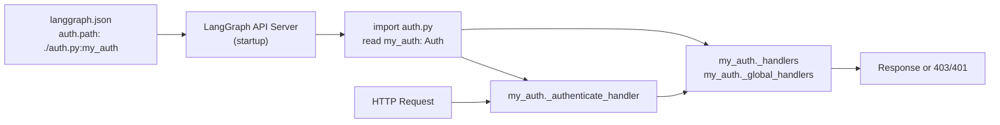

Sources: [libs/sdk-py/langgraph_sdk/auth/__init__.py:26-40]()

---

## Exceptions

`Auth.exceptions` is a module reference to `langgraph_sdk.auth.exceptions`. Use `Auth.exceptions.HTTPException` inside authentication handlers to return structured error responses [libs/sdk-py/langgraph_sdk/auth/exceptions.py:9-57]():

```python
raise Auth.exceptions.HTTPException(status_code=401, detail="Invalid token")
```

Sources: [libs/sdk-py/langgraph_sdk/auth/exceptions.py:1-60](), [libs/sdk-py/langgraph_sdk/auth/__init__.py:121-127]()

---

## Complete Handler Pattern Reference

The following diagram summarizes which decorator to use for each combination of resource and action.

```mermaid
flowchart TD
    ON["auth.on"] -->|"__call__(fn)"| GLOBAL["_global_handlers\nkey: ('*','*')"]
    ON --> TH["auth.on.threads\n_ThreadsOn"]
    ON --> AS["auth.on.assistants\n_AssistantsOn"]
    ON --> CR["auth.on.crons\n_CronsOn"]
    ON --> ST["auth.on.store\n_StoreOn"]

    TH -->|"__call__(fn)"| TH_ALL["('threads','*')"]
    TH --> TH_C["auth.on.threads.create\n('threads','create')"]
    TH --> TH_R["auth.on.threads.read\n('threads','read')"]
    TH --> TH_U["auth.on.threads.update\n('threads','update')"]
    TH --> TH_D["auth.on.threads.delete\n('threads','delete')"]
    TH --> TH_S["auth.on.threads.search\n('threads','search')"]
    TH --> TH_CR["auth.on.threads.create_run\n('threads','create_run')"]

    AS -->|"__call__(fn)"| AS_ALL["('assistants','*')"]
    AS --> AS_C["auth.on.assistants.create"]
    AS --> AS_R["auth.on.assistants.read"]
    AS --> AS_D["auth.on.assistants.delete"]
    AS --> AS_S["auth.on.assistants.search"]

    ST -->|"__call__(fn)"| ST_ALL["('store','*')"]
    ST --> ST_P["auth.on.store.put\n('store','put')"]
    ST --> ST_G["auth.on.store.get\n('store','get')"]
    ST --> ST_S["auth.on.store.search\n('store','search')"]
    ST --> ST_D["auth.on.store.delete\n('store','delete')"]
    ST --> ST_L["auth.on.store.list_namespaces\n('store','list_namespaces')"]
```

Sources: [libs/sdk-py/langgraph_sdk/auth/__init__.py:440-744]()

---

## Custom Encryption (Beta)

The `Encryption` class [libs/sdk-py/langgraph_sdk/encryption/__init__.py:201-216]() provides a system for implementing custom at-rest encryption. Similar to `Auth`, it is configured via `langgraph.json` and uses decorators to register async handlers.

### Encryption Handlers

Handlers are provided for two data types:
1. **Blobs**: Opaque data like checkpoint blobs [libs/sdk-py/langgraph_sdk/encryption/__init__.py:77-104]().
2. **JSON**: Structured data like metadata or thread values [libs/sdk-py/langgraph_sdk/encryption/__init__.py:106-131]().

**Encryption flow and entities:**

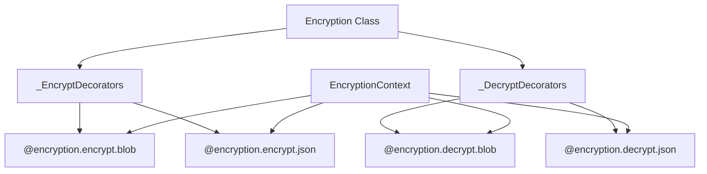

### `EncryptionContext`

The `EncryptionContext` [libs/sdk-py/langgraph_sdk/encryption/types.py:17-43]() provides metadata about what is being encrypted:
- `model`: The entity type (e.g., "assistant", "thread").
- `field`: The specific field (e.g., "metadata", "values").
- `metadata`: Arbitrary key-values for the encryption service.

### Context Handlers

A `ContextHandler` [libs/sdk-py/langgraph_sdk/encryption/types.py:124-147]() can be registered to derive encryption metadata from the authenticated user (e.g., pulling a tenant ID from a JWT) before encryption occurs.

Sources: [libs/sdk-py/langgraph_sdk/encryption/__init__.py:1-216](), [libs/sdk-py/langgraph_sdk/encryption/types.py:1-147]()

# Data Models and Schemas


This document describes the data models and type definitions in the LangGraph SDK's schema module. These types define the contract between client and server, providing structured representations of resources (Assistants, Threads, Runs, Crons), execution state, requests/responses, and streaming events.

For information about how these schemas are used in client operations, see [Python SDK](#5.1). For authentication-related type definitions, see [Authentication and Authorization](#5.4).

---

## Overview

The schema module ([libs/sdk-py/langgraph_sdk/schema.py:1-659]()) serves as the single source of truth for all data structures exchanged between the LangGraph SDK client and the LangGraph API server. It defines:

- **Resource types**: Persistent entities like `Assistant`, `Thread`, `Run`, `Cron`
- **Graph schema types**: Graph structure definitions like `GraphSchema`, `Subgraphs`
- **State types**: Execution state representations like `ThreadState`, `Checkpoint`, `ThreadTask`
- **Request/response types**: Payloads for API operations like `RunCreate`, `ThreadUpdateStateResponse`, `RunCreateMetadata`
- **Store types**: Cross-thread memory structures like `Item`, `SearchItem`
- **Streaming types**: Real-time event representations like `StreamPart`
- **Control flow types**: Graph execution control like `Command`, `Send`
- **Type aliases**: Constrained values like `RunStatus`, `StreamMode`, `MultitaskStrategy`, `PruneStrategy`, `BulkCancelRunsStatus`

All types are defined using Python's `TypedDict`, `NamedTuple`, or type aliases, providing static type checking while maintaining JSON serialization compatibility.

**Sources**: [libs/sdk-py/langgraph_sdk/schema.py:1-21]()

---

## Type System Architecture

### Natural Language to Code Entity Mapping
This diagram maps abstract system concepts to their specific `TypedDict` or `Literal` implementations in the codebase.

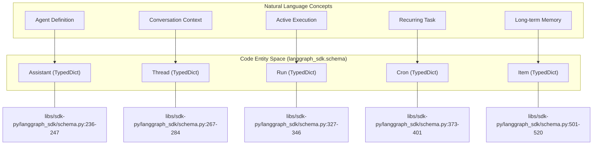

**Sources**: [libs/sdk-py/langgraph_sdk/schema.py:236-520]()

### Internal Data Flow
The following diagram illustrates how core data structures relate to one another during graph execution.

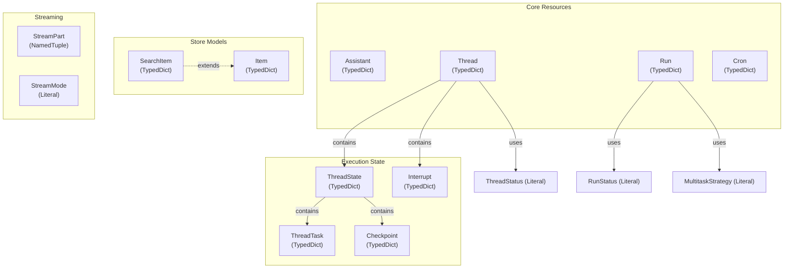

**Sources**: [libs/sdk-py/langgraph_sdk/schema.py:23-545]()

---

## Core Resource Models

### Assistant
The `Assistant` type represents a versioned configuration for a graph. It encapsulates the graph to execute, runtime configuration, static context, and metadata.

| Field | Type | Description |
|-------|------|-------------|
| `assistant_id` | `str` | Unique identifier |
| `graph_id` | `str` | Reference to the graph definition |
| `config` | `Config` | Runtime configuration including tags and recursion limits |
| `context` | `Context` | Static context passed to the graph |
| `metadata` | `Json` | Arbitrary metadata dictionary |
| `version` | `int` | Auto-incrementing version number |

**Sources**: [libs/sdk-py/langgraph_sdk/schema.py:236-247](), [libs/sdk-py/langgraph_sdk/schema.py:185-206]()

### Thread
The `Thread` type represents a conversation or execution context. It maintains current state, status, and any pending interrupts.

| Field | Type | Description |
|-------|------|-------------|
| `thread_id` | `str` | Unique identifier |
| `status` | `ThreadStatus` | Current status: `"idle"`, `"busy"`, `"interrupted"`, or `"error"` |
| `values` | `Json` | Current state values |
| `interrupts` | `dict[str, list[Interrupt]]` | Map of task IDs to interrupts |

**Sources**: [libs/sdk-py/langgraph_sdk/schema.py:267-284](), [libs/sdk-py/langgraph_sdk/schema.py:34-41]()

### Run
The `Run` type represents a single execution of a graph on a thread. It tracks execution status and defines behavior for concurrent runs.

| Field | Type | Description |
|-------|------|-------------|
| `run_id` | `str` | Unique identifier |
| `status` | `RunStatus` | `"pending"`, `"running"`, `"error"`, `"success"`, `"timeout"`, `"interrupted"` |
| `multitask_strategy` | `MultitaskStrategy` | `"reject"`, `"interrupt"`, `"rollback"`, `"enqueue"` |

**Sources**: [libs/sdk-py/langgraph_sdk/schema.py:327-346](), [libs/sdk-py/langgraph_sdk/schema.py:23-32](), [libs/sdk-py/langgraph_sdk/schema.py:81-88]()

### Cron
The `Cron` type represents a scheduled task that creates runs at specified intervals.

| Field | Type | Description |
|-------|------|-------------|
| `cron_id` | `str` | Unique identifier |
| `schedule` | `str` | Cron schedule expression (e.g., "0 0 * * *") |
| `next_run_date` | `datetime \| None` | Next scheduled execution time |
| `enabled` | `bool` | Whether the cron job is active |

**Sources**: [libs/sdk-py/langgraph_sdk/schema.py:373-401]()

---

## State and Execution Models

### ThreadState
The `ThreadState` type represents a snapshot of graph execution state at a specific point in time.

| Field | Type | Description |
|-------|------|-------------|
| `values` | `list[dict] \| dict[str, Any]` | Current state values |
| `next` | `Sequence[str]` | Node names to execute next |
| `checkpoint` | `Checkpoint` | Checkpoint identifier |
| `tasks` | `Sequence[ThreadTask]` | Tasks scheduled for this step |

**Sources**: [libs/sdk-py/langgraph_sdk/schema.py:298-318]()

---

## Store Models

### Item and SearchItem
The `Item` type represents a document stored in the cross-thread memory store.

| Field | Type | Description |
|-------|------|-------------|
| `namespace` | `list[str]` | Hierarchical namespace (e.g., `["user_1", "prefs"]`) |
| `key` | `str` | Unique identifier within namespace |
| `value` | `dict[str, Any]` | Document content |

`SearchItem` extends `Item` with a `score: float | None` field for vector search results.

**Sources**: [libs/sdk-py/langgraph_sdk/schema.py:501-538]()

---

## Streaming Models

### StreamPart
The `StreamPart` type represents a single Server-Sent Event (SSE) from a streaming run.

```python
class StreamPart(NamedTuple):
    event: str
    data: dict
    id: str | None = None
```

Common event types include `"values"`, `"messages"`, `"updates"`, and `"debug"`.

**Sources**: [libs/sdk-py/langgraph_sdk/schema.py:547-556]()

### StreamMode
The `StreamMode` literal type defines available streaming granularities.

| Mode | Description |
|------|-------------|
| `"values"` | Stream complete state values after each node |
| `"updates"` | Stream incremental state updates |
| `"events"` | Stream execution events (node start/end) |
| `"debug"` | Stream detailed debug information |

**Sources**: [libs/sdk-py/langgraph_sdk/schema.py:51-72]()

---

## Summary of Schema Types

| Category | Key Types |
|----------|-----------|
| **Resources** | `Assistant`, `Thread`, `Run`, `Cron` |
| **State** | `ThreadState`, `Checkpoint`, `ThreadTask` |
| **Store** | `Item`, `SearchItem`, `ListNamespaceResponse` |
| **Streaming** | `StreamPart`, `StreamMode` |
| **Control Flow** | `Command`, `Send` |
| **Literals** | `RunStatus`, `ThreadStatus`, `MultitaskStrategy` |

**Sources**: [libs/sdk-py/langgraph_sdk/schema.py:1-659]()