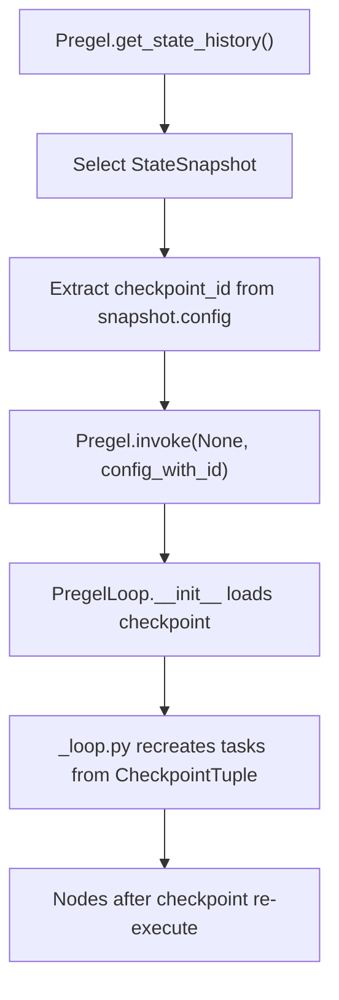
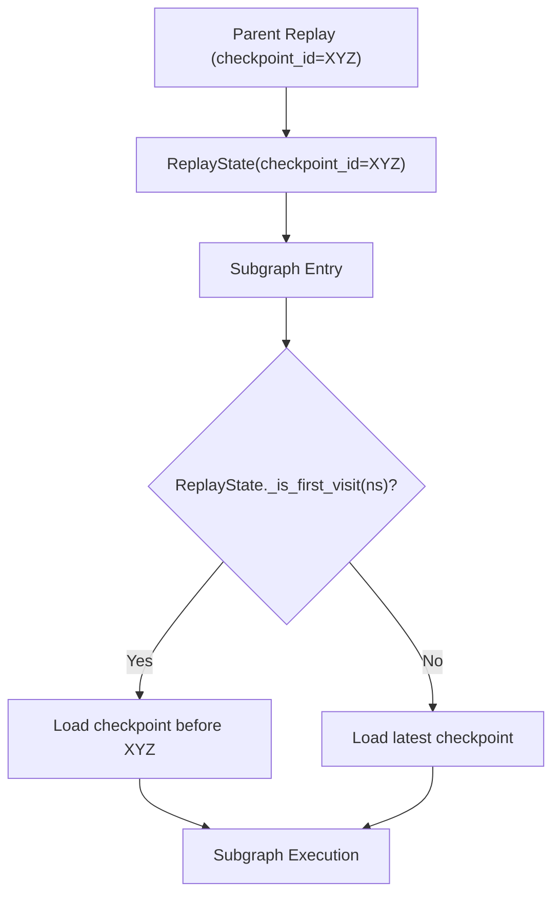

This document explains LangGraph's time travel and state forking capabilities, which enable replaying graph execution from historical checkpoints and creating alternate execution branches. These features allow you to navigate checkpoint history, re-execute nodes from any point in time, and explore alternative execution paths.

**Scope**: This page covers the mechanics of replaying from checkpoints and forking execution state. For information about the checkpoint data structures and persistence layer, see [Checkpointing Architecture](4.1). For interrupt handling during execution, see [Human-in-the-Loop and Interrupts](3.7).

## Core Concepts

### Checkpoints and State History

Every step in a LangGraph execution creates a checkpoint that captures channel values (state), pending tasks, and metadata. Checkpoints form a linked list through `parent_config`, creating an execution history. The `get_state_history` method in `Pregel` [libs/langgraph/langgraph/pregel/main.py:1155-1244]() (and its async counterpart `aget_state_history`) traverses this chain in reverse chronological order.

Sources: [libs/langgraph/langgraph/pregel/main.py:1155-1244](), [libs/langgraph/tests/test_time_travel.py:34-61]()

### Replay vs Fork

LangGraph supports two distinct time-travel operations defined by how they interact with the checkpointer:

| Operation | Mechanism | Checkpoint Lineage | Use Case |
|-----------|-----------|-------------------|----------|
| **Replay** | Invoke with `checkpoint_id` in config | Continues same lineage | Re-execute from a point, interrupts re-fire |
| **Fork** | `update_state()` then invoke | Creates new branch | Explore alternative execution paths |

**Replay**: Re-executes nodes that come after the specified checkpoint. Nodes before the checkpoint are not re-run [libs/langgraph/tests/test_time_travel.py:69-110](). Interrupts encountered during the original execution will re-fire during replay because pending tasks are recreated [libs/langgraph/tests/test_time_travel.py:13-17]().

**Fork**: Creates a new checkpoint via `update_state` [libs/langgraph/langgraph/pregel/main.py:1462-1529](). This new checkpoint does not contain the cached pending writes of the original, forcing nodes to re-execute and creating a separate execution branch [libs/langgraph/tests/test_time_travel.py:143-180]().

Sources: [libs/langgraph/langgraph/pregel/main.py:1462-1529](), [libs/langgraph/tests/test_time_travel.py:1-17](), [libs/langgraph/langgraph/pregel/_loop.py:148-210]()

## Replay Mechanism

### Basic Replay Flow

The following diagram illustrates how the system transitions from a historical state to a replayed execution.

**Replay Execution Data Flow**


When replaying, the `PregelLoop` [libs/langgraph/langgraph/pregel/_loop.py:148-210]() detects the `checkpoint_id` in the `RunnableConfig` [libs/langgraph/langgraph/_internal/_constants.py:53-54](). It uses the checkpointer to load the specific state at that point in time.

Sources: [libs/langgraph/langgraph/pregel/_loop.py:148-210](), [libs/langgraph/tests/test_time_travel.py:69-110](), [libs/langgraph/langgraph/_internal/_constants.py:53-54]()

### ReplayState for Subgraphs

When replaying a parent graph that contains subgraphs, the `ReplayState` class [libs/langgraph/langgraph/_internal/_replay.py:14-24]() ensures subgraphs load the correct checkpoints relative to the parent's replay point.

**Subgraph Checkpoint Resolution**


The `ReplayState` tracks visited namespaces in `_visited_ns` [libs/langgraph/langgraph/_internal/_replay.py:32-32](). On the first visit to a subgraph during a replay, it searches for the checkpoint immediately preceding the parent's replay point using `checkpointer.list` with a `before` filter [libs/langgraph/langgraph/_internal/_replay.py:65-72]().

Sources: [libs/langgraph/langgraph/_internal/_replay.py:14-91](), [libs/langgraph/langgraph/_internal/_constants.py:44-46]()

## State Forking

### Fork Creation with update_state

Forking creates a new checkpoint branch. Calling `update_state()` [libs/langgraph/langgraph/pregel/main.py:1462-1529]() followed by `invoke()` results in a fork:

```python