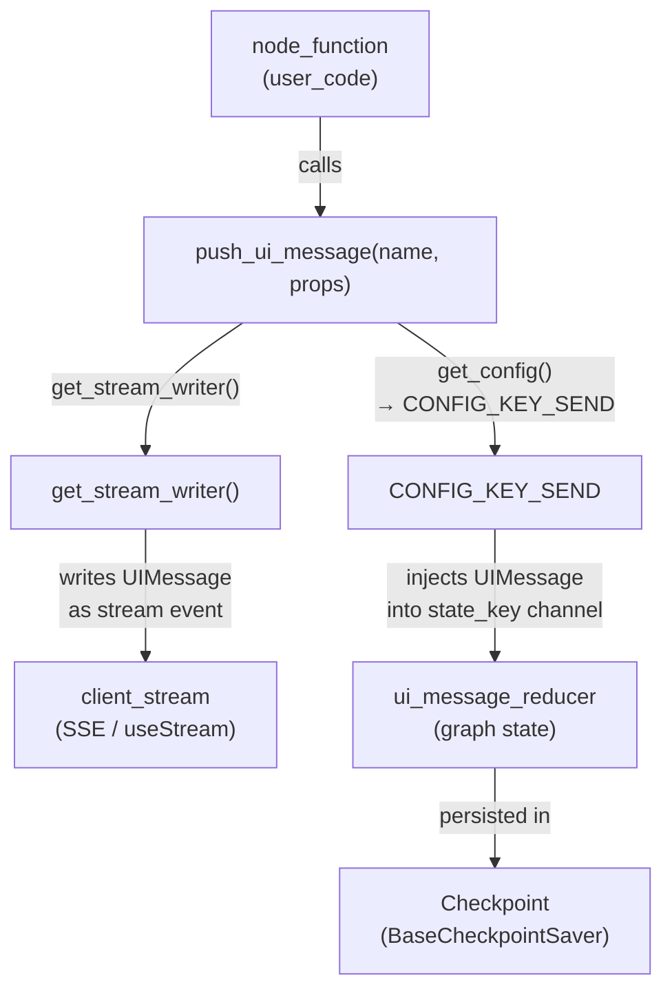
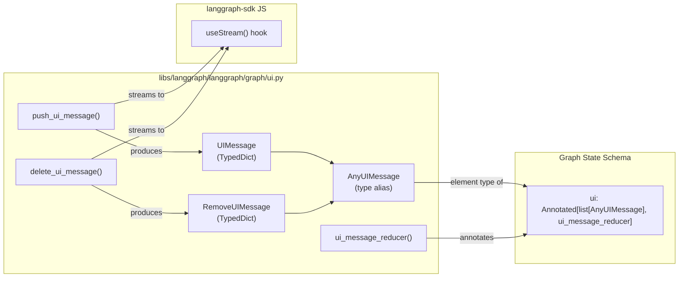
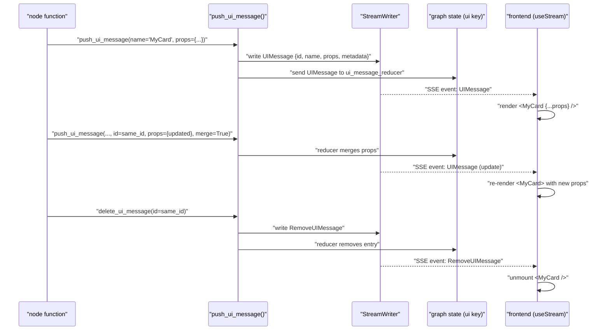

This page documents the generative UI system in LangGraph: the server-side Python API for emitting UI component messages from within graph nodes (`push_ui_message`, `delete_ui_message`, `UIMessage`, `RemoveUIMessage`, `ui_message_reducer`), and the convention for wiring these into graph state. The JavaScript/TypeScript `useStream` React hook for consuming these messages on the frontend is documented in the JavaScript SDK page (see [5.2]()). For general streaming event modes, see [7.4]().

---

## Purpose

Generative UI allows graph nodes to emit structured UI component descriptors while they execute. The frontend consumes these descriptors in real time and renders React components. This enables patterns like streaming progress indicators, rich result cards, and interactive elements that update as the graph runs — without the frontend needing to know about the internal logic of the graph.

---

## Core Data Types

All types are defined in `libs/langgraph/langgraph/graph/ui.py` [libs/langgraph/langgraph/graph/ui.py:1-58]().

### `UIMessage`

Represents a UI component that should be rendered.

[libs/langgraph/langgraph/graph/ui.py:22-41]()

| Field | Type | Description |
|---|---|---|
| `type` | `Literal["ui"]` | Discriminator field. Always `"ui"`. |
| `id` | `str` | Unique identifier for this UI message. Used for updates and deletion. |
| `name` | `str` | Name of the React component to render on the frontend. |
| `props` | `dict[str, Any]` | Properties passed to the component. |
| `metadata` | `dict[str, Any]` | Internal metadata: `run_id`, `tags`, `name`, `merge`, `message_id`. |

### `RemoveUIMessage`

Signals that a previously emitted UI component should be removed.

[libs/langgraph/langgraph/graph/ui.py:43-56]()

| Field | Type | Description |
|---|---|---|
| `type` | `Literal["remove-ui"]` | Discriminator field. Always `"remove-ui"`. |
| `id` | `str` | ID of the `UIMessage` to remove. |

### `AnyUIMessage`

A type alias: `UIMessage | RemoveUIMessage`.

[libs/langgraph/langgraph/graph/ui.py:58]()

---

## Backend API

### `push_ui_message`

[libs/langgraph/langgraph/graph/ui.py:61-130]()

Called from inside a graph node to emit a UI component. This function has two effects simultaneously:

1. **Streams** the `UIMessage` to connected clients via the current `StreamWriter` obtained from `get_stream_writer()` [libs/langgraph/langgraph/graph/ui.py:101-126]().
2. **Updates** the graph state by injecting the `UIMessage` under `state_key` using the internal `CONFIG_KEY_SEND` mechanism [libs/langgraph/langgraph/graph/ui.py:128]().

**Signature:**

```python
push_ui_message(
    name: str,
    props: dict[str, Any],
    *,
    id: str | None = None,
    metadata: dict[str, Any] | None = None,
    message: AnyMessage | None = None,
    state_key: str | None = "ui",
    merge: bool = False,
) -> UIMessage
```

**Parameters:**

| Parameter | Default | Description |
|---|---|---|
| `name` | required | The React component name to render on the frontend. |
| `props` | required | Props dictionary passed to the component. |
| `id` | `None` | Explicit ID. If `None`, a `uuid4()` is generated [libs/langgraph/langgraph/graph/ui.py:113](). |
| `metadata` | `None` | Extra metadata merged into the message's `metadata` field. |
| `message` | `None` | An associated `AnyMessage`; its `.id` is recorded as `message_id` in metadata [libs/langgraph/langgraph/graph/ui.py:105-123](). |
| `state_key` | `"ui"` | The graph state key under which the message is stored. Set to `None` to skip state update. |
| `merge` | `False` | If `True`, instructs the reducer to merge `props` with existing props rather than replace [libs/langgraph/langgraph/graph/ui.py:117](). |

**Returns:** The constructed `UIMessage` dict [libs/langgraph/langgraph/graph/ui.py:130]().

When `state_key` is `None`, the message is streamed to the client but **not** persisted into graph state.

---

### `delete_ui_message`

[libs/langgraph/langgraph/graph/ui.py:133-162]()

Called from inside a graph node to remove a previously emitted UI component.

**Signature:**

```python
delete_ui_message(id: str, *, state_key: str = "ui") -> RemoveUIMessage
```

| Parameter | Default | Description |
|---|---|---|
| `id` | required | ID of the `UIMessage` to remove. |
| `state_key` | `"ui"` | The graph state key from which to remove the message. |

This function streams a `RemoveUIMessage` to clients via `writer(evt)` and applies the deletion to graph state via `CONFIG_KEY_SEND` [libs/langgraph/langgraph/graph/ui.py:159-160]().

Sources: [libs/langgraph/langgraph/graph/ui.py:133-162]()

---

## State Integration

### `ui_message_reducer`

[libs/langgraph/langgraph/graph/ui.py:165-227]()

A reducer function used as the annotation for the `ui` field in a graph's `TypedDict` state schema. It handles both normal additions and `remove-ui` deletions.

```python
def ui_message_reducer(
    left: list[AnyUIMessage] | AnyUIMessage,
    right: list[AnyUIMessage] | AnyUIMessage,
) -> list[AnyUIMessage]
```

**Behavior:**

| Case | Action |
|---|---|
| `right` contains a new `UIMessage` (id not in `left`) | Appended to the list [libs/langgraph/langgraph/graph/ui.py:224](). |
| `right` contains a `UIMessage` with an existing id, `merge=False` | Replaces the existing message [libs/langgraph/langgraph/graph/ui.py:216](). |
| `right` contains a `UIMessage` with an existing id, `merge=True` | Merges `props` via `{**prev_props, **new_props}` [libs/langgraph/langgraph/graph/ui.py:214](). |
| `right` contains a `RemoveUIMessage` with a known id | Removes the matching entry [libs/langgraph/langgraph/graph/ui.py:207](). |
| `right` contains a `RemoveUIMessage` with an unknown id | Raises `ValueError` [libs/langgraph/langgraph/graph/ui.py:219-221](). |

### The `state_key` Convention

The `state_key` parameter in `push_ui_message` and `delete_ui_message` names the graph state field where the reducer is applied. By default it is `"ui"`.

To store UI messages in graph state, declare the field in your state schema:

```python
from typing import Annotated
from langgraph.graph.ui import AnyUIMessage, ui_message_reducer

class MyState(TypedDict):
    messages: Annotated[list, add_messages]
    ui: Annotated[list[AnyUIMessage], ui_message_reducer]
```

Sources: [libs/langgraph/langgraph/graph/ui.py:165-227]()

---

## Data Flow

The following diagram shows how a call to `push_ui_message` inside a node propagates in two directions simultaneously.

**Diagram: push_ui_message data flow**



Sources: [libs/langgraph/langgraph/graph/ui.py:61-130](), [libs/langgraph/langgraph/config.py:9-10]()

---

## Entity Map

**Diagram: UI integration code entities**



Sources: [libs/langgraph/langgraph/graph/ui.py:1-58](), [libs/langgraph/langgraph/graph/ui.py:165-188]()

---

## Lifecycle of a UI Message

The sequence below shows a full round-trip from node execution through frontend rendering and optional deletion.

**Diagram: Full UI message lifecycle**



Sources: [libs/langgraph/langgraph/graph/ui.py:61-162](), [libs/langgraph/langgraph/graph/ui.py:211-216]()

---

## Frontend Consumption

The JavaScript SDK exposes a `useStream` React hook that parses the SSE stream and accumulates `UIMessage` events. For full documentation, see [5.2]().

Key behavior from the frontend perspective:

- The hook receives streamed `UIMessage` events keyed by `id`.
- When a `RemoveUIMessage` arrives, the component is removed from the rendered set.
- When `metadata.merge` is `true`, the hook can incrementally update `props` (e.g., for streaming text).
- `metadata.message_id` allows UI components to be associated with specific LangChain messages [libs/langgraph/langgraph/graph/ui.py:122]().

---

## Export Surface

`UIMessage`, `RemoveUIMessage`, `AnyUIMessage`, `push_ui_message`, `delete_ui_message`, and `ui_message_reducer` are all exported from `langgraph.graph.ui`:

[libs/langgraph/langgraph/graph/ui.py:12-19]()

The import path is:

```python
from langgraph.graph.ui import push_ui_message, delete_ui_message, ui_message_reducer
from langgraph.graph.ui import UIMessage, RemoveUIMessage, AnyUIMessage
```

Sources: [libs/langgraph/langgraph/graph/ui.py:12-19]()