# langchain-ai/langgraph — DeepWiki Notes

Source: https://deepwiki.com/langchain-ai/langgraph


# langgraph Documentation Index

This file contains links to all extracted documents.
Please refer to the files below for detailed information.

- [Introduction](langgraph/Introduction.md)
- [Overview](langgraph/Overview.md)
- [CICD Workflows](langgraph/CICD_Workflows.md)
- [Release Process](langgraph/Release_Process.md)
- [Core Execution System](langgraph/Core_Execution_System.md)
- [Example entrypoint - Pregel](langgraph/Example_entrypoint_-_Pregel.md)
- [Functional API task and entrypoint](langgraph/Functional_API_task_and_entrypoint.md)
- [Pregel Execution Engine](langgraph/Pregel_Execution_Engine.md)
- [State Management and Channels](langgraph/State_Management_and_Channels.md)
- [Control Flow Primitives](langgraph/Control_Flow_Primitives.md)
- [Graph was paused by an interrupt resume it](langgraph/Graph_was_paused_by_an_interrupt_resume_it.md)
- [Inside a node that is itself inside a subgraph](langgraph/Inside_a_node_that_is_itself_inside_a_subgraph.md)
- [Human-in-the-Loop and Interrupts](langgraph/Human-in-the-Loop_and_Interrupts.md)
- [Example configuration in StateGraph](langgraph/Example_configuration_in_StateGraph.md)
- [...](langgraph/....md)
- [Error Handling and Retry Policies](langgraph/Error_Handling_and_Retry_Policies.md)
- [Runtime and Dependency Injection](langgraph/Runtime_and_Dependency_Injection.md)
- [Store System](langgraph/Store_System.md)
- [Time Travel and State Forking](langgraph/Time_Travel_and_State_Forking.md)
- [Fork by updating state at a specific checkpoint](langgraph/Fork_by_updating_state_at_a_specific_checkpoint.md)
- [Then invoke - creates new branch starting from modified state](langgraph/Then_invoke_-_creates_new_branch_starting_from_modified_state.md)
- [RemoteGraph](langgraph/RemoteGraph.md)
- [CLI and Deployment](langgraph/CLI_and_Deployment.md)
- [Configuration System langgraph.json](langgraph/Configuration_System_langgraph.json.md)
- [Docker Image Generation](langgraph/Docker_Image_Generation.md)
- [Multi-Service Orchestration](langgraph/Multi-Service_Orchestration.md)
- [Server API](langgraph/Server_API.md)
- [Assistants and Threads](langgraph/Assistants_and_Threads.md)
- [Runs](langgraph/Runs.md)
- [Cron Jobs](langgraph/Cron_Jobs.md)
- [Async](langgraph/Async.md)
- [Store API](langgraph/Store_API.md)
- [Prebuilt Components](langgraph/Prebuilt_Components.md)
- [ReAct Agent create react agent](langgraph/ReAct_Agent_create_react_agent.md)
- [TypedDict example](langgraph/TypedDict_example.md)
- [Pydantic example](langgraph/Pydantic_example.md)
- [UI Integration](langgraph/UI_Integration.md)
- [Development Infrastructure](langgraph/Development_Infrastructure.md)
- [Monorepo Structure and Build System](langgraph/Monorepo_Structure_and_Build_System.md)
- [Testing Infrastructure](langgraph/Testing_Infrastructure.md)

graph = builder.compile(
    checkpointer=memory_saver,
    interrupt_after=["step_1"]  # Pause after step_1 finishes
)
```

The configuration maps to the underlying `Pregel` engine's `interrupt_before` and `interrupt_after` properties [libs/langgraph/langgraph/pregel/main.py:175-180]().

**Static Interrupt Configuration Model**

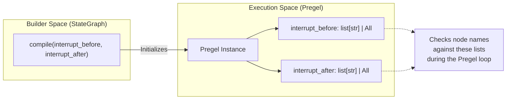

**Execution Flow with Static Interrupts**

```mermaid
sequenceDiagram
    participant User
    participant Loop as Pregel Loop (_loop.py)
    participant Checkpointer
    participant Node
    
    User->>Loop: invoke(input, config)
    Loop->>Checkpointer: Load checkpoint
    
    Note over Loop: Check interrupt_before
    alt Node in interrupt_before
        Loop->>Checkpointer: Save checkpoint
        Loop-->>User: Return (Interrupted)
    else Proceed
        Loop->>Node: Execute node
        Node-->>Loop: Return update
    end
    
    Note over Loop: Check interrupt_after
    alt Node in interrupt_after
        Loop->>Checkpointer: Save checkpoint
        Loop-->>User: Return (Interrupted)
    end
```

Sources: [libs/langgraph/langgraph/graph/state.py:834-855](), [libs/langgraph/langgraph/types.py:93-94](), [libs/langgraph/langgraph/pregel/main.py:175-180](), [libs/langgraph/tests/test_interruption.py:11-32]()

### State Inspection at Interrupts

When a graph is interrupted, its state can be inspected using `get_state()` [libs/langgraph/langgraph/pregel/main.py:480-500]().

| StateSnapshot Field | Description | Code Entity |
|---------------------|-------------|-------------|
| `values` | Current channel values | `StateSnapshot.values` |
| `next` | Tuple of next node(s) to execute | `StateSnapshot.next` |
| `tasks` | Tasks pending execution | `StateSnapshot.tasks` |
| `interrupts` | Tuple of active dynamic interrupts | `StateSnapshot.interrupts` |

Static interrupts result in an empty `interrupts` tuple because the graph pauses at a boundary without an explicit `Interrupt` object being raised by a node [libs/langgraph/tests/test_interruption.py:38-40]().

Sources: [libs/langgraph/langgraph/types.py:218-243](), [libs/langgraph/langgraph/pregel/main.py:480-500](), [libs/langgraph/tests/test_interruption.py:38-40]()

---

## Dynamic Interrupts

### The interrupt() Function

The `interrupt()` function allows nodes to pause execution from within their logic and request specific input from users [libs/langgraph/langgraph/types.py:420-543]().

```python
from langgraph.types import interrupt

def human_node(state: State):
    # This call raises GraphInterrupt on first execution
    user_provided = interrupt("Please approve the budget")
    # This code only runs after the graph is resumed
    return {"approval": user_provided}
```

**Internal Logic of interrupt()**

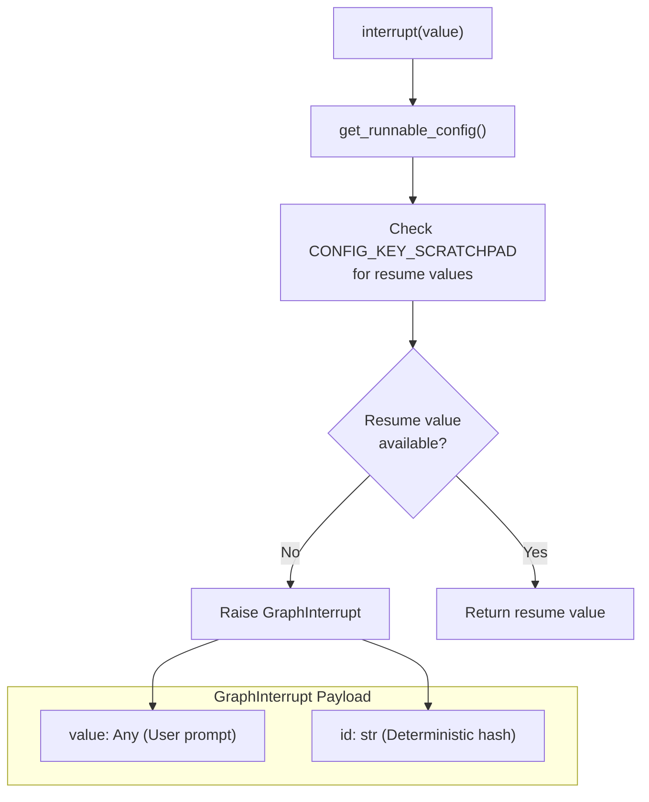

**Key Characteristics**:
1. **First call raises exception**: On the first invocation within a task, `interrupt()` raises a `GraphInterrupt` exception [libs/langgraph/langgraph/types.py:483-485]().
2. **Deterministic IDs**: Interrupt IDs are generated based on the checkpoint namespace and a counter to ensure consistency across retries [libs/langgraph/langgraph/types.py:465-475]().
3. **Re-execution on resume**: When resumed, the node re-executes from the beginning. The `interrupt()` call then finds the resume value in the scratchpad and returns it instead of raising an exception [libs/langgraph/langgraph/types.py:455-463]().

Sources: [libs/langgraph/langgraph/types.py:420-543](), [libs/langgraph/tests/test_pregel_async.py:568-716]()

---

## The Interrupt Data Structure

### Interrupt Class

The `Interrupt` class represents a suspended execution point [libs/langgraph/langgraph/types.py:159-214]().

| Field | Type | Description |
|-------|------|-------------|
| `value` | `Any` | The information passed to `interrupt()`, typically a prompt or data for the user. |
| `id` | `str` | A unique identifier for this specific interrupt instance. |

Sources: [libs/langgraph/langgraph/types.py:159-170]()

### Storage in Checkpoints

Interrupts are stored as pending writes in the checkpoint under the special `INTERRUPT` channel [libs/langgraph/langgraph/graph/state.py:36-40]().

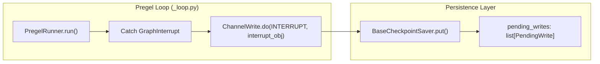

Sources: [libs/langgraph/langgraph/graph/state.py:36-40](), [libs/langgraph/langgraph/pregel/_runner.py](), [libs/langgraph/langgraph/pregel/_loop.py]()

---

## Resuming Execution

### Resume Mechanisms

Interrupted graphs are resumed by providing a `Command` object with a `resume` value [libs/langgraph/langgraph/types.py:289-323]().

| Resume Method | Code Example |
|---------------|--------------|
| **Standard Resume** | `graph.invoke(Command(resume="approved"), config)` |
| **Dictionary Resume** | `graph.invoke(Command(resume={"id_1": "val1"}), config)` |
| **Static Resume** | `graph.invoke(None, config)` (for static interrupts) |

**Resume Data Flow**

```mermaid
sequenceDiagram
    participant User
    participant Loop as Pregel Loop
    participant Node
    
    User->>Loop: invoke(Command(resume="yes"), config)
    Loop->>Loop: Load Checkpoint
    Loop->>Loop: Update CONFIG_KEY_SCRATCHPAD with resume value
    Loop->>Node: Execute Node (Retry)
    Note over Node: Node calls interrupt()
    Node->>Loop: interrupt() looks up scratchpad
    Loop-->>Node: Returns "yes"
    Node-->>Loop: Completes execution
```

Sources: [libs/langgraph/langgraph/types.py:315-323](), [libs/langgraph/tests/test_pregel_async.py:616-636](), [libs/langgraph/langgraph/pregel/_runner.py]()

### Clearing Interrupts

To clear interrupts without completing the logic that triggered them, a state update can be applied to the thread using `update_state` with `as_node` or by providing a specific `checkpoint_id` [libs/langgraph/langgraph/graph/state.py:1050-1070]().

Sources: [libs/langgraph/tests/test_pregel_async.py:697-715](), [libs/langgraph/langgraph/graph/state.py:1050-1070]()

---

## Subgraph Interrupts

When a node is a subgraph (e.g., another compiled LangGraph), interrupts within the subgraph bubble up to the parent. The parent's `StateSnapshot` will contain the interrupt, and the `tasks` entry for the subgraph node will include a `state` field (a `StateSnapshot` or `RunnableConfig`) that points to the subgraph's specific checkpoint namespace [libs/langgraph/langgraph/types.py:188-189]().

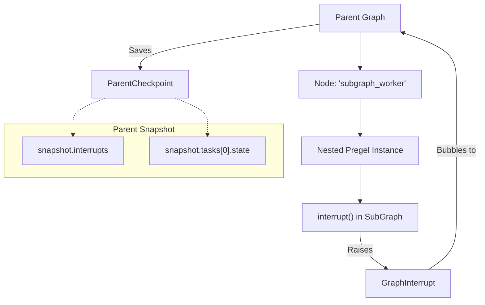

Sources: [libs/langgraph/langgraph/types.py:188-189](), [libs/langgraph/tests/test_pregel_async.py:718-890]()
The LangGraph API organizes stateful agentic workflows around two primary resources: **Assistants** and **Threads**. Assistants represent reusable, versioned configurations of a graph (including its logic and parameters), while Threads represent specific stateful sessions or conversations that persist over time.

## Assistants

An **Assistant** is a resource that binds a specific graph (identified by `graph_id`) with a set of configurations, metadata, and optional specialized instructions. In the LangGraph ecosystem, the "Assistant" is the entity that a user interacts with.

### Assistant Resource Structure
The `Assistant` object contains the following key fields:
- `assistant_id`: The unique identifier for the assistant [libs/sdk-py/langgraph_sdk/schema.py:224-225]().
- `graph_id`: The identifier of the underlying compiled graph [libs/sdk-py/langgraph_sdk/schema.py:224-225]().
- `config`: A `Config` object containing `configurable` values used during graph execution [libs/sdk-py/langgraph_sdk/schema.py:185-206]().
- `metadata`: Key-value pairs for categorization or filtering [libs/sdk-py/langgraph_sdk/schema.py:240-241]().

### Managing Assistants
The `AssistantsClient` (and its synchronous counterpart `SyncAssistantsClient`) provides methods to manage these resources:
- **Get/Search**: Retrieve assistant details or search based on metadata and graph IDs [libs/sdk-py/langgraph_sdk/_async/assistants.py:45-88]().
- **Graph Inspection**: Retrieve the visual representation of the graph using `get_graph`, with support for `xray` mode to inspect subgraphs [libs/sdk-py/langgraph_sdk/_async/assistants.py:90-146]().
- **Schema Access**: Retrieve the input, output, and state schemas defined for the graph [libs/sdk-py/langgraph_sdk/_async/assistants.py:148-173]().

### Assistant Logic Flow
The following diagram illustrates how an Assistant acts as a configured instance of a Graph.

**Assistant to Code Entity Mapping**
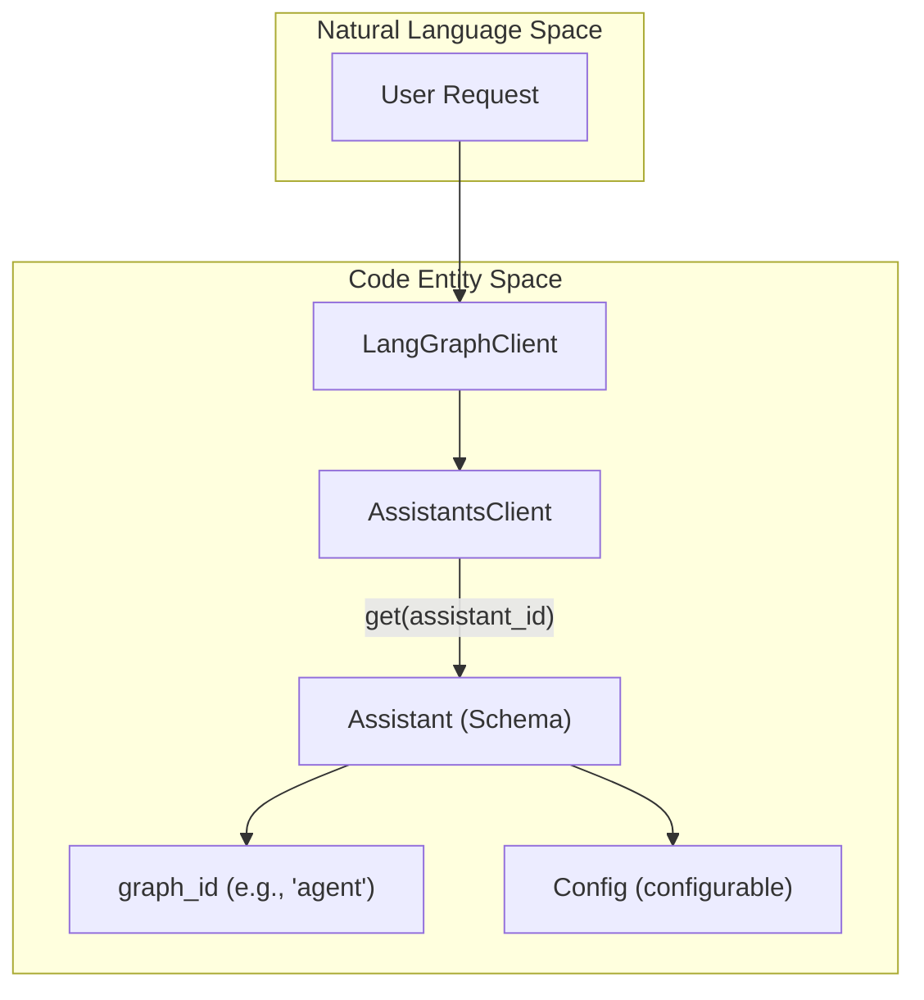
Sources: [libs/sdk-py/langgraph_sdk/_async/assistants.py:28-43](), [libs/sdk-py/langgraph_sdk/schema.py:221-245]()

---

## Threads

A **Thread** represents a stateful session. It is the primary mechanism for persistence, allowing a graph to maintain its state (via checkpoints) across multiple separate requests.

### Thread State and Status
Threads transition through various statuses during their lifecycle:
- `idle`: No active processing [libs/sdk-py/langgraph_sdk/schema.py:37]().
- `busy`: Currently executing a run [libs/sdk-py/langgraph_sdk/schema.py:38]().
- `interrupted`: Execution paused (e.g., for human-in-the-loop) [libs/sdk-py/langgraph_sdk/schema.py:39]().
- `error`: An exception occurred during the last run [libs/sdk-py/langgraph_sdk/schema.py:40]().

### Thread Management Operations
The `ThreadsClient` handles the lifecycle of these sessions:
- **Creation**: Threads can be created with specific `thread_id` or metadata. They can also be initialized with `supersteps` to restore state from external sources [libs/sdk-py/langgraph_sdk/_async/threads.py:98-173]().
- **TTL (Time-to-Live)**: Threads can be configured with a TTL to automatically delete or prune old state [libs/sdk-py/langgraph_sdk/_async/threads.py:165-170]().
- **State Updates**: Users can manually update the state of a thread using `update_state`, which creates a new checkpoint [libs/sdk-py/langgraph_sdk/_async/threads.py:238-285]().

### Checkpoint History
Every transition in a thread's state is captured as a checkpoint.
- `get_history`: Returns a list of `ThreadState` objects representing the timeline of the thread [libs/sdk-py/langgraph_sdk/_async/threads.py:314-350]().
- `get_state`: Retrieves the current state or state at a specific `checkpoint_id` [libs/sdk-py/langgraph_sdk/_async/threads.py:195-236]().

**Thread Persistence and Checkpointing**
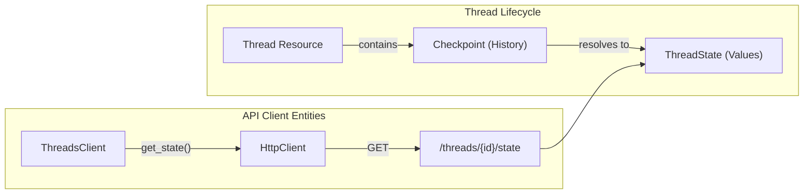
Sources: [libs/sdk-py/langgraph_sdk/_async/threads.py:27-41](), [libs/sdk-py/langgraph_sdk/schema.py:208-220]()

---

## Data Models and Schemas

The interaction between Assistants and Threads is governed by several key TypedDicts defined in `langgraph_sdk.schema`.

| Class | Description | Key Fields |
| :--- | :--- | :--- |
| `Assistant` | Configured graph instance | `assistant_id`, `graph_id`, `config`, `metadata` |
| `Thread` | Stateful session | `thread_id`, `status`, `metadata`, `values` |
| `ThreadState` | Snapshot of thread state | `values`, `next`, `checkpoint_id`, `metadata` |
| `Checkpoint` | Internal persistence marker | `thread_id`, `checkpoint_ns`, `checkpoint_id` |

Sources: [libs/sdk-py/langgraph_sdk/schema.py:208-250](), [libs/sdk-py/langgraph_sdk/schema.py:265-280]()

## Interaction Flow: Runs on Threads

While Assistants and Threads define the "who" and the "where", a **Run** defines the "action". To execute logic, a client creates a run by providing an `assistant_id` and a `thread_id`.

1.  **Selection**: The system fetches the graph and configuration from the **Assistant**.
2.  **Context**: The system loads the latest checkpoint from the **Thread**.
3.  **Execution**: The graph processes the input and updates the thread state.
4.  **Persistence**: A new checkpoint is saved back to the thread upon completion or interruption.

Sources: [libs/sdk-py/langgraph_sdk/_async/runs.py:55-67](), [libs/sdk-py/langgraph_sdk/_async/threads.py:30-33]()
cron = await client.crons.create(
    assistant_id="asst_123",
    schedule="0 12 * * *",
    input={"query": "Daily summary"},
    end_time=datetime(2025, 1, 1, tzinfo=timezone.utc),
    timezone="America/Los_Angeles"
)
```
**Sources**: [libs/sdk-py/tests/test_crons_client.py:100-128](), [libs/sdk-py/tests/test_crons_client.py:131-161]()

#### Create Cron for Thread
Creates a cron job specifically for a thread (stateful).
```python
# Sync
cron = client.crons.create_for_thread(
    thread_id="thread_123",
    assistant_id="asst_123",
    schedule="0 0 * * *",
    multitask_strategy="enqueue"
)
```
**Sources**: [libs/sdk-py/tests/test_crons_client.py:163-190](), [libs/sdk-py/tests/test_crons_client.py:34-62]()

#### Search and List
Filter and sort existing cron jobs.
- **`order_by`**: Field to sort by (e.g., `"next_run_date"`, `"created_at"`).
- **`order`**: `"asc"` or `"desc"`.

**Sources**: [libs/sdk-py/langgraph_sdk/schema.py:166-182](), [libs/sdk-py/langgraph_sdk/schema.py:489-504]()

---

## Payload and Execution Control

The `payload` of a cron job contains the execution parameters used for every triggered run.

- **`input`**: The initial state or message for the graph.
- **`config`**: `recursion_limit`, `tags`, and `configurable` parameters. [libs/sdk-py/langgraph_sdk/schema.py:185-206]()
- **`context`**: Static context to add to the assistant (Added in version 0.6.0). [libs/sdk-py/langgraph_sdk/_async/cron.py:93-94]()
- **`durability`**: Level for the run (`'sync'`, `'async'`, or `'exit'`), replacing the deprecated `checkpoint_during`. [libs/sdk-py/langgraph_sdk/_async/cron.py:109-113]()
- **`multitask_strategy`**: Defines how to handle multiple tasks (`'reject'`, `'interrupt'`, `'rollback'`, or `'enqueue'`). [libs/sdk-py/langgraph_sdk/schema.py:81-88]()

The `end_time` parameter ensures that the cron job automatically stops triggering after a certain date.

**Sources**: [libs/sdk-py/langgraph_sdk/schema.py:185-206](), [libs/sdk-py/tests/test_crons_client.py:66-96](), [libs/sdk-py/langgraph_sdk/_async/cron.py:138-143]()
This page documents all GitHub Actions workflows in the LangGraph monorepo: the main CI pipeline, reusable job workflows, benchmarking pipelines, the weekly dependency lock upgrade, and the release workflow. For the release process itself (PyPI publishing, tagging, and release notes), see [9.4](). For test infrastructure details (fixtures, Docker services, conftest setup), see [9.2](). For the monorepo build system and `make` targets that these workflows invoke, see [9.1]().

---

## Workflow Inventory

All workflow files live under `.github/workflows/`. Filenames prefixed with `_` are reusable workflows, invoked via `workflow_call` from other workflows.

| File | Name | Trigger | Purpose |
|---|---|---|---|
| `ci.yml` | CI | `push` to `main`, `pull_request` | Orchestrates lint, test, schema and integration checks |
| `_lint.yml` | lint | `workflow_call` | Runs ruff and mypy per package |
| `_test.yml` | test | `workflow_call` | Runs `make test` per package across Python versions |
| `_test_langgraph.yml` | test | `workflow_call` | Runs `make test_parallel` for `libs/langgraph` specifically |
| `_integration_test.yml` | CLI integration test | `workflow_call` | Builds and smoke-tests Docker images via `langgraph build` |
| `bench.yml` | bench | `pull_request` on `libs/**` | Runs benchmarks and compares to baseline |
| `baseline.yml` | baseline | `push` to `main`, `workflow_dispatch` | Saves benchmark baseline to cache |
| `uv_lock_ugprade.yml` | UV Lock Upgrade | Weekly cron, `workflow_dispatch` | Runs `make lock-upgrade` and opens a PR |
| `release.yml` | release | `workflow_dispatch` | Full release pipeline (build → test PyPI → pre-check → publish → tag) |
| `_test_release.yml` | test-release | `workflow_call` | Builds and publishes to test PyPI |

Sources: [.github/workflows/ci.yml:1-10](), [.github/workflows/_lint.yml:1-10](), [.github/workflows/_test.yml:1-10](), [.github/workflows/_test_langgraph.yml:1-10](), [.github/workflows/_integration_test.yml:1-10](), [.github/workflows/bench.yml:1-10](), [.github/workflows/baseline.yml:1-10](), [.github/workflows/uv_lock_ugprade.yml:1-10](), [.github/workflows/release.yml:1-10]()

---

## Main CI Pipeline (`ci.yml`)

The CI workflow is the primary gate on all pull requests and pushes to `main`.

### Concurrency

A concurrency group keyed on `${{ github.workflow }}-${{ github.ref }}` ensures that if a new push arrives while CI is still running for the same branch, the older run is cancelled [.github/workflows/ci.yml:21-23]().

### Path Filtering (`changes` job)

The first job uses the `dorny/paths-filter` action to determine which areas of the repository changed [.github/workflows/ci.yml:26-50](). Two output flags control downstream jobs:

| Flag | Paths Watched |
|---|---|
| `python` | `libs/langgraph/**`, `libs/sdk-py/**`, `libs/cli/**`, `libs/checkpoint/**`, `libs/checkpoint-sqlite/**`, `libs/checkpoint-postgres/**`, `libs/checkpoint-conformance/**`, `libs/prebuilt/**` |
| `deps` | `**/pyproject.toml`, `**/uv.lock` |

Downstream jobs only run if `python == 'true'` or `deps == 'true'`, which prevents unnecessary work on documentation-only changes [.github/workflows/ci.yml:67]().

### Job Graph

**CI pipeline job dependency diagram:**

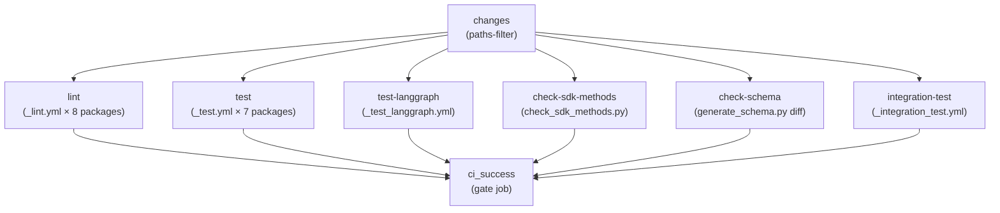

Sources: [.github/workflows/ci.yml:25-169]()

### `ci_success` Gate Job

The final `ci_success` job [.github/workflows/ci.yml:159-184]() always runs (via `if: always()`) and exits non-zero if any upstream job resulted in `failure` or `cancelled` [.github/workflows/ci.yml:176](). This provides a single required status check that branch protection rules can target, regardless of which jobs were skipped due to path filtering.

---

## Reusable Workflows

### `_lint.yml` — Per-Package Linting

Triggered via `workflow_call` with a `working-directory` input. Runs on Python 3.12 only (chosen to represent both min and max supported, balancing coverage with CI speed) [.github/workflows/_lint.yml:19-32]().

Steps:

1. **Changed-file detection** — uses `Ana06/get-changed-files` filtered to `${{ inputs.working-directory }}/**` [.github/workflows/_lint.yml:35-40](). Remaining steps are skipped if no files changed.
2. **Install lint deps** — `uv sync --frozen --group lint` [.github/workflows/_lint.yml:52]()
3. **mypy cache restore** — caches `.mypy_cache` keyed on `uv.lock` hash to speed up type checking [.github/workflows/_lint.yml:54-62]()
4. **`lint_package`** — runs `make lint_package` (falls back to `make lint` if target absent) [.github/workflows/_lint.yml:64-73]()
5. **Install test lint deps** — `uv sync --group lint` (adds test deps for type-checking test files) [.github/workflows/_lint.yml:78]()
6. **mypy test cache restore** — separate `.mypy_cache_test` cache [.github/workflows/_lint.yml:80-88]()
7. **`lint_tests`** — runs `make lint_tests` (skipped if target absent) [.github/workflows/_lint.yml:90-98]()

The `RUFF_OUTPUT_FORMAT: github` environment variable causes ruff to emit inline PR annotations [.github/workflows/_lint.yml:16]().

Sources: [.github/workflows/_lint.yml:1-99]()

### `_test.yml` — Per-Package Tests

Triggered via `workflow_call` with a `working-directory` input. Runs a matrix across **Python 3.10, 3.11, 3.12, 3.13, 3.14** [.github/workflows/_test.yml:17-24]().

Steps:

1. **Docker Hub login** — authenticates to avoid pull rate limits (skipped on fork PRs) [.github/workflows/_test.yml:35-40]()
2. **Install deps** — `uv sync --frozen --group test --no-dev` [.github/workflows/_test.yml:45]()
3. **Run tests** — `make test` [.github/workflows/_test.yml:50]()
4. **Clean working tree check** — fails if tests created untracked files [.github/workflows/_test.yml:52-63]()

Sources: [.github/workflows/_test.yml:1-64]()

### `_test_langgraph.yml` — LangGraph-Specific Tests

Nearly identical to `_test.yml` but hardcoded to `libs/langgraph` and invokes `make test_parallel` instead of `make test` [.github/workflows/_test_langgraph.yml:46](), allowing parallelized pytest execution. It also includes a specific run for strict msgpack pregel tests on Python 3.13 [.github/workflows/_test_langgraph.yml:48-53]().

Sources: [.github/workflows/_test_langgraph.yml:1-66]()

---

## Schema and SDK Consistency Checks

### `check-sdk-methods`

Runs the script `.github/scripts/check_sdk_methods.py` [.github/workflows/ci.yml:102-114](). This verifies that methods defined in the SDK match those expected by the server API. It only runs if Python source files changed.

### `check-schema`

Generates the `langgraph.json` configuration schema via `uv run python generate_schema.py` inside `libs/cli`, then diffs the result against the committed `schemas/schema.json` [.github/workflows/ci.yml:116-150](). If the generated schema differs from the committed one, CI fails with instructions to regenerate and commit the file. Runs on Python 3.13 [.github/workflows/ci.yml:124]().

Sources: [.github/workflows/ci.yml:102-150]()

---

## CLI Integration Tests (`_integration_test.yml`)

This reusable workflow builds real Docker images using `langgraph build` and, when a `LANGSMITH_API_KEY` is available, runs the built containers against the LangGraph server API.

### Matrix

The matrix is two-dimensional: Python versions (3.10, 3.14) × example directories [.github/workflows/_integration_test.yml:13-33]():

| Example | Working Dir | Tag |
|---|---|---|
| A | `libs/cli/examples` | `langgraph-test-a` |
| B | `libs/cli/examples/graphs` | `langgraph-test-b` |
| C | `libs/cli/examples/graphs_reqs_a` | `langgraph-test-c` |
| D | `libs/cli/examples/graphs_reqs_b` | `langgraph-test-d` |

### Additional Builds (Example A only)

When the matrix entry is Example A, the workflow also builds:

- A JavaScript service from `libs/cli/js-examples` (tag `langgraph-test-e`) [.github/workflows/_integration_test.yml:76-80]()
- A JS monorepo service from `libs/cli/js-monorepo-example` with custom `--build-command` and `--install-command` (tag `langgraph-test-f`) [.github/workflows/_integration_test.yml:82-86]()
- A Python monorepo service from `libs/cli/python-monorepo-example` (tag `langgraph-test-g`) [.github/workflows/_integration_test.yml:88-92]()
- A pre-release requirements service from `libs/cli/examples/graph_prerelease_reqs` (tag `langgraph-test-h`) [.github/workflows/_integration_test.yml:103-107]()
- A pre-release failure scenario `libs/cli/examples/graph_prerelease_reqs_fail` expected to fail (tag `langgraph-test-i`) [.github/workflows/_integration_test.yml:134-138]()

The test runner script is `.github/scripts/run_langgraph_cli_test.py`, wrapped in a 60-second timeout [.github/workflows/_integration_test.yml:74]().

Sources: [.github/workflows/_integration_test.yml:1-139]()

---

## Benchmarking Workflows

### `baseline.yml` — Save Baseline

**Trigger:** Push to `main` or `workflow_dispatch`, when `libs/**` changes [.github/workflows/baseline.yml:1-8]().

Runs `make benchmark` in `libs/langgraph` and saves the output as `out/benchmark-baseline.json` to the Actions cache under a key of the form `${{ runner.os }}-benchmark-baseline-${{ env.SHA }}` [.github/workflows/baseline.yml:31-37](). This gives each `main` commit its own cached baseline.

### `bench.yml` — PR Comparison

**Trigger:** Pull requests touching `libs/**` [.github/workflows/bench.yml:4-6]().

**Benchmark comparison diagram:**

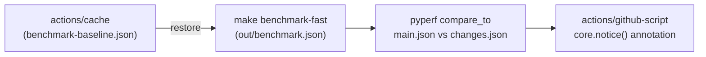

Steps [.github/workflows/bench.yml:17-71]():

1. Restore baseline from cache [.github/workflows/bench.yml:32-40]().
2. Run `make benchmark-fast` → writes `out/benchmark.json` [.github/workflows/bench.yml:41-48]().
3. Rename files and run `uv run pyperf compare_to out/main.json out/changes.json --table --group-by-speed` [.github/workflows/bench.yml:49-58]().
4. Post both raw results and the comparison table as PR annotations via `core.notice()` [.github/workflows/bench.yml:59-71]().

Sources: [.github/workflows/bench.yml:1-71](), [.github/workflows/baseline.yml:1-37]()

---

## Weekly Dependency Lock Upgrade (`uv_lock_ugprade.yml`)

**Trigger:** Cron at `0 0 * * 0` (midnight every Sunday UTC) or `workflow_dispatch` [.github/workflows/uv_lock_ugprade.yml:4-8]().

Runs `make lock-upgrade` at the repo root [.github/workflows/uv_lock_ugprade.yml:28](), which calls `uv lock --upgrade` across all Python packages. Then uses `peter-evans/create-pull-request` to open a PR on branch `deps/uv-lock-upgrade` with the label `dependencies` [.github/workflows/uv_lock_ugprade.yml:30-46]().

Sources: [.github/workflows/uv_lock_ugprade.yml:1-46]()

---

## Release Pipeline

The release workflow is documented in detail on page [9.4](). The section below covers only the structural relationship between workflow files and job sequencing.

### Job Sequence

**Release workflow job dependency diagram:**

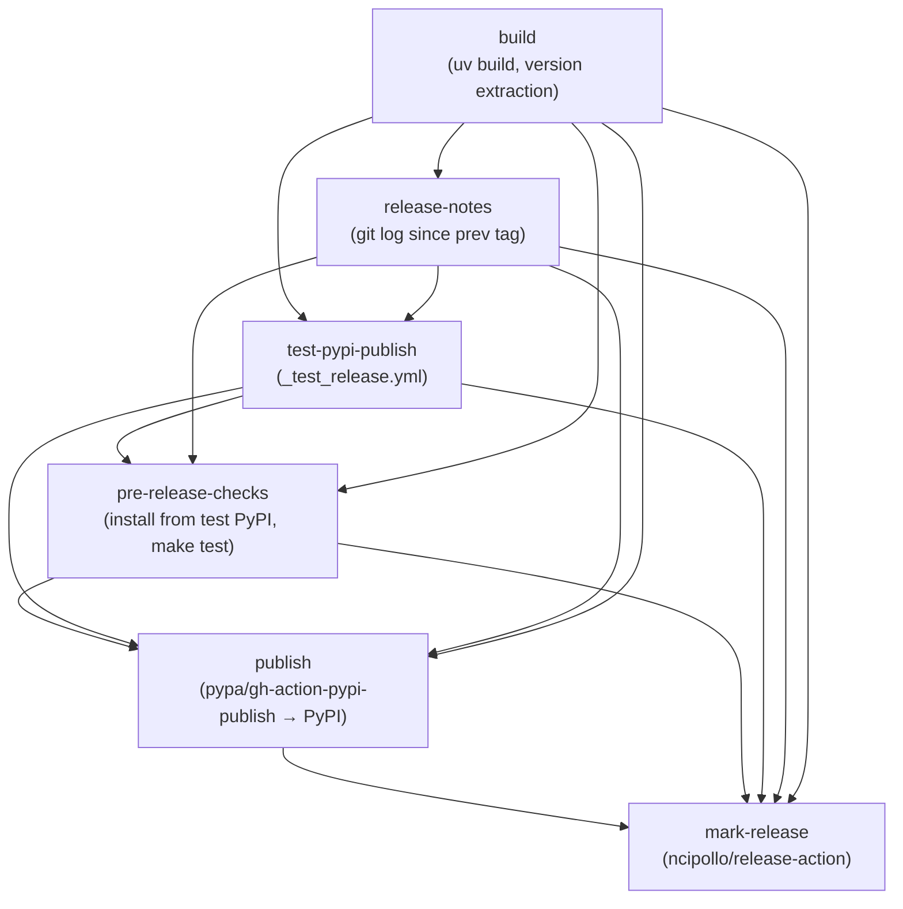

### Permission Isolation

The `build` job runs with only `contents: read` [.github/workflows/release.yml:11-12](). The `test-pypi-publish` job requires `id-token: write` (for PyPI trusted publishing) [.github/workflows/release.yml:145-147](). These permissions are intentionally kept in separate jobs so that a compromised build step cannot access publishing credentials [.github/workflows/release.yml:37-47]().

### `_test_release.yml` Reusable Workflow

Called by the `test-pypi-publish` job in `release.yml` [.github/workflows/release.yml:148-151](). It builds the package with `uv build`, uploads to test PyPI using `pypa/gh-action-pypi-publish` with `repository-url: https://test.pypi.org/legacy/` [.github/workflows/_test_release.yml:84-90]().

Sources: [.github/workflows/release.yml:1-157](), [.github/workflows/_test_release.yml:1-98]()

---

## Reusable Workflow Pattern

All reusable workflows use `on: workflow_call` and accept a `working-directory` input. The main `ci.yml` invokes them with a strategy matrix to fan out across all packages.

**Reusable workflow call structure:**

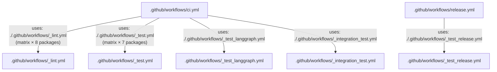

Secrets are forwarded with `secrets: inherit` in every caller [.github/workflows/ci.yml:71](), so repository secrets (e.g. `DOCKERHUB_USERNAME`, `LANGSMITH_API_KEY`) are available to reusable workflows.

Sources: [.github/workflows/ci.yml:68-157](), [.github/workflows/release.yml:148-151]()

---

## Python Version Coverage Summary

| Workflow | Python Versions |
|---|---|
| `_lint.yml` | 3.12 only |
| `_test.yml` | 3.10, 3.11, 3.12, 3.13, 3.14 |
| `_test_langgraph.yml` | 3.10, 3.11, 3.12, 3.13, 3.14 |
| `_integration_test.yml` | 3.10, 3.14 |
| `bench.yml` | 3.11 |
| `baseline.yml` | 3.11 |
| `release.yml` | 3.11 |
| `_test_release.yml` | 3.10 |
| `uv_lock_ugprade.yml` | 3.10 |

Sources: [.github/workflows/_lint.yml:31](), [.github/workflows/_test.yml:20-24](), [.github/workflows/_test_langgraph.yml:15-19](), [.github/workflows/_integration_test.yml:18-19](), [.github/workflows/bench.yml:24](), [.github/workflows/baseline.yml:22](), [.github/workflows/release.yml:15](), [.github/workflows/_test_release.yml:12](), [.github/workflows/uv_lock_ugprade.yml:24]()
This page covers the `langgraph-cli` package: its purpose, the commands it exposes, how it reads a `langgraph.json` configuration file, and how it translates that configuration into Docker-based deployments or a local in-memory development server.

- For detailed documentation of each CLI command and its flags, see [CLI Commands](#6.1).
- For the full `langgraph.json` schema reference, see [Configuration System (langgraph.json)](#6.2).
- For Dockerfile generation internals, see [Docker Image Generation](#6.3).
- For Docker Compose orchestration, see [Multi-Service Orchestration](#6.4).
- For the `langgraph dev` in-memory server, see [Local Development Server](#6.5).
- For the Kafka-based distributed executor, see [Distributed Execution with Kafka](#6.6).
- For programmatic access to a deployed server, see [Client SDKs and Remote Execution](#5).

---

## Package Overview

The `langgraph-cli` package lives at `libs/cli/` and is installed as the `langgraph` command-line tool. Its entry point is declared in `libs/cli/pyproject.toml` [libs/cli/pyproject.toml:36-37]().

It depends on `click>=8.1.7`, `httpx>=0.24.0`, and `langgraph-sdk>=0.1.0` (for Python ≥ 3.11) [libs/cli/pyproject.toml:14-21](). For the in-memory development server, it requires the `[inmem]` extras group which pulls in `langgraph-api` and `langgraph-runtime-inmem` [libs/cli/pyproject.toml:24-28]().

| Extra group | Additional dependencies |
|---|---|
| *(none)* | `click`, `httpx`, `langgraph-sdk`, `pathspec`, `python-dotenv` |
| `[inmem]` | `langgraph-api>=0.5.35`, `langgraph-runtime-inmem>=0.7` |

Sources: [libs/cli/pyproject.toml:5-37]()

---

## Architectural Position

The CLI bridges local development and production deployment. It reads a `langgraph.json` file, validates it, and either launches a Docker Compose stack (for `up`/`build`/`dockerfile`) or starts an in-process server (for `dev`). It also facilitates deployments to LangSmith via the `deploy` command [libs/cli/langgraph_cli/cli.py:17-18]().

**CLI System Relationships**

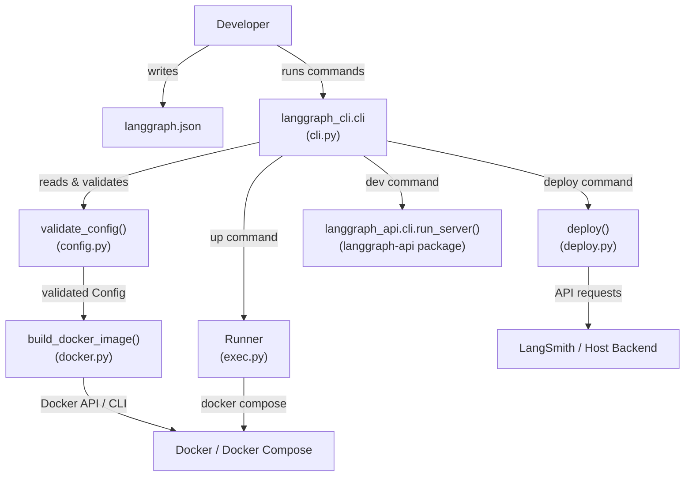

Sources: [libs/cli/langgraph_cli/cli.py:1-23](), [libs/cli/langgraph_cli/config.py:152-212](), [libs/cli/langgraph_cli/exec.py:19-20]()

---

## Commands at a Glance

The `cli` group is the root Click group defined in `langgraph_cli/cli.py` [libs/cli/langgraph_cli/cli.py:37](). It uses a `NestedHelpGroup` to display subcommands clearly [libs/cli/langgraph_cli/cli.py:178-203]().

| Command | Function | What it does |
|---|---|---|
| `langgraph new` | `create_new()` | Scaffold a new project from a template [libs/cli/langgraph_cli/cli.py:21]() |
| `langgraph dev` | `dev()` | Start an in-memory dev server with hot reload [libs/cli/README.md:25-35]() |
| `langgraph up` | `up()` | Build and launch full Docker Compose stack [libs/cli/README.md:37-47]() |
| `langgraph build` | `build_docker_image()` | Build a tagged Docker image [libs/cli/langgraph_cli/cli.py:18]() |
| `langgraph dockerfile` | `dockerfile()` | Generate a Dockerfile for custom deployments [libs/cli/README.md:58-63]() |
| `langgraph deploy` | `deploy()` | Deploy the project to LangSmith [libs/cli/langgraph_cli/cli.py:17]() |

Sources: [libs/cli/langgraph_cli/cli.py:17-23](), [libs/cli/README.md:17-63]()

---

## Configuration File (`langgraph.json`)

Every command requires a configuration file (default: `./langgraph.json`). The file is loaded and validated by `validate_config()` in `config.py` [libs/cli/langgraph_cli/config.py:152]().

### Key Top-Level Fields

| Field | Type | Required | Description |
|---|---|---|---|
| `graphs` | `dict` | **Yes** | Mapping from graph ID to implementation path [libs/cli/langgraph_cli/config.py:201]() |
| `dependencies` | `list[str]` | **Yes** | Array of dependencies for the server [libs/cli/langgraph_cli/config.py:199]() |
| `python_version` | `str` | No | Defaults to `3.11` [libs/cli/langgraph_cli/config.py:50]() |
| `node_version` | `str` | No | Required for JS/TS graphs; defaults to `20` [libs/cli/langgraph_cli/config.py:17]() |
| `image_distro` | `str` | No | Distro for the base image (e.g., `debian`, `wolfi`) [libs/cli/langgraph_cli/config.py:198]() |
| `env` | `str \| dict` | No | Path to `.env` file or inline key-value mapping [libs/cli/langgraph_cli/config.py:202]() |
| `dockerfile_lines` | `list[str]` | No | Additional lines to append to the generated Dockerfile [libs/cli/langgraph_cli/config.py:200]() |
| `pip_installer` | `str` | No | One of `auto`, `pip`, or `uv` [libs/cli/langgraph_cli/config.py:195]() |

Sources: [libs/cli/langgraph_cli/config.py:16-212](), [libs/cli/langgraph_cli/cli.py:41-101]()

---

## Config Validation Flow

The validation logic ensures that the specified Python or Node versions meet minimum requirements and that mandatory fields like `graphs` and `dependencies` are present [libs/cli/langgraph_cli/config.py:152-165](). It also detects whether the project contains Python or Node.js graphs based on file extensions [libs/cli/langgraph_cli/config.py:126-141]().

**Config Validation Pipeline**

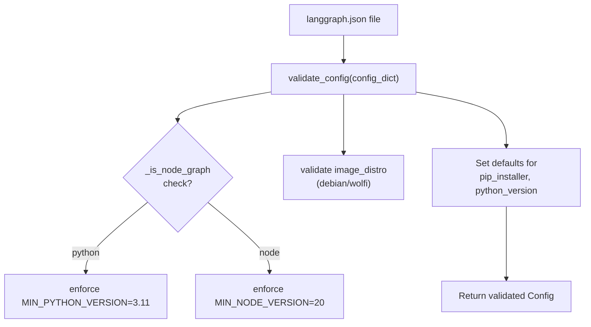

Sources: [libs/cli/langgraph_cli/config.py:49-52](), [libs/cli/langgraph_cli/config.py:152-212]()

---

## Docker Image Generation

The CLI generates Dockerfiles that include a cleanup phase to remove build tools like `pip`, `setuptools`, and `wheel` unless explicitly kept [libs/cli/langgraph_cli/config.py:58-70](). It also supports `uv` as a high-performance installer [libs/cli/langgraph_cli/config.py:92-95]().

**Dockerfile Generation Data Flow**

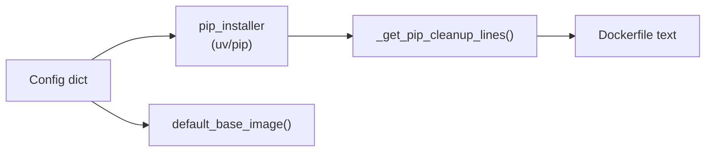

Sources: [libs/cli/langgraph_cli/config.py:58-101](), [libs/cli/tests/unit_tests/test_config.py:15-28]()

---

## Multi-Service Orchestration

The `langgraph up` command supports an `engine-runtime-mode` option, which can be `combined_queue_worker` (default) or `distributed` [libs/cli/langgraph_cli/cli.py:165-170](). In `distributed` mode, the system uses separate executor and orchestrator containers, often coordinated via Kafka [libs/cli/langgraph_cli/cli.py:169-170]().

Users can also provide a custom `docker-compose.yml` via the `--docker-compose` flag to launch additional services alongside the LangGraph API [libs/cli/langgraph_cli/cli.py:29-40]().

Sources: [libs/cli/langgraph_cli/cli.py:29-40](), [libs/cli/langgraph_cli/cli.py:165-170]()

# CLI Commands


This page documents all commands provided by the `langgraph-cli` package, covering their options, arguments, and typical usage. The CLI is the primary interface for running, building, and scaffolding LangGraph deployments.

For the `langgraph.json` configuration format consumed by these commands, see page [6.2](). For how the Dockerfile is generated from configuration, see page [6.3](). For the Docker Compose multi-service orchestration behavior, see page [6.4](). For the in-memory development server internals, see page [6.5]().

---

## Overview

The `langgraph` CLI is installed as a script entry point from the `langgraph-cli` package [libs/cli/pyproject.toml:36-37](). It is implemented as a Click group defined in `langgraph_cli.cli:cli` [libs/cli/langgraph_cli/cli.py:214-215]().

The CLI supports the following primary commands:

| Command | Purpose |
|---|---|
| `langgraph new` | Scaffold a new project from a template |
| `langgraph dev` | Run API server locally with hot reloading (no Docker) |
| `langgraph up` | Launch full Docker Compose stack |
| `langgraph build` | Build a Docker image for deployment |
| `langgraph dockerfile` | Write a Dockerfile (and optionally docker-compose.yml) to disk |
| `langgraph deploy` | Deploy a project to LangGraph Cloud/Host Backend |

**Installation:**

```bash
pip install langgraph-cli          # up/build/dockerfile/new only
pip install "langgraph-cli[inmem]" # also enables: langgraph dev
```

The `inmem` extras group adds `langgraph-api` and `langgraph-runtime-inmem` as dependencies [libs/cli/pyproject.toml:24-28]().

---

## Command Flow Diagram

**CLI Command Dispatch and Data Flow**

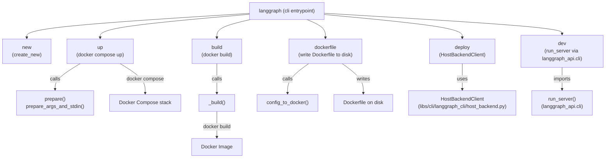

Sources: [libs/cli/langgraph_cli/cli.py:214-220](), [libs/cli/langgraph_cli/host_backend.py:19-43]()

---

## `langgraph new`

Creates a new project directory from a template.

```bash
langgraph new [PATH] [--template TEMPLATE]
```

**Arguments and Options:**

| Parameter | Type | Description |
|---|---|---|
| `PATH` | argument (optional) | Target directory for the new project |
| `--template` | string option | Template name (see `TEMPLATE_HELP_STRING`) |

Implemented by the `new` function, which delegates to `create_new` from `langgraph_cli.templates` [libs/cli/langgraph_cli/cli.py:21]().

Sources: [libs/cli/langgraph_cli/cli.py:21]()

---

## `langgraph dev`

Runs the LangGraph API server in-process (no Docker) with hot reloading. Requires the `inmem` extras.

**Behavior:**

1. Validates the config file via `validate_config_file`.
2. Raises an error if the config specifies a `node_version` as JS graphs are not supported in the in-memory server.
3. Adds the current working directory and local dependency paths to `sys.path` to ensure graph code is importable.
4. Calls `run_server` imported from `langgraph_api.cli`.

Sources: [libs/cli/pyproject.toml:24-28]()

---

## `langgraph deploy`

Deploys the project to a remote LangGraph host backend.

```bash
langgraph deploy [DEPLOYMENT_NAME] [OPTIONS]
```

**Key Features:**
- **Deployment Resolution:** Resolves existing deployments by name or ID.
- **Environment Management:** Resolves secrets from `.env` or `langgraph.json`, filtering out reserved variables.
- **Push Token Auth:** Requests a temporary push token to authenticate with the registry [libs/cli/langgraph_cli/host_backend.py:107-111]().
- **Log Streaming:** Monitors build and deployment logs in real-time [libs/cli/langgraph_cli/host_backend.py:180-199]().

**Host Backend Interaction**

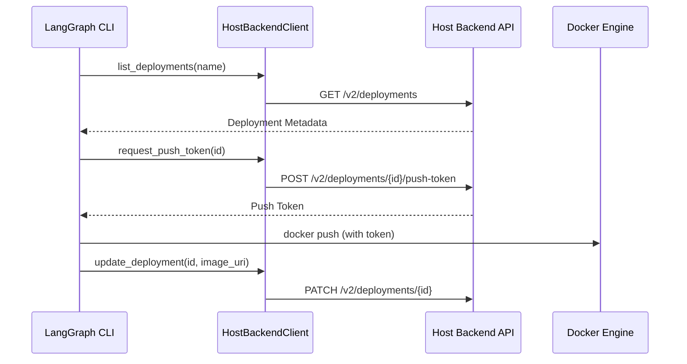

Sources: [libs/cli/langgraph_cli/host_backend.py:73-136](), [libs/cli/langgraph_cli/host_backend.py:19-43]()

---

## `langgraph up`

Launches the full production-like Docker Compose stack: the LangGraph API service, a PostgreSQL database (with `pgvector`), and Redis.

**Behavior:**

1. Calls `prepare()`, which validates the config and generates Docker Compose YAML via `prepare_args_and_stdin()`.
2. Generates an inline Dockerfile if no image is provided, including automatic installation of local dependencies.
3. Monitors the startup sequence and prints the ready URL once the API reports "Application startup complete".

Sources: [libs/cli/langgraph_cli/cli.py:29-170]()

---

## Config File Validation

All commands that accept `--config` call `validate_config()` from `langgraph_cli.config`. This function enforces strict schema rules:

- **Python Version:** Must be `>=3.11`. Defaults to `3.11` if Python graphs are detected [libs/cli/langgraph_cli/config.py:49-50]().
- **Node Version:** Must be major version only. Defaults to `20` if Node.js graphs are detected [libs/cli/langgraph_cli/config.py:16-17]().
- **Distro:** Supports `debian` (default) and `wolfi` [libs/cli/langgraph_cli/config.py:52]().
- **Security Warning:** If `image_distro` is not `wolfi`, the CLI issues a security recommendation to switch to Wolfi Linux for enhanced security [libs/cli/langgraph_cli/util.py:10-27]().

Sources: [libs/cli/langgraph_cli/config.py:152-211](), [libs/cli/langgraph_cli/util.py:10-27]()

---

## Internal Helper Functions

### `prepare_args_and_stdin()`
This function is the core of the `up` command. It constructs the Docker Compose arguments and the dynamic YAML configuration passed via stdin.

- **Service Mapping:** Configures `langgraph-api`, `langgraph-postgres`, and `langgraph-redis`.
- **Volume Management:** Sets up `langgraph-data` for persistent PostgreSQL storage.
- **Debugger Integration:** Optionally injects the `langgraph-debugger` service if a port is provided.

Sources: [libs/cli/tests/unit_tests/cli/test_cli.py:51-171]()

### `HostBackendClient`
A minimal JSON HTTP client used for remote deployment operations.

- **Authentication:** Uses `X-Api-Key` and optional `X-Tenant-ID` headers [libs/cli/langgraph_cli/host_backend.py:31-36]().
- **Retries:** Implements automatic retries via `httpx.HTTPTransport(retries=3)` [libs/cli/langgraph_cli/host_backend.py:30]().

Sources: [libs/cli/langgraph_cli/host_backend.py:19-43]()
The `langgraph.json` configuration file is the central control mechanism for LangGraph CLI commands. It declares dependencies, graph definitions, runtime settings, and deployment parameters used by `langgraph build`, `langgraph up`, `langgraph dev`, and `langgraph deploy` to construct Docker images and configure the LangGraph API server.

For information about CLI commands that consume this configuration, see [6.1](). For information about the Dockerfile generation process, see [6.3]().

---

## Configuration File Structure

The `langgraph.json` file uses a JSON structure with required and optional fields. The configuration is loaded and validated by `validate_config_file()` and `validate_config()` functions in `langgraph_cli/config.py`.

### Required Fields

| Field | Type | Description |
|-------|------|-------------|
| `dependencies` | `array[string]` | Package dependencies. Can be PyPI names (e.g., `"langchain_openai"`) or local paths starting with `"."` (e.g., `"./my_package"`). Required unless `source` is provided [libs/cli/langgraph_cli/config.py:199](). |
| `graphs` | `object` | Mapping from graph ID to graph location. Values are strings in format `"./path/to/file.py:attribute"` or objects with a `path` key [libs/cli/langgraph_cli/config.py:201](). |

### Optional Fields

| Field | Type | Default | Description |
|-------|------|---------|-------------|
| `python_version` | `string` | `"3.11"` | Python version: `"3.11"`, `"3.12"`, or `"3.13"`. Must be `major.minor` [libs/cli/langgraph_cli/config.py:49-50](). |
| `node_version` | `string` | `"20"` | Node.js major version (e.g., `"20"`). Detected if `.ts`/`.js` files are used [libs/cli/langgraph_cli/config.py:16-17](). |
| `pip_installer` | `string` | `"auto"` | Package installer: `"auto"`, `"pip"`, or `"uv"` [libs/cli/langgraph_cli/config.py:195](). |
| `pip_config_file` | `string` | `null` | Path to pip configuration file [libs/cli/langgraph_cli/config.py:194](). |
| `base_image` | `string` | `null` | Custom base Docker image [libs/cli/langgraph_cli/config.py:197](). |
| `image_distro` | `string` | `"debian"` | Base image distribution: `"debian"`, `"wolfi"`, or `"bookworm"` [libs/cli/langgraph_cli/config.py:52](). |
| `dockerfile_lines` | `array[string]` | `[]` | Additional Dockerfile instructions [libs/cli/langgraph_cli/config.py:200](). |
| `env` | `string \| object` | `{}` | Path to `.env` file or object mapping env vars [libs/cli/langgraph_cli/config.py:202](). |
| `auth` | `object` | `null` | Authentication configuration [libs/cli/langgraph_cli/config.py:204](). |
| `encryption` | `object` | `null` | Encryption configuration [libs/cli/langgraph_cli/config.py:205](). |
| `checkpointer` | `object` | `null` | Checkpointer configuration [libs/cli/langgraph_cli/config.py:209](). |
| `store` | `object` | `null` | Store configuration (TTL, indexing) [libs/cli/langgraph_cli/config.py:203](). |
| `http` | `object` | `null` | HTTP app configuration (custom routes, CORS) [libs/cli/langgraph_cli/config.py:206](). |
| `keep_pkg_tools` | `bool \| array` | `null` | Retain packaging tools (`pip`, `setuptools`, `wheel`) in final image [libs/cli/langgraph_cli/config.py:214](). |

**Sources:** [libs/cli/langgraph_cli/config.py:14-214](), [libs/cli/schemas/schema.json:12-195](), [libs/cli/langgraph_cli/schemas.py:83-200]()

---

## Configuration Loading and Validation Flow

The CLI validates the configuration to ensure compatibility with the LangGraph API server.

### Validation Sequence

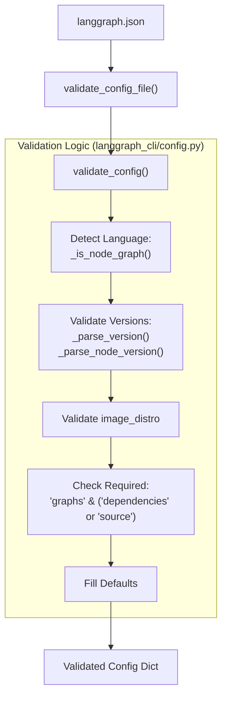

**Validation Rules:**
1. **Python Version:** Must be `major.minor` format and ≥ 3.11 [libs/cli/langgraph_cli/config.py:104-111]().
2. **Node Version:** Must be major version only (e.g., `"20"`) [libs/cli/langgraph_cli/config.py:113-123]().
3. **Bullseye Deprecation:** The CLI explicitly blocks `bullseye` images as they are deprecated [libs/cli/tests/unit_tests/test_config.py:229-237]().
4. **Language Detection:** If any graph path ends in `.ts`, `.js`, etc., `node_version` is required [libs/cli/langgraph_cli/config.py:126-141]().

**Sources:** [libs/cli/langgraph_cli/config.py:104-307](), [libs/cli/langgraph_cli/config.py:309-349]()

---

## Dependency Management

The `dependencies` field determines how local code and external packages are bundled into the container.

### Dependency Types

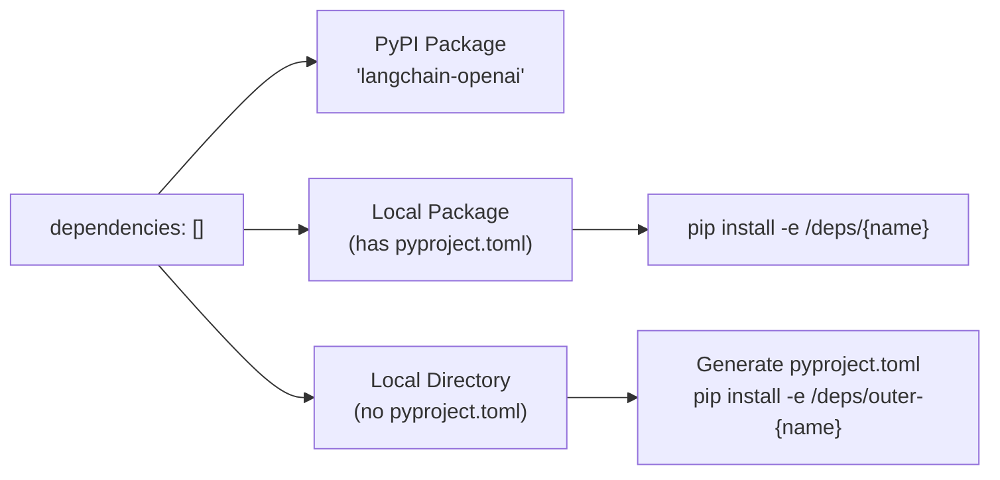

### LocalDeps Assembly
The function `_assemble_local_deps` processes the list and identifies:
- **`real_pkgs`**: Directories with `pyproject.toml`, `setup.py`, or `requirements.txt` [libs/cli/langgraph_cli/config.py:431-456]().
- **`faux_pkgs`**: Raw directories. The CLI generates a minimal `pyproject.toml` for these to make them installable [libs/cli/langgraph_cli/config.py:469-495]().

**Sources:** [libs/cli/langgraph_cli/config.py:352-525](), [libs/cli/tests/unit_tests/test_config.py:425-690]()

---

## Graph Specification

Graphs are the primary entry points for the application.

### Path Resolution
The CLI translates local paths (relative to `langgraph.json`) into container paths. This is handled by `_update_graph_paths()` [libs/cli/langgraph_cli/config.py:528-626]().

**String Format:**
```json
{
  "graphs": {
    "agent": "./src/my_agent.py:graph"
  }
}
```

**Object Format:**
```json
{
  "graphs": {
    "agent": {
      "path": "./src/my_agent.py:graph",
      "description": "Multi-agent supervisor"
    }
  }
}
```

The format `<file_path>:<attribute>` allows the server to import the compiled `StateGraph` or `@entrypoint` object [libs/cli/langgraph_cli/cli.py:52-53]().

**Sources:** [libs/cli/langgraph_cli/config.py:528-626](), [libs/cli/langgraph_cli/cli.py:41-92]()

---

## JSON Schema and IDE Support

The CLI includes a schema generator `generate_schema.py` that produces `schema.json`. This schema provides autocompletion and validation in IDEs like VS Code [libs/cli/generate_schema.py:1-7]().

### Key Schema Definitions
- **`Config`**: The top-level object [libs/cli/schemas/schema.json:4-10]().
- **`StoreConfig`**: Configures long-term memory, including `IndexConfig` for semantic search [libs/cli/langgraph_cli/schemas.py:83-107]().
- **`CheckpointerConfig`**: Configures state persistence and `SerdeConfig` for serialization [libs/cli/langgraph_cli/schemas.py:127-195]().
- **`HttpConfig`**: Configures custom routes and `CorsConfig` [libs/cli/langgraph_cli/schemas.py:202-206]().

**Sources:** [libs/cli/schemas/schema.json:1-195](), [libs/cli/generate_schema.py:135-199](), [libs/cli/langgraph_cli/schemas.py:9-200]()

---

## Environment Variables

The `env` field defines the runtime environment for the graph.

| Type | Example |
|------|---------|
| **Object** | `"env": {"OPENAI_API_KEY": "sk-..."}` [libs/cli/langgraph_cli/cli.py:78-90]() |
| **File** | `"env": "./.env"` [libs/cli/langgraph_cli/cli.py:73]() |

The CLI merges these into the container's environment, but filters out "reserved" keys that are managed by the deployment platform (e.g., `POSTGRES_URI`) to prevent accidental overrides [libs/cli/langgraph_cli/cli.py:41-86]().

**Sources:** [libs/cli/langgraph_cli/cli.py:41-101](), [libs/cli/langgraph_cli/config.py:202]()

---

## Build Customization

The configuration allows fine-grained control over the Docker build process.

### Build Tool Cleanup
By default, the CLI removes build dependencies (`pip`, `setuptools`, `wheel`) from the final image to minimize size and attack surface [libs/cli/langgraph_cli/config.py:63-70]().
- **`keep_pkg_tools: true`**: Retains all tools.
- **`keep_pkg_tools: ["pip"]`**: Retains only `pip`.

### Custom Docker Instructions
The `dockerfile_lines` array allows injecting raw Dockerfile commands (e.g., `RUN apt-get update && apt-get install -y ffmpeg`) immediately after the base image import [libs/cli/langgraph_cli/cli.py:57]().

**Sources:** [libs/cli/langgraph_cli/config.py:58-101](), [libs/cli/langgraph_cli/config.py:214](), [libs/cli/langgraph_cli/cli.py:41-92]()
This page documents the mechanisms that control execution order in LangGraph graphs: the `START`/`END` constants, static and conditional edges, the `Send` API for dynamic fan-out, and the `Command` type for combined routing and state updates. For how nodes are executed once routing is resolved, see [3.3 Pregel Execution Engine](). For human-in-the-loop patterns that use `interrupt()` and `Command(resume=...)`, see [3.7 Human-in-the-Loop and Interrupts]().

---

## START and END Constants

`START` and `END` are interned string sentinels that represent the graph's virtual entry and exit points. They are never executed as nodes; they are only used as endpoints in edge declarations.

| Constant | Value | Purpose |
|---|---|---|
| `START` | `"__start__"` | Virtual entry node; source of edges from the graph's input |
| `END` | `"__end__"` | Virtual exit node; any edge to `END` terminates that execution path |

**Source:** [libs/langgraph/langgraph/constants.py:28-31]()

Nodes and edges are always declared relative to these sentinels:

```python
from langgraph.graph import START, END, StateGraph

builder = StateGraph(State)
builder.add_edge(START, "my_node")
builder.add_edge("my_node", END)
```

---

## Static Edges

`StateGraph.add_edge(source, dest)` declares an unconditional dependency: after `source` completes, `dest` is always scheduled. Multiple outgoing static edges from the same node cause the targets to run in the same superstep (in parallel).

```python
builder.add_edge(START, "a")   # run "a" first
builder.add_edge("a", "b")     # run "b" after "a"
builder.add_edge("a", "c")     # also run "c" after "a" (parallel with "b")
```

Running two nodes with a static edge from the same source means both will execute in the same superstep. If both write to the same `LastValue` channel, an `InvalidUpdateError` is raised [libs/langgraph/langgraph/graph/state.py:119-120]() — use a `BinaryOperatorAggregate` channel or `Topic` channel if multiple writers are expected (see [3.4 State Management and Channels]()).

---

## Conditional Edges

`StateGraph.add_conditional_edges(source, path, path_map=None)` allows routing decisions to be made at runtime. The `path` argument is a callable that receives the current graph state and returns one of:

- A single node name string
- A list of node name strings (fan-out)
- A `Send` object
- A list of `Send` objects
- A mixed list of strings and `Send` objects

**Source:** [libs/langgraph/langgraph/graph/state.py:183-191]()

**Diagram: Conditional Edge Resolution**

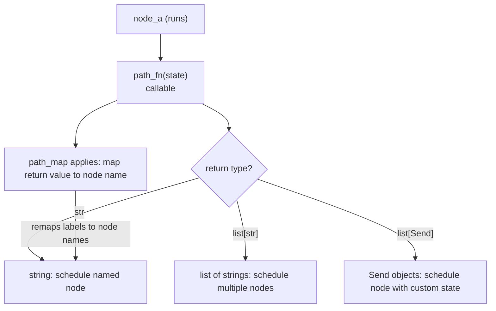

**Sources:** [libs/langgraph/langgraph/graph/state.py:183-191](), [libs/langgraph/langgraph/types.py:76-76](), [libs/langgraph/tests/test_pregel.py:1105-1128]()

### Path Functions

The path function receives the full graph state and returns a routing decision. The return value is matched against node names registered in the graph.

```python
def route(state: State) -> Literal["node_b", "node_c"]:
    if state["condition"]:
        return "node_b"
    return "node_c"

builder.add_conditional_edges("node_a", route)
```

### Path Maps (Labeled Edges)

`path_map` provides a mapping from the function's return values to actual node names. This is useful for labeled edges in graph visualizations, or when the return values are symbolic rather than exact node names.

```python
builder.add_conditional_edges(
    "agent",
    route,
    path_map={"continue": "tools", "exit": END}
)
```

In the rendered graph, the edge labels (`"continue"`, `"exit"`) appear as dashed arrow annotations.

**Source:** [libs/langgraph/langgraph/graph/state.py:183-191]()

### Conditional Entry Point

`StateGraph.set_conditional_entry_point(path, path_map=None)` is equivalent to `add_conditional_edges(START, path, path_map)`. It defines routing from the graph's input to its first node(s).

```python
builder.set_conditional_entry_point(lambda _: ["node_a", "node_b"])  # fan-out from input
```

**Source:** [libs/langgraph/tests/test_pregel.py:752-755](), [libs/langgraph/tests/test_pregel_async.py:534-535]()

---

## The Send API

`Send` allows a conditional edge function to schedule a node with a *custom state* that differs from the current graph state. This is the primary mechanism for dynamic fan-out (the "map" step in map-reduce workflows).

**Class definition:** [libs/langgraph/langgraph/types.py:289-301]()

| Attribute | Type | Description |
|---|---|---|
| `node` | `str` | Name of the target node to schedule |
| `arg` | `Any` | The state value to pass to that node invocation |

```python
from langgraph.types import Send

def fan_out(state: OverallState):
    return [Send("worker", {"item": x}) for x in state["items"]]

builder.add_conditional_edges(START, fan_out)
```

Each `Send` creates an independent task. Multiple `Send` objects returned from the same edge function execute concurrently in the next superstep.

**Diagram: Map-Reduce with Send API**

```mermaid
flowchart TD
    INPUT["START"]
    FANOUT["fan_out(state)\nadd_conditional_edges(START, fan_out)"]
    W1["worker task\nSend(\"worker\", {\"item\": items[0]})"]
    W2["worker task\nSend(\"worker\", {\"item\": items[1]})"]
    W3["worker task\nSend(\"worker\", {\"item\": items[2]})"]
    REDUCE["aggregate node\nadd_edge(\"worker\", \"aggregate\")"]
    OUTPUT["END"]

    INPUT --> FANOUT
    FANOUT -->|"Send"| W1
    FANOUT -->|"Send"| W2
    FANOUT -->|"Send"| W3
    W1 --> REDUCE
    W2 --> REDUCE
    W3 --> REDUCE
    REDUCE --> OUTPUT
```

**Sources:** [libs/langgraph/langgraph/types.py:289-301](), [libs/langgraph/tests/test_pregel.py:1105-1128](), [libs/langgraph/tests/test_pregel_async.py:914-942]()

### Send Inside Conditional Edge Functions

`Send` can be mixed with plain string node names in the same return value:

```python
def start(state: State) -> list[Send | str]:
    return ["tool_two", Send("tool_one", state)]
```

This schedules `tool_two` with the normal graph state and `tool_one` with the explicitly provided state.

**Source:** [libs/langgraph/tests/test_pregel_async.py:915-916]()

---

## The Command Type

`Command` is a dataclass that allows a node to simultaneously update graph state **and** specify the next node(s) to run. This eliminates the need for a separate conditional edge when the routing decision is made inside the node itself.

**Class definition:** [libs/langgraph/langgraph/types.py:367-417]()

| Field | Type | Description |
|---|---|---|
| `goto` | `str \| Send \| Sequence[str \| Send]` | Node(s) to route to next |
| `update` | `Any \| None` | State update to apply (same format as a normal node return) |
| `resume` | `Any \| None` | Value to inject when resuming a paused `interrupt()` |
| `graph` | `str \| None` | Target graph (`None` = current, `Command.PARENT` = nearest parent) |

**Diagram: Command Type Fields and Their Effects**

```mermaid
flowchart LR
    NodeReturn["node returns\nCommand(...)"]
    GotoField["goto field\nroutes execution"]
    UpdateField["update field\napplied to state channels"]
    ResumeField["resume field\nprovides interrupt resume value"]
    GraphField["graph field\ntarget graph scope"]

    NodeReturn --> GotoField
    NodeReturn --> UpdateField
    NodeReturn --> ResumeField
    NodeReturn --> GraphField

    GotoField -->|"str"| NamedNode["schedule named node"]
    GotoField -->|"Send"| DynamicNode["schedule node with custom state"]
    GotoField -->|"END"| TermPath["terminate execution path"]
    UpdateField -->|"dict"| ChannelWrite["ChannelWrite applies reducer or LastValue"]
    ResumeField -->|"matches interrupt id"| InterruptResume["interrupt() returns this value"]
    GraphField -->|"Command.PARENT"| ParentGraph["ParentCommand bubbles up to parent graph"]
```

**Sources:** [libs/langgraph/langgraph/types.py:367-417](), [libs/langgraph/langgraph/errors.py:111-115]()

### goto: Routing

```python
def node_a(state: State):
    return Command(goto="b", update={"foo": "bar"})

def node_b(state: State):
    return Command(goto=END, update={"bar": "baz"})
```

`goto` can also receive `Send` objects for dynamic fan-out:

```python
def node_a(state: State):
    return Command(goto=[Send("worker", {"item": x}) for x in state["items"]])
```

**Source:** [libs/langgraph/tests/test_pregel.py:139-155]()

### update: State Updates

`update` supports the same formats as a regular node return value:

- A `dict` keyed by state field names
- A list of `(field_name, value)` tuples
- A Pydantic or dataclass model instance (if the state schema uses one)

The update is processed by each field's reducer before the next superstep begins.

### resume: Resuming Interrupts

When `Command` is passed as the graph's *input* (rather than returned from a node), the `resume` field is used to provide values for pending `interrupt()` calls. The runtime matches resume values to interrupts by order.

```python
This page describes the architecture of the LangGraph core execution engine: the Pregel computational model, the two user-facing graph definition APIs, and how each internal component participates in running a graph. It covers the **what** and **why** at the system level.

For full API details on each subsystem, see the child pages:
- State schemas, `add_node`, `compile()` → [StateGraph API](#3.1)
- `@task` and `@entrypoint` → [Functional API (@task and @entrypoint)](#3.2)
- Superstep cycle internals → [Pregel Execution Engine](#3.3)
- Channel types and reducers → [State Management and Channels](#3.4)
- `Send`, `Command`, conditional edges → [Control Flow Primitives](#3.5)
- Graph composition and nested structures → [Graph Composition and Nested Graphs](#3.6)
- Interrupts and human-in-the-loop → [Human-in-the-Loop and Interrupts](#3.7)
- `RetryPolicy`, `CachePolicy` → [Error Handling and Retry Policies](#3.8), [Caching System](#3.10)
- Runtime and Dependency Injection → [Runtime and Dependency Injection](#3.9)

---

## Computational Model

LangGraph's execution engine is an implementation of the **Pregel / Bulk Synchronous Parallel (BSP)** model. In this model, a graph is composed of **actors** (nodes) that communicate exclusively through **channels** (shared state slots). Execution is divided into discrete **supersteps**. Within each superstep, no actor can observe another actor's writes — all writes from one superstep become visible at the start of the next.

Each superstep runs three sequential phases:

| Phase | Description | Key code |
|---|---|---|
| **Plan** | Determine which actors are eligible to run based on which channels were updated in the previous superstep. | `prepare_next_tasks()` in `pregel/_algo.py` |
| **Execute** | Run all selected actors concurrently. Each actor reads from its subscribed channels and writes its outputs. | `PregelRunner` in `pregel/_runner.py` |
| **Update** | Commit the actors' writes to channels, applying any reducers. | `apply_writes()` in `pregel/_algo.py` |

The loop continues until no actors are eligible (graph is done), a recursion limit is reached, or an interrupt occurs.

Sources: [libs/langgraph/langgraph/pregel/main.py:324-360](), [libs/langgraph/langgraph/pregel/_loop.py:140-200](), [libs/langgraph/langgraph/pregel/_algo.py:121-122]()

---

## Two Entry Points, One Runtime

Users can define graphs in two ways. Both ultimately produce a `Pregel` instance, which is the actual runtime object that supports `invoke`, `stream`, `ainvoke`, and `astream`.

**Diagram: Graph Definition APIs and Their Compiled Output**

```mermaid
graph TD
    SG["StateGraph\n(graph/state.py)"]
    FA["@entrypoint decorator\n(func/__init__.py)"]
    CSG["CompiledStateGraph\n(graph/state.py)\nextends Pregel"]
    P["Pregel\n(pregel/main.py)\ninvoke / ainvoke\nstream / astream\nget_state / update_state"]

    SG -->|"compile()"| CSG
    CSG -->|"is a"| P
    FA -->|"__call__(func) returns"| P
```

Sources: [libs/langgraph/langgraph/graph/state.py:115-184](), [libs/langgraph/langgraph/func/__init__.py:238-300](), [libs/langgraph/langgraph/pregel/main.py:324-330](), [libs/langgraph/langgraph/graph/state.py:70-71]()

### StateGraph Path

`StateGraph` is a **builder** — it holds node and edge declarations but cannot execute anything directly. Calling `.compile()` validates the graph structure and returns a `CompiledStateGraph`, which subclasses `Pregel`. During compilation, `StateGraph` converts its nodes and channels into the internal `PregelNode` and `BaseChannel` objects that `Pregel` uses at runtime.

```python
# Example: StateGraph -> CompiledStateGraph (Pregel)
builder = StateGraph(State)
builder.add_node("my_node", my_func)
builder.add_edge(START, "my_node")
graph = builder.compile()        # returns CompiledStateGraph
graph.invoke({"key": "value"})   # runs via Pregel
```

Sources: [libs/langgraph/langgraph/graph/state.py:197-250](), [libs/langgraph/tests/test_pregel.py:87-117](), [libs/langgraph/langgraph/graph/state.py:115-130]()

### Functional API Path

The `@entrypoint` decorator wraps a Python function and directly constructs a `Pregel` instance. No explicit `StateGraph` construction is needed. Tasks declared with `@task` become `PregelNode` actors inside the Pregel graph created by `@entrypoint`.

```python
## Purpose and Scope

Cron jobs in LangGraph provide scheduled, recurring execution of assistants. This page documents the cron job data model, API operations, and SDK client methods for managing scheduled tasks via the `CronClient` and `SyncCronClient`. Cron jobs allow for both stateful execution (within a persistent thread) and stateless execution (creating a new thread per run).

**Sources**: [libs/sdk-py/langgraph_sdk/client.py:1-32](), [libs/sdk-py/langgraph_sdk/schema.py:166-177](), [libs/sdk-py/langgraph_sdk/schema.py:383-411]()

---

## Cron Data Model

The `Cron` resource represents a scheduled task. Key fields include:

| Field | Type | Description |
|-------|------|-------------|
| `cron_id` | `str` | Unique identifier for the cron job. |
| `assistant_id` | `str` | ID of the assistant to execute. |
| `thread_id` | `str \| None` | Optional thread ID for stateful execution. |
| `schedule` | `str` | Cron expression (e.g., `0 0 * * *`) defining the schedule. |
| `payload` | `dict` | Run parameters (input, config, etc.) passed to each execution. |
| `on_run_completed` | `OnCompletionBehavior \| None` | Action after completion (stateless only): `"delete"` or `"keep"`. |
| `end_time` | `datetime \| None` | Optional date to stop the recurring execution. |
| `next_run_date` | `datetime \| None` | The next scheduled execution timestamp. |
| `enabled` | `bool` | Whether the cron job is currently active. |
| `timezone` | `str \| None` | IANA timezone for the cron schedule. |

**Sources**: [libs/sdk-py/langgraph_sdk/schema.py:383-411](), [libs/sdk-py/langgraph_sdk/schema.py:97-102](), [libs/sdk-py/langgraph_sdk/_async/cron.py:105-105]()

---

## Cron Job Execution Model

The following diagram illustrates how the `CronClient` interacts with the LangGraph API to manage the lifecycle of scheduled runs.

### Natural Language to Code Entity Space: Execution Flow

```mermaid
graph TB
    subgraph "Client Space (langgraph-sdk)"
        CC["CronClient (async)"]
        SCC["SyncCronClient (sync)"]
        HC["HttpClient / SyncHttpClient"]
    end

    subgraph "API Space (langgraph-api)"
        Endpoint["POST /runs/crons"]
        ThreadEndpoint["POST /threads/{thread_id}/runs/crons"]
        Scheduler["Scheduler Service"]
    end

    subgraph "Resource Space"
        Asst["Assistant"]
        Thread["Thread (Optional)"]
        CronRec["Cron Record (schema.Cron)"]
    end

    CC -->|".create()"| HC
    SCC -->|".create()"| HC
    HC -->| "HTTP POST" | Endpoint
    HC -->| "HTTP POST" | ThreadEndpoint
    
    Endpoint --> CronRec
    ThreadEndpoint --> CronRec
    
    CronRec -->| "references" | Asst
    CronRec -->| "references" | Thread
    
    Scheduler -->| "watches" | CronRec
    Scheduler -->| "triggers" | Run["Run Execution (schema.Run)"]
```

**Sources**: [libs/sdk-py/langgraph_sdk/client.py:12-31](), [libs/sdk-py/tests/test_crons_client.py:34-62](), [libs/sdk-py/tests/test_crons_client.py:100-128](), [libs/sdk-py/langgraph_sdk/schema.py:383-411]()

---

## Stateful vs Stateless Crons

### Stateful Crons
Stateful crons execute within a persistent thread. This is useful for periodic check-ins or tasks that require historical context.
- **`thread_id`**: Must be provided during creation.
- **API Route**: `POST /threads/{thread_id}/runs/crons`
- **Method**: `CronClient.create_for_thread` [libs/sdk-py/langgraph_sdk/_async/cron.py:57-172]()

### Stateless Crons
Stateless crons trigger a run that is independent of a specific persistent thread (though a thread is created for the duration of the run).
- **`thread_id`**: Omitted.
- **`on_run_completed`**: Determines if the temporary thread is kept or deleted.
- **API Route**: `POST /runs/crons`
- **Method**: `CronClient.create` [libs/sdk-py/langgraph_sdk/_async/cron.py:174-279]()

**Sources**: [libs/sdk-py/tests/test_crons_client.py:34-62](), [libs/sdk-py/tests/test_crons_client.py:100-128](), [libs/sdk-py/langgraph_sdk/schema.py:390-391]()

---

## Schedule and Timezone Management

The `schedule` string follows standard cron syntax:
`minute hour day-of-month month day-of-week`

Schedules are interpreted in UTC by default unless a `timezone` is specified. The `timezone` parameter accepts IANA timezone strings (e.g., `'America/New_York'`) or `datetime.tzinfo` instances, which are resolved using the `_resolve_timezone` utility.

| Example | Meaning |
|---------|---------|
| `0 0 * * *` | Every day at midnight |
| `0 9 * * 1-5` | Every weekday at 9:00 AM |
| `*/15 * * * *` | Every 15 minutes |

**Sources**: [libs/sdk-py/langgraph_sdk/schema.py:396-397](), [libs/sdk-py/langgraph_sdk/_async/cron.py:105-105](), [libs/sdk-py/langgraph_sdk/_shared/utilities.py:10-11]()

---

## CronClient SDK Interface

The `CronClient` (async) and `SyncCronClient` (sync) provide the primary interface for managing these resources.

### Class Association Diagram

```mermaid
classDiagram
    class LangGraphClient {
        +CronClient crons
        +AssistantsClient assistants
        +ThreadsClient threads
    }
    class CronClient {
        +create(assistant_id, schedule, ...)
        +create_for_thread(thread_id, assistant_id, schedule, ...)
        +get(cron_id)
        +update(cron_id, ...)
        +delete(cron_id)
        +search(assistant_id, thread_id, ...)
    }
    class SyncCronClient {
        +create(assistant_id, schedule, ...)
        +create_for_thread(thread_id, assistant_id, schedule, ...)
        +get(cron_id)
        +update(cron_id, ...)
        +delete(cron_id)
        +search(assistant_id, thread_id, ...)
    }
    LangGraphClient *-- CronClient
    CronClient ..> HttpClient : uses
    SyncCronClient ..> SyncHttpClient : uses
```

**Sources**: [libs/sdk-py/langgraph_sdk/client.py:12-31](), [libs/sdk-py/langgraph_sdk/client.py:33-55]()

### Key Methods

#### Create Cron
Creates a cron job for an assistant.
```python
This page provides an overview of the tooling and automation that supports development across the LangGraph monorepo. It covers the monorepo organization, dependency management with `uv`, testing infrastructure, and the automated CI/CD pipelines.

For detailed information on individual topics, see:
- [Monorepo Structure and Build System](#9.1)
- [Testing Infrastructure](#9.2)
- [CI/CD Workflows](#9.3)
- [Release Process](#9.4)

---

## Repository Layout

All publishable packages live under the `libs/` directory. The root of the repository contains a top-level `Makefile` that orchestrates operations across every package.

```
langgraph/               ← repository root
├── Makefile             ← root orchestrator
└── libs/
    ├── langgraph/       ← core library [libs/langgraph/pyproject.toml:6]()
    ├── checkpoint/      ← base checkpoint interfaces
    ├── checkpoint-postgres/
    ├── checkpoint-sqlite/
    ├── checkpoint-conformance/ ← interface compliance tests
    ├── prebuilt/        ← prebuilt nodes and agents [libs/prebuilt/pyproject.toml:6]()
    ├── sdk-py/          ← Python SDK client
    └── cli/             ← Command line interface
```

Each package under `libs/` owns its own `Makefile`, `pyproject.toml`, and `uv.lock`. The root `Makefile` iterates over `libs/*` and delegates to each package's `Makefile`.

Sources: [libs/langgraph/pyproject.toml:1-33](), [libs/prebuilt/pyproject.toml:1-29]()

---

## Build System Overview

LangGraph uses [hatchling](https://hatch.pypa.io/latest/) as the build backend for its Python packages.

**Build System Diagram**

```mermaid
graph TD
    root["Makefile\n(root)"]
    lint_root["lint target"]
    format_root["format target"]
    lock_root["lock target"]
    test_root["test target"]

    root --> lint_root
    root --> format_root
    root --> lock_root
    root --> test_root

    lint_root -->|"$(MAKE) -C $$dir lint"| pkg_lint["per-package lint\n(ruff + mypy + codespell)"]
    format_root -->|"$(MAKE) -C $$dir format"| pkg_format["per-package format\n(ruff format)"]
    lock_root -->|"uv lock"| pkg_lock["per-package uv.lock"]
    test_root -->|"$(MAKE) -C $$dir test"| pkg_test["per-package pytest"]
    
    hatch["hatchling.build"]
    pkg_build["uv build"] --> hatch
    hatch --> wheel[".whl / .tar.gz"]
```

Sources: [libs/langgraph/pyproject.toml:1-3](), [libs/prebuilt/pyproject.toml:1-3]()

### Dependency Management

The monorepo leverages [`uv`](https://github.com/astral-sh/uv) for fast, reproducible dependency resolution.

- **Lock Files**: Each package maintains a standalone `uv.lock` file to ensure consistent environments [libs/langgraph/uv.lock:1](), [libs/prebuilt/uv.lock:1](), [libs/sdk-py/uv.lock:1]().
- **Local Sources**: Packages within the monorepo reference each other using relative paths in the `[tool.uv.sources]` section, enabling seamless local development [libs/langgraph/pyproject.toml:83-89](), [libs/prebuilt/pyproject.toml:64-68]().
- **Dependency Groups**: Development tools are organized into `test`, `lint`, and `dev` groups [libs/langgraph/pyproject.toml:45-80](), [libs/prebuilt/pyproject.toml:37-59]().

---

## Testing Infrastructure

LangGraph employs a comprehensive testing strategy using `pytest` and specialized fixtures to handle multiple persistence backends.

### Test Matrix and Fixtures

The testing infrastructure uses parameterized fixtures to run the same logic against different state managers (Checkpointers) and Stores.

| Component | Implementations Tested |
|---|---|
| **Checkpointers** | Memory, SQLite, SQLite (AES), Postgres (Pipe/Pool/Async) |
| **Stores** | In-Memory, Postgres (Pipe/Pool/Async) |
| **Caches** | SQLite, Memory, Redis |

Sources: [libs/langgraph/pyproject.toml:46-70](), [libs/prebuilt/pyproject.toml:38-50]()

### Benchmarking

Performance is tracked via `pyperf` to prevent regressions in core graph execution logic.

- **Baseline**: A baseline is maintained and stored in the GHA cache [/.github/workflows/bench.yml:32-40]().
- **Comparison**: PRs trigger a `benchmark-fast` run which is compared against the baseline using `pyperf compare_to` [/.github/workflows/bench.yml:41-58]().

---

## CI/CD Workflows

Automation is handled via GitHub Actions, focusing on change detection and validation.

**CI Execution Flow**

```mermaid
graph TD
    trigger["push / pull_request"]
    changes["Job: changes\n(paths-filter)"]
    lint["Job: lint\n(ruff + mypy)"]
    test["Job: test\n(pytest matrix)"]
    integ["Job: integration-test\n(CLI + Docker)"]
    success["Job: ci_success\n(Aggregation)"]

    trigger --> changes
    changes -->|"libs/langgraph/**"| lint
    changes -->|"libs/langgraph/**"| test
    changes -->|"libs/cli/**"| integ
    
    lint --> success
    test --> success
    integ --> success
```

Sources: [/.github/workflows/ci.yml:26-50](), [/.github/workflows/ci.yml:159-183]()

### Key Workflow Features
- **Path Filtering**: The `changes` job ensures only modified packages are re-tested, saving CI minutes [/.github/workflows/ci.yml:31-50]().
- **Integration Testing**: The `_integration_test.yml` workflow builds real Docker images of LangGraph services using `langgraph build` and verifies them against a live LangSmith environment [/.github/workflows/_integration_test.yml:57-74]().
- **Schema Validation**: The CLI's configuration schema (`langgraph.json`) is automatically checked for drifts during CI [/.github/workflows/ci.yml:116-151]().

---

## Release Process

Releases are triggered manually via `workflow_dispatch` and follow a strict security-first "Trusted Publishing" model.

1. **Build**: Distribution files are built using `uv build` [/.github/workflows/release.yml:48-49]().
2. **TestPyPI**: Packages are first published to TestPyPI for verification [/.github/workflows/_test_release.yml:84-90]().
3. **Validation**: The published package is installed and imported in a clean environment to ensure no missing dependencies [/.github/workflows/release.yml:182-193]().
4. **Trusted Publishing**: Final release to PyPI uses OIDC tokens (`id-token: write`), removing the need for long-lived secrets [/.github/workflows/_test_release.yml:74]().

Sources: [/.github/workflows/release.yml:1-11](), [/.github/workflows/_test_release.yml:18-98]()
This document covers the Dockerfile generation system in the LangGraph CLI, which transforms a `langgraph.json` configuration into a deployable Docker image. The system analyzes local dependencies, generates appropriate build instructions, and produces a Dockerfile that can be used with `langgraph build` or `langgraph dockerfile` commands.

For information about the overall CLI command structure, see [CLI Commands (6.1)](). For configuration schema and validation, see [Configuration System (6.2)](). For local development workflows, see [Local Development Server (6.5)]().

## Overview

The Docker image generation system converts declarative configuration into imperative Docker build instructions. It handles several complex scenarios:

- **Local dependency packaging**: Distinguishes between Python packages with metadata (`pyproject.toml`/`setup.py`) and directories without, generating minimal packaging metadata for the latter.
- **Path rewriting**: Transforms host filesystem paths to container paths for graph definitions, authentication modules, and encryption handlers.
- **Multi-context builds**: Manages Docker build contexts when dependencies exist outside the configuration directory.
- **Package installer selection**: Chooses between `pip` and `uv` based on base image capabilities.
- **Cleanup optimization**: Removes build tools from final images to reduce size.

The primary entry point is `config_to_docker()` which orchestrates the entire generation process.

**Sources**: [libs/cli/langgraph_cli/config.py:1077-1077]()

## Configuration-to-Dockerfile Flow

The following diagram maps the natural language requirements of a build process to the specific code entities responsible for execution.

### Logic Flow: Natural Language to Code Entity Space

```mermaid
graph TB
    subgraph "Natural Language Space"
        Input["User Configuration"]
        Analysis["Dependency Analysis"]
        Rewriting["Path Translation"]
        Generation["Dockerfile Construction"]
    end

    subgraph "Code Entity Space"
        ConfigDict["langgraph.json dict"]
        ValidateFunc["validate_config()"]
        AssembleFunc["_assemble_local_deps()"]
        LocalDepsType["LocalDeps NamedTuple"]
        UpdateGraphs["_update_graph_paths()"]
        UpdateAuth["_update_auth_path()"]
        ConfigToDocker["config_to_docker()"]
    end

    Input -.-> ConfigDict
    ConfigDict --> ValidateFunc
    Analysis -.-> AssembleFunc
    AssembleFunc --> LocalDepsType
    Rewriting -.-> UpdateGraphs
    UpdateGraphs --> UpdateAuth
    Generation -.-> ConfigToDocker
    
    LocalDepsType --> ConfigToDocker
    UpdateAuth --> ConfigToDocker
```

**Sources**: [libs/cli/langgraph_cli/config.py:152-190](), [libs/cli/langgraph_cli/config.py:311-317](), [libs/cli/langgraph_cli/config.py:487-510](), [libs/cli/langgraph_cli/config.py:1077-1077]()

## Local Dependency Classification

The system categorizes local dependencies (those starting with `.`) into three types:

| Type | Detection | Treatment | Container Path |
|------|-----------|-----------|----------------|
| **Real Package** | Contains `pyproject.toml` or `setup.py` | Direct pip install | `/deps/<name>` |
| **Faux Package** | No metadata files, has Python files | Generate minimal `pyproject.toml` | `/deps/outer-<name>/<name>` or `/deps/outer-<name>/src` |
| **Requirements File** | `requirements.txt` in faux package | Install before package | Copied alongside package |

### LocalDeps Structure

The `LocalDeps` NamedTuple encapsulates dependency analysis results:

```python
class LocalDeps(NamedTuple):
    pip_reqs: list[tuple[pathlib.Path, str]]  # (host_path, container_path)
    real_pkgs: dict[pathlib.Path, tuple[str, str]]  # host_path -> (dep_string, container_name)
    faux_pkgs: dict[pathlib.Path, tuple[str, str]]  # host_path -> (dep_string, container_path)
    working_dir: str | None  # If "." in dependencies
    additional_contexts: list[pathlib.Path]  # Dirs in parent directories
```

**Sources**: [libs/cli/langgraph_cli/config.py:311-317]()

### Real Package Handling

Real packages are copied directly and installed with pip/uv in editable mode. The CLI iterates through the `/deps` directory in the container to perform these installs.

**Sources**: [libs/cli/langgraph_cli/config.py:913-922]()

### Faux Package Handling

Faux packages require synthetic packaging metadata. The system generates a minimal `pyproject.toml` using `setuptools` as the backend.

**Flat vs Src Layout**: If `__init__.py` exists at the root, flat layout is used (`/deps/outer-<name>/<name>`). Otherwise, src layout is assumed (`/deps/outer-<name>/src`).

**Sources**: [libs/cli/langgraph_cli/config.py:441-483](), [libs/cli/langgraph_cli/config.py:893-913]()

## Path Rewriting System

Host filesystem paths in `langgraph.json` must be translated to container paths. The system rewrites four categories of paths to ensure the API server can locate code inside the image.

### Path Translation Mapping

| Source Config Key | Transformation Function | Code Pointer |
|-------------------|-------------------------|--------------|
| `graphs` | `_update_graph_paths()` | [libs/cli/langgraph_cli/config.py:487]() |
| `auth` | `_update_auth_path()` | [libs/cli/langgraph_cli/config.py:587]() |
| `encryption` | `_update_encryption_path()` | [libs/cli/langgraph_cli/config.py:628]() |
| `http.app` | `_update_http_app_path()` | [libs/cli/langgraph_cli/config.py:671]() |

### Path Resolution Logic

```mermaid
graph LR
    HostPath["Host Path: ./agent/graph.py:agent"]
    Resolve["Resolve Absolute Path"]
    Match["Match against LocalDeps"]
    ContainerPath["Container Path: /deps/outer-agent/src/graph.py:agent"]

    HostPath --> Resolve
    Resolve --> Match
    Match --> ContainerPath
```

**Sources**: [libs/cli/langgraph_cli/config.py:487-722]()

## Package Installer Selection

The system supports `pip` and `uv` with automatic selection based on the base image version.

| Mode | Behavior |
|------|----------|
| `auto` | Use `uv` if base image version ≥ `0.2.47`, else `pip`. |
| `pip` | Force traditional `pip` installer. |
| `uv` | Force `uv` installer. |

The `_image_supports_uv` function performs regex matching on the base image tag to determine version compatibility.

**Sources**: [libs/cli/langgraph_cli/config.py:787-799](), [libs/cli/langgraph_cli/config.py:829-841]()

## Build Tool Cleanup

To minimize image size, the system removes build dependencies (pip, setuptools, wheel) unless explicitly kept via `keep_pkg_tools`.

### Cleanup Implementation

The `_get_pip_cleanup_lines` function generates the `RUN` commands for uninstallation. It specifically targets both standard Python site-packages and Wolfi-specific paths (`/usr/lib/python*/site-packages/`).

```python
def _get_pip_cleanup_lines(
    install_cmd: str,
    to_uninstall: tuple[str] | None,
    pip_installer: Literal["uv", "pip"],
) -> str:
    # ... logic to generate RUN pip uninstall and rm -rf ...
```

**Sources**: [libs/cli/langgraph_cli/config.py:58-101]()

## Multi-Platform and Distro Selection

The CLI supports generating images for different Linux distributions, with a default for Debian.

- **Default Distro**: `debian` [libs/cli/langgraph_cli/config.py:52]().
- **Python Versions**: Supports `3.11`, `3.12`, and `3.13` [libs/cli/langgraph_cli/config.py:49-50]().
- **Architecture**: For non-`x86_64` machines, the CLI requires Docker Buildx to cross-compile images for `linux/amd64` [libs/cli/langgraph_cli/docker.py:80-94]().

### Tag Generation Logic

The `docker_tag()` function constructs the final image tag based on the language runtime (Python vs Node.js), version, and distribution.

**Sources**: [libs/cli/langgraph_cli/config.py:1443-1480]()

## Node.js Support

If the `graphs` configuration points to `.js` or `.ts` files, the CLI switches to Node.js image generation.

- **Base Image**: `langchain/langgraphjs-api` [libs/cli/langgraph_cli/config.py:1127]().
- **Package Managers**: Supports `npm`, `yarn`, `pnpm`, and `bun` by detecting corresponding lock files [libs/cli/langgraph_cli/config.py:724-782]().

**Sources**: [libs/cli/langgraph_cli/config.py:126-143](), [libs/cli/langgraph_cli/config.py:1079-1257]()
This page documents how LangGraph handles node-level errors, configures automatic retry behavior, and preserves partial execution state when failures occur. The focus is on the `RetryPolicy` type, how it attaches to nodes and tasks, the mechanics of backoff and retry execution, and the relationship between errors and checkpointing.

For human-in-the-loop interrupts (which use `GraphInterrupt` but are not errors), see [3.7](). For the checkpointing system that enables execution resumption, see [4.1]().

---

## RetryPolicy

`RetryPolicy` is a `TypedDict` defined in [libs/langgraph/langgraph/types.py:225-244]() that configures automatic retry behavior for a node or task.

| Field | Type | Default | Description |
|---|---|---|---|
| `initial_interval` | `float` | `0.5` | Seconds to wait before the first retry |
| `backoff_factor` | `float` | `2.0` | Multiplier applied to the interval after each retry |
| `max_interval` | `float` | `128.0` | Maximum seconds between retries |
| `max_attempts` | `int` | `3` | Total attempts, including the first |
| `jitter` | `bool` | `True` | Add random noise to the computed interval |
| `retry_on` | `type[Exception] | Sequence[type[Exception]] | Callable[[Exception], bool]` | `default_retry_on` | Filter determining which exceptions should trigger a retry |

The computed delay for attempt `n` (1-indexed, where 1 is the first retry) is implemented in `run_with_retry` [libs/langgraph/langgraph/pregel/_retry.py:168-177]():

```python
interval = min(
    policy.max_interval,
    policy.initial_interval * (policy.backoff_factor ** (attempts - 1)),
)
if policy.jitter:
    sleep_time = interval + random.uniform(0, 1)
```

### `retry_on` and `default_retry_on`

The `retry_on` field controls which exceptions are retried. It accepts a single exception class, a sequence, or a predicate function. The default value is `default_retry_on`. 

The logic for evaluating `retry_on` is handled by `_should_retry_on` [libs/langgraph/langgraph/pregel/_retry.py:20-22](). By default, it retries transient errors like `ConnectionError` and 5xx HTTP status codes from `httpx` or `requests`, while ignoring common programming errors like `ValueError`, `TypeError`, or `SyntaxError` [libs/langgraph/tests/test_retry.py:113-178](). Control-flow signals like `GraphInterrupt` and `ParentCommand` are never retried regardless of policy [libs/langgraph/langgraph/pregel/_retry.py:127-143]().

### Multiple Policies

Both `StateGraph.add_node` and `@task` accept `retry_policy: RetryPolicy | Sequence[RetryPolicy]`. When a sequence is provided, the execution loop iterates through them and applies the **first policy whose `retry_on` matches the exception** [libs/langgraph/langgraph/pregel/_retry.py:151-155]().

---

## Attaching Retry Policies

**RetryPolicy** can be attached at the graph/`Pregel` level, the node level, or the task (functional API) level.

### Diagram: RetryPolicy Attachment Points

```mermaid
graph TD
    subgraph "StateGraph_API"
        A["StateGraph.add_node(..., retry_policy=)\n[graph/state.py]"]
    end
    subgraph "Functional_API"
        B["@task(retry_policy=...)\n[func/__init__.py]"]
        C["@entrypoint(retry_policy=...)\n[func/__init__.py]"]
    end
    subgraph "Low_Level_API"
        D["NodeBuilder._retry_policy\n[pregel/main.py]"]
        E["Pregel(retry_policy=...)\n[pregel/main.py]"]
    end
    subgraph "Runtime_Execution"
        F["PregelExecutableTask\n.retry_policy: Sequence[RetryPolicy]\n[types.py]"]
        G["PregelRunner\n[pregel/_runner.py]"]
        H["run_with_retry()\n[pregel/_retry.py]"]
    end

    A -->|"node-level policy"| F
    B -->|"task-level policy"| F
    C -->|"entrypoint-level policy"| F
    D -->|"node-level policy"| F
    E -->|"graph-wide fallback policy"| F
    F --> G
    G --> H
```

Sources: [libs/langgraph/langgraph/types.py:225-244](), [libs/langgraph/langgraph/pregel/main.py:187-209](), [libs/langgraph/langgraph/pregel/_retry.py:86-90]()

#### `NodeBuilder` and `Pregel`
The `NodeBuilder` class maintains a list of retry policies for a specific node [libs/langgraph/langgraph/pregel/main.py:197](). During graph compilation, these are bundled into the `Pregel` instance, which also supports a global `retry_policy` that acts as a fallback for all nodes [libs/langgraph/langgraph/pregel/main.py:408]().

---

## Retry Execution Mechanics

`PregelRunner` orchestrates the execution of tasks. It calls `run_with_retry` (sync) or `arun_with_retry` (async) for each task [libs/langgraph/langgraph/pregel/_runner.py:167-180]().

### Execution Context and `ExecutionInfo`
Before a retry attempt, the system updates the `ExecutionInfo` in the `Runtime` object to track the attempt number (1-indexed) and the timestamp of the first attempt [libs/langgraph/langgraph/pregel/_retry.py:111-121](). This allows nodes to be aware of their own retry state via `runtime.execution_info.node_attempt` [libs/langgraph/langgraph/runtime.py:47-48]().

### Diagram: Retry Decision Flow

```mermaid
flowchart TD
    A["run_with_retry() called"] --> B["task.proc.invoke()"]
    B -- "Success" --> C["Return Result"]
    B -- "Exception" --> D{"Is exception\nGraphBubbleUp\nor ParentCommand?"}
    D -->|"Yes"| E["Handle or Raise immediately\n(No Retry)"]
    D -->|"No"| F{"Does any policy\nmatch via _should_retry_on?"}
    F -->|"No"| G["Raise Exception"]
    F -->|"Yes"| H{"attempts <\nmax_attempts?"}
    H -->|"No"| G
    H -->|"Yes"| I["attempts += 1"]
    I --> J["Calculate delay with backoff\nand optional jitter"]
    J --> K["time.sleep(delay)"]
    K --> L["Clear task.writes"]
    L --> B
```

Sources: [libs/langgraph/langgraph/pregel/_retry.py:86-186](), [libs/langgraph/langgraph/runtime.py:47-52](), [libs/langgraph/tests/test_retry.py:180-210]()

### State Isolation during Retries
A critical feature of the retry mechanism is that it calls `task.writes.clear()` before every retry attempt [libs/langgraph/langgraph/pregel/_retry.py:124](). This ensures that partial writes from a failed attempt do not pollute the state when the node is re-run.

---

## Error Propagation and State

When a node fails (after all retries are exhausted), the error is not immediately lost. It is captured by the `PregelRunner` and committed via `self.commit(task, exception)` [libs/langgraph/langgraph/pregel/_runner.py:183]().

### Error Recording
The error is recorded as a write to the reserved `ERROR` channel [libs/langgraph/langgraph/_internal/_constants.py:78](). 
- If a checkpointer is present, the error is stored in `pending_writes` [libs/langgraph/langgraph/pregel/_algo.py:218-224]().
- The checkpoint itself is **not advanced** to a new version. The state remains at the beginning of the superstep that failed.

### Diagram: Error in Pending Writes

```mermaid
sequenceDiagram
    participant Loop as "SyncPregelLoop"
    participant Runner as "PregelRunner"
    participant Retry as "run_with_retry"
    participant CP as "BaseCheckpointSaver"

    Loop->>Runner: "tick(tasks)"
    Runner->>Retry: "Execute task_A"
    Retry-->>Runner: "Exception (Max retries reached)"
    Runner->>Runner: "commit(task_A, exc)"
    Runner->>Loop: "put_writes(task_id, [('__error__', exc)])"
    Loop->>CP: "put_writes(checkpoint_id, task_id, writes)"
    Note over CP: "Checkpoint version NOT incremented"
```

Sources: [libs/langgraph/langgraph/pregel/_runner.py:152-184](), [libs/langgraph/langgraph/pregel/_algo.py:218-224](), [libs/langgraph/langgraph/pregel/main.py:850-865]()

---

## Resumption After Failure

When a graph is resumed (e.g., by calling `invoke` again with the same `thread_id`), the `PregelLoop` checks for `pending_writes` in the latest checkpoint.

1. **Successful Tasks**: If a task in the failed superstep completed successfully before the failure of a sibling, its results are replayed from `pending_writes` [libs/langgraph/langgraph/pregel/_algo.py:71-82]().
2. **Failed Tasks**: Tasks that previously wrote an `ERROR` are re-scheduled for execution.
3. **Resuming Flag**: The configuration is patched with `CONFIG_KEY_RESUMING: True` [libs/langgraph/langgraph/pregel/_retry.py:185](), signaling to subgraphs that they should attempt to resume from their own internal checkpoints.

---

## Error Types Reference

| Class | Definition | Description |
|---|---|---|
| `GraphRecursionError` | [errors.py:111]() | Raised when the number of supersteps exceeds `recursion_limit`. |
| `InvalidUpdateError` | [errors.py:112]() | Raised when multiple nodes write to the same channel without a reducer. |
| `GraphBubbleUp` | [errors.py:141]() | Base class for exceptions that should bypass retries and stop the loop (e.g., Interrupts). |
| `ParentCommand` | [errors.py:127]() | Special exception used to send a `Command` to a parent graph from a nested subgraph [libs/langgraph/tests/test_parent_command.py:18-21](). |

### ParentCommand Handling
When a `ParentCommand` is raised within `run_with_retry`, the system checks if the command is intended for the current graph or needs to be "recast" for a higher-level parent by stripping the current namespace segment [libs/langgraph/langgraph/pregel/_retry.py:127-140](). This is supported by the utility `_checkpoint_ns_for_parent_command` [libs/langgraph/langgraph/pregel/_retry.py:57-83]().

---

## Checkpoint Errors

Errors during the checkpointing process itself (e.g., a database timeout in `SqliteSaver`) are not handled by `RetryPolicy`. These are considered infrastructure failures and propagate immediately to the caller, potentially crashing the execution loop to prevent state corruption [libs/langgraph/langgraph/pregel/_loop.py:132-135]().

Sources: [libs/langgraph/langgraph/pregel/_retry.py](), [libs/langgraph/langgraph/pregel/_runner.py](), [libs/langgraph/langgraph/pregel/_algo.py](), [libs/langgraph/langgraph/runtime.py](), [libs/langgraph/tests/test_retry.py]()
builder = StateGraph(State)
builder.add_node("step_1", logic)
@task
def fetch_data(url: str) -> str: ...

@entrypoint(checkpointer=InMemorySaver())
def my_workflow(input: str) -> str:
    result = fetch_data(input).result()
    return result

my_workflow.invoke("http://...")   # my_workflow IS a Pregel instance
```

The `entrypoint` decorator internally uses `get_runnable_for_entrypoint` to map the function to the underlying Pregel structure.

Sources: [libs/langgraph/langgraph/func/__init__.py:127-190](), [libs/langgraph/langgraph/func/__init__.py:35-39](), [libs/langgraph/langgraph/func/__init__.py:47-80]()

---

## The Pregel Runtime

`Pregel` in [libs/langgraph/langgraph/pregel/main.py:324]() is the central runtime class. It holds:

| Attribute | Type | Purpose |
|---|---|---|
| `nodes` | `Mapping[str, PregelNode]` | All actor definitions |
| `channels` | `Mapping[str, BaseChannel]` | All communication channels |
| `input_channels` | `str \| Sequence[str]` | Which channels accept external input |
| `output_channels` | `str \| Sequence[str]` | Which channels produce final output |
| `checkpointer` | `BaseCheckpointSaver \| None` | Persistence layer |
| `interrupt_before` | `Sequence[str] \| All` | Node names to interrupt before |
| `interrupt_after` | `Sequence[str] \| All` | Node names to interrupt after |
| `retry_policy` | `RetryPolicy \| None` | Default retry behavior |
| `cache_policy` | `CachePolicy \| None` | Default caching behavior |

`Pregel` exposes the public execution interface: `invoke`, `ainvoke`, `stream`, `astream`, `batch`, `get_state`, `update_state`, `get_state_history`.

### NodeBuilder

`NodeBuilder` in [libs/langgraph/langgraph/pregel/main.py:179-322]() is a fluent builder for creating low-level `PregelNode` actors directly — used primarily in tests and advanced scenarios where a `StateGraph` is unnecessary.

```python
node = (
    NodeBuilder()
    .subscribe_only("input")   # read from channel "input"
    .do(my_func)               # run my_func
    .write_to("output")        # write result to channel "output"
    .build()                   # returns PregelNode
)
```

`StateGraph` creates `PregelNode` instances internally during `compile()`, so most users never use `NodeBuilder` directly.

Sources: [libs/langgraph/langgraph/pregel/main.py:179-322](), [libs/langgraph/langgraph/pregel/main.py:1-3]()

---

## Internal Execution Components

**Diagram: Runtime Component Relationships**

```mermaid
graph TD
    subgraph "pregel/main.py"
        P["Pregel.invoke()\nPregel.stream()"]
    end

    subgraph "pregel/_loop.py"
        SLOOP["SyncPregelLoop"]
        ALOOP["AsyncPregelLoop"]
        LOOP["PregelLoop (base)"]
        SLOOP -->|"extends"| LOOP
        ALOOP -->|"extends"| LOOP
    end

    subgraph "pregel/_algo.py"
        PNT["prepare_next_tasks()"]
        AW["apply_writes()"]
    end

    subgraph "pregel/_runner.py"
        RUNNER["PregelRunner"]
    end

    subgraph "channels/"
        LV["LastValue"]
        BO["BinaryOperatorAggregate"]
        TP["Topic"]
        EV["EphemeralValue"]
    end

    subgraph "checkpoint/"
        CP["BaseCheckpointSaver"]
    end

    P -->|"creates SyncPregelLoop\nor AsyncPregelLoop"| LOOP
    LOOP -->|"Plan: calls"| PNT
    LOOP -->|"Execute: delegates to"| RUNNER
    LOOP -->|"Update: calls"| AW
    PNT -->|"reads versions from"| LV
    PNT -->|"reads versions from"| BO
    AW -->|"writes to"| LV
    AW -->|"writes to"| BO
    AW -->|"writes to"| TP
    LOOP -->|"persists checkpoints via"| CP
```

Sources: [libs/langgraph/langgraph/pregel/_loop.py:57-58](), [libs/langgraph/langgraph/pregel/_runner.py:57-58](), [libs/langgraph/langgraph/pregel/main.py:324-400](), [libs/langgraph/langgraph/pregel/_algo.py:121-122](), [libs/langgraph/langgraph/pregel/_algo.py:218-224]()

### PregelLoop

`PregelLoop` is the superstep controller. There are two concrete subclasses:

- `SyncPregelLoop` — used by `invoke` and `stream` [libs/langgraph/langgraph/pregel/_loop.py:57]()
- `AsyncPregelLoop` — used by `ainvoke` and `astream` [libs/langgraph/langgraph/pregel/_loop.py:58]()

The loop tracks:
- `step` — current superstep index
- `stop` — maximum allowed step (recursion limit)
- `tasks` — the set of `PregelExecutableTask` objects ready for the current superstep
- checkpoint management (reading initial state, writing after each step)
- interrupt handling (`interrupt_before`, `interrupt_after`)
- stream output emission

Sources: [libs/langgraph/langgraph/pregel/_loop.py:57-58](), [libs/langgraph/tests/test_pregel.py:57-58]()

### prepare_next_tasks

`prepare_next_tasks()` is called at the start of each superstep (Plan phase). It inspects which channels were updated in the previous superstep and returns the set of `PregelExecutableTask` objects whose trigger conditions are satisfied.

A `PregelExecutableTask` carries:
- `name` — node name
- `input` — the channel values the node receives
- `proc` — the `Runnable` to execute
- `writes` — a `deque` for collecting outputs
- `config` — `RunnableConfig` with injected context
- `retry_policy`, `cache_key`, `id`, `path`

Sources: [libs/langgraph/langgraph/types.py:74-80](), [libs/langgraph/langgraph/pregel/_algo.py:121-122](), [libs/langgraph/langgraph/types.py:140-166]()

### PregelRunner

`PregelRunner` executes a set of `PregelExecutableTask` objects concurrently (Execute phase). It:

- Runs sync tasks in a thread pool
- Runs async tasks with `asyncio`
- Applies retry logic from each task's `retry_policy`
- Checks the cache (via `CachePolicy`) before executing
- Cancels all running tasks if any task raises an unrecoverable error

Sources: [libs/langgraph/langgraph/pregel/_runner.py:57-58](), [libs/langgraph/tests/test_pregel.py:58](), [libs/langgraph/langgraph/pregel/_retry.py:86-91]()

### apply_writes

`apply_writes()` processes all the writes accumulated in `PregelExecutableTask.writes` (Update phase). It calls each channel's `update()` method with the new values, applying reducers where applicable. Conflicts (e.g., two nodes writing to the same `LastValue` channel in one superstep without a reducer) raise `InvalidUpdateError`.

Sources: [libs/langgraph/langgraph/errors.py:112-114](), [libs/langgraph/langgraph/pregel/_algo.py:218-224]()

---

## Channels

Channels are the shared state mechanism between nodes. Each state field maps to exactly one channel instance. Channels manage their own values across supersteps.

**Diagram: Channel Types and Their Semantics**

```mermaid
graph TD
    subgraph "channels/"
        LV["LastValue\n(last_value.py)\nStores the most recent write.\nRaises EmptyChannelError if never written."]
        BO["BinaryOperatorAggregate\n(binop.py)\nApplies a reducer: (old, new) -> new.\nUsed for Annotated[T, operator.add] etc."]
        TP["Topic\n(topic.py)\nAccumulates all writes into a list.\nClears after each superstep."]
        EV["EphemeralValue\n(ephemeral_value.py)\nHolds a value for one superstep only.\nNot persisted to checkpoints."]
    end

    SG["StateGraph field\n(no annotation)"] -->|"maps to"| LV
    SGA["StateGraph field\n(Annotated[T, reducer])"] -->|"maps to"| BO
    SEND["Send / fan-out targets"] -->|"use"| TP
    RUNTIME["runtime context injection"] -->|"uses"| EV
```

Sources: [libs/langgraph/langgraph/graph/state.py:49-56](), [libs/langgraph/langgraph/channels/last_value.py:52-53](), [libs/langgraph/langgraph/channels/binop.py:50-51](), [libs/langgraph/langgraph/channels/topic.py:46-47](), [libs/langgraph/langgraph/channels/ephemeral_value.py:51-52]()

---

## Key Types

These types from [libs/langgraph/langgraph/types.py]() appear throughout the execution system:

| Type | Purpose |
|---|---|
| `PregelExecutableTask` | Fully-constructed task ready for execution in one superstep. |
| `PregelTask` | Lightweight task info for state snapshots (`get_state()`). |
| `StateSnapshot` | The state of the graph at a given checkpoint (values, next nodes, tasks, interrupts). |
| `Send` | Routes to a node with custom input; enables dynamic fan-out. |
| `Command` | Combines a state update with a routing directive and/or an interrupt resume value. |
| `Interrupt` | Payload produced by the `interrupt()` function; surfaced to the caller. |
| `RetryPolicy` | Configures retry behavior: `max_attempts`, `backoff_factor`, `retry_on`. |
| `CachePolicy` | Configures result caching: `key_func`, `ttl`. |
| `StreamMode` | Selects what the stream emits: `"values"`, `"updates"`, `"messages"`, `"debug"`, `"custom"`, etc. |
| `Durability` | Controls when checkpoints are written: `"sync"`, `"async"`, or `"exit"`. |
| `StreamWriter` | Callable injected into nodes for `stream_mode="custom"` output. |

Sources: [libs/langgraph/langgraph/types.py:51-83](), [libs/langgraph/langgraph/types.py:118-138](), [libs/langgraph/langgraph/types.py:85-91]()

---

## Constants

`START` and `END` are special sentinel node names defined in [libs/langgraph/langgraph/constants.py:57-58]():

- `START = "__start__"` — the virtual entry node. Edges from `START` specify which real nodes run first.
- `END = "__end__"` — the virtual exit node. Edges to `END` mark a termination path.

Both are interned strings, safe to use in `add_edge(START, "my_node")` and `add_edge("my_node", END)`.

Sources: [libs/langgraph/langgraph/constants.py:57-58]()

---

## Data Flow Through a Single Superstep

**Diagram: Data Flow in One Superstep**

```mermaid
sequenceDiagram
    participant L as "PregelLoop\n(_loop.py)"
    participant A as "prepare_next_tasks()\n(_algo.py)"
    participant CH as "BaseChannel\n(channels/)"
    participant R as "PregelRunner\n(_runner.py)"
    participant N as "PregelNode\n(pregel/_read.py)"
    participant W as "apply_writes()\n(_algo.py)"
    participant CP as "BaseCheckpointSaver\n(checkpoint/)"

    L->>A: "call with current channel versions"
    A->>CH: "read channel versions and values"
    A-->>L: "return PregelExecutableTask list"
    L->>R: "submit tasks"
    R->>N: "execute each node concurrently"
    N-->>R: "write outputs to task.writes deque"
    R-->>L: "all tasks complete"
    L->>W: "call with task writes"
    W->>CH: "update() on each channel"
    L->>CP: "create_checkpoint() if needed"
    L->>L: "advance step counter"
```

Sources: [libs/langgraph/langgraph/pregel/_loop.py:57-58](), [libs/langgraph/langgraph/pregel/_runner.py:57-58](), [libs/langgraph/langgraph/pregel/_algo.py:121-122](), [libs/langgraph/langgraph/pregel/_algo.py:218-224]()

---

## Relationship to the Persistence Layer

`Pregel` accepts an optional `checkpointer: BaseCheckpointSaver`. When present:

1. At the start of `invoke`/`stream`, `PregelLoop` calls `checkpointer.get_tuple()` to restore previous state.
2. After each superstep, the loop calls `checkpointer.put()` (for the full checkpoint) and `checkpointer.put_writes()` (for incremental task writes).
3. The `durability` parameter on `invoke`/`stream` controls how eagerly checkpoints are flushed: `"sync"` (before next step), `"async"` (in background), or `"exit"` (only when the graph exits).

Sources: [libs/langgraph/langgraph/types.py:85-91](), [libs/langgraph/tests/test_pregel.py:158-210](), [libs/langgraph/tests/test_pregel_async.py:92-112]()

# StateGraph API


The `StateGraph` API provides a declarative interface for defining workflows where nodes communicate through a shared state. Each node reads from and writes to state channels, with optional reducer functions controlling how updates are aggregated. This API is the primary entry point for building LangGraph applications.

For information about the compiled graph execution, see [Pregel Execution Engine](#3.3). For control flow mechanisms like `Command` and `Send`, see [Control Flow Primitives](#3.5). For the functional API alternative using `@task` and `@entrypoint` decorators, see [Functional API (@task and @entrypoint)](#3.2).

## Overview

`StateGraph` is a builder class that constructs a graph by:
1. Defining a state schema with optional reducer functions. [libs/langgraph/langgraph/graph/state.py:115-184]()
2. Adding nodes (computation units) that transform state. [libs/langgraph/langgraph/graph/state.py:359-572]()
3. Adding edges (routing) between nodes. [libs/langgraph/langgraph/graph/state.py:574-715]()
4. Compiling to a `CompiledStateGraph` (a `Pregel` instance) for execution. [libs/langgraph/langgraph/graph/state.py:782-1107]()

The graph communicates through channels derived from the state schema, with each state key mapping to a `BaseChannel` implementation that handles value storage and updates. [libs/langgraph/langgraph/graph/state.py:882-967]()

Sources: [libs/langgraph/langgraph/graph/state.py:115-184]()

## StateGraph Lifecycle

The lifecycle involves transitioning from a builder state to an executable `Pregel` instance.

Title: StateGraph construction and execution flow
```mermaid
graph LR
    Define["Define StateGraph<br/>state_schema, context_schema"]
    AddNodes["Add Nodes<br/>add_node()"]
    AddEdges["Add Edges<br/>add_edge(), add_conditional_edges()"]
    Compile["Compile<br/>compile(checkpointer, store)"]
    Execute["Execute<br/>invoke(), stream(), astream()"]
    
    Define --> AddNodes
    AddNodes --> AddEdges
    AddEdges --> Compile
    Compile --> Execute
```

Sources: [libs/langgraph/langgraph/graph/state.py:115-687](), [libs/langgraph/tests/test_pregel.py:87-121]()

## State Schema and Channels

The state schema defines the structure of shared state and how updates are aggregated. Each key in the schema maps to a `BaseChannel` implementation:

| Channel Type | Usage | Reducer Behavior |
|-------------|-------|-----------------|
| `LastValue` | Single value keys without reducers | Replaces previous value [libs/langgraph/langgraph/channels/last_value.py:1-53]() |
| `BinaryOperatorAggregate` | Keys with reducers (e.g., `operator.add`) | Aggregates values using reducer [libs/langgraph/langgraph/channels/binop.py:1-46]() |
| `Topic` | Multi-writer channels | Accumulates updates in sequence [libs/langgraph/langgraph/channels/topic.py:1-50]() |
| `EphemeralValue` | Temporary data | Not persisted to checkpoints [libs/langgraph/langgraph/channels/ephemeral_value.py:1-40]() |
| `UntrackedValue` | Non-snapshot data | Excluded from state snapshots [libs/langgraph/langgraph/channels/untracked_value.py:1-47]() |

Title: State schema to channel mapping
```mermaid
graph TD
    Schema["State Schema<br/>(TypedDict or Pydantic)"]
    GetChannels["_get_channels()"]
    LastValue["LastValue Channel<br/>(no reducer)"]
    BinOp["BinaryOperatorAggregate<br/>(with reducer)"]
    Managed["Managed Channels<br/>(is_managed_value)"]
    
    Schema --> GetChannels
    GetChannels --> LastValue
    GetChannels --> BinOp
    GetChannels --> Managed
    
    LastValue --> |"Stores in"| ChannelsDict["channels: dict[str, BaseChannel]"]
    BinOp --> ChannelsDict
    Managed --> |"Stores in"| ManagedDict["managed: dict[str, ManagedValueSpec]"]
```

Sources: [libs/langgraph/langgraph/graph/state.py:257-288](), [libs/langgraph/langgraph/graph/state.py:882-967]()

## Class Definition

The `StateGraph` class maintains internal registries for nodes, edges, and branches before they are finalized during compilation.

```python
class StateGraph(Generic[StateT, ContextT, InputT, OutputT]):
    nodes: dict[str, StateNodeSpec[Any, ContextT]]
    edges: set[tuple[str, str]]
    branches: defaultdict[str, dict[str, BranchSpec]]
    channels: dict[str, BaseChannel]
    managed: dict[str, ManagedValueSpec]
    waiting_edges: set[tuple[tuple[str, ...], str]]
    
    def __init__(
        self,
        state_schema: type[StateT],
        context_schema: type[ContextT] | None = None,
        *,
        input_schema: type[InputT] | None = None,
        output_schema: type[OutputT] | None = None,
    )
```

**Type Parameters:**
- `StateT`: The state schema (TypedDict, Pydantic model, or dataclass) [libs/langgraph/langgraph/graph/state.py:195]()
- `ContextT`: Runtime context schema for run-scoped immutable data [libs/langgraph/langgraph/graph/state.py:196]()
- `InputT`: Input schema (defaults to `StateT`) [libs/langgraph/langgraph/graph/state.py:197]()
- `OutputT`: Output schema (defaults to `StateT`) [libs/langgraph/langgraph/graph/state.py:198]()

Sources: [libs/langgraph/langgraph/graph/state.py:115-250]()

## Adding Nodes

Nodes are computation units that receive state as input and return partial state updates. The `add_node` method handles registration of functions or `Runnable` objects into the graph's `nodes` dictionary. [libs/langgraph/langgraph/graph/state.py:359-572]()

**Input Schema Inference:**
If a node function has type hints, `StateGraph` attempts to infer the input schema from the first parameter using `get_type_hints`. [libs/langgraph/langgraph/graph/state.py:441-445]()

Title: Node input schema resolution
```mermaid
graph TD
    AddNode["add_node(node, action)"]
    HasInputSchema{input_schema<br/>provided?}
    HasTypeHints{Type hints<br/>on function?}
    InferSchema["Infer from first param"]
    UseProvided["Use provided schema"]
    UseState["Use state_schema"]
    CreateSpec["Create StateNodeSpec"]
    
    AddNode --> HasInputSchema
    HasInputSchema -->|Yes| UseProvided
    HasInputSchema -->|No| HasTypeHints
    HasTypeHints -->|Yes| InferSchema
    HasTypeHints -->|No| UseState
    UseProvided --> CreateSpec
    InferSchema --> CreateSpec
    UseState --> CreateSpec
```

Sources: [libs/langgraph/langgraph/graph/state.py:359-572](), [libs/langgraph/tests/test_pregel.py:255-309]()

## Adding Edges

### Regular Edges
Regular edges define transitions between nodes. They are stored in the `edges` set or `waiting_edges` if multiple source nodes are provided. [libs/langgraph/langgraph/graph/state.py:574-626]()

**Edge Constraints:**
- `START` and `END` are virtual nodes used to mark boundaries. [libs/langgraph/langgraph/constants.py:28-31]()
- All referenced nodes must exist, which is validated during `compile()`. [libs/langgraph/langgraph/graph/state.py:804-814]()

### Conditional Edges
Conditional edges enable dynamic routing based on state or node output. They use `BranchSpec` to manage routing logic. [libs/langgraph/langgraph/graph/state.py:628-715]()

Sources: [libs/langgraph/langgraph/graph/state.py:574-715]()

## Compilation

The `compile` method transforms the builder into a `CompiledStateGraph`, which inherits from `Pregel`. [libs/langgraph/langgraph/graph/state.py:782-1107]()

Title: Compilation stages in Code Entity Space
```mermaid
graph TD
    Validate["StateGraph.compile() Validation"]
    CreateChannels["StateGraph._get_channels()"]
    WrapNodes["PregelNode Construction"]
    CreateBranches["BranchSpec to ChannelWrite"]
    CreatePregelInstance["Pregel Class Instance"]
    
    Validate --> CreateChannels
    CreateChannels --> WrapNodes
    WrapNodes --> CreateBranches
    CreateBranches --> CreatePregelInstance
    
    subgraph "Internal Logic"
        Validate
        CreateChannels
        WrapNodes
        CreateBranches
    end
```

**Compilation Parameters:**

| Parameter | Type | Description |
|-----------|------|-------------|
| `checkpointer` | `BaseCheckpointSaver` | Enables state persistence. [libs/langgraph/langgraph/graph/state.py:793]() |
| `store` | `BaseStore` | Cross-thread persistent memory. [libs/langgraph/langgraph/graph/state.py:794]() |
| `interrupt_before` | `list[str]` | Nodes to interrupt before execution. [libs/langgraph/langgraph/graph/state.py:795]() |
| `interrupt_after` | `list[str]` | Nodes to interrupt after execution. [libs/langgraph/langgraph/graph/state.py:796]() |

Sources: [libs/langgraph/langgraph/graph/state.py:782-1107](), [libs/langgraph/tests/test_pregel.py:87-121]()

## State Reducers

Reducers control how multiple updates to the same state key are aggregated. If a key is `Annotated` with a function, `StateGraph` creates a `BinaryOperatorAggregate` channel. [libs/langgraph/langgraph/graph/state.py:882-967]()

**Special Reducers:**
- `add_messages`: Merges message lists, handling ID deduplication. [libs/langgraph/langgraph/graph/message.py:52]()
- `operator.add`: Used for simple accumulation. [libs/langgraph/tests/test_pregel.py:186]()

Title: Channel selection logic in Code Entity Space
```mermaid
graph LR
    StateKey["State Schema Key"]
    HasAnnotated{Is Annotated?}
    IsManagedValue{is_managed_value()?}
    
    LastValueChan["LastValue"]
    BinOpChan["BinaryOperatorAggregate"]
    ManagedSpec["ManagedValueSpec"]
    
    StateKey --> HasAnnotated
    HasAnnotated -->|No| IsManagedValue
    HasAnnotated -->|Yes| BinOpChan
    IsManagedValue -->|No| LastValueChan
    IsManagedValue -->|Yes| ManagedSpec
```

Sources: [libs/langgraph/langgraph/graph/state.py:882-967]()

## Graph Validation

Validation occurs during `compile()` to ensure structural integrity. [libs/langgraph/langgraph/graph/state.py:782-860]()

Title: Compilation validation flow
```mermaid
graph TD
    CompileStart["compile()"]
    ValidateEdges["Validate Node Existence"]
    ValidateReducers["Validate Reducer Signatures"]
    ValidateManagedIO["Check Managed Channels in IO"]
    BuildChannels["_get_channels()"]
    BuildNodes["PregelNode generation"]
    
    CompileStart --> ValidateEdges
    ValidateEdges --> ValidateReducers
    ValidateReducers --> ValidateManagedIO
    ValidateManagedIO --> BuildChannels
    BuildChannels --> BuildNodes
    
    ValidateEdges -->|Missing Node| RaiseValueError["ValueError"]
    ValidateReducers -->|Invalid Sig| RaiseValueError
```

Sources: [libs/langgraph/langgraph/graph/state.py:782-860](), [libs/langgraph/tests/test_pregel.py:87-121]()

## Graph Visualization

`CompiledStateGraph` provides visualization through the `get_graph()` method, which returns a `langchain_core.runnables.graph.Graph` object. [libs/langgraph/langgraph/graph/state.py:1109-1193]()

- `draw_mermaid()`: Generates Mermaid string.
- `to_json()`: Returns JSON representation.

Sources: [libs/langgraph/langgraph/graph/state.py:1109-1193](), [libs/langgraph/tests/test_pregel.py:1105-1129]()
fork_config = graph.update_state(before_node_b_config, {"value": ["modified"]})
This page documents the `@task` and `@entrypoint` decorators from `langgraph.func`, which allow composing LangGraph workflows entirely in Python without explicitly constructing a `StateGraph`. Like `StateGraph`, both decorators ultimately compile down to a `Pregel` instance—the same core execution engine that powers all LangGraph graphs.

For the explicit graph builder pattern, see [StateGraph API (3.1)](). For the Pregel execution engine that runs both models, see [Pregel Execution Engine (3.3)]().

---

## Overview

Both decorators are defined in `langgraph.func` [[libs/langgraph/langgraph/func/__init__.py:44]](). They provide a functional interface to the underlying Pregel orchestration system.

| Decorator | Role | Returns |
|-----------|------|---------|
| `@task` | Unit of work, schedulable as a concurrent future | `_TaskFunction[P, T]` wrapping a `SyncAsyncFuture[T]` [[libs/langgraph/langgraph/func/__init__.py:47-80]]() |
| `@entrypoint` | Top-level workflow; the graph's entry and exit point | `Pregel` instance [[libs/langgraph/langgraph/func/__init__.py:471-492]]() |

**Comparison with `StateGraph`:**

| Aspect | `StateGraph` | Functional API |
|--------|-------------|----------------|
| Structure definition | Explicit nodes + edges [[libs/langgraph/langgraph/graph/state.py:186-192]]() | Python control flow (loops, if/else) |
| State | Typed dict / schema channels [[libs/langgraph/langgraph/graph/state.py:115-132]]() | Function arguments and return values |
| Parallelism | Multiple nodes in same superstep | Multiple `@task` futures dispatched before `result()` [[libs/langgraph/langgraph/func/__init__.py:133-140]]() |
| Default stream mode | `"updates"` [[libs/langgraph/langgraph/types.py:125]]() | `"updates"` [[libs/langgraph/langgraph/types.py:125]]() |
| Compilation | `builder.compile()` [[libs/langgraph/langgraph/graph/state.py:179]]() | Automatic via decorator [[libs/langgraph/langgraph/func/__init__.py:471]]() |

Sources: [libs/langgraph/langgraph/func/__init__.py:44-80](), [libs/langgraph/langgraph/graph/state.py:115-192](), [libs/langgraph/langgraph/types.py:118-132]()

---

## Key Code Entities

The functional API maps Python functions to `Pregel` nodes and channels.

### Class Relationships

```mermaid
classDiagram
    class entrypoint {
        +checkpointer: BaseCheckpointSaver
        +store: BaseStore
        +cache: BaseCache
        +context_schema: type
        +__call__(func) Pregel
    }
    class final["entrypoint.final[R, S]"] {
        +value: R
        +save: S
    }
    class _TaskFunction {
        +func: Callable
        +retry_policy: Sequence[RetryPolicy]
        +cache_policy: CachePolicy
        +__call__(*args) SyncAsyncFuture
    }
    class SyncAsyncFuture {
        +result() T
    }
    class Pregel {
        +invoke()
        +ainvoke()
        +stream()
        +astream()
    }

    entrypoint --> final : "nested class defined in [libs/langgraph/langgraph/func/__init__.py:430]"
    entrypoint ..> Pregel : "compiles to via __call__ in [libs/langgraph/langgraph/func/__init__.py:471]"
    _TaskFunction ..> SyncAsyncFuture : "returns on call in [libs/langgraph/langgraph/func/__init__.py:72]"
    Pregel ..> SyncAsyncFuture : "managed by PregelRunner in [libs/langgraph/langgraph/pregel/_runner.py:58]"
```

Sources: [libs/langgraph/langgraph/func/__init__.py:47-492](), [libs/langgraph/langgraph/pregel/main.py:1-2](), [libs/langgraph/langgraph/pregel/_runner.py:57-58]()

---

## `@task` Decorator

**Source:** [[libs/langgraph/langgraph/func/__init__.py:116-217]]()

`@task` wraps a sync or async function in a `_TaskFunction`. Calling the wrapped function schedules execution within the current Pregel superstep and returns a `SyncAsyncFuture[T]`.

### Parameters

| Parameter | Type | Default | Description |
|-----------|------|---------|-------------|
| `name` | `str \| None` | `None` | Override task name; defaults to `func.__name__` [[libs/langgraph/langgraph/func/__init__.py:56-66]]() |
| `retry_policy` | `RetryPolicy \| Sequence[RetryPolicy] \| None` | `None` | Retry configuration on failure [[libs/langgraph/langgraph/func/__init__.py:143]]() |
| `cache_policy` | `CachePolicy \| None` | `None` | Cache configuration for results [[libs/langgraph/langgraph/func/__init__.py:144]]() |

### Execution and Parallelism

Calling a task returns a future. To run tasks in parallel, dispatch them and then collect results:

```python
# Dispatched in parallel
futures = [my_task(i) for i in range(3)]
# Block/Await for results
results = [f.result() for f in futures] 
```

Tasks can only be called from inside an `@entrypoint` or a `StateGraph` node [[libs/langgraph/langgraph/func/__init__.py:133-140]]().

---

## `@entrypoint` Decorator

**Source:** [[libs/langgraph/langgraph/func/__init__.py:228-492]]()

The `@entrypoint` decorator transforms a Python function into a `Pregel` instance. It manages the lifecycle of the workflow, including checkpointing and dependency injection.

### Parameters

| Parameter | Type | Description |
|-----------|------|-------------|
| `checkpointer` | `Checkpointer` | Enables persistence across invocations [[libs/langgraph/langgraph/func/__init__.py:255]]() |
| `store` | `BaseStore \| None` | Cross-thread key-value store [[libs/langgraph/langgraph/func/__init__.py:256]]() |
| `context_schema` | `type[ContextT] \| None` | Schema for run-scoped context [[libs/langgraph/langgraph/func/__init__.py:258]]() |

### Runtime Injection

Entrypoints can receive injected parameters by including them in the function signature:

- `config`: The `RunnableConfig` for the current run.
- `previous`: The return value from the prior invocation (requires a checkpointer) [[libs/langgraph/langgraph/func/__init__.py:24]]().
- `runtime`: A `Runtime` object containing `context`, `store`, and `stream_writer`.

Sources: [libs/langgraph/langgraph/func/__init__.py:278-310]()

---

## Compilation to Pregel

When `@entrypoint` is applied to a function, it compiles it into a `Pregel` object by mapping the function logic to a `PregelNode` and setting up appropriate channels.

### Compilation Flow

```mermaid
flowchart TD
    FUNC["User Function\n(decorated with @entrypoint)"] -->|"entrypoint.__call__\n[libs/langgraph/langgraph/func/__init__.py:471]"| GRFE["get_runnable_for_entrypoint\n[libs/langgraph/langgraph/pregel/_call.py:35]"]
    GRFE -->|"Wraps logic"| RUNNABLE["Runnable\n(Handles injection)"]
    RUNNABLE --> PN["PregelNode\n[libs/langgraph/langgraph/pregel/_read.py:38]"]
    PN --> PREGEL["Pregel Instance\n[libs/langgraph/langgraph/pregel/main.py:1]"]
    
    subgraph Channels
        INPUT["EphemeralValue\n(Input)\n[libs/langgraph/langgraph/channels/ephemeral_value.py:1]"]
        PREV["LastValue\n(PREVIOUS)\n[libs/langgraph/langgraph/channels/last_value.py:1]"]
        OUTPUT["LastValue\n(Output)\n[libs/langgraph/langgraph/channels/last_value.py:1]"]
    end
    
    INPUT --> PREGEL
    PREV --> PREGEL
    OUTPUT --> PREGEL
```

Sources: [libs/langgraph/langgraph/func/__init__.py:471-492](), [libs/langgraph/langgraph/pregel/_call.py:35](), [libs/langgraph/langgraph/pregel/_read.py:38]()

### Task Scheduling Sequence

```mermaid
sequenceDiagram
    participant EP as "@entrypoint Function"
    participant TF as "_TaskFunction\n[libs/langgraph/langgraph/func/__init__.py:47]"
    participant CALL as "call()\n[libs/langgraph/langgraph/pregel/_call.py:34]"
    participant RUNNER as "PregelRunner\n[libs/langgraph/langgraph/pregel/_runner.py:58]"

    EP->>TF: my_task(data)
    TF->>CALL: call(func, args)
    CALL->>RUNNER: submit task
    CALL-->>EP: SyncAsyncFuture
    note over EP: Work continues...
    EP->>EP: future.result()
    RUNNER-->>EP: return T
```

Sources: [libs/langgraph/langgraph/func/__init__.py:72-79](), [libs/langgraph/langgraph/pregel/_runner.py:57-58](), [libs/langgraph/langgraph/pregel/_call.py:34]()

---

## State and Persistence

### `entrypoint.final`

To decouple the value returned to the user from the value saved for the next invocation (the `previous` parameter), use `entrypoint.final` [[libs/langgraph/langgraph/func/__init__.py:430-469]]().

| Field | Description |
|-------|-------------|
| `value` | The result returned by `invoke()` or `stream()` |
| `save` | The value persisted to the checkpoint as `PREVIOUS` |

### Channel Layout

The functional API uses a specific channel layout to mimic standard function behavior:

| Channel | Type | Role |
|---------|------|------|
| Input | `EphemeralValue` | Holds the input for the current superstep [[libs/langgraph/langgraph/func/__init__.py:26]]() |
| `PREVIOUS` | `LastValue` | Persists state across threads/checkpoints [[libs/langgraph/langgraph/func/__init__.py:24]]() |
| Output | `LastValue` | Captures the final return value [[libs/langgraph/langgraph/func/__init__.py:27]]() |

Sources: [libs/langgraph/langgraph/func/__init__.py:23-28](), [libs/langgraph/langgraph/channels/ephemeral_value.py:1-5](), [libs/langgraph/langgraph/channels/last_value.py:1-5]()

---

## Streaming and Interrupts

- **Streaming**: Functional API supports all `StreamMode` values. `"values"` mode emits the final result, while `"updates"` emits individual task results [[libs/langgraph/langgraph/types.py:118-132]]().
- **Interrupts**: The `interrupt()` function can be used within tasks or entrypoints to pause execution. Resuming triggers a replay of completed tasks from the checkpoint [[libs/langgraph/langgraph/types.py:79]](), [[libs/langgraph/langgraph/func/__init__.py:312-325]]().

Sources: [libs/langgraph/langgraph/types.py:79-132](), [libs/langgraph/langgraph/func/__init__.py:312-325]()
for chunk in graph.stream(Command(resume="user response"), config):
    ...
```

**Source:** [libs/langgraph/langgraph/types.py:367-417](), [libs/langgraph/langgraph/types.py:71-71]()

### graph: Cross-Graph Routing

When a node inside a subgraph needs to update the *parent* graph's state or route within the parent, set `graph=Command.PARENT`.

| Value | Effect |
|---|---|
| `None` (default) | Command applies to current graph |
| `Command.PARENT` (`"__parent__"`) | Command bubbles up via `ParentCommand` exception to nearest parent graph |

Internally, `Command(graph=Command.PARENT, ...)` causes the subgraph to raise a `ParentCommand` exception (defined in [libs/langgraph/langgraph/errors.py:111-115]()), which the parent's execution loop catches and processes.

**Source:** [libs/langgraph/langgraph/types.py:417-417](), [libs/langgraph/langgraph/errors.py:111-115]()

---

## The Overwrite Type

`Overwrite` bypasses the reducer on a `BinaryOperatorAggregate` channel and replaces the channel value directly. Without `Overwrite`, returning a value for an annotated field always invokes its reducer (e.g. `operator.add`).

**Class definition:** [libs/langgraph/langgraph/types.py:546-558]()

```python
from langgraph.types import Overwrite

def node_b(state: State):
    # Bypasses operator.add reducer; replaces list entirely
    return {"messages": Overwrite(value=["b"])}
```

Receiving multiple `Overwrite` values for the same channel in a single superstep raises `InvalidUpdateError`.

---

## Common Routing Patterns

**Diagram: Control Flow Primitives and Code Entities**

```mermaid
flowchart TD
    subgraph "StateGraph Builder API"
        AE["add_edge(src, dst)\nstatic dependency"]
        ACE["add_conditional_edges(src, path_fn)\nruntime routing"]
        SCEP["set_conditional_entry_point(path_fn)\nalias for add_conditional_edges(START, ...)"]
    end

    subgraph "Runtime Routing Types (langgraph.types)"
        SEND["Send(node, arg)\ndynamic fan-out with custom state"]
        CMD["Command(goto, update, resume, graph)\ncombined routing + state update"]
        OW["Overwrite(value)\nbypass reducer on BinaryOperatorAggregate"]
    end

    subgraph "Virtual Nodes (langgraph.constants)"
        START_N["START = '__start__'"]
        END_N["END = '__end__'"]
    end

    ACE -->|"path_fn returns"| SEND
    ACE -->|"path_fn returns"| NODESTR["node name str"]
    CMD -->|"goto field accepts"| SEND
    CMD -->|"goto field accepts"| END_N
    AE -->|"connects"| START_N
    AE -->|"connects"| END_N
    SCEP -->|"wraps"| ACE
```

**Sources:** [libs/langgraph/langgraph/constants.py:28-31](), [libs/langgraph/langgraph/types.py:289-417](), [libs/langgraph/langgraph/graph/state.py:183-191]()

### If-Else Branching

```python
def route(state: State) -> Literal["tools", "__end__"]:
    if state["needs_tool"]:
        return "tools"
    return END

builder.add_conditional_edges("agent", route)
```

### Self-Loop (Agent Loop)

```python
builder.add_conditional_edges(
    "worker",
    lambda state: "worker" if state["count"] < 6 else END
)
```

**Source:** [libs/langgraph/langgraph/graph/state.py:183-191]()

### Fan-out / Fan-in (Parallel Nodes)

```python
builder.add_edge(START, "retriever_one")   # both start simultaneously
builder.add_edge(START, "retriever_two")
builder.add_edge("retriever_one", "aggregate")
builder.add_edge("retriever_two", "aggregate")
```

When both `retriever_one` and `retriever_two` complete, `aggregate` is scheduled. The state field written by both retrievers must use a reducer (e.g. `Annotated[list, operator.add]`).

### Map-Reduce with Send

```python
class OverallState(TypedDict):
    subjects: list[str]
    jokes: Annotated[list[str], operator.add]

def continue_to_jokes(state: OverallState):
    return [Send("generate_joke", {"subject": s}) for s in state["subjects"]]

builder.add_conditional_edges(START, continue_to_jokes)
builder.add_edge("generate_joke", END)
```

Each `generate_joke` invocation receives its own isolated `{"subject": s}` dict. Results are merged into `jokes` by `operator.add`.

**Source:** [libs/langgraph/langgraph/types.py:289-301]()

---

## Interaction Summary

| Primitive | Defined in | When to use |
|---|---|---|
| `START` | `langgraph.constants` | Source of all entry edges |
| `END` | `langgraph.constants` | Termination of any execution path |
| `add_edge` | `StateGraph` | Unconditional, always-on connection |
| `add_conditional_edges` | `StateGraph` | Runtime routing decided by a function |
| `Send` | `langgraph.types` | Fan-out with per-item custom state |
| `Command` | `langgraph.types` | Node controls both its update and next node |
| `Command.PARENT` | `langgraph.types` | Subgraph communicates with its parent graph |
| `Overwrite` | `langgraph.types` | Replace a reducer channel's value entirely |

**Sources:** [libs/langgraph/langgraph/constants.py:28-31](), [libs/langgraph/langgraph/types.py:289-587](), [libs/langgraph/langgraph/graph/state.py:183-191](), [libs/langgraph/langgraph/errors.py:111-115]()

# Graph Composition and Nested Graphs


This page covers how compiled LangGraph graphs can be embedded as nodes inside other graphs, how state is transferred between parent and child scopes, how checkpointing is namespaced for nested execution, and how to inspect the hierarchical structure of composed graphs.

For background on how the Pregel execution engine works, see [Pregel Execution Engine](#3.3). For the `StateGraph` builder API, see [StateGraph API](#3.1). For human-in-the-loop interrupt handling within nested graphs, see [Human-in-the-Loop and Interrupts](#3.7).

---

## Subgraph Basics

A `CompiledStateGraph` produced by `StateGraph.compile()` implements the `PregelProtocol` and can be passed directly as a node to `StateGraph.add_node()`. The parent graph then treats the subgraph as an opaque node: it calls the subgraph's `invoke`/`ainvoke` during execution, and the subgraph runs its own full `Pregel` loop.

[libs/langgraph/langgraph/graph/state.py:115-199]()
[libs/langgraph/langgraph/pregel/main.py:101-105]()

**Basic pattern:**

```python
# Define and compile the child graph
child_graph = StateGraph(ChildState)
child_graph.add_node("child_node", ...)
compiled_child = child_graph.compile()

# Add it as a node in the parent graph
parent_graph = StateGraph(ParentState)
parent_graph.add_node("subgraph_node", compiled_child)
parent_graph.add_edge(START, "subgraph_node")
parent_graph.add_edge("subgraph_node", END)
parent = parent_graph.compile()
```

The subgraph name used in `add_node` becomes its node identifier in the parent's graph topology.

**Subgraph node type in graph data:**
When `get_graph()` is called on a parent, subgraph nodes are identified by their underlying `Pregel` implementation.

[libs/langgraph/langgraph/pregel/main.py:42-42]()

---

## State Mapping Between Parent and Child

When the parent invokes the subgraph node, state is not passed as a whole; it is projected through schema matching.

**Input projection (parent → child):**
The parent passes a dict of all its current state keys that also appear in the subgraph's `input_schema` (or `state_schema` if no separate `input_schema` is defined).

**Output application (child → parent):**
The subgraph returns values from its `output_schema`. Each returned key is written back into the parent state using **the parent's** channel reducers.

This means the parent and child can have different reducer annotations for the same key. For example, a parent might use `operator.add` to accumulate messages, while the child treats the message list as a simple replacement field.

[libs/langgraph/tests/test_subgraph_persistence.py:85-144]()
[libs/langgraph/langgraph/graph/state.py:115-184]()

**State mapping diagram:**

Title: Parent-Child State Data Flow
```mermaid
graph TD
    subgraph "ParentGraph [Pregel]"
        PS["ParentState [TypedDict]\n(my_key: Annotated[str, operator.add]\nmarket: str)"]
        PN["parent node"]
        SN["subgraph_node\n(CompiledStateGraph)"]
    end
    subgraph "ChildGraph [Pregel]"
        CS["ChildState [TypedDict]\n(my_key: str\nmarket: str)"]
        CN["child node"]
    end
    PS -->|"_io.read_channels()"| CS
    CS -->|"PregelLoop._run_tasks()"| CN
    CN -->|"PregelLoop._apply_writes()"| CS
    CS -->|"Pregel._apply_writes()"| PS
```

Sources: [libs/langgraph/langgraph/pregel/_io.py:125-125](), [libs/langgraph/langgraph/pregel/_algo.py:113-113](), [libs/langgraph/langgraph/graph/state.py:115-184]()

---

## Checkpoint Namespacing

When a parent graph has a checkpointer enabled, each subgraph invocation gets its own checkpoint namespace (`checkpoint_ns`). This allows independent state history for each nested execution.

**Namespace format:**

```
{node_name}:{task_id}
```

For nested subgraphs (depth > 1):

```
{parent_node}:{parent_task_id}|{child_node}:{child_task_id}
```

The separator (`|`) is `NS_SEP` and the delimiter (`:`) is `NS_END`, both defined in `langgraph._internal._constants`.

[libs/langgraph/langgraph/_internal/_constants.py:37-38]()
[libs/langgraph/langgraph/pregel/debug.py:141-151]()

**How it is assembled:**

```python
# From map_debug_checkpoint in debug.py
task_ns = f"{task.name}{NS_END}{task.id}"
if parent_ns:
    task_ns = f"{parent_ns}{NS_SEP}{task_ns}"
```

All checkpoints for both the parent and all subgraphs share the same `thread_id` but differ in `checkpoint_ns`.

**Namespace structure diagram:**

Title: Hierarchical Checkpoint Namespacing
```mermaid
graph TD
    R["root_checkpoint\ncheckpoint_ns = ''"]
    C1["subgraph_node_task\ncheckpoint_ns = 'subgraph_node:{task_id}'"]
    C2["nested_subgraph_task\ncheckpoint_ns = 'subgraph_node:{task_id}|nested:{task_id}'"]
    R -->|"NS_SEP (|)"| C1
    C1 -->|"NS_SEP (|)"| C2
```

Sources: [libs/langgraph/langgraph/pregel/debug.py:133-152](), [libs/langgraph/langgraph/_internal/_constants.py:37-38]()

---

## Subgraph Checkpointer Configuration

The `compile()` method accepts a `checkpointer` parameter of type `Checkpointer` (defined in `langgraph.types`):

[libs/langgraph/langgraph/types.py:96-102]()

| Value | Behavior |
|-------|----------|
| `None` (default) | Inherit the parent graph's checkpointer. This is the "stateless" pattern where state resets each invocation but supports interrupts. |
| `True` | Enable independent persistent checkpointing for this subgraph (stateful). |
| `False` | Disable checkpointing for this subgraph even if parent has one. |
| `BaseCheckpointSaver` instance | Use this specific saver for the subgraph. |

[libs/langgraph/tests/test_subgraph_persistence_async.py:3-9]()

When `None`, the subgraph checkpoint writes go through the same `BaseCheckpointSaver` as the parent, distinguished by `checkpoint_ns`. This allows the subgraph to support `interrupt()` and resume via the parent's thread ID.

Sources: [libs/langgraph/langgraph/types.py:96-115](), [libs/langgraph/tests/test_subgraph_persistence_async.py:43-49]()

---

## Accessing Subgraph State and X-Ray Mode

When a parent graph has checkpointing and a subgraph is interrupted or running, `get_state()` / `aget_state()` on the parent returns a `StateSnapshot` whose `tasks` field contains `PregelTask` instances.

For tasks that wrap a subgraph, `PregelTask.state` is set to a `RunnableConfig` pointing to the subgraph's checkpoint namespace:

[libs/langgraph/langgraph/types.py:168-190]()

```python
parent_snapshot = parent.get_state(config)
for task in parent_snapshot.tasks:
    if task.state is not None:
        # task.state is a RunnableConfig with checkpoint_ns set
        subgraph_snapshot = parent.get_state(task.state)
```

**X-Ray Mode:**
When calling `get_graph()`, passing `xray=True` (or an integer for depth) allows the caller to see inside subgraphs. The engine recursively traverses the nested `Pregel` instances to build a unified graph representation.

[libs/langgraph/langgraph/pregel/main.py:410-415]()

**State access flow diagram:**

Title: Cross-Namespace State Retrieval
```mermaid
sequenceDiagram
    participant C as "Caller"
    participant P as "Pregel.get_state(config)"
    participant CP as "BaseCheckpointSaver\n(checkpoint_ns='')"
    participant SCP as "BaseCheckpointSaver\n(checkpoint_ns='node:id')"
    C->>P: get_state(config)
    P->>CP: get_tuple(config)
    CP-->>P: CheckpointTuple
    P-->>C: StateSnapshot(tasks=[PregelTask(state=subgraph_config)])
    C->>P: get_state(task.state)
    P->>SCP: get_tuple(subgraph_config)
    SCP-->>P: CheckpointTuple
    P-->>C: subgraph StateSnapshot
```

Sources: [libs/langgraph/langgraph/types.py:168-190](), [libs/langgraph/langgraph/pregel/debug.py:121-183](), [libs/langgraph/langgraph/pregel/main.py:149-149]()

---

## Interrupt Propagation

Interrupts raised inside a subgraph via `interrupt()` bubble up to the parent graph. The parent captures them and surfaces them in its own `StateSnapshot.interrupts` and in the relevant `PregelTask.interrupts` list.

The parent does **not** need to know that the interrupt originated in a subgraph; it handles it identically to a top-level interrupt. Resumption is done by passing `Command(resume=value)` to the parent, which routes it down to the correct subgraph task via the checkpoint namespace.

[libs/langgraph/langgraph/errors.py:57-57]()
[libs/langgraph/langgraph/types.py:71-71]()

```python
# Subgraph interrupt bubbles up to parent
result = parent.invoke({"input": "v"}, config)
# result contains interrupts if subgraph called interrupt()

# Resume by passing Command to parent
result = parent.invoke(Command(resume="my answer"), config)
```

Sources: [libs/langgraph/langgraph/types.py:71-71](), [libs/langgraph/langgraph/errors.py:57-57](), [libs/langgraph/tests/test_subgraph_persistence.py:30-39]()

---

## Cross-Graph Commands: `Command.PARENT`

A subgraph node can direct updates and routing decisions to its **parent** graph by returning a `Command` with `graph=Command.PARENT`.

[libs/langgraph/langgraph/types.py:367-417]()

```python
**Purpose**: This document explains how to pause graph execution at specific points to enable human review, input, or decision-making. Interrupts allow graphs to stop at designated nodes or from within node logic, then resume with human-provided input or state modifications.

**Scope**: Covers static interrupts (configured at compile time), dynamic interrupts (triggered via the `interrupt()` function), resume mechanisms, and interrupt storage in checkpoints. For related topics on state persistence, see [Checkpointing Architecture](#4.1). For control flow without human interaction, see [Control Flow Primitives](#3.5).

## Overview

Interrupts enable human-in-the-loop workflows by pausing graph execution and surfacing information to users. LangGraph supports two interrupt mechanisms:

| Interrupt Type | Configuration | Trigger Point | Resume Method |
|---------------|---------------|---------------|---------------|
| **Static** | `interrupt_before` / `interrupt_after` on `compile()` | Before or after specific nodes execute | Invoke with `None` or new input |
| **Dynamic** | `interrupt()` function call inside a node | Within node execution logic | `Command(resume=value)` |

Both mechanisms require a checkpointer to persist state across execution boundaries. When an interrupt occurs, the graph saves its current state and returns control to the caller. Execution resumes from the same checkpoint when invoked again.

Sources: [libs/langgraph/langgraph/types.py:71-80](), [libs/langgraph/langgraph/graph/state.py:834-855](), [libs/langgraph/tests/test_pregel_async.py:568-716]()

---

## Static Interrupts

### Configuration at Compile Time

Static interrupts are configured when compiling a graph using the `interrupt_before` or `interrupt_after` parameters in `StateGraph.compile()` [libs/langgraph/langgraph/graph/state.py:834-855](). Setting these to `"*"` (the `All` literal) will interrupt on every node [libs/langgraph/langgraph/types.py:93-94]().

```python
def my_subgraph_node(state: SubgraphState):
    return Command(
        graph="parent",  # Directing to parent
        update={"parent_key": "new_value"},
        goto="some_parent_node",
    )
```

Internally, the subgraph node raises a `ParentCommand` exception which the parent execution loop catches and processes as a `Command` against its own state and routing table.

[libs/langgraph/langgraph/errors.py:49-50]()

**Command routing diagram:**

Title: Subgraph to Parent Command Routing
```mermaid
graph TD
    PN["parent_node"]
    SG["subgraph_node\n(CompiledStateGraph)"]
    SN["subgraph internal node"]
    PC["ParentCommand raised\n(errors.py)"]
    PH["parent PregelLoop\ncatches ParentCommand"]
    PS["parent state update\n+ goto applied"]
    PN --> SG
    SG --> SN
    SN -->|"Command(graph='parent', ...)"| PC
    PC --> PH
    PH --> PS
```

Sources: [libs/langgraph/langgraph/types.py:367-417](), [libs/langgraph/langgraph/errors.py:49-50]()

---

## Summary Reference

| Concept | Type / Symbol | Location |
|---------|--------------|----------|
| Compiled subgraph type | `CompiledStateGraph` | `langgraph/graph/state.py` |
| Subgraph checkpointer config | `Checkpointer` | `langgraph/types.py` |
| Subgraph state in task | `PregelTask.state` | `langgraph/types.py` |
| Cross-graph command | `Command(graph='parent', ...)` | `langgraph/types.py` |
| Internal cross-graph exception | `ParentCommand` | `langgraph/errors.py` |
| Checkpoint namespace separator | `NS_SEP` (`|`) | `langgraph/_internal/_constants.py` |
| Checkpoint namespace task delimiter | `NS_END` (`:`) | `langgraph/_internal/_constants.py` |
| Subgraph task detection | `PregelExecutableTask.subgraphs` | `langgraph/types.py` |
| Remote graph composition | `RemoteGraph` | `langgraph/pregel/remote.py` |

Sources: [libs/langgraph/langgraph/graph/state.py:115-115](), [libs/langgraph/langgraph/types.py:96-96](), [libs/langgraph/langgraph/errors.py:49-49](), [libs/langgraph/langgraph/_internal/_constants.py:37-38](), [libs/langgraph/langgraph/pregel/remote.py:112-112]()
---
extraction_url: https://deepwiki.com/langchain-ai/langgraph
---
This document describes the organization of the LangGraph repository as a Python monorepo, including the package structure, build system configuration, workspace dependency management, and the role of the `uv` package manager.

---

## Overview

The LangGraph repository is structured as a **monorepo** with multiple independent but related Python packages located in the `libs/` directory. Each package is independently versioned and published to PyPI, but they share a common development environment and build infrastructure. The monorepo uses `uv` as the package manager and supports editable workspace dependencies for efficient local development.

---

## Directory Structure

The repository organizes packages in a flat hierarchy under `libs/`:

```mermaid
graph TB
    Root["Repository Root"]
    Libs["libs/"]
    
    Root --> Libs
    
    Libs --> LangGraph["langgraph/<br/>v1.1.8<br/>Core Framework"]
    Libs --> Checkpoint["checkpoint/<br/>Base Interfaces"]
    Libs --> CheckpointPG["checkpoint-postgres/<br/>PostgreSQL Implementation"]
    Libs --> CheckpointSQ["checkpoint-sqlite/<br/>SQLite Implementation"]
    Libs --> Prebuilt["prebuilt/<br/>v1.0.10<br/>High-level APIs"]
    Libs --> SDK["sdk-py/<br/>Client SDK"]
    Libs --> CLI["cli/<br/>CLI Tools"]
    
    LangGraph --> PyProject1["pyproject.toml<br/>uv.lock"]
    Prebuilt --> PyProject2["pyproject.toml<br/>uv.lock"]
    SDK --> PyProject3["pyproject.toml<br/>uv.lock"]
    
    style LangGraph fill:#f9f9f9
    style Prebuilt fill:#f9f9f9
    style SDK fill:#f9f9f9
```

**Sources:** [libs/langgraph/pyproject.toml:6-7](), [libs/prebuilt/pyproject.toml:6-7](), [libs/langgraph/uv.lock:1-10](), [libs/prebuilt/uv.lock:1-10](), [libs/sdk-py/uv.lock:1-10]()

Each package directory contains:
- `pyproject.toml` - Package metadata, dependencies, and build configuration.
- `uv.lock` - Locked dependency versions (in packages with dev dependencies).
- Package source code in a subdirectory matching the package name (e.g., `libs/langgraph/langgraph`).
- `README.md` - Package-specific documentation.
- `Makefile` - Local automation for testing and linting.

---

## Makefile Build System

Each package ships a `Makefile` with a consistent set of targets. The repository root also has a `Makefile` that orchestrates targets across all packages.

### Root Makefile Orchestration

The root `Makefile` discovers all packages by globbing `libs/*` and delegates to each package's own `Makefile`.

**Root Makefile target dispatch — `Makefile`**

```mermaid
graph TD
    RootMakefile["Makefile (root)"]
    LIBSDirs["LIBS_DIRS := $(wildcard libs/*)"]

    RootMakefile --> LIBSDirs

    LIBSDirs --> install_t["install\n— uv pip install -e <dir>"]
    LIBSDirs --> lint_t["lint\n— $(MAKE) -C <dir> lint"]
    LIBSDirs --> format_t["format\n— $(MAKE) -C <dir> format"]
    LIBSDirs --> lock_t["lock\n— cd <dir> && uv lock"]
    LIBSDirs --> lock_upgrade_t["lock-upgrade\n— cd <dir> && uv lock --upgrade"]
    LIBSDirs --> test_t["test\n— $(MAKE) -C <dir> test"]
```

- `install` — iterates every `libs/*/pyproject.toml` and runs `uv pip install -e <dir>` to create editable installs in the root virtual environment [Makefile:9-18]().
- `lock` — runs `uv lock` in each package directory to regenerate `uv.lock` against current constraints [Makefile:41-48]().
- `lock-upgrade` — same as `lock` but passes `--upgrade` to pull latest compatible versions [Makefile:52-58]().
- `lint`, `format`, `test` — delegates to each package's own `Makefile` via `$(MAKE) -C <dir> <target>` [Makefile:21-38](), [Makefile:61-67]().

### Per-Package Makefiles

Standard targets are maintained across per-package Makefiles to ensure a uniform developer experience.

| Target | What it runs | Notes |
|---|---|---|
| `lint` | `uv run ruff check .`, `uv run mypy` | Fails on any issue [libs/langgraph/Makefile:121-126](). |
| `format` | `uv run ruff format`, `uv run ruff check --fix` | Modifies files in-place [libs/langgraph/Makefile:131-133](). |
| `type` | `uv run mypy langgraph` | Standalone type check [libs/langgraph/Makefile:128-129](). |
| `test` | `uv run pytest` | Orchestrates Docker services if available [libs/langgraph/Makefile:61-74](). |
| `test_watch` | `uv run ptw` | Re-runs tests on file save using `pytest-watcher` [libs/langgraph/Makefile:95-102](). |
| `benchmark` | `uv run python -m bench` | Runs performance benchmarks [libs/langgraph/Makefile:17-20](). |
| `spell_check` | `uv run codespell` | Typo detection using project-specific ignore list [libs/langgraph/Makefile:135-136](). |

**Sources:** [libs/langgraph/Makefile:1-161](), [libs/prebuilt/Makefile:1-86](), [libs/cli/Makefile:1-44](), [libs/sdk-py/Makefile:1-28]()

### Service Management for Tests

Packages whose tests require PostgreSQL or Redis include `start-services` and `stop-services` targets backed by Docker Compose files.

**Service lifecycle in `test` targets**

```mermaid
sequenceDiagram
    participant Dev as "Developer / CI"
    participant Make as "package Makefile"
    participant Docker as "docker compose"
    participant Pytest as "uv run pytest"

    Dev->>Make: make test
    Make->>Docker: "start-services (compose up --wait)"
    Make->>Pytest: "uv run pytest $(TEST)"
    Pytest-->>Make: "exit code"
    Make->>Docker: "stop-services (compose down -v)"
    Make-->>Dev: "exit $$EXIT_CODE"
```

**Sources:** [libs/langgraph/Makefile:40-44](), [libs/langgraph/Makefile:61-74]()

The `langgraph` package's `test` target also manages a local `langgraph dev` server during execution by tracking its PID in `.devserver.pid` [libs/langgraph/Makefile:46-56](). The `NO_DOCKER` environment variable allows skipping external services when Docker is unavailable, falling back to in-memory or SQLite providers [libs/langgraph/Makefile:59-74](), [libs/langgraph/tests/conftest.py:39-40]().

---

## Package Dependency Graph

The packages have a clear dependency hierarchy designed to minimize coupling:

```mermaid
graph TB
    subgraph "Published Packages"
        LangGraph["langgraph"]
        Checkpoint["langgraph-checkpoint"]
        CheckpointPG["langgraph-checkpoint-postgres"]
        CheckpointSQ["langgraph-checkpoint-sqlite"]
        Prebuilt["langgraph-prebuilt"]
        SDK["langgraph-sdk"]
        CLI["langgraph-cli"]
    end
    
    subgraph "External Dependencies"
        LangChainCore["langchain-core>=1.3.0"]
        Pydantic["pydantic>=2.7.4"]
        XXHash["xxhash>=3.5.0"]
    end
    
    LangGraph --> Checkpoint
    LangGraph --> SDK
    LangGraph --> Prebuilt
    LangGraph --> LangChainCore
    LangGraph --> Pydantic
    LangGraph --> XXHash
    
    Prebuilt --> Checkpoint
    Prebuilt --> LangChainCore
    
    CheckpointPG --> Checkpoint
    CheckpointSQ --> Checkpoint
```

**Sources:** [libs/langgraph/pyproject.toml:26-33](), [libs/prebuilt/pyproject.toml:26-29]()

### Dependency Constraints

Internal package dependencies use version ranges to allow flexibility and ensure compatibility between monorepo components:

| Package | Checkpoint Version | SDK Version | Prebuilt Version |
|---------|-------------------|-------------|------------------|
| `langgraph` | `>=2.1.0,<5.0.0` | `>=0.3.0,<0.4.0` | `>=1.0.9,<1.1.0` |
| `langgraph-prebuilt` | `>=2.1.0,<5.0.0` | - | - |

**Sources:** [libs/langgraph/pyproject.toml:28-30](), [libs/prebuilt/pyproject.toml:27]()

---

## Build System Architecture

### Build Backend: Hatchling

All packages use `hatchling` as their build backend, configured via `pyproject.toml`:

```mermaid
graph LR
    PyProjectToml["pyproject.toml"]
    BuildSystem["[build-system]<br/>requires=['hatchling']<br/>build-backend='hatchling.build'"]
    Hatchling["hatchling"]
    
    PyProjectToml --> BuildSystem
    BuildSystem --> Hatchling
    
    Hatchling --> Wheel["Build Wheel<br/>.whl"]
    Hatchling --> SDist["Build Source Dist<br/>.tar.gz"]
    
    Wheel --> PyPI["PyPI Publication"]
    SDist --> PyPI
```

**Sources:** [libs/langgraph/pyproject.toml:1-3](), [libs/prebuilt/pyproject.toml:1-3]()

### Wheel Configuration

Each package specifies which directories to include in the built wheel. The `langgraph` package explicitly targets the `langgraph` source directory [libs/langgraph/pyproject.toml:120-121](). The `prebuilt` package also includes the core `langgraph` namespace to ensure proper high-level API exposure [libs/prebuilt/pyproject.toml:70-71]().

---

## Package Manager: uv

The repository uses `uv` for fast dependency resolution and cross-platform lock files.

### UV Lock Files

Each package maintains a `uv.lock` file that pins exact versions of all transitive dependencies. These lock files include platform-specific resolution markers (e.g., for Python 3.11 vs 3.14) and hashes for security [libs/langgraph/uv.lock:1-8]().

**Sources:** [libs/langgraph/uv.lock:1-17](), [libs/prebuilt/uv.lock:1-12](), [libs/sdk-py/uv.lock:1-12]()

---

## Workspace Dependencies and Editable Installs

### Workspace Sources Configuration

For local development, packages reference each other as editable workspace dependencies using `[tool.uv.sources]`. This allows changes in a dependency (like `langgraph-checkpoint`) to be immediately reflected in a dependent package (like `langgraph`) without a re-install.

```toml
[tool.uv.sources]
langgraph-prebuilt = { path = "../prebuilt", editable = true }
langgraph-checkpoint = { path = "../checkpoint", editable = true }
langgraph-checkpoint-sqlite = { path = "../checkpoint-sqlite", editable = true }
langgraph-checkpoint-postgres = { path = "../checkpoint-postgres", editable = true }
langgraph-sdk = { path = "../sdk-py", editable = true }
langgraph-cli = { path = "../cli", editable = true }
```

**Sources:** [libs/langgraph/pyproject.toml:83-89](), [libs/prebuilt/pyproject.toml:64-68]()

---

## Dependency Groups

Packages define sets of dependencies for various purposes using `[dependency-groups]`.

| Group | Purpose | Key Dependencies |
|-------|---------|------------------|
| `test` | Testing infrastructure | `pytest`, `pytest-cov`, `syrupy`, `httpx`, `pytest-xdist` [libs/langgraph/pyproject.toml:46-70]() |
| `lint` | Code quality | `mypy`, `ruff`, `types-requests` [libs/langgraph/pyproject.toml:71-75]() |
| `dev` | Complete environment | Includes `test` and `lint` groups, plus `jupyter` [libs/langgraph/pyproject.toml:76-80]() |

---

## Development Tools Configuration

### Ruff (Linting and Formatting)

Linting rules are standardized across packages, selecting for errors (`E`), pyflakes (`F`), isort (`I`), and pyupgrade (`UP`) [libs/langgraph/pyproject.toml:91-97](). It also bans specific imports like `typing.TypedDict` in favor of `typing_extensions.TypedDict` for compatibility [libs/langgraph/pyproject.toml:99-100]().

### Mypy (Type Checking)

Strict type checking is enforced with `disallow_untyped_defs = "True"` and `explicit_package_bases = "True"` [libs/langgraph/pyproject.toml:102-110]().

### Codespell

Spell checking is configured with a extensive ignore-list of domain-specific terms like `checkpointer`, `multiactor`, and `langgraph` [libs/langgraph/pyproject.toml:126-128]().

---

## Python Version Support

All packages require Python 3.10 or higher and explicitly support Python 3.10 through 3.13.

**Sources:** [libs/langgraph/pyproject.toml:10, 21-24](), [libs/prebuilt/pyproject.toml:10, 21-24]()
## Purpose and Scope

This document describes how the LangGraph CLI generates and orchestrates multi-service Docker Compose configurations for local development and deployment. The system automatically provisions dependent services (Redis, PostgreSQL, debugger UI) alongside the LangGraph API server, handling service dependencies, health checks, networking, and hot-reloading in watch mode.

For building single Docker images (without orchestration), see [6.3 Docker Image Generation](). For the development server that runs without Docker, see [6.5 Local Development Server]().

## Service Architecture

The CLI generates a multi-service stack with four primary components, each running in its own container with defined health checks and dependencies.

```mermaid
graph TB
    subgraph "Docker_Compose_Stack"
        API["langgraph-api<br/>Port 8000<br/>Main API Server"]
        Redis["langgraph-redis<br/>redis:6<br/>Task Queue"]
        Postgres["langgraph-postgres<br/>pgvector/pgvector:pg16<br/>Checkpoints + Store"]
        Debugger["langgraph-debugger<br/>langchain/langgraph-debugger<br/>Port 8001 (optional)<br/>Studio UI"]
        Volume["langgraph-data<br/>Persistent Volume"]
    end
    
    API -->|"REDIS_URI"| Redis
    API -->|"POSTGRES_URI"| Postgres
    API -->|"Mounts"| Volume
    Debugger -->|"VITE_STUDIO_LOCAL_GRAPH_URL"| API
    Debugger -->|"depends_on: healthy"| Postgres
    API -->|"depends_on: healthy"| Redis
    API -->|"depends_on: healthy"| Postgres
    Postgres -->|"Stores data in"| Volume
```

**Service Architecture**

Sources: [libs/cli/langgraph_cli/docker.py:167-220](), [libs/cli/tests/unit_tests/cli/test_cli.py:80-137]()

## Docker Compose Generation Flow

The CLI generates Docker Compose configurations through two main code paths: infrastructure services and application services.

```mermaid
graph LR
    Config["langgraph.json<br/>Config File"]
    PrepareArgs["prepare_args_and_stdin()"]
    Compose["compose()<br/>docker.py"]
    ConfigToCompose["config_to_compose()<br/>config.py"]
    
    ComposeDict["compose_as_dict()<br/>Infrastructure Services"]
    AppYAML["Application Service YAML<br/>Build + Watch Config"]
    
    CombinedYAML["Combined YAML<br/>Piped to docker compose -f -"]
    
    Config --> PrepareArgs
    PrepareArgs --> Compose
    PrepareArgs --> ConfigToCompose
    
    Compose --> ComposeDict
    ComposeDict --> CombinedYAML
    ConfigToCompose --> AppYAML
    AppYAML --> CombinedYAML
    
    CombinedYAML --> DockerCompose["docker compose up"]
```

**Compose Generation Pipeline**

The `prepare_args_and_stdin` function in `cli.py` orchestrates the generation by calling infrastructure helpers in `docker.py` and application-specific builders in `config.py`, then combining them into a single YAML document passed via stdin to the Docker subprocess [libs/cli/tests/unit_tests/cli/test_cli.py:61-71]().

Sources: [libs/cli/langgraph_cli/docker.py:138-154](), [libs/cli/tests/unit_tests/cli/test_cli.py:51-171]()

## Infrastructure Services

### Redis Service

The Redis service provides task queue and caching functionality with automatic health checking.

| Property | Value |
|----------|-------|
| Image | `redis:6` |
| Healthcheck | `redis-cli ping` |
| Interval | 5s |
| Timeout | 1s |
| Retries | 5 |
| Network Access | Internal only (no exposed ports) |

The API server connects via `REDIS_URI=redis://langgraph-redis:6379` [libs/cli/langgraph_cli/docker.py:212-212]().

Sources: [libs/cli/langgraph_cli/docker.py:168-177](), [libs/cli/tests/unit_tests/cli/test_cli.py:84-90]()

### PostgreSQL Service

PostgreSQL with pgvector extension stores checkpoints and provides the Store backend.

| Property | Value |
|----------|-------|
| Image | `pgvector/pgvector:pg16` |
| Port | 5433:5432 (host:container) |
| Environment | `POSTGRES_DB=postgres`<br/>`POSTGRES_USER=postgres`<br/>`POSTGRES_PASSWORD=postgres` |
| Command | `postgres -c shared_preload_libraries=vector` |
| Volume | `langgraph-data:/var/lib/postgresql/data` |
| Healthcheck | `pg_isready -U postgres` |
| Start Period | 10s |
| Start Interval | 1s |

The default connection string is defined as `DEFAULT_POSTGRES_URI` [libs/cli/langgraph_cli/docker.py:11-13](), and is configurable via the `postgres_uri` parameter in `compose_as_dict` [libs/cli/langgraph_cli/docker.py:145-145]().

Sources: [libs/cli/langgraph_cli/docker.py:181-203](), [libs/cli/tests/unit_tests/cli/test_cli.py:91-111]()

### Debugger Service (Optional)

When a debugger port is specified, the CLI includes the LangGraph Studio debugger UI via `debugger_compose` [libs/cli/langgraph_cli/docker.py:93-113]().

| Property | Value |
|----------|-------|
| Image | `langchain/langgraph-debugger` |
| Port | User-specified (mapped to 3968) |
| Restart Policy | `on-failure` |
| Environment | `VITE_STUDIO_LOCAL_GRAPH_URL` set to API URL |
| Dependencies | Waits for `langgraph-postgres` to be healthy |

Sources: [libs/cli/langgraph_cli/docker.py:98-111](), [libs/cli/tests/unit_tests/cli/test_cli.py:112-121]()

## Application Service Configuration

### Build Mode vs Image Mode

The `langgraph-api` service can operate in two modes:

**Build Mode** (default): Generates inline Dockerfile and builds image on-demand. It uses `dockerfile_inline` with the `FROM` instruction targeting the appropriate Python version [libs/cli/tests/unit_tests/cli/test_cli.py:144-146]().

**Image Mode**: When an `image` string is provided to `compose_as_dict`, it uses that pre-built image instead of a build context [libs/cli/langgraph_cli/docker.py:147-147]().

Sources: [libs/cli/langgraph_cli/docker.py:138-154](), [libs/cli/tests/unit_tests/cli/test_cli.py:173-193]()

### Service Dependencies and Health

The API service declares dependencies with health conditions to ensure a stable startup sequence.

```yaml
langgraph-api:
  depends_on:
    langgraph-redis:
      condition: service_healthy
    langgraph-postgres:
      condition: service_healthy
  healthcheck:
    test: python /api/healthcheck.py
    interval: 60s
    start_interval: 1s
    start_period: 10s
```

The `start_interval` feature is conditionally enabled based on `DockerCapabilities.healthcheck_start_interval` [libs/cli/langgraph_cli/docker.py:198-200]().

Sources: [libs/cli/langgraph_cli/docker.py:198-203](), [libs/cli/tests/unit_tests/cli/test_cli.py:122-138]()

## Watch Mode and Hot Reloading

When `watch=True` is passed to the generation logic, the CLI configures Docker Compose's `develop` watch mode for automatic rebuilds on file changes [libs/cli/tests/unit_tests/cli/test_cli.py:160-168]().

The watch configuration monitors:
1. **Configuration file** (`langgraph.json`): Triggers `rebuild`.
2. **Local dependencies**: Each dependency in the `dependencies` array gets a watch entry.
3. **Working directory**: Monitors the project context for changes.

Sources: [libs/cli/tests/unit_tests/cli/test_cli.py:160-168]()

## Configuration Transformation

The transformation from `langgraph.json` to compose services involves multiple validation and mapping steps.

```mermaid
graph TB
    LGConfig["langgraph.json<br/>{dependencies, graphs, env}"]
    ValidateConfig["validate_config()<br/>config.py"]
    ConfigDict["Config TypedDict<br/>Validated Structure"]
    
    subgraph "Compose_Generation"
        ComposeDict["compose_as_dict()<br/>Infrastructure Services"]
        ConfigToCompose["config_to_compose()<br/>Application Service"]
    end
    
    CombinedYAML["services:<br/>  redis, postgres, debugger, api<br/>volumes:<br/>  langgraph-data"]
    
    LGConfig --> ValidateConfig
    ValidateConfig --> ConfigDict
    ConfigDict --> ComposeDict
    ConfigDict --> ConfigToCompose
    
    ComposeDict --> CombinedYAML
    ConfigToCompose --> CombinedYAML
```

**Configuration to Compose Transformation**

### Key Transformations

1. **Dependency Resolution**: Local dependencies are analyzed to determine installation order and mount points [libs/cli/tests/unit_tests/cli/test_cli.py:153-155]().
2. **Environment Injection**: Configuration values like `graphs` are serialized into `LANGSERVE_GRAPHS` [libs/cli/tests/unit_tests/cli/test_cli.py:156-156]().
3. **Security Hardening**: The CLI checks for disallowed characters in build commands to prevent injection [libs/cli/langgraph_cli/config.py:38-44]().
4. **Distro Validation**: Recommends Wolfi Linux for enhanced security [libs/cli/langgraph_cli/util.py:10-27]().

Sources: [libs/cli/langgraph_cli/config.py:142-196](), [libs/cli/langgraph_cli/util.py:10-27]()

## Service Communication

Services communicate through Docker's internal network using service names as hostnames:

| From | To | Connection String / Variable |
|------|-----|-------------------|
| `langgraph-api` | `langgraph-redis` | `REDIS_URI: redis://langgraph-redis:6379` [libs/cli/langgraph_cli/docker.py:212-212]() |
| `langgraph-api` | `langgraph-postgres` | `POSTGRES_URI: ...` [libs/cli/langgraph_cli/docker.py:213-213]() |
| `langgraph-debugger` | `langgraph-api` | `VITE_STUDIO_LOCAL_GRAPH_URL` [libs/cli/langgraph_cli/docker.py:109-111]() |

Sources: [libs/cli/langgraph_cli/docker.py:11-13](), [libs/cli/langgraph_cli/docker.py:211-214]()

## Volume Management

The `langgraph-data` volume provides persistent storage for the database:

```yaml
volumes:
  langgraph-data:
    driver: local
```

This volume is mounted at `/var/lib/postgresql/data` in the `langgraph-postgres` container [libs/cli/langgraph_cli/docker.py:190-190]().

Sources: [libs/cli/langgraph_cli/docker.py:190-190](), [libs/cli/tests/unit_tests/cli/test_cli.py:80-82]()

## Docker Compose CLI Detection

The `check_capabilities` function detects the environment's Docker setup [libs/cli/langgraph_cli/docker.py:48-90]().

- **plugin**: Uses `docker compose` (v2+ plugin).
- **standalone**: Uses `docker-compose` (v1 standalone).
- **Healthcheck support**: Detects if `start_interval` is supported (Docker 25.0.0+) [libs/cli/langgraph_cli/docker.py:88-88]().

Sources: [libs/cli/langgraph_cli/docker.py:25-29](), [libs/cli/langgraph_cli/docker.py:48-90]()

## Multi-Service Execution Modes

The CLI supports different runtime modes for the execution engine via the `--engine-runtime-mode` option [libs/cli/langgraph_cli/cli.py:165-170]().

| Mode | Description |
|------|-------------|
| `combined_queue_worker` | Default mode where the API server handles orchestration and execution in a single container. |
| `distributed` | Splits the engine into separate executor and orchestrator containers for high-scale distributed execution [libs/cli/langgraph_cli/cli.py:169-170](). |

Sources: [libs/cli/langgraph_cli/cli.py:165-171]()

# Local Development Server


This page covers `langgraph dev`, the in-memory development server mode provided by `langgraph-cli`. It is intended for rapid local iteration without Docker. For the Docker-based production-oriented server (using Postgres and Redis), see [Multi-Service Orchestration](#6.4). For all CLI commands at a summary level, see [CLI Commands](#6.1). For the `langgraph.json` configuration file, see [Configuration System (langgraph.json)](#6.2).

---

## Overview

`langgraph dev` starts the LangGraph API server as a native Python process in the current shell, loading graphs directly from source. It does not require Docker. The server uses an in-memory SQLite-backed checkpointer and store rather than Postgres, which makes it unsuitable for production but fast to start.

The command is implemented in `langgraph_cli/cli.py` as the `dev` Click command [libs/cli/langgraph_cli/cli.py:609-768]().

---

## Installation Requirements

`langgraph dev` depends on two optional packages that are not installed by default. They are available via the `inmem` extras group declared in `pyproject.toml` [libs/cli/pyproject.toml:24-28]():

| Package | Minimum Version | Python Constraint | Role |
|---|---|---|---|
| `langgraph-api` | `>=0.5.35,<0.9.0` | `>= 3.11` | Provides `run_server` function and HTTP API layer |
| `langgraph-runtime-inmem` | `>=0.7` | `>= 3.11` | Provides in-memory checkpointer and store |
| `python-dotenv` | `>=0.8.0` | `>= 3.11` | `.env` file loading support |

Install with:

```bash
pip install -U "langgraph-cli[inmem]"
```

**Python version requirement:** The `inmem` extras are only installed for Python 3.11 or higher [libs/cli/pyproject.toml:26-27](). The `dev` command will emit a descriptive error if Python < 3.11 is detected [libs/cli/langgraph_cli/cli.py:703-710]().

**JS graphs are not supported.** If the validated config includes `node_version`, the command immediately raises a `UsageError` [libs/cli/langgraph_cli/cli.py:733-736]().

Sources: [libs/cli/pyproject.toml:24-28](), [libs/cli/langgraph_cli/cli.py:703-736]()

---

## Architecture

The following diagram shows how `langgraph dev` relates to the packages it depends on.

**Dependency and call flow for `langgraph dev`**

```mermaid
graph TD
    CLI["langgraph_cli.cli:dev"]
    VAL["langgraph_cli.config:validate_config"]
    RS["langgraph_api.cli:run_server"]
    INMEM["langgraph-runtime-inmem\n(in-memory checkpointer + store)"]
    API["langgraph-api\n(HTTP API layer, FastAPI app)"]
    SDK["langgraph-sdk\n(LangGraphClient, Python)"]

    CLI -->|"validates config"| VAL
    CLI -->|"imports and calls"| RS
    RS -->|"starts"| API
    API -->|"uses"| INMEM
    SDK -->|"connects to"| API

    style CLI stroke-width:2px
```

Sources: [libs/cli/langgraph_cli/cli.py:700-768](), [libs/cli/pyproject.toml:24-28]()

---

## Command Options

The `dev` command is registered as `langgraph dev` via the Click group [libs/cli/langgraph_cli/cli.py:609-679]().

| Option | Type | Default | Description |
|---|---|---|---|
| `--host` | `str` | `127.0.0.1` | Network interface to bind |
| `--port` | `int` | `2024` | Port to listen on |
| `--no-reload` | flag | off | Disables hot reloading |
| `--config` | path | `langgraph.json` | Config file path |
| `--n-jobs-per-worker` | `int` | `None` | Max concurrent jobs per worker |
| `--no-browser` | flag | off | Skips auto-opening LangGraph Studio |
| `--debug-port` | `int` | `None` | Enables `debugpy` remote debugging on this port |
| `--wait-for-client` | flag | off | Blocks startup until a debugger connects |
| `--studio-url` | `str` | `None` | Override Studio URL (default: `https://smith.langchain.com`) |
| `--allow-blocking` | flag | off | Suppresses errors for synchronous blocking I/O |
| `--tunnel` | flag | off | Expose server via Cloudflare tunnel |

Sources: [libs/cli/langgraph_cli/cli.py:609-679]()

---

## Execution Flow

The following diagram maps the `dev` function's internal execution sequence to the actual code constructs involved.

**`dev` function execution sequence**

```mermaid
sequenceDiagram
    participant U as "User Shell"
    participant dev as "cli.py:dev()"
    participant val as "config.py:validate_config()"
    participant api as "langgraph_api.cli:run_server()"

    U->>dev: "langgraph dev [options]"
    dev->>dev: "import langgraph_api.cli.run_server"
    Note over dev: "ImportError → UsageError with install hint"
    dev->>val: "validate_config(config)"
    val-->>dev: "config_json (validated dict)"
    dev->>dev: "check node_version → UsageError if set"
    dev->>dev: "sys.path.append(cwd, dep_paths)"
    dev->>api: "run_server(host, port, reload, graphs, ...)"
    api-->>U: "HTTP API listening"
```

Sources: [libs/cli/langgraph_cli/cli.py:698-768](), [libs/cli/langgraph_cli/config.py:152-210]()

---

## Config Propagation

After validation via `validate_config` [libs/cli/langgraph_cli/config.py:152-210](), config fields are extracted and forwarded directly to `run_server`. The mapping includes:

| `langgraph.json` field | Forwarded as `run_server` argument |
|---|---|
| `graphs` | `graphs` |
| `env` | `env` |
| `store` | `store` |
| `auth` | `auth` |
| `http` | `http` |
| `ui` | `ui` |
| `ui_config` | `ui_config` |
| `webhooks` | `webhooks` |

The `dependencies` list is used locally to extend `sys.path` before calling `run_server` [libs/cli/langgraph_cli/cli.py:740-744](). This ensures that relative local packages declared as `"."` or `"./some_dir"` are importable when the graph modules are loaded.

Sources: [libs/cli/langgraph_cli/cli.py:738-768](), [libs/cli/langgraph_cli/config.py:191-208]()

---

## Hot Reloading

Hot reloading is enabled by default (the `--no-reload` flag disables it). When enabled, `run_server` is called with `reload=True` [libs/cli/langgraph_cli/cli.py:748-752]():

```python
run_server(
    host,
    port,
    not no_reload,   # reload=True unless --no-reload
    graphs,
    ...
)
```

The actual file-watching and process restarting is implemented inside `langgraph-api` (not in `langgraph-cli`). The `langgraph-cli` side only passes the boolean flag.

Sources: [libs/cli/langgraph_cli/cli.py:748-768]()

---

## Remote Debugging

When `--debug-port` is specified, the `run_server` function is expected to call `debugpy.listen()` on the given port. The `--wait-for-client` flag causes the server to block until a debugger IDE (e.g., VS Code) attaches before beginning graph execution.

Both `debug_port` and `wait_for_client` are passed directly to `run_server` [libs/cli/langgraph_cli/cli.py:754-755]().

Sources: [libs/cli/langgraph_cli/cli.py:643-655](), [libs/cli/langgraph_cli/cli.py:754-755]()

---

## LangGraph Studio Integration

When the server starts (and `--no-browser` is not set), `run_server` opens a browser to connect LangGraph Studio to the local server. The Studio URL defaults to `https://smith.langchain.com` but can be overridden with `--studio-url` [libs/cli/langgraph_cli/cli.py:656-664]().

When using `--tunnel`, the server is additionally exposed via a Cloudflare tunnel so that remote Studio instances or browsers that block `localhost` can reach the local API [libs/cli/langgraph_cli/cli.py:665-673]().

Sources: [libs/cli/langgraph_cli/cli.py:656-673](), [libs/cli/langgraph_cli/cli.py:762-763]()

---

## Error Handling for Missing Dependencies

If `langgraph-api` is not installed (i.e., `langgraph-cli` was installed without the `inmem` extra), the `dev` command produces a structured error message rather than a raw `ImportError`. The check also detects whether Python is below 3.11 and appends a version-specific note to the error [libs/cli/langgraph_cli/cli.py:703-730]().

Sources: [libs/cli/langgraph_cli/cli.py:700-730]()

---

## Comparison: `langgraph dev` vs `langgraph up`

| Aspect | `langgraph dev` | `langgraph up` |
|---|---|---|
| Requires Docker | No | Yes |
| Persistence backend | In-memory (SQLite) | Postgres |
| Hot reload mechanism | In-process Python reload | Docker Compose `watch` |
| JS graph support | No [libs/cli/langgraph_cli/cli.py:733]() | Yes |
| Config validated by | `validate_config` | `validate_config` |
| Runtime packages | `langgraph-api` [libs/cli/pyproject.toml:26]() | `langchain/langgraph-api` image |
| Default port | `2024` | `8123` |

Sources: [libs/cli/langgraph_cli/cli.py:609-768](), [libs/cli/pyproject.toml:24-28]()

# Distributed Execution with Kafka


## Purpose and Scope

This document describes the Kafka-based distributed execution system for LangGraph graphs. This system enables horizontal scaling of graph execution across multiple worker processes or machines, allowing workloads to be distributed beyond a single process.

The distributed execution system builds on top of the checkpoint persistence layer to orchestrate work across multiple executors. While the core logic of graph traversal resides in the Pregel engine, the Kafka scheduler provides the transport and coordination layer required for multi-node deployments.

The LangGraph CLI supports this mode via the `--engine-runtime-mode distributed` option [libs/cli/langgraph_cli/cli.py:165-170](), which configures the environment to use separate executor and orchestrator containers rather than the default `combined_queue_worker` mode.

## Architecture Overview

The Kafka scheduler implements an orchestrator-executor pattern. In this architecture, the **Orchestrator** manages the state machine and graph topology, while **Executors** handle the actual execution of node functions.

The CLI's `langgraph up` command orchestrates these components using Docker Compose [libs/cli/langgraph_cli/cli.py:29-40](), often pulling specific base images defined by the `api_version` [libs/cli/langgraph_cli/cli.py:159-164]().

```mermaid
graph TB
    subgraph "Orchestrator Process [langgraph-api]"
        ORCH["Orchestrator"]
        READ["Read Checkpoint<br/>BaseCheckpointSaver.get_tuple()"]
        PREPARE["Prepare Next Tasks<br/>PregelLoop._prepare_next_tasks()"]
        PUBLISH["Publish to Kafka<br/>Task Messages"]
    end
    
    subgraph "Kafka Cluster"
        TASKS["tasks topic"]
        RESULTS["results topic"]
    end
    
    subgraph "Executor Process 1 [langgraph-executor]"
        EXEC1["Executor"]
        CONSUME1["Consume from Kafka"]
        EXECUTE1["Execute Node<br/>_execute_task_async()"]
        WRITE1["Apply Channel Writes<br/>_apply_writes()"]
        SAVE1["Save Checkpoint<br/>BaseCheckpointSaver.put()"]
        ACK1["Acknowledge Message"]
    end
    
    subgraph "Executor Process 2 [langgraph-executor]"
        EXEC2["Executor"]
        CONSUME2["Consume from Kafka"]
        EXECUTE2["Execute Node"]
        WRITE2["Apply Channel Writes"]
        SAVE2["Save Checkpoint"]
        ACK2["Acknowledge Message"]
    end
    
    ORCH --> READ
    READ --> PREPARE
    PREPARE --> PUBLISH
    PUBLISH --> TASKS
    
    TASKS --> CONSUME1
    TASKS --> CONSUME2
    
    CONSUME1 --> EXECUTE1
    EXECUTE1 --> WRITE1
    WRITE1 --> SAVE1
    SAVE1 --> ACK1
    ACK1 --> RESULTS
    
    CONSUME2 --> EXECUTE2
    EXECUTE2 --> WRITE2
    WRITE2 --> SAVE2
    SAVE2 --> ACK2
    ACK2 --> RESULTS
    
    RESULTS --> ORCH
```
**Orchestrator-Executor Pattern for Distributed Graph Execution**

The separation of concerns allows:
- **Orchestrators** to remain lightweight and handle coordination for many graphs.
- **Executors** to scale independently based on compute workload.
- **Work distribution** across heterogeneous machines (e.g., GPU executors for ML nodes).

Sources: `libs/cli/langgraph_cli/cli.py:165-170](), `libs/cli/langgraph_cli/config.py:152-208]().

## Integration with Checkpointing

The distributed execution system relies heavily on the checkpoint persistence layer to maintain consistency across distributed workers. Each step in the execution lifecycle involves checkpoint operations to ensure that state is never lost if a worker fails.

```mermaid
graph TB
    subgraph "Checkpoint Storage"
        SAVER["BaseCheckpointSaver<br/>(PostgresSaver, SqliteSaver)"]
        DB[("Database<br/>checkpoints table")]
    end
    
    subgraph "Step 1: Orchestrator Prepares Work"
        O1["Get current checkpoint"]
        O2["Calculate next tasks<br/>from channel state"]
        O3["Publish tasks to Kafka<br/>with checkpoint_id"]
    end
    
    subgraph "Step 2: Executor Processes Task"
        E1["Consume task message"]
        E2["Load checkpoint by ID<br/>BaseCheckpointSaver.get_tuple()"]
        E3["Execute node with<br/>channel values"]
        E4["Collect writes"]
    end
    
    subgraph "Step 3: Write Results"
        W1["Apply channel writes<br/>_apply_writes()"]
        W2["Create new checkpoint<br/>CheckpointTuple"]
        W3["Save checkpoint<br/>BaseCheckpointSaver.put()"]
        W4["Send ACK to Kafka"]
    end
    
    SAVER --> DB
    
    O1 --> SAVER
    O2 --> O3
    
    E1 --> E2
    E2 --> SAVER
    E2 --> E3
    E3 --> E4
    
    E4 --> W1
    W1 --> W2
    W2 --> W3
    W3 --> SAVER
    W3 --> W4
```
**Checkpoint Lifecycle in Distributed Execution**

Key aspects of checkpoint integration:
1. **Checkpoint ID in Messages**: Each task message includes the `checkpoint_id` of the state from which it was derived, ensuring executors load the correct state.
2. **Atomic Checkpoint Writes**: Executors must write both channel updates and the new checkpoint.
3. **Version Conflict Resolution**: If multiple executors attempt to process the same task (due to retries or consumer rebalancing), the checkpoint system's version tracking detects conflicts. Only the first checkpoint write succeeds.

The CLI manages the configuration for these checkpointers via the `checkpointer` key in `langgraph.json` [libs/cli/langgraph_cli/config.py:208-209]().

Sources: `libs/cli/langgraph_cli/config.py:191-209](), `libs/cli/langgraph_cli/cli.py:154-157]().

## Scaling and Deployment Patterns

### Horizontal Scaling

Executors can be scaled horizontally by increasing consumer instances within a Kafka consumer group. Kafka's partition assignment ensures that work is distributed evenly while maintaining ordering guarantees for specific threads.

```mermaid
graph LR
    subgraph "Kafka Topic Partitions"
        P0["tasks-0"]
        P1["tasks-1"]
        P2["tasks-2"]
        P3["tasks-3"]
    end
    
    subgraph "Executor Pool"
        E1["Executor 1<br/>Group: executors"]
        E2["Executor 2<br/>Group: executors"]
        E3["Executor 3<br/>Group: executors"]
        E4["Executor 4<br/>Group: executors"]
    end
    
    P0 --> E1
    P1 --> E2
    P2 --> E3
    P3 --> E4
```
**Kafka Partition Assignment for Parallel Execution**

### Resource-Specific Executors

Nodes can be annotated with resource requirements, allowing orchestrators to route tasks to appropriate executor pools via specialized Kafka topics. The CLI supports building these specialized images by injecting custom `dockerfile_lines` [libs/cli/langgraph_cli/config.py:200]().

```mermaid
graph TB
    subgraph "Orchestrator"
        ORCH["Orchestrator"]
    end
    
    subgraph "Task Routing"
        ROUTE["Topic Selection<br/>Based on node metadata"]
    end
    
    subgraph "CPU Executors"
        CPU_TOPIC["tasks-cpu topic"]
        CPU1["CPU Executor 1"]
    end
    
    subgraph "GPU Executors"
        GPU_TOPIC["tasks-gpu topic"]
        GPU1["GPU Executor 1<br/>(CUDA)"]
    end
    
    ORCH --> ROUTE
    ROUTE --> CPU_TOPIC
    ROUTE --> GPU_TOPIC
    
    CPU_TOPIC --> CPU1
    GPU_TOPIC --> GPU1
```
**Resource-Aware Task Routing**

## Comparison with Local Execution

The distributed execution system differs from local execution in its handling of the Pregel loop.

| Aspect | Local Execution | Distributed Execution |
| :--- | :--- | :--- |
| **Orchestration** | Single `PregelLoop` in-process | Orchestrator process + Kafka |
| **Task Execution** | Direct function calls | Executors consume from Kafka |
| **State Persistence** | Optional (can use `InMemorySaver`) | Required (PostgreSQL) |
| **CLI Mode** | Default (`combined_queue_worker`) | `distributed` [libs/cli/langgraph_cli/cli.py:165-170]() |
| **Fault Tolerance** | Process crash loses in-flight work | Kafka retries + checkpoint recovery |

### Execution Flow Comparison

**Local Execution:**
The loop is managed entirely within the Pregel class.
`Pregel.stream()` → `PregelLoop` → `_execute_task_async()` → `_apply_writes()` → `BaseCheckpointSaver.put()`

**Distributed Execution:**
The loop is broken across the network.
`Orchestrator` → `_prepare_next_tasks()` → Kafka Publish → `Executor` → `_execute_task_async()` → `_apply_writes()` → `BaseCheckpointSaver.put()` → Kafka ACK → `Orchestrator`

Sources: `libs/cli/langgraph_cli/cli.py:165-170](), `libs/cli/langgraph_cli/config.py:191-209]().

## Error Handling and Recovery

The distributed system must handle failures at multiple levels:

1. **Executor Failures**: If an executor crashes mid-execution, the Kafka consumer group rebalances. Unacknowledged messages are redelivered to another executor.
2. **Orchestrator Failures**: If an orchestrator crashes, new instances pick up from the last committed offset in the results topic.
3. **Configuration Validation**: The CLI performs strict validation of the `langgraph.json` config to prevent runtime failures in distributed environments [libs/cli/langgraph_cli/config.py:152-240]().

Sources: `libs/cli/langgraph_cli/config.py:152-240]().

## Infrastructure Requirements

To run the distributed system, a persistent backend is required. The CLI allows specifying an external Postgres URI via `--postgres-uri` [libs/cli/langgraph_cli/cli.py:154-157]().

```yaml
# Example service configuration for distributed testing
services:
  postgres-test:
    image: postgres:16
    ports:
      - "5442:5432"
    environment:
      POSTGRES_DB: postgres
      POSTGRES_USER: postgres
      POSTGRES_PASSWORD: postgres
```

The CLI also manages dependency installation for these environments, supporting both `pip` and `uv` installers [libs/cli/langgraph_cli/config.py:195]().

Sources: `libs/cli/langgraph_cli/cli.py:154-157](), `libs/cli/langgraph_cli/config.py:195]().
## Purpose and Scope

LangGraph is a low-level orchestration framework for building stateful, multi-actor applications with Large Language Models (LLMs). Unlike high-level abstractions, LangGraph provides infrastructure without abstracting prompts or architecture, giving developers full control over their application logic [libs/langgraph/pyproject.toml:8](). It is specifically designed to handle the unique challenges of long-running agentic workflows, such as persistence, cycle management, and human intervention.

### Core Capabilities

LangGraph provides foundational capabilities for building production-grade agents:

| Capability | Description | Implementation |
|------------|-------------|----------------|
| **Durable Execution** | Agents persist through failures and resume from exact state | `BaseCheckpointSaver` persists `Checkpoint` objects containing channel values and versions after each execution step [README.md:39]() |
| **Human-in-the-Loop** | Inspect and modify agent state at any execution point | Interrupt system allowing state modification via `update_state()` and resumption [README.md:40]() |
| **Comprehensive Memory** | Short-term working memory and long-term persistent storage | Channel system for step-level state + `BaseStore` for cross-thread persistent memory [README.md:41]() |

The framework is built on a Bulk Synchronous Parallel (BSP) execution model inspired by Google's Pregel paper [README.md:82]().

Sources: [README.md:12-43](), [libs/langgraph/pyproject.toml:5-8](), [README.md:80-83]()

## Core Concepts

LangGraph implements a **Bulk Synchronous Parallel (BSP)** execution model. The framework centers on four foundational abstractions:

### Core Abstractions

| Concept | Description | Primary Implementation |
|---------|-------------|----------------------|
| **Graph** | Computational DAG with nodes (functions) and edges (control flow) | `StateGraph` class [libs/langgraph/README.md:39-55]() |
| **State** | Shared data structure managed through typed channels | `TypedDict` schemas [libs/langgraph/README.md:43-45]() |
| **Channels** | Typed state containers with merge semantics | `LastValue`, `Topic`, `BinaryOperatorAggregate` |
| **Checkpoint** | Serialized snapshot containing channel values and execution metadata | `BaseCheckpointSaver` interface [libs/langgraph/pyproject.toml:28]() |

### Graph Definition Approaches

**Declarative API** (StateGraph):
```python
from langgraph.graph import START, StateGraph
from typing_extensions import TypedDict

class State(TypedDict):
    text: str

def node_a(state: State) -> dict:
    return {"text": state["text"] + "a"}

graph = StateGraph(State)
graph.add_node("node_a", node_a)
graph.add_edge(START, "node_a")
```
[libs/langgraph/README.md:39-63]()

### Execution Model

At runtime, the execution engine orchestrates execution in discrete supersteps:
1. **Plan**: Determine which nodes to execute based on channel state.
2. **Execute**: Run nodes in parallel.
3. **Update**: Apply writes to channels using reducers.
4. **Checkpoint**: Persist state via a `BaseCheckpointSaver`.

Sources: [libs/langgraph/README.md:26-63](), [README.md:80-83]()

## Architectural Components

The LangGraph system comprises major subsystems organized as a monorepo.

### High-Level System Architecture

```mermaid
graph TB
    subgraph CoreExecution["Core Execution Engine (libs/langgraph)"]
        StateGraph["StateGraph"]
        Pregel["Pregel (BSP Engine)"]
        Channels["Channels (LastValue, Topic)"]
    end
    
    subgraph Persistence["State Persistence (libs/checkpoint-*)"]
        BaseCheckpointSaver["BaseCheckpointSaver"]
        InMemorySaver["InMemorySaver"]
        SqliteSaver["SqliteSaver (libs/checkpoint-sqlite)"]
        PostgresSaver["PostgresSaver (libs/checkpoint-postgres)"]
        BaseStore["BaseStore"]
    end
    
    subgraph DevDeploy["Development & Deployment (libs/cli)"]
        LanggraphCLI["langgraph CLI"]
        DockerGen["Docker Image Generation"]
    end
    
    subgraph ClientSDKs["Client SDKs (libs/sdk-py)"]
        LangGraphClient["LangGraphClient"]
        AssistantsClient["AssistantsClient"]
        ThreadsClient["ThreadsClient"]
        RunsClient["RunsClient"]
    end
    
    subgraph Prebuilt["Prebuilt Components (libs/prebuilt)"]
        CreateReactAgent["create_react_agent()"]
        ToolNode["ToolNode"]
    end
    
    StateGraph -->|"compile()"| Pregel
    Pregel -->|"put()"| BaseCheckpointSaver
    
    LanggraphCLI -->|"manages"| DevDeploy
    LangGraphClient -->|"interacts with"| Pregel
    
    CreateReactAgent -->|"returns"| StateGraph
    ToolNode -->|"used in"| StateGraph
```

**Code Entity Mapping:**

1. **Core Execution Engine**: 
   - `StateGraph` at [libs/langgraph/README.md:39-55](): Declarative API for graph construction.
   - `Pregel`: The underlying engine implementing the BSP model inspired by Google Pregel [README.md:82]().

2. **Persistence Layer**: 
   - `BaseCheckpointSaver`: Base interface for checkpointing defined in `langgraph-checkpoint` [libs/langgraph/pyproject.toml:28]().
   - `PostgresSaver` at [libs/langgraph/pyproject.toml:60](): Production-grade PostgreSQL persistence.
   - `SqliteSaver` at [libs/langgraph/pyproject.toml:59](): Local SQLite persistence.

3. **Client SDKs**: 
   - `LangGraphClient` at [libs/langgraph/pyproject.toml:29](): Python client for interacting with deployed graphs.

4. **Prebuilt Components**: 
   - `create_react_agent()`: Factory for ReAct-style agents [libs/langgraph/pyproject.toml:30]().
   - `ToolNode`: Standard node for executing LangChain tools.

Sources: [libs/langgraph/pyproject.toml:26-33](), [libs/langgraph/README.md:39-63](), [README.md:80-83]()

## Package Ecosystem

LangGraph is distributed as multiple packages with explicit dependency relationships managed via `uv` [libs/langgraph/pyproject.toml:83-90]().

```mermaid
graph LR
    langgraph["langgraph"]
    checkpoint["langgraph-checkpoint"]
    cp_postgres["langgraph-checkpoint-postgres"]
    cp_sqlite["langgraph-checkpoint-sqlite"]
    prebuilt["langgraph-prebuilt"]
    sdk["langgraph-sdk"]
    cli["langgraph-cli"]
    
    langgraph --> checkpoint
    langgraph --> prebuilt
    langgraph --> sdk
    
    prebuilt --> checkpoint
    
    cp_postgres --> checkpoint
    cp_sqlite --> checkpoint
    
    cli --> langgraph
```

**Package Descriptions:**

| Package | Purpose | Key Dependencies |
|---------|---------|------------------|
| `langgraph` | Core framework with graph building and execution | `langgraph-checkpoint`, `langchain-core` [libs/langgraph/pyproject.toml:26-28]() |
| `langgraph-checkpoint` | Base interfaces for checkpoint savers | Core persistence logic [libs/langgraph/pyproject.toml:28]() |
| `langgraph-prebuilt` | High-level agent and tool abstractions | `langgraph-checkpoint`, `langchain-core` [libs/prebuilt/pyproject.toml:26-29]() |
| `langgraph-sdk` | Python client for remote graph execution | `httpx`, `pydantic` [libs/langgraph/pyproject.toml:29]() |

Sources: [libs/langgraph/pyproject.toml:26-33](), [libs/prebuilt/pyproject.toml:26-29](), [libs/langgraph/pyproject.toml:83-90]()

## Integration with LangChain Ecosystem

LangGraph is designed to work standalone but provides deep integration with LangChain:

| Component | Role |
|-----------|------|
| **LangChain Core** | Base interfaces for models and messages [libs/langgraph/pyproject.toml:27]() |
| **LangSmith** | Debugging, tracing, and observability [README.md:42]() |
| **LangGraph Studio** | Visual prototyping and debugging [libs/langgraph/README.md:84]() |

Sources: [README.md:42-57](), [libs/langgraph/README.md:79-86]()

## System Requirements

**Python Version**: `>=3.10` [libs/langgraph/pyproject.toml:10]()

**Core Dependencies**:
- `langchain-core>=1.3.0,<2` [libs/langgraph/pyproject.toml:27]()
- `langgraph-checkpoint>=2.1.0,<5.0.0` [libs/langgraph/pyproject.toml:28]()
- `pydantic>=2.7.4` [libs/langgraph/pyproject.toml:32]()
- `xxhash>=3.5.0` [libs/langgraph/pyproject.toml:31]()

Sources: [libs/langgraph/pyproject.toml:10-33]()

# Package Structure and Dependencies


This page enumerates every package in the LangGraph monorepo, describes what each package is responsible for, and documents the inter-package dependency graph. It covers the source layout under `libs/` and the declared runtime dependencies of each package.

For details on the monorepo's build and dependency management system, see [Monorepo Structure and Build System](#2.1). For details on the persistence interfaces, see [Persistence and Memory](#4). For CLI and deployment specifics, see [CLI and Deployment](#6).

---

## Repository Layout

The monorepo organizes all Python packages under the `libs/` directory. Each subdirectory is an independently installable Python package with its own `pyproject.toml` and `uv.lock` file.

```
libs/
├── langgraph/              # Core graph execution library
├── checkpoint/             # Base persistence interfaces
├── checkpoint-postgres/    # PostgreSQL checkpoint/store implementations
├── checkpoint-sqlite/      # SQLite checkpoint implementation
├── prebuilt/               # High-level agent APIs
├── sdk-py/                 # Python client SDK
├── cli/                    # langgraph CLI tool
└── scheduler-kafka/        # Distributed Kafka-based scheduler
```

The root `Makefile` provides targets to orchestrate tasks across all packages, such as `lint`, `format`, and `test`.

Sources: [libs/langgraph/pyproject.toml:83-89](), [libs/checkpoint/pyproject.toml:1-17](), [libs/prebuilt/pyproject.toml:64-68]()

---

## Package Inventory

| Package Name | Directory | Current Version | Primary Role |
|---|---|---|---|
| `langgraph` | `libs/langgraph/` | 1.1.8 | Core graph construction and execution |
| `langgraph-checkpoint` | `libs/checkpoint/` | 4.0.2 | Abstract checkpoint and store interfaces |
| `langgraph-checkpoint-postgres` | `libs/checkpoint-postgres/` | 3.0.5 | PostgreSQL-backed checkpoint and store |
| `langgraph-checkpoint-sqlite` | `libs/checkpoint-sqlite/` | 3.0.3 | SQLite-backed checkpoint implementation |
| `langgraph-prebuilt` | `libs/prebuilt/` | 1.0.10 | Pre-built agent graphs (`create_react_agent`, `ToolNode`) |
| `langgraph-sdk` | `libs/sdk-py/` | ≥0.3.0,<0.4.0 | Python client for the LangGraph API server |
| `langgraph-cli` | `libs/cli/` | — | `langgraph` CLI command group |

Sources: [libs/langgraph/pyproject.toml:6-33](), [libs/checkpoint/pyproject.toml:6-17](), [libs/checkpoint-postgres/pyproject.toml:6-19](), [libs/prebuilt/pyproject.toml:6-29](), [libs/checkpoint-sqlite/pyproject.toml:6-7]()

---

## Package Descriptions

### `langgraph`

The central user-facing library. It provides the `StateGraph` builder, the functional API (`@task`, `@entrypoint`), and the `Pregel` execution engine. It pulls in the SDK and prebuilt components as transitive dependencies to ensure a complete runtime environment.

**Runtime dependencies** declared in [libs/langgraph/pyproject.toml:26-33]():
- `langchain-core>=1.3.0,<2`
- `langgraph-checkpoint>=2.1.0,<5.0.0`
- `langgraph-sdk>=0.3.0,<0.4.0`
- `langgraph-prebuilt>=1.0.9,<1.1.0`
- `xxhash>=3.5.0`
- `pydantic>=2.7.4`

---

### `langgraph-checkpoint`

The abstract persistence layer. It defines the base interfaces that all checkpointers must implement, such as `BaseCheckpointSaver`. It is kept minimal to avoid forcing specific database drivers on users.

**Runtime dependencies** declared in [libs/checkpoint/pyproject.toml:14-17]():
- `langchain-core>=0.2.38`
- `ormsgpack>=1.12.0` (Used for binary serialization via `JsonPlusSerializer`)

---

### `langgraph-checkpoint-postgres`

Implements persistence against PostgreSQL. It provides `PostgresSaver` and `PostgresStore` for state and cross-thread memory.

**Runtime dependencies** declared in [libs/checkpoint-postgres/pyproject.toml:14-19]():
- `langgraph-checkpoint>=2.1.2,<5.0.0`
- `orjson>=3.11.5`
- `psycopg>=3.2.0` (Async-capable PostgreSQL driver)
- `psycopg-pool>=3.2.0`

---

### `langgraph-checkpoint-sqlite`

Implements persistence against SQLite. It provides `SqliteSaver` for local development and lightweight production use cases.

**Runtime dependencies** declared in [libs/checkpoint-sqlite/pyproject.toml:14-18]():
- `langgraph-checkpoint>=3,<5.0.0`
- `aiosqlite>=0.20`
- `sqlite-vec>=0.1.6` (Enables vector search capabilities within SQLite)

---

### `langgraph-prebuilt`

Contains high-level agentic patterns like `create_react_agent` and infrastructure components like `ToolNode`.

**Runtime dependencies** declared in [libs/prebuilt/pyproject.toml:26-29]():
- `langgraph-checkpoint>=2.1.0,<5.0.0`
- `langchain-core>=1.0.0`

Note: `langgraph-prebuilt` does **not** depend on `langgraph` at runtime to avoid circularity. `langgraph` depends on `prebuilt`.

---

## Dependency Graph

The following diagrams illustrate how core packages and their corresponding code entities relate to one another.

**Diagram: System Components to Code Entities**

```mermaid
graph TD
    subgraph "Core Execution [libs/langgraph]"
        LG["\"langgraph\""] --> Pregel["\"Pregel\""]
        LG --> StateGraph["\"StateGraph\""]
    end

    subgraph "Persistence Interfaces [libs/checkpoint]"
        LGC["\"langgraph-checkpoint\""] --> BCS["\"BaseCheckpointSaver\""]
        LGC --> BS["\"BaseStore\""]
        LGC --> JPS["\"JsonPlusSerializer\""]
    end

    subgraph "Implementations"
        CPP["\"langgraph-checkpoint-postgres\""] --> PS["\"PostgresSaver\""]
        CPS["\"langgraph-checkpoint-sqlite\""] --> SS["\"SqliteSaver\""]
    end

    subgraph "High-Level Patterns [libs/prebuilt]"
        PB["\"langgraph-prebuilt\""] --> CRA["\"create_react_agent\""]
        PB --> TN["\"ToolNode\""]
    end

    LG --> LGC
    LG --> PB
    CPP --> LGC
    CPS --> LGC
    PB --> LGC
```

Sources: [libs/langgraph/pyproject.toml:26-33](), [libs/checkpoint/pyproject.toml:14-17](), [libs/prebuilt/pyproject.toml:26-29]()

---

## Development Dependency Management

During development, the monorepo uses `uv` workspace features to resolve internal dependencies to local file paths rather than PyPI versions.

**Diagram: Local Path Resolution**

```mermaid
graph LR
    subgraph "libs/langgraph/pyproject.toml"
        UV["\"[tool.uv.sources]\""]
    end

    UV -->|"path = ../prebuilt"| P_DIR["\"libs/prebuilt/\""]
    UV -->|"path = ../checkpoint"| C_DIR["\"libs/checkpoint/\""]
    UV -->|"path = ../sdk-py"| S_DIR["\"libs/sdk-py/\""]
    UV -->|"path = ../cli"| CL_DIR["\"libs/cli/\""]
    UV -->|"path = ../checkpoint-sqlite"| CS_DIR["\"libs/checkpoint-sqlite/\""]
    UV -->|"path = ../checkpoint-postgres"| CP_DIR["\"libs/checkpoint-postgres/\""]
```

Sources: [libs/langgraph/pyproject.toml:83-89](), [libs/prebuilt/pyproject.toml:64-68](), [libs/checkpoint-postgres/pyproject.toml:50-51](), [libs/checkpoint-sqlite/pyproject.toml:48-49]()

---

## Python Version Support

All packages in the monorepo target Python `>=3.10`. The project is tested against CPython 3.10 through 3.13 and PyPy.

Sources: [libs/langgraph/pyproject.toml:10-25](), [libs/prebuilt/pyproject.toml:10-25](), [libs/checkpoint/pyproject.toml:10]()

---

## Key External Dependencies

| Package | Used By | Role |
|---|---|---|
| `langchain-core` | Most packages | Message types and Runnable protocol |
| `ormsgpack` | `langgraph-checkpoint` | High-performance binary serialization |
| `psycopg` | `langgraph-checkpoint-postgres` | Non-blocking PostgreSQL communication |
| `aiosqlite` | `langgraph-checkpoint-sqlite` | Async wrapper for SQLite |
| `pydantic` | `langgraph` | Data validation and settings management |
| `xxhash` | `langgraph` | Fast non-cryptographic hashing for state tracking |
| `sqlite-vec` | `langgraph-checkpoint-sqlite` | Vector search capabilities in SQLite |

Sources: [libs/langgraph/pyproject.toml:26-33](), [libs/checkpoint/pyproject.toml:14-17](), [libs/checkpoint-postgres/pyproject.toml:14-19](), [libs/checkpoint-sqlite/pyproject.toml:14-18]()

# Monorepo Structure and Build System


This document describes the organization of the LangGraph repository as a Python monorepo, including the package structure, build system configuration, workspace dependency management, and the role of the `uv` package manager.

---

## Overview

The LangGraph repository is structured as a **monorepo** with multiple independent but related Python packages located in the `libs/` directory. Each package is independently versioned and published to PyPI, but they share a common development environment and build infrastructure. The monorepo uses `uv` as the package manager and supports editable workspace dependencies for efficient local development.

---

## Directory Structure

The repository organizes packages in a flat hierarchy under `libs/`:

```mermaid
graph TB
    Root["Repository Root"]
    Libs["libs/"]
    
    Root --> Libs
    
    Libs --> LangGraph["langgraph/<br/>v1.1.8<br/>Core Framework"]
    Libs --> Checkpoint["checkpoint/<br/>Base Interfaces"]
    Libs --> CheckpointPG["checkpoint-postgres/<br/>PostgreSQL Implementation"]
    Libs --> CheckpointSQ["checkpoint-sqlite/<br/>SQLite Implementation"]
    Libs --> Prebuilt["prebuilt/<br/>v1.0.10<br/>High-level APIs"]
    Libs --> SDK["sdk-py/<br/>Client SDK"]
    Libs --> CLI["cli/<br/>CLI Tools"]
    
    LangGraph --> PyProject1["pyproject.toml<br/>uv.lock"]
    Prebuilt --> PyProject5["pyproject.toml<br/>uv.lock"]
    SDK --> PyProject6["pyproject.toml<br/>uv.lock"]
    
    style LangGraph fill:#f9f9f9
    style Prebuilt fill:#f9f9f9
    style SDK fill:#f9f9f9
```

**Sources:** [libs/langgraph/pyproject.toml:1-129](), [libs/prebuilt/pyproject.toml:1-97](), [libs/sdk-py/uv.lock:1-64]()

Each package directory contains:
- `pyproject.toml` — Package metadata, dependencies, and build configuration.
- `uv.lock` — Locked dependency versions (in packages with dev dependencies).
- Package source code in a subdirectory matching the package name (e.g., `libs/langgraph/langgraph`).
- `README.md` — Package-specific documentation.
- `Makefile` — Local task runner for linting, testing, and formatting.

---

## Makefile Build System

Each package ships a `Makefile` with a consistent set of targets. The repository root also has a `Makefile` that orchestrates targets across all packages.

### Root Makefile Orchestration

The root `Makefile` discovers all packages by globbing `libs/*` and delegates to each package's own `Makefile`.

**Root Makefile target dispatch — `Makefile`**

```mermaid
graph TD
    RootMakefile["Makefile (root)"]
    LIBSDirs["LIBS_DIRS := $(wildcard libs/*)"]

    RootMakefile --> LIBSDirs

    LIBSDirs --> install_t["install\n— uv pip install -e <dir>"]
    LIBSDirs --> lint_t["lint\n— $(MAKE) -C <dir> lint"]
    LIBSDirs --> format_t["format\n— $(MAKE) -C <dir> format"]
    LIBSDirs --> lock_t["lock\n— cd <dir> && uv lock"]
    LIBSDirs --> lock_upgrade_t["lock-upgrade\n— cd <dir> && uv lock --upgrade"]
    LIBSDirs --> test_t["test\n— $(MAKE) -C <dir> test"]
```

- `install` — creates a virtual environment via `uv venv` and iterates every `libs/*/pyproject.toml` to run `uv pip install -e <dir>`, creating editable installs in the root virtual environment [Makefile:9-18]().
- `lock` — runs `uv lock` in each package directory to regenerate `uv.lock` against current constraints [Makefile:42-48]().
- `lock-upgrade` — same as `lock` but passes `--upgrade` to pull latest compatible versions [Makefile:52-58]().
- `lint`, `format`, `test` — delegates to each package's own `Makefile` via `$(MAKE) -C <dir> <target>` [Makefile:21-38, 61-67]().

### Per-Package Makefiles

Standard targets are maintained across per-package Makefiles to ensure a uniform developer experience.

| Target | What it runs | Notes |
|---|---|---|
| `lint` | `uv run ruff check .`, `uv run ruff format --diff`, `uv run mypy` | Fails on any issue. [libs/langgraph/Makefile:121-127]() |
| `format` | `uv run ruff format`, `uv run ruff check --fix` | Modifies files in-place. [libs/langgraph/Makefile:131-133]() |
| `type` | `uv run mypy langgraph` | Standalone type check. [libs/langgraph/Makefile:128-129]() |
| `test` | `uv run pytest` | Orchestrates Docker services if available. [libs/langgraph/Makefile:61-74]() |
| `test_watch` | `uv run ptw` | Re-runs tests on file save using `pytest-watcher`. [libs/langgraph/Makefile:95-102]() |
| `integration_tests` | `uv run pytest integration_tests` | Long-running / external deps. [libs/langgraph/Makefile:85-86]() |
| `coverage` | `uv run pytest --cov` | Generates XML + terminal report. [libs/langgraph/Makefile:34-38]() |
| `spell_check` / `spell_fix` | `uv run codespell --toml pyproject.toml` | Typo detection. [libs/langgraph/Makefile:135-139]() |

**Sources:** [libs/langgraph/Makefile:1-160](), [libs/prebuilt/Makefile:1-86](), [libs/cli/Makefile:1-44](), [libs/sdk-py/Makefile:1-28]()

### Service Management for Tests

Packages whose tests require PostgreSQL or Redis include `start-services` and `stop-services` targets backed by Docker Compose files.

**Service lifecycle in `test` targets**

```mermaid
sequenceDiagram
    participant Dev as "Developer / CI"
    participant Make as "package Makefile"
    participant Docker as "docker compose"
    participant Pytest as "uv run pytest"

    Dev->>Make: make test
    Make->>Docker: "start-services (compose up --wait)"
    Make->>Pytest: "uv run pytest $(TEST)"
    Pytest-->>Make: "exit code"
    Make->>Docker: "stop-services (compose down -v)"
    Make-->>Dev: "exit $$EXIT_CODE"
```

**Sources:** [libs/langgraph/Makefile:40-44](), [libs/langgraph/Makefile:61-74]()

The `langgraph` package's `test` target also manages a local `langgraph dev` server during execution [libs/langgraph/Makefile:46-56](). The `NO_DOCKER` environment variable allows skipping external services when Docker is unavailable [libs/langgraph/Makefile:59-74](), [libs/langgraph/tests/conftest.py:39]().

---

## Package Dependency Graph

The packages have a clear dependency hierarchy designed to minimize coupling:

```mermaid
graph TB
    subgraph "Published Packages"
        LangGraph["langgraph"]
        Checkpoint["langgraph-checkpoint"]
        CheckpointPG["langgraph-checkpoint-postgres"]
        CheckpointSQ["langgraph-checkpoint-sqlite"]
        Prebuilt["langgraph-prebuilt"]
        SDK["langgraph-sdk"]
    end
    
    subgraph "External Dependencies"
        LangChainCore["langchain-core>=1.3.0"]
        Pydantic["pydantic>=2.7.4"]
        XXHash["xxhash>=3.5.0"]
        HTTPX["httpx"]
    end
    
    LangGraph --> Checkpoint
    LangGraph --> SDK
    LangGraph --> Prebuilt
    LangGraph --> LangChainCore
    LangGraph --> Pydantic
    LangGraph --> XXHash
    
    Prebuilt --> Checkpoint
    Prebuilt --> LangChainCore
    
    SDK --> HTTPX
```

**Sources:** [libs/langgraph/pyproject.toml:26-33](), [libs/prebuilt/pyproject.toml:26-29](), [libs/sdk-py/uv.lock:184-210]()

### Dependency Constraints

Internal package dependencies use version ranges to allow flexibility:

| Package | Checkpoint Version | SDK Version | Prebuilt Version |
|---------|-------------------|-------------|------------------|
| `langgraph` | `>=2.1.0,<5.0.0` | `>=0.3.0,<0.4.0` | `>=1.0.9,<1.1.0` |
| `langgraph-prebuilt` | `>=2.1.0,<5.0.0` | - | - |

**Sources:** [libs/langgraph/pyproject.toml:28-30](), [libs/prebuilt/pyproject.toml:27]()

---

## Build System Architecture

### Build Backend: Hatchling

All packages use `hatchling` as their build backend, configured via `pyproject.toml`:

```mermaid
graph LR
    PyProjectToml["pyproject.toml"]
    BuildSystem["[build-system]<br/>requires=['hatchling']<br/>build-backend='hatchling.build'"]
    Hatchling["hatchling"]
    
    PyProjectToml --> BuildSystem
    BuildSystem --> Hatchling
    
    Hatchling --> Wheel["Build Wheel<br/>.whl"]
    Hatchling --> SDist["Build Source Dist<br/>.tar.gz"]
    
    Wheel --> PyPI["PyPI Publication"]
    SDist --> PyPI
```

**Sources:** [libs/langgraph/pyproject.toml:1-3](), [libs/prebuilt/pyproject.toml:1-3]()

### Wheel Configuration

Each package specifies which directories to include in the built wheel. For example, `langgraph` includes the `langgraph` package [libs/langgraph/pyproject.toml:120-121](), while `langgraph-prebuilt` also targets the `langgraph` namespace for inclusion [libs/prebuilt/pyproject.toml:70-71]().

---

## Package Manager: uv

The repository uses `uv` for fast dependency resolution and cross-platform lock files.

### UV Lock Files

Each package maintains a `uv.lock` file that pins exact versions of all transitive dependencies. These lock files include SHA256 hashes and platform-specific wheels to ensure reproducible environments. The `uv.lock` files include resolution markers for different Python versions [libs/langgraph/uv.lock:4-8]().

**Sources:** [libs/langgraph/uv.lock:1-17](), [libs/prebuilt/uv.lock:1-12](), [libs/sdk-py/uv.lock:1-12]()

---

## Workspace Dependencies and Editable Installs

### Workspace Sources Configuration

For local development, packages reference each other as editable workspace dependencies using `[tool.uv.sources]`. This allows changes in a dependency (like `langgraph-checkpoint`) to be immediately reflected in a dependent package (like `langgraph`) without a re-install.

```toml
[tool.uv.sources]
langgraph-prebuilt = { path = "../prebuilt", editable = true }
langgraph-checkpoint = { path = "../checkpoint", editable = true }
langgraph-checkpoint-sqlite = { path = "../checkpoint-sqlite", editable = true }
langgraph-checkpoint-postgres = { path = "../checkpoint-postgres", editable = true }
langgraph-sdk = { path = "../sdk-py", editable = true }
langgraph-cli = { path = "../cli", editable = true }
```

**Sources:** [libs/langgraph/pyproject.toml:83-89](), [libs/prebuilt/pyproject.toml:64-68]()

---

## Dependency Groups

Packages define sets of dependencies for various purposes using `[dependency-groups]`.

| Group | Purpose | Key Dependencies |
|-------|---------|------------------|
| `test` | Testing infrastructure | `pytest`, `pytest-cov`, `syrupy`, `httpx`, `pytest-xdist` |
| `lint` | Code quality | `mypy`, `ruff`, `types-requests` |
| `dev` | Complete environment | Includes `test` and `lint` groups, plus `jupyter` |

**Sources:** [libs/langgraph/pyproject.toml:45-80](), [libs/prebuilt/pyproject.toml:37-59]()

---

## Development Tools Configuration

### Ruff (Linting and Formatting)

Linting rules are standardized across packages, selecting for errors (`E`), pyflakes (`F`), isort (`I`), tidy-imports (`TID251`), and pyupgrade (`UP`).

**Sources:** [libs/langgraph/pyproject.toml:91-97](), [libs/prebuilt/pyproject.toml:77-80]()

### Mypy (Type Checking)

Strict type checking is enforced with `disallow_untyped_defs = "True"` and `explicit_package_bases = "True"`. Certain error codes are disabled where necessary, such as `typeddict-item` [libs/langgraph/pyproject.toml:110]().

**Sources:** [libs/langgraph/pyproject.toml:102-110](), [libs/prebuilt/pyproject.toml:88-96]()

### Pytest Configuration

Test execution settings emphasize strict configuration and timing. `langgraph` uses `--full-trace` and `--durations=5` [libs/langgraph/pyproject.toml:124]().

**Sources:** [libs/langgraph/pyproject.toml:123-124](), [libs/prebuilt/pyproject.toml:73-75]()

---

## Python Version Support

All packages require Python 3.10 or higher [libs/langgraph/pyproject.toml:10]() and explicitly support Python 3.10 through 3.13 via classifiers [libs/langgraph/pyproject.toml:21-24](). `langgraph-cli` has specific markers to exclude it from Python 3.14 environments in the current lock configuration [libs/langgraph/pyproject.toml:67-68]().

# Testing Infrastructure


This page documents the testing setup, pytest configuration, test matrices, integration tests, benchmarking, and test helper utilities used across the LangGraph monorepo. The infrastructure is designed to validate the core graph engine, persistence layers, and prebuilt components across multiple Python versions and database backends.

---

## Overview

The test suite is built around a parameterized pytest fixture system that runs the same test against multiple backend implementations (in-memory, SQLite, PostgreSQL). Fixtures are conditionally parameterized at collection time based on the `NO_DOCKER` environment variable, which determines whether Docker-dependent backends like PostgreSQL and Redis are included in the test matrix.

The central configuration resides in `libs/langgraph/tests/conftest.py`, which wires together checkpointer, store, and cache fixtures.

---

## Fixture Architecture

The testing infrastructure uses a layered fixture approach to provide interchangeable components for graphs.

**Fixture Dependency and Data Flow**

```mermaid
graph TD
    subgraph "pytest_Fixtures [libs/langgraph/tests/conftest.py]"
        SC["sync_checkpointer"]
        AC["async_checkpointer"]
        SS["sync_store"]
        AS["async_store"]
        CF["cache"]
        DU["durability"]
        DUUID["deterministic_uuids"]
    end

    subgraph "Checkpointer_Factories [tests/conftest_checkpointer.py]"
        CM["_checkpointer_memory()"]
        CMS["_checkpointer_memory_migrate_sends()"]
        CS["_checkpointer_sqlite()"]
        CSA["_checkpointer_sqlite_aes()"]
        CSAI["_checkpointer_sqlite_aio()"]
        CP["_checkpointer_postgres()"]
        CPP["_checkpointer_postgres_pipe()"]
        CPAIO["_checkpointer_postgres_aio()"]
    end

    subgraph "Store_Factories [tests/conftest_store.py]"
        SM["_store_memory()"]
        SP["_store_postgres()"]
        SPAIO["_store_postgres_aio()"]
    end

    SC --> CM
    SC --> CMS
    SC --> CS
    SC --> CP
    AC --> CM
    AC --> CSAI
    AC --> CPAIO
    SS --> SM
    SS --> SP
    AS --> SM
    AS --> SPAIO
```

Sources: [libs/langgraph/tests/conftest.py:1-227](), [libs/langgraph/tests/conftest.py:42-141]()

---

## The `NO_DOCKER` Environment Variable

A critical control for the testing environment is the `NO_DOCKER` flag. It determines if the test runner expects external services (Postgres, Redis) to be available via Docker.

[libs/langgraph/tests/conftest.py:39]() defines:
```python
NO_DOCKER = os.getenv("NO_DOCKER", "false") == "true"
```

When `NO_DOCKER=true`, fixtures fall back to in-process or file-based backends (SQLite/Memory) to allow testing in restricted environments or for fast local iterations.

**Fixture Parameterization Matrix**

| Fixture | `NO_DOCKER=false` (Default) | `NO_DOCKER=true` |
|---|---|---|
| `sync_checkpointer` | memory, memory_migrate_sends, sqlite, sqlite_aes, postgres, postgres_pipe, postgres_pool | memory, sqlite, sqlite_aes |
| `async_checkpointer` | memory, sqlite_aio, postgres_aio, postgres_aio_pipe, postgres_aio_pool | memory, sqlite_aio |
| `sync_store` | in_memory, postgres, postgres_pipe, postgres_pool | in_memory |
| `async_store` | in_memory, postgres_aio, postgres_aio_pipe, postgres_aio_pool | in_memory |
| `cache` | sqlite, memory, redis | sqlite, memory |

Sources: [libs/langgraph/tests/conftest.py:60-63](), [libs/langgraph/tests/conftest.py:92-96](), [libs/langgraph/tests/conftest.py:144-161]()

---

## Checkpointer and Store Fixtures

### Checkpointer Implementation Testing
The `sync_checkpointer` and `async_checkpointer` fixtures ensure that `StateGraph` persistence works identically across all supported `BaseCheckpointSaver` implementations.

- **Sync variants**: Include `SqliteSaver`, `PostgresSaver` (with pipeline and pool variants), and `InMemorySaver` [libs/langgraph/tests/conftest.py:165-186]().
- **Async variants**: Include `AsyncSqliteSaver` and `AsyncPostgresSaver` [libs/langgraph/tests/conftest.py:209-225]().

### Store Implementation Testing
The `sync_store` and `async_store` fixtures provide instances of `BaseStore` (e.g., `InMemoryStore`, `PostgresStore`) to test cross-thread memory and semantic search capabilities [libs/langgraph/tests/conftest.py:98-141]().

---

## Cache Fixture and Parallelism

The `cache` fixture [libs/langgraph/tests/conftest.py:60-89]() yields `BaseCache` implementations. For `RedisCache`, the infrastructure handles parallel test isolation using `pytest-xdist`.

- **Isolation**: It retrieves the `workerid` from the pytest config [libs/langgraph/tests/conftest.py:71]().
- **Prefixing**: It applies a worker-specific prefix `test:cache:{worker_id}:` to avoid key collisions between parallel processes [libs/langgraph/tests/conftest.py:77]().
- **Cleanup**: Teardown logic ensures only keys with the worker's specific prefix are deleted [libs/langgraph/tests/conftest.py:81-87]().

---

## Benchmarking Infrastructure

LangGraph includes a dedicated benchmarking suite in `libs/langgraph/bench/` to track execution performance, latency, and serialization overhead.

**Benchmarking Components**

```mermaid
graph LR
    subgraph "Benchmarks [libs/langgraph/bench/]"
        FS["fanout_to_subgraph.py"]
        WS["wide_state.py"]
        RA["react_agent.py"]
        SQ["sequential.py"]
        PS["pydantic_state.py"]
    end

    subgraph "Execution_Engine [libs/langgraph/bench/__main__.py]"
        R["Runner (pyperf)"]
        AR["arun() / run()"]
        LAT["arun_first_event_latency()"]
    end

    FS --> AR
    WS --> AR
    RA --> AR
    SQ --> AR
    AR --> R
    LAT --> R
```

### Key Benchmarks
- **Fanout to Subgraph**: Measures performance of `Send` operations and nested graph execution [libs/langgraph/bench/fanout_to_subgraph.py:11-58]().
- **Wide State**: Tests overhead of managing large state objects with many fields and frequent updates [libs/langgraph/bench/wide_state.py:12-135]().
- **Sequential**: Measures the overhead of a graph with thousands of no-op nodes [libs/langgraph/bench/sequential.py:7-28]().
- **Latency**: Measures "Time to First Event" using `arun_first_event_latency` [libs/langgraph/bench/__main__.py:36-55]().

### Running Benchmarks
Benchmarks are executed via the `Makefile`:
- `make benchmark`: Runs the suite rigorously using `pyperf` [libs/langgraph/Makefile:17-20]().
- `make profile`: Generates a flamegraph using `py-spy` for a specific graph [libs/langgraph/Makefile:29-31]().

Sources: [libs/langgraph/bench/__main__.py:99-238](), [libs/langgraph/Makefile:10-31]()

---

## Test Utilities and Helpers

### Matchers for Non-Deterministic Data
Because graph execution involves generated IDs and timestamps, the suite uses custom matchers in `tests/any_str.py`.
- `AnyStr`: Matches any string or strings with specific prefixes [libs/prebuilt/tests/any_str.py:4-17]().
- `_AnyIdHumanMessage`: Creates messages where the `id` field is automatically matched as any string [libs/prebuilt/tests/messages.py:11-14]().

### Deterministic UUIDs
The `deterministic_uuids` fixture [libs/langgraph/tests/conftest.py:47-52]() patches `uuid.uuid4` to return a predictable sequence. This is essential for tests that compare full state snapshots where internal task IDs must be stable.

### Memory Assertion
`MemorySaverAssertImmutable` [libs/prebuilt/tests/memory_assert.py:16-58]() is used to ensure that the execution engine does not mutate state objects stored in the checkpointer, enforcing the framework's immutability guarantees.

### Checkpointer Conformance
The `libs/checkpoint-conformance` package provides a standardized test suite to validate that new `BaseCheckpointSaver` implementations adhere to the required interface and behavior [libs/checkpoint-conformance/pyproject.toml:6-15](). It includes tests for listing checkpoints and managing thread state [libs/checkpoint-conformance/langgraph/checkpoint/conformance/spec/test_list.py:1-50]().

---

## Service Management (Docker)

External services required for integration tests (Postgres, Redis) are managed via Docker Compose.

**Service Topology**
| Service | Image | Port | Configuration File |
|---|---|---|---|
| PostgreSQL | `pgvector/pgvector:pg16` | 5441 | `tests/compose-postgres.yml` |
| Redis | `redis:alpine` | 6379 | `tests/compose-redis.yml` |

The `Makefile` provides targets to orchestrate these:
- `make start-services`: Starts Postgres and Redis with `--wait` to ensure they are ready [libs/langgraph/Makefile:40-41]().
- `make test_pg_version`: Specifically tests against multiple Postgres versions (e.g., 15, 16) by cycling the `POSTGRES_VERSION` env var [libs/checkpoint-postgres/Makefile:18-33]().

Sources: [libs/langgraph/Makefile:40-45](), [libs/checkpoint-postgres/Makefile:7-15]()

---

## Test Execution Summary

| Command | Scope | Features |
|---|---|---|
| `uv run pytest` | Unit Tests | Core logic, Pregel algo, StateGraph builder |
| `make integration_tests` | Integration | End-to-end flows, external service connectivity [libs/langgraph/Makefile:85-86]() |
| `make test_parallel` | All | Uses `pytest-xdist` with `worksteal` distribution [libs/langgraph/Makefile:76-83]() |
| `make coverage` | Unit/Int | Generates XML reports for CI and terminal summaries [libs/langgraph/Makefile:34-38]() |
| `make test-fast` | Prebuilt | Runs tests with in-memory checkpointer only [libs/prebuilt/Makefile:18-19]() |

Sources: [libs/langgraph/Makefile:61-106](), [libs/cli/Makefile:8-11](), [libs/sdk-py/Makefile:3-4](), [libs/prebuilt/Makefile:18-25]()
Prebuilt components provide high-level abstractions for common LangGraph patterns, primarily focusing on tool-using agents and tool execution infrastructure. These components abstract away graph construction details while remaining fully customizable through parameters and hooks.

For low-level graph construction APIs, see [StateGraph API](#3.1) and [Functional API (@task and @entrypoint)](#3.2). For deployment of prebuilt agents, see [CLI and Deployment](#6).

**Sources:** [libs/prebuilt/langgraph/prebuilt/__init__.py:1-22]()

## Overview

The prebuilt components module exports the following components from [libs/prebuilt/langgraph/prebuilt/__init__.py:1-22]():

| Component | Status | Purpose |
|-----------|--------|---------|
| `ToolNode` | Active | Execute tool calls with parallel execution, error handling, and injection |
| `tools_condition` | Active | Conditional routing based on tool call presence |
| `InjectedState` | Active | Annotation for injecting graph state into tools |
| `InjectedStore` | Active | Annotation for injecting `BaseStore` into tools |
| `ToolRuntime` | Active | Bundle of runtime context for tools |
| `create_react_agent` | **Deprecated** | Build ReAct agents — use `langchain.agents.create_agent` instead |
| `ValidationNode` | **Deprecated** | Validate tool calls against schemas — use `create_agent` with custom error handling |

> **Migration note:** `create_react_agent` and several related types (`AgentState`, `AgentStatePydantic`, `AgentStateWithStructuredResponse`) were moved to the `langchain` package as of `LangGraphDeprecatedSinceV10`. See the [Deprecated Components](#deprecated-components) section for details.

**Sources:** [libs/prebuilt/langgraph/prebuilt/__init__.py:1-22](), [libs/prebuilt/langgraph/prebuilt/chat_agent_executor.py:53-116](), [libs/prebuilt/langgraph/prebuilt/tool_validator.py:43-47]()

## Architecture: Prebuilt Components in Execution Pipeline

The following diagram bridges the gap between the high-level prebuilt abstractions and the underlying graph execution engine.

```mermaid
graph TB
    User["User Code"]
    
    subgraph "Prebuilt Components Layer"
        CreateReactAgent["create_react_agent()"]
        ToolNode["ToolNode"]
        ToolsCondition["tools_condition()"]
        InjectedTypes["InjectedState<br/>InjectedStore<br/>ToolRuntime"]
    end
    
    subgraph "Graph Construction Space"
        StateGraph["StateGraph"]
        AddNode["add_node()"]
        AddEdge["add_edge()"]
        Compile["compile()"]
    end
    
    subgraph "Code Entity Space (Runtime)"
        Pregel["Pregel"]
        PregelLoop["_loop.py"]
        ToolRuntimeObj["ToolRuntime (dataclass)"]
    end
    
    User -->|"calls"| CreateReactAgent
    User -->|"instantiates"| ToolNode
    User -->|"uses for routing"| ToolsCondition
    User -->|"annotates tool params"| InjectedTypes
    
    CreateReactAgent -->|"constructs"| StateGraph
    StateGraph -->|"uses"| AddNode
    StateGraph -->|"uses"| AddEdge
    AddNode -->|"adds"| ToolNode
    StateGraph -->|"calls"| Compile
    Compile -->|"produces"| Pregel
    
    ToolNode -->|"executes during"| PregelLoop
    ToolsCondition -->|"routes during"| PregelLoop
    InjectedTypes -->|"values provided via"| ToolRuntimeObj
```

**Sources:** [libs/prebuilt/langgraph/prebuilt/chat_agent_executor.py:1-116](), [libs/prebuilt/langgraph/prebuilt/tool_node.py:1-1834](), [libs/prebuilt/langgraph/prebuilt/tool_node.py:1691-1710]()

## create_react_agent Function

> **Deprecated since `LangGraphDeprecatedSinceV10`.** Use [`create_agent`](https://docs.langchain.com/oss/python/migrate/langgraph-v1) from `langchain.agents` instead. The function remains available for backwards compatibility but will be removed in a future version.

The `create_react_agent` function constructs a `CompiledStateGraph` that implements the ReAct (Reasoning and Acting) pattern. It creates a graph with an agent node that calls an LLM and a tools node that executes tool calls.

For details, see [ReAct Agent (create_react_agent)](#8.1).

### Graph Structure

The compiled graph differs based on the `version` parameter. In v1, a single `ToolNode` receives all tool calls. In v2 (default), each individual tool call is dispatched to a separate node instance using the `Send` API (`ToolCallWithContext`), enabling parallel execution and correct pause/resume semantics.

**`create_react_agent` v2 graph topology**

```mermaid
graph LR
    START(["START"])
    pre_model_hook["pre_model_hook"]
    agent["agent\n(call_model)"]
    post_model_hook["post_model_hook"]
    tools["tools\n(ToolNode per Send)"]
    generate_structured_response["generate_structured_response"]
    END(["END"])

    START --> agent
    agent -->|"Send(ToolCallWithContext)"| tools
    tools --> agent
    agent -->|"no tool_calls"| END
```

**Sources:** [libs/prebuilt/langgraph/prebuilt/chat_agent_executor.py:843-853](), [libs/prebuilt/langgraph/prebuilt/tool_node.py:282-303]()

## ToolNode Class

`ToolNode` is a `RunnableCallable` that executes tool calls from language model outputs. It handles parallel execution, error handling, state injection, and control flow.

For details, see [ToolNode and Tool Execution](#8.2).

### Tool Execution Pipeline

`ToolNode` processes inputs (either as graph state or direct tool call lists) through a parallelized execution loop.

```mermaid
graph TB
    Input["Input (dict/list)"]
    _parse_input["_parse_input()"]
    
    subgraph "Parallel Execution"
        _run_one["_run_one()"]
        interceptor["wrap_tool_call()"]
        _execute_one["_execute_one_tool_call()"]
        _inject["_inject_tool_args()"]
        invoke["BaseTool.invoke()"]
    end
    
    _combine["_combine_tool_outputs()"]
    Output["ToolMessage / Command"]

    Input --> _parse_input
    _parse_input --> _run_one
    _run_one --> interceptor
    interceptor --> _execute_one
    _execute_one --> _inject
    _inject --> invoke
    invoke --> _combine
    _combine --> Output
```

**Sources:** [libs/prebuilt/langgraph/prebuilt/tool_node.py:786-847](), [libs/prebuilt/langgraph/prebuilt/tool_node.py:1029-1163]()

## Dependency Injection System

`ToolNode` provides injection annotations that allow tools to receive system-provided values without the LLM needing to supply them. These are identified at initialization time by `_get_all_basemodel_annotations` or manual inspection.

| Annotation | Code Entity | Purpose |
|------------|-------------|---------|
| `InjectedState` | `langgraph.prebuilt.InjectedState` | Inject specific fields or the entire graph state into a tool parameter [libs/prebuilt/langgraph/prebuilt/tool_node.py:1495-1601]() |
| `InjectedStore` | `langgraph.prebuilt.InjectedStore` | Inject the `BaseStore` instance for cross-thread persistent storage [libs/prebuilt/langgraph/prebuilt/tool_node.py:1604-1688]() |
| `ToolRuntime` | `langgraph.prebuilt.ToolRuntime` | Inject a bundle containing `state`, `config`, `store`, and `stream_writer` [libs/prebuilt/langgraph/prebuilt/tool_node.py:1691-1834]() |

**Sources:** [libs/prebuilt/langgraph/prebuilt/tool_node.py:1495-1834](), [libs/prebuilt/tests/test_injected_state_not_required.py:1-117]()

## UI Integration

LangGraph provides specialized message types and functions for integrating graph state with user interfaces, allowing for transient UI updates that don't necessarily persist in the core message history.

For details, see [UI Integration](#8.3).

**Sources:** [libs/prebuilt/langgraph/prebuilt/tool_node.py:63-70]()

## Deprecated Components

Several components in this module are deprecated as of `LangGraphDeprecatedSinceV10` and will be removed in a future major version.

### create_react_agent

Deprecated in favor of `create_agent` from `langchain.agents`. The underlying graph construction logic and `ToolNode` integration remain in this package for compatibility.

**Sources:** [libs/prebuilt/langgraph/prebuilt/chat_agent_executor.py:274-278]()

### AgentState / AgentStatePydantic

The default state schemas used by `create_react_agent` define `messages` (with `add_messages` reducer) and `remaining_steps` fields. Both moved to `langchain.agents`.

**Sources:** [libs/prebuilt/langgraph/prebuilt/chat_agent_executor.py:53-116]()

### ValidationNode

`ValidationNode` validated tool calls against Pydantic schemas without executing them. Deprecated in favor of using `create_agent` with custom tool error handling.

**Sources:** [libs/prebuilt/langgraph/prebuilt/tool_validator.py:43-114]()

## Testing Utilities

Test files demonstrate common patterns for using prebuilt components outside graph context, specifically requiring a mock `Runtime` or `ToolRuntime` to be provided in the `RunnableConfig`.

```python
def _create_mock_runtime(store: BaseStore | None = None) -> Mock:
    mock_runtime = Mock()
    mock_runtime.store = store
    mock_runtime.context = None
    mock_runtime.stream_writer = lambda *args, **kwargs: None
    return mock_runtime

def _create_config_with_runtime(store: BaseStore | None = None) -> RunnableConfig:
    return {"configurable": {"__pregel_runtime": _create_mock_runtime(store)}}
```

**Sources:** [libs/prebuilt/tests/test_react_agent.py:67-87](), [libs/prebuilt/tests/test_tool_node.py:55-75](), [libs/prebuilt/tests/test_injected_state_not_required.py:48-80]()
The Pregel execution engine is the core runtime that orchestrates graph execution in LangGraph. It implements a **Bulk Synchronous Parallel (BSP)** model inspired by Google's Pregel algorithm, managing the step-by-step execution of nodes, task scheduling, parallel execution, and state synchronization through channels.

For information about building graphs using the StateGraph API, see [StateGraph API](). For information about the functional API, see [Functional API (@task and @entrypoint)](). For information about state management and channels, see [State Management and Channels]().

## Purpose and Scope

This document covers the internal execution mechanics of the Pregel engine:
- The Bulk Synchronous Parallel execution model
- The `Pregel` class and `PregelLoop` execution lifecycle
- Task scheduling and preparation (`prepare_next_tasks`)
- Parallel task execution via `PregelRunner` and `PregelRunner.tick`
- Runtime state injection via the `Runtime` and `ExecutionInfo` classes
- Integration with checkpointing and durability modes

This does not cover graph construction (see [StateGraph API]()), control flow primitives (see [Control Flow Primitives]()), or interrupt handling (see [Human-in-the-Loop and Interrupts]()).

## Execution Model Overview

The Pregel engine follows the **Bulk Synchronous Parallel (BSP)** model, where execution proceeds in discrete steps. Each step consists of three phases:

**Phase 1: Plan** — Determines which nodes to execute by examining channel updates from the previous step. The `prepare_next_tasks` function selects nodes whose trigger channels were updated.

**Phase 2: Execute** — Runs all selected tasks in parallel using `PregelRunner`. Tasks execute concurrently but cannot see each other's writes until the next step.

**Phase 3: Update** — Applies all writes from completed tasks to channels using `apply_writes`. Updates are atomic within a step.

### Pregel Execution Loop Diagram

```mermaid
graph TB
    Start["Start Step N"]
    Plan["Phase 1: Plan<br/>prepare_next_tasks() [langgraph/pregel/_algo.py]"]
    Execute["Phase 2: Execute<br/>PregelRunner.tick() [langgraph/pregel/_runner.py]"]
    Update["Phase 3: Update<br/>apply_writes() [langgraph/pregel/_algo.py]"]
    Checkpoint["Save Checkpoint<br/>(if checkpointer enabled)"]
    NextStep{"More tasks?"}
    Done["Execution Complete"]
    
    Start --> Plan
    Plan --> Execute
    Execute --> Update
    Update --> Checkpoint
    Checkpoint --> NextStep
    NextStep -->|Yes| Plan
    NextStep -->|No| Done
```
Sources: [libs/langgraph/langgraph/pregel/main.py:336-360](), [libs/langgraph/langgraph/pregel/_loop.py:142-206](), [libs/langgraph/langgraph/pregel/_algo.py:121-122](), [libs/langgraph/langgraph/pregel/_runner.py:140-152]()

## Core Components

### Pregel Class

The `Pregel` class is the main entry point for graph execution. It extends `PregelProtocol` and manages the overall execution lifecycle.

**Pregel System Components**
```mermaid
graph LR
    subgraph "Pregel Instance [langgraph/pregel/main.py]"
        Nodes["nodes: Mapping[str, PregelNode]"]
        Channels["channels: Mapping[str, BaseChannel]"]
        Specs["specs: Mapping[str, BaseChannel | ManagedValueSpec]"]
    end
    
    subgraph "Execution Methods"
        Invoke["invoke()"]
        Stream["stream()"]
        AInvoke["ainvoke()"]
        AStream["astream()"]
    end
    
    subgraph "State Management"
        GetState["get_state()"]
        UpdateState["update_state()"]
        GetHistory["get_state_history()"]
    end
    
    Invoke --> Loop["SyncPregelLoop [langgraph/pregel/_loop.py]"]
    Stream --> Loop
    AInvoke --> AsyncLoop["AsyncPregelLoop [langgraph/pregel/_loop.py]"]
    AStream --> AsyncLoop
    
    GetState --> Checkpointer["BaseCheckpointSaver"]
    UpdateState --> Checkpointer
    GetHistory --> Checkpointer
```

Key attributes:
- `nodes` — Map of node names to `PregelNode` instances [libs/langgraph/langgraph/pregel/main.py:332-500]()
- `channels` — Map of channel names to `BaseChannel` instances [libs/langgraph/langgraph/pregel/main.py:332-500]()
- `checkpointer` — Optional `BaseCheckpointSaver` for persistence [libs/langgraph/langgraph/pregel/main.py:332-500]()
- `retry_policy` — Default retry configuration for all nodes [libs/langgraph/langgraph/pregel/main.py:332-500]()

Sources: [libs/langgraph/langgraph/pregel/main.py:332-500](), [libs/langgraph/langgraph/pregel/_loop.py:158-160]()

### PregelLoop and Execution Variants

Execution is delegated to either `SyncPregelLoop` or `AsyncPregelLoop` depending on the invocation method. These classes manage the state machine of the BSP loop.

```mermaid
graph TB
    PregelLoop["PregelLoop [langgraph/pregel/_loop.py]<br/>(base class)"]
    SyncLoop["SyncPregelLoop"]
    AsyncLoop["AsyncPregelLoop"]
    
    PregelLoop --> SyncLoop
    PregelLoop --> AsyncLoop
    
    subgraph "Shared State [langgraph/pregel/_loop.py]"
        Config["config: RunnableConfig"]
        Step["step: int"]
        Channels2["channels: Mapping[str, BaseChannel]"]
        Tasks["tasks: dict[str, PregelExecutableTask]"]
        Status["status: Literal['input', 'pending', 'done', ...]"]
        CheckpointObj["checkpoint: Checkpoint"]
    end
    
    SyncLoop --> Execute["Execute via<br/>PregelRunner.tick() [langgraph/pregel/_runner.py]"]
    AsyncLoop --> Execute2["Execute via<br/>PregelRunner.atick() [langgraph/pregel/_runner.py]"]
```

The `PregelLoop` manages:
- **Step tracking** — Current step number and maximum steps (`recursion_limit`) [libs/langgraph/langgraph/pregel/_loop.py:142-244]()
- **Channel state** — Current values in all channels [libs/langgraph/langgraph/pregel/_loop.py:190-192]()
- **Task queue** — Tasks scheduled for the current step [libs/langgraph/langgraph/pregel/_loop.py:209-210]()
- **Status** — Execution state (input, pending, done, interrupt, etc.) [libs/langgraph/langgraph/pregel/_loop.py:201-208]()

Sources: [libs/langgraph/langgraph/pregel/_loop.py:142-244](), [libs/langgraph/langgraph/pregel/_loop.py:697-894](), [libs/langgraph/langgraph/pregel/_loop.py:897-1113]()

## Runtime and Execution Metadata

The `Runtime` class (added in v0.6.0) provides nodes with access to execution-scoped metadata and utilities.

| Class | Purpose | Key Fields |
|-------|---------|------------|
| `Runtime` | Bundles run-scoped context | `context`, `store`, `stream_writer`, `execution_info` |
| `ExecutionInfo` | Read-only execution metadata | `checkpoint_id`, `task_id`, `node_attempt`, `node_first_attempt_time` |
| `ServerInfo` | LangGraph Server metadata | `assistant_id`, `graph_id`, `user` |

Nodes can access this by adding a `runtime: Runtime` parameter or calling `get_runtime()`.

Sources: [libs/langgraph/langgraph/runtime.py:24-56](), [libs/langgraph/langgraph/runtime.py:89-187](), [libs/langgraph/tests/test_runtime.py:13-32]()

## Task Preparation and Scheduling

### prepare_next_tasks Function

The `prepare_next_tasks` function determines which nodes to execute in the current step by building a list of `PregelExecutableTask` objects.

```mermaid
graph TB
    Input["Channel Updates<br/>from Previous Step"]
    TriggerMap["trigger_to_nodes:<br/>Map channel -> nodes"]
    
    Input --> CheckTriggers["For each updated channel,<br/>find subscribed nodes"]
    CheckTriggers --> TriggerMap
    TriggerMap --> NodeList["List of triggered nodes"]
    
    NodeList --> CreateTasks["For each node:<br/>create PregelExecutableTask [langgraph/types.py]"]
    
    CreateTasks --> TaskConfig["Build task config<br/>with task_id, checkpoint_ns"]
    TaskConfig --> PrepareInput["Prepare node input<br/>by reading channels"]
    PrepareInput --> TaskObject["PregelExecutableTask<br/>(id, name, input, proc, config, ...)"]
```

**PregelExecutableTask Structure:**

| Field | Type | Description |
|-------|------|-------------|
| `id` | `str` | Unique task identifier (deterministic UUID) |
| `name` | `str` | Node name |
| `input` | `Any` | Input data for the node |
| `proc` | `Runnable` | The actual node to execute |
| `writes` | `deque` | Queue to collect writes |
| `retry_policy` | `Sequence[RetryPolicy]` | Retry configuration |

Sources: [libs/langgraph/langgraph/pregel/_algo.py:442-698](), [libs/langgraph/langgraph/types.py:537-551]()

## Parallel Execution and Retries

### PregelRunner and tick()

The `PregelRunner` executes tasks concurrently. The `tick()` method manages the execution of a batch of tasks, yielding control back to the loop when results are ready.

**Execution Flow:**
1. **Submit tasks** — All tasks are submitted to the executor via `self.submit()` [libs/langgraph/langgraph/pregel/_runner.py:206-224]()
2. **Parallel execution** — Tasks run concurrently using `run_with_retry` [libs/langgraph/langgraph/pregel/_runner.py:167-180]()
3. **Commit writes** — Once a task completes, its writes are committed via `self.commit()` [libs/langgraph/langgraph/pregel/_runner.py:181-183]()

Sources: [libs/langgraph/langgraph/pregel/_runner.py:122-224](), [libs/langgraph/langgraph/pregel/_executor.py:1-100]()

### Retry Logic

`run_with_retry` and `arun_with_retry` implement the retry logic for individual nodes.

- **Attempt Tracking**: Increments `node_attempt` in `ExecutionInfo` for each try [libs/langgraph/langgraph/pregel/_retry.py:112-121]().
- **Exception Filtering**: Uses `_should_retry_on` to check if an exception matches the `RetryPolicy` [libs/langgraph/langgraph/pregel/_retry.py:151-158]().
- **Backoff**: Calculates sleep time using `initial_interval`, `backoff_factor`, and `jitter` [libs/langgraph/langgraph/pregel/_retry.py:166-177]().

Sources: [libs/langgraph/langgraph/pregel/_retry.py:86-187](), [libs/langgraph/tests/test_retry.py:27-80]()

## State Updates and Channel Synchronization

### apply_writes Function

After all tasks complete, `apply_writes` applies their writes to channels atomically.

**Write Application Rules:**
1. **LastValue channels** — Only one write per channel per step is allowed unless it's an overwrite [libs/langgraph/langgraph/pregel/_algo.py:324-440]().
2. **Topic channels** — Accumulates all writes into a sequence [libs/langgraph/langgraph/channels/topic.py:1-100]().
3. **BinaryOperatorAggregate** — Reduces multiple writes using the configured operator [libs/langgraph/langgraph/pregel/_algo.py:324-440]().

Sources: [libs/langgraph/langgraph/pregel/_algo.py:324-440](), [libs/langgraph/langgraph/pregel/_loop.py:395-550]()

### Checkpoint Durability

The loop saves checkpoints between steps based on `Durability` [libs/langgraph/langgraph/_internal/_constants.py:63-64]():
- `sync`: Blocks until checkpoint is saved.
- `async`: Continues execution while checkpoint saves in the background.
- `exit`: Only saves at the end of the run.

Sources: [libs/langgraph/langgraph/pregel/_loop.py:395-550](), [libs/langgraph/langgraph/types.py:85-91]()
class CustomStatePydantic(AgentStatePydantic):
    user_id: str
    context: dict = {}
```

The function validates that required keys exist when `state_schema` is provided, raising `ValueError` if keys are missing. [libs/prebuilt/langgraph/prebuilt/chat_agent_executor.py:548-552]()

**InjectedState Handling**: When using `InjectedState` on tool parameters with `NotRequired` fields in a `TypedDict` state, `ToolNode` handles missing fields by injecting `None` instead of raising a `KeyError`. [libs/prebuilt/tests/test_injected_state_not_required.py:87-116]()

**Sources**: [libs/prebuilt/langgraph/prebuilt/chat_agent_executor.py:538-552](), [libs/prebuilt/tests/test_react_agent.py:525-596](), [libs/prebuilt/tests/test_injected_state_not_required.py:1-46]()

---

## Model Configuration

### Static Model

A static model is provided directly as a `BaseChatModel` instance or string identifier. [libs/prebuilt/langgraph/prebuilt/chat_agent_executor.py:568-588]()

```python
# ChatModel instance
agent = create_react_agent(ChatOpenAI(model="gpt-4"), tools)

# String identifier (requires langchain package)
agent = create_react_agent("openai:gpt-4", tools)
```

The function automatically binds tools to the model unless already bound via `model.bind_tools()`. [libs/prebuilt/langgraph/prebuilt/chat_agent_executor.py:587-588]()

**Sources**: [libs/prebuilt/langgraph/prebuilt/chat_agent_executor.py:568-588]()

### Dynamic Model Selection

A callable can be provided that returns a model based on runtime state and context:

```python
def select_model(state: AgentState, runtime: Runtime[ModelContext]) -> BaseChatModel:
    model_name = runtime.context.model_name
    if model_name == "gpt-4":
        return ChatOpenAI(model="gpt-4").bind_tools(tools)
    else:
        return ChatOpenAI(model="gpt-3.5-turbo").bind_tools(tools)

agent = create_react_agent(select_model, tools, context_schema=ModelContext)
```

The callable receives `state` and `runtime`. [libs/prebuilt/langgraph/prebuilt/chat_agent_executor.py:563-567]() Both sync and async callables are supported. The function detects async callables via `inspect.iscoroutinefunction()` and uses appropriate async resolution. [libs/prebuilt/langgraph/prebuilt/chat_agent_executor.py:599-618]()

**Sources**: [libs/prebuilt/langgraph/prebuilt/chat_agent_executor.py:563-618]()

### Model Resolution Flow

```mermaid
graph TB
    INPUT{{"model parameter"}}
    STR["String identifier"]
    INIT["init_chat_model"]
    STATIC["Static ChatModel"]
    BIND["Bind tools if needed"]
    DYN["Dynamic callable"]
    DETECT{{"Async callable?"}}
    SYNC_RES["Sync resolution<br/>_resolve_model"]
    ASYNC_RES["Async resolution<br/>_aresolve_model"]
    PROMPT["Apply prompt<br/>_get_prompt_runnable"]
    
    INPUT -->|"str"| STR
    INPUT -->|"ChatModel/Runnable"| STATIC
    INPUT -->|"callable"| DYN
    
    STR --> INIT
    INIT --> BIND
    STATIC --> BIND
    BIND --> PROMPT
    
    DYN --> DETECT
    DETECT -->|"Yes"| ASYNC_RES
    DETECT -->|"No"| SYNC_RES
    SYNC_RES --> PROMPT
    ASYNC_RES --> PROMPT
    
    style BIND fill:#f9f9f9
    style PROMPT fill:#f9f9f9
```

**Diagram: Model Resolution and Binding Process**

**Sources**: [libs/prebuilt/langgraph/prebuilt/chat_agent_executor.py:599-618]()

---

## Prompt Configuration

The `prompt` parameter supports multiple formats:

### Prompt Format Types

| Format | Type | Behavior |
|--------|------|----------|
| `None` | Default | Passes `state["messages"]` directly to model. [libs/prebuilt/langgraph/prebuilt/chat_agent_executor.py:139-142]() |
| `str` | String | Converted to `SystemMessage` and prepended to messages. [libs/prebuilt/langgraph/prebuilt/chat_agent_executor.py:143-148]() |
| `SystemMessage` | Message | Prepended to messages list. [libs/prebuilt/langgraph/prebuilt/chat_agent_executor.py:149-153]() |
| `Callable` | Function | Called with state, returns `LanguageModelInput`. [libs/prebuilt/langgraph/prebuilt/chat_agent_executor.py:160-164]() |
| `Runnable` | Runnable | Invoked with state, returns `LanguageModelInput`. [libs/prebuilt/langgraph/prebuilt/chat_agent_executor.py:165-166]() |

**Sources**: [libs/prebuilt/langgraph/prebuilt/chat_agent_executor.py:119-127, 137-170]()

### Prompt with Store Access

Prompts can access the persistent store for user-specific context:

```python
def prompt_with_store(state, config, *, store):
    user_id = config["configurable"]["user_id"]
    user_data = store.get(("memories", user_id), "user_name")
    system_msg = SystemMessage(user_data.value["data"])
    return [system_msg] + state["messages"]

agent = create_react_agent(
    model,
    tools,
    prompt=prompt_with_store,
    store=InMemoryStore()
)
```

The store parameter is injected via runtime dependency injection when the prompt callable signature includes `store`. [libs/prebuilt/tests/test_react_agent.py:207-251]()

**Sources**: [libs/prebuilt/tests/test_react_agent.py:207-251]()

---

## Agent Node Implementation

### call_model and acall_model Functions

The `agent` node executes one of two functions:

```mermaid
graph TB
    INVOKE{{"Invocation type"}}
    SYNC["call_model<br/>(sync)"]
    ASYNC["acall_model<br/>(async)"]
    CHECK_ASYNC{{"is_async_dynamic_model"}}
    ERROR["Raise RuntimeError"]
    GET_INPUT["_get_model_input_state"]
    VALIDATE["_validate_chat_history"]
    RESOLVE{{"is_dynamic_model"}}
    STATIC_INV["static_model.invoke"]
    DYN_INV["dynamic_model.invoke"]
    CHECK_STEPS["_are_more_steps_needed"]
    INSUFFICIENT{{"steps < threshold"}}
    ERR_MSG["Return 'need more steps'"]
    SUCCESS["Return messages update"]
    
    INVOKE -->|"sync"| SYNC
    INVOKE -->|"async"| ASYNC
    
    SYNC --> CHECK_ASYNC
    CHECK_ASYNC -->|"Yes"| ERROR
    CHECK_ASYNC -->|"No"| GET_INPUT
    
    ASYNC --> GET_INPUT
    
    GET_INPUT --> VALIDATE
    VALIDATE --> RESOLVE
    
    RESOLVE -->|"static"| STATIC_INV
    RESOLVE -->|"dynamic"| DYN_INV
    
    STATIC_INV --> CHECK_STEPS
    DYN_INV --> CHECK_STEPS
    
    CHECK_STEPS --> INSUFFICIENT
    INSUFFICIENT -->|"Yes"| ERR_MSG
    INSUFFICIENT -->|"No"| SUCCESS
    
    style GET_INPUT fill:#f9f9f9
    style VALIDATE fill:#f9f9f9
```

**Diagram: Agent Node Execution Logic**

The `call_model` function performs input validation via `_get_model_input_state` [libs/prebuilt/langgraph/prebuilt/chat_agent_executor.py:636-659]() and `_validate_chat_history`. [libs/prebuilt/langgraph/prebuilt/chat_agent_executor.py:672]() It then invokes the model and performs a step limit check via `_are_more_steps_needed`. [libs/prebuilt/langgraph/prebuilt/chat_agent_executor.py:684-692]()

**Sources**: [libs/prebuilt/langgraph/prebuilt/chat_agent_executor.py:661-721]()

### Message History Validation

The `_validate_chat_history` function ensures all tool calls have corresponding tool messages. [libs/prebuilt/langgraph/prebuilt/chat_agent_executor.py:243-271]()

```python
def _validate_chat_history(messages: Sequence[BaseMessage]) -> None:
    """Validate that all tool calls in AIMessages have a corresponding ToolMessage."""
    all_tool_calls = [
        tool_call
        for message in messages
        if isinstance(message, AIMessage)
        for tool_call in message.tool_calls
    ]
    tool_call_ids_with_results = {
        message.tool_call_id for message in messages if isinstance(message, ToolMessage)
    }
    tool_calls_without_results = [
        tool_call
        for tool_call in all_tool_calls
        if tool_call["id"] not in tool_call_ids_with_results
    ]
    if tool_calls_without_results:
        # Raises ValueError with error code INVALID_CHAT_HISTORY
```

**Sources**: [libs/prebuilt/langgraph/prebuilt/chat_agent_executor.py:243-271]()

### Remaining Steps Check

The `_are_more_steps_needed` function prevents infinite loops by checking `remaining_steps`. [libs/prebuilt/langgraph/prebuilt/chat_agent_executor.py:620-634]()

```python
def _are_more_steps_needed(state: StateSchema, response: BaseMessage) -> bool:
    has_tool_calls = isinstance(response, AIMessage) and response.tool_calls
    all_tools_return_direct = (
        all(call["name"] in should_return_direct for call in response.tool_calls)
        if isinstance(response, AIMessage)
        else False
    )
    remaining_steps = _get_state_value(state, "remaining_steps", None)
    if remaining_steps is not None:
        if remaining_steps < 1 and all_tools_return_direct:
            return True
        elif remaining_steps < 2 and has_tool_calls:
            return True
    return False
```

When remaining steps are insufficient, the agent returns a message: `"Sorry, need more steps to process this request."` [libs/prebuilt/langgraph/prebuilt/chat_agent_executor.py:688]()

**Sources**: [libs/prebuilt/langgraph/prebuilt/chat_agent_executor.py:620-634, 684-692]()

---

## Pre-Model and Post-Model Hooks

### Pre-Model Hook

The `pre_model_hook` executes before the agent node on every iteration. [libs/prebuilt/langgraph/prebuilt/chat_agent_executor.py:876-881]() Common use cases include message trimming or context injection. [libs/prebuilt/langgraph/prebuilt/chat_agent_executor.py:396-424]()

```python
def trim_messages(state):
    messages = state["messages"]
    # Keep only last 10 messages
    return {
        "messages": [RemoveMessage(id=REMOVE_ALL_MESSAGES)] + messages[-10:],
    }

agent = create_react_agent(model, tools, pre_model_hook=trim_messages)
```

**Sources**: [libs/prebuilt/langgraph/prebuilt/chat_agent_executor.py:396-424, 724-742, 876-881]()

### Post-Model Hook

The `post_model_hook` executes after the agent node. [libs/prebuilt/langgraph/prebuilt/chat_agent_executor.py:890-895]() Use cases include human-in-the-loop approval or response validation. Available only with `version="v2"`. [libs/prebuilt/langgraph/prebuilt/chat_agent_executor.py:425-430]()

```python
def require_approval(state):
    last_message = state["messages"][-1]
    if last_message.tool_calls:
        # Pause for approval
        approved = interrupt("Approve tool calls?")
        if not approved:
            return Command(goto=END)
    return state

agent = create_react_agent(
    model, 
    tools, 
    post_model_hook=require_approval,
    version="v2"
)
```

**Sources**: [libs/prebuilt/langgraph/prebuilt/chat_agent_executor.py:425-430, 890-895]()

### Hook Routing Logic

When `post_model_hook` is present, routing becomes more complex:

```mermaid
graph TB
    AGENT["agent node"]
    POST_HOOK{{"post_model_hook exists?"}}
    DIRECT_COND["Direct to should_continue"]
    POST_NODE["post_model_hook node"]
    POST_ROUTER["post_model_hook_router"]
    CHECK_PENDING{{"Pending tool calls?"}}
    CHECK_FORMAT{{"response_format exists?"}}
    TOOLS["tools"]
    STRUCT["generate_structured_response"]
    END_(("END"))
    
    AGENT --> POST_HOOK
    POST_HOOK -->|"No"| DIRECT_COND
    POST_HOOK -->|"Yes"| POST_NODE
    
    POST_NODE --> POST_ROUTER
    POST_ROUTER --> CHECK_PENDING
    
    CHECK_PENDING -->|"Yes"| TOOLS
    CHECK_PENDING -->|"No"| CHECK_FORMAT
    
    CHECK_FORMAT -->|"Yes"| STRUCT
    CHECK_FORMAT -->|"No"| END_
    
    TOOLS --> AGENT
    STRUCT --> END_
    
    style POST_NODE fill:#f9f9f9
    style POST_ROUTER fill:#f9f9f9
```

**Diagram: Post-Model Hook Routing Flow**

The `post_model_hook_router` checks for pending tool calls by comparing tool call IDs in AI messages against existing tool messages. [libs/prebuilt/langgraph/prebuilt/chat_agent_executor.py:917-943]()

**Sources**: [libs/prebuilt/langgraph/prebuilt/chat_agent_executor.py:917-943]()

---

## Structured Response Generation

When `response_format` is provided, the agent generates structured output after the agent loop completes. [libs/prebuilt/langgraph/prebuilt/chat_agent_executor.py:744-786]()

### Generation Process

```python
def generate_structured_response(
    state: StateSchema, runtime: Runtime[ContextT], config: RunnableConfig
) -> StateSchema:
    messages = _get_state_value(state, "messages")
    structured_response_schema = response_format
    if isinstance(response_format, tuple):
        system_prompt, structured_response_schema = response_format
        messages = [SystemMessage(content=system_prompt)] + list(messages)

    resolved_model = _resolve_model(state, runtime)
    model_with_structured_output = _get_model(
        resolved_model
    ).with_structured_output(structured_response_schema)
    response = model_with_structured_output.invoke(messages, config)
    return {"structured_response": response}
```

The structured response is stored in `state["structured_response"]`. [libs/prebuilt/langgraph/prebuilt/chat_agent_executor.py:785]()

**Sources**: [libs/prebuilt/langgraph/prebuilt/chat_agent_executor.py:744-786, 898-910]()

### State Schema Requirements

When using `response_format`, the state schema must include a `structured_response` key. [libs/prebuilt/langgraph/prebuilt/chat_agent_executor.py:538-552]()

```python
class AgentStateWithStructuredResponse(AgentState):
    structured_response: StructuredResponse  # dict | BaseModel
```

**Sources**: [libs/prebuilt/langgraph/prebuilt/chat_agent_executor.py:88-91, 538-552]()

---

## Version Differences: v1 vs v2

### Version 1: Batch Tool Execution

In `version="v1"`, the `ToolNode` receives a single message containing all tool calls and executes them in parallel within one node invocation. [libs/prebuilt/langgraph/prebuilt/chat_agent_executor.py:844-845]()

```mermaid
graph LR
    AGENT["agent"]
    COND{{"should_continue"}}
    TOOLS["tools<br/>(processes all tool calls)"]
    END_(("END"))
    
    AGENT --> COND
    COND -->|"tool_calls present"| TOOLS
    COND -->|"no tool_calls"| END_
    TOOLS --> AGENT
    
    style TOOLS fill:#f9f9f9
```

**Diagram: Version 1 Tool Execution Flow**

**Sources**: [libs/prebuilt/langgraph/prebuilt/chat_agent_executor.py:844-845]()

### Version 2: Distributed Tool Execution

In `version="v2"`, each tool call is distributed to a separate `ToolNode` instance using the `Send` API. [libs/prebuilt/langgraph/prebuilt/chat_agent_executor.py:846-859]()

```mermaid
graph LR
    AGENT["agent"]
    COND{{"should_continue"}}
    SEND["Send API<br/>(one per tool_call)"]
    TOOLS1["tools instance 1"]
    TOOLS2["tools instance 2"]
    TOOLSN["tools instance N"]
    END_(("END"))
    
    AGENT --> COND
    COND -->|"tool_calls present"| SEND
    COND -->|"no tool_calls"| END_
    
    SEND -.-> TOOLS1
    SEND -.-> TOOLS2
    SEND -.-> TOOLSN
    
    TOOLS1 --> AGENT
    TOOLS2 --> AGENT
    TOOLSN --> AGENT
    
    style SEND fill:#f9f9f9
```

**Diagram: Version 2 Tool Execution with Send API**

The `should_continue` function returns a list of `Send` objects. [libs/prebuilt/langgraph/prebuilt/chat_agent_executor.py:853-858]()

**Sources**: [libs/prebuilt/langgraph/prebuilt/chat_agent_executor.py:846-859]()

---

## Tool Binding and Validation

### Tool Binding Logic

The `_should_bind_tools` function determines whether to bind tools to the model by checking existing `RunnableBinding` kwargs. [libs/prebuilt/langgraph/prebuilt/chat_agent_executor.py:173-217]()

**Sources**: [libs/prebuilt/langgraph/prebuilt/chat_agent_executor.py:173-217]()

### Built-in Tools

The factory supports built-in tools (e.g., MCP tools) passed as dicts. [libs/prebuilt/langgraph/prebuilt/chat_agent_executor.py:554-561]()

**Sources**: [libs/prebuilt/langgraph/prebuilt/chat_agent_executor.py:554-561](), [libs/prebuilt/tests/test_react_agent.py:312-327]()

---

## Execution Patterns

### Basic Invocation

```python
agent = create_react_agent(model, [tool1, tool2])
result = agent.invoke({"messages": [HumanMessage("What's the weather?")]})
```

**Sources**: [libs/prebuilt/tests/test_react_agent.py:91-104]()

### Human-in-the-Loop with Interrupts

```python
@dec_tool
def sensitive_action(x: int) -> Command:
    approval = interrupt("Approve this action?")
    if approval:
        return Command(update={"messages": [ToolMessage("Done", tool_call_id=...)]})
    else:
        return Command(goto=END)

agent = create_react_agent(model, [sensitive_action], checkpointer=checkpointer)
agent.invoke({"messages": [("user", "do action")]}, config)
agent.invoke(Command(resume=True), config)
```

**Sources**: [libs/prebuilt/tests/test_react_agent.py:533-596]()

---

## Graph Construction Code Mapping

| Concept | Code Entity | Location |
|---------|-------------|----------|
| Factory function | `create_react_agent()` | [libs/prebuilt/langgraph/prebuilt/chat_agent_executor.py:278]() |
| Default state | `AgentState` TypedDict | [libs/prebuilt/langgraph/prebuilt/chat_agent_executor.py:57]() |
| Agent node function | `call_model()` / `acall_model()` | [libs/prebuilt/langgraph/prebuilt/chat_agent_executor.py:661, 696]() |
| Tool routing | `should_continue()` | [libs/prebuilt/langgraph/prebuilt/chat_agent_executor.py:831]() |
| Prompt processing | `_get_prompt_runnable()` | [libs/prebuilt/langgraph/prebuilt/chat_agent_executor.py:137]() |
| Message validation | `_validate_chat_history()` | [libs/prebuilt/langgraph/prebuilt/chat_agent_executor.py:243]() |
| Step limit check | `_are_more_steps_needed()` | [libs/prebuilt/langgraph/prebuilt/chat_agent_executor.py:620]() |
| Structured output | `generate_structured_response()` | [libs/prebuilt/langgraph/prebuilt/chat_agent_executor.py:744]() |
| Graph builder | `StateGraph` | [libs/prebuilt/langgraph/prebuilt/chat_agent_executor.py:789, 862]() |

**Sources**: [libs/prebuilt/langgraph/prebuilt/chat_agent_executor.py:1-943]()

# ToolNode and Tool Execution


## Purpose and Scope

This page documents the `ToolNode` class and the tool execution system in LangGraph's prebuilt components. `ToolNode` is a sophisticated execution engine that handles tool invocation, dependency injection, error handling, and control flow for agent workflows.

`ToolNode` provides the low-level tool execution machinery used by higher-level components. For information about building complete ReAct-style agents that use `ToolNode` internally, see [ReAct Agent (create_react_agent)](8.1). For UI-related tool patterns, see [UI Integration](8.3).

**Sources:** [libs/prebuilt/langgraph/prebuilt/tool_node.py:1-38]()

---

## Core Components

### ToolNode Class

`ToolNode` extends `RunnableCallable` to execute tools in LangGraph workflows with parallel execution, dependency injection, and configurable error handling.

**Constructor signature:**
```python
ToolNode(
    tools: Sequence[BaseTool | Callable],
    name: str = "tools",
    tags: list[str] | None = None,
    handle_tool_errors: bool | str | Callable | type[Exception] | tuple = _default_handle_tool_errors,
    messages_key: str = "messages",
    wrap_tool_call: ToolCallWrapper | None = None,
    awrap_tool_call: AsyncToolCallWrapper | None = None,
)
```

**Key attributes:**
- `_tools_by_name: dict[str, BaseTool]` - Maps tool names to tool instances [[libs/prebuilt/langgraph/prebuilt/tool_node.py:773-781]()]
- `_injected_args: dict[str, _InjectedArgs]` - Cached injection metadata per tool [[libs/prebuilt/langgraph/prebuilt/tool_node.py:773-781]()]
- `_handle_tool_errors` - Error handling configuration [[libs/prebuilt/langgraph/prebuilt/tool_node.py:769-769]()]
- `_messages_key` - State key for message list (default: `"messages"`) [[libs/prebuilt/langgraph/prebuilt/tool_node.py:770-770]()]
- `_wrap_tool_call` / `_awrap_tool_call` - Optional interceptor functions [[libs/prebuilt/langgraph/prebuilt/tool_node.py:771-772]()]

**Key methods:**
- `_func(input, config, runtime)` - Synchronous execution entry point [[libs/prebuilt/langgraph/prebuilt/tool_node.py:787-817]()]
- `_afunc(input, config, runtime)` - Asynchronous execution entry point [[libs/prebuilt/langgraph/prebuilt/tool_node.py:819-848]()]
- `_parse_input(input)` - Extracts tool calls from input (dict/list/ToolCall[]) [[libs/prebuilt/langgraph/prebuilt/tool_node.py:916-976]()]
- `_run_one(call, input_type, tool_runtime)` - Executes single tool call [[libs/prebuilt/langgraph/prebuilt/tool_node.py:978-1001]()]
- `_execute_tool_call(request)` - Core execution logic with validation and injection [[libs/prebuilt/langgraph/prebuilt/tool_node.py:1059-1130]()]
- `_combine_tool_outputs(outputs, input_type)` - Formats results by input type [[libs/prebuilt/langgraph/prebuilt/tool_node.py:850-914]()]

**Sources:** [libs/prebuilt/langgraph/prebuilt/tool_node.py:616-1130]()

### ToolRuntime

`ToolRuntime` is a dataclass that bundles runtime context for injection into tools. It provides access to state, tool call metadata, and graph utilities.

**ToolRuntime Structure:**

```mermaid
classDiagram
    class ToolRuntime {
        +Any state
        +str tool_call_id
        +RunnableConfig config
        +ContextT context
        +BaseStore store
        +StreamWriter stream_writer
    }
    class Runtime {
        +ContextT context
        +BaseStore store
        +StreamWriter stream_writer
    }
    class ToolNode {
        -_func()
        -_afunc()
        creates ToolRuntime instances
    }
    
    ToolNode ..> ToolRuntime : "creates"
    Runtime ..> ToolRuntime : "provides context/store/stream_writer"
```

**Sources:** [libs/prebuilt/langgraph/prebuilt/tool_node.py:21-22](), [libs/prebuilt/langgraph/prebuilt/tool_node.py:796-808](), [libs/prebuilt/langgraph/prebuilt/tool_node.py:829-840]()

### Dependency Injection Annotations

Three primary annotations enable dependency injection into tool arguments:

| Annotation | Purpose | Example |
|------------|---------|---------|
| `InjectedState` | Inject entire state or specific field | `state: Annotated[dict, InjectedState]` |
| `InjectedStore` | Inject persistent store | `store: Annotated[BaseStore, InjectedStore()]` |
| `ToolRuntime` | Inject complete runtime bundle | `runtime: ToolRuntime` |

**Sources:** [libs/prebuilt/langgraph/prebuilt/__init__.py:1-22](), [libs/prebuilt/langgraph/prebuilt/tool_node.py:562-614]()

### tools_condition

`tools_condition` is a utility function for conditional routing based on whether the last message contains tool calls. It returns `"tools"` if tool calls are present, otherwise `END`.

**Sources:** [libs/prebuilt/langgraph/prebuilt/tool_node.py:1230-1254]()

---

## Tool Execution Architecture

The following diagram illustrates how tool calls flow through the `ToolNode` execution pipeline:

**Tool Execution Flow**

```mermaid
graph TB
    Input["Input<br/>(dict/list/ToolCall[])"]
    Parse["ToolNode._parse_input()<br/>Extracts tool_calls, input_type"]
    ConfigList["get_config_list(config, len)<br/>RunnableConfig per call"]
    CreateRuntime["ToolRuntime instances:<br/>state, tool_call_id, config,<br/>context, store, stream_writer"]
    Executor["get_executor_for_config()<br/>ThreadPoolExecutor or asyncio.gather"]
    CheckWrapper{"self._wrap_tool_call<br/>or _awrap_tool_call?"}
    DirectRun["ToolNode._run_one() or<br/>ToolNode._arun_one()"]
    WrapperCall["_wrap_tool_call(request, execute_fn)<br/>User interceptor logic"]
    ExecuteFn["execute_fn = lambda req:<br/>self._execute_tool_call(req)"]
    ValidateTool["Check tool_call[name]<br/>in self._tools_by_name"]
    ErrorInvalid["Return ToolMessage<br/>status=error, INVALID_TOOL_NAME"]
    GetInjected["injected_args =<br/>self._injected_args[tool.name]"]
    InjectArgs["_inject_tool_args(call[args],<br/>injected_args, tool_runtime, state)"]
    InvokeTool["tool.invoke(kwargs, config) or<br/>tool.ainvoke(kwargs, config)"]
    CatchException["Exception caught"]
    CheckBubbleUp{"GraphBubbleUp?"}
    Reraise["Re-raise"]
    HandleErr["_handle_tool_error(e, flag)<br/>Returns error content string"]
    CreateErrMsg["ToolMessage(content,<br/>tool_call_id, status=error)"]
    CheckCmd{"isinstance(result,<br/>Command)?"}
    CreateToolMsg["ToolMessage(msg_content_output(result),<br/>tool_call_id, name)"]
    CombineOutputs["ToolNode._combine_tool_outputs()<br/>Format by input_type"]
    Output["Dict or List output"]
    
    Input --> Parse
    Parse --> ConfigList
    ConfigList --> CreateRuntime
    CreateRuntime --> Executor
    Executor --> CheckWrapper
    CheckWrapper -->|"No"| DirectRun
    CheckWrapper -->|"Yes"| ExecuteFn
    ExecuteFn --> WrapperCall
    WrapperCall --> DirectRun
    DirectRun --> ValidateTool
    ValidateTool -->|"Invalid"| ErrorInvalid
    ValidateTool -->|"Valid"| GetInjected
    ErrorInvalid --> CombineOutputs
    GetInjected --> InjectArgs
    InjectArgs --> InvokeTool
    InvokeTool --> CatchException
    InvokeTool --> CheckCmd
    CatchException --> CheckBubbleUp
    CheckBubbleUp -->|"Yes"| Reraise
    CheckBubbleUp -->|"No"| HandleErr
    HandleErr --> CreateErrMsg
    CreateErrMsg --> CombineOutputs
    CheckCmd -->|"Yes"| CombineOutputs
    CheckCmd -->|"No"| CreateToolMsg
    CreateToolMsg --> CombineOutputs
    CombineOutputs --> Output
```

**Sources:** [libs/prebuilt/langgraph/prebuilt/tool_node.py:787-848](), [libs/prebuilt/langgraph/prebuilt/tool_node.py:916-1057]()

---

## Input and Output Formats

### Input Formats

`ToolNode` handles three primary input formats via `_parse_input()`:

**1. Graph State Dictionary**
```python
{
    "messages": [
        AIMessage("", tool_calls=[
            {"name": "tool1", "args": {"x": 1}, "id": "call_1"}
        ])
    ]
}
```

**2. Message List**
```python
[
    AIMessage("", tool_calls=[
        {"name": "tool1", "args": {"x": 1}, "id": "call_1"}
    ])
]
```

**3. Direct Tool Calls**
```python
[
    {"name": "tool1", "args": {"x": 1}, "id": "call_1", "type": "tool_call"}
]
```

**Sources:** [libs/prebuilt/langgraph/prebuilt/tool_node.py:631-656](), [libs/prebuilt/langgraph/prebuilt/tool_node.py:916-976]()

### Output Formats

Output is formatted by `_combine_tool_outputs()` based on the detected `input_type`:

- **Dict input:** Returns `{"messages": [ToolMessage(...)]}` [[libs/prebuilt/langgraph/prebuilt/tool_node.py:850-865]()]
- **List input:** Returns `[ToolMessage(...)]` [[libs/prebuilt/langgraph/prebuilt/tool_node.py:866-871]()]
- **Command output:** If tools return `Command` objects, they are returned directly in the list [[libs/prebuilt/langgraph/prebuilt/tool_node.py:850-914]()]

**Sources:** [libs/prebuilt/langgraph/prebuilt/tool_node.py:850-914]()

---

## Dependency Injection System

### Architecture

The injection system analyzes tool signatures during initialization and stores metadata in `_injected_args`.

**Dependency Injection Flow**

```mermaid
graph TB
    ToolInit["ToolNode.__init__(tools)"]
    LoopTools["for tool in tools:"]
    ConvertTool["create_tool(tool) if not BaseTool<br/>else tool"]
    StoreToolRef["self._tools_by_name[tool.name] = tool"]
    AnalyzeInjection["_get_all_injected_args(tool)"]
    CheckSchema{"tool.args_schema<br/>exists?"}
    GetAnnotations["get_all_basemodel_annotations()<br/>from tool.args_schema"]
    ParseAnnotations["Check each field for:<br/>InjectedState, InjectedStore,<br/>ToolRuntime"]
    BuildInjectedArgs["_InjectedArgs(<br/>  state={field: key or None},<br/>  store=param_name or None,<br/>  runtime=param_name or None<br/>)"]
    CacheInjected["self._injected_args[tool.name]<br/>= _InjectedArgs"]
    
    Execution["ToolNode._run_one(call, input_type, tool_runtime)"]
    LookupTool["tool = self._tools_by_name[call[name]]"]
    LookupInjected["injected_args =<br/>self._injected_args.get(tool.name,<br/>  _InjectedArgs({}, None, None))"]
    ExtractState["state = tool_runtime.state"]
    CallInject["_inject_tool_args(<br/>  call[args],<br/>  injected_args,<br/>  tool_runtime,<br/>  state<br/>)"]
    BuildKwargs["kwargs = {<br/>  **call[args],  # LLM args<br/>  **injected_state_fields,<br/>  store: tool_runtime.store,<br/>  runtime: tool_runtime<br/>}"]
    InvokeTool["tool.invoke(kwargs, config) or<br/>tool.ainvoke(kwargs, config)"]
    
    ToolInit --> LoopTools
    LoopTools --> ConvertTool
    ConvertTool --> StoreToolRef
    StoreToolRef --> AnalyzeInjection
    AnalyzeInjection --> CheckSchema
    CheckSchema -->|"Yes"| GetAnnotations
    CheckSchema -->|"No"| BuildInjectedArgs
    GetAnnotations --> ParseAnnotations
    ParseAnnotations --> BuildInjectedArgs
    BuildInjectedArgs --> CacheInjected
    CacheInjected -.->|"cached mapping"| LookupInjected
    
    Execution --> LookupTool
    LookupTool --> LookupInjected
    LookupInjected --> ExtractState
    ExtractState --> CallInject
    CallInject --> BuildKwargs
    BuildKwargs --> InvokeTool
```

**Sources:** [libs/prebuilt/langgraph/prebuilt/tool_node.py:737-781](), [libs/prebuilt/langgraph/prebuilt/tool_node.py:1132-1228](), [libs/prebuilt/langgraph/prebuilt/tool_node.py:562-614](), [libs/prebuilt/langgraph/prebuilt/tool_node.py:1059-1130]()

### Validation Error Filtering

`ToolNode` implements `_filter_validation_errors()` to remove injected arguments from Pydantic `ValidationError` messages. This ensures the LLM only receives feedback about parameters it controls [[libs/prebuilt/langgraph/prebuilt/tool_node.py:506-560]()].

**Validation Error Processing:**

```mermaid
graph TB
    Validation["Pydantic ValidationError<br/>from tool.invoke()"]
    GetInjected["Get _InjectedArgs<br/>for tool"]
    CollectNames["Collect injected_arg_names:<br/>state keys + store param<br/>+ runtime param"]
    
    IterateErrors["For each error<br/>in validation_error.errors()"]
    CheckLoc["error[loc][0]<br/>in injected_arg_names?"]
    
    Include["Include in filtered_errors"]
    RemoveInput["Remove injected args<br/>from error[input]"]
    
    Exclude["Exclude from<br/>filtered_errors"]
    
    CreateError["ToolInvocationError(tool_name,<br/>source, tool_kwargs,<br/>filtered_errors)"]
    
    Validation --> GetInjected
    GetInjected --> CollectNames
    CollectNames --> IterateErrors
    IterateErrors --> CheckLoc
    CheckLoc -->|"No"| Include
    CheckLoc -->|"Yes"| Exclude
    Include --> RemoveInput
    RemoveInput --> CreateError
```

**Sources:** [libs/prebuilt/langgraph/prebuilt/tool_node.py:506-560](), [libs/prebuilt/tests/test_tool_node_validation_error_filtering.py:1-471]()

---

## Error Handling

### Configuration Strategies

The `handle_tool_errors` parameter supports several modes [[libs/prebuilt/langgraph/prebuilt/tool_node.py:668-690]()]:

- **`True`**: Catches all exceptions and returns a default error template [[libs/prebuilt/langgraph/prebuilt/tool_node.py:423-426]()].
- **`str`**: Catches all exceptions and returns the provided string [[libs/prebuilt/langgraph/prebuilt/tool_node.py:421-422]()].
- **`Callable`**: Invokes the function with the exception and returns the result [[libs/prebuilt/langgraph/prebuilt/tool_node.py:419-420]()].
- **`type[Exception]`**: Only catches specific exception types [[libs/prebuilt/langgraph/prebuilt/tool_node.py:423-426]()].

### Error Handler Implementation

**Error Handling Architecture:**

```mermaid
graph TD
    Invoke["tool.invoke(kwargs, config) or<br/>tool.ainvoke(kwargs, config)"]
    Success["Return result"]
    Exception["Exception e raised"]
    
    CheckBubble{"isinstance(e,<br/>GraphBubbleUp)?"}
    Reraise1["Re-raise<br/>(GraphInterrupt/GraphBubbleUp<br/>must propagate)"]
    
    CheckValidation{"isinstance(e,<br/>ValidationError)?"}
    CallFilter["_filter_validation_errors(<br/>  validation_error,<br/>  injected_args<br/>)"]
    CreateInvErr["raise ToolInvocationError(<br/>  tool_name,<br/>  source=e,<br/>  tool_kwargs,<br/>  filtered_errors<br/>)"]
    
    GetConfig["self._handle_tool_errors<br/>(bool/str/callable/tuple/False)"]
    InferTypes{"callable?"}
    CallInfer["_infer_handled_types(handler)<br/>Parse signature annotations"]
    CheckMatch{"isinstance(e,<br/>handled_types)?"}
    CallHandleError["_handle_tool_error(e, flag)"]
    Reraise2["Re-raise exception<br/>(unhandled type)"]
    
    ReturnContent["Return content string"]
    CreateErrMsg["ToolMessage(<br/>  content,<br/>  tool_call_id=call[id],<br/>  name=call[name],<br/>  status=error<br/>)"]
    
    Invoke --> Success
    Invoke --> Exception
    
    Exception --> CheckBubble
    CheckBubble -->|"Yes"| Reraise1
    CheckBubble -->|"No"| CheckValidation
    
    CheckValidation -->|"Yes"| CallFilter
    CallFilter --> CreateInvErr
    CreateInvErr --> GetConfig
    
    CheckValidation -->|"No"| GetConfig
    
    GetConfig --> InferTypes
    InferTypes -->|"Yes"| CallInfer
    InferTypes -->|"No"| CheckMatch
    CallInfer --> CheckMatch
    CheckMatch -->|"Yes"| CallHandleError
    CheckMatch -->|"No"| Reraise2
    
    CallHandleError --> ReturnContent
    ReturnContent --> CreateErrMsg
```

**Sources:** [libs/prebuilt/langgraph/prebuilt/tool_node.py:379-438](), [libs/prebuilt/langgraph/prebuilt/tool_node.py:978-1057](), [libs/prebuilt/langgraph/prebuilt/tool_node.py:440-504]()

---

## Tool Call Interceptors

### ToolCallRequest and Interceptors

Interceptors (`wrap_tool_call`) allow wrapping tool execution with custom logic [[libs/prebuilt/langgraph/prebuilt/tool_node.py:198-273]()]. They receive a `ToolCallRequest` which can be modified using `override()` [[libs/prebuilt/langgraph/prebuilt/tool_node.py:166-196]()].

**ToolCallRequest Class Diagram:**

```mermaid
classDiagram
    class ToolCallRequest {
        +ToolCall tool_call
        +BaseTool|None tool
        +Any state
        +ToolRuntime runtime
        +override(**overrides) ToolCallRequest
    }
    class ToolCall {
        +str name
        +dict args
        +str id
        +str type
    }
    class ToolRuntime {
        +Any state
        +str tool_call_id
        +RunnableConfig config
        +BaseStore store
        +StreamWriter stream_writer
    }
    
    ToolCallRequest --> ToolCall
    ToolCallRequest --> ToolRuntime
```

**Sources:** [libs/prebuilt/langgraph/prebuilt/tool_node.py:128-196](), [libs/prebuilt/langgraph/prebuilt/tool_node.py:198-280]()

### Interceptor Execution Flow

```mermaid
graph TB
    ToolCall["ToolCall from LLM"]
    CreateRequest["ToolCallRequest(tool_call,<br/>tool, state, runtime)"]
    WrapperCheck{"_wrap_tool_call<br/>defined?"}
    DirectExecute["_execute_tool_call(request)"]
    CallWrapper["_wrap_tool_call(request,<br/>execute_fn)"]
    
    ExecuteFn["execute_fn = lambda req:<br/>_execute_tool_call(req)"]
    
    UserLogic["Interceptor user logic:<br/>- Modify request<br/>- Retry logic<br/>- Handle unregistered"]
    
    CallExecute["execute(request)<br/>or execute(modified_request)"]
    ActualExecute["_execute_tool_call():<br/>validate, inject, invoke"]
    
    Result["ToolMessage | Command"]
    
    ToolCall --> CreateRequest
    CreateRequest --> WrapperCheck
    WrapperCheck -->|"No"| DirectExecute
    WrapperCheck -->|"Yes"| ExecuteFn
    ExecuteFn --> CallWrapper
    CallWrapper --> UserLogic
    UserLogic --> CallExecute
    CallExecute --> ActualExecute
    DirectExecute --> Result
    ActualExecute --> Result
```

**Sources:** [libs/prebuilt/langgraph/prebuilt/tool_node.py:749-751](), [libs/prebuilt/langgraph/prebuilt/tool_node.py:978-1001](), [libs/prebuilt/tests/test_on_tool_call.py:1-556]()

---

## Command-Based Control Flow

Tools can return `Command` objects to update state or route the graph [[libs/prebuilt/langgraph/prebuilt/tool_node.py:1003-1057]()].

**Command Handling Flow:**

```mermaid
graph TB
    ToolInvoke["tool.invoke(kwargs)"]
    Result["result"]
    
    CheckCommand{"isinstance(result,<br/>Command)?"}
    ReturnCommand["return result<br/>(Command object)"]
    
    CheckContent["msg_content_output(result)"]
    CreateToolMsg["ToolMessage(content,<br/>name=tool.name,<br/>tool_call_id=call[id])"]
    
    CombineOutputs["_combine_tool_outputs(outputs,<br/>input_type)"]
    
    ToolInvoke --> Result
    Result --> CheckCommand
    CheckCommand -->|"Yes"| ReturnCommand
    CheckCommand -->|"No"| CheckContent
    CheckContent --> CreateToolMsg
    
    ReturnCommand --> CombineOutputs
    CreateToolMsg --> CombineOutputs
```

**Sources:** [libs/prebuilt/langgraph/prebuilt/tool_node.py:850-914](), [libs/prebuilt/langgraph/prebuilt/tool_node.py:1003-1057]()

---

## Integration with ReAct Agent

`create_react_agent` uses `ToolNode` to execute tool calls. In `version="v2"`, it uses `Send` to distribute tool calls to the `ToolNode` individually [[libs/prebuilt/langgraph/prebuilt/chat_agent_executor.py:844-860]()].

**ReAct Agent Tool Flow:**

```mermaid
graph TB
    InvokeModel["model.invoke(state)"]
    CheckToolCalls{"last_message.tool_calls?"}
    VersionCheck{"version == v2?"}
    
    V1Route["Return 'tools'"]
    V1ToolNode["ToolNode(input=state)"]
    
    V2Route["Return [Send('tools',<br/>ToolCallWithContext)]"]
    V2ToolNode["ToolNode(input=TCWithContext)"]
    V2Parse["_parse_input() extracts<br/>tool_call and state"]
    
    InvokeModel --> CheckToolCalls
    CheckToolCalls -->|"Yes"| VersionCheck
    VersionCheck -->|"v1"| V1Route
    VersionCheck -->|"v2"| V2Route
    
    V1Route --> V1ToolNode
    V2Route --> V2ToolNode
    V2ToolNode --> V2Parse
```

**Sources:** [libs/prebuilt/langgraph/prebuilt/chat_agent_executor.py:787-953](), [libs/prebuilt/langgraph/prebuilt/tool_node.py:282-303](), [libs/prebuilt/langgraph/prebuilt/tool_node.py:916-976]()
This page documents the `create_react_agent` factory function, which constructs a prebuilt ReAct (Reasoning and Acting) agent graph. This function provides a high-level API for creating agents that loop between calling a language model and executing tools until a stopping condition is met.

**Scope**: This page covers the `create_react_agent` factory function, its parameters, the generated graph structure, and execution patterns. For details on tool execution mechanics, see [ToolNode and Tool Execution (8.2)]().

**Note**: `create_react_agent` is part of the `langgraph-prebuilt` package. It utilizes the `StateGraph` API to orchestrate interactions between LLMs and tools. [libs/prebuilt/langgraph/prebuilt/chat_agent_executor.py:787-828]()

---

## Factory Function Overview

The `create_react_agent` function signature:

```python
def create_react_agent(
    model: LanguageModelLike | Callable,
    tools: Sequence[BaseTool | Callable] | ToolNode,
    *,
    prompt: Prompt | None = None,
    response_format: StructuredResponseSchema | tuple[str, StructuredResponseSchema] | None = None,
    pre_model_hook: RunnableLike | None = None,
    post_model_hook: RunnableLike | None = None,
    state_schema: StateSchemaType | None = None,
    context_schema: type[Any] | None = None,
    checkpointer: Checkpointer | None = None,
    store: BaseStore | None = None,
    interrupt_before: list[str] | None = None,
    interrupt_after: list[str] | None = None,
    debug: bool = False,
    version: Literal["v1", "v2"] = "v2",
    name: str | None = None,
) -> CompiledStateGraph
```

**Sources**: [libs/prebuilt/langgraph/prebuilt/chat_agent_executor.py:278-308]()

---

## Graph Architecture

### Basic Graph Structure

The `create_react_agent` function constructs a `StateGraph` with the following node structure:

```mermaid
graph TB
    START(("START"))
    PRE["pre_model_hook<br/>(optional)"]
    AGENT["agent<br/>call_model/acall_model"]
    POST["post_model_hook<br/>(optional)"]
    TOOLS["tools<br/>ToolNode"]
    STRUCT["generate_structured_response<br/>(optional)"]
    END_(("END"))
    
    START --> PRE
    PRE --> AGENT
    AGENT --> POST
    POST --> TOOLS
    TOOLS --> AGENT
    POST --> STRUCT
    STRUCT --> END_
    POST --> END_
    
    style AGENT fill:#f9f9f9
    style TOOLS fill:#f9f9f9
```

**Diagram: Generated Graph Node Structure**

The actual edges depend on optional parameters:
- `pre_model_hook`: If provided, becomes the entry point; otherwise `agent` is the entry point. [libs/prebuilt/langgraph/prebuilt/chat_agent_executor.py:876-881]()
- `post_model_hook`: If provided, inserted after `agent` node. [libs/prebuilt/langgraph/prebuilt/chat_agent_executor.py:890-895]()
- `response_format`: If provided, adds `generate_structured_response` node as terminal node. [libs/prebuilt/langgraph/prebuilt/chat_agent_executor.py:898-910]()

**Sources**: [libs/prebuilt/langgraph/prebuilt/chat_agent_executor.py:787-828, 861-915]()

### Execution Flow with Conditionals

```mermaid
graph TB
    START(("START"))
    ENTRY{{"Entry Point"}}
    PRE["pre_model_hook"]
    AGENT["agent"]
    POST["post_model_hook"]
    COND{{"should_continue<br/>tools_condition"}}
    POST_COND{{"post_model_hook_router"}}
    TOOLS["tools (ToolNode)"]
    STRUCT["generate_structured_response"]
    END_(("END"))
    
    START --> ENTRY
    ENTRY -->|"pre_model_hook exists"| PRE
    ENTRY -->|"no pre_model_hook"| AGENT
    PRE --> AGENT
    AGENT --> COND
    COND -->|"tool_calls present<br/>version=v1"| TOOLS
    COND -->|"tool_calls present<br/>version=v2<br/>post_model_hook exists"| POST
    COND -->|"tool_calls present<br/>version=v2<br/>no post_model_hook"| TOOLS
    COND -->|"no tool_calls<br/>response_format exists"| STRUCT
    COND -->|"no tool_calls<br/>no response_format"| END_
    POST --> POST_COND
    POST_COND -->|"pending tool calls"| TOOLS
    POST_COND -->|"response_format exists"| STRUCT
    POST_COND -->|"otherwise"| END_
    TOOLS --> AGENT
    STRUCT --> END_
    
    style AGENT fill:#f9f9f9
    style TOOLS fill:#f9f9f9
```

**Diagram: ReAct Agent Execution Flow with Routing Logic**

The `should_continue` function routes execution based on the last message's `tool_calls` attribute:
- If tool calls exist → route to tools. [libs/prebuilt/langgraph/prebuilt/chat_agent_executor.py:843-859]()
- If no tool calls and `response_format` provided → route to structured response generation. [libs/prebuilt/langgraph/prebuilt/chat_agent_executor.py:837-839]()
- Otherwise → `END`. [libs/prebuilt/langgraph/prebuilt/chat_agent_executor.py:841]()

**Sources**: [libs/prebuilt/langgraph/prebuilt/chat_agent_executor.py:831-860, 917-943]()

---

## Agent State Schema

### Default State: AgentState

The default state schema used when `state_schema` is not provided:

```python
class AgentState(TypedDict):
    messages: Annotated[Sequence[BaseMessage], add_messages]
    remaining_steps: NotRequired[RemainingSteps]
```

- **`messages`**: Message list with `add_messages` reducer for automatic message aggregation. [libs/prebuilt/langgraph/prebuilt/chat_agent_executor.py:60]()
- **`remaining_steps`**: Managed channel that tracks remaining execution steps. [libs/prebuilt/langgraph/prebuilt/chat_agent_executor.py:62]()

**Sources**: [libs/prebuilt/langgraph/prebuilt/chat_agent_executor.py:53-62]()

### Custom State Schemas

Custom state schemas must include `messages` and `remaining_steps` keys. Both `TypedDict` and Pydantic `BaseModel` schemas are supported. [libs/prebuilt/langgraph/prebuilt/chat_agent_executor.py:538-552]()

```python
The LangGraph release process is implemented as a manually-triggered GitHub Actions workflow ([.github/workflows/release.yml:1-328]()) that publishes packages to PyPI. The workflow enforces permission isolation between build and publish stages, validates packages on TestPyPI before production release, and creates GitHub releases with git-based changelogs.

## Workflow Jobs

The `release.yml` workflow executes six jobs with strict dependency ordering:

| Job Name | Depends On | Purpose |
|----------|------------|---------|
| `build` | - | Execute `uv build` and extract `pkg-name`, `version`, `tag` outputs |
| `release-notes` | `build` | Compare git tags and generate changelog via `git log` |
| `test-pypi-publish` | `build`, `release-notes` | Invoke `.github/workflows/_test_release.yml` to publish to test.pypi.org |
| `pre-release-checks` | `build`, `release-notes`, `test-pypi-publish` | Install from TestPyPI with `--extra-index-url` and run `make test` |
| `publish` | `build`, `release-notes`, `test-pypi-publish`, `pre-release-checks` | Publish to pypi.org via `pypa/gh-action-pypi-publish@release/v1` |
| `mark-release` | `build`, `release-notes`, `test-pypi-publish`, `pre-release-checks`, `publish` | Create GitHub release via `ncipollo/release-action@v1` |

Sources: [.github/workflows/release.yml:17-328]()

## Job Dependency Graph

```mermaid
graph TB
    Trigger["workflow_dispatch trigger<br/>inputs.working-directory"]
    
    Build["build job<br/>- uv build<br/>- upload-artifact: dist<br/>- outputs: pkg-name, version, tag"]
    
    ReleaseNotes["release-notes job<br/>- git tag --sort=-creatordate<br/>- git log PREV_TAG..HEAD<br/>- outputs: release-body"]
    
    TestPyPI["test-pypi-publish job<br/>- uses: ./.github/workflows/_test_release.yml<br/>- pypa/gh-action-pypi-publish<br/>- repository-url: test.pypi.org"]
    
    PreCheck["pre-release-checks job<br/>- uv run pip install --extra-index-url test.pypi.org<br/>- uv sync --group test<br/>- make test"]
    
    Publish["publish job<br/>- permissions: id-token: write<br/>- download-artifact: dist<br/>- pypa/gh-action-pypi-publish<br/>- repository-url: pypi.org (default)"]
    
    MarkRelease["mark-release job<br/>- permissions: contents: write<br/>- ncipollo/release-action@v1<br/>- artifacts: dist/*"]
    
    Trigger --> Build
    Trigger --> ReleaseNotes
    
    Build --> TestPyPI
    ReleaseNotes --> TestPyPI
    
    Build --> PreCheck
    ReleaseNotes --> PreCheck
    TestPyPI --> PreCheck
    
    Build --> Publish
    ReleaseNotes --> Publish
    TestPyPI --> Publish
    PreCheck --> Publish
    
    Build --> MarkRelease
    ReleaseNotes --> MarkRelease
    TestPyPI --> MarkRelease
    PreCheck --> MarkRelease
    Publish --> MarkRelease
```

**Purpose**: Maps GitHub Actions workflow job dependencies with key actions and permissions used in each job.

Sources: [.github/workflows/release.yml:17-328]()

## Trigger and Inputs

The release workflow is triggered manually via `workflow_dispatch` with a single required input:

| Input | Type | Default | Description |
|-------|------|---------|-------------|
| `working-directory` | string | `libs/langgraph` | Package directory to release |

**Supported packages**:

| Package | Directory | Version File |
|---------|-----------|--------------|
| `langgraph` | `libs/langgraph` | [libs/langgraph/pyproject.toml:7]() |
| `langgraph-checkpoint` | `libs/checkpoint` | [libs/checkpoint/pyproject.toml:7]() |
| `langgraph-prebuilt` | `libs/prebuilt` | [libs/prebuilt/pyproject.toml:7]() |
| `langgraph-cli` | `libs/cli` | [libs/cli/pyproject.toml:7]() |
| `langgraph-sdk` | `libs/sdk-py` | [libs/sdk-py/pyproject.toml:7]() |

Sources: [.github/workflows/release.yml:3-9](), [.github/workflows/ci.yml:58-65]()

## Build Stage

The `build` job extracts version information and creates distribution artifacts using `uv build` ([.github/workflows/release.yml:49]()).

### Version Detection

```mermaid
graph TB
    CheckVersion["check-version step"]
    
    GrepName["grep '^name = ' pyproject.toml"]
    
    CheckDynamic{"grep 'dynamic.*version'<br/>in pyproject.toml?"}
    
    GrepVersion["grep '^version = '<br/>pyproject.toml"]
    GrepInit["grep '^__version__'<br/>DIR_NAME/__init__.py"]
    
    SedShort["sed -e 's/langgraph//g'<br/>-e 's/-//g'"]
    
    FormatTag{"SHORT_PKG_NAME<br/>empty?"}
    
    TagVersion["TAG=VERSION<br/>(for langgraph)"]
    TagPrefixed["TAG=SHORT_PKG_NAME==VERSION<br/>(e.g., checkpoint==4.0.1)"]
    
    SetOutputs["GITHUB_OUTPUT:<br/>pkg-name, short-pkg-name,<br/>version, tag"]
    
    CheckVersion --> GrepName
    GrepName --> CheckDynamic
    
    CheckDynamic -->|"No (static)"| GrepVersion
    CheckDynamic -->|"Yes (dynamic)"| GrepInit
    
    GrepVersion --> SedShort
    GrepInit --> SedShort
    
    SedShort --> FormatTag
    
    FormatTag -->|"Yes"| TagVersion
    FormatTag -->|"No"| TagPrefixed
    
    TagVersion --> SetOutputs
    TagPrefixed --> SetOutputs
```

**Purpose**: Shows bash script logic for extracting version information from `pyproject.toml` or `__init__.py`.

The version detection script performs the following ([.github/workflows/release.yml:58-80]()):

1. **Extract package name**: `PKG_NAME=$(grep -m 1 "^name = " pyproject.toml | cut -d '"' -f 2)`
2. **Check for dynamic versioning**: `grep -q 'dynamic.*=.*\[.*"version".*\]' pyproject.toml`
3. **Extract version**:
   - **Static (e.g., langgraph)**: `VERSION=$(grep -m 1 "^version = " pyproject.toml | cut -d '"' -f 2)`
   - **Dynamic**: `DIR_NAME=$(echo "$PKG_NAME" | tr '-' '_')` then `VERSION=$(grep -m 1 '^__version__' "${DIR_NAME}/__init__.py" | cut -d '"' -f 2)`
4. **Generate short name**: `SHORT_PKG_NAME="$(echo "$PKG_NAME" | sed -e 's/langgraph//g' -e 's/-//g')"` → `checkpoint` for `langgraph-checkpoint`
5. **Create tag**:
   - **langgraph package**: `TAG="$VERSION"`
   - **Other packages**: `TAG="${SHORT_PKG_NAME}==${VERSION}"` → `checkpoint==4.0.1`

### Build Artifacts

The build step uses `uv build` at [.github/workflows/release.yml:49-50]() to create source and wheel distributions. Artifacts are uploaded via `actions/upload-artifact@v7` at [.github/workflows/release.yml:52-56]() with artifact name `dist`.

Build output uses `hatchling` as the build backend, as specified in package configurations:
- `langgraph`: [libs/langgraph/pyproject.toml:1-3]()
- `langgraph-checkpoint`: [libs/checkpoint/pyproject.toml:1-3]()
- `langgraph-prebuilt`: [libs/prebuilt/pyproject.toml:1-3]()

## Release Notes Generation

The `release-notes` job creates a changelog by comparing the current version tag against the most recent previous tag using `git log` ([.github/workflows/release.yml:136]()).

### Tag Comparison Logic

```mermaid
graph TB
    CheckTags["check-tags step"]
    
    TestEmpty{"SHORT_PKG_NAME<br/>empty?"}
    
    RegexCore["REGEX='^\\d+\\.\\d+\\.\\d+<br/>((a|b|rc)\\d+)?$'"]
    RegexPkg["REGEX='^$SHORT_PKG_NAME==<br/>\\d+\\.\\d+\\.\\d+((a|b|rc)\\d+)?$'"]
    
    GitTag["git tag --sort=-creatordate"]
    
    GrepP["grep -P $REGEX"]
    
    Head["head -1"]
    
    Compare{"TAG == PREV_TAG?"}
    
    ExitOne["exit 1<br/>'No new version to release'"]
    
    SetPrevTag["echo prev-tag=$PREV_TAG<br/>>> GITHUB_OUTPUT"]
    
    CheckTags --> TestEmpty
    
    TestEmpty -->|"Yes (langgraph)"| RegexCore
    TestEmpty -->|"No (checkpoint==4.0.1)"| RegexPkg
    
    RegexCore --> GitTag
    RegexPkg --> GitTag
    
    GitTag --> GrepP
    GrepP --> Head
    Head --> Compare
    
    Compare -->|"Yes"| ExitOne
    Compare -->|"No"| SetPrevTag
```

**Purpose**: Shows bash script logic for finding the previous version tag and validating the new release.

The tag comparison at [.github/workflows/release.yml:97-119]() filters existing tags using regex patterns based on whether the package is the core `langgraph` package or a sub-package like `langgraph-checkpoint`.

### Changelog Generation

The `generate-release-body` step ([.github/workflows/release.yml:120-139]()) creates release notes by extracting commit subjects since the last tag. If no previous tag is found, it defaults to "Initial release" ([.github/workflows/release.yml:131-137]()).

## TestPyPI Publishing

The `test-pypi-publish` job ([.github/workflows/release.yml:141-151]()) uses the reusable workflow `_test_release.yml` to publish the package to TestPyPI.

### TestPyPI Workflow

```mermaid
graph TB
    TestRelease[".github/workflows/_test_release.yml"]
    
    BuildJob["build job:<br/>uv build"]
    
    UploadArtifact["actions/upload-artifact@v7<br/>name: test-dist"]
    
    PublishJob["publish job:<br/>permissions.id-token: write"]
    
    DownloadArtifact["actions/download-artifact@v7<br/>name: test-dist"]
    
    PyPIPublish["pypa/gh-action-pypi-publish@release/v1"]
    
    RepoURL["repository-url:<br/>https://test.pypi.org/legacy/"]
    
    SkipExisting["skip-existing: true"]
    
    TestRelease --> BuildJob
    BuildJob --> UploadArtifact
    UploadArtifact --> PublishJob
    
    PublishJob --> DownloadArtifact
    DownloadArtifact --> PyPIPublish
    
    PyPIPublish --> RepoURL
    PyPIPublish --> SkipExisting
```

**Purpose**: Shows the TestPyPI release workflow structure and artifact flow.

The workflow uses Trusted Publishing with OIDC, requiring `id-token: write` permissions ([.github/workflows/_test_release.yml:74]()).

## Pre-Release Checks

The `pre-release-checks` job ([.github/workflows/release.yml:153-242]()) verifies the published TestPyPI package by installing it in a fresh environment and running the test suite.

### Package Installation from TestPyPI

The installation logic at [.github/workflows/release.yml:182-221]() performs a `pip install` using `test.pypi.org` as an extra index URL. It includes a retry mechanism with a 5-second sleep to account for TestPyPI indexing delays ([.github/workflows/release.yml:188-200]()).

**Cache Exclusion**: Caching is explicitly disabled for this job ([.github/workflows/release.yml:179]()) to ensure tests are sensitive to missing dependencies that might otherwise be satisfied by a cached environment ([.github/workflows/release.yml:162-173]()).

## PyPI Publishing

The `publish` job ([.github/workflows/release.yml:243-285]()) performs the final production release to PyPI.

### Production Publishing Workflow

```mermaid
graph TB
    Publish["publish job<br/>needs: pre-release-checks"]
    
    Checkout["actions/checkout@v6"]
    
    SetupUV["./.github/actions/uv_setup<br/>python-version: 3.11"]
    
    DownloadArtifact["actions/download-artifact@v7<br/>name: dist"]
    
    PyPIAction["pypa/gh-action-pypi-publish@release/v1"]
    
    PackagesDir["packages-dir:<br/>$working-directory/dist/"]
    
    PyPIOrgLegacy["Publish to:<br/>pypi.org/legacy/"]
    
    Publish --> Checkout
    Checkout --> SetupUV
    SetupUV --> DownloadArtifact
    DownloadArtifact --> PyPIAction
    
    PyPIAction --> PackagesDir
    PyPIAction --> PyPIOrgLegacy
```

**Purpose**: Shows the production publish job steps and `pypa/gh-action-pypi-publish` configuration.

The job uses Trusted Publishing via `id-token: write` permissions ([.github/workflows/release.yml:256]()) and points to the `dist/` directory containing artifacts from the `build` job ([.github/workflows/release.yml:280]()).

## GitHub Release Creation

The `mark-release` job ([.github/workflows/release.yml:286-328]()) creates the final GitHub release.

### Release Creation Workflow

```mermaid
graph TB
    MarkRelease["mark-release job<br/>needs: publish"]
    
    Checkout["actions/checkout@v6"]
    
    DownloadArtifact["actions/download-artifact@v7<br/>name: dist"]
    
    CreateTag["ncipollo/release-action@v1"]
    
    Artifacts["artifacts: 'dist/*'"]
    
    TagFormat["tag: VERSION or SHORT_PKG_NAME==VERSION"]
    
    Body["body: release-notes output"]
    
    MarkRelease --> Checkout
    Checkout --> DownloadArtifact
    DownloadArtifact --> CreateTag
    
    CreateTag --> Artifacts
    CreateTag --> TagFormat
    CreateTag --> Body
```

**Purpose**: Shows the `ncipollo/release-action` configuration for creating the GitHub Release.

The release is created using the `GITHUB_TOKEN` with `contents: write` permissions ([.github/workflows/release.yml:297]()). It uploads all artifacts from the `dist/` directory ([.github/workflows/release.yml:321]()) and uses the body generated by the `release-notes` job ([.github/workflows/release.yml:326]()).

Sources: [.github/workflows/release.yml:1-328](), [.github/workflows/_test_release.yml:1-98](), [.github/workflows/ci.yml:58-65]()
`RemoteGraph` is a client implementation for calling remote LangGraph APIs that conform to the LangGraph Server API specification. It implements the `PregelProtocol` interface [libs/langgraph/langgraph/pregel/protocol.py:25-224]() and behaves identically to a local `Graph`, enabling it to be used as a node in another graph for building distributed, multi-tier LangGraph applications.

For information about the LangGraph Server API endpoints, see [Server API](#7). For details on the Python SDK client classes used internally, see [Python SDK](#5.1). For information on using graphs as subgraphs locally, see [Graph Composition and Nested Graphs](#3.6).

## Class Structure

The `RemoteGraph` class is located in [libs/langgraph/langgraph/pregel/remote.py:112-1002]() and implements the `PregelProtocol` interface. This enables it to be used interchangeably with locally-compiled `Pregel` instances.

### Entity Relationship Diagram

```mermaid
graph TB
    subgraph "Core Protocols"
        PregelProtocol["PregelProtocol<br/>(Interface)"]
    end

    subgraph "Remote Execution"
        RemoteGraph["RemoteGraph<br/>libs/langgraph/langgraph/pregel/remote.py"]
        RemoteException["RemoteException<br/>libs/langgraph/langgraph/pregel/remote.py"]
    end

    subgraph "SDK Clients"
        LangGraphClient["LangGraphClient<br/>langgraph_sdk.client.LangGraphClient"]
        SyncLangGraphClient["SyncLangGraphClient<br/>langgraph_sdk.client.SyncLangGraphClient"]
    end
    
    PregelProtocol -->|implements| RemoteGraph
    RemoteGraph -->|uses| LangGraphClient
    RemoteGraph -->|uses| SyncLangGraphClient
    
    RemoteGraph -->|"get_graph()"| AssistantsAPI["AssistantsClient.get_graph()"]
    RemoteGraph -->|"get_state()"| ThreadsAPI["ThreadsClient.get_state()"]
    RemoteGraph -->|"stream()"| RunsAPI["RunsClient.stream()"]
    RemoteGraph -->|"update_state()"| ThreadsAPI2["ThreadsClient.update_state()"]
    
    LangGraphClient --> AssistantsAPI
    LangGraphClient --> ThreadsAPI
    LangGraphClient --> RunsAPI
    LangGraphClient --> ThreadsAPI2
```
Sources: [libs/langgraph/langgraph/pregel/remote.py:112-121](), [libs/langgraph/langgraph/pregel/protocol.py:25-224](), [libs/langgraph/langgraph/pregel/remote.py:26-31]()

## Initialization and Configuration

The `RemoteGraph` constructor [libs/langgraph/langgraph/pregel/remote.py:126-174]() accepts either client instances or connection parameters to create default clients.

### Constructor Parameters

| Parameter | Type | Description |
|-----------|------|-------------|
| `assistant_id` | `str` | The assistant ID or graph name of the remote graph (positional) [libs/langgraph/langgraph/pregel/remote.py:159]() |
| `url` | `str \| None` | The URL of the remote API server [libs/langgraph/langgraph/pregel/remote.py:131]() |
| `api_key` | `str \| None` | Authentication API key [libs/langgraph/langgraph/api_key:132]() |
| `headers` | `dict[str, str] \| None` | Additional HTTP headers [libs/langgraph/langgraph/pregel/remote.py:133]() |
| `client` | `LangGraphClient \| None` | Pre-configured async client [libs/langgraph/langgraph/pregel/remote.py:134]() |
| `sync_client` | `SyncLangGraphClient \| None` | Pre-configured sync client [libs/langgraph/langgraph/pregel/remote.py:135]() |
| `config` | `RunnableConfig \| None` | Default configuration [libs/langgraph/langgraph/pregel/remote.py:136]() |
| `name` | `str \| None` | Human-readable name (defaults to `assistant_id`) [libs/langgraph/langgraph/pregel/remote.py:137]() |
| `distributed_tracing` | `bool` | Enable LangSmith distributed tracing headers [libs/langgraph/langgraph/pregel/remote.py:138]() |

At least one of `url`, `client`, or `sync_client` must be provided. If `url` is provided, default clients are created using `get_client()` and `get_sync_client()` from `langgraph_sdk` [libs/langgraph/langgraph/pregel/remote.py:167-174]().

Sources: [libs/langgraph/langgraph/pregel/remote.py:126-174]()

## Configuration Sanitization

Before sending configuration to the remote API, `RemoteGraph` sanitizes it to remove non-serializable fields and internal checkpoint state.

### Configuration Droplist
The constant `_CONF_DROPLIST` [libs/langgraph/langgraph/pregel/remote.py:74-81]() defines fields removed from `config["configurable"]`:
- `CONFIG_KEY_CHECKPOINT_MAP` [libs/langgraph/langgraph/_internal/_constants.py]()
- `CONFIG_KEY_CHECKPOINT_ID` [libs/langgraph/langgraph/_internal/_constants.py]()
- `CONFIG_KEY_CHECKPOINT_NS` [libs/langgraph/langgraph/_internal/_constants.py]()
- `CONFIG_KEY_TASK_ID` [libs/langgraph/langgraph/_internal/_constants.py]()

### Implementation
The `_sanitize_config()` method [libs/langgraph/langgraph/pregel/remote.py:369-396]() processes:
1. **recursion_limit**: Copied directly if present.
2. **tags**: Filters to include only string values.
3. **metadata**: Recursively sanitizes values using `_sanitize_config_value()`.
4. **configurable**: Filters droplist keys and recursively sanitizes values.

The `_sanitize_config_value()` helper [libs/langgraph/langgraph/pregel/remote.py:84-103]() ensures only primitives (str, int, float, bool, UUID), dicts, and lists/tuples containing primitives are passed.

Sources: [libs/langgraph/langgraph/pregel/remote.py:74-103](), [libs/langgraph/langgraph/pregel/remote.py:369-396]()

## State Management

`RemoteGraph` provides methods to read and write thread state on the remote graph by wrapping SDK calls.

### get_state() / aget_state()
[libs/langgraph/langgraph/pregel/remote.py:398-468]()
Retrieves the current or historical state of a thread. It calls `ThreadsClient.get_state()` or `ThreadsClient.get_state_checkpoint()` depending on whether a specific checkpoint ID is provided in the config.

### update_state() / aupdate_state()
[libs/langgraph/langgraph/pregel/remote.py:564-632]()
Updates thread state on the remote graph. It calls `ThreadsClient.update_state()` and returns a `RunnableConfig` representing the new checkpoint.

### Data Model Mapping

| SDK Schema (`ThreadState`) | Pregel Model (`StateSnapshot`) | Source |
|-------------------|---------------------|--------|
| `values` | `values` | [libs/langgraph/langgraph/pregel/remote.py:304]() |
| `next` | `next` (as tuple) | [libs/langgraph/langgraph/pregel/remote.py:305]() |
| `checkpoint` | `config["configurable"]` | [libs/langgraph/langgraph/pregel/remote.py:308-315]() |
| `tasks` | `tasks` (as `PregelTask`) | [libs/langgraph/langgraph/pregel/remote.py:321-337]() |

Sources: [libs/langgraph/langgraph/pregel/remote.py:284-340](), [libs/langgraph/langgraph/pregel/remote.py:32-37]()

## Execution and Streaming

The core of `RemoteGraph` is the implementation of `stream()` and `astream()` which translate local Pregel stream requests into LangGraph Server API requests.

### Stream Mode Mapping
The `_get_stream_modes()` method [libs/langgraph/langgraph/pregel/remote.py:634-683]() handles conversion:
- Maps local `"messages"` to remote `"messages-tuple"` [libs/langgraph/langgraph/pregel/remote.py:657]().
- Always adds `"updates"` mode internally to detect interrupts [libs/langgraph/langgraph/pregel/remote.py:662]().
- Filters out `"events"` as it is not supported in remote execution [libs/langgraph/langgraph/pregel/remote.py:666]().

### Subgraph Execution Data Flow

```mermaid
sequenceDiagram
    participant Local as Local Graph Node
    participant RG as RemoteGraph
    participant SDK as LangGraphClient (SDK)
    participant Srv as Remote Server

    Local->>RG: invoke(input, config)
    RG->>RG: _sanitize_config(config)
    RG->>SDK: runs.stream(assistant_id, input, config)
    SDK->>Srv: POST /runs/stream
    Srv-->>SDK: SSE Stream (StreamPart)
    SDK-->>RG: AsyncIterator[StreamPart]
    
    RG->>RG: Check for INTERRUPT in updates
    alt Interrupt Detected
        RG-->>Local: raise GraphInterrupt
    else Success
        RG-->>Local: Yield values/updates
    end
```
Sources: [libs/langgraph/langgraph/pregel/remote.py:685-903](), [libs/langgraph/langgraph/pregel/remote.py:764-769]()

## Integration Features

### Interrupt Propagation
When `RemoteGraph` is used as a node in a local graph, it monitors the remote stream for the `__interrupt__` key [libs/langgraph/langgraph/pregel/remote.py:764-769](). If found, it raises a `GraphInterrupt` [libs/langgraph/langgraph/errors.py:84]() locally, effectively pausing the local graph execution at that node.

### Parent Command Support
Remote graphs can issue commands to the local parent graph. If a stream event has mode `"command"` and the target is `Command.PARENT`, `RemoteGraph` raises a `ParentCommand` exception [libs/langgraph/langgraph/pregel/remote.py:754-755]().

### Distributed Tracing
If `distributed_tracing=True` is set, `RemoteGraph` uses `langsmith.get_current_run_tree()` to extract tracing headers and injects them into the remote API request [libs/langgraph/langgraph/pregel/remote.py:1004-1015](). This ensures trace continuity between the local orchestrator and remote executors.

Sources: [libs/langgraph/langgraph/pregel/remote.py:138](), [libs/langgraph/langgraph/pregel/remote.py:754-769](), [libs/langgraph/langgraph/pregel/remote.py:1004-1015]()
A **Run** represents a single invocation of a LangGraph assistant. It is the primary resource for executing graph logic, whether statefully (associated with a `Thread`) or statelessly. Runs provide the interface for streaming execution data, managing lifecycle states, and handling concurrent execution strategies.

## Overview of Run Execution

Runs are managed via the `RunsClient` (async) or `SyncRunsClient` (sync) [libs/sdk-py/langgraph_sdk/client.py:38-44](). A run can be triggered as a background task or as a streaming response. When a run is created, it executes the graph associated with an `Assistant` using the provided input and configuration.

### Data Flow: Triggering a Run

The following diagram illustrates the flow from a client request to the initialization of a run within the LangGraph Server ecosystem.

**Run Initialization Flow**
```mermaid
graph TD
    Client["LangGraphClient"] -- "runs.create() / runs.stream()" --> RunsClient["RunsClient / SyncRunsClient"]
    RunsClient -- "HTTP POST /threads/{id}/runs" --> API["LangGraph API Endpoint"]
    API -- "Validate Schema" --> Schema["langgraph_sdk.schema.RunCreate"]
    Schema -- "Initialize Task" --> Execution["Pregel Execution Engine"]
    Execution -- "Update Status" --> RunObj["langgraph_sdk.schema.Run"]
    
    subgraph "Code Entities"
        RunsClient
        Schema
    end
```
Sources: [libs/sdk-py/langgraph_sdk/_async/runs.py:55-67](), [libs/sdk-py/langgraph_sdk/schema.py:236-250]()

## Streaming Modes

LangGraph supports multiple streaming modes that determine what data is pushed to the client during execution. These are defined by the `StreamMode` type [libs/sdk-py/langgraph_sdk/schema.py:51-61]().

| Mode | Description |
| :--- | :--- |
| `values` | Streams the full state of the graph after each step. |
| `updates` | Streams only the incremental updates applied to the state in the current step. |
| `messages` | Streams complete messages (useful for chat-based graphs). |
| `events` | Streams fine-grained events occurring during execution (e.g., node start/end). |
| `tasks` | Streams task-specific metadata, including start and finish events. |
| `debug` | Streams detailed internal execution information for troubleshooting. |
| `checkpoints` | Streams checkpoint metadata as state is persisted. |

### SSE Protocol and Decoding
Streaming is implemented using Server-Sent Events (SSE). The `SSEDecoder` [libs/sdk-py/langgraph_sdk/sse.py:78-84]() processes the raw byte stream into `StreamPart` objects. The SDK provides a `version="v2"` option in the `stream` method which wraps the raw SSE stream to provide a standardized dictionary format via `_sse_to_v2_dict` [libs/sdk-py/langgraph_sdk/_async/runs.py:45-53]().

Sources: [libs/sdk-py/langgraph_sdk/schema.py:51-72](), [libs/sdk-py/langgraph_sdk/sse.py:91-140](), [libs/sdk-py/langgraph_sdk/_async/runs.py:194-202]()

## Run Status Lifecycle

A run transitions through several statuses defined by the `RunStatus` literal [libs/sdk-py/langgraph_sdk/schema.py:23-32]().

**Run State Transitions**
```mermaid
stateDiagram-v2
    [*] --> pending: Run Created
    pending --> running: Execution Starts
    running --> success: Execution Completes
    running --> error: Exception Raised
    running --> interrupted: Manual Stop / Breakpoint
    running --> timeout: Max Duration Exceeded
    interrupted --> running: Resume with Input/Command
    error --> [*]
    success --> [*]
```

### Lifecycle Details
- **pending**: The task is enqueued and waiting for an available worker.
- **running**: The graph's `Pregel` loop is actively processing nodes.
- **interrupted**: Execution paused due to an `interrupt()` call in the graph or a pre-configured breakpoint.
- **rollback**: A specific cancellation action that not only stops the run but also deletes associated checkpoints [libs/sdk-py/langgraph_sdk/schema.py:137-142]().

Sources: [libs/sdk-py/langgraph_sdk/schema.py:23-32](), [libs/sdk-py/langgraph_sdk/schema.py:137-142]()

## Multitask Strategies

When multiple runs are triggered on the same `Thread`, the server applies a `MultitaskStrategy` to handle the concurrency [libs/sdk-py/langgraph_sdk/schema.py:81-88]().

| Strategy | Behavior |
| :--- | :--- |
| `reject` | Default. Rejects the new run request if the thread is already `busy`. |
| `interrupt` | Interrupts the currently running task and starts the new one. |
| `rollback` | Rolls back the state to the last successful checkpoint before starting the new run. |
| `enqueue` | Queues the new run to start automatically after the current run completes. |

Sources: [libs/sdk-py/langgraph_sdk/schema.py:81-88](), [libs/sdk-py/langgraph_sdk/_async/runs.py:94]()

## Key Functions and Classes

### `RunsClient` / `SyncRunsClient`
The primary interface for run operations. Key methods include:
- `create`: Triggers a run and returns the `Run` object immediately [libs/sdk-py/langgraph_sdk/_async/runs.py:307]().
- `stream`: Returns an `AsyncIterator` or `Iterator` of `StreamPart` objects [libs/sdk-py/langgraph_sdk/_async/runs.py:194]().
- `wait`: Blocks (or awaits) until the run reaches a terminal state and returns the final state [libs/sdk-py/langgraph_sdk/_async/runs.py:381]().
- `cancel`: Sends a cancellation request with a specific `CancelAction` (`interrupt` or `rollback`) [libs/sdk-py/langgraph_sdk/_async/runs.py:441]().

### `Run` Schema
The `Run` TypedDict defines the structure of the resource returned by the API:
- `run_id`: Unique identifier for the run.
- `status`: Current `RunStatus`.
- `input`: The initial input provided to the graph.
- `config`: `Config` object containing recursion limits and configurable parameters [libs/sdk-py/langgraph_sdk/schema.py:185-206]().
- `checkpoint_id`: The ID of the checkpoint associated with the run's current state.

Sources: [libs/sdk-py/langgraph_sdk/_async/runs.py:55-70](), [libs/sdk-py/langgraph_sdk/schema.py:185-206](), [libs/sdk-py/langgraph_sdk/schema.py:23-32]()
## Purpose and Scope

This document explains LangGraph's runtime dependency injection system (v0.6.0+). This system enables nodes and tools to receive execution-scoped dependencies—such as context, stores, stream writers, and execution metadata—without manual parameter passing. The `Runtime` class bundles these dependencies and makes them available to node functions through automatic parameter injection based on type annotations and function signatures.

---

## Runtime Class Structure

The `Runtime` class is a generic dataclass that bundles run-scoped dependencies and utilities available to nodes during graph execution. It is designed to be injected into graph nodes and middleware.

### Runtime and Execution Entities

The following diagram associates the natural language concepts of execution context with the specific code entities used in the LangGraph runtime.

```mermaid
graph TB
    subgraph RuntimeEntities["Runtime Entities"]
        RuntimeClass["Runtime[ContextT] (langgraph.runtime)"]
        ExecutionInfoClass["ExecutionInfo (langgraph.runtime)"]
        ServerInfoClass["ServerInfo (langgraph.runtime)"]
        ManagedValueClass["ManagedValue (langgraph.managed.base)"]
    end

    subgraph RuntimeAttributes["Runtime Attributes"]
        context["context: ContextT<br/>User-defined run context"]
        store["store: BaseStore | None<br/>Persistence and memory"]
        stream_writer["stream_writer: StreamWriter<br/>Custom stream output"]
        exec_info["execution_info: ExecutionInfo<br/>Metadata (attempts, timing)"]
        server_info["server_info: ServerInfo<br/>LangGraph Server metadata"]
    end
    
    RuntimeClass --> context
    RuntimeClass --> store
    RuntimeClass --> stream_writer
    RuntimeClass --> exec_info
    RuntimeClass --> server_info
    
    exec_info --> ExecutionInfoClass
    server_info --> ServerInfoClass
    
    get_runtime["get_runtime(context_schema)<br/>Retrieve current runtime"]
    get_runtime -.->|returns| RuntimeClass
```

**Sources:** [libs/langgraph/langgraph/runtime.py:25-186](), [libs/langgraph/langgraph/managed/base.py:18-23]()

### Runtime Attributes and Execution Info

| Attribute | Type | Purpose |
|-----------|------|---------|
| `context` | `ContextT` | Static context for the graph run (e.g., `user_id`, `db_conn`), defined by `context_schema`. [libs/langgraph/langgraph/runtime.py:163-166]() |
| `store` | `BaseStore \| None` | Key-value store for persistence and long-term memory. [libs/langgraph/langgraph/runtime.py:168-169]() |
| `stream_writer` | `StreamWriter` | Function for writing to the custom stream mode. [libs/langgraph/langgraph/runtime.py:171-172]() |
| `execution_info` | `ExecutionInfo` | Read-only metadata about the current execution (checkpoint IDs, task IDs). [libs/langgraph/langgraph/runtime.py:180-183]() |
| `server_info` | `ServerInfo \| None` | Metadata injected by LangGraph Server (assistant ID, graph ID, user). [libs/langgraph/langgraph/runtime.py:185-186]() |
| `previous` | `Any` | Previous return value for the thread (functional API with checkpointer only). [libs/langgraph/langgraph/runtime.py:174-178]() |

The `ExecutionInfo` class provides specific tracking data for the current node execution:
*   `node_attempt`: Current node execution attempt number (1-indexed), used for retry logic. [libs/langgraph/langgraph/runtime.py:47-48]()
*   `node_first_attempt_time`: Unix timestamp for when the first attempt started. [libs/langgraph/langgraph/runtime.py:50-51]()

**Sources:** [libs/langgraph/langgraph/runtime.py:25-56](), [libs/langgraph/langgraph/runtime.py:163-186]()

---

## Injectable Dependencies

LangGraph supports automatic injection of multiple dependencies into node functions, tools, and tasks. This is managed by the `RunnableCallable` (internal) and the `Pregel` execution loop.

### Injection Association Diagram

This diagram maps the internal configuration keys to the parameters available in a user's node function.

```mermaid
graph LR
    subgraph InternalConfig["Internal Configuration Keys"]
        config_key["CONFIG_KEY_RUNTIME<br/>'__pregel_runtime'"]
        store_key["CONFIG_KEY_STORE<br/>'__pregel_store'"]
        writer_key["CONFIG_KEY_WRITER<br/>'__pregel_writer'"]
    end

    subgraph UserCode["User Node Function Signature"]
        func_node["def my_node(state, ...):"]
        p_runtime["runtime: Runtime"]
        p_store["store: BaseStore"]
        p_writer["writer: StreamWriter"]
    end

    config_key -.-> p_runtime
    store_key -.-> p_store
    writer_key -.-> p_writer
```

**Sources:** [libs/langgraph/langgraph/_internal/_constants.py:73-75](), [libs/langgraph/langgraph/runtime.py:89-106]()

### Supported Injectable Parameters

The system recognizes the following parameters in node signatures:

1.  **`runtime: Runtime[Context]`**: The complete runtime object, providing access to `execution_info`, `server_info`, and `context`. [libs/langgraph/langgraph/runtime.py:89-106]()
2.  **`store: BaseStore`**: Direct access to the cross-thread memory store. [libs/langgraph/langgraph/runtime.py:168-169]()
3.  **`writer: StreamWriter`**: Function for writing custom data to the stream. [libs/langgraph/langgraph/runtime.py:171-172]()
4.  **`config: RunnableConfig`**: The standard LangChain configuration object. [libs/langgraph/langgraph/runtime.py:98-100]()

**Sources:** [libs/langgraph/langgraph/runtime.py:89-106](), [libs/langgraph/langgraph/pregel/main.py:145-150]()

---

## Managed Values

Managed values provide a way to inject "calculated" or "derived" execution context into nodes. Unlike the `Runtime` object which is passed via config, `ManagedValue` implementations calculate values based on the `PregelScratchpad`.

| Class | Type | Purpose |
|-------|------|---------|
| `IsLastStepManager` | `bool` | Injected as `IsLastStep`. Returns `True` if the current step is the final allowed step (recursion limit). [libs/langgraph/langgraph/managed/is_last_step.py:9-12]() |
| `RemainingStepsManager` | `int` | Injected as `RemainingSteps`. Returns the number of steps remaining before the recursion limit. [libs/langgraph/langgraph/managed/is_last_step.py:18-21]() |

**Sources:** [libs/langgraph/langgraph/managed/is_last_step.py:9-25](), [libs/langgraph/langgraph/managed/base.py:18-23]()

---

## Runtime and Retry Integration

The runtime system is deeply integrated with the graph's retry mechanism. During retries, the `Runtime` object is patched to update `ExecutionInfo`, allowing nodes to know their current attempt count.

### Retry Loop and Runtime Patching

```mermaid
graph TD
    subgraph RetryLoop["Retry Loop (run_with_retry)"]
        StartAttempt["Start Attempt"]
        UpdateExecInfo["Patch Runtime:<br/>node_attempt = attempts + 1"]
        CallNode["task.proc.invoke(input, config)"]
        CatchExc["Catch Exception"]
        CheckPolicy["Check RetryPolicy"]
        Sleep["Sleep (Backoff/Jitter)"]
    end

    UpdateExecInfo --> CallNode
    CallNode --> CatchExc
    CatchExc --> CheckPolicy
    CheckPolicy -->|Retry| Sleep
    Sleep --> StartAttempt
```

When a task fails and matches a `RetryPolicy`, the execution engine:
1.  Increments the internal `attempts` counter. [libs/langgraph/langgraph/pregel/_retry.py:161]()
2.  Calls `runtime.patch_execution_info(node_attempt=attempts + 1)`. [libs/langgraph/langgraph/pregel/_retry.py:118-121]()
3.  Updates the `RunnableConfig` with the new patched `Runtime` before the next invocation. [libs/langgraph/langgraph/pregel/_retry.py:112-121]()

**Sources:** [libs/langgraph/langgraph/pregel/_retry.py:86-121](), [libs/langgraph/langgraph/runtime.py:53-55]()

---

## Implementation Details

### Context Coercion
When a graph is invoked with a `context` argument, LangGraph attempts to coerce the input into the `context_schema` provided during graph definition.
*   **Dataclasses**: If the schema is a dataclass, dict inputs are unpacked into the constructor. [libs/langgraph/tests/test_runtime.py:114-151]()
*   **Pydantic**: If the schema is a Pydantic model, it is validated using `model_validate`. [libs/langgraph/tests/test_runtime.py:153-192]()
*   **TypedDict**: Dict inputs are passed through as-is. [libs/langgraph/tests/test_runtime.py:194-212]()

### Runtime Retrieval
While parameter injection is the preferred method, the `get_runtime` function allows retrieving the current `Runtime` instance from within a function that does not have it in its signature, provided the `context_schema` is known.

**Sources:** [libs/langgraph/langgraph/runtime.py:221-229](), [libs/langgraph/tests/test_runtime.py:35-55]()

---

## Configuration Summary

The runtime system relies on internal configuration keys defined in `_constants.py`.

| Constant | Value | Description |
|----------|-------|-------------|
| `CONFIG_KEY_RUNTIME` | `"__pregel_runtime"` | Key in `configurable` for the `Runtime` instance. [libs/langgraph/langgraph/_internal/_constants.py:73]() |
| `CONFIG_KEY_TASK_ID` | `"langgraph_task_id"` | Key for the unique task ID in the current step. [libs/langgraph/langgraph/_internal/_constants.py:76]() |
| `CONFIG_KEY_CHECKPOINT_NS` | `"checkpoint_ns"` | Key for the current graph namespace (for subgraphs). [libs/langgraph/langgraph/_internal/_constants.py:67]() |

**Sources:** [libs/langgraph/langgraph/_internal/_constants.py:62-86](), [libs/langgraph/langgraph/pregel/_algo.py:174-210]()

# Caching System


This page documents the LangGraph caching system, which provides result memoization for nodes and tasks to avoid redundant re-execution. It covers the `CachePolicy` configuration, the `BaseCache` interface, specific backend implementations (Memory, SQLite, Redis), and how the system integrates with the Pregel execution loop.

---

## Overview

The caching system allows individual nodes in a `StateGraph` or tasks in the Functional API to skip execution if their inputs have been processed previously. This is distinct from checkpointing, which persists the entire graph state for recovery and time travel.

| Component | Responsibility |
|:---|:---|
| **`CachePolicy`** | Defines *how* a node should be cached (TTL, key generation function). |
| **`BaseCache`** | Abstract interface for cache storage backends. |
| **`FullKey`** | A unique identifier for a specific execution attempt, consisting of a `Namespace` (tuple of strings) and a string key. |
| **`PregelRunner`** | Orchestrates the lookup and storage of results during the execution tick. |

Sources: [libs/checkpoint/langgraph/cache/base/__init__.py:11-16](), [libs/langgraph/langgraph/types.py:74-82]()

---

## Cache Configuration

### CachePolicy
`CachePolicy` is a dataclass that configures caching behavior for a specific node or task.

| Field | Type | Description |
|:---|:---|:---|
| `key_func` | `Callable` | Function to generate a string/byte key from node inputs. |
| `ttl` | `int | None` | Time-to-live in seconds. `None` indicates no expiration. |

Sources: [libs/langgraph/langgraph/types.py:74-82](), [libs/langgraph/langgraph/pregel/_algo.py:115-138]()

### CacheKey
The execution engine uses `FullKey` to perform lookups. It combines a namespace (to prevent collisions between different nodes) with the specific key generated by the policy.
* **`Namespace`**: A tuple of strings, typically representing the graph and node hierarchy. [libs/checkpoint/langgraph/cache/base/__init__.py:11-11]()
* **`FullKey`**: A tuple of `(Namespace, str)`. [libs/checkpoint/langgraph/cache/base/__init__.py:12-12]()

---

## Cache Backend Interface

All caching backends must implement the `BaseCache` interface. This interface supports both synchronous and asynchronous operations and uses a `SerializerProtocol` (defaulting to `JsonPlusSerializer`) to handle data conversion.

**Core Interface Methods:**
* `get(keys: Sequence[FullKey]) -> dict[FullKey, ValueT]` [libs/checkpoint/langgraph/cache/base/__init__.py:25-27]()
* `set(pairs: Mapping[FullKey, tuple[ValueT, int | None]])` [libs/checkpoint/langgraph/cache/base/__init__.py:33-35]()
* `clear(namespaces: Sequence[Namespace] | None)` [libs/checkpoint/langgraph/cache/base/__init__.py:41-43]()

### Implementations

#### 1. InMemoryCache
A thread-safe, non-persistent cache stored in a Python dictionary.
* **File:** `libs/checkpoint/langgraph/cache/memory/__init__.py` [libs/checkpoint/langgraph/cache/memory/__init__.py:11-15]()
* **Storage:** `dict[Namespace, dict[str, tuple[str, bytes, float | None]]]` [libs/checkpoint/langgraph/cache/memory/__init__.py:14-14]()
* **Concurrency:** Uses `threading.RLock` to manage concurrent access. [libs/checkpoint/langgraph/cache/memory/__init__.py:15-15]()

#### 2. SqliteCache
A persistent, file-based cache using SQLite.
* **File:** `libs/checkpoint-sqlite/langgraph/cache/sqlite/__init__.py` [libs/checkpoint-sqlite/langgraph/cache/sqlite/__init__.py:13-15]()
* **Schema:** A `cache` table with columns `ns`, `key`, `expiry`, `encoding`, and `val`. [libs/checkpoint-sqlite/langgraph/cache/sqlite/__init__.py:35-42]()
* **Concurrency:** Enables WAL (Write-Ahead Logging) mode and uses `threading.RLock` to serialize access to the shared connection. [libs/checkpoint-sqlite/langgraph/cache/sqlite/__init__.py:30-32]()

#### 3. RedisCache
A distributed cache implementation using Redis.
* **Namespace Handling:** Maps `FullKey` to Redis keys using a configurable prefix (e.g., `test:cache:`). [libs/checkpoint/tests/test_redis_cache.py:24-24]()
* **TTL Support:** Leverages Redis native expiration for keys when a TTL is provided. [libs/checkpoint/tests/test_redis_cache.py:72-83]()

---

## Execution Integration

Caching is integrated directly into the `PregelRunner` and the retry logic. Before a task is executed, the runner checks for existing cached writes.

### Data Flow Diagram

The following diagram illustrates how the `PregelRunner` interacts with the `BaseCache` during a single execution "tick".

**Pregel Execution and Cache Lookup**

```mermaid
sequenceDiagram
    participant PR as "PregelRunner"
    participant RT as "run_with_retry / arun_with_retry"
    participant PET as "PregelExecutableTask"
    participant BC as "BaseCache (SqliteCache/InMemoryCache)"

    PR->>RT: "Invoke task execution"
    RT->>PET: "Check task.cache_key"
    alt "Cache Key Exists"
        RT->>BC: "aget([cache_key])"
        BC-->>RT: "Return cached ValueT"
        alt "Cache Hit"
            RT->>PET: "Apply cached writes to task.writes"
            RT-->>PR: "Return (Execution Skipped)"
        else "Cache Miss"
            RT->>PET: "Execute task.proc"
            PET-->>RT: "Return Result"
            RT->>BC: "aset({cache_key: (Result, TTL)})"
            RT-->>PR: "Return Execution Result"
        end
    else "No Cache Policy"
        RT->>PET: "Standard Execution"
        RT-->>PR: "Return Result"
    end
```

Sources: [libs/langgraph/langgraph/pregel/_runner.py:164-184](), [libs/langgraph/langgraph/pregel/_retry.py:158-187](), [libs/langgraph/langgraph/pregel/_algo.py:115-138]()

---

## Code Entity Mapping

This diagram bridges the conceptual "Cache System" with the specific classes and files in the codebase.

**Caching System Code Map**

```mermaid
graph TD
    subgraph "Public API Space"
        CP["CachePolicy (langgraph.types)"]
        RT_T["Runtime (langgraph.runtime)"]
    end

    subgraph "Execution Engine (Code Space)"
        PR["PregelRunner (langgraph.pregel._runner)"]
        RWR["run_with_retry (langgraph.pregel._retry)"]
        PET["PregelExecutableTask (langgraph.types)"]
    end

    subgraph "Persistence Layer (Code Space)"
        BC["BaseCache (langgraph.cache.base)"]
        IMC["InMemoryCache (langgraph.cache.memory)"]
        SQC["SqliteCache (langgraph.cache.sqlite)"]
        RC["RedisCache (langgraph.cache.redis)"]
        JPS["JsonPlusSerializer (langgraph.checkpoint.serde.jsonplus)"]
    end

    CP --> PET
    PET --> RWR
    RWR --> PR
    PR --> BC
    BC --> IMC
    BC --> SQC
    BC --> RC
    BC --> JPS
```

Sources: [libs/langgraph/langgraph/types.py:74-82](), [libs/langgraph/langgraph/pregel/_runner.py:122-140](), [libs/langgraph/langgraph/pregel/_retry.py:57-61](), [libs/checkpoint/langgraph/cache/base/__init__.py:15-23](), [libs/checkpoint/tests/test_redis_cache.py:9-9]()

---

## Key Functions and Classes

### `run_with_retry` and `arun_with_retry`
These functions wrap the execution of a `PregelExecutableTask`. They are responsible for checking the cache before calling the node's underlying procedure (`task.proc`). If a `cache_key` is present and a hit is found in the backend, the cached writes are applied directly to the task, bypassing the function call.
* **File:** `libs/langgraph/langgraph/pregel/_retry.py` [libs/langgraph/langgraph/pregel/_retry.py:158-187]()

### `BaseCache.get` / `BaseCache.set`
These methods handle the serialization and TTL logic.
* In `SqliteCache.get`, expired entries are automatically purged if the current timestamp exceeds the `expiry` value stored in the database. [libs/checkpoint-sqlite/langgraph/cache/sqlite/__init__.py:63-68]()
* In `InMemoryCache.get`, the lock ensures that reading and purging expired entries is atomic. [libs/checkpoint/langgraph/cache/memory/__init__.py:19-31]()

### `Runtime` Integration
The `Runtime` object, injected into nodes, provides metadata like `node_attempt` and `node_first_attempt_time` via `ExecutionInfo`. While not the cache itself, this metadata is often used by custom `key_func` implementations to determine if a result should be cached or recomputed.
* **File:** `libs/langgraph/langgraph/runtime.py` [libs/langgraph/langgraph/runtime.py:17-25]()

Sources: [libs/langgraph/langgraph/pregel/_retry.py:57-187](), [libs/checkpoint-sqlite/langgraph/cache/sqlite/__init__.py:46-72](), [libs/langgraph/langgraph/runtime.py:133-135]()

# Persistence and Memory


## Overview

LangGraph's persistence and memory system is divided into two distinct layers that serve complementary purposes for stateful applications.

| Layer | Interface | Scope | Primary Purpose |
|-------|-----------|-------|-----------------|
| **Checkpointer** | `BaseCheckpointSaver` | Per-thread | Durable execution, error recovery, and "Time Travel" (state replay) |
| **Store** | `BaseStore` | Cross-thread | Long-term memory, shared knowledge, user profiles, and global state |

**Checkpointers** save a full snapshot of the graph state after every superstep. They are indexed by a `thread_id`, allowing a specific conversation or workflow to be paused and resumed. [libs/checkpoint/langgraph/checkpoint/base/__init__.py:122-146](). **Stores** provide a global, namespace-keyed document store that any thread can access, making them ideal for information that must persist across different conversations (e.g., remembering a user's name across multiple independent threads).

### System Architecture

The following diagram illustrates how these two systems interact with graph execution threads.

**Persistence Architecture Overview**
```mermaid
graph TD
    subgraph "Execution Contexts"
        T1["Thread A (thread_id='A')"]
        T2["Thread B (thread_id='B')"]
    end

    subgraph "Checkpointer Layer (Per-Thread)"
        CP_A["Checkpoint History for A"]
        CP_B["Checkpoint History for B"]
    end

    subgraph "Store Layer (Cross-Thread)"
        NS_USER["Namespace: ('users', '123')"]
        NS_GLOBAL["Namespace: ('memories',)"]
    end

    T1 -->|"read/write"| CP_A
    T2 -->|"read/write"| CP_B
    
    T1 -->|"InjectedStore"| NS_USER
    T2 -->|"InjectedStore"| NS_USER
    T1 -->|"InjectedStore"| NS_GLOBAL

    CP_A -.["BaseCheckpointSaver"]-> BACKEND_CP["PostgresSaver\nSqliteSaver\nInMemorySaver"]
    NS_USER -.["BaseStore"]-> BACKEND_STORE["PostgresStore\nInMemoryStore"]
```
Sources: [libs/checkpoint/langgraph/checkpoint/base/__init__.py:122-153](), [libs/checkpoint/langgraph/checkpoint/memory/__init__.py:31-64]()

---

## The Checkpointer Layer

The checkpointer is responsible for the durability of the graph's execution state. It captures the values of all channels (state variables) at the end of every superstep.

### Key Data Models
- **`Checkpoint`**: A `TypedDict` containing the raw state, including `channel_values`, `channel_versions`, and `versions_seen`. [libs/checkpoint/langgraph/checkpoint/base/__init__.py:65-96]()
- **`CheckpointTuple`**: A container returned by the saver that bundles the `Checkpoint` with its `config`, `metadata`, and any `pending_writes`. [libs/checkpoint/langgraph/checkpoint/base/__init__.py:112-120]()
- **`CheckpointMetadata`**: Metadata about the step, such as the `source` (e.g., "loop", "input", "update") and `step` number. [libs/checkpoint/langgraph/checkpoint/base/__init__.py:35-60]()

### Implementations
LangGraph provides several concrete implementations of `BaseCheckpointSaver`:
- **`PostgresSaver`**: Recommended for production. Supports high-concurrency and robust persistence. [libs/checkpoint/langgraph/checkpoint/memory/__init__.py:40-40]()
- **`SqliteSaver`**: Ideal for local development and lightweight applications.
- **`InMemorySaver`**: Volatile storage used primarily for testing and ephemeral sessions. It uses `defaultdict` to store checkpoints and writes in memory. [libs/checkpoint/langgraph/checkpoint/memory/__init__.py:31-75]()

For more details on the architecture and lifecycle, see [Checkpointing Architecture](#4.1) and [Checkpoint Implementations](#4.2).

---

## The Store System

The `BaseStore` (interface) provides a hierarchical, document-style storage system. Unlike checkpointers, which are tied to a specific `thread_id`, the Store allows nodes to share data across different threads using **Namespaces**.

### Features
- **Namespacing**: Data is organized by a hierarchy, allowing for scoped access (e.g., per-user or per-organization).
- **Persistence**: Store implementations (Postgres, SQLite) ensure that memories survive across application restarts.
- **InjectedStore**: The store can be automatically injected into graph nodes for easy access to cross-thread memory.

For more details on cross-thread memory, see [Store System](#4.3).

---

## Serialization and Security

LangGraph uses a specialized serialization protocol to convert complex Python objects into storable formats.

- **`JsonPlusSerializer`**: The default serializer. It handles extended types beyond standard JSON. [libs/checkpoint/langgraph/checkpoint/base/__init__.py:155-155]()
- **`EncryptedSerializer`**: Provides a wrapper for encrypting sensitive state data before persistence. [libs/checkpoint/langgraph/checkpoint/base/__init__.py:19-19]()
- **`SerializerProtocol`**: Defines the interface for implementing custom serialization logic, including `loads_typed` and `dumps_typed`. [libs/checkpoint/langgraph/checkpoint/base/__init__.py:18-18]()

For more details on how data is encoded, see [Serialization](#4.4).

---

## Time Travel and State Forking

Because every superstep is persisted as a unique checkpoint, LangGraph supports "Time Travel." This allows developers to:
1. **View State History**: Re-examine what the graph looked like at any previous step.
2. **Replay**: Resume execution from a past checkpoint using its `checkpoint_id`. [libs/checkpoint/langgraph/checkpoint/memory/__init__.py:135-151]()
3. **Fork**: Create a new execution branch by updating the state of a past checkpoint and resuming from there.

This is managed via the `configurable` fields in `RunnableConfig`. If a `checkpoint_id` is provided, the checkpointer retrieves that specific snapshot. [libs/checkpoint/langgraph/checkpoint/memory/__init__.py:149-179]()

For more details on these capabilities, see [Time Travel and State Forking](#4.5).

---

## Summary of Core Entities

The following diagram maps the conceptual persistence entities to their specific code implementations.

**Entity to Code Mapping**
```mermaid
classDiagram
    class BaseCheckpointSaver {
        <<interface>>
        +get_tuple(config)
        +put(config, checkpoint, metadata, new_versions)
        +put_writes(config, writes, task_id)
    }
    class InMemorySaver {
        +storage defaultdict
        +writes defaultdict
        +get_tuple(config)
    }
    class SerializerProtocol {
        <<interface>>
        +loads_typed(data)
        +dumps_typed(obj)
    }
    class Checkpoint {
        +int v
        +str id
        +dict channel_values
        +dict channel_versions
    }
    
    BaseCheckpointSaver <|-- InMemorySaver : libs/checkpoint/langgraph/checkpoint/memory/__init__.py
    BaseCheckpointSaver o-- SerializerProtocol : uses for blob encoding
    InMemorySaver ..> Checkpoint : stores
```
Sources: [libs/checkpoint/langgraph/checkpoint/base/__init__.py:122-153](), [libs/checkpoint/langgraph/checkpoint/memory/__init__.py:31-75](), [libs/checkpoint/langgraph/checkpoint/base/__init__.py:65-88]()

**Sources**:
- [libs/checkpoint/langgraph/checkpoint/base/__init__.py]()
- [libs/checkpoint/langgraph/checkpoint/memory/__init__.py]()
- [libs/checkpoint/pyproject.toml]()

# Checkpointing Architecture


## Purpose and Scope

This document describes the checkpointing architecture that enables LangGraph's durable, stateful execution. Checkpoints capture the complete state of a graph at specific points in time, enabling persistence, resumability, time-travel debugging, and human-in-the-loop workflows.

This page covers the checkpoint data model (`Checkpoint`, `CheckpointTuple`, `CheckpointMetadata`), the `BaseCheckpointSaver` abstract interface (`get_tuple`, `list`, `put`, `put_writes`, `delete_thread` and their async counterparts), and how the Pregel execution loop interacts with the checkpointer. For concrete implementations (InMemorySaver, SqliteSaver, PostgresSaver), see page 4.2. For serialization details, see page 4.4. For time-travel and state forking capabilities, see page 4.5.

---

## Core Data Structures

The checkpoint system is built around three primary data structures that work together to capture and restore graph state.

### Checkpoint TypedDict

The `Checkpoint` TypedDict [[libs/checkpoint/langgraph/checkpoint/base/__init__.py:65-97]]() represents a complete snapshot of graph state at a specific point in time.

**Checkpoint Structure Diagram**:
```mermaid
graph TB
    Checkpoint["Checkpoint TypedDict [libs/checkpoint/langgraph/checkpoint/base/__init__.py:65]"]
    
    Checkpoint --> v["v: int<br/>Format version (currently 1)"]
    Checkpoint --> id["id: str<br/>UUID v6, monotonically increasing"]
    Checkpoint --> ts["ts: str<br/>ISO 8601 timestamp"]
    Checkpoint --> channel_values["channel_values: dict[str, Any]<br/>Deserialized channel state"]
    Checkpoint --> channel_versions["channel_versions: ChannelVersions<br/>dict[str, str | int | float]"]
    Checkpoint --> versions_seen["versions_seen: dict[str, ChannelVersions]<br/>Node ID → channel versions map"]
    Checkpoint --> updated_channels["updated_channels: list[str] | None<br/>Channels modified in this checkpoint"]
```
Sources: [[libs/checkpoint/langgraph/checkpoint/base/__init__.py:65-97]]()

**Checkpoint Structure Fields**:

| Field | Type | Description |
|-------|------|-------------|
| `v` | `int` | Checkpoint format version (currently `1`) [[libs/checkpoint/langgraph/checkpoint/base/__init__.py:68-69]]() |
| `id` | `str` | Unique identifier generated via `uuid6`, monotonically increasing [[libs/checkpoint/langgraph/checkpoint/base/__init__.py:70-74]]() |
| `ts` | `str` | Creation timestamp in ISO 8601 format [[libs/checkpoint/langgraph/checkpoint/base/__init__.py:75-76]]() |
| `channel_values` | `dict[str, Any]` | Deserialized state values indexed by channel name [[libs/checkpoint/langgraph/checkpoint/base/__init__.py:77-81]]() |
| `channel_versions` | `ChannelVersions` | Version identifier for each channel (str/int/float) [[libs/checkpoint/langgraph/checkpoint/base/__init__.py:82-87]]() |
| `versions_seen` | `dict[str, ChannelVersions]` | Maps node ID to channel versions that node has processed [[libs/checkpoint/langgraph/checkpoint/base/__init__.py:88-93]]() |
| `updated_channels` | `list[str] \| None` | List of channel names modified in this checkpoint [[libs/checkpoint/langgraph/checkpoint/base/__init__.py:94-96]]() |

The `id` field uses UUID v6 [[libs/checkpoint/langgraph/checkpoint/base/__init__.py:17]]() which is monotonically increasing, ensuring checkpoints can be sorted chronologically. The `versions_seen` mapping enables the Pregel algorithm to determine which nodes need execution by comparing against `channel_versions`.

Sources: [[libs/checkpoint/langgraph/checkpoint/base/__init__.py:65-97]](), [[libs/checkpoint/langgraph/checkpoint/base/__init__.py:17]]()

### CheckpointTuple NamedTuple

`CheckpointTuple` [[libs/checkpoint/langgraph/checkpoint/base/__init__.py:112-119]]() wraps a `Checkpoint` with its associated metadata and configuration.

**CheckpointTuple Relationship Diagram**:
```mermaid
graph LR
    CheckpointTuple["CheckpointTuple NamedTuple [libs/checkpoint/langgraph/checkpoint/base/__init__.py:112]"]
    
    CheckpointTuple --> config["config: RunnableConfig<br/>{'configurable': {'thread_id', 'checkpoint_id', 'checkpoint_ns'}}"]
    CheckpointTuple --> checkpoint["checkpoint: Checkpoint<br/>State snapshot TypedDict"]
    CheckpointTuple --> metadata["metadata: CheckpointMetadata<br/>TypedDict with source, step, parents"]
    CheckpointTuple --> parent_config["parent_config: RunnableConfig | None<br/>Config pointing to parent checkpoint"]
    CheckpointTuple --> pending_writes["pending_writes: list[PendingWrite] | None<br/>list[tuple[str, str, Any]]"]
```
Sources: [[libs/checkpoint/langgraph/checkpoint/base/__init__.py:112-119]]()

**CheckpointTuple Fields**:

| Field | Type | Description |
|-------|------|-------------|
| `config` | `RunnableConfig` | Contains `configurable` dict with `thread_id`, `checkpoint_id`, `checkpoint_ns` [[libs/checkpoint/langgraph/checkpoint/base/__init__.py:115]]() |
| `checkpoint` | `Checkpoint` | Complete state snapshot TypedDict [[libs/checkpoint/langgraph/checkpoint/base/__init__.py:116]]() |
| `metadata` | `CheckpointMetadata` | Metadata TypedDict with `source`, `step`, `parents`, and custom fields [[libs/checkpoint/langgraph/checkpoint/base/__init__.py:117]]() |
| `parent_config` | `RunnableConfig \| None` | Config pointing to parent checkpoint (enables backward traversal) [[libs/checkpoint/langgraph/checkpoint/base/__init__.py:118]]() |
| `pending_writes` | `list[PendingWrite] \| None` | List of `(task_id, channel, value)` tuples not yet applied [[libs/checkpoint/langgraph/checkpoint/base/__init__.py:119]]() |

The `parent_config` field creates a linked list structure through checkpoint history. The `pending_writes` field (type alias `PendingWrite = tuple[str, str, Any]` from [[libs/checkpoint/langgraph/checkpoint/base/__init__.py:30]]()) contains writes recorded via `put_writes()` but not yet incorporated into `channel_values`.

Sources: [[libs/checkpoint/langgraph/checkpoint/base/__init__.py:112-119]](), [[libs/checkpoint/langgraph/checkpoint/base/__init__.py:30]]()

### CheckpointMetadata TypedDict

`CheckpointMetadata` [[libs/checkpoint/langgraph/checkpoint/base/__init__.py:35-61]]() stores contextual information about how and why a checkpoint was created.

| Field | Type | Description |
|-------|------|-------------|
| `source` | `"input" \| "loop" \| "update" \| "fork"` | How the checkpoint was created [[libs/checkpoint/langgraph/checkpoint/base/__init__.py:38-45]]() |
| `step` | `int` | Step number (-1 for initial input, 0+ for execution steps) [[libs/checkpoint/langgraph/checkpoint/base/__init__.py:46-52]]() |
| `parents` | `dict[str, str]` | Parent checkpoint IDs by namespace (for nested graphs) [[libs/checkpoint/langgraph/checkpoint/base/__init__.py:53-57]]() |
| `run_id` | `str` | The ID of the run that created this checkpoint [[libs/checkpoint/langgraph/checkpoint/base/__init__.py:58-59]]() |

Sources: [[libs/checkpoint/langgraph/checkpoint/base/__init__.py:35-61]]()

The `source` field distinguishes checkpoints created from initial input (`"input"`), during execution loops (`"loop"`), from manual state updates (`"update"`), or from forking existing checkpoints (`"fork"`). 

---

## BaseCheckpointSaver Interface

The `BaseCheckpointSaver` abstract class [[libs/checkpoint/langgraph/checkpoint/base/__init__.py:122]]() defines the contract that all checkpoint implementations must fulfill. It provides both synchronous and asynchronous methods for checkpoint persistence and retrieval.

### Core Methods

**`BaseCheckpointSaver` Functional Map**:
```mermaid
graph TB
    subgraph "ReadOps[Read Operations]"
        get_tuple["get_tuple(config)\nRetrieve single CheckpointTuple"]
        list["list(config, filter, before, limit)\nQuery CheckpointTuple iterator"]
        aget_tuple["aget_tuple(config)\nAsync get_tuple"]
        alist["alist(config, filter, before, limit)\nAsync list"]
    end

    subgraph "WriteOps[Write Operations]"
        put["put(config, checkpoint, metadata, new_versions)\nSave Checkpoint, returns updated RunnableConfig"]
        put_writes["put_writes(config, writes, task_id, task_path)\nSave PendingWrite list"]
        aput["aput(...)\nAsync put"]
        aput_writes["aput_writes(...)\nAsync put_writes"]
    end

    subgraph "Config[Configuration / Versioning]"
        get_next_version["get_next_version(current, channel)\nGenerate next channel version ID"]
        serde["serde: SerializerProtocol\nSerialization (default: JsonPlusSerializer)"]
    end
```
Sources: [[libs/checkpoint/langgraph/checkpoint/base/__init__.py:122-396]]()

#### Retrieval Pattern

`get_tuple(config)` resolves a checkpoint from a `RunnableConfig`. Two lookup modes are supported based on whether `checkpoint_id` is present in `config["configurable"]`:

- **With `checkpoint_id`**: retrieves the exact checkpoint matching `(thread_id, checkpoint_ns, checkpoint_id)` [[libs/checkpoint/langgraph/checkpoint/base/__init__.py:185-186]]().
- **Without `checkpoint_id`**: retrieves the latest checkpoint for the given `(thread_id, checkpoint_ns)`.

The convenience method `get(config)` [[libs/checkpoint/langgraph/checkpoint/base/__init__.py:173]]() delegates to `get_tuple()` and returns just the `Checkpoint` dict.

`list(config, filter, before, limit)` [[libs/checkpoint/langgraph/checkpoint/base/__init__.py:199]]() returns an iterator of `CheckpointTuple` objects, ordered newest-first. The `filter` parameter accepts a dict of metadata fields to match. The `before` parameter accepts a config with a `checkpoint_id` to return only older checkpoints [[libs/checkpoint/langgraph/checkpoint/base/__init__.py:202-205]]().

Sources: [[libs/checkpoint/langgraph/checkpoint/base/__init__.py:173-215]]()

#### Persistence Pattern

`put(config, checkpoint, metadata, new_versions)` [[libs/checkpoint/langgraph/checkpoint/base/__init__.py:221]]() saves a `Checkpoint` snapshot and returns an updated `RunnableConfig`. The `new_versions` dict maps channel names to their new version identifiers.

`put_writes(config, writes, task_id, task_path)` [[libs/checkpoint/langgraph/checkpoint/base/__init__.py:243]]() saves a list of `PendingWrite` tuples associated with a specific task execution. These writes are stored separately and surfaced as `pending_writes` on the next `get_tuple()` call.

Sources: [[libs/checkpoint/langgraph/checkpoint/base/__init__.py:221-259]]()

---

## Storage Model and Conformance

Checkpoint implementations must follow a specific storage logic to support LangGraph's state management features.

### Implementation Requirements

All checkpointers must support:
1.  **Monotonic Ordering**: Checkpoints for a thread must be retrievable in reverse chronological order via `list()` [[libs/checkpoint-conformance/langgraph/checkpoint/conformance/spec/test_list.py:96-106]]().
2.  **Metadata Filtering**: Ability to filter checkpoints by metadata keys like `source` or `step` [[libs/checkpoint-conformance/langgraph/checkpoint/conformance/spec/test_list.py:109-142]]().
3.  **Pagination**: Using the `before` parameter to fetch checkpoints older than a specific ID [[libs/checkpoint-conformance/langgraph/checkpoint/conformance/spec/test_list.py:144-164]]().
4.  **Pending Writes**: Correctly storing and retrieving writes associated with a checkpoint that have not yet been reduced into the state [[libs/checkpoint-conformance/langgraph/checkpoint/conformance/spec/test_list.py:231-232]]().

Sources: [[libs/checkpoint-conformance/langgraph/checkpoint/conformance/spec/test_list.py:1-232]]()

### Special Write Index Values

When storing writes via `put_writes`, certain index values carry special meaning for the Pregel engine:

| Constant | Index | Meaning |
|----------|-------|---------|
| `ERROR` | `-1` | Node error write [[libs/checkpoint/langgraph/checkpoint/serde/types.py:22]]() |
| `SCHEDULED` | `-2` | Scheduled task write [[libs/checkpoint/langgraph/checkpoint/serde/types.py:25]]() |
| `INTERRUPT` | `-3` | Interrupt write [[libs/checkpoint/langgraph/checkpoint/serde/types.py:23]]() |
| `RESUME` | `-4` | Resume value write [[libs/checkpoint/langgraph/checkpoint/serde/types.py:24]]() |

Sources: [[libs/checkpoint/langgraph/checkpoint/serde/types.py:21-27]](), [[libs/checkpoint/langgraph/checkpoint/base/__init__.py:17]]()

---

## Checkpoint Lifecycle

Checkpoints flow through a lifecycle as graphs execute, with version tracking ensuring consistent state evolution.

### Creation and Versioning

**Checkpoint Creation Sequence**:
```mermaid
sequenceDiagram
    participant Pregel as "Pregel Engine"
    participant Saver as "BaseCheckpointSaver"
    participant DB as "Storage Backend"

    Note over Pregel: "Superstep completes"
    Pregel->>Saver: "get_next_version(current, channel)"
    Saver-->>Pregel: "New Version ID"

    Pregel->>Saver: "put(config, checkpoint, metadata, new_versions)"
    Note over Saver: "Serialize complex values via serde"
    Saver->>DB: "Store blobs (complex data)"
    Saver->>DB: "Store checkpoint record (inline data + metadata)"
    DB-->>Saver: "Success"
    Saver-->>Pregel: "Updated RunnableConfig"
```
Sources: [[libs/checkpoint/langgraph/checkpoint/base/__init__.py:221-241]](), [[libs/checkpoint/langgraph/checkpoint/memory/__init__.py:123-133]]()

Channel versions are generated by `get_next_version(current, channel)` defined on the checkpointer. The base class provides a default implementation that increments integer versions or generates new strings.

### Pending Writes Lifecycle

Pending writes flow through a two-phase process:

1.  **Phase 1 (Task Execution)**: Node tasks record outputs via `put_writes()`. These are stored in a temporary "writes" table or dictionary [[libs/checkpoint/langgraph/checkpoint/memory/__init__.py:72-75]]().
2.  **Phase 2 (Next Checkpoint)**: When the next checkpoint is loaded via `get_tuple()`, the `pending_writes` are retrieved [[libs/checkpoint/langgraph/checkpoint/memory/__init__.py:165-167]](). The Pregel loop applies these writes to the channels to move state forward.

Sources: [[libs/checkpoint/langgraph/checkpoint/memory/__init__.py:151-179]]()

---

## Implementation Variants

LangGraph provides multiple checkpoint implementations with different performance and durability characteristics.

**Checkpoint Implementation Summary**:

| Class | Module | Storage | Persistence | Concurrency |
|-------|--------|---------|-------------|-------------|
| `InMemorySaver` | `langgraph.checkpoint.memory` | `defaultdict` | None (process lifetime) | Sync + async [[libs/checkpoint/langgraph/checkpoint/memory/__init__.py:31]]() |
| `SqliteSaver` | `langgraph.checkpoint.sqlite` | SQLite file | File-based | Sync only |
| `AsyncSqliteSaver` | `langgraph.checkpoint.sqlite.aio` | SQLite via `aiosqlite` | File-based | Async |
| `PostgresSaver` | `langgraph.checkpoint.postgres` | PostgreSQL | Durable | Sync + pipeline |
| `AsyncPostgresSaver` | `langgraph.checkpoint.postgres.aio` | PostgreSQL | Durable | Async + pipeline |

The `InMemorySaver` is intended for debugging and testing purposes [[libs/checkpoint/langgraph/checkpoint/memory/__init__.py:38-40]](). It uses three internal storage structures: `storage` for checkpoints, `writes` for pending writes, and `blobs` for serialized channel values [[libs/checkpoint/langgraph/checkpoint/memory/__init__.py:66-81]]().

Sources: [[libs/checkpoint/langgraph/checkpoint/memory/__init__.py:31-81]]()

---

## Summary

The checkpointing architecture provides the foundation for LangGraph's durability through:

-   **Structured Data Model**: `Checkpoint` and `CheckpointTuple` capture execution state precisely.
-   **Abstract Interface**: `BaseCheckpointSaver` allows swapping backends (Memory, SQLite, Postgres).
-   **Decoupled Writes**: Separation of task output recording (`put_writes`) from state application (`put`) to support interrupts and error handling.
-   **Monotonic Versioning**: Monotonically increasing checkpoint and channel IDs for sorting and conflict resolution.

This architecture enables advanced features like time-travel debugging, human-in-the-loop review, and fault-tolerant execution.

# Checkpoint Implementations


This document describes the concrete implementations of the checkpoint persistence layer. These implementations provide different storage backends for saving and retrieving graph execution state, including PostgreSQL, SQLite, and in-memory options.

For the abstract checkpoint interface and base concepts, see page **4.1** (Checkpointing Architecture). For serialization of checkpoint data, see page **4.4** (Serialization).

---

## Overview

LangGraph provides multiple checkpoint saver implementations, each suited for different use cases:

| Implementation | Module | Async Support | Production Ready | Use Case |
|---|---|---|---|---|
| `PostgresSaver` | `langgraph.checkpoint.postgres` | Yes (`AsyncPostgresSaver`) | ✓ | Production workloads, full history |
| `SqliteSaver` | `langgraph.checkpoint.sqlite` | Yes (`AsyncSqliteSaver`) | Limited | Local development, small projects |
| `InMemorySaver` | `langgraph.checkpoint.memory` | Yes (native async) | ✗ | Testing, debugging |
| `ShallowPostgresSaver` / `AsyncShallowPostgresSaver` | `langgraph.checkpoint.postgres.shallow` | Yes | Deprecated | Replaced by `durability='exit'` mode |

All implementations inherit from `BaseCheckpointSaver` [libs/checkpoint/langgraph/checkpoint/base/__init__.py:122-155]() and must implement the following core methods:
- `get_tuple()` / `aget_tuple()` - Retrieve a checkpoint [libs/checkpoint/langgraph/checkpoint/base/__init__.py:185-197]()
- `list()` / `alist()` - List checkpoints with filtering [libs/checkpoint/langgraph/checkpoint/base/__init__.py:199-231]()
- `put()` / `aput()` - Save a checkpoint [libs/checkpoint/langgraph/checkpoint/base/__init__.py:233-261]()
- `put_writes()` / `aput_writes()` - Save intermediate writes [libs/checkpoint/langgraph/checkpoint/base/__init__.py:263-286]()

**Sources:** [libs/checkpoint/langgraph/checkpoint/base/__init__.py:122-286](), [libs/checkpoint-postgres/langgraph/checkpoint/postgres/__init__.py:32-35](), [libs/checkpoint-sqlite/langgraph/checkpoint/sqlite/__init__.py:38-47](), [libs/checkpoint/langgraph/checkpoint/memory/__init__.py:31-64]()

---

## PostgreSQL Implementation

### Class Hierarchy

```mermaid
graph TD
    BaseCheckpointSaver["BaseCheckpointSaver[V]<br/>(Generic Base)"]
    BasePostgresSaver["BasePostgresSaver<br/>(Shared Postgres Logic)"]
    PostgresSaver["PostgresSaver<br/>(Sync)"]
    AsyncPostgresSaver["AsyncPostgresSaver<br/>(Async)"]
    ShallowPostgresSaver["ShallowPostgresSaver<br/>(Deprecated)"]
    AsyncShallowPostgresSaver["AsyncShallowPostgresSaver<br/>(Deprecated)"]
    
    BaseCheckpointSaver --> BasePostgresSaver
    BasePostgresSaver --> PostgresSaver
    BasePostgresSaver --> AsyncPostgresSaver
    BasePostgresSaver --> ShallowPostgresSaver
    BasePostgresSaver --> AsyncShallowPostgresSaver
    
    PostgresSaver -.->|"uses"| Connection["psycopg.Connection<br/>or ConnectionPool"]
    PostgresSaver -.->|"optional"| Pipeline["psycopg.Pipeline"]
    
    AsyncPostgresSaver -.->|"uses"| AsyncConnection["psycopg.AsyncConnection<br/>or AsyncConnectionPool"]
    AsyncPostgresSaver -.->|"optional"| AsyncPipeline["psycopg.AsyncPipeline"]
```

**Sources:** [libs/checkpoint-postgres/langgraph/checkpoint/postgres/base.py:156-165](), [libs/checkpoint-postgres/langgraph/checkpoint/postgres/__init__.py:32-53](), [libs/checkpoint-postgres/langgraph/checkpoint/postgres/aio.py:32-54](), [libs/checkpoint-postgres/langgraph/checkpoint/postgres/shallow.py:169-183]()

### Database Schema

The PostgreSQL implementation uses several tables to store checkpoint data, optimized to handle both small primitive values and large binary objects:

```mermaid
erDiagram
    checkpoints {
        TEXT thread_id PK
        TEXT checkpoint_ns PK
        TEXT checkpoint_id PK
        TEXT parent_checkpoint_id
        TEXT type
        JSONB checkpoint
        JSONB metadata
    }
    
    checkpoint_blobs {
        TEXT thread_id PK
        TEXT checkpoint_ns PK
        TEXT channel PK
        TEXT version PK
        TEXT type
        BYTEA blob
    }
    
    checkpoint_writes {
        TEXT thread_id PK
        TEXT checkpoint_ns PK
        TEXT checkpoint_id PK
        TEXT task_id PK
        INTEGER idx PK
        TEXT channel
        TEXT type
        BYTEA blob
        TEXT task_path
    }
    
    checkpoint_migrations {
        INTEGER v PK
    }
    
    checkpoints ||--o{ checkpoint_blobs : "thread_id, checkpoint_ns"
    checkpoints ||--o{ checkpoint_writes : "thread_id, checkpoint_ns, checkpoint_id"
```

The schema is designed with two key optimizations:

1. **Blob Separation**: The `checkpoints` table stores the checkpoint structure as JSONB [libs/checkpoint-postgres/langgraph/checkpoint/postgres/base.py:41-50](), but complex channel values are stored in the `checkpoint_blobs` table [libs/checkpoint-postgres/langgraph/checkpoint/postgres/base.py:51-59]().
2. **Write Separation**: The `checkpoint_writes` table stores intermediate task outputs separately, allowing the system to handle multi-step execution and pending writes [libs/checkpoint-postgres/langgraph/checkpoint/postgres/base.py:60-70]().

**Sources:** [libs/checkpoint-postgres/langgraph/checkpoint/postgres/base.py:37-85]()

### PostgresSaver

The synchronous `PostgresSaver` class provides checkpoint persistence using psycopg3's synchronous API.

#### Connection Modes

The implementation supports multiple connection modes [libs/checkpoint-postgres/langgraph/checkpoint/postgres/__init__.py:37-53]():

| Mode | Connection Type | Use Case |
|---|---|---|
| Single Connection | `psycopg.Connection` | Simple applications |
| Connection Pool | `psycopg_pool.ConnectionPool` | Multi-threaded apps |
| Pipeline Mode | `psycopg.Pipeline` | High throughput batching |

```python
# Single connection with context manager
with PostgresSaver.from_conn_string(conn_string) as saver:
    saver.setup()
    
# With pipeline
with PostgresSaver.from_conn_string(conn_string, pipeline=True) as saver:
    saver.setup()
```

**Sources:** [libs/checkpoint-postgres/langgraph/checkpoint/postgres/__init__.py:54-76]()

#### Migration System

The PostgreSQL implementation includes a versioned migration system [libs/checkpoint-postgres/langgraph/checkpoint/postgres/base.py:37-85](). The `setup()` method automatically runs any pending migrations tracked in `checkpoint_migrations` [libs/checkpoint-postgres/langgraph/checkpoint/postgres/__init__.py:77-102]().

#### Key Operations

**Checkpoint Retrieval (get_tuple)**
The `get_tuple()` method [libs/checkpoint-postgres/langgraph/checkpoint/postgres/__init__.py:184-253]() queries the `checkpoints` table. It uses a complex `SELECT_SQL` query [libs/checkpoint-postgres/langgraph/checkpoint/postgres/base.py:87-112]() that joins with `checkpoint_blobs` to reconstruct the full state.

**Checkpoint Storage (put)**
The `put()` method [libs/checkpoint-postgres/langgraph/checkpoint/postgres/__init__.py:255-334]() performs an upsert. It extracts channel values and stores them using `UPSERT_CHECKPOINT_BLOBS_SQL` [libs/checkpoint-postgres/langgraph/checkpoint/postgres/base.py:125-129]() and `UPSERT_CHECKPOINTS_SQL` [libs/checkpoint-postgres/langgraph/checkpoint/postgres/base.py:131-138]().

**Sources:** [libs/checkpoint-postgres/langgraph/checkpoint/postgres/base.py:87-147](), [libs/checkpoint-postgres/langgraph/checkpoint/postgres/__init__.py:184-334]()

---

## SQLite Implementation

### SqliteSaver

The `SqliteSaver` class provides a lightweight checkpoint implementation using SQLite [libs/checkpoint-sqlite/langgraph/checkpoint/sqlite/__init__.py:38-73]().

#### Schema

The SQLite schema is simpler than Postgres, using two primary tables: `checkpoints` and `writes` [libs/checkpoint-sqlite/langgraph/checkpoint/sqlite/__init__.py:135-157]().

```mermaid
erDiagram
    checkpoints {
        TEXT thread_id PK
        TEXT checkpoint_ns PK
        TEXT checkpoint_id PK
        TEXT parent_checkpoint_id
        TEXT type
        BLOB checkpoint
        BLOB metadata
    }
    
    writes {
        TEXT thread_id PK
        TEXT checkpoint_ns PK
        TEXT checkpoint_id PK
        TEXT task_id PK
        INTEGER idx PK
        TEXT channel
        TEXT type
        BLOB value
    }
```

#### Thread Safety
`SqliteSaver` uses a `threading.Lock` [libs/checkpoint-sqlite/langgraph/checkpoint/sqlite/__init__.py:88]() to ensure thread-safe access to the database connection, as SQLite's write performance is limited in multi-threaded environments [libs/checkpoint-sqlite/langgraph/checkpoint/sqlite/__init__.py:41-44]().

**Sources:** [libs/checkpoint-sqlite/langgraph/checkpoint/sqlite/__init__.py:132-157](), [libs/checkpoint-sqlite/langgraph/checkpoint/sqlite/__init__.py:161-182]()

### AsyncSqliteSaver

The `AsyncSqliteSaver` class provides async support using `aiosqlite` [libs/checkpoint-sqlite/langgraph/checkpoint/sqlite/aio.py:31-44]().

```python
async with AsyncSqliteSaver.from_conn_string("checkpoints.db") as saver:
    graph = builder.compile(checkpointer=saver)
    # ... execution ...
```

**Sources:** [libs/checkpoint-sqlite/langgraph/checkpoint/sqlite/aio.py:124-138]()

---

## InMemory Implementation

### InMemorySaver

The `InMemorySaver` class stores checkpoints in memory using nested `defaultdict` structures [libs/checkpoint/langgraph/checkpoint/memory/__init__.py:31-64]().

#### Storage Structure

```mermaid
graph TD
    InMemorySaver["InMemorySaver Class"]
    Storage["storage: defaultdict<br/>(thread_id -> ns -> id -> tuple)"]
    Writes["writes: defaultdict<br/>(thread_id, ns, id -> task_id, idx -> tuple)"]
    Blobs["blobs: dict<br/>(thread_id, ns, channel, version -> tuple)"]
    
    InMemorySaver --> Storage
    InMemorySaver --> Writes
    InMemorySaver --> Blobs
```

The internal storage [libs/checkpoint/langgraph/checkpoint/memory/__init__.py:67-81]() maps:
- `storage`: Maps thread and namespace to checkpoint data.
- `writes`: Maps checkpoint IDs to task writes.
- `blobs`: Maps channel versions to serialized data.

**Sources:** [libs/checkpoint/langgraph/checkpoint/memory/__init__.py:66-92]()

#### Usage and Persistence
While primarily for testing, it can be made persistent using the `PersistentDict` factory [libs/checkpoint/langgraph/checkpoint/memory/__init__.py:533-604](), which pickles the data to disk.

---

## Implementation Comparison

### Feature Matrix

| Feature | PostgresSaver | SqliteSaver | InMemorySaver |
|---|---|---|---|
| **Backend** | PostgreSQL | SQLite | Memory (RAM) |
| **Async Support** | Native (`AsyncPostgresSaver`) | Native (`AsyncSqliteSaver`) | Native |
| **Durability** | High | Medium | Low (Process life) |
| **Blob Handling** | Separate Table | Inline BLOB | Dictionary |
| **Time Travel** | Supported | Supported | Supported |

### Code Entity Association

```mermaid
graph LR
    subgraph "Natural Language Space"
        PG_S["Postgres Checkpointer"]
        SQL_S["SQLite Checkpointer"]
        MEM_S["In-Memory Checkpointer"]
    end
    
    subgraph "Code Entity Space"
        PG_C["AsyncPostgresSaver<br/>(libs/checkpoint-postgres/.../aio.py)"]
        SQL_C["AsyncSqliteSaver<br/>(libs/checkpoint-sqlite/.../aio.py)"]
        MEM_C["InMemorySaver<br/>(libs/checkpoint/.../memory/__init__.py)"]
    end
    
    PG_S --- PG_C
    SQL_S --- SQL_C
    MEM_S --- MEM_C
```

**Sources:** [libs/checkpoint-postgres/langgraph/checkpoint/postgres/aio.py:32-33](), [libs/checkpoint-sqlite/langgraph/checkpoint/sqlite/aio.py:31-32](), [libs/checkpoint/langgraph/checkpoint/memory/__init__.py:31-34]()

### Summary of Deprecations
`ShallowPostgresSaver` and `AsyncShallowPostgresSaver` are deprecated as of version 2.0.20 [libs/checkpoint-postgres/langgraph/checkpoint/postgres/shallow.py:192-197](). Users are encouraged to use `PostgresSaver` with the `durability='exit'` configuration during graph invocation.

**Sources:** [libs/checkpoint-postgres/langgraph/checkpoint/postgres/shallow.py:169-197]()
The LangGraph Server API provides a structured interface for deploying, managing, and executing stateful multi-actor applications. It abstracts the underlying graph execution engine into a set of RESTful resources: **Assistants**, **Threads**, **Runs**, **Cron Jobs**, and a persistent **Store**.

This API is designed to handle the complexities of long-running agentic workflows, including state persistence, human-in-the-loop interactions, and background scheduling.

## API Resource Overview

The Server API is organized around five primary resource types, each managed by dedicated clients in the [langgraph-sdk](libs/sdk-py/pyproject.toml:6-14).

| Resource | Purpose | Code Entity |
| :--- | :--- | :--- |
| **Assistant** | Versioned configurations of a graph, including specific parameters and metadata. | `AssistantsClient` [libs/sdk-py/langgraph_sdk/_async/assistants.py:28-40]() |
| **Thread** | Stateful sessions that persist the progress of a conversation or task across multiple runs. | `ThreadsClient` [libs/sdk-py/langgraph_sdk/_async/threads.py:27-40]() |
| **Run** | An individual execution of an Assistant on a Thread, supporting various streaming modes. | `RunsClient` [libs/sdk-py/langgraph_sdk/_async/runs.py:55-67]() |
| **Cron** | Scheduled triggers that initiate Runs based on a defined frequency. | `CronClient` [libs/sdk-py/langgraph_sdk/client.py:17-17]() |
| **Store** | A cross-thread persistent document store for long-term memory and shared state. | `StoreClient` [libs/sdk-py/langgraph_sdk/client.py:20-20]() |

**Sources:**
- [libs/sdk-py/langgraph_sdk/client.py:1-32]()
- [libs/sdk-py/langgraph_sdk/schema.py:1-109]()

## Lifecycle and Execution Flow

The following diagram illustrates how natural language interactions map to the underlying code entities and API resources during a typical execution lifecycle.

### From Interaction to Execution
```mermaid
graph TD
    User["User Interaction"] -- "POST /threads/{id}/runs" --> RunsClient["RunsClient.stream() / .create()"]
    subgraph "Code Entity Space"
        RunsClient -- "loads" --> Assistant["Assistant (Config + Graph ID)"]
        RunsClient -- "binds to" --> Thread["Thread (State + Checkpoints)"]
        Assistant -- "references" --> Graph["Pregel Graph Definition"]
    end
    Graph -- "executes step" --> Checkpointer["BaseCheckpointSaver"]
    Checkpointer -- "persists" --> DB[("State Storage")]
```
**Sources:**
- [libs/sdk-py/langgraph_sdk/_async/runs.py:73-102]()
- [libs/sdk-py/langgraph_sdk/_async/assistants.py:45-88]()
- [libs/sdk-py/langgraph_sdk/_async/threads.py:45-96]()

## Core Resources

### Assistants and Threads
**Assistants** act as templates or deployments. They wrap a specific `graph_id` with a set of `config` parameters and `metadata` [libs/sdk-py/langgraph_sdk/schema.py:246-261](). This allows developers to deploy multiple "personalities" or configurations of the same underlying graph.

**Threads** provide the context for stateful execution. A thread maintains a history of checkpoints, allowing an agent to "remember" previous interactions. The `ThreadsClient` manages thread creation, state updates, and history retrieval [libs/sdk-py/langgraph_sdk/_async/threads.py:98-173]().

For details, see [Assistants and Threads](#7.1).

### Runs
A **Run** is the active execution of an assistant. The API supports both stateful runs (associated with a thread) and stateless runs. Execution can be monitored via Server-Sent Events (SSE) using various `StreamMode` options such as `values`, `updates`, `messages`, or `debug` [libs/sdk-py/langgraph_sdk/schema.py:51-72]().

The `RunsClient` provides methods for:
- `stream`: Real-time execution with event streaming [libs/sdk-py/langgraph_sdk/_async/runs.py:73-102]().
- `create`: Background execution [libs/sdk-py/langgraph_sdk/_async/runs.py:311-330]().
- `wait`: Blocking execution that returns the final state [libs/sdk-py/langgraph_sdk/_async/runs.py:421-440]().

For details, see [Runs](#7.2).

### Cron Jobs
**Cron Jobs** automate graph execution. They allow users to schedule runs on a specific thread or for a specific assistant using standard cron syntax [libs/sdk-py/tests/test_crons_client.py:100-128](). This is useful for periodic tasks like daily summaries or automated health checks.

For details, see [Cron Jobs](#7.3).

### Store API
The **Store** is a specialized resource for persistent, cross-thread memory. Unlike Thread state, which is local to a specific conversation, the Store allows agents to persist information (like user preferences or global knowledge) that can be accessed across different threads and assistants [libs/sdk-py/langgraph_sdk/client.py:20-20]().

For details, see [Store API](#7.4).

## System Architecture Mapping

The following diagram bridges the high-level API concepts to the internal server-side components used to process requests.

### API to System Mapping
```mermaid
graph LR
    subgraph "Natural Language Space"
        Schedule["'Every Monday at 9AM'"]
        Memory["'Remember my name is Alice'"]
        Task["'Process this document'"]
    end

    subgraph "Code Entity Space"
        Schedule -- "maps to" --> CronClient["CronClient (schedule: '0 9 * * 1')"]
        Memory -- "maps to" --> StoreClient["StoreClient.put(namespace, key, value)"]
        Task -- "maps to" --> RunsClient["RunsClient.create(input={...})"]
        
        CronClient -- "triggers" --> RunsClient
        RunsClient -- "executes on" --> Thread["Thread (thread_id)"]
    end
```
**Sources:**
- [libs/sdk-py/langgraph_sdk/client.py:1-32]()
- [libs/sdk-py/langgraph_sdk/schema.py:166-178]()
- [libs/sdk-py/tests/test_crons_client.py:34-62]()
## Purpose and Scope

This document describes LangGraph's channel system, which provides the core state management primitives for graphs. Channels control how state flows between nodes, how concurrent updates are resolved, and how state persists across graph executions.

For information about the StateGraph API that uses channels, see [StateGraph API](3.1). For information about checkpointing and state persistence, see [Checkpointing Architecture](4.1). For control flow primitives that interact with state, see [Control Flow Primitives](3.5).

## Channel System Overview

Channels are the fundamental abstraction for state management in LangGraph. Each key in a graph's state schema maps to a channel that governs how that key's value is read, updated, and persisted.

### Channels in the Execution Architecture

The diagram below illustrates how state defined in a schema is transformed into runtime `BaseChannel` instances and managed by the `Pregel` loop.

```mermaid
graph TB
    StateSchema["State Schema<br/>(TypedDict with Annotated fields)"]
    ChannelMap["StateGraph.channels"]
    Channels["BaseChannel Instances<br/>LastValue, BinaryOperatorAggregate, etc."]
    
    NodeExecution["PregelNode / Task"]
    ChannelRead["ChannelRead.read()"]
    ChannelWrite["ChannelWrite.do_write()"]
    ChannelUpdate["BaseChannel.update()"]
    
    Checkpointer["BaseCheckpointSaver"]
    ChannelValues["Checkpoint.channel_values"]
    ChannelVersions["Checkpoint.channel_versions"]
    
    StateSchema -->|compiled to| ChannelMap
    ChannelMap -->|creates| Channels
    
    Channels -->|provides values to| ChannelRead
    ChannelRead -->|supplies input to| NodeExecution
    NodeExecution -->|produces writes for| ChannelWrite
    ChannelWrite -->|applies via| ChannelUpdate
    
    ChannelUpdate -->|updates| Channels
    Channels -->|serialized to| ChannelValues
    Channels -->|versioned in| ChannelVersions
    ChannelValues -->|persisted by| Checkpointer
    ChannelVersions -->|persisted by| Checkpointer
```

**Sources:** [libs/langgraph/langgraph/graph/state.py:189-191](), [libs/langgraph/langgraph/pregel/_read.py:1-50](), [libs/langgraph/langgraph/pregel/_write.py:1-50](), [libs/langgraph/langgraph/checkpoint/base.py:28-32]()

### Channel Interface

All channels implement the `BaseChannel` interface, which defines the lifecycle of state within a single superstep and across checkpoints.

- **`update(values)`**: Applies a sequence of updates to the channel [libs/langgraph/langgraph/channels/base.py:90-99]().
- **`get()`**: Retrieves the current value [libs/langgraph/langgraph/channels/base.py:70-73]().
- **`checkpoint()`**: Returns a serializable representation [libs/langgraph/langgraph/channels/base.py:49-59]().
- **`from_checkpoint(checkpoint)`**: Restores a new channel instance from a checkpoint [libs/langgraph/langgraph/channels/base.py:61-65]().

```mermaid
classDiagram
    class BaseChannel {
        <<interface>>
        +update(values: Sequence) bool
        +get() Value
        +checkpoint() Any
        +from_checkpoint(checkpoint) Self
        +consume() bool
    }
    
    class LastValue {
        -value: Any
        +update(values: Sequence) bool
    }
    
    class BinaryOperatorAggregate {
        -operator: Callable
        -value: Any
        +update(values: Sequence) bool
    }
    
    class Topic {
        -accumulate: bool
        -values: list
        +update(values: Sequence) bool
    }
    
    class EphemeralValue {
        -guard: bool
        +update(values: Sequence) bool
    }
    
    class UntrackedValue {
        -guard: bool
        +update(values: Sequence) bool
    }

    BaseChannel <|-- LastValue
    BaseChannel <|-- BinaryOperatorAggregate
    BaseChannel <|-- Topic
    BaseChannel <|-- EphemeralValue
    BaseChannel <|-- UntrackedValue
```

**Sources:** [libs/langgraph/langgraph/channels/base.py:19-122](), [libs/langgraph/langgraph/channels/last_value.py:15-20](), [libs/langgraph/langgraph/channels/binop.py:41-49](), [libs/langgraph/langgraph/channels/topic.py:10-20](), [libs/langgraph/langgraph/channels/ephemeral_value.py:11-20](), [libs/langgraph/langgraph/channels/untracked_value.py:15-25]()

## State Schema to Channel Mapping

`StateGraph` automatically converts state schemas into channels during compilation. It analyzes type hints to determine which channel type to use for each field [libs/langgraph/langgraph/graph/state.py:115-184]().

### Mapping Rules

| State Schema Type | Channel Type | Behavior |
|-------------------|--------------|----------|
| `str`, `int`, `SomeClass` | `LastValue` | Replaces value on each update [libs/langgraph/langgraph/channels/last_value.py:49-60](). |
| `Annotated[T, reducer]` | `BinaryOperatorAggregate` | Applies reducer function to merge updates [libs/langgraph/langgraph/channels/binop.py:102-123](). |
| `list` without annotation | `LastValue` | Replaces entire list. |
| `Annotated[list, operator.add]` | `BinaryOperatorAggregate` | Appends to list. |
| `Annotated[dict, operator.or_]` | `BinaryOperatorAggregate` | Merges dictionaries. |

### Example: Schema to Channel Conversion

```python
class State(TypedDict):
    name: str                                    # → LastValue(str)
    age: int                                     # → LastValue(int)
    messages: Annotated[list, operator.add]      # → BinaryOperatorAggregate(list, operator.add)
```

**Sources:** [libs/langgraph/langgraph/graph/state.py:158-166](), [libs/langgraph/tests/test_pregel.py:88-106]()

## Channel Types

### LastValue
Stores the most recent value. It raises an `InvalidUpdateError` if multiple nodes write to the same `LastValue` channel in a single step, ensuring deterministic state transitions [libs/langgraph/langgraph/channels/last_value.py:53-58]().

### BinaryOperatorAggregate (Reducers)
Uses a binary operator (reducer) to combine the current value with new updates. It supports the `Overwrite` primitive to bypass the reducer [libs/langgraph/langgraph/channels/binop.py:102-123]().

### Topic
Accumulates all values received into a list. If `accumulate=True`, it keeps history across steps; otherwise, it only contains values from the current step [libs/langgraph/langgraph/channels/topic.py:53-70]().

### EphemeralValue
Values are cleared after being consumed or after the superstep ends. Useful for transient signals or one-time triggers [libs/langgraph/langgraph/channels/ephemeral_value.py:52-65]().

### UntrackedValue
Stores values during execution but returns `MISSING` during `checkpoint()`. This prevents large or non-serializable data from being persisted [libs/langgraph/langgraph/channels/untracked_value.py:48-54]().

### NamedBarrierValue
Coordinates synchronization between multiple nodes. It waits for a specific set of named triggers to be fired before becoming available [libs/langgraph/langgraph/channels/named_barrier_value.py:65-85]().

**Sources:** [libs/langgraph/langgraph/channels/last_value.py:15-20](), [libs/langgraph/langgraph/channels/binop.py:41-49](), [libs/langgraph/langgraph/channels/topic.py:10-20](), [libs/langgraph/langgraph/channels/ephemeral_value.py:11-20](), [libs/langgraph/langgraph/channels/untracked_value.py:15-25](), [libs/langgraph/langgraph/channels/named_barrier_value.py:15-25]()

## Concurrent Updates and Reducers

Channels handle concurrent updates based on their internal logic:

```mermaid
graph TB
    MultipleWrites["Multiple Nodes Write<br/>to Same Channel"]
    
    CheckChannelType{"Channel Type?"}
    
    LastValuePath["LastValue"]
    InvalidError["Raise InvalidUpdateError"]
    
    ReducerPath["BinaryOperatorAggregate"]
    CheckOverwrite{"Is Overwrite?"}
    ApplyReducer["Apply Reducer Function<br/>(Value, Update) -> Value"]
    
    TopicPath["Topic"]
    Accumulate["Append to Sequence"]
    
    MultipleWrites --> CheckChannelType
    CheckChannelType -->|LastValue| LastValuePath
    LastValuePath --> InvalidError
    
    CheckChannelType -->|BinaryOperatorAggregate| ReducerPath
    ReducerPath --> CheckOverwrite
    CheckOverwrite -->|No| ApplyReducer
    CheckOverwrite -->|Yes| SetValue["Set to Overwrite.value"]
    
    CheckChannelType -->|Topic| TopicPath
    TopicPath --> Accumulate
```

**Sources:** [libs/langgraph/langgraph/channels/last_value.py:53-58](), [libs/langgraph/langgraph/channels/binop.py:102-123](), [libs/langgraph/langgraph/channels/topic.py:53-70]()

## The Overwrite Primitive

The `Overwrite` class allows a node to explicitly replace the state in a `BinaryOperatorAggregate` channel, ignoring the reducer [libs/langgraph/langgraph/types.py:80-80]().

- **Validation**: Only one `Overwrite` value can be received per super-step [libs/langgraph/langgraph/channels/binop.py:112-117]().
- **Behavior**: If an `Overwrite` is present, it becomes the new base value, and subsequent non-overwrite values in the same step are reduced into it [libs/langgraph/langgraph/channels/binop.py:118-122]().

**Sources:** [libs/langgraph/langgraph/types.py:80-80](), [libs/langgraph/langgraph/channels/binop.py:32-38](), [libs/langgraph/langgraph/channels/binop.py:110-123]()

## Channel Versioning

LangGraph tracks state changes using versioning. Every time a channel's `update()` method returns `True`, its version is incremented [libs/langgraph/langgraph/pregel/_loop.py:57-57]().

- **`ChannelVersions`**: A mapping of channel names to their current version [libs/langgraph/langgraph/checkpoint/base.py:29-29]().
- **Persistence**: These versions are stored in the checkpoint to ensure that nodes only trigger when their input channels have actually changed [libs/langgraph/langgraph/checkpoint/base.py:28-32]().

**Sources:** [libs/langgraph/langgraph/checkpoint/base.py:28-32](), [libs/langgraph/langgraph/pregel/_loop.py:57-57](), [libs/langgraph/tests/test_pregel.py:179-182]()
This page documents the Store API for cross-thread persistent storage. It covers the namespace model, core operations (`put`, `get`, `search`, `delete`, `list_namespaces`), data types, and implementation details for both synchronous and asynchronous backends.

---

## Architecture Overview

The Store system provides a unified interface for long-term memory that persists across different threads and conversations [libs/checkpoint/langgraph/store/base/__init__.py:1-10](). It supports hierarchical namespaces, key-value storage, and optional vector search [libs/checkpoint/langgraph/store/base/__init__.py:1-10]().

**Store Entity Relationship Diagram**

```mermaid
classDiagram
    class BaseStore {
        <<interface>>
        +batch(ops: Iterable[Op]) list[Result]
        +abatch(ops: Iterable[Op]) list[Result]
    }
    class AsyncBatchedBaseStore {
        -_loop: AbstractEventLoop
        -_aqueue: asyncio.Queue
        -_task: asyncio.Task
        +aget(namespace, key) Item
        +aput(namespace, key, value)
        +asearch(namespace_prefix)
    }
    class InMemoryStore {
        -_data: dict[tuple, dict]
        -_vectors: dict[tuple, dict]
        +batch(ops)
        +abatch(ops)
    }
    class StoreClient {
        -http: HttpClient
        +put_item(namespace, key, value)
        +get_item(namespace, key)
    }
    class SyncStoreClient {
        -http: SyncHttpClient
        +put_item(namespace, key, value)
        +get_item(namespace, key)
    }

    BaseStore <|-- AsyncBatchedBaseStore
    BaseStore <|-- InMemoryStore
    StoreClient ..> HttpClient : uses
    SyncStoreClient ..> SyncHttpClient : uses
```
Sources: [libs/checkpoint/langgraph/store/base/__init__.py:7-10](), [libs/checkpoint/langgraph/store/base/batch.py:58-68](), [libs/checkpoint/langgraph/store/memory/__init__.py:136-190](), [libs/sdk-py/langgraph_sdk/_async/store.py:18-33](), [libs/sdk-py/langgraph_sdk/_sync/store.py:18-33]()

---

## Namespace Model

Items are organized into **namespaces**: ordered tuples of strings forming a hierarchical path [libs/checkpoint/langgraph/store/base/__init__.py:57-59]().

| Concept | Representation | Example |
|---|---|---|
| **Namespace** | `tuple[str, ...]` | `("documents", "user123")` |
| **Key** | `str` | `"profile_prefs"` |
| **Item** | `Item` object | Contains `value` (dict), `key`, and `namespace` |

Namespaces allow for nested categorization. For example, `("users", "123", "settings")` is distinct from `("users", "456", "settings")` [libs/checkpoint/langgraph/store/base/__init__.py:57-60](). Labels within a namespace cannot contain periods (`.`) when used via the SDK [libs/sdk-py/langgraph_sdk/_async/store.py:71-75]().

Sources: [libs/checkpoint/langgraph/store/base/__init__.py:51-115](), [libs/checkpoint/langgraph/store/base/batch.py:141-151](), [libs/sdk-py/langgraph_sdk/_async/store.py:71-75]()

---

## Data Models

### Item and SearchItem
The `Item` class represents a stored document with its metadata [libs/checkpoint/langgraph/store/base/__init__.py:51-52]().

| Field | Type | Description |
|---|---|---|
| `value` | `dict[str, Any]` | The actual stored data. Keys are filterable [libs/checkpoint/langgraph/store/base/__init__.py:55](). |
| `key` | `str` | Unique identifier within the namespace [libs/checkpoint/langgraph/store/base/__init__.py:56](). |
| `namespace` | `tuple[str, ...]` | Hierarchical path [libs/checkpoint/langgraph/store/base/__init__.py:57](). |
| `created_at` | `datetime` | Timestamp of creation [libs/checkpoint/langgraph/store/base/__init__.py:60](). |
| `updated_at` | `datetime` | Timestamp of last update [libs/checkpoint/langgraph/store/base/__init__.py:61](). |

`SearchItem` extends `Item` by adding a `score` field for relevance/similarity in vector searches [libs/checkpoint/langgraph/store/base/__init__.py:118-121]().

Sources: [libs/checkpoint/langgraph/store/base/__init__.py:51-155]()

---

## Core Operations

The API utilizes a batching pattern where operations are encapsulated as `Op` objects and processed together [libs/checkpoint/langgraph/store/base/__init__.py:9]().

### Operation Types

| Operation | Code Entity | Description |
|---|---|---|
| **Get** | `GetOp` | Retrieve an item by namespace and key [libs/checkpoint/langgraph/store/base/__init__.py:157-161](). |
| **Put** | `PutOp` | Create or update an item; `value=None` performs a delete [libs/checkpoint/langgraph/store/base/batch.py:160](). |
| **Search** | `SearchOp` | Query items using filters or natural language (vector search) [libs/checkpoint/langgraph/store/base/__init__.py:203-208](). |
| **List** | `ListNamespacesOp` | List available namespaces with prefix/suffix matching [libs/checkpoint/langgraph/store/base/__init__.py:310-315](). |

**Data Flow: Async Batched Operations**

```mermaid
sequenceDiagram
    participant User
    participant ABS as AsyncBatchedBaseStore
    participant Queue as asyncio.Queue
    participant Task as Background Task (_run)
    participant Backend as InMemoryStore/Postgres

    User->>ABS: aget(ns, key)
    ABS->>ABS: _ensure_task()
    ABS->>Queue: put_nowait((Future, GetOp))
    Note over ABS, Task: Background loop processes queue
    Task->>Queue: get()
    Task->>Backend: abatch([ops])
    Backend-->>Task: [results]
    Task-->>User: set_result(Item)
```
Sources: [libs/checkpoint/langgraph/store/base/batch.py:58-101](), [libs/checkpoint/langgraph/store/base/batch.py:113-129](), [libs/checkpoint/langgraph/store/base/batch.py:189-230]()

---

## Vector Search and Indexing

Store implementations can optionally support semantic search using embeddings [libs/checkpoint/langgraph/store/base/embed.py:1-7]().

### Configuration
The `IndexConfig` defines how fields are embedded [libs/checkpoint/langgraph/store/memory/__init__.py:119]().

- **`dims`**: Dimensionality of the vector [libs/checkpoint/langgraph/store/memory/__init__.py:148]().
- **`embed`**: Embedding function (sync `EmbeddingsFunc` or async `AEmbeddingsFunc`) [libs/checkpoint/langgraph/store/base/embed.py:19-31]().
- **`fields`**: List of JSON paths in the `value` dict to index. Defaults to `["$"]` (the entire document) [libs/checkpoint/langgraph/store/memory/__init__.py:197-200]().

### Field Extraction
The `get_text_at_path` utility extracts strings from nested dictionaries for embedding [libs/checkpoint/langgraph/store/base/embed.py:32](). It supports dot notation (`info.age`), wildcards (`items[*].value`), and multi-field selection (`{name,info.age}`) [libs/checkpoint/tests/test_store.py:73-110]().

Sources: [libs/checkpoint/langgraph/store/base/embed.py:19-106](), [libs/checkpoint/langgraph/store/memory/__init__.py:183-205](), [libs/checkpoint/tests/test_store.py:73-140]()

---

## Implementation Details

### In-Memory (`InMemoryStore`)
Uses Python dictionaries for storage. It is suitable for testing or ephemeral data [libs/checkpoint/langgraph/store/memory/__init__.py:1-10]().

- **`_data`**: A `defaultdict` mapping `tuple[str, ...]` (namespace) to a dictionary of keys to `Item` objects [libs/checkpoint/langgraph/store/memory/__init__.py:186]().
- **`_vectors`**: A nested `defaultdict` storing float vectors for similarity search, indexed by `[namespace][key][path]` [libs/checkpoint/langgraph/store/memory/__init__.py:188-190]().
- **Batching**: `batch` and `abatch` methods handle the extraction of texts, generation of embeddings via `self.embeddings`, and application of operations [libs/checkpoint/langgraph/store/memory/__init__.py:206-224]().

### Remote Client (`StoreClient` / `SyncStoreClient`)
The SDK provides clients to interact with a LangGraph server's store over HTTP [libs/sdk-py/langgraph_sdk/_async/store.py:18-30]().

- **`put_item`**: Sends a `PUT` request to `/store/items` with a JSON payload containing namespace, key, and value [libs/sdk-py/langgraph_sdk/_async/store.py:35-85]().
- **`get_item`**: Sends a `GET` request to `/store/items` with query parameters [libs/sdk-py/langgraph_sdk/_async/store.py:87-142]().
- **`search_items`**: Sends a `POST` request to `/store/items/search` to perform filtering and semantic search [libs/sdk-py/langgraph_sdk/_async/store.py:180-218]().

Sources: [libs/checkpoint/langgraph/store/memory/__init__.py:136-224](), [libs/sdk-py/langgraph_sdk/_async/store.py:18-218](), [libs/sdk-py/langgraph_sdk/_sync/store.py:18-142]()

---

## TTL (Time-to-Live) Management

The Store API supports expiring items after a specific duration, defined in minutes [libs/sdk-py/langgraph_sdk/_async/store.py:42]().

1. **Setting TTL**: When calling `put` or `aput`, a `ttl` value can be provided. This is passed via `PutOp` to the backend [libs/checkpoint/langgraph/store/base/batch.py:148]().
2. **Refresh on Read**: `GetOp` and `SearchOp` include a `refresh_ttl` flag [libs/checkpoint/langgraph/store/base/__init__.py:194-203](). If `True`, the backend updates the expiration timestamp upon access [libs/checkpoint/langgraph/store/base/batch.py:97]().
3. **SDK Integration**: The `StoreClient` allows setting `ttl` during `put_item` and requesting `refresh_ttl` during `get_item` [libs/sdk-py/langgraph_sdk/_async/store.py:42, 93]().

Sources: [libs/checkpoint/langgraph/store/base/__init__.py:194-203](), [libs/checkpoint/langgraph/store/base/batch.py:97, 148](), [libs/sdk-py/langgraph_sdk/_async/store.py:42-93]()
The Store System provides persistent key-value storage with hierarchical namespaces for LangGraph applications. It enables long-term memory that persists across threads and conversations, with optional vector search and TTL (time-to-live) capabilities.

**Scope**: This page covers the Store interface, operations, implementations, and data model. For graph state persistence via checkpointing, see [Checkpointing Architecture](4.1). For checkpoint implementations, see [Checkpoint Implementations](4.2). For serialization mechanisms, see [Serialization](4.4).

---

## Core Architecture

The Store System is built around a base interface with pluggable implementations supporting different storage backends, including PostgreSQL, SQLite, and In-Memory variants.

### Store System Overview

```mermaid
graph TB
    subgraph "Store_Interface"
        BaseStore["BaseStore<br/>Abstract Interface"]
        Operations["Operations:<br/>GetOp, PutOp, SearchOp,<br/>ListNamespacesOp"]
        Item["Item<br/>namespace, key, value,<br/>created_at, updated_at"]
    end
    
    subgraph "Implementations"
        InMemoryStore["InMemoryStore<br/>libs/checkpoint/langgraph/<br/>store/memory"]
        PostgresStore["PostgresStore<br/>libs/checkpoint-postgres/<br/>langgraph/store/postgres"]
        SqliteStore["SqliteStore<br/>libs/checkpoint-sqlite/<br/>langgraph/store/sqlite"]
        AsyncPostgresStore["AsyncPostgresStore<br/>libs/checkpoint-postgres/<br/>langgraph/store/postgres/aio"]
        AsyncSqliteStore["AsyncSqliteStore<br/>libs/checkpoint-sqlite/<br/>langgraph/store/sqlite/aio"]
    end
    
    subgraph "Features"
        Namespaces["Hierarchical Namespaces<br/>tuple[str, ...]"]
        VectorSearch["Vector Search<br/>pgvector / sqlite-vec"]
        TTL["TTL Support<br/>TTLConfig + Sweeper"]
        Batching["Batch Operations<br/>AsyncBatchedBaseStore"]
    end
    
    BaseStore --> Operations
    BaseStore --> Item
    
    BaseStore --> InMemoryStore
    BaseStore --> PostgresStore
    BaseStore --> SqliteStore
    BaseStore --> AsyncPostgresStore
    BaseStore --> AsyncSqliteStore
    
    InMemoryStore --> Namespaces
    PostgresStore --> Namespaces
    SqliteStore --> Namespaces
    
    InMemoryStore --> VectorSearch
    PostgresStore --> VectorSearch
    SqliteStore --> VectorSearch
    
    PostgresStore --> TTL
    SqliteStore --> TTL
    
    AsyncPostgresStore --> Batching
    AsyncSqliteStore --> Batching
```

**Code Entity Mapping**:
- `BaseStore`: Abstract interface at [libs/checkpoint/langgraph/store/base/__init__.py:700-721]()
- `InMemoryStore`: In-memory implementation at [libs/checkpoint/langgraph/store/memory/__init__.py:136-174]()
- `PostgresStore`: PostgreSQL sync implementation at [libs/checkpoint-postgres/langgraph/store/postgres/base.py:640-716]()
- `SqliteStore`: SQLite sync implementation at [libs/checkpoint-sqlite/langgraph/store/sqlite/base.py:211-218]()
- `AsyncPostgresStore`: PostgreSQL async implementation with batching at [libs/checkpoint-postgres/langgraph/store/postgres/aio.py:42-118]()
- `AsyncSqliteStore`: SQLite async implementation with batching at [libs/checkpoint-sqlite/langgraph/store/sqlite/aio.py:39-87]()

**Sources**: [libs/checkpoint/langgraph/store/base/__init__.py:700-721](), [libs/checkpoint-postgres/langgraph/store/postgres/base.py:640-716](), [libs/checkpoint-sqlite/langgraph/store/sqlite/base.py:211-218](), [libs/checkpoint/langgraph/store/memory/__init__.py:136-174](), [libs/checkpoint-postgres/langgraph/store/postgres/aio.py:42-118](), [libs/checkpoint-sqlite/langgraph/store/sqlite/aio.py:39-87]()

---

## Base Store Interface

### BaseStore Class

The `BaseStore` abstract class defines the storage interface with both synchronous and asynchronous methods.

| Method | Description | Returns |
|--------|-------------|---------|
| `batch(ops)` | Execute multiple operations synchronously | `list[Result]` |
| `abatch(ops)` | Execute multiple operations asynchronously | `list[Result]` |
| `get(namespace, key)` | Retrieve a single item | `Item \| None` |
| `put(namespace, key, value)` | Store or update an item | `None` |
| `search(namespace_prefix, ...)` | Search items with filters | `list[SearchItem]` |
| `delete(namespace, key)` | Delete an item | `None` |
| `list_namespaces(...)` | List namespaces with filters | `list[tuple[str, ...]]` |

**Sources**: [libs/checkpoint/langgraph/store/base/__init__.py:700-995]()

### Item Data Model

The `Item` class represents a stored document with metadata.

```mermaid
classDiagram
    class Item {
        +namespace: tuple[str, ...]
        +key: str
        +value: dict[str, Any]
        +created_at: datetime
        +updated_at: datetime
        +dict() dict
    }
    
    class SearchItem {
        <<extends Item>>
        +score: float | None
    }
    
    SearchItem --|> Item
```

**Sources**: [libs/checkpoint/langgraph/store/base/__init__.py:51-116](), [libs/checkpoint/langgraph/store/base/__init__.py:118-155]()

---

## Operations

### Operation Types

The Store System uses typed operations for batch processing:

```mermaid
graph LR
    Op["Op<br/>(Union Type)"]
    
    GetOp["GetOp<br/>namespace, key, refresh_ttl"]
    PutOp["PutOp<br/>namespace, key, value,<br/>index, ttl"]
    SearchOp["SearchOp<br/>namespace_prefix, filter,<br/>limit, offset, query,<br/>refresh_ttl"]
    ListNamespacesOp["ListNamespacesOp<br/>match_conditions,<br/>max_depth, limit, offset"]
    
    Op --> GetOp
    Op --> PutOp
    Op --> SearchOp
    Op --> ListNamespacesOp
```

**Sources**: [libs/checkpoint/langgraph/store/base/__init__.py:157-201](), [libs/checkpoint/langgraph/store/base/__init__.py:203-308](), [libs/checkpoint/langgraph/store/base/__init__.py:431-535](), [libs/checkpoint/langgraph/store/base/__init__.py:368-429]()

### PutOp - Store Items

Stores or updates an item. Setting `value=None` deletes the item.

**Parameters**:
- `namespace`: Hierarchical path as tuple
- `key`: Unique identifier
- `value`: Dictionary data or `None` for deletion
- `index`: Field paths to index for search (default: uses store config)
- `ttl`: Time-to-live in minutes (optional)

**Sources**: [libs/checkpoint/langgraph/store/base/__init__.py:431-535]()

---

## Hierarchical Namespaces

Namespaces organize data in a hierarchical structure similar to file system paths.

### Namespace Structure

**Namespace Rules**:
1. Represented as tuples of strings [libs/checkpoint/langgraph/store/base/__init__.py:57-59]()
2. Cannot be empty tuple `()` [libs/checkpoint/langgraph/store/base/batch.py:141]()
3. Individual components cannot contain dots (`.`) in certain implementations (Postgres/SQLite) [libs/checkpoint-postgres/langgraph/store/postgres/base.py:1561-1590](), [libs/checkpoint-sqlite/langgraph/store/sqlite/base.py:96-102]()

**Sources**: [libs/checkpoint/langgraph/store/base/__init__.py:57-59](), [libs/checkpoint/langgraph/store/base/batch.py:141]()

---

## Vector Search

Vector search enables semantic similarity queries using embeddings.

### Vector Search Configuration

```mermaid
graph TB
    subgraph "IndexConfig"
        Dims["dims: int<br/>Embedding dimensions"]
        Embed["embed: Embeddings | Func<br/>Embedding function"]
        Fields["fields: list[str]<br/>JSON paths to index"]
    end
    
    subgraph "PostgresIndexConfig"
        ANNConfig["ann_index_config:<br/>HNSWConfig | IVFFlatConfig"]
        DistanceType["distance_type:<br/>l2 | inner_product | cosine"]
    end
    
    subgraph "SqliteIndexConfig"
        SqliteNote["Uses sqlite-vec<br/>Cosine similarity only"]
    end
    
    IndexConfig --> PostgresIndexConfig
    IndexConfig --> SqliteIndexConfig
```

**Sources**: [libs/checkpoint/langgraph/store/base/__init__.py:570-698](), [libs/checkpoint-postgres/langgraph/store/postgres/base.py:177-233](), [libs/checkpoint-sqlite/langgraph/store/sqlite/base.py:90-93]()

---

## TTL Support

Time-to-live (TTL) enables automatic expiration of store items.

### TTL Configuration

The `TTLConfig` controls expiration behavior [libs/checkpoint/langgraph/store/base/__init__.py:545-568]().

| Field | Description |
|-------|-------------|
| `default_ttl` | Default minutes until expiration |
| `refresh_on_read` | Whether to refresh TTL on get/search |
| `sweep_interval_minutes` | How often to delete expired items |

**Sources**: [libs/checkpoint/langgraph/store/base/__init__.py:545-568]()

---

## Store Implementations

### InMemoryStore

Non-persistent dictionary-backed store for development and testing.

**Implementation Details**:
- Data stored in: `_data: dict[tuple[str, ...], dict[str, Item]]` [libs/checkpoint/langgraph/store/memory/__init__.py:186]()
- Vectors stored in: `_vectors: dict[tuple[str, ...], dict[str, dict[str, list[float]]]]` [libs/checkpoint/langgraph/store/memory/__init__.py:188-190]()

**Sources**: [libs/checkpoint/langgraph/store/memory/__init__.py:136-190]()

### PostgresStore & AsyncPostgresStore

Production-ready PostgreSQL-backed store using `pgvector`.

**Key Features**:
- Sync version uses `psycopg` connection/pool [libs/checkpoint-postgres/langgraph/store/postgres/base.py:640-650]()
- Async version supports `AsyncPipeline` and `AsyncConnectionPool` [libs/checkpoint-postgres/langgraph/store/postgres/aio.py:133-161]()
- Supports HNSW and IVFFlat index types [libs/checkpoint-postgres/langgraph/store/postgres/base.py:177-218]()

**Sources**: [libs/checkpoint-postgres/langgraph/store/postgres/base.py:640-650](), [libs/checkpoint-postgres/langgraph/store/postgres/aio.py:42-161]()

### SqliteStore & AsyncSqliteStore

SQLite-backed store using `sqlite-vec` for vector search.

**Key Features**:
- Sync version uses `sqlite3` [libs/checkpoint-sqlite/langgraph/store/sqlite/base.py:211-218]()
- Async version uses `aiosqlite` [libs/checkpoint-sqlite/langgraph/store/sqlite/aio.py:89-111]()
- Requires `sqlite-vec` extension for vector search [libs/checkpoint-sqlite/langgraph/store/sqlite/aio.py:182-184]()

**Sources**: [libs/checkpoint-sqlite/langgraph/store/sqlite/base.py:211-218](), [libs/checkpoint-sqlite/langgraph/store/sqlite/aio.py:39-111]()

---

## Batching and Async Processing

The `AsyncBatchedBaseStore` class provides an efficient background task for batching store operations.

```mermaid
sequenceDiagram
    participant App
    participant AsyncBatchedStore
    participant Queue
    participant BackgroundTask
    participant DB
    
    App->>AsyncBatchedStore: aget(ns, key)
    AsyncBatchedStore->>Queue: put(Future, GetOp)
    BackgroundTask->>Queue: get_batch()
    BackgroundTask->>DB: abatch([Ops...])
    DB-->>BackgroundTask: [Results...]
    BackgroundTask-->>App: resolve(Future)
```

**Sources**: [libs/checkpoint/langgraph/store/base/batch.py:58-101](), [libs/checkpoint/langgraph/store/base/batch.py:368-450]()

---

## Database Schemas

### PostgreSQL Schema
- `store` table: Primary storage for key-value pairs [libs/checkpoint-postgres/langgraph/store/postgres/base.py:64-72]()
- `store_vectors` table: Storage for vector embeddings [libs/checkpoint-postgres/langgraph/store/postgres/base.py:104-114]()

### SQLite Schema
- `store` table: Primary storage [libs/checkpoint-sqlite/langgraph/store/sqlite/base.py:43-51]()
- `store_vectors` table: Storage for vector embeddings [libs/checkpoint-sqlite/langgraph/store/sqlite/base.py:76-85]()

**Sources**: [libs/checkpoint-postgres/langgraph/store/postgres/base.py:64-114](), [libs/checkpoint-sqlite/langgraph/store/sqlite/base.py:43-85]()

# Serialization


This page covers the serialization layer used by checkpointers and stores to encode and decode Python objects to and from bytes. The primary implementation is `JsonPlusSerializer`, which lives in `libs/checkpoint/langgraph/checkpoint/serde/`. This layer is internal to the persistence subsystem — for how checkpointers use it during the execution loop, see [4.1 Checkpointing Architecture](). For how stores persist items, see [4.3 Store System]().

---

## Overview

Checkpointers must serialize arbitrary Python objects (graph state, channel values, metadata) to bytes for storage in SQLite, Postgres, or other backends. The serialization layer provides:

- A **protocol interface** (`SerializerProtocol`) that any serializer must implement [[libs/checkpoint/langgraph/checkpoint/serde/base.py:15-27]]().
- A **default implementation** (`JsonPlusSerializer`) backed by `ormsgpack` with a rich set of natively supported types [[libs/checkpoint/langgraph/checkpoint/serde/jsonplus.py:67-80]]().
- A **pickle fallback** for types not handled natively, disabled by default for security [[libs/checkpoint/langgraph/checkpoint/serde/jsonplus.py:85-85]]().
- A **security allowlist mechanism** (`allowed_msgpack_modules`) to restrict deserialization to known-safe types [[libs/checkpoint/langgraph/checkpoint/serde/jsonplus.py:86-89]]().
- An **encryption wrapper** (`EncryptedSerializer`) that transparently encrypts serialized bytes [[libs/checkpoint/langgraph/checkpoint/serde/encrypted.py:8-10]]().

---

## Serializer Interfaces

**Module:** `libs/checkpoint/langgraph/checkpoint/serde/base.py`

### `SerializerProtocol`

The central protocol that all serializers must satisfy. It uses typed pairs `(type_tag: str, payload: bytes)` rather than raw bytes so that the deserializer can dispatch on format [[libs/checkpoint/langgraph/checkpoint/serde/base.py:15-27]]().

| Method | Signature | Description |
|---|---|---|
| `dumps_typed` | `(obj: Any) → tuple[str, bytes]` | Serialize an object; returns `(type_tag, bytes)` |
| `loads_typed` | `(data: tuple[str, bytes]) → Any` | Deserialize from `(type_tag, bytes)` |

### `UntypedSerializerProtocol`

A simpler protocol for legacy serializers with only `dumps(obj) → bytes` / `loads(data) → Any` [[libs/checkpoint/langgraph/checkpoint/serde/base.py:6-12]](). The adapter `SerializerCompat` wraps these to satisfy `SerializerProtocol` [[libs/checkpoint/langgraph/checkpoint/serde/base.py:29-38]]().

### `CipherProtocol`

Protocol for encryption backends used by `EncryptedSerializer` [[libs/checkpoint/langgraph/checkpoint/serde/base.py:51-65]]().

| Method | Signature | Description |
|---|---|---|
| `encrypt` | `(plaintext: bytes) → tuple[str, bytes]` | Returns `(cipher_name, ciphertext)` |
| `decrypt` | `(ciphername: str, ciphertext: bytes) → bytes` | Returns decrypted plaintext |

---

**Protocol hierarchy diagram:**

```mermaid
classDiagram
    class SerializerProtocol {
        <<Protocol>>
        +dumps_typed(obj) tuple~str, bytes~
        +loads_typed(data) Any
    }
    class UntypedSerializerProtocol {
        <<Protocol>>
        +dumps(obj) bytes
        +loads(data) Any
    }
    class SerializerCompat {
        +serde: UntypedSerializerProtocol
        +dumps_typed(obj) tuple~str, bytes~
        +loads_typed(data) Any
    }
    class JsonPlusSerializer {
        +pickle_fallback: bool
        +_allowed_json_modules
        +_allowed_msgpack_modules
        +dumps_typed(obj) tuple~str, bytes~
        +loads_typed(data) Any
    }
    class EncryptedSerializer {
        +cipher: CipherProtocol
        +serde: SerializerProtocol
        +dumps_typed(obj) tuple~str, bytes~
        +loads_typed(data) Any
    }
    class CipherProtocol {
        <<Protocol>>
        +encrypt(plaintext) tuple~str, bytes~
        +decrypt(ciphername, ciphertext) bytes
    }

    SerializerCompat ..|> SerializerProtocol
    JsonPlusSerializer ..|> SerializerProtocol
    EncryptedSerializer ..|> SerializerProtocol
    SerializerCompat --> UntypedSerializerProtocol
    EncryptedSerializer --> CipherProtocol
    EncryptedSerializer --> SerializerProtocol
```
Sources: [[libs/checkpoint/langgraph/checkpoint/serde/base.py:6-65]](), [[libs/checkpoint/langgraph/checkpoint/serde/jsonplus.py:67-111]](), [[libs/checkpoint/langgraph/checkpoint/serde/encrypted.py:8-36]]()

---

## `JsonPlusSerializer`

**File:** `libs/checkpoint/langgraph/checkpoint/serde/jsonplus.py`

`JsonPlusSerializer` is the default serializer. It uses `ormsgpack` for performance and supports a wide variety of Python types [[libs/checkpoint/langgraph/checkpoint/serde/jsonplus.py:67-80]]().

| Parameter | Type | Default | Description |
|---|---|---|---|
| `pickle_fallback` | `bool` | `False` | Enable `pickle` for types not otherwise supported |
| `allowed_json_modules` | `Iterable[tuple[str,...]] \| True \| None` | `None` | Allowlist for legacy JSON constructor deserialization |
| `allowed_msgpack_modules` | `AllowedMsgpackModules \| True \| None` | `_SENTINEL` | Allowlist for msgpack extension deserialization. Defaults to `STRICT_MSGPACK_ENABLED` check [[libs/checkpoint/langgraph/checkpoint/serde/jsonplus.py:92-99]]() |

### `dumps_typed` dispatch

`dumps_typed` inspects the object type and returns a tagged byte payload [[libs/checkpoint/langgraph/checkpoint/serde/jsonplus.py:1010-1029]]():

| Type tag | Condition | Payload |
|---|---|---|
| `"null"` | `obj is None` | `b""` (empty) |
| `"bytes"` | `isinstance(obj, bytes)` | raw bytes |
| `"bytearray"` | `isinstance(obj, bytearray)` | raw bytearray |
| `"msgpack"` | all other types | `ormsgpack.packb(...)` result |
| `"pickle"` | msgpack fails and `pickle_fallback=True` | `pickle.dumps(obj)` |

### `loads_typed` dispatch

`loads_typed` dispatches on the type tag [[libs/checkpoint/langgraph/checkpoint/serde/jsonplus.py:1031-1052]]():

| Type tag | Deserialization |
|---|---|
| `"null"` | returns `None` |
| `"bytes"` | returns raw bytes |
| `"bytearray"` | returns `bytearray(data)` |
| `"json"` | `json.loads` with `_reviver` as the `object_hook` (legacy) |
| `"msgpack"` | `ormsgpack.unpackb` with the `_unpack_ext_hook` |
| `"pickle"` | `pickle.loads` (only if `pickle_fallback=True`) |

---

## msgpack Extension Type System

`JsonPlusSerializer` uses `ormsgpack` extension types to handle complex Python objects that msgpack does not support natively [[libs/checkpoint/langgraph/checkpoint/serde/jsonplus.py:1055-1100]]().

### Extension Codes

Defined as integer constants [[libs/checkpoint/langgraph/checkpoint/serde/jsonplus.py:1004-1011]]():

| Constant | Value | Used for |
|---|---|---|
| `EXT_CONSTRUCTOR_SINGLE_ARG` | `0` | Reconstructed with `Cls(arg)` (UUID, Decimal, Enum, set, deque, ZoneInfo) |
| `EXT_CONSTRUCTOR_POS_ARGS` | `1` | Reconstructed with `Cls(*args)` (Path, Pattern, timedelta, date, timezone) |
| `EXT_CONSTRUCTOR_KW_ARGS` | `2` | Reconstructed with `Cls(**kwargs)` (namedtuple, time, dataclass, Item) |
| `EXT_METHOD_SINGLE_ARG` | `3` | Reconstructed via `Cls.method(arg)` (e.g., `datetime.fromisoformat`) |
| `EXT_PYDANTIC_V1` | `4` | Pydantic v1 `BaseModel` |
| `EXT_PYDANTIC_V2` | `5` | Pydantic v2 `BaseModel` |
| `EXT_NUMPY_ARRAY` | `6` | `numpy.ndarray` |

### Supported Type Summary

| Python type | Extension code | Encoding method |
|---|---|---|
| `pydantic.BaseModel` (v2) | `EXT_PYDANTIC_V2` | `.model_dump()` [[libs/checkpoint/langgraph/checkpoint/serde/jsonplus.py:1144-1145]]() |
| `pydantic.v1.BaseModel` | `EXT_PYDANTIC_V1` | `.dict()` [[libs/checkpoint/langgraph/checkpoint/serde/jsonplus.py:1152-1153]]() |
| `uuid.UUID` | `EXT_CONSTRUCTOR_SINGLE_ARG` | `.hex` [[libs/checkpoint/langgraph/checkpoint/serde/jsonplus.py:1166-1167]]() |
| `decimal.Decimal` | `EXT_CONSTRUCTOR_SINGLE_ARG` | `str(d)` [[libs/checkpoint/langgraph/checkpoint/serde/jsonplus.py:1170-1171]]() |
| `datetime.datetime` | `EXT_METHOD_SINGLE_ARG` | `.isoformat()` [[libs/checkpoint/langgraph/checkpoint/serde/jsonplus.py:1205-1206]]() |
| `numpy.ndarray` | `EXT_NUMPY_ARRAY` | `(dtype, shape, order, buffer)` [[libs/checkpoint/langgraph/checkpoint/serde/jsonplus.py:1229-1237]]() |

---

## Encoding / Decoding Flow

**Diagram: Data flow from Python Space to Serialized Space**

```mermaid
flowchart TD
    subgraph "Natural Language / Python Space"
        obj["Python Object (e.g., MyPydantic, UUID)"]
    end

    subgraph "Code Entity Space: JsonPlusSerializer"
        dumps["JsonPlusSerializer.dumps_typed(obj)"]
        packb["ormsgpack.packb"]
        def_hook["_msgpack_default(obj)"]
        enc_func["_msgpack_enc(obj)"]
    end

    subgraph "Storage Space"
        tagged["(type_tag, bytes_payload)"]
    end

    obj --> dumps
    dumps --> packb
    packb -- "Custom Type Encountered" --> def_hook
    def_hook -- "Calls" --> enc_func
    enc_func -- "Returns Ext(code, data)" --> packb
    packb --> tagged
```
Sources: [[libs/checkpoint/langgraph/checkpoint/serde/jsonplus.py:1010-1029]](), [[libs/checkpoint/langgraph/checkpoint/serde/jsonplus.py:1103-1237]](), [[libs/checkpoint/langgraph/checkpoint/serde/jsonplus.py:1428-1439]]()

---

## Security and Allowlists

Security is managed via `STRICT_MSGPACK_ENABLED` (environment variable `LANGGRAPH_STRICT_MSGPACK`) and explicit allowlists [[libs/checkpoint/langgraph/checkpoint/serde/_msgpack.py:12-16]]().

### `SAFE_MSGPACK_TYPES`

The framework provides a built-in list of safe types in `libs/checkpoint/langgraph/checkpoint/serde/_msgpack.py` [[libs/checkpoint/langgraph/checkpoint/serde/_msgpack.py:21-84]](). This includes:
- Standard library types (`datetime`, `uuid`, `decimal`, `ipaddress`, `pathlib`, `zoneinfo`).
- LangChain primitives (`BaseMessage`, `HumanMessage`, `Document`).
- LangGraph internal types (`Send`, `Interrupt`, `Command`, `Item`).

### Deserialization Enforcement

During msgpack deserialization, `_create_msgpack_ext_hook` generates a hook that validates incoming extension data [[libs/checkpoint/langgraph/checkpoint/serde/jsonplus.py:1240-1246]]().

- If strict mode is enabled, only types in `SAFE_MSGPACK_TYPES` or the user-provided `allowed_msgpack_modules` are allowed [[libs/checkpoint/langgraph/checkpoint/serde/jsonplus.py:1305-1311]]().
- If a type is blocked, it logs a warning and returns a raw dictionary representation to prevent code execution [[libs/checkpoint/langgraph/checkpoint/serde/jsonplus.py:1320-1325]]().

---

## `EncryptedSerializer`

**File:** `libs/checkpoint/langgraph/checkpoint/serde/encrypted.py`

`EncryptedSerializer` wraps another serializer (typically `JsonPlusSerializer`) and a cipher to provide transparent at-rest encryption [[libs/checkpoint/langgraph/checkpoint/serde/encrypted.py:8-15]]().

**Diagram: Encrypted Data Flow**

```mermaid
flowchart LR
    subgraph "Python Space"
        obj["Python Object"]
    end

    subgraph "Code Entity Space: EncryptedSerializer"
        ES_dump["EncryptedSerializer.dumps_typed"]
        inner_serde["JsonPlusSerializer.dumps_typed"]
        cipher["CipherProtocol.encrypt"]
    end

    subgraph "Database Space"
        db["(typ+ciphername, ciphertext)"]
    end

    obj --> ES_dump
    ES_dump --> inner_serde
    inner_serde -- "(typ, data)" --> cipher
    cipher -- "(ciphername, encrypted_data)" --> ES_dump
    ES_dump --> db
```
Sources: [[libs/checkpoint/langgraph/checkpoint/serde/encrypted.py:17-36]](), [[libs/checkpoint/langgraph/checkpoint/serde/base.py:51-65]]()

### AES Implementation

The factory method `from_pycryptodome_aes` configures an AES cipher using the `pycryptodome` library [[libs/checkpoint/langgraph/checkpoint/serde/encrypted.py:39-44]](). 

- **Key Management:** Reads from `LANGGRAPH_AES_KEY` environment variable if not provided in `kwargs` [[libs/checkpoint/langgraph/checkpoint/serde/encrypted.py:51-57]]().
- **Format:** Uses `AES.MODE_EAX` by default [[libs/checkpoint/langgraph/checkpoint/serde/encrypted.py:61-63]](). The stored ciphertext format is `nonce + tag + actual_ciphertext` [[libs/checkpoint/langgraph/checkpoint/serde/encrypted.py:66-69]]().

Sources: [[libs/checkpoint/langgraph/checkpoint/serde/encrypted.py:39-80]]()
This page documents the testing setup, pytest configuration, test matrices, integration tests, benchmarking, and test helper utilities used across the LangGraph monorepo. The infrastructure is designed to validate the core graph engine, persistence layers, and prebuilt components across multiple Python versions and database backends.

---

## Overview

The test suite is built around a parameterized pytest fixture system that runs the same test against multiple backend implementations (in-memory, SQLite, PostgreSQL). Fixtures are conditionally parameterized at collection time based on the `NO_DOCKER` environment variable, which determines whether Docker-dependent backends like PostgreSQL and Redis are included in the test matrix.

The central configuration resides in `libs/langgraph/tests/conftest.py`, which wires together checkpointer, store, and cache fixtures.

---

## Fixture Architecture

The testing infrastructure uses a layered fixture approach to provide interchangeable components for graphs.

**Fixture Dependency and Data Flow**

```mermaid
graph TD
    subgraph "pytest_Fixtures [libs/langgraph/tests/conftest.py]"
        SC["sync_checkpointer"]
        AC["async_checkpointer"]
        SS["sync_store"]
        AS["async_store"]
        CF["cache"]
        DU["durability"]
        DUUID["deterministic_uuids"]
    end

    subgraph "Checkpointer_Factories [tests/conftest_checkpointer.py]"
        CM["_checkpointer_memory()"]
        CMS["_checkpointer_memory_migrate_sends()"]
        CS["_checkpointer_sqlite()"]
        CSA["_checkpointer_sqlite_aes()"]
        CSAI["_checkpointer_sqlite_aio()"]
        CP["_checkpointer_postgres()"]
        CPP["_checkpointer_postgres_pipe()"]
        CPAIO["_checkpointer_postgres_aio()"]
    end

    subgraph "Store_Factories [tests/conftest_store.py]"
        SM["_store_memory()"]
        SP["_store_postgres()"]
        SPAIO["_store_postgres_aio()"]
    end

    SC --> CM
    SC --> CMS
    SC --> CS
    SC --> CP
    AC --> CM
    AC --> CSAI
    AC --> CPAIO
    SS --> SM
    SS --> SP
    AS --> SM
    AS --> SPAIO
```

Sources: [libs/langgraph/tests/conftest.py:1-227](), [libs/langgraph/tests/conftest.py:42-141]()

---

## The `NO_DOCKER` Environment Variable

A critical control for the testing environment is the `NO_DOCKER` flag. It determines if the test runner expects external services (Postgres, Redis) to be available via Docker.

[libs/langgraph/tests/conftest.py:39]() defines:
```python
NO_DOCKER = os.getenv("NO_DOCKER", "false") == "true"
```

When `NO_DOCKER=true`, fixtures fall back to in-process or file-based backends (SQLite/Memory) to allow testing in restricted environments or for fast local iterations.

**Fixture Parameterization Matrix**

| Fixture | `NO_DOCKER=false` (Default) | `NO_DOCKER=true` |
|---|---|---|
| `sync_checkpointer` | memory, memory_migrate_sends, sqlite, sqlite_aes, postgres, postgres_pipe, postgres_pool | memory, sqlite, sqlite_aes |
| `async_checkpointer` | memory, sqlite_aio, postgres_aio, postgres_aio_pipe, postgres_aio_pool | memory, sqlite_aio |
| `sync_store` | in_memory, postgres, postgres_pipe, postgres_pool | in_memory |
| `async_store` | in_memory, postgres_aio, postgres_aio_pipe, postgres_aio_pool | in_memory |
| `cache` | sqlite, memory, redis | sqlite, memory |

Sources: [libs/langgraph/tests/conftest.py:60-63](), [libs/langgraph/tests/conftest.py:92-96](), [libs/langgraph/tests/conftest.py:144-161]()

---

## Checkpointer and Store Fixtures

### Checkpointer Implementation Testing
The `sync_checkpointer` and `async_checkpointer` fixtures ensure that `StateGraph` persistence works identically across all supported `BaseCheckpointSaver` implementations.

- **Sync variants**: Include `SqliteSaver`, `PostgresSaver` (with pipeline and pool variants), and `InMemorySaver` [libs/langgraph/tests/conftest.py:165-186]().
- **Async variants**: Include `AsyncSqliteSaver` and `AsyncPostgresSaver` [libs/langgraph/tests/conftest.py:209-225]().

### Store Implementation Testing
The `sync_store` and `async_store` fixtures provide instances of `BaseStore` (e.g., `InMemoryStore`, `PostgresStore`) to test cross-thread memory and semantic search capabilities [libs/langgraph/tests/conftest.py:98-141]().

### Conformance Testing
The `checkpoint-conformance` package provides a standardized test suite to ensure third-party checkpointer implementations adhere to the LangGraph interface requirements. This includes tests for listing checkpoints [libs/checkpoint-conformance/langgraph/checkpoint/conformance/spec/test_list.py:42-51](), handling metadata filters [libs/checkpoint-conformance/langgraph/checkpoint/conformance/spec/test_list.py:109-128](), and pagination logic [libs/checkpoint-conformance/langgraph/checkpoint/conformance/spec/test_list.py:144-166]().

---

## Cache Fixture and Parallelism

The `cache` fixture [libs/langgraph/tests/conftest.py:60-89]() yields `BaseCache` implementations. For `RedisCache`, the infrastructure handles parallel test isolation using `pytest-xdist`.

- **Isolation**: It retrieves the `workerid` from the pytest config [libs/langgraph/tests/conftest.py:71]().
- **Prefixing**: It applies a worker-specific prefix `test:cache:{worker_id}:` to avoid key collisions between parallel processes [libs/langgraph/tests/conftest.py:77]().
- **Cleanup**: Teardown logic ensures only keys with the worker's specific prefix are deleted [libs/langgraph/tests/conftest.py:81-87]().

---

## Benchmarking Infrastructure

LangGraph includes a dedicated benchmarking suite in `libs/langgraph/bench/` to track execution performance, latency, and serialization overhead.

**Benchmarking Components**

```mermaid
graph LR
    subgraph "Benchmarks [libs/langgraph/bench/]"
        FS["fanout_to_subgraph.py"]
        WS["wide_state.py"]
        RA["react_agent.py"]
        SQ["sequential.py"]
        PS["pydantic_state.py"]
    end

    subgraph "Execution_Engine [libs/langgraph/bench/__main__.py]"
        R["Runner (pyperf)"]
        AR["arun() / run()"]
        LAT["arun_first_event_latency()"]
    end

    FS --> AR
    WS --> AR
    RA --> AR
    SQ --> AR
    AR --> R
    LAT --> R
```

### Key Benchmarks
- **Fanout to Subgraph**: Measures performance of `Send` operations and nested graph execution [libs/langgraph/bench/fanout_to_subgraph.py:11-58]().
- **Wide State**: Tests overhead of managing large state objects with many fields and frequent updates [libs/langgraph/bench/wide_state.py:12-135]().
- **Sequential**: Measures the overhead of a graph with thousands of no-op nodes [libs/langgraph/bench/sequential.py:7-28]().
- **Latency**: Measures "Time to First Event" using `arun_first_event_latency` [libs/langgraph/bench/__main__.py:36-55]().

### Running Benchmarks
Benchmarks are executed via the `Makefile`:
- `make benchmark`: Runs the suite rigorously using `pyperf` [libs/langgraph/Makefile:17-20]().
- `make profile`: Generates a flamegraph using `py-spy` for a specific graph [libs/langgraph/Makefile:29-31]().

Sources: [libs/langgraph/bench/__main__.py:99-238](), [libs/langgraph/Makefile:10-31]()

---

## Test Utilities and Helpers

### Deterministic UUIDs
The `deterministic_uuids` fixture [libs/langgraph/tests/conftest.py:47-52]() patches `uuid.uuid4` to return a predictable sequence. This is essential for tests that compare full state snapshots where internal task IDs must be stable.

### Interruption and Durability Testing
Tests in `libs/langgraph/tests/test_interruption.py` validate the interaction between `interrupt_after` settings and checkpointer durability. For example, they verify that interrupting does not require state updates [libs/langgraph/tests/test_interruption.py:11-15]() and that the number of checkpoints created varies correctly based on whether `durability` is set to `"exit"` or other modes [libs/langgraph/tests/test_interruption.py:39-40]().

---

## Service Management (Docker)

External services required for integration tests (Postgres, Redis) are managed via Docker Compose.

**Service Topology**
| Service | Image | Port | Configuration File |
|---|---|---|---|
| PostgreSQL | `pgvector/pgvector:pg16` | 5441 | `tests/compose-postgres.yml` |
| Redis | `redis:alpine` | 6379 | `tests/compose-redis.yml` |

The `Makefile` provides targets to orchestrate these:
- `make start-services`: Starts Postgres and Redis with `--wait` to ensure they are ready [libs/langgraph/Makefile:40-41]().
- `make test_pg_version`: Specifically tests against multiple Postgres versions (e.g., 15, 16) by cycling the `POSTGRES_VERSION` env var [libs/checkpoint-postgres/Makefile:18-33]().

Sources: [libs/langgraph/Makefile:40-45](), [libs/checkpoint-postgres/Makefile:7-15]()

---

## Test Execution Summary

| Command | Scope | Features |
|---|---|---|
| `uv run pytest` | Unit Tests | Core logic, Pregel algo, StateGraph builder |
| `make integration_tests` | Integration | End-to-end flows, external service connectivity [libs/langgraph/Makefile:85-86]() |
| `make test_parallel` | All | Uses `pytest-xdist` with `worksteal` distribution [libs/langgraph/Makefile:76-83]() |
| `make coverage` | Unit/Int | Generates XML reports for CI and terminal summaries [libs/langgraph/Makefile:34-38]() |

Sources: [libs/langgraph/Makefile:61-106](), [libs/cli/Makefile:8-11](), [libs/sdk-py/Makefile:3-4]()

# CI/CD Workflows


This page documents all GitHub Actions workflows in the LangGraph monorepo: the main CI pipeline, reusable job workflows, benchmarking pipelines, the weekly dependency lock upgrade, and the release workflow. For the release process itself (PyPI publishing, tagging, and release notes), see [9.4](). For test infrastructure details (fixtures, Docker services, conftest setup), see [9.2](). For the monorepo build system and `make` targets that these workflows invoke, see [9.1]().

---

## Workflow Inventory

All workflow files live under `.github/workflows/`. Filenames prefixed with `_` are reusable workflows, invoked via `workflow_call` from other workflows.

| File | Name | Trigger | Purpose |
|---|---|---|---|
| `ci.yml` | CI | `push` to `main`, `pull_request` | Orchestrates lint, test, schema and integration checks |
| `_lint.yml` | lint | `workflow_call` | Runs ruff and mypy per package |
| `_test.yml` | test | `workflow_call` | Runs `make test` per package across Python versions |
| `_test_langgraph.yml` | test | `workflow_call` | Runs `make test_parallel` for `libs/langgraph` specifically |
| `_integration_test.yml` | CLI integration test | `workflow_call` | Builds and smoke-tests Docker images via `langgraph build` |
| `bench.yml` | bench | `pull_request` on `libs/**` | Runs benchmarks and compares to baseline |
| `baseline.yml` | baseline | `push` to `main`, `workflow_dispatch` | Saves benchmark baseline to cache |
| `uv_lock_ugprade.yml` | UV Lock Upgrade | Weekly cron, `workflow_dispatch` | Runs `make lock-upgrade` and opens a PR |
| `release.yml` | release | `workflow_dispatch` | Full release pipeline (build → test PyPI → pre-check → publish → tag) |
| `_test_release.yml` | test-release | `workflow_call` | Builds and publishes to test PyPI |

Sources: [.github/workflows/ci.yml:1-10](), [.github/workflows/_lint.yml:1-10](), [.github/workflows/_test.yml:1-10](), [.github/workflows/_test_langgraph.yml:1-10](), [.github/workflows/_integration_test.yml:1-10](), [.github/workflows/bench.yml:1-10](), [.github/workflows/baseline.yml:1-10](), [.github/workflows/uv_lock_ugprade.yml:1-10](), [.github/workflows/release.yml:1-10]()

---

## Main CI Pipeline (`ci.yml`)

The CI workflow is the primary gate on all pull requests and pushes to `main`.

### Concurrency

A concurrency group keyed on `${{ github.workflow }}-${{ github.ref }}` ensures that if a new push arrives while CI is still running for the same branch, the older run is cancelled [.github/workflows/ci.yml:21-23]().

### Path Filtering (`changes` job)

The first job uses the `dorny/paths-filter` action to determine which areas of the repository changed [.github/workflows/ci.yml:26-50](). Two output flags control downstream jobs:

| Flag | Paths Watched |
|---|---|
| `python` | `libs/langgraph/**`, `libs/sdk-py/**`, `libs/cli/**`, `libs/checkpoint/**`, `libs/checkpoint-sqlite/**`, `libs/checkpoint-postgres/**`, `libs/checkpoint-conformance/**`, `libs/prebuilt/**` |
| `deps` | `**/pyproject.toml`, `**/uv.lock` |

Downstream jobs only run if `python == 'true'` or `deps == 'true'`, which prevents unnecessary work on documentation-only changes [.github/workflows/ci.yml:67]().

### Job Graph

**CI pipeline job dependency diagram:**

```mermaid
graph TD
    changes["changes\n(paths-filter)"]

    changes --> lint["lint\n(_lint.yml × 8 packages)"]
    changes --> test["test\n(_test.yml × 7 packages)"]
    changes --> testlg["test-langgraph\n(_test_langgraph.yml)"]
    changes --> checksdkmethods["check-sdk-methods\n(check_sdk_methods.py)"]
    changes --> checkschema["check-schema\n(generate_schema.py diff)"]
    changes --> integrationtest["integration-test\n(_integration_test.yml)"]

    lint --> ci_success["ci_success\n(gate job)"]
    test --> ci_success
    testlg --> ci_success
    checksdkmethods --> ci_success
    checkschema --> ci_success
    integrationtest --> ci_success
```

Sources: [.github/workflows/ci.yml:25-169]()

### `ci_success` Gate Job

The final `ci_success` job [.github/workflows/ci.yml:159-184]() always runs (via `if: always()`) and exits non-zero if any upstream job resulted in `failure` or `cancelled`. This provides a single required status check that branch protection rules can target, regardless of which jobs were skipped due to path filtering [.github/workflows/ci.yml:176-183]().

---

## Reusable Workflows

### `_lint.yml` — Per-Package Linting

Triggered via `workflow_call` with a `working-directory` input. Runs on Python 3.12 only (chosen to represent both min and max supported, balancing coverage with CI speed) [.github/workflows/_lint.yml:19-32]().

Steps:

1. **Changed-file detection** — uses `Ana06/get-changed-files` filtered to `${{ inputs.working-directory }}/**` [.github/workflows/_lint.yml:35-40](). Remaining steps are skipped if no files changed.
2. **Install lint deps** — `uv sync --frozen --group lint` [.github/workflows/_lint.yml:52]()
3. **mypy cache restore** — caches `.mypy_cache` keyed on `uv.lock` hash to speed up type checking [.github/workflows/_lint.yml:54-62]()
4. **`lint_package`** — runs `make lint_package` (falls back to `make lint` if target absent) [.github/workflows/_lint.yml:64-73]()
5. **Install test lint deps** — `uv sync --group lint` (adds test deps for type-checking test files) [.github/workflows/_lint.yml:78]()
6. **mypy test cache restore** — separate `.mypy_cache_test` cache [.github/workflows/_lint.yml:80-88]()
7. **`lint_tests`** — runs `make lint_tests` (skipped if target absent) [.github/workflows/_lint.yml:90-98]()

The `RUFF_OUTPUT_FORMAT: github` environment variable causes ruff to emit inline PR annotations [.github/workflows/_lint.yml:16]().

Sources: [.github/workflows/_lint.yml:1-99]()

### `_test.yml` — Per-Package Tests

Triggered via `workflow_call` with a `working-directory` input. Runs a matrix across **Python 3.10, 3.11, 3.12, 3.13, 3.14** [.github/workflows/_test.yml:17-24]().

Steps:

1. **Docker Hub login** — authenticates to avoid pull rate limits (skipped on fork PRs) [.github/workflows/_test.yml:35-40]()
2. **Install deps** — `uv sync --frozen --group test --no-dev` [.github/workflows/_test.yml:45]()
3. **Run tests** — `make test` [.github/workflows/_test.yml:50]()
4. **Clean working tree check** — fails if tests created untracked files [.github/workflows/_test.yml:52-63]()

Sources: [.github/workflows/_test.yml:1-64]()

### `_test_langgraph.yml` — LangGraph-Specific Tests

Nearly identical to `_test.yml` but hardcoded to `libs/langgraph` and invokes `make test_parallel` instead of `make test` [.github/workflows/_test_langgraph.yml:46](), allowing parallelized pytest execution. It also includes a specific run for strict msgpack pregel tests on Python 3.13 [.github/workflows/_test_langgraph.yml:48-53]().

Sources: [.github/workflows/_test_langgraph.yml:1-66]()

---

## Schema and SDK Consistency Checks

### `check-sdk-methods`

Runs the script `.github/scripts/check_sdk_methods.py` [.github/workflows/ci.yml:102-114](). This verifies that methods defined in the SDK match those expected by the server API. It only runs if Python source files changed [.github/workflows/ci.yml:104]().

### `check-schema`

Generates the `langgraph.json` configuration schema via `uv run python generate_schema.py` inside `libs/cli`, then diffs the result against the committed `schemas/schema.json` [.github/workflows/ci.yml:116-150](). If the generated schema differs from the committed one, CI fails with instructions to regenerate and commit the file [.github/workflows/ci.yml:145-149](). Runs on Python 3.13.

Sources: [.github/workflows/ci.yml:102-150]()

---

## CLI Integration Tests (`_integration_test.yml`)

This reusable workflow builds real Docker images using `langgraph build` and, when a `LANGSMITH_API_KEY` is available, runs the built containers against the LangGraph server API.

### Matrix

The matrix is two-dimensional: Python versions (3.10, 3.14) × example directories [.github/workflows/_integration_test.yml:13-33]():

| Example | Working Dir | Tag |
|---|---|---|
| A | `libs/cli/examples` | `langgraph-test-a` |
| B | `libs/cli/examples/graphs` | `langgraph-test-b` |
| C | `libs/cli/examples/graphs_reqs_a` | `langgraph-test-c` |
| D | `libs/cli/examples/graphs_reqs_b` | `langgraph-test-d` |

### Additional Builds (Example A only)

When the matrix entry is Example A, the workflow also builds:

- A JavaScript service from `libs/cli/js-examples` (tag `langgraph-test-e`) [.github/workflows/_integration_test.yml:76-80]()
- A JS monorepo service from `libs/cli/js-monorepo-example` with custom `--build-command` and `--install-command` (tag `langgraph-test-f`) [.github/workflows/_integration_test.yml:82-86]()
- A Python monorepo service from `libs/cli/python-monorepo-example` (tag `langgraph-test-g`) [.github/workflows/_integration_test.yml:88-92]()
- A pre-release requirements service from `libs/cli/examples/graph_prerelease_reqs` (tag `langgraph-test-h`) [.github/workflows/_integration_test.yml:103-107]()
- A pre-release failure scenario `libs/cli/examples/graph_prerelease_reqs_fail` expected to fail (tag `langgraph-test-i`) [.github/workflows/_integration_test.yml:134-138]()

The test runner script is `.github/scripts/run_langgraph_cli_test.py`, wrapped in a 60-second timeout [.github/workflows/_integration_test.yml:74]().

Sources: [.github/workflows/_integration_test.yml:1-139]()

---

## Benchmarking Workflows

### `baseline.yml` — Save Baseline

**Trigger:** Push to `main` or `workflow_dispatch`, when `libs/**` changes [.github/workflows/baseline.yml:1-8]().

Runs `make benchmark` in `libs/langgraph` and saves the output as `out/benchmark-baseline.json` to the Actions cache under a key of the form `${{ runner.os }}-benchmark-baseline-${{ env.SHA }}` [.github/workflows/baseline.yml:31-37](). This gives each `main` commit its own cached baseline.

### `bench.yml` — PR Comparison

**Trigger:** Pull requests touching `libs/**` [.github/workflows/bench.yml:4-6]().

**Benchmark comparison diagram:**

```mermaid
flowchart LR
    cache["actions/cache\n(benchmark-baseline.json)"]
    bench["make benchmark-fast\n(out/benchmark.json)"]
    compare["pyperf compare_to\nmain.json vs changes.json"]
    annotation["actions/github-script\ncore.notice() annotation"]

    cache -->|"restore"| bench
    bench --> compare
    compare --> annotation
```

Steps [.github/workflows/bench.yml:17-71]():

1. Restore baseline from cache [.github/workflows/bench.yml:32-40]().
2. Run `make benchmark-fast` → writes `out/benchmark.json` [.github/workflows/bench.yml:41-48]().
3. Rename files and run `uv run pyperf compare_to out/main.json out/changes.json --table --group-by-speed` [.github/workflows/bench.yml:49-58]().
4. Post both raw results and the comparison table as PR annotations via `core.notice()` [.github/workflows/bench.yml:59-71]().

Sources: [.github/workflows/bench.yml:1-71](), [.github/workflows/baseline.yml:1-37]()

---

## Weekly Dependency Lock Upgrade (`uv_lock_ugprade.yml`)

**Trigger:** Cron at `0 0 * * 0` (midnight every Sunday UTC) or `workflow_dispatch` [.github/workflows/uv_lock_ugprade.yml:4-8]().

Runs `make lock-upgrade` at the repo root [.github/workflows/uv_lock_ugprade.yml:28](), which calls `uv lock --upgrade` across all Python packages. Then uses `peter-evans/create-pull-request` to open a PR on branch `deps/uv-lock-upgrade` with the label `dependencies` [.github/workflows/uv_lock_ugprade.yml:30-46]().

Sources: [.github/workflows/uv_lock_ugprade.yml:1-46]()

---

## Release Pipeline

The release workflow is documented in detail on page [9.4](). The section below covers only the structural relationship between workflow files and job sequencing.

### Job Sequence

**Release workflow job dependency diagram:**

```mermaid
flowchart TD
    build["build\n(uv build, version extraction)"]
    releasenotes["release-notes\n(git log since prev tag)"]
    testpypipublish["test-pypi-publish\n(_test_release.yml)"]
    prereleasechecks["pre-release-checks\n(install from test PyPI, make test)"]
    publish["publish\n(pypa/gh-action-pypi-publish → PyPI)"]
    markrelease["mark-release\n(ncipollo/release-action)"]

    build --> releasenotes
    build --> testpypipublish
    releasenotes --> testpypipublish
    testpypipublish --> prereleasechecks
    releasenotes --> prereleasechecks
    build --> prereleasechecks
    prereleasechecks --> publish
    testpypipublish --> publish
    releasenotes --> publish
    build --> publish
    publish --> markrelease
    prereleasechecks --> markrelease
    testpypipublish --> markrelease
    releasenotes --> markrelease
    build --> markrelease
```

### Permission Isolation

The `build` job runs with only `contents: read` [.github/workflows/release.yml:11-12](). The `test-pypi-publish` job requires `id-token: write` (for PyPI trusted publishing) [.github/workflows/release.yml:145-147](). These permissions are intentionally kept in separate jobs so that a compromised build step cannot access publishing credentials [.github/workflows/release.yml:37-47]().

### `_test_release.yml` Reusable Workflow

Called by the `test-pypi-publish` job in `release.yml` [.github/workflows/release.yml:148-151](). It builds the package with `uv build`, uploads to test PyPI using `pypa/gh-action-pypi-publish` with `repository-url: https://test.pypi.org/legacy/` [.github/workflows/_test_release.yml:84-90]().

Sources: [.github/workflows/release.yml:1-157](), [.github/workflows/_test_release.yml:1-98]()

---

## Reusable Workflow Pattern

All reusable workflows use `on: workflow_call` and accept a `working-directory` input. The main `ci.yml` invokes them with a strategy matrix to fan out across all packages.

**Reusable workflow call structure:**

```mermaid
graph TD
    ciyml[".github/workflows/ci.yml"]

    linyml[".github/workflows/_lint.yml"]
    testyml[".github/workflows/_test.yml"]
    testlgyml[".github/workflows/_test_langgraph.yml"]
    inttetyml[".github/workflows/_integration_test.yml"]
    testreleasyml[".github/workflows/_test_release.yml"]
    releaseyml[".github/workflows/release.yml"]

    ciyml -->|"uses: ./.github/workflows/_lint.yml\n(matrix × 8 packages)"| linyml
    ciyml -->|"uses: ./.github/workflows/_test.yml\n(matrix × 7 packages)"| testyml
    ciyml -->|"uses: ./.github/workflows/_test_langgraph.yml"| testlgyml
    ciyml -->|"uses: ./.github/workflows/_integration_test.yml"| inttetyml
    releaseyml -->|"uses: ./.github/workflows/_test_release.yml"| testreleasyml
```

Secrets are forwarded with `secrets: inherit` in every caller [.github/workflows/ci.yml:71](), so repository secrets (e.g. `DOCKERHUB_USERNAME`, `LANGSMITH_API_KEY`) are available to reusable workflows.

Sources: [.github/workflows/ci.yml:68-157](), [.github/workflows/release.yml:148-151]()

---

## Python Version Coverage Summary

| Workflow | Python Versions |
|---|---|
| `_lint.yml` | 3.12 only |
| `_test.yml` | 3.10, 3.11, 3.12, 3.13, 3.14 |
| `_test_langgraph.yml` | 3.10, 3.11, 3.12, 3.13, 3.14 |
| `_integration_test.yml` | 3.10, 3.14 |
| `bench.yml` | 3.11 |
| `baseline.yml` | 3.11 |
| `release.yml` | 3.11 |
| `_test_release.yml` | 3.10 |
| `uv_lock_ugprade.yml` | 3.10 |

Sources: [.github/workflows/_lint.yml:31](), [.github/workflows/_test.yml:20-24](), [.github/workflows/_test_langgraph.yml:15-19](), [.github/workflows/_integration_test.yml:18-19](), [.github/workflows/bench.yml:24](), [.github/workflows/baseline.yml:22](), [.github/workflows/release.yml:15](), [.github/workflows/_test_release.yml:12](), [.github/workflows/uv_lock_ugprade.yml:24]()

# Release Process


The LangGraph release process is implemented as a manually-triggered GitHub Actions workflow ([.github/workflows/release.yml:1-328]()) that publishes packages to PyPI. The workflow enforces permission isolation between build and publish stages, validates packages on TestPyPI before production release, and creates GitHub releases with git-based changelogs.

## Workflow Jobs

The `release.yml` workflow executes six jobs with strict dependency ordering:

| Job Name | Depends On | Purpose |
|----------|------------|---------|
| `build` | - | Execute `uv build` and extract `pkg-name`, `version`, `tag` outputs |
| `release-notes` | `build` | Compare git tags and generate changelog via `git log` |
| `test-pypi-publish` | `build`, `release-notes` | Invoke `.github/workflows/_test_release.yml` to publish to test.pypi.org |
| `pre-release-checks` | `build`, `release-notes`, `test-pypi-publish` | Install from TestPyPI with `--extra-index-url` and run `make test` |
| `publish` | `build`, `release-notes`, `test-pypi-publish`, `pre-release-checks` | Publish to pypi.org via `pypa/gh-action-pypi-publish@release/v1` |
| `mark-release` | `build`, `release-notes`, `test-pypi-publish`, `pre-release-checks`, `publish` | Create GitHub release via `ncipollo/release-action@v1` |

Sources: [.github/workflows/release.yml:17-328]()

## Job Dependency Graph

```mermaid
graph TB
    Trigger["workflow_dispatch trigger<br/>inputs.working-directory"]
    
    Build["build job<br/>- uv build<br/>- upload-artifact: dist<br/>- outputs: pkg-name, version, tag"]
    
    ReleaseNotes["release-notes job<br/>- git tag --sort=-creatordate<br/>- git log PREV_TAG..HEAD<br/>- outputs: release-body"]
    
    TestPyPI["test-pypi-publish job<br/>- uses: ./.github/workflows/_test_release.yml<br/>- pypa/gh-action-pypi-publish<br/>- repository-url: test.pypi.org"]
    
    PreCheck["pre-release-checks job<br/>- uv run pip install --extra-index-url test.pypi.org<br/>- uv sync --group test<br/>- make test"]
    
    Publish["publish job<br/>- permissions: id-token: write<br/>- download-artifact: dist<br/>- pypa/gh-action-pypi-publish<br/>- repository-url: pypi.org (default)"]
    
    MarkRelease["mark-release job<br/>- permissions: contents: write<br/>- ncipollo/release-action@v1<br/>- artifacts: dist/*"]
    
    Trigger --> Build
    Trigger --> ReleaseNotes
    
    Build --> TestPyPI
    ReleaseNotes --> TestPyPI
    
    Build --> PreCheck
    ReleaseNotes --> PreCheck
    TestPyPI --> PreCheck
    
    Build --> Publish
    ReleaseNotes --> Publish
    TestPyPI --> Publish
    PreCheck --> Publish
    
    Build --> MarkRelease
    ReleaseNotes --> MarkRelease
    TestPyPI --> MarkRelease
    PreCheck --> MarkRelease
    Publish --> MarkRelease
```

**Purpose**: Maps GitHub Actions workflow job dependencies with key actions and permissions used in each job.

Sources: [.github/workflows/release.yml:17-328]()

## Trigger and Inputs

The release workflow is triggered manually via `workflow_dispatch` with a single required input:

| Input | Type | Default | Description |
|-------|------|---------|-------------|
| `working-directory` | string | `libs/langgraph` | Package directory to release |

**Supported packages**:

| Package | Directory | Version File |
|---------|-----------|--------------|
| `langgraph` | `libs/langgraph` | [libs/langgraph/pyproject.toml:7]() |
| `langgraph-checkpoint` | `libs/checkpoint` | [libs/checkpoint/pyproject.toml:7]() |
| `langgraph-prebuilt` | `libs/prebuilt` | [libs/prebuilt/pyproject.toml:7]() |

Sources: [.github/workflows/release.yml:3-9](), [libs/langgraph/pyproject.toml:5-7](), [libs/checkpoint/pyproject.toml:5-7](), [libs/prebuilt/pyproject.toml:5-7]()

## Build Stage

The `build` job extracts version information and creates distribution artifacts using `uv build` ([.github/workflows/release.yml:49]()).

### Version Detection

```mermaid
graph TB
    CheckVersion["check-version step"]
    
    GrepName["grep '^name = ' pyproject.toml"]
    
    CheckDynamic{"grep 'dynamic.*version'<br/>in pyproject.toml?"}
    
    GrepVersion["grep '^version = '<br/>pyproject.toml"]
    GrepInit["grep '^__version__'<br/>DIR_NAME/__init__.py"]
    
    SedShort["sed -e 's/langgraph//g'<br/>-e 's/-//g'"]
    
    FormatTag{"SHORT_PKG_NAME<br/>empty?"}
    
    TagVersion["TAG=VERSION<br/>(for langgraph)"]
    TagPrefixed["TAG=SHORT_PKG_NAME==VERSION<br/>(e.g., checkpoint==4.0.1)"]
    
    SetOutputs["GITHUB_OUTPUT:<br/>pkg-name, short-pkg-name,<br/>version, tag"]
    
    CheckVersion --> GrepName
    GrepName --> CheckDynamic
    
    CheckDynamic -->|"No (static)"| GrepVersion
    CheckDynamic -->|"Yes (dynamic)"| GrepInit
    
    GrepVersion --> SedShort
    GrepInit --> SedShort
    
    SedShort --> FormatTag
    
    FormatTag -->|"Yes"| TagVersion
    FormatTag -->|"No"| TagPrefixed
    
    TagVersion --> SetOutputs
    TagPrefixed --> SetOutputs
```

**Purpose**: Shows bash script logic for extracting version information from `pyproject.toml` or `__init__.py`.

The version detection script performs the following ([.github/workflows/release.yml:58-80]()):

1. **Extract package name**: `PKG_NAME=$(grep -m 1 "^name = " pyproject.toml | cut -d '"' -f 2)`
2. **Check for dynamic versioning**: `grep -q 'dynamic.*=.*\[.*"version".*\]' pyproject.toml`
3. **Extract version**:
   - **Static (e.g., langgraph)**: `VERSION=$(grep -m 1 "^version = " pyproject.toml | cut -d '"' -f 2)`
   - **Dynamic**: `DIR_NAME=$(echo "$PKG_NAME" | tr '-' '_')` then `VERSION=$(grep -m 1 '^__version__' "${DIR_NAME}/__init__.py" | cut -d '"' -f 2)`
4. **Generate short name**: `SHORT_PKG_NAME="$(echo "$PKG_NAME" | sed -e 's/langgraph//g' -e 's/-//g')"` → `checkpoint` for `langgraph-checkpoint`
5. **Create tag**:
   - **langgraph package**: `TAG="$VERSION"`
   - **Other packages**: `TAG="${SHORT_PKG_NAME}==${VERSION}"` → `checkpoint==4.0.1`

### Build Artifacts

The build step uses `uv build` at [.github/workflows/release.yml:49-50]() to create source and wheel distributions. Artifacts are uploaded via `actions/upload-artifact@v7` at [.github/workflows/release.yml:52-56]() with artifact name `dist`.

Build output uses `hatchling` as the build backend, as specified in package configurations:
- `langgraph`: [libs/langgraph/pyproject.toml:1-3]()
- `langgraph-checkpoint`: [libs/checkpoint/pyproject.toml:1-3]()
- `langgraph-prebuilt`: [libs/prebuilt/pyproject.toml:1-3]()

## Release Notes Generation

The `release-notes` job creates a changelog by comparing the current version tag against the most recent previous tag using `git log` ([.github/workflows/release.yml:136]()).

### Tag Comparison Logic

```mermaid
graph TB
    CheckTags["check-tags step"]
    
    TestEmpty{"SHORT_PKG_NAME<br/>empty?"}
    
    RegexCore["REGEX='^\\d+\\.\\d+\\.\\d+<br/>((a|b|rc)\\d+)?$'"]
    RegexPkg["REGEX='^$SHORT_PKG_NAME==<br/>\\d+\\.\\d+\\.\\d+((a|b|rc)\\d+)?$'"]
    
    GitTag["git tag --sort=-creatordate"]
    
    GrepP["grep -P $REGEX"]
    
    Head["head -1"]
    
    Compare{"TAG == PREV_TAG?"}
    
    ExitOne["exit 1<br/>'No new version to release'"]
    
    SetPrevTag["echo prev-tag=$PREV_TAG<br/>>> GITHUB_OUTPUT"]
    
    CheckTags --> TestEmpty
    
    TestEmpty -->|"Yes (langgraph)"| RegexCore
    TestEmpty -->|"No (checkpoint==4.0.1)"| RegexPkg
    
    RegexCore --> GitTag
    RegexPkg --> GitTag
    
    GitTag --> GrepP
    GrepP --> Head
    Head --> Compare
    
    Compare -->|"Yes"| ExitOne
    Compare -->|"No"| SetPrevTag
```

**Purpose**: Shows bash script logic for finding the previous version tag and validating the new release.

The tag comparison at [.github/workflows/release.yml:97-119]() filters existing tags using regex patterns based on whether the package is the core `langgraph` package or a sub-package like `langgraph-checkpoint`.

### Changelog Generation

The `generate-release-body` step ([.github/workflows/release.yml:120-139]()) creates release notes by extracting commit subjects since the last tag. If no previous tag is found, it defaults to "Initial release" ([.github/workflows/release.yml:131-137]()).

## TestPyPI Publishing

The `test-pypi-publish` job ([.github/workflows/release.yml:141-151]()) uses the reusable workflow `_test_release.yml` to publish the package to TestPyPI.

### TestPyPI Workflow

```mermaid
graph TB
    TestRelease[".github/workflows/_test_release.yml"]
    
    BuildJob["build job:<br/>uv build"]
    
    UploadArtifact["actions/upload-artifact@v7<br/>name: test-dist"]
    
    PublishJob["publish job:<br/>permissions.id-token: write"]
    
    DownloadArtifact["actions/download-artifact@v8<br/>name: test-dist"]
    
    PyPIPublish["pypa/gh-action-pypi-publish@release/v1"]
    
    RepoURL["repository-url:<br/>https://test.pypi.org/legacy/"]
    
    SkipExisting["skip-existing: true"]
    
    TestRelease --> BuildJob
    BuildJob --> UploadArtifact
    UploadArtifact --> PublishJob
    
    PublishJob --> DownloadArtifact
    DownloadArtifact --> PyPIPublish
    
    PyPIPublish --> RepoURL
    PyPIPublish --> SkipExisting
```

**Purpose**: Shows the TestPyPI release workflow structure and artifact flow.

The workflow uses Trusted Publishing with OIDC, requiring `id-token: write` permissions ([.github/workflows/release.yml:147]()).

## Pre-Release Checks

The `pre-release-checks` job ([.github/workflows/release.yml:153-242]()) verifies the published TestPyPI package by installing it in a fresh environment and running the test suite.

### Package Installation from TestPyPI

The installation logic at [.github/workflows/release.yml:182-221]() performs a `pip install` using `test.pypi.org` as an extra index URL. It includes a retry mechanism with a 5-second sleep to account for TestPyPI indexing delays ([.github/workflows/release.yml:188-200]()).

**Cache Exclusion**: Caching is explicitly disabled for this job ([.github/workflows/release.yml:179]()) to ensure tests are sensitive to missing dependencies that might otherwise be satisfied by a cached environment ([.github/workflows/release.yml:162-173]()).

## PyPI Publishing

The `publish` job ([.github/workflows/release.yml:243-285]()) performs the final production release to PyPI.

### Production Publishing Workflow

```mermaid
graph TB
    Publish["publish job<br/>needs: pre-release-checks"]
    
    Checkout["actions/checkout@v6"]
    
    SetupUV["./.github/actions/uv_setup<br/>python-version: 3.11"]
    
    DownloadArtifact["actions/download-artifact@v7<br/>name: dist"]
    
    PyPIAction["pypa/gh-action-pypi-publish@release/v1"]
    
    PackagesDir["packages-dir:<br/>$working-directory/dist/"]
    
    PyPIOrgLegacy["Publish to:<br/>pypi.org/legacy/"]
    
    Publish --> Checkout
    Checkout --> SetupUV
    SetupUV --> DownloadArtifact
    DownloadArtifact --> PyPIAction
    
    PyPIAction --> PackagesDir
    PyPIAction --> PyPIOrgLegacy
```

**Purpose**: Shows the production publish job steps and `pypa/gh-action-pypi-publish` configuration.

The job uses Trusted Publishing via `id-token: write` permissions ([.github/workflows/release.yml:256]()) and points to the `dist/` directory containing artifacts from the `build` job ([.github/workflows/release.yml:280]()).

## GitHub Release Creation

The `mark-release` job ([.github/workflows/release.yml:286-328]()) creates the final GitHub release.

### Release Creation Workflow

```mermaid
graph TB
    MarkRelease["mark-release job<br/>needs: publish"]
    
    Checkout["actions/checkout@v6"]
    
    DownloadArtifact["actions/download-artifact@v7<br/>name: dist"]
    
    CreateTag["ncipollo/release-action@v1"]
    
    Artifacts["artifacts: 'dist/*'"]
    
    TagFormat["tag: VERSION or SHORT_PKG_NAME==VERSION"]
    
    Body["body: release-notes output"]
    
    MarkRelease --> Checkout
    Checkout --> DownloadArtifact
    DownloadArtifact --> CreateTag
    
    CreateTag --> Artifacts
    CreateTag --> TagFormat
    CreateTag --> Body
```

**Purpose**: Shows the `ncipollo/release-action` configuration for creating the GitHub Release.

The release is created using the `GITHUB_TOKEN` with `contents: write` permissions ([.github/workflows/release.yml:297]()). It uploads all artifacts from the `dist/` directory ([.github/workflows/release.yml:321]()) and uses the body generated by the `release-notes` job ([.github/workflows/release.yml:326]()).

Sources: [.github/workflows/release.yml:1-328](), [libs/langgraph/pyproject.toml:1-33](), [libs/checkpoint/pyproject.toml:1-17](), [libs/prebuilt/pyproject.toml:1-29]()

# Glossary


This glossary defines codebase-specific terms, jargon, and domain concepts used throughout the LangGraph repository. It serves as a technical reference for onboarding engineers to understand the implementation details and data flow of the framework.

## Core Concepts

### Pregel
The underlying execution engine for LangGraph. It is based on the Pregel graph processing model, where nodes execute in "supersteps." In each step, nodes that have received updates (triggers) execute in parallel and write updates to shared state (channels), which then trigger subsequent nodes.

*   **Implementation**: The main loop is managed by `SyncPregelLoop` and `AsyncPregelLoop` in [libs/langgraph/langgraph/pregel/_loop.py:1-57]().
*   **Task Orchestration**: `PregelRunner` handles the actual execution of node logic [libs/langgraph/langgraph/pregel/_runner.py:1-58]().
*   **Entry Point**: The `Pregel` class is the compiled executable form of a graph [libs/langgraph/langgraph/pregel/main.py:1-115]().

### Channel
A state container within a graph. Channels are not just variables; they have specific behaviors for how they handle updates (e.g., overwriting, appending, or aggregating).

| Channel Type | Code Entity | Description |
| :--- | :--- | :--- |
| **LastValue** | `LastValue` [libs/langgraph/langgraph/channels/last_value.py:1-52]() | Stores only the most recent value written to it. |
| **Topic** | `Topic` [libs/langgraph/langgraph/channels/topic.py:1-47]() | A queue-like channel that accumulates values until they are consumed. |
| **BinaryOperatorAggregate** | `BinaryOperatorAggregate` [libs/langgraph/langgraph/channels/binop.py:1-43]() | Applies a reducer function (e.g., `operator.add`) to aggregate new values with existing ones. |
| **EphemeralValue** | `EphemeralValue` [libs/langgraph/langgraph/channels/ephemeral_value.py:1-44]() | Values that exist only for the duration of a single step. |

### Checkpoint
A persisted snapshot of the graph's state at a specific point in time (a "thread"). Checkpoints allow for "Time Travel," error recovery, and human-in-the-loop interactions.

*   **Data Model**: Defined by the `Checkpoint` TypedDict [libs/langgraph/langgraph/checkpoint/base.py:27-32]().
*   **Interface**: All savers must implement `BaseCheckpointSaver` [libs/langgraph/langgraph/checkpoint/base.py:27-32]().
*   **Validation**: The system ensures valid checkpointer types using `ensure_valid_checkpointer` [libs/langgraph/langgraph/types.py:105-115]().

### Thread
A unique identifier for a specific instance of a graph execution. All checkpoints within the same `thread_id` share a history.

### Reducer
A function used by a `BinaryOperatorAggregate` channel to combine a new update with the current state.
*   **Signature**: `(current_state, update) -> new_state`.
*   **Usage**: Defined via `Annotated[Type, reducer_function]` in a `TypedDict` state schema [libs/langgraph/langgraph/graph/state.py:152-159]().

---

## Control Flow Primitives

### Command
A control object returned by a node to dynamically influence graph execution. It can update state, route to a specific node, or trigger an interrupt.

*   **Definition**: `Command` dataclass [libs/langgraph/langgraph/types.py:77-81]().
*   **Usage**: Used to specify `goto` targets and `update` state keys [libs/langgraph/tests/test_pregel.py:140-155]().

### Send
A primitive used for dynamic fan-out (map-reduce patterns). It allows a node to schedule multiple instances of another node with different inputs.

*   **Definition**: `Send` class [libs/langgraph/langgraph/types.py:76-83]().
*   **Implementation**: Handled by the graph builder during compilation to manage branching [libs/langgraph/langgraph/graph/state.py:83-85]().

### Interrupt
A mechanism to pause graph execution and wait for external input.

*   **Function**: `interrupt()` used within a node to halt and return a value to the caller [libs/langgraph/langgraph/types.py:71-79]().
*   **Types**: Represented by the `Interrupt` dataclass [libs/langgraph/langgraph/types.py:71-71]().

---

## Code Mapping Diagrams

### Execution Flow: From User Call to Pregel Loop
This diagram maps high-level API calls to the internal classes handling the Pregel execution loop, specifically showing the association between user-facing `StateGraph` and internal `Pregel` entities.

```mermaid
graph TD
    User["User Code"] -- "graph.compile()" --> Compiled["CompiledStateGraph"]
    Compiled -- "inherits from" --> Pregel["Pregel (libs/langgraph/langgraph/pregel/main.py)"]
    
    subgraph "Pregel Engine"
        Pregel -- "instantiates" --> Loop["SyncPregelLoop / AsyncPregelLoop (libs/langgraph/langgraph/pregel/_loop.py)"]
        Loop -- "manages steps via" --> Runner["PregelRunner (libs/langgraph/langgraph/pregel/_runner.py)"]
        Runner -- "executes tasks" --> ExecTask["PregelExecutableTask (libs/langgraph/langgraph/types.py)"]
    end
    
    subgraph "State & Persistence"
        Loop -- "reads/writes" --> Saver["BaseCheckpointSaver (libs/langgraph/langgraph/checkpoint/base.py)"]
        ExecTask -- "updates" --> Channels["BaseChannel (libs/langgraph/langgraph/channels/base.py)"]
    end

    style User stroke-dasharray: 5 5
```
**Sources**: [libs/langgraph/langgraph/pregel/main.py:1-3](), [libs/langgraph/langgraph/pregel/_loop.py:57-58](), [libs/langgraph/langgraph/graph/state.py:115-184]()

### Remote Execution: SDK to API Server
This diagram shows how the `LangGraphClient` interacts with remote resources and how the CLI facilitates local development of these services.

```mermaid
graph LR
    subgraph "Client SDK (libs/sdk-py/langgraph_sdk/)"
        Client["LangGraphClient (client.py)"]
        Client --> Runs["RunsClient (_async/runs.py)"]
        Client --> Threads["ThreadsClient (_async/threads.py)"]
        Client --> Assistants["AssistantsClient (_async/assistants.py)"]
    end

    subgraph "Remote Infrastructure"
        Runs -- "HTTP Request" --> API["LangGraph Server API"]
        API -- "runs" --> Graph["Pregel Graph Instance"]
        Graph -- "persists to" --> DB[("Postgres / SQLite Saver")]
    end

    subgraph "CLI Tool (libs/cli/langgraph_cli/)"
        CLI["langgraph (cli.py)"] -- "up / dev" --> API
        CLI -- "configures via" --> LGJson["langgraph.json (config.py)"]
    end
```
**Sources**: [libs/sdk-py/langgraph_sdk/client.py:1-55](), [libs/cli/langgraph_cli/cli.py:37-101](), [libs/cli/langgraph_cli/config.py:152-209]()

---

## Technical Abbreviations & Jargon

| Term | Full Name | Context |
| :--- | :--- | :--- |
| **Durability** | Execution Durability | Controls when changes are persisted (`sync`, `async`, `exit`) [libs/langgraph/langgraph/types.py:85-91](). |
| **StreamMode** | Streaming Mode | Determines output format (`values`, `updates`, `messages`, etc.) [libs/langgraph/langgraph/types.py:118-132](). |
| **HIL** | Human-in-the-Loop | Patterns involving `interrupt` and state snapshots for manual approval [libs/langgraph/langgraph/types.py:71-79](). |
| **Managed Value** | Managed Value | Values provided by the framework like `BaseStore` or `BaseCache` [libs/langgraph/langgraph/graph/state.py:66-69](). |
| **Checkpointer** | Checkpoint Saver | Interface for persisting graph state across steps [libs/langgraph/langgraph/types.py:96-102](). |

## Deployment & CLI Jargon

*   **langgraph.json**: The primary configuration file for the LangGraph CLI, defining dependencies, graphs, and environment variables [libs/cli/langgraph_cli/cli.py:41-92]().
*   **Image Distro**: The base operating system for the generated Docker image (e.g., `debian`, `wolfi`) [libs/cli/langgraph_cli/config.py:52-167]().
*   **Distributed Mode**: A runtime mode where executor and orchestrator containers are separated [libs/cli/langgraph_cli/cli.py:165-170]().

**Sources**:
*   `Pregel` imports: [libs/langgraph/langgraph/pregel/__init__.py:1-3]()
*   `StateGraph` definition: [libs/langgraph/langgraph/graph/state.py:115-208]()
*   `task` and `entrypoint` decorators: [libs/langgraph/langgraph/func/__init__.py:47-190]()
*   `LangGraphClient` exports: [libs/sdk-py/langgraph_sdk/client.py:12-55]()
*   CLI command structure: [libs/cli/langgraph_cli/cli.py:178-216]()
*   Config validation: [libs/cli/langgraph_cli/config.py:152-209]()

e:{"metadata":[["$","title","0",{"children":"langchain-ai/langgraph | DeepWiki"}],["$","meta","1",{"name":"description","content":"LangGraph is a low-level orchestration framework for building stateful, multi-actor applications with Large Language Models (LLMs). Unlike high-level abstractions, LangGraph provides infrastructure wi"}],["$","meta","2",{"name":"keywords","content":"langchain-ai/langgraph,langchain-ai,langgraph,documentation,wiki,codebase,AI documentation,Devin,Overview"}],["$","link","3",{"rel":"canonical","href":"https://deepwiki.com/langchain-ai/langgraph"}],["$","meta","4",{"property":"og:title","content":"langchain-ai/langgraph | DeepWiki"}],["$","meta","5",{"property":"og:description","content":"LangGraph is a low-level orchestration framework for building stateful, multi-actor applications with Large Language Models (LLMs). Unlike high-level abstractions, LangGraph provides infrastructure wi"}],["$","meta","6",{"property":"og:url","content":"https://deepwiki.com/langchain-ai/langgraph"}],["$","meta","7",{"property":"og:site_name","content":"DeepWiki"}],["$","meta","8",{"property":"og:image","content":"https://deepwiki.com/langchain-ai/langgraph/og-image.png?page=1"}],["$","meta","9",{"property":"og:type","content":"website"}],["$","meta","10",{"name":"twitter:card","content":"summary_large_image"}],["$","meta","11",{"name":"twitter:site","content":"@cognition"}],["$","meta","12",{"name":"twitter:creator","content":"@cognition"}],["$","meta","13",{"name":"twitter:title","content":"langchain-ai/langgraph | DeepWiki"}],["$","meta","14",{"name":"twitter:description","content":"LangGraph is a low-level orchestration framework for building stateful, multi-actor applications with Large Language Models (LLMs). Unlike high-level abstractions, LangGraph provides infrastructure wi"}],["$","meta","15",{"name":"twitter:image","content":"https://deepwiki.com/langchain-ai/langgraph/og-image.png?page=1"}],["$","link","16",{"rel":"icon","href":"/favicon.ico","type":"image/x-icon","sizes":"16x16"}],["$","link","17",{"rel":"icon","href":"/icon.png?1ee4c6a68a73a205","type":"image/png","sizes":"48x48"}],["$","link","18",{"rel":"apple-touch-icon","href":"/apple-icon.png?a4f658907db0ab87","type":"image/png","sizes":"180x180"}],["$","$L4c","19",{}]],"error":null,"digest":"$undefined"}
graph.invoke(None, fork_config)
```

The `update_state` call creates a new checkpoint whose `parent_checkpoint_id` points to the historical checkpoint [libs/langgraph/langgraph/pregel/main.py:1462-1529](). Crucially, it clears pending writes, forcing the graph to re-evaluate the next steps based on the new state values [libs/langgraph/tests/test_time_travel.py:143-180]().

Sources: [libs/langgraph/langgraph/pregel/main.py:1462-1529](), [libs/langgraph/tests/test_time_travel.py:143-180]()

### Fork as Copy Pattern

A "pure" fork can be created by calling `update_state(config, None)` [libs/langgraph/tests/test_time_travel.py:9-9](). This creates a new checkpoint with the exact same values as the parent but without the original execution's pending tasks, allowing for a fresh execution from that state.

Sources: [libs/langgraph/tests/test_time_travel.py:9-9]()

## State History API

### StateSnapshot Structure

The `get_state_history` method yields `StateSnapshot` objects [libs/langgraph/langgraph/types.py:27-37]().

| Field | Description |
|-------|-------------|
| `values` | The state (channel values) at this checkpoint [libs/langgraph/langgraph/types.py:34-34](). |
| `next` | Tuple of node names that were scheduled to run next [libs/langgraph/langgraph/types.py:34-34](). |
| `config` | The `RunnableConfig` containing `checkpoint_id` for this snapshot [libs/langgraph/langgraph/types.py:34-34](). |
| `parent_config` | The config of the checkpoint that preceded this one [libs/langgraph/langgraph/types.py:34-34](). |
| `tasks` | The `PregelTask` objects representing pending work [libs/langgraph/langgraph/types.py:34-34](). |

Sources: [libs/langgraph/langgraph/pregel/main.py:1155-1244](), [libs/langgraph/langgraph/types.py:27-37]()

### Remote Time Travel

`RemoteGraph` implements the `PregelProtocol`, providing `get_state_history` and `update_state` by proxying calls to a LangGraph API server. This allows time travel to be performed on threads managed by a remote service.

Sources: [libs/langgraph/langgraph/_internal/_constants.py:44-54](), [libs/langgraph/langgraph/pregel/_loop.py:148-210]()

## Implementation Details

### Configuration Keys for Time Travel

The following internal keys in `configurable` [libs/langgraph/langgraph/_internal/_constants.py:79-80]() drive the time travel logic:

*   `CONFIG_KEY_CHECKPOINT_ID` (`checkpoint_id`): The ID of the specific checkpoint to load [libs/langgraph/langgraph/_internal/_constants.py:53-54]().
*   `CONFIG_KEY_REPLAY_STATE` (`__pregel_replay_state`): Holds the `ReplayState` object used to coordinate subgraph checkpoint loading [libs/langgraph/langgraph/_internal/_constants.py:44-46]().
*   `CONFIG_KEY_CHECKPOINT_MAP` (`checkpoint_map`): A mapping of `checkpoint_ns` to `checkpoint_id` for nested graph replay [libs/langgraph/langgraph/_internal/_constants.py:51-52]().

Sources: [libs/langgraph/langgraph/_internal/_constants.py:40-60]()

### PregelLoop Initialization

During `PregelLoop.__init__` [libs/langgraph/langgraph/pregel/_loop.py:217-240](), the engine prepares the execution environment. If a `checkpoint_id` is provided in the config, the loop is initialized from that specific point in the history. If `CONFIG_KEY_REPLAY_STATE` is present, the loop uses it to resolve checkpoints for any subgraphs encountered during execution [libs/langgraph/langgraph/_internal/_replay.py:52-74]().

Sources: [libs/langgraph/langgraph/pregel/_loop.py:148-210](), [libs/langgraph/langgraph/_internal/_replay.py:52-74]()

# Client SDKs and Remote Execution


## Purpose and Scope

This document provides an overview of the client libraries for interacting with deployed LangGraph applications via HTTP APIs. The SDKs enable programmatic access to remote graph deployments from both Python and JavaScript/TypeScript applications. Key capabilities include:

- Creating and managing assistants, threads, runs, and cron jobs.
- Streaming execution results via Server-Sent Events (SSE).
- Using remote graphs as nodes within local graphs via `RemoteGraph`.
- Custom authentication and authorization.
- Cross-thread persistent storage via the Store API.

For deployment information, see [CLI and Deployment](#6). For API endpoint details, see [Server API](#7).

**Related Pages:**
- [Python SDK](#5.1) - Python client implementation details.
- [JavaScript/TypeScript SDK](#5.2) - JavaScript client implementation.
- [HTTP Client and Streaming](#5.3) - HTTP layer and SSE streaming.
- [Authentication and Authorization](#5.4) - Custom auth handlers and `AuthContext`.
- [Data Models and Schemas](#5.5) - `TypedDict` schemas for API resources.
- [RemoteGraph](#5.6) - Using remote graphs as local nodes.

**Sources:** [libs/sdk-py/langgraph_sdk/client.py:1-8](), [libs/langgraph/langgraph/pregel/remote.py:112-121]()

---

## Architecture Overview

The LangGraph SDK architecture provides client libraries in multiple languages that communicate with deployed LangGraph applications via HTTP APIs. Each SDK provides typed interfaces for resource management, streaming execution, and authentication.

### Multi-Language Client Architecture

```mermaid
graph TB
    subgraph ClientApplications["Client Applications"]
        PythonApp["Python Application"]
        JSApp["JavaScript/TypeScript Application"]
        ReactApp["React Application"]
    end
    
    subgraph PythonSDK["Python SDK (langgraph-sdk)"]
        PyFactory["get_client()<br/>get_sync_client()"]
        PyClient["LangGraphClient<br/>SyncLangGraphClient"]
        PySubClients["AssistantsClient<br/>ThreadsClient<br/>RunsClient<br/>CronClient<br/>StoreClient"]
        PyHttp["HttpClient<br/>SyncHttpClient"]
    end
    
    subgraph JSSDK["JavaScript SDK (@langchain/langgraph-sdk)"]
        JSClient["Client"]
        JSSubClients["assistants<br/>threads<br/>runs<br/>crons<br/>store"]
        JSHttp["HTTPClient"]
    end
    
    subgraph ReactSDK["React SDK (@langchain/langgraph-sdk-react)"]
        UIComponents["useStream()<br/>useGraph()<br/>useThreadState()"]
    end
    
    subgraph Shared["Common Protocols"]
        HTTPAPI["HTTP/REST API"]
        SSE["Server-Sent Events (SSE)"]
        JSON["JSON (orjson/msgpack)"]
    end
    
    subgraph Server["LangGraph Server"]
        APIServer["API Server"]
        GraphExec["Pregel Engine"]
        Persistence["Checkpoints & Store"]
    end
    
    PythonApp --> PyFactory
    JSApp --> JSClient
    ReactApp --> UIComponents
    
    PyFactory --> PyClient
    PyClient --> PySubClients
    PySubClients --> PyHttp
    
    JSClient --> JSSubClients
    JSSubClients --> JSHttp
    UIComponents --> JSClient
    
    PyHttp --> HTTPAPI
    JSHttp --> HTTPAPI
    
    PyHttp --> SSE
    JSHttp --> SSE
    
    HTTPAPI --> APIServer
    SSE --> APIServer
    APIServer --> GraphExec
    APIServer --> Persistence
```

**Sources:** [libs/sdk-py/langgraph_sdk/client.py:12-31](), [libs/sdk-py/pyproject.toml:5-14](), [libs/sdk-py/langgraph_sdk/__init__.py:1-8]()

---

## Client Factory Functions

The SDK provides two factory functions that create configured client instances with automatic authentication and connection handling.

### get_client() - Async Client

```python
def get_client(
    *,
    url: str | None = None,
    api_key: str | None = NOT_PROVIDED,
    headers: Mapping[str, str] | None = None,
    timeout: TimeoutTypes | None = None,
) -> LangGraphClient
```

Creates an async `LangGraphClient` instance. It resolves API keys from environment variables: `LANGGRAPH_API_KEY`, `LANGSMITH_API_KEY`, or `LANGCHAIN_API_KEY`. It uses `httpx.AsyncClient` and supports `configure_loopback_transports` for in-process communication.

**Sources:** [libs/sdk-py/langgraph_sdk/client.py:16](), [libs/sdk-py/langgraph_sdk/__init__.py:2](), [libs/sdk-py/langgraph_sdk/client.py:52-53]()

### get_sync_client() - Synchronous Client

```python
def get_sync_client(
    *,
    url: str | None = None,
    api_key: str | None = NOT_PROVIDED,
    headers: Mapping[str, str] | None = None,
    timeout: TimeoutTypes | None = None,
) -> SyncLangGraphClient
```

Creates a synchronous `SyncLangGraphClient` with identical configuration options as the async version, using `httpx.Client`.

**Sources:** [libs/sdk-py/langgraph_sdk/client.py:26](), [libs/sdk-py/langgraph_sdk/__init__.py:2]()

---

## Top-Level Client Classes

### LangGraphClient (Async)

The async top-level client exposes resource-specific sub-clients for interacting with the server's lifecycle.

| Sub-Client | Class | Purpose |
|------------|-------|---------|
| `assistants` | `AssistantsClient` | Manage graph configurations and metadata. |
| `threads` | `ThreadsClient` | Manage conversation state and history. |
| `runs` | `RunsClient` | Execute graphs and stream results. |
| `crons` | `CronClient` | Schedule periodic graph executions. |
| `store` | `StoreClient` | Cross-thread key-value storage. |

**Sources:** [libs/sdk-py/langgraph_sdk/client.py:12-21]()

### SyncLangGraphClient

The synchronous equivalent provides the same sub-clients with blocking I/O: `SyncAssistantsClient`, `SyncThreadsClient`, `SyncRunsClient`, `SyncCronClient`, and `SyncStoreClient`.

**Sources:** [libs/sdk-py/langgraph_sdk/client.py:23-31]()

---

## RemoteGraph - Remote Execution as Local Nodes

The `RemoteGraph` class implements the `PregelProtocol` interface [libs/langgraph/langgraph/pregel/protocol.py:25](), allowing remote graphs to be used as nodes within local graphs. This enables complex, distributed graph architectures.

### RemoteGraph System Integration

```mermaid
graph TB
    subgraph LocalPregel["Local Execution Context"]
        Graph["StateGraph / Pregel"]
        LocalNode["Local Task Node"]
        RemoteNode["RemoteGraph Node"]
    end
    
    subgraph RemoteGraphEntity["RemoteGraph (libs/langgraph/langgraph/pregel/remote.py)"]
        RG["RemoteGraph<br/>assistant_id: str"]
        RG_Invoke["RemoteGraph.invoke()"]
        RG_Stream["RemoteGraph.stream()"]
    end
    
    subgraph SDKLayer["SDK Client Layer"]
        PyClient["LangGraphClient"]
        RunsAPI["RunsClient.stream()"]
    end
    
    subgraph RemoteDeployment["Remote LangGraph Server"]
        ServerAPI["API Endpoint"]
        RemotePregel["Pregel Engine"]
    end
    
    Graph --> LocalNode
    Graph --> RemoteNode
    RemoteNode --> RG
    RG --> RG_Invoke
    RG --> RG_Stream
    
    RG_Invoke --> PyClient
    RG_Stream --> PyClient
    PyClient --> RunsAPI
    RunsAPI --> ServerAPI
    ServerAPI --> RemotePregel
```

**Sources:** [libs/langgraph/langgraph/pregel/remote.py:112-139](), [libs/langgraph/langgraph/pregel/protocol.py:25-50]()

### Key Capabilities

- **Distributed Tracing**: Supports `distributed_tracing` via LangSmith headers [libs/langgraph/langgraph/pregel/remote.py:138-165]().
- **State Synchronization**: Implements `get_state` and `aget_state` to retrieve `StateSnapshot` from the remote server [libs/langgraph/langgraph/pregel/remote.py:398-410]().
- **Streaming**: Implements `stream` and `astream` to pipe remote execution events into the local execution loop [libs/langgraph/langgraph/pregel/remote.py:685-700]().

---

## Data Models and Schemas

The SDK uses `TypedDict` classes for type-safe data structures. All schemas are defined in `langgraph_sdk.schema`.

- **Resource Status**: `RunStatus` ("pending", "running", "error", etc.) [libs/sdk-py/langgraph_sdk/schema.py:23-32]() and `ThreadStatus` [libs/sdk-py/langgraph_sdk/schema.py:34-41]().
- **Streaming Modes**: `StreamMode` defines the granularity of updates ("values", "messages", "updates", "events", "debug", etc.) [libs/sdk-py/langgraph_sdk/schema.py:51-72]().
- **Execution Strategies**: `MultitaskStrategy` defines behavior when multiple tasks target the same thread ("reject", "interrupt", "rollback", "enqueue") [libs/sdk-py/langgraph_sdk/schema.py:81-88]().

**Sources:** [libs/sdk-py/langgraph_sdk/schema.py:1-185]()

---

## Authentication and Authorization

The SDK provides a framework for custom authentication and authorization via the `Auth` class.

- **Custom Authenticator**: Use `@auth.authenticate` to resolve user identities from request headers.
- **Resource Authorization**: Use `@auth.on` to define authorization handlers for specific resources (Assistants, Threads, Runs, etc.) and actions (create, read, update, delete).

**Sources:** [libs/sdk-py/langgraph_sdk/__init__.py:1](), [libs/sdk-py/langgraph_sdk/client.py:1-8]()

---

## Package Structure

The SDK is distributed as the `langgraph-sdk` package, depending on `httpx` for networking and `orjson` for performance.

**Sources:** [libs/sdk-py/pyproject.toml:6-14](), [libs/sdk-py/langgraph_sdk/__init__.py:1-8]()

# Python SDK


The Python SDK provides client libraries for interacting with LangGraph API servers. It offers both asynchronous and synchronous clients for managing assistants, threads, runs, cron jobs, and persistent storage. The SDK handles HTTP communication, Server-Sent Events (SSE) streaming with automatic reconnection, and provides strongly-typed data models for all API resources.

For information about the JavaScript/TypeScript SDK, see [JavaScript/TypeScript SDK](#5.2). For details on authentication and authorization configuration (server-side), see [Authentication and Authorization](#5.4). For RemoteGraph usage (using deployed graphs as nodes), see [RemoteGraph](#5.6).

---

## Package Structure and Dependencies

The SDK is a standalone package located at `libs/sdk-py` with minimal dependencies. It uses `hatchling` as its build backend and `uv` for dependency management. [libs/sdk-py/pyproject.toml:1-3]()

**Dependencies**:
- `httpx>=0.25.2` - HTTP client with async support. [libs/sdk-py/pyproject.toml:14-14]()
- `orjson>=3.11.5` - Fast JSON serialization. [libs/sdk-py/pyproject.toml:14-14]()
- Python 3.10+ [libs/sdk-py/pyproject.toml:10-10]()

**Installation**:
```bash
pip install langgraph-sdk
```

Sources: [libs/sdk-py/pyproject.toml:1-57]()

---

## Client Architecture

The SDK is organized into resource-specific clients that wrap an underlying HTTP client.

### Code Entity Space to System Names

This diagram maps the Python classes to the logical resources they manage within the LangGraph ecosystem.

```mermaid
graph TB
    subgraph "Python SDK Entry Points"
        LGClient["LangGraphClient<br/>(langgraph_sdk._async.client)"]
        SyncLGClient["SyncLangGraphClient<br/>(langgraph_sdk._sync.client)"]
    end
    
    subgraph "Resource Clients (Async/Sync Pairs)"
        AsstClient["AssistantsClient / SyncAssistantsClient<br/>(manages Assistant resources)"]
        ThrClient["ThreadsClient / SyncThreadsClient<br/>(manages Thread resources)"]
        RunClient["RunsClient / SyncRunsClient<br/>(manages Run resources)"]
        CrClient["CronClient / SyncCronClient<br/>(manages Cron resources)"]
        StClient["StoreClient / SyncStoreClient<br/>(manages Store Item resources)"]
    end

    LGClient --> AsstClient
    LGClient --> ThrClient
    LGClient --> RunClient
    LGClient --> CrClient
    LGClient --> StClient

    SyncLGClient --> AsstClient
    SyncLGClient --> ThrClient
    SyncLGClient --> RunClient
    SyncLGClient --> CrClient
    SyncLGClient --> StClient
```
Sources: [libs/sdk-py/langgraph_sdk/client.py:12-31](), [libs/sdk-py/langgraph_sdk/_async/client.py:1-20]()

### Client Factory and Hierarchy

The main entry points are factory functions that instantiate the primary client classes.

```mermaid
graph TB
    subgraph "Factory Functions"
        GetClient["get_client()<br/>→ LangGraphClient"]
        GetSyncClient["get_sync_client()<br/>→ SyncLangGraphClient"]
    end
    
    subgraph "Main Clients"
        AsyncClient["LangGraphClient<br/>(async)"]
        SyncClient["SyncLangGraphClient<br/>(sync)"]
    end
    
    subgraph "Resource Clients - Async"
        AssistantsAsync["AssistantsClient<br/>.assistants"]
        ThreadsAsync["ThreadsClient<br/>.threads"]
        RunsAsync["RunsClient<br/>.runs"]
        CronsAsync["CronClient<br/>.crons"]
        StoreAsync["StoreClient<br/>.store"]
    end
    
    subgraph "Resource Clients - Sync"
        AssistantsSync["SyncAssistantsClient<br/>.assistants"]
        ThreadsSync["SyncThreadsClient<br/>.threads"]
        RunsSync["SyncRunsClient<br/>.runs"]
        CronsSync["SyncCronClient<br/>.crons"]
        StoreSync["SyncStoreClient<br/>.store"]
    end
    
    subgraph "HTTP Layer"
        HttpAsync["HttpClient<br/>(httpx.AsyncClient)"]
        HttpSync["SyncHttpClient<br/>(httpx.Client)"]
    end
    
    GetClient --> AsyncClient
    GetSyncClient --> SyncClient
    
    AsyncClient --> AssistantsAsync
    AsyncClient --> ThreadsAsync
    AsyncClient --> RunsAsync
    AsyncClient --> CronsAsync
    AsyncClient --> StoreAsync
    
    SyncClient --> AssistantsSync
    SyncClient --> ThreadsSync
    SyncClient --> RunsSync
    SyncClient --> CronsSync
    SyncClient --> StoreSync
    
    AssistantsAsync --> HttpAsync
    ThreadsAsync --> HttpAsync
    RunsAsync --> HttpAsync
    CronsAsync --> HttpAsync
    StoreAsync --> HttpAsync
    
    AssistantsSync --> HttpSync
    ThreadsSync --> HttpSync
    RunsSync --> HttpSync
    CronsSync --> HttpSync
    StoreSync --> HttpSync
```

**Main Client Structure**

The SDK provides two main client classes that serve as entry points:

| Client | Purpose | Import Path |
|--------|---------|-------------|
| `LangGraphClient` | Async operations | `from langgraph_sdk import get_client` |
| `SyncLangGraphClient` | Synchronous operations | `from langgraph_sdk import get_sync_client` |

Each main client provides access to resource-specific sub-clients through properties (`.assistants`, `.threads`, `.runs`, `.crons`, `.store`). [libs/sdk-py/langgraph_sdk/client.py:12-31]()

Sources: [libs/sdk-py/langgraph_sdk/client.py:1-55](), [libs/sdk-py/langgraph_sdk/__init__.py:1-9]()

---

## Resource Client APIs

### AssistantsClient / SyncAssistantsClient

Manages `Assistant` resources, which are versioned configurations of a graph (linking a `graph_id` to specific `config`, `metadata`, and `context`). [libs/sdk-py/langgraph_sdk/schema.py:221-236]()

**Key Methods**:

| Method | Description | Returns |
|--------|-------------|---------|
| `create(graph_id, ...)` | Create new assistant. [libs/sdk-py/langgraph_sdk/_async/assistants.py:246-246]() | `Assistant` |
| `get(assistant_id)` | Retrieve assistant by ID. [libs/sdk-py/langgraph_sdk/_async/assistants.py:45-45]() | `Assistant` |
| `update(assistant_id, ...)` | Update assistant properties. [libs/sdk-py/langgraph_sdk/_async/assistants.py:307-307]() | `Assistant` |
| `delete(assistant_id)` | Delete assistant. [libs/sdk-py/langgraph_sdk/_async/assistants.py:348-348]() | `None` |
| `search(metadata=None, ...)` | Search assistants with filters. [libs/sdk-py/langgraph_sdk/_async/assistants.py:365-365]() | `list[Assistant]` |
| `get_graph(assistant_id)` | Get graph structure (nodes/edges). [libs/sdk-py/langgraph_sdk/_async/assistants.py:90-90]() | `dict` |
| `get_schemas(assistant_id)` | Get input/output/state schemas. [libs/sdk-py/langgraph_sdk/_async/assistants.py:148-148]() | `GraphSchema` |

Sources: [libs/sdk-py/langgraph_sdk/_async/assistants.py:28-440](), [libs/sdk-py/langgraph_sdk/_sync/assistants.py:1-435]()

---

### ThreadsClient / SyncThreadsClient

Manages `Thread` resources, which maintain the state of a graph across multiple interactions. [libs/sdk-py/langgraph_sdk/_async/threads.py:27-40]()

**Key Methods**:

| Method | Description | Returns |
|--------|-------------|---------|
| `create(metadata=None, ...)` | Create new thread. [libs/sdk-py/langgraph_sdk/_async/threads.py:98-98]() | `Thread` |
| `get(thread_id)` | Retrieve thread by ID. [libs/sdk-py/langgraph_sdk/_async/threads.py:45-45]() | `Thread` |
| `update(thread_id, metadata)` | Update thread metadata or TTL. [libs/sdk-py/langgraph_sdk/_async/threads.py:175-175]() | `Thread` |
| `get_state(thread_id, ...)` | Get current thread state. [libs/sdk-py/langgraph_sdk/_async/threads.py:253-253]() | `ThreadState` |
| `update_state(thread_id, values, ...)` | Manually update thread state. [libs/sdk-py/langgraph_sdk/_async/threads.py:322-322]() | `ThreadUpdateStateResponse` |
| `get_history(thread_id, ...)` | Get state history (checkpoints). [libs/sdk-py/langgraph_sdk/_async/threads.py:410-410]() | `list[ThreadState]` |

Sources: [libs/sdk-py/langgraph_sdk/_async/threads.py:1-450](), [libs/sdk-py/langgraph_sdk/_sync/threads.py:1-445]()

---

### RunsClient / SyncRunsClient

Manages the execution of an assistant on a thread. A `Run` represents a single invocation. [libs/sdk-py/langgraph_sdk/_async/runs.py:55-67]()

**Key Methods**:

| Method | Description | Returns |
|--------|-------------|---------|
| `stream(thread_id, assistant_id, ...)` | Stream execution events (SSE). [libs/sdk-py/langgraph_sdk/_async/runs.py:73-192]() | `AsyncIterator[StreamPart]` |
| `create(thread_id, assistant_id, ...)` | Start a background run. [libs/sdk-py/langgraph_sdk/_async/runs.py:317-317]() | `Run` |
| `wait(thread_id, assistant_id, ...)` | Start run and block for result. [libs/sdk-py/langgraph_sdk/_async/runs.py:416-416]() | `dict` |
| `cancel(thread_id, run_id, action=None)` | Cancel a running execution. [libs/sdk-py/langgraph_sdk/_async/runs.py:539-539]() | `None` |

**Streaming Modes**: The `stream_mode` parameter determines what data is yielded: `values`, `messages`, `updates`, `events`, `tasks`, `checkpoints`, `debug`, `custom`, `messages-tuple`. [libs/sdk-py/langgraph_sdk/schema.py:51-61]()

Sources: [libs/sdk-py/langgraph_sdk/_async/runs.py:1-600](), [libs/sdk-py/langgraph_sdk/schema.py:23-41]()

---

### CronClient / SyncCronClient

Manages recurring runs scheduled via cron syntax. [libs/sdk-py/langgraph_sdk/_async/cron.py:29-52]()

**Key Methods**:

| Method | Description | Returns |
|--------|-------------|---------|
| `create_for_thread(thread_id, assistant_id, schedule, ...)` | Schedule recurring run on thread. [libs/sdk-py/langgraph_sdk/_async/cron.py:57-57]() | `Run` |
| `create(assistant_id, schedule, ...)` | Schedule stateless recurring run. [libs/sdk-py/langgraph_sdk/_async/cron.py:175-175]() | `Run` |
| `delete(cron_id)` | Remove a cron job. [libs/sdk-py/langgraph_sdk/_async/cron.py:284-284]() | `None` |

Sources: [libs/sdk-py/langgraph_sdk/_async/cron.py:1-350](), [libs/sdk-py/langgraph_sdk/_sync/cron.py:1-340]()

---

## HTTP Layer and Streaming

The SDK utilizes `httpx` for underlying transport and implements a custom SSE (Server-Sent Events) decoder.

### Streaming Data Flow

This diagram traces how raw bytes from the LangGraph API are transformed into typed Python objects.

```mermaid
graph LR
    subgraph "LangGraph API Server"
        SSE["SSE Stream<br/>(text/event-stream)"]
    end

    subgraph "Python SDK HTTP Layer"
        AsyncClient["httpx.AsyncClient"]
        Decoder["sse.BytesLineDecoder<br/>(langgraph_sdk.sse)"]
        SSEDec["sse.SSEDecoder<br/>(langgraph_sdk.sse)"]
    end

    subgraph "User Code"
        StreamPart["StreamPart<br/>(langgraph_sdk.schema)"]
    end

    SSE -- "Raw Bytes" --> AsyncClient
    AsyncClient -- "Chunks" --> Decoder
    Decoder -- "Lines" --> SSEDec
    SSEDec -- "JSON Data" --> StreamPart
```

**SSE Decoding**:
- `BytesLineDecoder`: Splits incoming byte streams into lines, handling various line endings (`\n`, `\r`, `\r\n`). [libs/sdk-py/langgraph_sdk/sse.py:17-76]()
- `SSEDecoder`: Parses lines into SSE fields (`event`, `data`, `id`, `retry`) and yields `StreamPart` objects. [libs/sdk-py/langgraph_sdk/sse.py:78-140]()

Sources: [libs/sdk-py/langgraph_sdk/sse.py:1-158](), [libs/sdk-py/langgraph_sdk/schema.py:1-41]()

---

## Data Models and Schemas

The SDK uses `TypedDict` and `Literal` types to provide static type checking for API resources.

**Common Enums**:
- `RunStatus`: `pending`, `running`, `error`, `success`, `timeout`, `interrupted`. [libs/sdk-py/langgraph_sdk/schema.py:23-32]()
- `ThreadStatus`: `idle`, `busy`, `interrupted`, `error`. [libs/sdk-py/langgraph_sdk/schema.py:34-41]()
- `MultitaskStrategy`: `reject`, `interrupt`, `rollback`, `enqueue`. [libs/sdk-py/langgraph_sdk/schema.py:81-88]()
- `Durability`: `sync`, `async`, `exit`. [libs/sdk-py/langgraph_sdk/schema.py:104-109]()

**Resource Schemas**:
- `Assistant`: Represents a configured graph instance. [libs/sdk-py/langgraph_sdk/schema.py:246-278]()
- `Thread`: Represents a stateful conversation. [libs/sdk-py/langgraph_sdk/schema.py:283-315]()
- `Checkpoint`: Represents a saved state snapshot. [libs/sdk-py/langgraph_sdk/schema.py:208-219]()

Sources: [libs/sdk-py/langgraph_sdk/schema.py:1-315]()

---

## Usage Examples

### Async Client Initialization
```python
from langgraph_sdk import get_client

async with get_client(url="http://localhost:2024") as client:
    # Use client.assistants, client.threads, etc.
    assistants = await client.assistants.search()
```
Sources: [libs/sdk-py/langgraph_sdk/client.py:16-16](), [libs/sdk-py/langgraph_sdk/_async/client.py:1-20]()

### Streaming a Run
```python
async for chunk in client.runs.stream(
    thread_id=None, # Stateless run
    assistant_id="agent",
    input={"messages": [{"role": "user", "content": "hello"}]},
    stream_mode="values"
):
    if chunk.event == "values":
        print(chunk.data)
```
Sources: [libs/sdk-py/langgraph_sdk/_async/runs.py:194-210]()

# JavaScript/TypeScript SDK


This page documents the JavaScript/TypeScript SDK for interacting with a deployed LangGraph API server. It covers the client class structure, available resource sub-clients, SSE-based streaming, and the UI integration patterns supported by the SDK.

For the Python counterpart to this SDK, see page [5.1](). For the HTTP transport and streaming internals shared across both SDKs, see page [5.3](). For the server-side data models that both SDKs operate on, see page [5.5]().

---

## Overview

The JS/TS SDK (formerly in `libs/sdk-js`, now moved to `langchain-ai/langgraphjs`) provides a `Client` class that communicates with the LangGraph API server over HTTP and SSE [libs/sdk-js/README.md:1-1](). The SDK mirrors the Python SDK's resource sub-client model, providing a consistent interface for managing Assistants, Threads, Runs, and the Store.

**Diagram: JS/TS SDK Package Role in the Ecosystem**

```mermaid
graph TD
    subgraph "Browser / Node.js"
        [JSSDK] -- "@langchain/langgraph-sdk Client" --> [UI_LAYER]
        [UI_LAYER] -- "UI Components React/Next.js" --> [JSSDK]
    end

    subgraph "LangGraph API Server"
        [API] -- "LangGraph HTTP API /threads /runs /assistants /store" --> [PREGEL]
    end

    subgraph "Execution Engine"
        [PREGEL] -- "Pregel / StateGraph" --> [UI_MOD]
        [UI_MOD] -- "UIMessage / push_ui_message" --> [PREGEL]
    end

    [UI_LAYER] -->|"calls"| [JSSDK]
    [JSSDK] -->|"HTTP + SSE"| [API]
    [API] -->|"invokes"| [PREGEL]
    [PREGEL] -->|"emits custom stream events"| [UI_MOD]
    [UI_MOD] -->|"returned via SSE"| [JSSDK]
    [JSSDK] -->|"surfaced to UI"| [UI_LAYER]
```

Sources: [libs/sdk-js/README.md:1-1](), [libs/cli/js-examples/package.json:23-26]()

---

## Client Structure

The JS/TS SDK exposes a top-level `Client` class. After construction, the client provides typed sub-clients for each API resource as properties. This architecture matches the Python SDK's `LangGraphClient` [libs/sdk-py/README.md:17-30]().

**Diagram: JS Client Class Hierarchy**

```mermaid
classDiagram
    class Client {
        +assistants: AssistantsClient
        +threads: ThreadsClient
        +runs: RunsClient
        +crons: CronsClient
        +store: StoreClient
        +constructor(config)
    }

    class AssistantsClient {
        +get(assistantId)
        +create(payload)
        +update(assistantId, payload)
        +delete(assistantId)
        +search(query)
        +getGraph(assistantId)
        +getSchemas(assistantId)
    }

    class ThreadsClient {
        +get(threadId)
        +create(payload)
        +update(threadId, payload)
        +delete(threadId)
        +getState(threadId)
        +updateState(threadId, payload)
        +getHistory(threadId)
    }

    class RunsClient {
        +create(threadId, assistantId, payload)
        +wait(threadId, assistantId, payload)
        +stream(threadId, assistantId, payload)
        +get(threadId, runId)
        +cancel(threadId, runId)
        +list(threadId)
    }

    class CronsClient {
        +create(assistantId, payload)
        +delete(cronId)
        +search(query)
    }

    class StoreClient {
        +putItem(namespace, key, value)
        +getItem(namespace, key)
        +searchItems(namespacePrefix, query)
    }

    Client --> AssistantsClient
    Client --> ThreadsClient
    Client --> RunsClient
    Client --> CronsClient
    Client --> StoreClient
```

Sources: [libs/sdk-py/README.md:17-35](), [libs/cli/js-examples/package.json:23-26]()

---

## UI Integration and Message Handling

The SDK facilitates "Generative UI" patterns by handling specific message types designed for frontend rendering.

### UI Message Types
The SDK supports `UIMessage` and `RemoveUIMessage` structures, which allow the graph execution to signal UI changes.

| Type | Attributes | Purpose |
|---|---|---|
| `UIMessage` | `id`, `name`, `props`, `metadata` | Instructs the UI to render a specific component by name with provided props. |
| `RemoveUIMessage` | `id` | Instructs the UI to remove a previously rendered component. |

### State Reduction for UI
To manage the list of active UI components, the SDK logic handles merging new messages and applying removals.

- **Merging**: If a `UIMessage` arrives with an existing ID and `merge: true` in metadata, the SDK merges the new `props` with existing ones.
- **Removal**: If a `RemoveUIMessage` arrives, the message with the corresponding ID is filtered out of the state.

Sources: [libs/cli/js-examples/package.json:11-22](), [libs/cli/js-examples/yarn.lock:5-20]()

---

## Message State Management

The SDK handles complex message state updates using `add_messages`. This is critical for chat-based UIs where messages might be appended or updated (e.g., streaming LLM responses).

### `add_messages` Logic
The `add_messages` function ensures that the message list remains consistent by:
1. **Appending**: New messages are added to the end of the list.
2. **Updating**: If a message in the update list has an ID matching an existing message, the old message is replaced.
3. **Removing**: Supports `RemoveMessage` to delete specific entries from the state.

**Example: State Evolution**
```typescript
// Initial state
const left = [{ id: "1", content: "Hello" }];
// Update
const right = { id: "1", content: "Hello world" };
// Result
const result = add_messages(left, right); 
// [{ id: "1", content: "Hello world" }]
```

Sources: [libs/cli/js-examples/package.json:23-26](), [libs/cli/js-examples/yarn.lock:21-29]()

---

## Streaming and Events

The JS/TS SDK utilizes the `RunsClient.stream()` method to consume Server-Sent Events (SSE).

**Diagram: Streaming Data Flow**

```mermaid
sequenceDiagram
    participant UI as "React/UI Component"
    participant SDK as "RunsClient.stream()"
    participant Server as "LangGraph API Server"

    UI->>SDK: "stream(threadId, assistantId, { input })"
    SDK->>Server: "POST /threads/{id}/runs/stream"
    loop Stream Parts
        Server-->>SDK: "event: values | messages | custom"
        SDK-->>UI: "yield { event, data }"
    end
    Server-->>SDK: "event: end"
    SDK-->>UI: "Done"
```

### Stream Modes
The SDK supports multiple stream modes that determine what data is pushed to the client:
- `values`: Full state snapshots after each step.
- `messages`: Incremental message updates (useful for chat).
- `custom`: Used for UI-specific events.

Sources: [libs/sdk-py/README.md:31-35](), [libs/cli/js-examples/package.json:14-15]()

# HTTP Client and Streaming


This document describes the underlying HTTP client layer and streaming protocol implementation in the LangGraph Python SDK. It covers the core `HttpClient` abstractions, the Server-Sent Events (SSE) decoding logic, JSON serialization via `orjson`, and the typed error handling system.

## HTTP Client Architecture

The SDK provides two primary HTTP client implementations: `HttpClient` for asynchronous operations and `SyncHttpClient` for synchronous operations. These classes wrap `httpx.AsyncClient` and `httpx.Client` respectively, adding LangGraph-specific features like automatic reconnection, typed error mapping, and specialized SSE streaming.

### HttpClient and SyncHttpClient

The clients serve as the foundational transport layer for all resource-specific clients (Assistants, Threads, Runs, etc.).

**Code Entity Mapping: HTTP Client Hierarchy**
```mermaid
graph TD
    subgraph "Async Space"
        HttpClient["HttpClient [libs/sdk-py/langgraph_sdk/_async/http.py]"]
        AsyncClient["httpx.AsyncClient"]
        HttpClient --> AsyncClient
    end

    subgraph "Sync Space"
        SyncHttpClient["SyncHttpClient [libs/sdk-py/langgraph_sdk/_sync/http.py]"]
        SyncClient["httpx.Client"]
        SyncHttpClient --> SyncClient
    end

    subgraph "Resource Clients"
        Assistants["AssistantsClient"]
        Threads["ThreadsClient"]
        Runs["RunsClient"]
    end

    HttpClient -.-> Assistants
    HttpClient -.-> Threads
    HttpClient -.-> Runs
    SyncHttpClient -.-> Assistants
    SyncHttpClient -.-> Threads
    SyncHttpClient -.-> Runs
```
Sources: [libs/sdk-py/langgraph_sdk/_async/http.py:26-37](), [libs/sdk-py/langgraph_sdk/_sync/http.py:25-37]()

### Request Lifecycle and Methods

Both clients implement a standard set of HTTP methods. Each method performs the following steps:
1.  **Encoding**: Serializes the request body using `orjson` [libs/sdk-py/langgraph_sdk/_async/http.py:64-65]().
2.  **Execution**: Dispatches the request via the underlying `httpx` client [libs/sdk-py/langgraph_sdk/_async/http.py:71-73]().
3.  **Validation**: Calls `_araise_for_status_typed` (async) or `_raise_for_status_typed` (sync) to convert HTTP error codes into specific LangGraph exceptions [libs/sdk-py/langgraph_sdk/_async/http.py:76]().
4.  **Decoding**: Deserializes the response JSON [libs/sdk-py/langgraph_sdk/_async/http.py:77]().

| Method | Purpose | Implementation Details |
| :--- | :--- | :--- |
| `get` | Fetch resources | Supports query params and custom headers [libs/sdk-py/langgraph_sdk/_async/http.py:39-52]() |
| `post` | Create resources | Handles JSON encoding and multipart content [libs/sdk-py/langgraph_sdk/_async/http.py:54-77]() |
| `put` | Replace resources | Standard idempotent update [libs/sdk-py/langgraph_sdk/_async/http.py:79-98]() |
| `patch` | Partial update | Merges updates into existing resources [libs/sdk-py/langgraph_sdk/_async/http.py:100-119]() |
| `delete` | Remove resources | Standard deletion [libs/sdk-py/langgraph_sdk/_async/http.py:121-137]() |
| `stream` | SSE Streaming | Returns an iterator of `StreamPart` [libs/sdk-py/langgraph_sdk/_async/http.py:187-210]() |

Sources: [libs/sdk-py/langgraph_sdk/_async/http.py:39-137](), [libs/sdk-py/langgraph_sdk/_sync/http.py:39-137]()

## Server-Sent Events (SSE) Protocol

LangGraph uses SSE to stream graph execution updates (e.g., node transitions, token streams, debug info). The SDK implements a custom decoder to handle the specific requirements of the LangGraph API.

### BytesLineDecoder

The `BytesLineDecoder` is responsible for incrementally reading bytes and splitting them into lines according to the SSE specification (handling `\n`, `\r`, and `\r\n`).

**Code Entity Mapping: Streaming Data Flow**
```mermaid
graph LR
    Response["httpx.Response [Stream]"]
    LineDecoder["BytesLineDecoder [libs/sdk-py/langgraph_sdk/sse.py]"]
    SSEDecoder["SSEDecoder [libs/sdk-py/langgraph_sdk/sse.py]"]
    StreamPart["StreamPart [libs/sdk-py/langgraph_sdk/schema.py]"]

    Response -->|"aiter_bytes()"| LineDecoder
    LineDecoder -->|"decode(chunk)"| SSEDecoder
    SSEDecoder -->|"decode(line)"| StreamPart
```
Sources: [libs/sdk-py/langgraph_sdk/sse.py:17-75](), [libs/sdk-py/langgraph_sdk/sse.py:142-149]()

### SSEDecoder and StreamPart

The `SSEDecoder` parses the raw SSE fields (`event`, `data`, `id`, `retry`).
-   **Event Accumulation**: It accumulates `data` lines until an empty line is encountered, which signals the end of the event [libs/sdk-py/langgraph_sdk/sse.py:103-114]().
-   **JSON Parsing**: The `data` field is parsed using `orjson.loads` [libs/sdk-py/langgraph_sdk/sse.py:105]().
-   **StreamPart**: The result is a `StreamPart` object containing the event name and the parsed payload [libs/sdk-py/langgraph_sdk/sse.py:103-107]().

Sources: [libs/sdk-py/langgraph_sdk/sse.py:78-139]()

### Reconnection Logic

The `stream` method implements a robust reconnection strategy:
1.  **Last-Event-ID**: It tracks the `id` field from the SSE stream [libs/sdk-py/langgraph_sdk/_async/http.py:211]().
2.  **Location Header**: If a connection is interrupted, the client looks for a `Location` header to determine where to resume [libs/sdk-py/langgraph_sdk/_async/http.py:228-232]().
3.  **Resume Headers**: Upon reconnection, it sends the `Last-Event-ID` header to ensure no data is lost during the gap [libs/sdk-py/langgraph_sdk/_async/http.py:236-240]().

Sources: [libs/sdk-py/langgraph_sdk/_async/http.py:211-260](), [libs/sdk-py/langgraph_sdk/_shared/utilities.py:166-193]()

## Error Handling

The SDK provides a typed exception hierarchy that maps HTTP status codes to specific Python classes.

### APIStatusError Hierarchy

When a request returns a status code >= 400, `_raise_for_status_typed` (or its async counterpart) is triggered. It decodes the error body to extract human-readable messages and error codes.

| HTTP Status | Exception Class | Description |
| :--- | :--- | :--- |
| 400 | `BadRequestError` | Invalid request parameters or body. |
| 401 | `AuthenticationError` | Missing or invalid API key. |
| 403 | `PermissionDeniedError` | Authenticated but unauthorized for the resource. |
| 404 | `NotFoundError` | Resource (thread, run, etc.) does not exist. |
| 409 | `ConflictError` | Resource state conflict (e.g., concurrent updates). |
| 422 | `UnprocessableEntityError` | Validation error (e.g., invalid graph state). |
| 429 | `RateLimitError` | Too many requests. |
| 5xx | `InternalServerError` | Server-side failures. |

Sources: [libs/sdk-py/langgraph_sdk/errors.py:108-137](), [libs/sdk-py/langgraph_sdk/errors.py:190-210]()

### Error Decoding Logic

The SDK attempts to find an error message in the response body by checking keys like `message`, `detail`, or `error` [libs/sdk-py/langgraph_sdk/errors.py:140-155](). If the body is structured as `{"error": {"message": "..."}}`, it correctly traverses the nested object [libs/sdk-py/langgraph_sdk/errors.py:148-154]().

Sources: [libs/sdk-py/langgraph_sdk/errors.py:140-188]()

## Shared Utilities

### Header Management

The SDK automatically injects standard headers, including `User-Agent` and the `x-api-key`. It prevents the use of reserved headers in `custom_headers` to maintain security [libs/sdk-py/langgraph_sdk/_shared/utilities.py:51-70]().

### JSON Serialization Fallbacks

The `_orjson_default` function provides serialization support for types not natively handled by `orjson`, such as:
-   Pydantic models (via `model_dump` or `dict`) [libs/sdk-py/langgraph_sdk/_shared/utilities.py:74-87]().
-   Python `set` and `frozenset` (converted to lists) [libs/sdk-py/langgraph_sdk/_shared/utilities.py:88-89]().

Sources: [libs/sdk-py/langgraph_sdk/_shared/utilities.py:21-91]()

# Authentication and Authorization


This page documents the authentication and authorization system available in the `langgraph-sdk` Python package. It covers the `Auth` class, how to register authentication and authorization handlers, the `FilterType` for server-side query filtering, all relevant user and context types, and how to wire everything together through `langgraph.json`.

For information about the HTTP client layer and error types (including `AuthenticationError`, `PermissionDeniedError`) raised when auth fails on the client side, see [HTTP Client and Streaming](#5.3). For the `langgraph.json` `auth` configuration block, see [Configuration System (langgraph.json)](#6.2).

---

## Overview

The auth system has two distinct stages that run server-side on every incoming request to the LangGraph API server:

1. **Authentication** — verifies the caller's identity and produces a user object.
2. **Authorization** — decides whether the authenticated user may perform the requested action on the requested resource, and optionally injects filters to limit what data is returned.

Both stages are configured by creating an `Auth` instance in a Python module, registering handlers on it with decorators, and pointing `langgraph.json` at that module.

**Request processing flow:**

```mermaid
flowchart TD
    R["Incoming HTTP Request"] --> A["@auth.authenticate handler\n(runs on every request)"]
    A -->|"raises HTTPException"| E1["401 Unauthorized"]
    A -->|"returns user"| B["Resolve authorization handler\n(most-specific match wins)"]
    B --> C1["@auth.on.resource.action\n(e.g. threads.create)"]
    B --> C2["@auth.on.resource\n(e.g. threads)"]
    B --> C3["@auth.on\n(global)"]
    B --> C4["No handler registered\n(accept by default)"]
    C1 & C2 & C3 -->|"returns False"| E2["403 Forbidden"]
    C1 & C2 & C3 -->|"returns None or True"| OK["Request accepted"]
    C1 & C2 & C3 -->|"returns FilterType"| F["Filtered query applied\nto DB before returning data"]
```

Sources: [libs/sdk-py/langgraph_sdk/auth/__init__.py:96-107]()

---

## The `Auth` Class

`Auth` is defined in [libs/sdk-py/langgraph_sdk/auth/__init__.py:13-301]() and exported from `langgraph_sdk` directly.

```python
from langgraph_sdk import Auth
```

Instantiate once per module; then use its decorators to register handlers.

| Attribute / Method | Type | Purpose |
|---|---|---|
| `authenticate` | decorator | Registers the single authentication handler |
| `on` | `_On` instance | Entry point for all authorization handler registration |
| `types` | module reference | Shortcut to `langgraph_sdk.auth.types` |
| `exceptions` | module reference | Shortcut to `langgraph_sdk.auth.exceptions` |

**Internal state** (accessed by the API server at runtime):

| Slot | Type | Purpose |
|---|---|---|
| `_authenticate_handler` | `Authenticator \| None` | The single registered auth function |
| `_handlers` | `dict[tuple[str,str], list[Handler]]` | Per `(resource, action)` handler lists |
| `_global_handlers` | `list[Handler]` | Handlers registered on `@auth.on` with no resource/action |
| `_handler_cache` | `dict[tuple[str,str], Handler]` | Resolved handler cache |

Sources: [libs/sdk-py/langgraph_sdk/auth/__init__.py:109-224]()

---

## Authentication — `@auth.authenticate`

Registers one async function as the credential verifier. Only one authenticator may be registered per `Auth` instance [libs/sdk-py/langgraph_sdk/auth/__init__.py:225-231]().

The server injects the following parameters by name into the handler (any subset can be declared):

| Parameter | Type | Description |
|---|---|---|
| `request` | `Request` | Raw ASGI request object |
| `body` | `dict` | Parsed request body |
| `path` | `str` | URL path, e.g. `/threads/…/runs/…/stream` |
| `method` | `str` | HTTP method, e.g. `GET` |
| `path_params` | `dict[str, str] \| None` | URL path parameters |
| `query_params` | `dict[str, str] \| None` | URL query parameters |
| `headers` | `dict[bytes, bytes] \| None` | Request headers |
| `authorization` | `str \| None` | Value of the `Authorization` header |

The handler must return one of:
- A `str` (treated as `identity`)
- A `MinimalUserDict` (TypedDict with `identity` required)
- Any object implementing `MinimalUser` or `BaseUser`
- Any `Mapping[str, Any]` with at least an `"identity"` key

If authentication fails, raise `Auth.exceptions.HTTPException(status_code=401, ...)` [libs/sdk-py/langgraph_sdk/auth/exceptions.py:9-44]().

**Usage example:**

```python
@auth.authenticate
async def authenticate(authorization: str) -> Auth.types.MinimalUserDict:
    user = await verify_token(authorization)
    if not user:
        raise Auth.exceptions.HTTPException(status_code=401, detail="Unauthorized")
    return {"identity": user["id"], "permissions": user.get("permissions", [])}
```

Sources: [libs/sdk-py/langgraph_sdk/auth/__init__.py:225-301](), [libs/sdk-py/langgraph_sdk/auth/types.py:277-370]()

---

## Authorization — `auth.on`

`auth.on` is an instance of `_On` [libs/sdk-py/langgraph_sdk/auth/__init__.py:130](). It serves as the root for registering authorization handlers at three levels of specificity.

**Authorization handler class structure:**

```mermaid
classDiagram
    class Auth {
        +on: _On
        +authenticate(fn)
        -_handlers: dict
        -_global_handlers: list
        -_handler_cache: dict
    }
    class _On {
        +threads: _ThreadsOn
        +assistants: _AssistantsOn
        +crons: _CronsOn
        +store: _StoreOn
        +__call__(fn)
    }
    class _ResourceOn {
        +create: _ResourceActionOn
        +read: _ResourceActionOn
        +update: _ResourceActionOn
        +delete: _ResourceActionOn
        +search: _ResourceActionOn
        +__call__(fn)
    }
    class _ThreadsOn {
        +create_run: _ResourceActionOn
    }
    class _ResourceActionOn {
        +__call__(fn)
    }
    class _StoreOn {
        +put: _StoreActionOn
        +get: _StoreActionOn
        +search: _StoreActionOn
        +delete: _StoreActionOn
        +list_namespaces: _StoreActionOn
        +__call__(fn)
    }
    class _StoreActionOn {
        +__call__(fn)
    }
    Auth --> _On
    _On --> _ResourceOn
    _On --> _StoreOn
    _ResourceOn <|-- _ThreadsOn
    _ResourceOn <|-- _AssistantsOn
    _ResourceOn <|-- _CronsOn
    _ResourceOn --> _ResourceActionOn
    _StoreOn --> _StoreActionOn
```

Sources: [libs/sdk-py/langgraph_sdk/auth/__init__.py:318-744]()

### Handler Levels

**Global handler** — runs for all resources and actions not matched by a more specific handler:

```python
@auth.on
async def deny_all(ctx: Auth.types.AuthContext, value: Any) -> bool:
    return False
```

**Resource-level handler** — runs for all actions on the specified resource:

```python
@auth.on.threads
async def allow_threads(ctx: Auth.types.AuthContext, value: Any) -> Auth.types.FilterType:
    return {"owner": ctx.user.identity}
```

**Resource + action handler** — most specific; overrides both of the above:

```python
@auth.on.threads.create
async def on_thread_create(ctx: Auth.types.AuthContext, value: Auth.types.on.threads.create.value):
    value.setdefault("metadata", {})["owner"] = ctx.user.identity
```

**Multi-resource / multi-action** — parameterized form:

```python
@auth.on(resources=["threads", "assistants"], actions=["read", "search"])
async def allow_reads(ctx: Auth.types.AuthContext, value: Any) -> Auth.types.FilterType:
    return {"owner": ctx.user.identity}
```

### Handler Precedence

When a request arrives, the server selects the most specific registered handler:

```
(resource, action)  →  (resource, "*")  →  global  →  accept (no handler)
```

Only one handler is invoked per request. The first matching level wins [libs/sdk-py/langgraph_sdk/auth/__init__.py:96-107]().

### Handler Signature

Every authorization handler must be `async` and accept exactly two parameters (by name) [libs/sdk-py/langgraph_sdk/auth/__init__.py:140-142]():

| Parameter | Type | Description |
|---|---|---|
| `ctx` | `AuthContext` | Authenticated user, permissions, resource, action |
| `value` | resource-specific TypedDict | The operation payload (see resource value types below) |

---

## Handler Return Values

| Return value | Meaning |
|---|---|
| `None` or `True` | Accept the request |
| `False` | Reject with HTTP 403 |
| `FilterType` | Apply the filter to the database query before returning data |

`HandlerResult` is defined as `None | bool | FilterType` in [libs/sdk-py/langgraph_sdk/auth/types.py:138-143]().

---

## `FilterType`

`FilterType` [libs/sdk-py/langgraph_sdk/auth/types.py:58-109]() is a `dict` returned by authorization handlers to restrict which records the server returns. The server applies it as a WHERE-clause equivalent.

**Supported operators:**

| Syntax | Meaning |
|---|---|
| `{"field": "value"}` | Exact match (shorthand) |
| `{"field": {"$eq": "value"}}` | Exact match (explicit) |
| `{"field": {"$contains": "value"}}` | Field list/set contains `value` |
| `{"field": {"$contains": ["v1", "v2"]}}` | Field list/set contains all of `v1`, `v2` |
| Multiple keys | Logical AND of all conditions |

**Examples:**

```python
# Exact match
{"owner": ctx.user.identity}

# Membership check
{"participants": {"$contains": ctx.user.identity}}

# AND combination
{"owner": ctx.user.identity, "participants": {"$contains": "user-efgh456"}}
```

> Subset containment (`$contains` with a list) requires `langgraph-runtime-inmem >= 0.14.1` [libs/sdk-py/langgraph_sdk/auth/types.py:75-76]().

Sources: [libs/sdk-py/langgraph_sdk/auth/types.py:58-109]()

---

## User Types

**Class / type hierarchy for user objects:**

```mermaid
classDiagram
    class MinimalUser {
        <<Protocol>>
        +identity: str
    }
    class BaseUser {
        <<Protocol>>
        +identity: str
        +display_name: str
        +is_authenticated: bool
        +permissions: Sequence[str]
        +__getitem__(key)
        +__contains__(key)
        +__iter__()
    }
    class MinimalUserDict {
        <<TypedDict>>
        +identity: str (required)
        +display_name: str
        +is_authenticated: bool
        +permissions: Sequence[str]
    }
    class StudioUser {
        +username: str
        +identity: str
        +display_name: str
        +is_authenticated: bool
        +permissions: Sequence[str]
    }
    MinimalUser <|.. BaseUser
    MinimalUser <|.. StudioUser
    MinimalUser <|.. MinimalUserDict
```

| Type | Location | Purpose |
|---|---|---|
| `MinimalUser` | [libs/sdk-py/langgraph_sdk/auth/types.py:150-161]() | Protocol: only requires `identity` property |
| `MinimalUserDict` | [libs/sdk-py/langgraph_sdk/auth/types.py:164-178]() | TypedDict returned by most authenticators |
| `BaseUser` | [libs/sdk-py/langgraph_sdk/auth/types.py:181-215]() | Full ASGI user protocol |
| `StudioUser` | [libs/sdk-py/langgraph_sdk/auth/types.py:218-275]() | Populated for requests from LangGraph Studio UI |
| `Authenticator` | [libs/sdk-py/langgraph_sdk/auth/types.py:277-370]() | `Callable` type alias for authenticate functions |

### `StudioUser`

`StudioUser` is set as `ctx.user` when a request originates from the LangGraph Studio frontend. Studio auth can be disabled in `langgraph.json` [libs/sdk-py/langgraph_sdk/auth/types.py:223-229]():

```json
{
  "auth": {
    "disable_studio_auth": true
  }
}
```

Use `isinstance(ctx.user, Auth.types.StudioUser)` inside `@auth.on` handlers to grant developers pass-through access while applying normal rules to end users [libs/sdk-py/langgraph_sdk/auth/types.py:231-245]().

Sources: [libs/sdk-py/langgraph_sdk/auth/types.py:150-275]()

---

## `AuthContext`

`AuthContext` [libs/sdk-py/langgraph_sdk/auth/types.py:388-426]() is the `ctx` object injected into every authorization handler.

| Field | Type | Description |
|---|---|---|
| `user` | `BaseUser` | The authenticated user object |
| `permissions` | `Sequence[str]` | The user's permissions list |
| `resource` | `Literal["runs","threads","crons","assistants","store"]` | The resource being accessed |
| `action` | `Literal[...]` | The action being performed |

**Actions by resource:**

| Resource | Actions |
|---|---|
| `threads` | `create`, `read`, `update`, `delete`, `search`, `create_run` |
| `assistants` | `create`, `read`, `update`, `delete`, `search` |
| `crons` | `create`, `read`, `update`, `delete`, `search` |
| `store` | `put`, `get`, `search`, `delete`, `list_namespaces` |

Sources: [libs/sdk-py/langgraph_sdk/auth/types.py:373-426]()

---

## Resource Value TypedDicts

The `value` parameter in authorization handlers is a TypedDict specific to the resource and action. All are defined in [libs/sdk-py/langgraph_sdk/auth/types.py]().

**Threads:**

| Action | TypedDict | Key fields |
|---|---|---|
| `create` | `ThreadsCreate` | `thread_id`, `metadata`, `if_exists`, `ttl` |
| `read` | `ThreadsRead` | `thread_id`, `run_id` |
| `update` | `ThreadsUpdate` | `thread_id`, `metadata`, `action` |
| `delete` | `ThreadsDelete` | `thread_id`, `run_id` |
| `search` | `ThreadsSearch` | `metadata`, `values`, `status`, `limit`, `offset` |
| `create_run` | `RunsCreate` | `thread_id`, `assistant_id`, `run_id`, `metadata`, `kwargs` |

**Store** [libs/sdk-py/langgraph_sdk/auth/types.py:844-934]():

| Action | TypedDict | Key fields |
|---|---|---|
| `put` | `StorePut` | `namespace`, `key`, `value`, `ttl` |
| `get` | `StoreGet` | `namespace`, `key` |
| `search` | `StoreSearch` | `namespace`, `query`, `filter`, `limit`, `offset` |
| `delete` | `StoreDelete` | `namespace`, `key` |
| `list_namespaces` | `StoreListNamespaces` | `prefix`, `suffix`, `max_depth`, `limit`, `offset` |

> For the store resource, `value` is mutable. Modifying `value["namespace"]` rewrites the namespace used for the actual operation — this is the standard pattern for scoping store access per user [libs/sdk-py/langgraph_sdk/auth/__init__.py:88-94]().

Sources: [libs/sdk-py/langgraph_sdk/auth/types.py:443-end]()

---

## Wiring into `langgraph.json`

The `Auth` instance is loaded by the LangGraph API server at startup. Point to it via the `auth.path` key in `langgraph.json` [libs/sdk-py/langgraph_sdk/auth/__init__.py:26-38]():

```json
{
  "dependencies": ["."],
  "graphs": {
    "agent": "./my_agent/agent.py:graph"
  },
  "env": ".env",
  "auth": {
    "path": "./auth.py:my_auth"
  }
}
```

The value of `path` follows the format `<module_path>:<variable_name>`.

**Auth flow from configuration to request handling:**

```mermaid
flowchart LR
    J["langgraph.json\nauth.path: ./auth.py:my_auth"] --> S["LangGraph API Server\n(startup)"]
    S --> L["import auth.py\nread my_auth: Auth"]
    L --> AH["my_auth._authenticate_handler"]
    L --> OH["my_auth._handlers\nmy_auth._global_handlers"]
    REQ["HTTP Request"] --> AH
    AH --> OH
    OH --> RESP["Response or 403/401"]
```

Sources: [libs/sdk-py/langgraph_sdk/auth/__init__.py:26-40]()

---

## Exceptions

`Auth.exceptions` is a module reference to `langgraph_sdk.auth.exceptions`. Use `Auth.exceptions.HTTPException` inside authentication handlers to return structured error responses [libs/sdk-py/langgraph_sdk/auth/exceptions.py:9-57]():

```python
raise Auth.exceptions.HTTPException(status_code=401, detail="Invalid token")
```

Sources: [libs/sdk-py/langgraph_sdk/auth/exceptions.py:1-60](), [libs/sdk-py/langgraph_sdk/auth/__init__.py:121-127]()

---

## Complete Handler Pattern Reference

The following diagram summarizes which decorator to use for each combination of resource and action.

```mermaid
flowchart TD
    ON["auth.on"] -->|"__call__(fn)"| GLOBAL["_global_handlers\nkey: ('*','*')"]
    ON --> TH["auth.on.threads\n_ThreadsOn"]
    ON --> AS["auth.on.assistants\n_AssistantsOn"]
    ON --> CR["auth.on.crons\n_CronsOn"]
    ON --> ST["auth.on.store\n_StoreOn"]

    TH -->|"__call__(fn)"| TH_ALL["('threads','*')"]
    TH --> TH_C["auth.on.threads.create\n('threads','create')"]
    TH --> TH_R["auth.on.threads.read\n('threads','read')"]
    TH --> TH_U["auth.on.threads.update\n('threads','update')"]
    TH --> TH_D["auth.on.threads.delete\n('threads','delete')"]
    TH --> TH_S["auth.on.threads.search\n('threads','search')"]
    TH --> TH_CR["auth.on.threads.create_run\n('threads','create_run')"]

    AS -->|"__call__(fn)"| AS_ALL["('assistants','*')"]
    AS --> AS_C["auth.on.assistants.create"]
    AS --> AS_R["auth.on.assistants.read"]
    AS --> AS_D["auth.on.assistants.delete"]
    AS --> AS_S["auth.on.assistants.search"]

    ST -->|"__call__(fn)"| ST_ALL["('store','*')"]
    ST --> ST_P["auth.on.store.put\n('store','put')"]
    ST --> ST_G["auth.on.store.get\n('store','get')"]
    ST --> ST_S["auth.on.store.search\n('store','search')"]
    ST --> ST_D["auth.on.store.delete\n('store','delete')"]
    ST --> ST_L["auth.on.store.list_namespaces\n('store','list_namespaces')"]
```

Sources: [libs/sdk-py/langgraph_sdk/auth/__init__.py:440-744]()

---

## Custom Encryption (Beta)

The `Encryption` class [libs/sdk-py/langgraph_sdk/encryption/__init__.py:201-216]() provides a system for implementing custom at-rest encryption. Similar to `Auth`, it is configured via `langgraph.json` and uses decorators to register async handlers.

### Encryption Handlers

Handlers are provided for two data types:
1. **Blobs**: Opaque data like checkpoint blobs [libs/sdk-py/langgraph_sdk/encryption/__init__.py:77-104]().
2. **JSON**: Structured data like metadata or thread values [libs/sdk-py/langgraph_sdk/encryption/__init__.py:106-131]().

**Encryption flow and entities:**

```mermaid
flowchart TD
    E["Encryption Class"] --> ED["_EncryptDecorators"]
    E --> DD["_DecryptDecorators"]
    ED --> EB["@encryption.encrypt.blob"]
    ED --> EJ["@encryption.encrypt.json"]
    DD --> DB["@encryption.decrypt.blob"]
    DD --> DJ["@encryption.decrypt.json"]
    CTX["EncryptionContext"] --> EB & EJ & DB & DJ
```

### `EncryptionContext`

The `EncryptionContext` [libs/sdk-py/langgraph_sdk/encryption/types.py:17-43]() provides metadata about what is being encrypted:
- `model`: The entity type (e.g., "assistant", "thread").
- `field`: The specific field (e.g., "metadata", "values").
- `metadata`: Arbitrary key-values for the encryption service.

### Context Handlers

A `ContextHandler` [libs/sdk-py/langgraph_sdk/encryption/types.py:124-147]() can be registered to derive encryption metadata from the authenticated user (e.g., pulling a tenant ID from a JWT) before encryption occurs.

Sources: [libs/sdk-py/langgraph_sdk/encryption/__init__.py:1-216](), [libs/sdk-py/langgraph_sdk/encryption/types.py:1-147]()

# Data Models and Schemas


This document describes the data models and type definitions in the LangGraph SDK's schema module. These types define the contract between client and server, providing structured representations of resources (Assistants, Threads, Runs, Crons), execution state, requests/responses, and streaming events.

For information about how these schemas are used in client operations, see [Python SDK](#5.1). For authentication-related type definitions, see [Authentication and Authorization](#5.4).

---

## Overview

The schema module ([libs/sdk-py/langgraph_sdk/schema.py:1-659]()) serves as the single source of truth for all data structures exchanged between the LangGraph SDK client and the LangGraph API server. It defines:

- **Resource types**: Persistent entities like `Assistant`, `Thread`, `Run`, `Cron`
- **Graph schema types**: Graph structure definitions like `GraphSchema`, `Subgraphs`
- **State types**: Execution state representations like `ThreadState`, `Checkpoint`, `ThreadTask`
- **Request/response types**: Payloads for API operations like `RunCreate`, `ThreadUpdateStateResponse`, `RunCreateMetadata`
- **Store types**: Cross-thread memory structures like `Item`, `SearchItem`
- **Streaming types**: Real-time event representations like `StreamPart`
- **Control flow types**: Graph execution control like `Command`, `Send`
- **Type aliases**: Constrained values like `RunStatus`, `StreamMode`, `MultitaskStrategy`, `PruneStrategy`, `BulkCancelRunsStatus`

All types are defined using Python's `TypedDict`, `NamedTuple`, or type aliases, providing static type checking while maintaining JSON serialization compatibility.

**Sources**: [libs/sdk-py/langgraph_sdk/schema.py:1-21]()

---

## Type System Architecture

### Natural Language to Code Entity Mapping
This diagram maps abstract system concepts to their specific `TypedDict` or `Literal` implementations in the codebase.

```mermaid
graph TB
    subgraph "Natural Language Concepts"
        Concept_Agent["Agent Definition"]
        Concept_Conversation["Conversation Context"]
        Concept_Execution["Active Execution"]
        Concept_Schedule["Recurring Task"]
        Concept_Memory["Long-term Memory"]
    end

    subgraph "Code Entity Space (langgraph_sdk.schema)"
        Assistant["Assistant (TypedDict)"]
        Thread["Thread (TypedDict)"]
        Run["Run (TypedDict)"]
        Cron["Cron (TypedDict)"]
        Item["Item (TypedDict)"]
    end

    Concept_Agent --> Assistant
    Concept_Conversation --> Thread
    Concept_Execution --> Run
    Concept_Schedule --> Cron
    Concept_Memory --> Item

    Assistant --- Assistant_Source["libs/sdk-py/langgraph_sdk/schema.py:236-247"]
    Thread --- Thread_Source["libs/sdk-py/langgraph_sdk/schema.py:267-284"]
    Run --- Run_Source["libs/sdk-py/langgraph_sdk/schema.py:327-346"]
    Cron --- Cron_Source["libs/sdk-py/langgraph_sdk/schema.py:373-401"]
    Item --- Item_Source["libs/sdk-py/langgraph_sdk/schema.py:501-520"]
```

**Sources**: [libs/sdk-py/langgraph_sdk/schema.py:236-520]()

### Internal Data Flow
The following diagram illustrates how core data structures relate to one another during graph execution.

```mermaid
graph TB
    subgraph "Core Resources"
        Assistant["Assistant<br/>(TypedDict)"]
        Thread["Thread<br/>(TypedDict)"]
        Run["Run<br/>(TypedDict)"]
        Cron["Cron<br/>(TypedDict)"]
    end
    
    subgraph "Execution State"
        ThreadState["ThreadState<br/>(TypedDict)"]
        ThreadTask["ThreadTask<br/>(TypedDict)"]
        Checkpoint["Checkpoint<br/>(TypedDict)"]
        Interrupt["Interrupt<br/>(TypedDict)"]
    end
    
    subgraph "Store Models"
        Item["Item<br/>(TypedDict)"]
        SearchItem["SearchItem<br/>(TypedDict)"]
    end
    
    subgraph "Streaming"
        StreamPart["StreamPart<br/>(NamedTuple)"]
        StreamMode["StreamMode<br/>(Literal)"]
    end
    
    Thread -->|contains| ThreadState
    Thread -->|contains| Interrupt
    ThreadState -->|contains| ThreadTask
    ThreadState -->|contains| Checkpoint
    
    Run -->|uses| RunStatus["RunStatus (Literal)"]
    Thread -->|uses| ThreadStatus["ThreadStatus (Literal)"]
    Run -->|uses| MultitaskStrategy["MultitaskStrategy (Literal)"]
    
    SearchItem -.->|extends| Item
```

**Sources**: [libs/sdk-py/langgraph_sdk/schema.py:23-545]()

---

## Core Resource Models

### Assistant
The `Assistant` type represents a versioned configuration for a graph. It encapsulates the graph to execute, runtime configuration, static context, and metadata.

| Field | Type | Description |
|-------|------|-------------|
| `assistant_id` | `str` | Unique identifier |
| `graph_id` | `str` | Reference to the graph definition |
| `config` | `Config` | Runtime configuration including tags and recursion limits |
| `context` | `Context` | Static context passed to the graph |
| `metadata` | `Json` | Arbitrary metadata dictionary |
| `version` | `int` | Auto-incrementing version number |

**Sources**: [libs/sdk-py/langgraph_sdk/schema.py:236-247](), [libs/sdk-py/langgraph_sdk/schema.py:185-206]()

### Thread
The `Thread` type represents a conversation or execution context. It maintains current state, status, and any pending interrupts.

| Field | Type | Description |
|-------|------|-------------|
| `thread_id` | `str` | Unique identifier |
| `status` | `ThreadStatus` | Current status: `"idle"`, `"busy"`, `"interrupted"`, or `"error"` |
| `values` | `Json` | Current state values |
| `interrupts` | `dict[str, list[Interrupt]]` | Map of task IDs to interrupts |

**Sources**: [libs/sdk-py/langgraph_sdk/schema.py:267-284](), [libs/sdk-py/langgraph_sdk/schema.py:34-41]()

### Run
The `Run` type represents a single execution of a graph on a thread. It tracks execution status and defines behavior for concurrent runs.

| Field | Type | Description |
|-------|------|-------------|
| `run_id` | `str` | Unique identifier |
| `status` | `RunStatus` | `"pending"`, `"running"`, `"error"`, `"success"`, `"timeout"`, `"interrupted"` |
| `multitask_strategy` | `MultitaskStrategy` | `"reject"`, `"interrupt"`, `"rollback"`, `"enqueue"` |

**Sources**: [libs/sdk-py/langgraph_sdk/schema.py:327-346](), [libs/sdk-py/langgraph_sdk/schema.py:23-32](), [libs/sdk-py/langgraph_sdk/schema.py:81-88]()

### Cron
The `Cron` type represents a scheduled task that creates runs at specified intervals.

| Field | Type | Description |
|-------|------|-------------|
| `cron_id` | `str` | Unique identifier |
| `schedule` | `str` | Cron schedule expression (e.g., "0 0 * * *") |
| `next_run_date` | `datetime \| None` | Next scheduled execution time |
| `enabled` | `bool` | Whether the cron job is active |

**Sources**: [libs/sdk-py/langgraph_sdk/schema.py:373-401]()

---

## State and Execution Models

### ThreadState
The `ThreadState` type represents a snapshot of graph execution state at a specific point in time.

| Field | Type | Description |
|-------|------|-------------|
| `values` | `list[dict] \| dict[str, Any]` | Current state values |
| `next` | `Sequence[str]` | Node names to execute next |
| `checkpoint` | `Checkpoint` | Checkpoint identifier |
| `tasks` | `Sequence[ThreadTask]` | Tasks scheduled for this step |

**Sources**: [libs/sdk-py/langgraph_sdk/schema.py:298-318]()

---

## Store Models

### Item and SearchItem
The `Item` type represents a document stored in the cross-thread memory store.

| Field | Type | Description |
|-------|------|-------------|
| `namespace` | `list[str]` | Hierarchical namespace (e.g., `["user_1", "prefs"]`) |
| `key` | `str` | Unique identifier within namespace |
| `value` | `dict[str, Any]` | Document content |

`SearchItem` extends `Item` with a `score: float | None` field for vector search results.

**Sources**: [libs/sdk-py/langgraph_sdk/schema.py:501-538]()

---

## Streaming Models

### StreamPart
The `StreamPart` type represents a single Server-Sent Event (SSE) from a streaming run.

```python
class StreamPart(NamedTuple):
    event: str
    data: dict
    id: str | None = None
```

Common event types include `"values"`, `"messages"`, `"updates"`, and `"debug"`.

**Sources**: [libs/sdk-py/langgraph_sdk/schema.py:547-556]()

### StreamMode
The `StreamMode` literal type defines available streaming granularities.

| Mode | Description |
|------|-------------|
| `"values"` | Stream complete state values after each node |
| `"updates"` | Stream incremental state updates |
| `"events"` | Stream execution events (node start/end) |
| `"debug"` | Stream detailed debug information |

**Sources**: [libs/sdk-py/langgraph_sdk/schema.py:51-72]()

---

## Summary of Schema Types

| Category | Key Types |
|----------|-----------|
| **Resources** | `Assistant`, `Thread`, `Run`, `Cron` |
| **State** | `ThreadState`, `Checkpoint`, `ThreadTask` |
| **Store** | `Item`, `SearchItem`, `ListNamespaceResponse` |
| **Streaming** | `StreamPart`, `StreamMode` |
| **Control Flow** | `Command`, `Send` |
| **Literals** | `RunStatus`, `ThreadStatus`, `MultitaskStrategy` |

**Sources**: [libs/sdk-py/langgraph_sdk/schema.py:1-659]()
This document explains LangGraph's time travel and state forking capabilities, which enable replaying graph execution from historical checkpoints and creating alternate execution branches. These features allow you to navigate checkpoint history, re-execute nodes from any point in time, and explore alternative execution paths.

**Scope**: This page covers the mechanics of replaying from checkpoints and forking execution state. For information about the checkpoint data structures and persistence layer, see [Checkpointing Architecture](4.1). For interrupt handling during execution, see [Human-in-the-Loop and Interrupts](3.7).

## Core Concepts

### Checkpoints and State History

Every step in a LangGraph execution creates a checkpoint that captures channel values (state), pending tasks, and metadata. Checkpoints form a linked list through `parent_config`, creating an execution history. The `get_state_history` method in `Pregel` [libs/langgraph/langgraph/pregel/main.py:1155-1244]() (and its async counterpart `aget_state_history`) traverses this chain in reverse chronological order.

Sources: [libs/langgraph/langgraph/pregel/main.py:1155-1244](), [libs/langgraph/tests/test_time_travel.py:34-61]()

### Replay vs Fork

LangGraph supports two distinct time-travel operations defined by how they interact with the checkpointer:

| Operation | Mechanism | Checkpoint Lineage | Use Case |
|-----------|-----------|-------------------|----------|
| **Replay** | Invoke with `checkpoint_id` in config | Continues same lineage | Re-execute from a point, interrupts re-fire |
| **Fork** | `update_state()` then invoke | Creates new branch | Explore alternative execution paths |

**Replay**: Re-executes nodes that come after the specified checkpoint. Nodes before the checkpoint are not re-run [libs/langgraph/tests/test_time_travel.py:69-110](). Interrupts encountered during the original execution will re-fire during replay because pending tasks are recreated [libs/langgraph/tests/test_time_travel.py:13-17]().

**Fork**: Creates a new checkpoint via `update_state` [libs/langgraph/langgraph/pregel/main.py:1462-1529](). This new checkpoint does not contain the cached pending writes of the original, forcing nodes to re-execute and creating a separate execution branch [libs/langgraph/tests/test_time_travel.py:143-180]().

Sources: [libs/langgraph/langgraph/pregel/main.py:1462-1529](), [libs/langgraph/tests/test_time_travel.py:1-17](), [libs/langgraph/langgraph/pregel/_loop.py:148-210]()

## Replay Mechanism

### Basic Replay Flow

The following diagram illustrates how the system transitions from a historical state to a replayed execution.

**Replay Execution Data Flow**
```mermaid
graph TD
    A["Pregel.get_state_history()"] --> B["Select StateSnapshot"]
    B --> C["Extract checkpoint_id from snapshot.config"]
    C --> D["Pregel.invoke(None, config_with_id)"]
    D --> E["PregelLoop.__init__ loads checkpoint"]
    E --> F["_loop.py recreates tasks from CheckpointTuple"]
    F --> G["Nodes after checkpoint re-execute"]
```

When replaying, the `PregelLoop` [libs/langgraph/langgraph/pregel/_loop.py:148-210]() detects the `checkpoint_id` in the `RunnableConfig` [libs/langgraph/langgraph/_internal/_constants.py:53-54](). It uses the checkpointer to load the specific state at that point in time.

Sources: [libs/langgraph/langgraph/pregel/_loop.py:148-210](), [libs/langgraph/tests/test_time_travel.py:69-110](), [libs/langgraph/langgraph/_internal/_constants.py:53-54]()

### ReplayState for Subgraphs

When replaying a parent graph that contains subgraphs, the `ReplayState` class [libs/langgraph/langgraph/_internal/_replay.py:14-24]() ensures subgraphs load the correct checkpoints relative to the parent's replay point.

**Subgraph Checkpoint Resolution**
```mermaid
graph TD
    A["Parent Replay (checkpoint_id=XYZ)"] --> B["ReplayState(checkpoint_id=XYZ)"]
    B --> C["Subgraph Entry"]
    C --> D{"ReplayState._is_first_visit(ns)?"}
    D -- "Yes" --> E["Load checkpoint before XYZ"]
    D -- "No" --> F["Load latest checkpoint"]
    E --> G["Subgraph Execution"]
    F --> G
```

The `ReplayState` tracks visited namespaces in `_visited_ns` [libs/langgraph/langgraph/_internal/_replay.py:32-32](). On the first visit to a subgraph during a replay, it searches for the checkpoint immediately preceding the parent's replay point using `checkpointer.list` with a `before` filter [libs/langgraph/langgraph/_internal/_replay.py:65-72]().

Sources: [libs/langgraph/langgraph/_internal/_replay.py:14-91](), [libs/langgraph/langgraph/_internal/_constants.py:44-46]()

## State Forking

### Fork Creation with update_state

Forking creates a new checkpoint branch. Calling `update_state()` [libs/langgraph/langgraph/pregel/main.py:1462-1529]() followed by `invoke()` results in a fork:

```python
class CustomState(AgentState):
    user_id: str
    context: dict
This page documents the generative UI system in LangGraph: the server-side Python API for emitting UI component messages from within graph nodes (`push_ui_message`, `delete_ui_message`, `UIMessage`, `RemoveUIMessage`, `ui_message_reducer`), and the convention for wiring these into graph state. The JavaScript/TypeScript `useStream` React hook for consuming these messages on the frontend is documented in the JavaScript SDK page (see [5.2]()). For general streaming event modes, see [7.4]().

---

## Purpose

Generative UI allows graph nodes to emit structured UI component descriptors while they execute. The frontend consumes these descriptors in real time and renders React components. This enables patterns like streaming progress indicators, rich result cards, and interactive elements that update as the graph runs — without the frontend needing to know about the internal logic of the graph.

---

## Core Data Types

All types are defined in `libs/langgraph/langgraph/graph/ui.py` [libs/langgraph/langgraph/graph/ui.py:1-58]().

### `UIMessage`

Represents a UI component that should be rendered.

[libs/langgraph/langgraph/graph/ui.py:22-41]()

| Field | Type | Description |
|---|---|---|
| `type` | `Literal["ui"]` | Discriminator field. Always `"ui"`. |
| `id` | `str` | Unique identifier for this UI message. Used for updates and deletion. |
| `name` | `str` | Name of the React component to render on the frontend. |
| `props` | `dict[str, Any]` | Properties passed to the component. |
| `metadata` | `dict[str, Any]` | Internal metadata: `run_id`, `tags`, `name`, `merge`, `message_id`. |

### `RemoveUIMessage`

Signals that a previously emitted UI component should be removed.

[libs/langgraph/langgraph/graph/ui.py:43-56]()

| Field | Type | Description |
|---|---|---|
| `type` | `Literal["remove-ui"]` | Discriminator field. Always `"remove-ui"`. |
| `id` | `str` | ID of the `UIMessage` to remove. |

### `AnyUIMessage`

A type alias: `UIMessage | RemoveUIMessage`.

[libs/langgraph/langgraph/graph/ui.py:58]()

---

## Backend API

### `push_ui_message`

[libs/langgraph/langgraph/graph/ui.py:61-130]()

Called from inside a graph node to emit a UI component. This function has two effects simultaneously:

1. **Streams** the `UIMessage` to connected clients via the current `StreamWriter` obtained from `get_stream_writer()` [libs/langgraph/langgraph/graph/ui.py:101-126]().
2. **Updates** the graph state by injecting the `UIMessage` under `state_key` using the internal `CONFIG_KEY_SEND` mechanism [libs/langgraph/langgraph/graph/ui.py:128]().

**Signature:**

```python
push_ui_message(
    name: str,
    props: dict[str, Any],
    *,
    id: str | None = None,
    metadata: dict[str, Any] | None = None,
    message: AnyMessage | None = None,
    state_key: str | None = "ui",
    merge: bool = False,
) -> UIMessage
```

**Parameters:**

| Parameter | Default | Description |
|---|---|---|
| `name` | required | The React component name to render on the frontend. |
| `props` | required | Props dictionary passed to the component. |
| `id` | `None` | Explicit ID. If `None`, a `uuid4()` is generated [libs/langgraph/langgraph/graph/ui.py:113](). |
| `metadata` | `None` | Extra metadata merged into the message's `metadata` field. |
| `message` | `None` | An associated `AnyMessage`; its `.id` is recorded as `message_id` in metadata [libs/langgraph/langgraph/graph/ui.py:105-123](). |
| `state_key` | `"ui"` | The graph state key under which the message is stored. Set to `None` to skip state update. |
| `merge` | `False` | If `True`, instructs the reducer to merge `props` with existing props rather than replace [libs/langgraph/langgraph/graph/ui.py:117](). |

**Returns:** The constructed `UIMessage` dict [libs/langgraph/langgraph/graph/ui.py:130]().

When `state_key` is `None`, the message is streamed to the client but **not** persisted into graph state.

---

### `delete_ui_message`

[libs/langgraph/langgraph/graph/ui.py:133-162]()

Called from inside a graph node to remove a previously emitted UI component.

**Signature:**

```python
delete_ui_message(id: str, *, state_key: str = "ui") -> RemoveUIMessage
```

| Parameter | Default | Description |
|---|---|---|
| `id` | required | ID of the `UIMessage` to remove. |
| `state_key` | `"ui"` | The graph state key from which to remove the message. |

This function streams a `RemoveUIMessage` to clients via `writer(evt)` and applies the deletion to graph state via `CONFIG_KEY_SEND` [libs/langgraph/langgraph/graph/ui.py:159-160]().

Sources: [libs/langgraph/langgraph/graph/ui.py:133-162]()

---

## State Integration

### `ui_message_reducer`

[libs/langgraph/langgraph/graph/ui.py:165-227]()

A reducer function used as the annotation for the `ui` field in a graph's `TypedDict` state schema. It handles both normal additions and `remove-ui` deletions.

```python
def ui_message_reducer(
    left: list[AnyUIMessage] | AnyUIMessage,
    right: list[AnyUIMessage] | AnyUIMessage,
) -> list[AnyUIMessage]
```

**Behavior:**

| Case | Action |
|---|---|
| `right` contains a new `UIMessage` (id not in `left`) | Appended to the list [libs/langgraph/langgraph/graph/ui.py:224](). |
| `right` contains a `UIMessage` with an existing id, `merge=False` | Replaces the existing message [libs/langgraph/langgraph/graph/ui.py:216](). |
| `right` contains a `UIMessage` with an existing id, `merge=True` | Merges `props` via `{**prev_props, **new_props}` [libs/langgraph/langgraph/graph/ui.py:214](). |
| `right` contains a `RemoveUIMessage` with a known id | Removes the matching entry [libs/langgraph/langgraph/graph/ui.py:207](). |
| `right` contains a `RemoveUIMessage` with an unknown id | Raises `ValueError` [libs/langgraph/langgraph/graph/ui.py:219-221](). |

### The `state_key` Convention

The `state_key` parameter in `push_ui_message` and `delete_ui_message` names the graph state field where the reducer is applied. By default it is `"ui"`.

To store UI messages in graph state, declare the field in your state schema:

```python
from typing import Annotated
from langgraph.graph.ui import AnyUIMessage, ui_message_reducer

class MyState(TypedDict):
    messages: Annotated[list, add_messages]
    ui: Annotated[list[AnyUIMessage], ui_message_reducer]
```

Sources: [libs/langgraph/langgraph/graph/ui.py:165-227]()

---

## Data Flow

The following diagram shows how a call to `push_ui_message` inside a node propagates in two directions simultaneously.

**Diagram: push_ui_message data flow**

```mermaid
flowchart TD
    N["node_function\n(user_code)"] -->|"calls"| PUM["push_ui_message(name, props)"]
    PUM -->|"get_stream_writer()"| SW["get_stream_writer()"]
    PUM -->|"get_config()\n→ CONFIG_KEY_SEND"| SEND["CONFIG_KEY_SEND"]

    SW -->|"writes UIMessage\nas stream event"| CLIENT["client_stream\n(SSE / useStream)"]

    SEND -->|"injects UIMessage\ninto state_key channel"| REDUCER["ui_message_reducer\n(graph state)"]
    REDUCER -->|"persisted in"| CP["Checkpoint\n(BaseCheckpointSaver)"]
```

Sources: [libs/langgraph/langgraph/graph/ui.py:61-130](), [libs/langgraph/langgraph/config.py:9-10]()

---

## Entity Map

**Diagram: UI integration code entities**

```mermaid
graph LR
    subgraph "libs/langgraph/langgraph/graph/ui.py"
        UIMessage["UIMessage\n(TypedDict)"]
        RemoveUIMessage["RemoveUIMessage\n(TypedDict)"]
        AnyUIMessage["AnyUIMessage\n(type alias)"]
        push_ui_message["push_ui_message()"]
        delete_ui_message["delete_ui_message()"]
        ui_message_reducer["ui_message_reducer()"]
    end

    subgraph "Graph State Schema"
        StateField["ui: Annotated[list[AnyUIMessage], ui_message_reducer]"]
    end

    subgraph "langgraph-sdk JS"
        useStream["useStream() hook"]
    end

    push_ui_message -->|"produces"| UIMessage
    delete_ui_message -->|"produces"| RemoveUIMessage
    UIMessage --> AnyUIMessage
    RemoveUIMessage --> AnyUIMessage
    AnyUIMessage -->|"element type of"| StateField
    ui_message_reducer -->|"annotates"| StateField
    push_ui_message -->|"streams to"| useStream
    delete_ui_message -->|"streams to"| useStream
```

Sources: [libs/langgraph/langgraph/graph/ui.py:1-58](), [libs/langgraph/langgraph/graph/ui.py:165-188]()

---

## Lifecycle of a UI Message

The sequence below shows a full round-trip from node execution through frontend rendering and optional deletion.

**Diagram: Full UI message lifecycle**

```mermaid
sequenceDiagram
    participant N as "node function"
    participant PUM as "push_ui_message()"
    participant STREAM as "StreamWriter"
    participant STATE as "graph state (ui key)"
    participant FE as "frontend (useStream)"

    N->>PUM: "push_ui_message(name='MyCard', props={...})"
    PUM->>STREAM: "write UIMessage {id, name, props, metadata}"
    PUM->>STATE: "send UIMessage to ui_message_reducer"
    STREAM-->>FE: "SSE event: UIMessage"
    FE->>FE: "render <MyCard {...props} />"

    N->>PUM: "push_ui_message(..., id=same_id, props={updated}, merge=True)"
    PUM->>STATE: "reducer merges props"
    STREAM-->>FE: "SSE event: UIMessage (update)"
    FE->>FE: "re-render <MyCard> with new props"

    N->>PUM: "delete_ui_message(id=same_id)"
    PUM->>STREAM: "write RemoveUIMessage"
    PUM->>STATE: "reducer removes entry"
    STREAM-->>FE: "SSE event: RemoveUIMessage"
    FE->>FE: "unmount <MyCard />"
```

Sources: [libs/langgraph/langgraph/graph/ui.py:61-162](), [libs/langgraph/langgraph/graph/ui.py:211-216]()

---

## Frontend Consumption

The JavaScript SDK exposes a `useStream` React hook that parses the SSE stream and accumulates `UIMessage` events. For full documentation, see [5.2]().

Key behavior from the frontend perspective:

- The hook receives streamed `UIMessage` events keyed by `id`.
- When a `RemoveUIMessage` arrives, the component is removed from the rendered set.
- When `metadata.merge` is `true`, the hook can incrementally update `props` (e.g., for streaming text).
- `metadata.message_id` allows UI components to be associated with specific LangChain messages [libs/langgraph/langgraph/graph/ui.py:122]().

---

## Export Surface

`UIMessage`, `RemoveUIMessage`, `AnyUIMessage`, `push_ui_message`, `delete_ui_message`, and `ui_message_reducer` are all exported from `langgraph.graph.ui`:

[libs/langgraph/langgraph/graph/ui.py:12-19]()

The import path is:

```python
from langgraph.graph.ui import push_ui_message, delete_ui_message, ui_message_reducer
from langgraph.graph.ui import UIMessage, RemoveUIMessage, AnyUIMessage
```

Sources: [libs/langgraph/langgraph/graph/ui.py:12-19]()