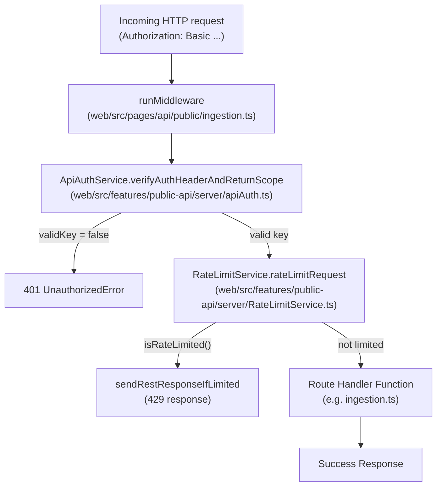
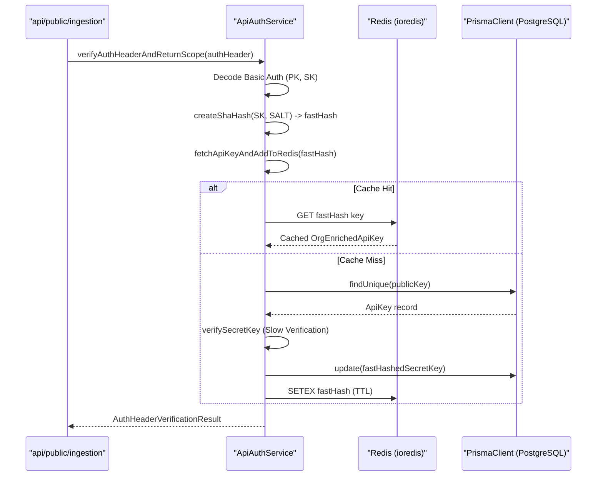
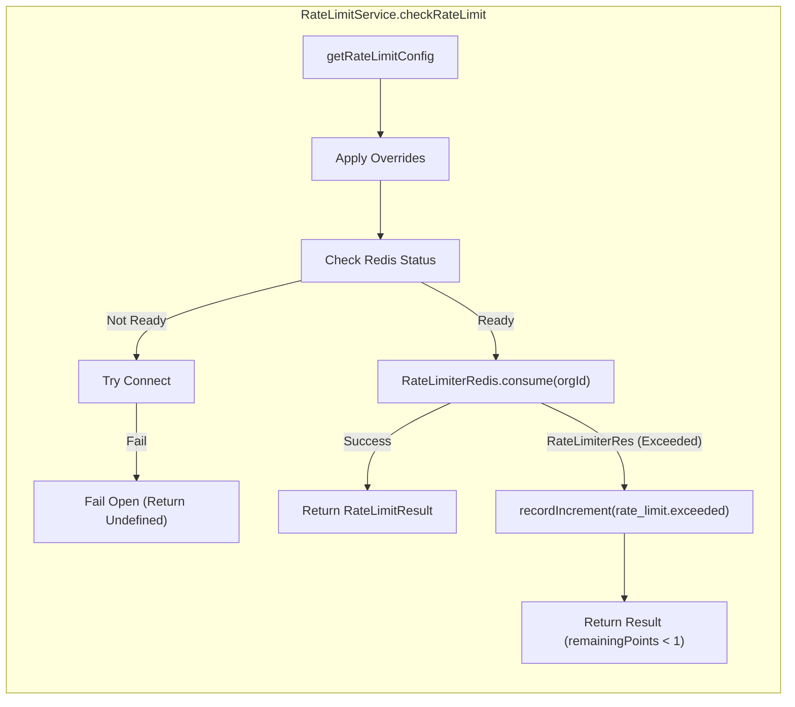
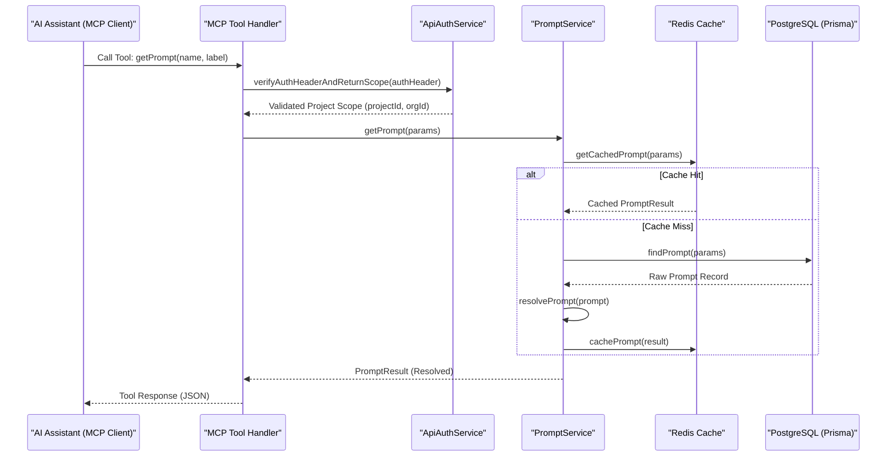
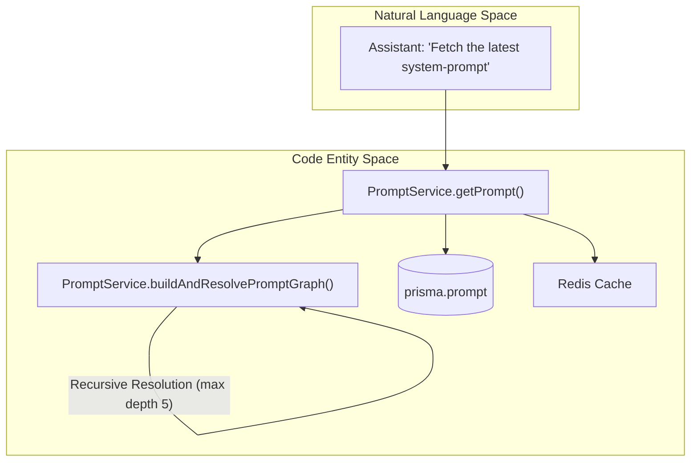
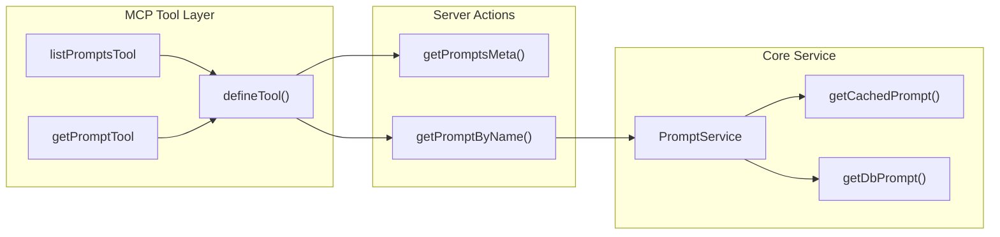

This page explains how incoming public REST API requests are authenticated, how the `ApiAuthService` resolves and caches credentials, and how rate limiting is applied per project scope using Redis. It covers the runtime enforcement layer that sits at the boundary of every `POST /api/public/*` and `GET /api/public/*` endpoint.

- For how API keys are created, hashed, and stored in the database, see [4.3]().
- For the full public REST API surface, see [5.1]().
- For tRPC internal authentication (session-based), see [4.1]().
- For RBAC enforced after authentication, see [4.4]().

---

## Overview

Every public REST API request goes through a multi-stage gate. The ingestion endpoint, for example, validates permissions, rate limits, and request structure before dispatching events to the processing pipeline [web/src/pages/api/public/ingestion.ts:34-49]().

1.  **CORS & Method Validation**: Handled by `runMiddleware` with `cors` and basic method checks [web/src/pages/api/public/ingestion.ts:55-73]().
2.  **Authentication**: The `ApiAuthService` decodes the `Authorization` header, resolves the API key against PostgreSQL (with a Redis cache layer), and produces an `AuthHeaderVerificationResult` [web/src/features/public-api/server/apiAuth.ts:86-198]().
3.  **Rate Limiting**: The `RateLimitService` checks the resolved scope against configurable limits (based on the organization's plan or custom overrides) before the request is processed [web/src/features/public-api/server/RateLimitService.ts:63-82]().

**Request lifecycle diagram for Public API**

Sources: [web/src/pages/api/public/ingestion.ts:50-139](), [web/src/features/public-api/server/apiAuth.ts:86-198](), [web/src/features/public-api/server/RateLimitService.ts:63-82]()

---

## Authentication Methods

The Langfuse Public API supports multiple authentication mechanisms depending on the environment and the required access level.

### Basic Authentication
Primarily used for full project/org access. The client base64-encodes `publicKey:secretKey` and sends it as `Authorization: Basic <encoded>` [web/src/features/public-api/server/apiAuth.ts:102-104]().

| Field | Value |
|---|---|
| Username | Langfuse **Public Key** (prefix `pk-lf-...`) |
| Password | Langfuse **Secret Key** (prefix `sk-lf-...`) |

### Bearer Authentication (Public Key)
Used for limited public access (e.g., scoring or prompt fetching from client-side environments) using only the public key [web/src/features/public-api/server/apiAuth.ts:200-201]().

Sources: [web/src/features/public-api/server/apiAuth.ts:102-201](), [web/src/__tests__/server/prompts.v2.servertest.ts:134-139]()

---

## ApiAuthService

`ApiAuthService` (at `web/src/features/public-api/server/apiAuth.ts`) is the central class for verifying credentials.

### Credential Resolution Flow

The service uses a "fast-hash" strategy. It first checks for a SHA-256 hash of the secret key in Redis/PostgreSQL. If not found, it performs a "slow" verification against the legacy `bcrypt` hashed key and then upgrades the record to include the `fastHashedSecretKey` for future requests [web/src/features/public-api/server/apiAuth.ts:107-161]().

Sources: [web/src/features/public-api/server/apiAuth.ts:86-161](), [web/src/features/public-api/server/apiAuth.ts:107-112]()

### API Key Caching & Invalidation

Redis caching is used to avoid expensive database lookups on every API call.
- **Invalidation**: Methods like `invalidateCachedOrgApiKeys` and `invalidateCachedProjectApiKeys` purge keys from Redis when projects move, plans change, or keys are deleted [web/src/features/public-api/server/apiAuth.ts:41-51]().
- **Deletion**: When an API key is deleted via `deleteApiKey`, it is removed from the database and invalidated in Redis for consistency [web/src/features/public-api/server/apiAuth.ts:59-84]().

---

## Rate Limiting with Redis

`RateLimitService` (at `web/src/features/public-api/server/RateLimitService.ts`) implements rate limiting using the `rate-limiter-flexible` library backed by Redis [web/src/features/public-api/server/RateLimitService.ts:3-33]().

### Strategy & Configuration

Limits are applied per **Organization ID** for specific **Resources**. The system distinguishes between different operation types via the `RateLimitResource` enum.

| Resource Type | Description |
|---|---|
| `ingestion` | Main event ingestion endpoint (`/api/public/ingestion`) [web/src/pages/api/public/ingestion.ts:106](). |
| `public-api` | General GET/POST CRUD operations on traces, scores, etc. |

### Plan-Based Limits

Limits are determined by the organization's plan (e.g., `cloud:hobby`, `cloud:pro`, `oss`).
- **Cloud**: Rate limits are strictly enforced using Redis if the `NEXT_PUBLIC_LANGFUSE_CLOUD_REGION` is set [web/src/features/public-api/server/RateLimitService.ts:68-70]().
- **Self-Hosted/OSS**: Rate limiting is disabled by default (`fail open`) or if Redis is unavailable [web/src/features/public-api/server/RateLimitService.ts:68-79]().
- **Overrides**: The `ApiAccessScope` can contain `rateLimitOverrides` which take precedence over plan defaults [web/src/features/public-api/server/apiAuth.ts:191]().

### Fail-Open Design

The service is designed to be resilient. If Redis is down or a connection fails, the system logs an error and allows the request to proceed [web/src/features/public-api/server/RateLimitService.ts:143-147]().

Sources: [web/src/features/public-api/server/RateLimitService.ts:84-159](), [web/src/features/public-api/server/apiAuth.ts:191]()

---

## Implementation Details

### Error Handling

The ingestion handler and `withMiddlewares` wrapper provide unified error formatting for the Public API:
- **BaseError**: Returns mapped HTTP codes for known internal errors [web/src/pages/api/public/ingestion.ts:146-151]().
- **UnauthorizedError**: Thrown if the API key is invalid or missing `projectId` [web/src/pages/api/public/ingestion.ts:81-88]().
- **ZodError**: Returns `400 Bad Request` with validation details if the request body is incorrect [web/src/pages/api/public/ingestion.ts:159-165]().
- **ClickHouseResourceError**: Returns `422 Unprocessable Content` if analytical query limits are hit [web/src/features/public-api/server/withMiddlewares.ts:125-138]().

### tRPC Authentication Middleware

tRPC uses a different stack for authentication, primarily relying on `getServerAuthSession` to resolve `next-auth` sessions [web/src/server/api/trpc.ts:57-61](). It includes global error handling that masks 5xx errors in cloud environments to prevent leaking internal details [web/src/server/api/trpc.ts:174-187]().

### Observability & Instrumentation

Authentication and Redis operations are instrumented using OpenTelemetry.
- **ioredisRequestHook**: Redacts credentials from `AUTH` and `HELLO` commands and masks API key values in Redis traces [packages/shared/src/server/instrumentation/index.ts:16-35]().
- **addUserToSpan**: Enriches telemetry spans with `userId`, `projectId`, `orgId`, and `plan` during the authentication phase [packages/shared/src/server/instrumentation/index.ts:190-243]().
- **instrumentAsync**: Wraps authentication logic in `api-auth-verify` spans [web/src/features/public-api/server/apiAuth.ts:89-91]().

---

## Environment Variable Summary

| Variable | Description |
|---|---|
| `SALT` | Used for SHA-256 hashing of API secret keys [web/src/features/public-api/server/apiAuth.ts:106](). |
| `LANGFUSE_RATE_LIMITS_ENABLED` | Global toggle for the RateLimitService [web/src/features/public-api/server/RateLimitService.ts:72](). |
| `NEXT_PUBLIC_LANGFUSE_CLOUD_REGION` | Enables cloud-specific behaviors like strict rate limiting [web/src/features/public-api/server/RateLimitService.ts:68](). |

Sources: [web/src/features/public-api/server/apiAuth.ts:106](), [web/src/features/public-api/server/RateLimitService.ts:68-72](), [packages/shared/src/server/instrumentation/index.ts:16-35]()

# MCP Server

The Langfuse MCP (Model Context Protocol) Server enables AI assistants (such as Claude Desktop, Claude Code, or Cursor) to interact directly with Langfuse resources. It provides a standardized interface for LLMs to fetch prompts, manage versions, and understand the context of managed templates within a Langfuse project.

## Overview

The MCP implementation in Langfuse follows a **stateless per-request architecture** integrated into the Next.js web application layer. It exposes specific "tools" that allow an AI agent to query and manage the Langfuse Prompt Management system.

### Key Characteristics
- **Stateless Architecture**: Each MCP request creates a fresh server instance. Authentication context is captured in handler closures, and no state is maintained between requests [web/src/features/mcp/README.md:94-106]().
- **Tool-Based Interface**: Functionality is exposed as discrete tools with metadata hints like `readOnly` or `destructive` to help clients manage user permissions [web/src/features/mcp/README.md:47-56](), [web/src/features/mcp/README.md:137-148]().
- **Unified Authentication**: Uses the same `ApiAuthService` as the Public REST API, requiring project-scoped API keys (Public Key + Secret Key) [web/src/features/mcp/README.md:107-123]().

## Architecture & Data Flow

The MCP server acts as a bridge between the Model Context Protocol and the internal `PromptService`. When an AI assistant requests a prompt, the flow transitions from the protocol layer to the database/cache layer.

### Request Flow Diagram

Title: MCP Tool Execution Flow

**Sources:** [packages/shared/src/server/services/PromptService/index.ts:47-80](), [web/src/pages/api/public/prompts.ts:31-45](), [web/src/features/mcp/README.md:109-123]().

## Prompt Management Tools

The MCP server provides 6 primary tools for prompt management. These tools leverage the `PromptService` and server actions to handle complex logic like prompt nesting and metadata filtering.

### Available Tools

| Tool Name | Type | Description |
| :--- | :--- | :--- |
| `getPrompt` | Read | Fetches a specific prompt by name and label/version. Recursively resolves all dependency tags [web/src/features/mcp/README.md:49-50](), [web/src/features/mcp/README.md:62-69](). |
| `getPromptUnresolved` | Read | Fetches a prompt WITHOUT resolving dependencies. Returns raw content with `@@@langfusePrompt:...@@@` tags intact [web/src/features/mcp/README.md:51-52](), [web/src/features/mcp/README.md:72-80](). |
| `listPrompts` | Read | Lists and filters prompts in the project by name, label, tag, or `updatedAt` range with pagination [web/src/features/mcp/features/prompts/tools/listPrompts.ts:74-87](). |
| `createTextPrompt` | Write | Creates a new text prompt version [web/src/features/mcp/README.md:52](). |
| `createChatPrompt` | Write | Creates a new chat prompt version (OpenAI-style messages) [web/src/features/mcp/README.md:53](). |
| `updatePromptLabels` | Write | Adds or moves labels across prompt versions [web/src/features/mcp/README.md:54](). |

### Prompt Resolution Logic
The `PromptService` handles the resolution of prompts. If a prompt contains dependencies (nested prompts via tags), the service builds a `PromptGraph` and resolves it up to a maximum depth of 5 [packages/shared/src/server/services/PromptService/index.ts:18-20](), [packages/shared/src/server/services/PromptService/index.ts:242-251]().

Title: Natural Language to Prompt Resolution

**Sources:** [packages/shared/src/server/services/PromptService/index.ts:18-20](), [packages/shared/src/server/services/PromptService/index.ts:130-145](), [packages/shared/src/server/services/PromptService/index.ts:234-249]().

## Authentication & Authorization

MCP requests are authenticated via the `ApiAuthService`. The server expects standard Langfuse API credentials (Public Key and Secret Key) provided via Basic Authentication in the HTTP header [web/src/features/mcp/README.md:157-169]().

1.  **Header Verification**: The server validates the `Authorization: Basic {base64}` header [web/src/features/mcp/README.md:36-38]().
2.  **Scope Validation**: It ensures the API key has `project` level scope. Organization-level keys are not supported for MCP [web/src/features/mcp/README.md:15-18](), [web/src/pages/api/public/prompts.ts:37-44]().
3.  **Context Injection**: Authenticated metadata (projectId, orgId, apiKeyId) is injected into a `ServerContext` which is passed to tool handlers [web/src/features/mcp/README.md:125-134]().
4.  **Audit Logging**: All destructive write operations (create, update, delete) automatically create audit log entries with before/after snapshots using `auditLog` [web/src/features/prompts/server/handlers/promptNameHandler.ts:88-99](), [web/src/features/mcp/README.md:149-152](), [web/src/features/prompts/server/handlers/promptVersionHandler.ts:34-42]().

**Sources:** [web/src/pages/api/public/prompts.ts:31-44](), [web/src/features/mcp/README.md:107-134](), [web/src/features/prompts/server/handlers/promptNameHandler.ts:88-99](), [web/src/features/prompts/server/handlers/promptVersionHandler.ts:34-42]().

## Implementation Details

### PromptService Caching
To ensure high performance for MCP tool calls, the `PromptService` implements a two-tier caching strategy:
- **Redis Cache**: Resolved prompts are stored in Redis with a TTL defined by `LANGFUSE_CACHE_PROMPT_TTL_SECONDS` [packages/shared/src/server/services/PromptService/index.ts:40-45]().
- **Epoch-based Invalidation**: When a prompt is updated or deleted, the service rotates a project-specific "epoch" token in Redis via `invalidateCache`. This moves all subsequent reads to a fresh namespace, effectively invalidating the cache for that project [packages/shared/src/server/services/PromptService/index.ts:177-190](), [web/src/features/prompts/server/actions/deletePrompt.ts:125-127](), [web/src/features/prompts/server/actions/updatePrompts.ts:138]().

### Tool Definition
Tools are defined using `defineTool`, which pairs a name and description with Zod-based input schemas and an async handler [web/src/features/mcp/features/prompts/tools/listPrompts.ts:74-90](). Read-only tools for prompts use standard retrieval logic via `getPromptByName` [web/src/features/prompts/server/actions/getPromptByName.ts:21-29]().

Title: MCP Tool to Code Entity Bridge

**Sources:** [packages/shared/src/server/services/PromptService/index.ts:147-175](), [web/src/features/mcp/features/prompts/tools/listPrompts.ts:74-132](), [web/src/features/prompts/server/actions/getPromptByName.ts:21-29](), [web/src/features/prompts/server/actions/updatePrompts.ts:22-25]().