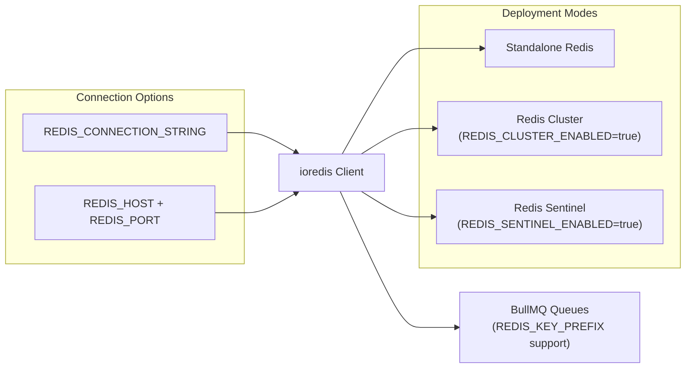
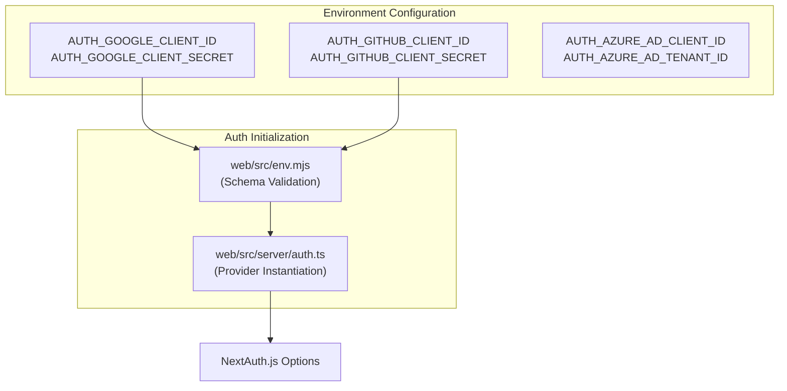

pnpm run db:migrate
```

**Sources:** [package.json:18-19](), [packages/shared/package.json:58-64]()

### ClickHouse Migrations
ClickHouse schema management is handled using a dedicated migration CLI and initialization scripts located in the shared package [packages/shared/package.json:67-71]().

**Database Initialization Sequence**

```mermaid
graph LR
    subgraph "Postgres_Path"
        PrismaSchema["packages/shared/prisma/schema.prisma"]
        PrismaClient["@prisma/client"]
    end

    subgraph "ClickHouse_Path"
        CHScripts["packages/shared/clickhouse/scripts/"]
        CHMigrateCLI["migrate (golang-migrate)"]
    end

    Root_DX["'pnpm run dx'"] -- "triggers" --> DB_Gen["'turbo run db:generate'"] [package.json:18-18]
    DB_Gen -- "reads" --> PrismaSchema
    DB_Gen -- "emits" --> PrismaClient [packages/shared/package.json:64-64]
    
    Root_DX -- "executes" --> CHMigrateCLI [web/Dockerfile:151-151]
    CHMigrateCLI -- "applies" --> CHScripts [packages/shared/package.json:67-71]
```

**Sources:** [package.json:18-25](), [packages/shared/package.json:58-74](), [web/Dockerfile:151-151]()

## Streamlined Onboarding: The `dx` Command

For a "one-command" setup, Langfuse provides the `dx` script. This script performs a full reset and bootstrap of the environment, including seeding example data [package.json:23-23]().

```bash
pnpm run dx
```

**Sequence of operations performed by `dx`:**
1.  `pnpm i`: Install dependencies [package.json:23-23]().
2.  `infra:dev:prune`: Clean existing infrastructure [package.json:17-17]().
3.  `infra:dev:up`: Start fresh containers [package.json:15-15]().
4.  `db:reset`: Reset and migrate PostgreSQL [packages/shared/package.json:60-60]().
5.  `ch:reset`: Reset and migrate ClickHouse [packages/shared/package.json:71-71]().
6.  `db:seed:examples`: Seed the database with example traces and data [package.json:21-21]().
7.  `pnpm run dev`: Start the development servers for `web` and `worker` [package.json:31-31]().

**Sources:** [package.json:23-25](), [packages/shared/package.json:60-71]()

# Environment Configuration


## Purpose and Scope

This document describes the environment variable configuration system used to configure Langfuse services. It covers how environment variables are validated, loaded, and used across the web and worker applications. The system ensures that both the Next.js web service and the Express-based worker service have access to consistent infrastructure configuration while maintaining service-specific tuning parameters.

---

## Configuration Architecture

### Validation System

Langfuse uses [t3-oss/env-nextjs](https://github.com/t3-oss/env-nextjs) for the web service and Zod schemas for the worker and shared packages to validate environment variables at startup. This prevents runtime errors caused by missing or malformed configuration.

**Environment Validation Flow**

```mermaid
graph TB
    ["process.env / .env file"] --> WebEnv["web/src/env.mjs<br/>createEnv()"]
    ["process.env / .env file"] --> WorkerEnv["worker/src/env.ts<br/>EnvSchema.parse()"]
    ["process.env / .env file"] --> SharedEnv["packages/shared/src/env.ts<br/>EnvSchema.parse()"]
    
    subgraph "Web Service"
        WebEnv --> WebValidation["Zod Schema Validation<br/>(Server + Client)"]
        WebValidation -->|Valid| WebApp["Next.js Application"]
    end
    
    subgraph "Worker Service"
        WorkerEnv --> WorkerValidation["Zod Schema Validation"]
        WorkerValidation -->|Valid| WorkerApp["Express Application"]
    end
    
    subgraph "Shared Package"
        SharedEnv --> SharedValidation["Zod Schema Validation"]
        SharedValidation -->|Valid| SharedExports["Exported env object"]
    end
    
    WebValidation -->|Invalid| Error["Startup Error<br/>Descriptive validation message"]
    WorkerValidation -->|Invalid| Error
    SharedValidation -->|Invalid| Error
    
    SharedExports --> WebApp
    SharedExports --> WorkerApp
```

**Sources:** [web/src/env.mjs:40-45](), [worker/src/env.ts:4-222](), [packages/shared/src/env.ts:4-346]()

### Configuration Files

| File | Purpose | Validation Library |
|------|---------|-------------------|
| `web/src/env.mjs` | Web-specific configuration (Auth providers, UI flags, Public API) | `@t3-oss/env-nextjs` [web/src/env.mjs:2-40]() |
| `worker/src/env.ts` | Worker-specific configuration (Queue concurrency, Batch limits) | `zod` [worker/src/env.ts:4-222]() |
| `packages/shared/src/env.ts` | Shared infra (PostgreSQL, ClickHouse, Redis, S3, Queues) | `zod` [packages/shared/src/env.ts:4-346]() |
| `.env.prod.example` | Production reference template | N/A |

**Docker Build Skip Validation:** Both web and worker environments skip validation when `DOCKER_BUILD=1` is set [web/src/env.mjs:800](), [worker/src/env.ts:428](), allowing the container to be built without all runtime secrets present.

**Sources:** [web/src/env.mjs:1-800](), [worker/src/env.ts:1-431](), [packages/shared/src/env.ts:1-346]()

---

## Core Infrastructure Configuration

### Database Configuration

**PostgreSQL (Metadata Store)**

Langfuse uses Prisma as its ORM for PostgreSQL. The `DATABASE_URL` is used for general application queries, while `DIRECT_URL` is recommended for migrations if a connection pooler like PgBouncer is used.

| Variable | Required | Default | Description |
|----------|----------|---------|-------------|
| `DATABASE_URL` | Yes | - | PostgreSQL connection string [web/src/env.mjs:46]() |
| `DIRECT_URL` | No | `DATABASE_URL` | Direct connection for migrations [.env.prod.example:10]() |
| `LANGFUSE_AUTO_POSTGRES_MIGRATION_DISABLED` | No | `false` | Disable automatic migrations on container start [.env.prod.example:13]() |

**ClickHouse (Analytics & Events)**

ClickHouse stores high-volume event data. The configuration supports cluster mode and asynchronous inserts for performance.

| Variable | Required | Default | Description |
|----------|----------|---------|-------------|
| `CLICKHOUSE_URL` | Yes | - | ClickHouse HTTP endpoint [packages/shared/src/env.ts:74]() |
| `CLICKHOUSE_USER` | Yes | - | ClickHouse username [packages/shared/src/env.ts:79]() |
| `CLICKHOUSE_PASSWORD` | Yes | - | ClickHouse password [packages/shared/src/env.ts:80]() |
| `CLICKHOUSE_CLUSTER_ENABLED` | No | `true` | Enable cluster mode [worker/src/env.ts:103]() |
| `CLICKHOUSE_ASYNC_INSERT_BUSY_TIMEOUT_MS` | No | - | Timeout for async inserts [packages/shared/src/env.ts:85]() |
| `CLICKHOUSE_USE_LIGHTWEIGHT_UPDATE` | No | `false` | Use lightweight updates for deletions [packages/shared/src/env.ts:94]() |

**Sources:** [packages/shared/src/env.ts:74-97](), [worker/src/env.ts:98-103]()

### Redis Configuration

Redis is critical for BullMQ queues and distributed caching. Langfuse supports Standalone, Cluster, and Sentinel modes.



| Variable | Default | Description |
|----------|---------|-------------|
| `REDIS_CONNECTION_STRING` | - | Full connection URL (takes precedence) [packages/shared/src/env.ts:22]() |
| `REDIS_HOST` | - | Redis host [packages/shared/src/env.ts:13]() |
| `REDIS_KEY_PREFIX` | - | Prefix for multi-tenant Redis isolation [packages/shared/src/env.ts:25]() |
| `REDIS_TLS_ENABLED` | `false` | Enable TLS [packages/shared/src/env.ts:26]() |
| `REDIS_CLUSTER_ENABLED` | `false` | Enable Cluster mode [packages/shared/src/env.ts:39]() |
| `REDIS_SENTINEL_ENABLED` | `false` | Enable Sentinel mode [packages/shared/src/env.ts:46]() |

**Sources:** [packages/shared/src/env.ts:13-50](), [.env.dev.example:113-124]()

### S3 and Blob Storage

Langfuse uses S3-compatible storage for three distinct purposes: ingestion events, multimodal media, and batch exports.

| Feature | Bucket Variable | Prefix Variable |
|---------|-----------------|-----------------|
| **Events** | `LANGFUSE_S3_EVENT_UPLOAD_BUCKET` | `LANGFUSE_S3_EVENT_UPLOAD_PREFIX` |
| **Media** | `LANGFUSE_S3_MEDIA_UPLOAD_BUCKET` | `LANGFUSE_S3_MEDIA_UPLOAD_PREFIX` |
| **Exports** | `LANGFUSE_S3_BATCH_EXPORT_BUCKET` | `LANGFUSE_S3_BATCH_EXPORT_PREFIX` |

**Common S3 Settings:**
- `LANGFUSE_S3_*_ENDPOINT`: Custom endpoint for MinIO/S3-compatible services [worker/src/env.ts:46]().
- `LANGFUSE_S3_*_FORCE_PATH_STYLE`: Required for MinIO [worker/src/env.ts:49]().
- `LANGFUSE_S3_*_SSE`: Server-side encryption (`AES256` or `aws:kms`) [worker/src/env.ts:52]().

**Sources:** [worker/src/env.ts:27-53](), [packages/shared/src/env.ts:152-186]()

---

## Authentication Configuration

### Static OAuth Providers

Langfuse integrates with NextAuth.js to support various identity providers. These are configured via environment variables and loaded into the `staticProviders` array in the web service [web/src/server/auth.ts:89-160]().



| Provider | Key Variables |
|----------|---------------|
| **Google** | `AUTH_GOOGLE_CLIENT_ID`, `AUTH_GOOGLE_CLIENT_SECRET` [web/src/env.mjs:113-114]() |
| **GitHub** | `AUTH_GITHUB_CLIENT_ID`, `AUTH_GITHUB_CLIENT_SECRET` [web/src/env.mjs:120-121]() |
| **Azure AD** | `AUTH_AZURE_AD_CLIENT_ID`, `AUTH_AZURE_AD_TENANT_ID` [web/src/env.mjs:141-143]() |
| **Okta** | `AUTH_OKTA_CLIENT_ID`, `AUTH_OKTA_ISSUER` [web/src/env.mjs:148-150]() |
| **Custom OIDC** | `AUTH_CUSTOM_CLIENT_ID`, `AUTH_CUSTOM_ISSUER`, `AUTH_CUSTOM_NAME` [web/src/env.mjs:199-202]() |

**Global Auth Variables:**
- `NEXTAUTH_SECRET`: Secret for signing session cookies [web/src/env.mjs:49]().
- `SALT`: Used for hashing API keys [web/src/env.mjs:70]().
- `ENCRYPTION_KEY`: 256-bit key for sensitive data [packages/shared/src/env.ts:51]().
- `AUTH_DISABLE_SIGNUP`: Disables new user registration [web/src/env.mjs:228]().

**Sources:** [web/src/env.mjs:94-230](), [web/src/server/auth.ts:89-523]()

---

## Service Tuning (Worker)

The worker service is tuned via concurrency and batching parameters to handle different workloads.

### Queue Concurrency

Workers are registered in the `WorkerManager` with specific concurrency limits [worker/src/app.ts:125-200]().

| Variable | Default | Description |
|----------|---------|-------------|
| `LANGFUSE_INGESTION_QUEUE_PROCESSING_CONCURRENCY` | `20` | Standard ingestion jobs [worker/src/env.ts:74]() |
| `LANGFUSE_TRACE_UPSERT_WORKER_CONCURRENCY` | `25` | Trace metadata updates [worker/src/env.ts:112]() |
| `LANGFUSE_EVAL_EXECUTION_WORKER_CONCURRENCY` | `5` | LLM-as-a-judge execution [worker/src/env.ts:120]() |
| `LANGFUSE_OTEL_INGESTION_QUEUE_PROCESSING_CONCURRENCY` | `5` | OTel span processing [worker/src/env.ts:70]() |

### ClickHouse Write Performance

The worker optimizes high-volume writes to ClickHouse through configurable batch sizes and intervals.

| Variable | Default | Description |
|----------|---------|-------------|
| `LANGFUSE_INGESTION_CLICKHOUSE_WRITE_BATCH_SIZE` | `1000` | Records per batch [worker/src/env.ts:83]() |
| `LANGFUSE_INGESTION_CLICKHOUSE_WRITE_INTERVAL_MS` | `1000` | Flush interval [worker/src/env.ts:87]() |
| `LANGFUSE_INGESTION_CLICKHOUSE_MAX_ATTEMPTS` | `3` | Retries for transient errors [worker/src/env.ts:91]() |

**Sources:** [worker/src/env.ts:70-134](), [worker/src/app.ts:125-200]()

---

## Feature Flags and Operational Controls

| Variable | Default | Description |
|----------|---------|-------------|
| `LANGFUSE_ENABLE_EXPERIMENTAL_FEATURES` | `false` | Enables unreleased UI/API features [web/src/env.mjs:69]() |
| `LANGFUSE_ENABLE_BACKGROUND_MIGRATIONS` | `true` | Allows ClickHouse schema updates in background [worker/src/env.ts:155]() |
| `LANGFUSE_ENABLE_REDIS_SEEN_EVENT_CACHE` | `false` | Deduplication of ingestion events [worker/src/env.ts:159]() |
| `LANGFUSE_SKIP_INGESTION_CLICKHOUSE_READ_PROJECT_IDS` | `""` | Performance optimization to skip reads during ingestion [worker/src/env.ts:143]() |
| `LANGFUSE_LOG_LEVEL` | `info` | Logging verbosity [packages/shared/src/env.ts:139]() |
| `LANGFUSE_ENABLE_BLOB_STORAGE_FILE_LOG` | `true` | Tracks S3 uploads in ClickHouse `blob_storage_file_log` table [worker/src/env.ts:163]() |

**Sources:** [web/src/env.mjs:69](), [worker/src/env.ts:143-165](), [packages/shared/src/env.ts:139-142]()