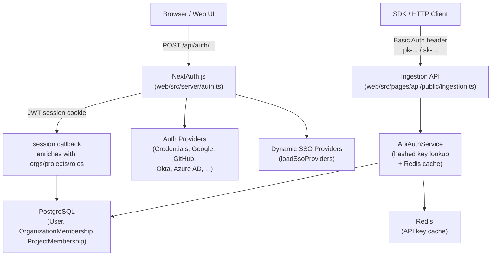
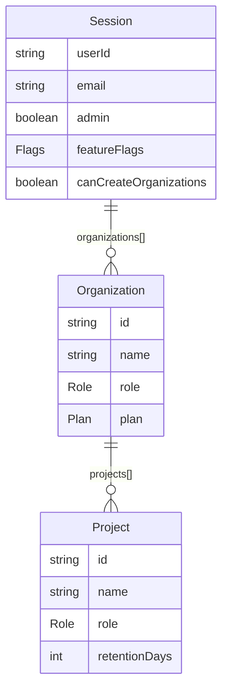
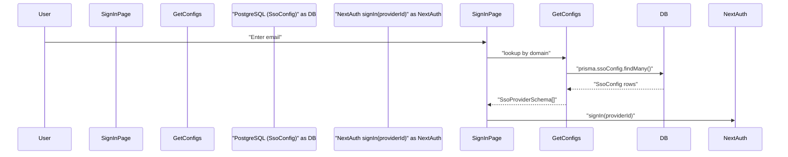
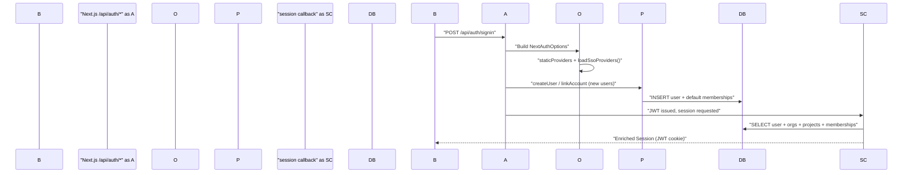
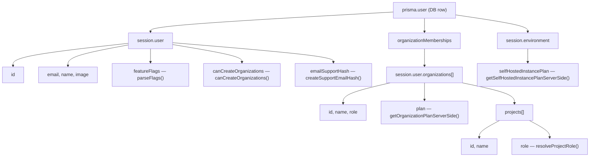

This page provides an overview of how users and API clients are authenticated and how access is controlled throughout the Langfuse platform. It covers the web UI authentication stack built on NextAuth.js, the enterprise multi-tenant SSO system, API key authentication, and the role-based access control (RBAC) model.

For detailed coverage of specific sub-systems, see:
- [Authentication System](#4.1) — Document NextAuth.js configuration, session callback that enriches JWT with user/org/project data, and provider setup.
- [Multi-tenant SSO](#4.2) — Explain domain-based SSO provider detection, SsoConfig table for per-organization OAuth credentials, and credential encryption.
- [API Key Management](#4.3) — Document API key creation, scopes (ORGANIZATION vs PROJECT), hashed secret storage, and verification flow.
- [RBAC & Permissions](#4.4) — Describe the role system (OrganizationMembership, ProjectMembership), role resolution, and scope-based access control.

---

## High-Level Architecture

There are two distinct authentication paths in Langfuse:

1.  **Browser sessions** — users signing into the web UI via NextAuth.js (credentials, OAuth, or SSO).
2.  **API clients** — SDK or HTTP clients authenticating with project-scoped or organization-scoped API keys.

**Authentication paths overview**

Sources: [web/src/server/auth.ts:1-100](), [web/src/ee/features/multi-tenant-sso/utils.ts:102-115](), [web/src/features/projects/server/projectsRouter.ts:173-176]()

---

## Session Authentication (NextAuth.js)

The web application uses [NextAuth.js](https://next-auth.js.org/) with a **JWT session strategy**. The main configuration is assembled in `web/src/server/auth.ts`.

### Session Strategy

Sessions are stored as signed JWTs (`strategy: "jwt"`) with a configurable lifetime via `AUTH_SESSION_MAX_AGE` [web/src/env.mjs:220-220](). The JWT is refreshed periodically, and the session is enriched with application-specific metadata.

### Session Enrichment

Every request that touches a NextAuth session executes the `session` callback, which re-fetches the user from PostgreSQL and attaches:

*   User identity fields (`id`, `name`, `email`, `image`, `admin`) [web/types/next-auth.d.ts:29-35]()
*   Feature flags (`featureFlags`) [web/src/server/auth.ts:152-152]()
*   `canCreateOrganizations` flag (controlled by `LANGFUSE_ALLOWED_ORGANIZATION_CREATORS` allowlist [web/src/server/auth.ts:69-87]())
*   All `organizations` the user belongs to, including nested `projects` with per-project roles [web/types/next-auth.d.ts:40-57]()
*   `environment` metadata (`selfHostedInstancePlan`, `enableExperimentalFeatures`) [web/types/next-auth.d.ts:21-26]()

**Session data shape**

Sources: [web/src/server/auth.ts:69-87](), [web/types/next-auth.d.ts:18-59](), [web/src/env.mjs:78-105]()

---

## Authentication Providers

### Static Providers

Providers are registered in `web/src/server/auth.ts` and are activated at startup if their corresponding environment variables are set in `env.mjs`.

| Provider | Environment Variables Required | Notes |
| :--- | :--- | :--- |
| `CredentialsProvider` | _(always enabled unless `AUTH_DISABLE_USERNAME_PASSWORD=true`)_ | Email + password [web/src/server/auth.ts:89-159]() |
| `EmailProvider` | `SMTP_CONNECTION_URL`, `EMAIL_FROM_ADDRESS` | OTP-based password reset [web/src/server/auth.ts:162-175]() |
| `GoogleProvider` | `AUTH_GOOGLE_CLIENT_ID`, `AUTH_GOOGLE_CLIENT_SECRET` | [web/src/env.mjs:113-114]() |
| `GitHubProvider` | `AUTH_GITHUB_CLIENT_ID`, `AUTH_GITHUB_CLIENT_SECRET` | [web/src/env.mjs:120-121]() |
| `AzureADProvider` | `AUTH_AZURE_AD_CLIENT_ID`, `AUTH_AZURE_AD_TENANT_ID` | [web/src/env.mjs:141-143]() |
| `OktaProvider` | `AUTH_OKTA_CLIENT_ID`, `AUTH_OKTA_ISSUER` | [web/src/env.mjs:148-150]() |
| `AuthentikProvider` | `AUTH_AUTHENTIK_CLIENT_ID`, `AUTH_AUTHENTIK_ISSUER` | [web/src/env.mjs:155-157]() |
| `Auth0Provider` | `AUTH_AUTH0_CLIENT_ID`, `AUTH_AUTH0_ISSUER` | [web/src/env.mjs:176-178]() |
| `CustomSSOProvider` | `AUTH_CUSTOM_CLIENT_ID`, `AUTH_CUSTOM_ISSUER` | Generic OIDC [web/src/server/auth.ts:177-198]() |

Sources: [web/src/server/auth.ts:89-198](), [web/src/env.mjs:113-205](), [packages/shared/src/server/auth/customSsoProvider.ts:15-35]()

### Dynamic (Multi-tenant) SSO Providers

At request time, `loadSsoProviders()` reads `SsoConfig` rows from PostgreSQL and converts them to NextAuth `Provider` instances. This is an Enterprise Edition feature [web/src/ee/features/multi-tenant-sso/utils.ts:102-115]().

### Credentials Flow

The `CredentialsProvider.authorize` function [web/src/server/auth.ts:100-158]() performs:
1.  Checks `AUTH_DISABLE_USERNAME_PASSWORD` flag [web/src/server/auth.ts:102-105]().
2.  Checks if the email domain is in the SSO-blocked-domains list [web/src/server/auth.ts:107-113]().
3.  Calls `getSsoAuthProviderIdForDomain` for enterprise SSO enforcement [web/src/server/auth.ts:116-120]().
4.  Looks up the user in PostgreSQL and verifies the password hash via `verifyPassword` [web/src/server/auth.ts:140-144]().

Sources: [web/src/server/auth.ts:100-158](), [web/src/ee/features/multi-tenant-sso/utils.ts:132-142]()

---

## Multi-tenant SSO (Enterprise Edition)

Multi-tenant SSO allows organizations to configure domain-specific SSO providers stored in the database via the `SsoConfig` table [web/src/ee/features/multi-tenant-sso/utils.ts:51-61]().

**Multi-tenant SSO flow**

Sources: [web/src/ee/features/multi-tenant-sso/utils.ts:38-95](), [web/src/pages/auth/sign-in.tsx:97-182]()

### Key Functions

| Function | File | Description |
| :--- | :--- | :--- |
| `getSsoConfigs()` | [web/src/ee/features/multi-tenant-sso/utils.ts:38-95]() | Fetches and caches `SsoConfig` rows (TTL 1 hour). |
| `loadSsoProviders()` | [web/src/ee/features/multi-tenant-sso/utils.ts:102-115]() | Converts `SsoProviderSchema` objects to NextAuth `Provider` instances. |
| `getSsoAuthProviderIdForDomain()` | [web/src/ee/features/multi-tenant-sso/utils.ts:132-142]() | Returns the provider ID for a given domain to block password login. |

Sources: [web/src/ee/features/multi-tenant-sso/utils.ts](), [web/src/ee/features/multi-tenant-sso/types.ts:228-240]()

---

## API Key Management

SDK and HTTP clients authenticate using project-scoped or organization-scoped API key pairs.

### Authentication Flow

API authentication is handled by the `ApiAuthService`. It validates the `Authorization` header and returns the scope (e.g., `projectId`) associated with the key. Secret verification uses the `SALT` environment variable [web/src/env.mjs:70-75](). API keys are cached in Redis to minimize database lookups [web/src/features/projects/server/projectsRouter.ts:173-176]().

Sources: [web/src/features/projects/server/projectsRouter.ts:173-176](), [web/src/env.mjs:70-75]()

---

## RBAC & Permissions

### Role Hierarchy

The `Role` enum applies at both the organization and project level: `OWNER`, `ADMIN`, `MEMBER`, `VIEWER`, `NONE` [web/src/env.mjs:89-105]().

### Membership Model

-   **`OrganizationMembership`**: Assigns a user an org-level role.
-   **`ProjectMembership`**: Optionally overrides the org role for a specific project [web/types/next-auth.d.ts:55-55]().
-   **Default Access**: New users can be auto-assigned to default organizations and projects via `LANGFUSE_DEFAULT_ORG_ID` and `LANGFUSE_DEFAULT_PROJECT_ID` [web/src/env.mjs:78-105]().

### Enforcement

Langfuse uses a scope-based access control system. Access is checked using utility functions like `throwIfNoProjectAccess` or `throwIfNoOrganizationAccess` [web/src/features/projects/server/projectsRouter.ts:31-35]().

| Scope Example | Description | Roles with Access |
| :--- | :--- | :--- |
| `projects:create` | Create new projects in org | `OWNER`, `ADMIN` [web/src/features/projects/server/projectsRouter.ts:31-35]() |
| `project:update` | Modify project settings | `OWNER`, `ADMIN` [web/src/features/projects/server/projectsRouter.ts:82-86]() |
| `project:delete` | Delete a project | `OWNER`, `ADMIN` [web/src/features/projects/server/projectsRouter.ts:166-170]() |

Sources: [web/src/features/projects/server/projectsRouter.ts:22-224](), [web/types/next-auth.d.ts:40-57]()

---

## Key Environment Variables Summary

| Category | Variable | Description |
| :--- | :--- | :--- |
| NextAuth | `NEXTAUTH_SECRET` | JWT signing secret (required in production) [web/src/env.mjs:49-52]() |
| NextAuth | `NEXTAUTH_URL` | Canonical URL for callback URLs [web/src/env.mjs:54-63]() |
| API Keys | `SALT` | Required for hashing API secret keys [web/src/env.mjs:70-75]() |
| SSO (EE) | `ENCRYPTION_KEY` | Hex key for encrypting SSO client secrets [.env.prod.example:26]() |
| Defaults | `LANGFUSE_DEFAULT_ORG_ID` | Auto-enroll new users into this org [web/src/env.mjs:78-88]() |
| Defaults | `LANGFUSE_DEFAULT_PROJECT_ID` | Auto-enroll new users into this project [web/src/env.mjs:92-105]() |

Sources: [web/src/env.mjs:40-230](), [.env.prod.example:1-180]()

# Authentication System

This page documents the web application's authentication layer: how NextAuth.js is configured, which providers are supported, how the Prisma adapter is extended, and how the session is enriched with organization and project membership data. It also covers the sign-in and sign-up UI pages.

For API key authentication (used by the public REST API), see [API Key Management](#4.3). For multi-tenant SSO configuration management, see [Multi-tenant SSO](#4.2). For role-based access control enforcement, see [RBAC & Permissions](#4.4).

---

## Overview

Authentication is implemented with **NextAuth.js** and is configured entirely in `web/src/server/auth.ts`. The configuration is produced by the async function `getAuthOptions`, which merges a static list of providers with providers loaded dynamically from the database at request time.

Sessions use the **JWT strategy** and are validated against the database on every request to the session callback. The session object is augmented with the user's full organization and project membership tree, making RBAC data available everywhere in the application without additional queries.

**Authentication Flow Summary:**

Title: Authentication Sequence

Sources: [web/src/server/auth.ts:654-660](), [web/src/server/auth.ts:500-633]()

---

## `getAuthOptions` and Provider Loading

`getAuthOptions` is an async factory that is called on each NextAuth route request. It:

1. Calls `loadSsoProviders()` to fetch enterprise SSO providers stored in the database [web/src/ee/features/multi-tenant-sso/utils.ts:102-115]().
2. Concatenates them with the module-level `staticProviders` array [web/src/server/auth.ts:646-648]().
3. Returns the full `NextAuthOptions` object.

**Provider Architecture:**

Title: Provider Resolution Architecture

```mermaid
flowchart TD
    getAuthOptions["getAuthOptions()"] --> staticProviders["staticProviders (module-level array)"]
    getAuthOptions --> loadSsoProviders["loadSsoProviders() — from DB via getSsoConfigs()"]

    staticProviders --> CP["CredentialsProvider (email/password)"]
    staticProviders --> EP["EmailProvider (SMTP password reset)"]
    staticProviders --> GP["GoogleProvider"]
    staticProviders --> GHP["GitHubProvider"]
    staticProviders --> GHEP["GitHubEnterpriseProvider"]
    staticProviders --> GLP["GitLabProvider"]
    staticProviders --> AP["AzureADProvider"]
    staticProviders --> OP["OktaProvider"]
    staticProviders --> A0P["Auth0Provider"]
    staticProviders --> COGP["CognitoProvider"]
    staticProviders --> KP["KeycloakProvider"]
    staticProviders --> AUP["AuthentikProvider"]
    staticProviders --> OLP["OneLoginProvider"]
    staticProviders --> JCP["JumpCloudProvider"]
    staticProviders --> WOP["WorkOSProvider"]
    staticProviders --> WPP["WordPressProvider"]
    staticProviders --> CSSO["CustomSSOProvider"]

    loadSsoProviders --> dbToNextAuthProvider["dbToNextAuthProvider() per SsoConfig row"]
    dbToNextAuthProvider --> dynProv["Dynamic provider — id format: getAuthProviderIdForSsoConfig(provider)"]
```

Sources: [web/src/server/auth.ts:88-648](), [web/src/ee/features/multi-tenant-sso/utils.ts:102-115]()

### Static Providers

All static providers are conditionally added to the `staticProviders` array based on whether the corresponding environment variables are set in `env.mjs`.

| Provider | Env Vars Required | Notes |
|---|---|---|
| `CredentialsProvider` | _(always present)_ | Disabled by `AUTH_DISABLE_USERNAME_PASSWORD=true` [web/src/server/auth.ts:102]() |
| `EmailProvider` | `SMTP_CONNECTION_URL`, `EMAIL_FROM_ADDRESS` | Used for password-reset OTP flow; 3-minute token TTL [web/src/server/auth.ts:163-175]() |
| `GoogleProvider` | `AUTH_GOOGLE_CLIENT_ID`, `AUTH_GOOGLE_CLIENT_SECRET` | Optional domain allowlist via `AUTH_GOOGLE_ALLOWED_DOMAINS` [web/src/env.mjs:113-115]() |
| `GitHubProvider` | `AUTH_GITHUB_CLIENT_ID`, `AUTH_GITHUB_CLIENT_SECRET` | [web/src/env.mjs:120-121]() |
| `GitHubEnterpriseProvider` | `AUTH_GITHUB_ENTERPRISE_CLIENT_ID`, `AUTH_GITHUB_ENTERPRISE_CLIENT_SECRET`, `AUTH_GITHUB_ENTERPRISE_BASE_URL` | [web/src/env.mjs:125-127]() |
| `GitLabProvider` | `AUTH_GITLAB_CLIENT_ID`, `AUTH_GITLAB_CLIENT_SECRET` | Self-hosted via `AUTH_GITLAB_URL` [web/src/env.mjs:133-140]() |
| `AzureADProvider` | `AUTH_AZURE_AD_CLIENT_ID`, `AUTH_AZURE_AD_CLIENT_SECRET`, `AUTH_AZURE_AD_TENANT_ID` | [web/src/env.mjs:141-143]() |
| `OktaProvider` | `AUTH_OKTA_CLIENT_ID`, `AUTH_OKTA_CLIENT_SECRET`, `AUTH_OKTA_ISSUER` | [web/src/env.mjs:148-150]() |
| `Auth0Provider` | `AUTH_AUTH0_CLIENT_ID`, `AUTH_AUTH0_CLIENT_SECRET`, `AUTH_AUTH0_ISSUER` | [web/src/env.mjs:176-178]() |
| `CognitoProvider` | `AUTH_COGNITO_CLIENT_ID`, `AUTH_COGNITO_CLIENT_SECRET`, `AUTH_COGNITO_ISSUER` | [web/src/env.mjs:186-188]() |
| `KeycloakProvider` | `AUTH_KEYCLOAK_CLIENT_ID`, `AUTH_KEYCLOAK_CLIENT_SECRET`, `AUTH_KEYCLOAK_ISSUER` | Custom display name via `AUTH_KEYCLOAK_NAME` [web/src/env.mjs:195-202]() |
| `AuthentikProvider` | `AUTH_AUTHENTIK_CLIENT_ID`, `AUTH_AUTHENTIK_CLIENT_SECRET`, `AUTH_AUTHENTIK_ISSUER` | [web/src/env.mjs:155-163]() |
| `OneLoginProvider` | `AUTH_ONELOGIN_CLIENT_ID`, `AUTH_ONELOGIN_CLIENT_SECRET`, `AUTH_ONELOGIN_ISSUER` | [web/src/env.mjs:169-171]() |
| `JumpCloudProvider` | `AUTH_JUMPCLOUD_CLIENT_ID`, `AUTH_JUMPCLOUD_CLIENT_SECRET`, `AUTH_JUMPCLOUD_ISSUER` | [web/src/env.mjs:223-225]() |
| `WorkOSProvider` | `AUTH_WORKOS_CLIENT_ID`, `AUTH_WORKOS_CLIENT_SECRET` | [web/src/env.mjs:212-213]() |
| `WordPressProvider` | `AUTH_WORDPRESS_CLIENT_ID`, `AUTH_WORDPRESS_CLIENT_SECRET` | [web/src/env.mjs:235-236]() |
| `CustomSSOProvider` | `AUTH_CUSTOM_CLIENT_ID`, `AUTH_CUSTOM_CLIENT_SECRET`, `AUTH_CUSTOM_ISSUER`, `AUTH_CUSTOM_NAME` | [web/src/env.mjs:241-244]() |

Sources: [web/src/server/auth.ts:88-498](), [web/src/env.mjs:113-244]()

### Dynamic SSO Providers

Enterprise multi-tenant SSO providers are stored in the `SsoConfig` Prisma table and loaded at runtime by `loadSsoProviders()` [web/src/ee/features/multi-tenant-sso/utils.ts:102-115](). These are converted to NextAuth `Provider` instances by `dbToNextAuthProvider()` [web/src/ee/features/multi-tenant-sso/utils.ts:195-201](). Their provider IDs are domain-specific to handle multiple organizations using the same provider type.

The SSO config list is cached in memory for 1 hour (or 1 minute on fetch failure) via the module-level `cachedSsoConfigs` variable [web/src/ee/features/multi-tenant-sso/utils.ts:25-95]().

---

## Extended Prisma Adapter

The standard `PrismaAdapter` is wrapped and extended into `extendedPrismaAdapter` at [web/src/server/auth.ts:500-633](). Three methods are overridden:

### `createUser`

Called when a new user signs up via an OAuth provider for the first time.

- Checks `AUTH_DISABLE_SIGNUP` — throws if `true` [web/src/server/auth.ts:510-514]().
- Requires a non-null email on the profile [web/src/server/auth.ts:516]().
- Delegates to the base `prismaAdapter.createUser` [web/src/server/auth.ts:519]().
- Calls `createProjectMembershipsOnSignup(user)` to assign default org/project memberships configured via `LANGFUSE_DEFAULT_ORG_ID` / `LANGFUSE_DEFAULT_PROJECT_ID` [web/src/server/auth.ts:522]().

### `linkAccount`

Called when an existing user links an OAuth account (e.g., first sign-in via SSO on an existing email-only account).

- Strips incompatible fields from Keycloak payloads (`refresh_expires_in`, `not-before-policy`) [web/src/server/auth.ts:543-547]().
- Strips `profile` from WorkOS payloads [web/src/server/auth.ts:548]().
- Strips any fields listed in `AUTH_IGNORE_ACCOUNT_FIELDS` [web/src/server/auth.ts:553-559]().
- Calls `createProjectMembershipsOnSignup` — this is idempotent and ensures SSO users also get default memberships [web/src/server/auth.ts:566]().

### `useVerificationToken`

Used by the `EmailProvider` for OTP-based password reset.

- On success: logs the event and returns the token [web/src/server/auth.ts:586-590]().
- On failure or missing token: deletes all tokens for the identifier (anti-enumeration measure) and returns `null` [web/src/server/auth.ts:592-598]().

Sources: [web/src/server/auth.ts:500-633]()

---

## NextAuth Callbacks

### `session` Callback

**Called on every session access**. This re-fetches the user from the database to expand the stateless JWT into a rich `Session` object.

**Database query fields:**
The query retrieves the user along with their full organization membership hierarchy, including associated projects and project memberships [web/src/server/auth.ts:661-683]().

**Session enrichment diagram:**

Title: Session Object Construction

The project role for each project is computed by `resolveProjectRole()`, which considers both the project-level `ProjectMembership` and the organization-level role [web/src/server/auth.ts:756-764]().

Sources: [web/src/server/auth.ts:656-782](), [web/types/next-auth.d.ts:18-68]()

### `signIn` Callback

**Called on every sign-in attempt**, before the session is created.

Validation steps in order:
1. **Email presence** — throws if `user.email` is missing [web/src/server/auth.ts:786]().
2. **Multi-tenant SSO enforcement** — calls `getSsoAuthProviderIdForDomain(userDomain)`. If a domain-specific SSO provider is configured *and* the user is signing in with a different provider, the sign-in is blocked [web/src/server/auth.ts:805-812]().
3. **Google domain allowlist** — if `AUTH_GOOGLE_ALLOWED_DOMAINS` is set and the provider is `google`, the user's email domain must be in the allowlist [web/src/server/auth.ts:835-847]().

Sources: [web/src/server/auth.ts:783-850]()

---

## Sign-In & Sign-Up UI

### Sign-In Page
**File:** `web/src/pages/auth/sign-in.tsx`

The sign-in page dynamically renders provider buttons based on server-side configuration.

- **`getServerSideProps`**: Builds the `PageProps` object by inspecting environment variables and database configuration (via `isAnySsoConfigured()`) [web/src/pages/auth/sign-in.tsx:97-182]().
- **Two-Step Login Flow**: When `authProviders.sso` is `true`, the sign-in form implements a two-step flow where the email is entered first to detect domain-specific SSO [web/src/pages/auth/sign-in.tsx:187-203]().

### Sign-Up Page
**File:** `web/src/pages/auth/sign-up.tsx`

- Uses the same `getServerSideProps` as the sign-in page [web/src/pages/auth/sign-up.tsx:36]().
- **SSO Detection**: The `handleContinue` function checks for Enterprise SSO via the `/api/auth/check-sso` endpoint. If found, it redirects immediately to the provider [web/src/pages/auth/sign-up.tsx:81-131]().
- **Credential Registration**: If no SSO is found, it reveals the name and password fields to complete registration via the `/api/auth/signup` endpoint [web/src/pages/auth/sign-up.tsx:157-187]().

---

## Password Reset System

Langfuse provides a secure password reset flow for users using the credentials provider.

1. **Request Reset**: Users can request a reset via `RequestResetPasswordEmailButton`. This uses the NextAuth `EmailProvider` to send a 6-digit one-time passcode (OTP) [web/src/features/auth-credentials/components/ResetPasswordButton.tsx:31-57]().
2. **Verification**: The OTP is verified against the database. If valid, the user is redirected to the reset page [web/src/features/auth-credentials/components/ResetPasswordButton.tsx:59-77]().
3. **Password Update**: The `ResetPasswordPage` allows users to set a new password, validated against `passwordSchema` [web/src/features/auth-credentials/components/ResetPasswordPage.tsx:30-39]().

Sources: [web/src/features/auth-credentials/components/ResetPasswordButton.tsx:1-126](), [web/src/features/auth-credentials/components/ResetPasswordPage.tsx:1-107]()

---

## Key Environment Variables

| Variable | Purpose | Default |
|---|---|---|
| `NEXTAUTH_SECRET` | JWT signing secret | Required in production [web/src/env.mjs:49-52]() |
| `NEXTAUTH_URL` | Base URL for NextAuth callbacks | Required [web/src/env.mjs:54-63]() |
| `SALT` | Salt used for hashing API keys | Required [web/src/env.mjs:70-75]() |
| `AUTH_DISABLE_USERNAME_PASSWORD` | Disable credentials provider | `false` [web/src/env.mjs:275]() |
| `AUTH_DISABLE_SIGNUP` | Prevent new user registration | `false` [web/src/env.mjs:276]() |
| `LANGFUSE_DEFAULT_ORG_ID` | Org(s) to auto-add new users to | — [web/src/env.mjs:78-88]() |
| `LANGFUSE_DEFAULT_PROJECT_ID` | Project(s) to auto-add new users to | — [web/src/env.mjs:92-102]() |

Sources: [web/src/env.mjs:49-276](), [.env.prod.example:21-143]()