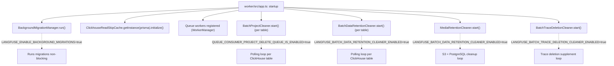
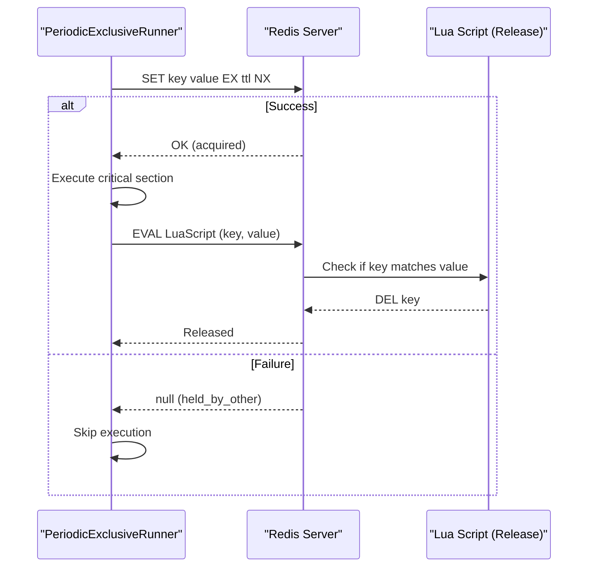
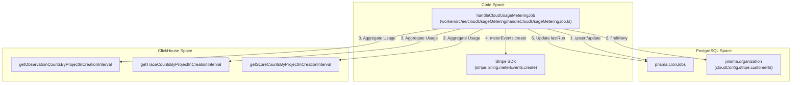
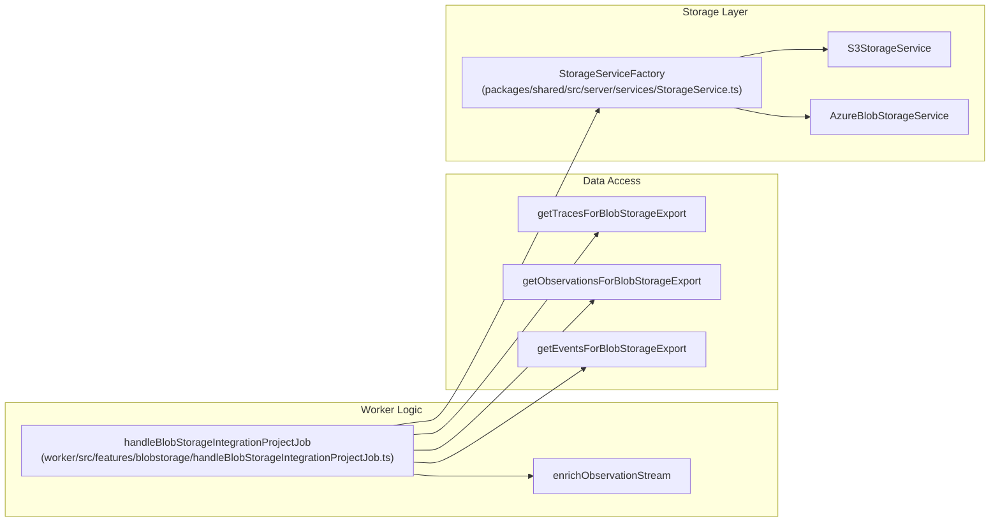
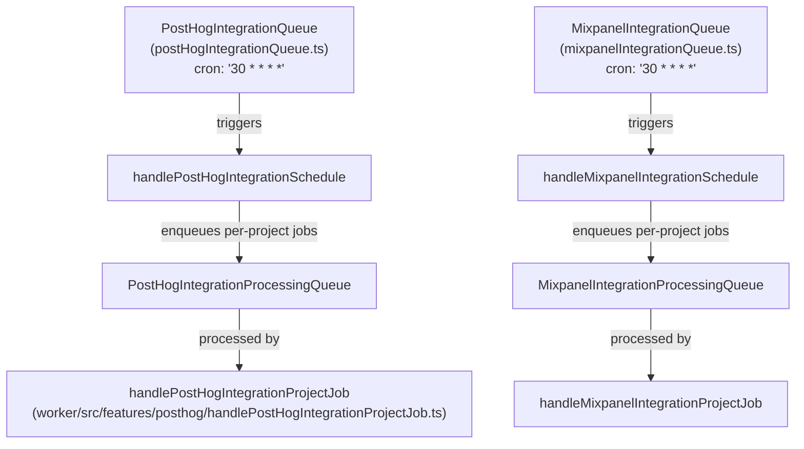
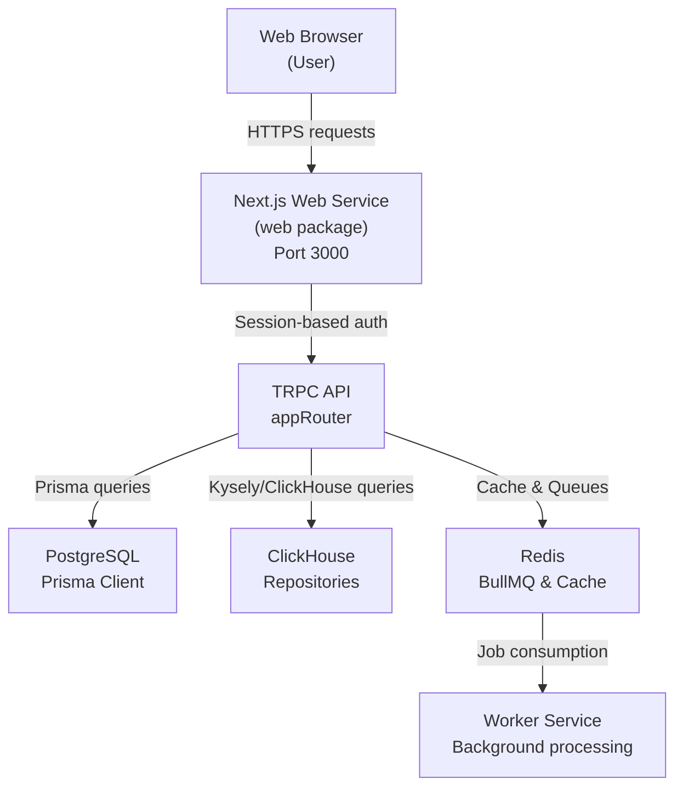
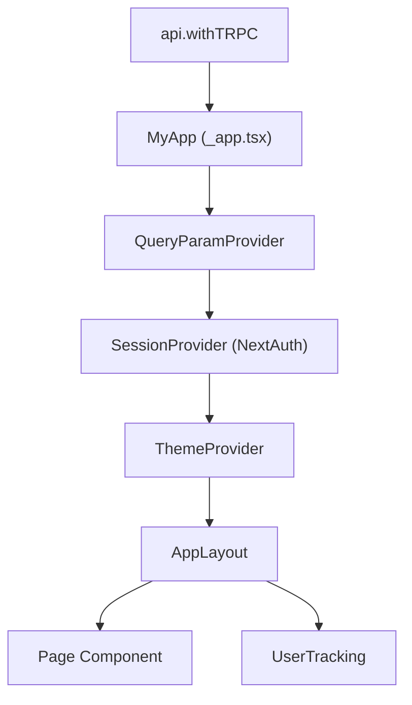
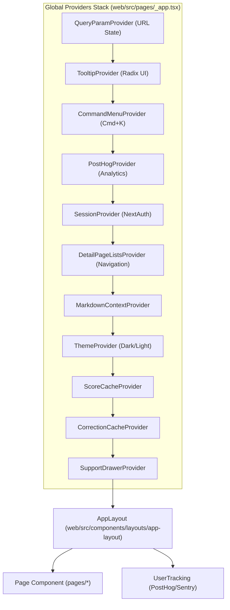
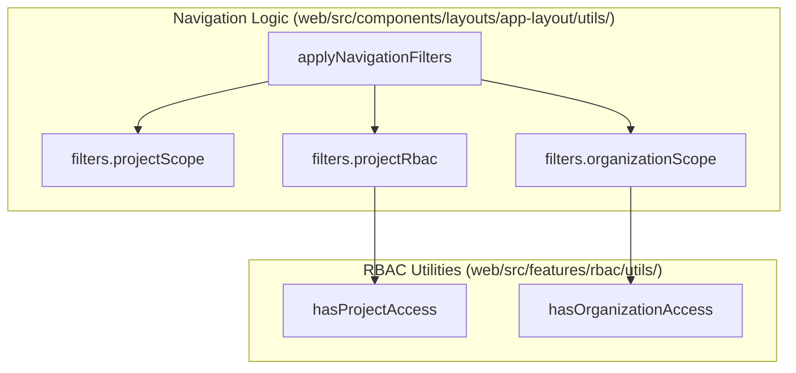
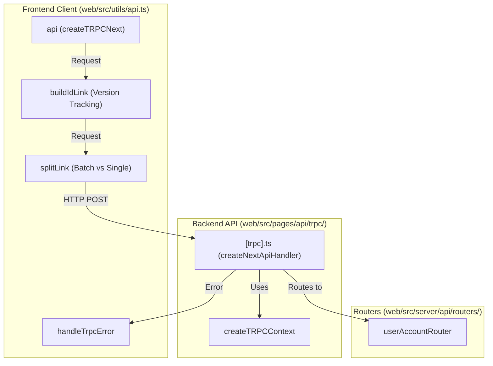

This page documents the background services that start alongside the worker process at application startup. These are long-running, in-process loops and one-time initializations that run independently of the BullMQ queue system. They operate continuously on timers or as one-shot initialization routines.

For **scheduled and repeating BullMQ jobs** (such as the `CloudUsageMeteringJob`), see [Scheduled Jobs](). For the queue workers themselves, see [Queue Architecture]() and [Worker Manager](). For background database migrations specifically, see [Database Migrations]().

---

## Startup Sequence

All background services are started from `worker/src/app.ts` immediately after the Express app is configured and before queue workers are registered. Each service starts unconditionally or behind a feature flag.

**Figure: Worker Startup — Background Service Initialization**



Sources: `[worker/src/app.ts:109-122]`, `[worker/src/app.ts:584-636]`

---

## Background Migration System

### Purpose

The background migration system allows for large-scale data moves or schema updates (particularly between PostgreSQL and ClickHouse) without blocking application startup or queue processing. It is managed by `BackgroundMigrationManager` and controlled by the `LANGFUSE_ENABLE_BACKGROUND_MIGRATIONS` environment variable.

### Implementation

Migrations implement the `IBackgroundMigration` interface, which defines methods for validation, execution, and abortion.

**Figure: Background Migration Entity Mapping**

```mermaid
flowchart LR
    subgraph "Code Entity Space"
        Interface["IBackgroundMigration"]
        Manager["BackgroundMigrationManager"]
        ObsMig["MigrateObservationsFromPostgresToClickhouse"]
        ScoreMig["MigrateScoresFromPostgresToClickhouse"]
        TraceMig["MigrateTracesFromPostgresToClickhouse"]
        CostMig["AddGenerationsCostBackfill"]
    end

    subgraph "Data Space"
        PG_Table[("PostgreSQL: background_migrations")]
        CH_Table[("ClickHouse Tables")]
    end

    Interface <|-- ObsMig
    Interface <|-- ScoreMig
    Interface <|-- TraceMig
    Interface <|-- CostMig

    Manager --> ObsMig
    ObsMig --> PG_Table : "updates 'state' JSON"
    ObsMig --> CH_Table : "INSERT INTO observations"
    ScoreMig --> PG_Table : "persists 'maxDate'"
    ScoreMig --> CH_Table : "INSERT INTO scores"
```

Sources: `[worker/src/backgroundMigrations/IBackgroundMigration.ts:1-8]`, `[worker/src/backgroundMigrations/migrateObservationsFromPostgresToClickhouse.ts:14-16]`, `[worker/src/backgroundMigrations/migrateScoresFromPostgresToClickhouse.ts:14-16]`, `[worker/src/backgroundMigrations/migrateTracesFromPostgresToClickhouse.ts:14-16]`, `[worker/src/backgroundMigrations/addGenerationsCostBackfill.ts:50-51]`

### Key Migration Patterns

1.  **State Persistence**: Migrations store their progress in the `background_migrations` table's `state` column. For example, `MigrateObservationsFromPostgresToClickhouse` uses `updateMaxDate` to store the timestamp of the last processed record, allowing resume-on-restart `[worker/src/backgroundMigrations/migrateObservationsFromPostgresToClickhouse.ts:18-38]`.
2.  **Batching**: Records are fetched in batches (defaulting to 1000) using `Prisma.sql` raw queries to optimize performance and memory usage `[worker/src/backgroundMigrations/migrateScoresFromPostgresToClickhouse.ts:100-108]`.
3.  **Validation**: Before running, migrations verify prerequisites. `MigrateScoresFromPostgresToClickhouse` checks for ClickHouse credentials and the existence of the destination table `[worker/src/backgroundMigrations/migrateScoresFromPostgresToClickhouse.ts:18-59]`.
4.  **Cost Backfilling**: `AddGenerationsCostBackfill` performs complex calculations in PostgreSQL to update `calculated_input_cost` and `calculated_output_cost` based on model prices and token counts `[worker/src/backgroundMigrations/addGenerationsCostBackfill.ts:121-151]`.

---

## ClickhouseReadSkipCache

### Purpose

`ClickhouseReadSkipCache` is an optimization for the ingestion pipeline. During event ingestion, the system normally reads from ClickHouse to merge updates. For newer projects where data is exclusively handled via the S3-staging path, these reads are unnecessary. This cache tracks which project IDs can safely skip the read operation.

### Configuration

The cache is initialized at startup and considers:
-   **Static IDs**: Provided via `LANGFUSE_SKIP_INGESTION_CLICKHOUSE_READ_PROJECT_IDS`.
-   **Creation Date**: Projects created after the date in `LANGFUSE_SKIP_INGESTION_CLICKHOUSE_READ_MIN_PROJECT_CREATE_DATE`.

Sources: `[worker/src/app.ts:116-122]`

---

## Batch Cleaner Services

Langfuse employs several "cleaner" services that inherit from `PeriodicExclusiveRunner`. These services use a `RedisLock` to ensure that only one worker instance processes a specific cleanup task at a time.

### MediaRetentionCleaner

Handles the deletion of media files (S3/PostgreSQL) and blob storage entries based on per-project `retention_days`.

-   **Workflow**:
    1.  Queries PostgreSQL to find the project with the most expired media via `getTopProjectWorkload` `[worker/src/features/media-retention-cleaner/index.ts:116-155]`.
    2.  Calculates a `cutoffDate` using `getRetentionCutoffDate` `[worker/src/features/media-retention-cleaner/index.ts:152]`.
    3.  Deletes files from S3 and removes PostgreSQL metadata via `deleteMediaFiles` `[worker/src/features/media-retention-cleaner/index.ts:177-209]`.
    4.  Cleans up blob storage if `LANGFUSE_ENABLE_BLOB_STORAGE_FILE_LOG` is enabled by calling `removeIngestionEventsFromS3AndDeleteClickhouseRefsForProject` `[worker/src/features/media-retention-cleaner/index.ts:164-169]`.

### BatchDataRetentionCleaner

Bulk deletes expired data from ClickHouse tables (`traces`, `observations`, `scores`, `events_full`, `events_core`).

-   **Implementation**:
    -   It uses hashed project IDs (`toParamKey`) in ClickHouse queries to prevent index mismatch bugs and handle `OR` conditions efficiently `[worker/src/features/batch-data-retention-cleaner/index.ts:53-96]`.
    -   It targets specific timestamp columns per table (e.g., `start_time` for `observations`, `timestamp` for `traces`) defined in `TIMESTAMP_COLUMN_MAP` `[worker/src/features/batch-data-retention-cleaner/index.ts:34-40]`.

### BatchProjectCleaner

Handles data deletion for projects that have been soft-deleted (where `deleted_at` is set in PostgreSQL).

-   **Workflow**:
    1.  Fetches deleted projects from PostgreSQL via `getDeletedProjects` `[worker/src/features/batch-project-cleaner/index.ts:93-95]`.
    2.  Checks ClickHouse for existing counts to determine if work is needed `[worker/src/features/batch-project-cleaner/index.ts:107-109]`.
    3.  Executes a `DELETE` command in ClickHouse under a distributed lock `[worker/src/features/batch-project-cleaner/index.ts:133-148]`.

---

## Redis Distributed Locking

The `RedisLock` class provides the coordination mechanism for background services.

**Figure: RedisLock Acquisition Flow**



Sources: `[worker/src/utils/RedisLock.ts:54-60]`, `[worker/src/utils/RedisLock.ts:117-152]`

### Locking Behaviors

-   **Unique Ownership**: Each lock attempt uses a `randomUUID` as the value to ensure a worker only releases a lock it actually owns `[worker/src/utils/RedisLock.ts:77]`.
-   **Atomic Release**: Uses a Lua script to check the value before deleting, preventing race conditions where a worker might delete a lock that has already expired and been re-acquired by another instance `[worker/src/utils/RedisLock.ts:54-60]`.
-   **Unavailable Behavior**: Configurable via `OnUnavailableBehavior` to either `proceed` (optimistic) or `fail` (pessimistic) if Redis is down `[worker/src/utils/RedisLock.ts:7-11]`.

Sources: `[worker/src/features/media-retention-cleaner/index.ts:42-50]`, `[worker/src/features/batch-project-cleaner/index.ts:54-61]`

---

## Summary Table

| Service | Class | Purpose | Data Store |
| :--- | :--- | :--- | :--- |
| **Migration** | `BackgroundMigrationManager` | Resumable data moves | PG & ClickHouse |
| **Read Cache** | `ClickhouseReadSkipCache` | Ingestion performance | In-memory |
| **Media Cleanup** | `MediaRetentionCleaner` | Retention enforcement | S3 & PG |
| **Batch Retention** | `BatchDataRetentionCleaner` | Bulk row expiry | ClickHouse |
| **Project Cleanup** | `BatchProjectCleaner` | Soft-delete cleanup | ClickHouse |

Sources: `[worker/src/app.ts:109-636]`, `[worker/src/features/batch-data-retention-cleaner/index.ts:18-24]`, `[worker/src/features/batch-project-cleaner/index.ts:10-17]`

# Scheduled Jobs


This page documents the recurring and scheduled jobs that run in the Langfuse worker process. These are time-driven jobs as opposed to event-driven queue processors. For documentation of one-off queue processors triggered by user actions (eval creation, batch export, trace delete, etc.), see page [7.3](). For background services that start at worker boot and run continuously, see page [7.5]().

---

## Scheduled Job Inventory

All scheduled jobs are implemented as BullMQ repeating jobs. The schedule is registered when the queue singleton is initialized, typically at worker startup.

| Queue Class | Queue Name Constant | Cron Pattern | Frequency | Schedule Registered In |
|---|---|---|---|---|
| `EventPropagationQueue` | `QueueName.EventPropagationQueue` | `* * * * *` | Every minute | [packages/shared/src/server/redis/eventPropagationQueue.ts:13-68]() |
| `PostHogIntegrationQueue` | `QueueName.PostHogIntegrationQueue` | `30 * * * *` | Hourly at :30 | [packages/shared/src/server/redis/postHogIntegrationQueue.ts:15-85]() |
| `MixpanelIntegrationQueue` | `QueueName.MixpanelIntegrationQueue` | `30 * * * *` | Hourly at :30 | [packages/shared/src/server/redis/mixpanelIntegrationQueue.ts:15-85]() |
| `BlobStorageIntegrationQueue` | `QueueName.BlobStorageIntegrationQueue` | hourly | Hourly | [packages/shared/src/server/redis/blobStorageIntegrationQueue.ts:1-30]() |
| `CloudUsageMeteringQueue` | `QueueName.CloudUsageMeteringQueue` | hourly | Hourly | [packages/shared/src/server/redis/cloudUsageMeteringQueue.ts:1-30]() |

**Concurrency notes:** `EventPropagationQueue` sets a global concurrency of 1 to enforce sequential partition processing. The analytics integration queues use separate per-project processing queues (`PostHogIntegrationProcessingQueue`, `MixpanelIntegrationProcessingQueue`) for fan-out.

Sources: [packages/shared/src/server/redis/eventPropagationQueue.ts:13-68](), [packages/shared/src/server/redis/postHogIntegrationQueue.ts:15-85](), [packages/shared/src/server/redis/mixpanelIntegrationQueue.ts:15-85](), [packages/shared/src/server/redis/blobStorageIntegrationQueue.ts:1-30]()

---

## Cloud Usage Metering Cron

**Purpose:** Calculates organization-level usage metrics (traces, observations, scores) and reports them to Stripe for billing. This job is exclusive to the Langfuse Cloud (EE) environment.

**Implementation:** The `handleCloudUsageMeteringJob` function manages a custom cron state within the `CronJobs` table in PostgreSQL to ensure exactly-once processing per hour [worker/src/ee/cloudUsageMetering/handleCloudUsageMeteringJob.ts:27-42]().

### Execution Flow

1. **State Management:** Checks the `CronJobs` table for `cloud-usage-metering`. It ensures the `lastRun` was on a full hour and that no other job is currently `Processing` [worker/src/ee/cloudUsageMetering/handleCloudUsageMeteringJob.ts:34-72]().
2. **Data Collection:** Queries ClickHouse for usage counts within the last full hour interval:
    - `getObservationCountsByProjectInCreationInterval` [worker/src/ee/cloudUsageMetering/handleCloudUsageMeteringJob.ts:138-141]()
    - `getTraceCountsByProjectInCreationInterval` [worker/src/ee/cloudUsageMetering/handleCloudUsageMeteringJob.ts:142-145]()
    - `getScoreCountsByProjectInCreationInterval` [worker/src/ee/cloudUsageMetering/handleCloudUsageMeteringJob.ts:146-149]()
3. **Stripe Reporting:** For each organization with a `stripe.customerId`, it sends `meterEvents` to Stripe [worker/src/ee/cloudUsageMetering/handleCloudUsageMeteringJob.ts:162-211]().
    - **Legacy Meter:** `tracing_observations` (counts observations) [worker/src/ee/cloudUsageMetering/handleCloudUsageMeteringJob.ts:199-206]().
    - **Unified Meter:** `events` (sum of traces + observations + scores) [worker/src/ee/cloudUsageMetering/handleCloudUsageMeteringJob.ts:220-238]().
4. **Completion:** Updates the `CronJobs` record with the new `lastRun` timestamp and sets state back to `Queued` [worker/src/ee/cloudUsageMetering/handleCloudUsageMeteringJob.ts:275-285]().

**Cloud Usage Metering — Code Entities**



Sources: [worker/src/ee/cloudUsageMetering/handleCloudUsageMeteringJob.ts:27-285](), [worker/src/queues/cloudUsageMeteringQueue.ts:14-70]()

---

## Blob Storage Integration Job

**Purpose:** Periodic export of project data (traces, observations, scores, events) to customer-managed blob storage (S3, Azure, or GCS).

**Implementation:** The `handleBlobStorageIntegrationProjectJob` handles the actual data transfer for a specific project and table [worker/src/features/blobstorage/handleBlobStorageIntegrationProjectJob.ts:188-204]().

1. **Timestamp Resolution:** Determines the `minTimestamp` based on `lastSyncAt` or `exportMode` (FULL_HISTORY, FROM_TODAY, FROM_CUSTOM_DATE) [worker/src/features/blobstorage/handleBlobStorageIntegrationProjectJob.ts:68-143](). It also implements a `BLOB_STORAGE_LAG_BUFFER_MS` (20 minutes) to account for eventual consistency in ClickHouse [worker/src/features/blobstorage/handleBlobStorageIntegrationProjectJob.ts:34-34]().
2. **Data Fetching:** Streams data from ClickHouse using specialized functions like `getTracesForBlobStorageExport`, `getObservationsForBlobStorageExport`, or `getEventsForBlobStorageExport` [worker/src/features/blobstorage/handleBlobStorageIntegrationProjectJob.ts:11-15]().
3. **Model Enrichment:** For observations, the stream is enriched with model pricing data using `createModelCache` and `enrichObservationWithModelData` [worker/src/features/blobstorage/handleBlobStorageIntegrationProjectJob.ts:36-66]().
4. **Compression:** Optionally pipes the stream through `zlib.createGzip()` if the integration is configured as `compressed` [worker/src/features/blobstorage/handleBlobStorageIntegrationProjectJob.ts:2-2]().
5. **Upload:** Uses `StorageService.uploadFileBuffered` to stream data directly to the destination [worker/src/features/blobstorage/handleBlobStorageIntegrationProjectJob.ts:209-211]().

**Blob Storage Export — Code Entities**



Sources: [worker/src/features/blobstorage/handleBlobStorageIntegrationProjectJob.ts:34-260](), [worker/src/__tests__/blobStorageIntegrationProcessing.test.ts:22-29]()

---

## Analytics Integration Schedulers

Both the PostHog and Mixpanel integrations use a two-tier pattern:

1. **Scheduler queue** (cron-driven, runs hourly at :30) — queries Postgres for all enabled integrations, then fans out one job per project to the **processing queue**.
2. **Processing queue** (event-driven) — each job handles one project: fetches data from ClickHouse, streams it to the external service, updates `lastSyncAt`.

**Two-tier Analytics Scheduler Architecture**



Sources: [packages/shared/src/server/redis/postHogIntegrationQueue.ts:15-85](), [packages/shared/src/server/redis/mixpanelIntegrationQueue.ts:15-85](), [worker/src/features/posthog/handlePostHogIntegrationProjectJob.ts:230-240]()

---

## Batch Export Job

**Purpose:** Handles user-initiated exports of large datasets from the UI to CSV or JSON formats. While often triggered by a user, these are background tasks processed by the worker.

**Implementation:**
- The `batchExportQueueProcessor` receives a `batchExportId` [worker/src/queues/batchExportQueue.ts:14-16]().
- It calls `handleBatchExportJob` to perform the heavy lifting [worker/src/queues/batchExportQueue.ts:19-19]().
- On failure, it updates the `batchExport` record in PostgreSQL with a `FAILED` status and the error log [worker/src/queues/batchExportQueue.ts:34-44]().

Sources: [worker/src/queues/batchExportQueue.ts:1-53]()

---

## Queue Registration Pattern

All scheduled queues follow the same singleton registration pattern. The cron job is added inside `getInstance()` so it is registered once per process lifetime:

```typescript
// Typical registration pattern in Queue classes
public static getInstance(): TQueue | null {
  if (!this.instance) {
    this.instance = new BullMQ.Queue(QueueName.X, { connection });
    this.instance.add(
      QueueJobs.ScheduledJob,
      {},
      { repeat: { pattern: "0 * * * *" } } // Hourly example
    );
  }
  return this.instance;
}
```

Sources: [packages/shared/src/server/redis/eventPropagationQueue.ts:13-67](), [packages/shared/src/server/redis/postHogIntegrationQueue.ts:15-85](), [packages/shared/src/server/redis/blobStorageIntegrationQueue.ts:1-30]()

# Web Application


The web application is Langfuse's primary user interface, implemented as a Next.js application. It provides the UI for observability dashboards, trace exploration, prompt management, evaluation configuration, and system administration. The application communicates with the backend through a type-safe tRPC API and renders data from both PostgreSQL (metadata) and ClickHouse (observability data).

**Relationship to the larger system:**


Sources: [web/src/pages/api/trpc/[trpc].ts:1-54](), [web/src/utils/api.ts:178-216]()

This page provides a high-level overview of the web architecture. For details on specific subsystems, see the following child pages:

- [Application Structure](#8.1) — Next.js App Router usage, middleware, and page organization.
- [Table Components System](#8.2) — Reusable `DataTable` and specialized table definitions.
- [UI State Management](#8.3) — Custom hooks for pagination, ordering, and URL persistence.
- [Trace & Session Views](#8.4) — Trace tree visualization, timelines, and the V4 Beta viewer.
- [Virtualization & Performance](#8.5) — `@tanstack/react-virtual` strategies for large datasets.
- [Filter & View System](#8.6) — `PopoverFilterBuilder` and saved `TableViewPresets`.
- [Batch Actions & Selection](#8.7) — `useSelectAll` hook and bulk data operations.

---

## Technology Stack

The web application resides in the `web/` workspace. It utilizes the Next.js Pages Router for the majority of its interface, while integrating modern React features and Tailwind CSS for styling.

| Category | Library / Version |
|---|---|
| Framework | Next.js 15 (Pages Router) |
| UI runtime | React 19 |
| Styling | Tailwind CSS |
| Data Fetching | tRPC 11 + `@tanstack/react-query` 5 |
| State Persistence | `use-query-params` with `NextAdapterPages` |
| Tables | `@tanstack/react-table` 8 + `@tanstack/react-virtual` 3 |
| Authentication | NextAuth.js 4 |
| Error Tracking | Sentry (`@sentry/nextjs`) |
| Analytics | PostHog JS |

Sources: [web/src/pages/_app.tsx:1-30](), [web/src/utils/api.ts:178-230](), [web/next.config.mjs:49-56]()

---

## Core Architecture & Initialization

### Client-Side Entrypoint
The application is wrapped in several providers in `_app.tsx` to handle theming, tooltips, command menus, and session management. A notable polyfill is implemented in `_app.tsx` to prevent React crashes caused by Google Translate modifying the DOM by wrapping text nodes in `<font>` elements. This polyfill catches `NotFoundError` exceptions in `removeChild` and `insertBefore`.


Sources: [web/src/pages/_app.tsx:39-70](), [web/src/pages/_app.tsx:108-171]()

### Instrumentation & Observability
Server-side initialization scripts (OpenTelemetry and system initialization) are handled in `instrumentation.ts`. Client-side error tracking is managed via Sentry in `instrumentation-client.ts`. It filters out benign errors like malformed URLs passed to the router or React DevTools internal access errors. It also manages Sentry Replays, masking sensitive data based on the cloud region (`NEXT_PUBLIC_LANGFUSE_CLOUD_REGION`).

Sources: [web/src/instrumentation.ts:1-15](), [web/instrumentation-client.ts:8-90]()

---

## Navigation & Layout System

### Route Definitions
Routes are statically defined in `ROUTES`, which includes metadata for RBAC scopes, feature flags, and enterprise entitlements. The navigation structure is divided into `Main` and `Secondary` sections and grouped into logical categories like `Observability` and `Evaluation`.

| Route Property | Description |
|---|---|
| `pathname` | The Next.js path (e.g., `/project/[projectId]/traces`) |
| `projectRbacScopes` | Array of required project permissions (OR logic) |
| `featureFlag` | Gate for experimental features (e.g., `experimentsV4Enabled`) |
| `productModule` | Enterprise module categorization for UI customization |

Sources: [web/src/components/layouts/routes.tsx:47-65](), [web/src/components/layouts/routes.tsx:67-238]()

### Resizable Layouts
The application extensively uses resizable panels to manage sidebars (filters, support chat, or trace details) without remounting the main content.

*   **`ResizableDesktopLayout`**: A base component that preserves child state by maintaining a consistent DOM tree even when panels are collapsed. It uses `sessionStorage` for persistence if a `persistId` is provided.
*   **`ResizableFilterLayout`**: Specialized for data tables, placing the `DataTableControls` in a collapsible left sidebar.
*   **`ResizableContent`**: Used for the support drawer on the right side, falling back to a mobile-friendly drawer on small screens.

Sources: [web/src/components/layouts/ResizableDesktopLayout.tsx:36-148](), [web/src/components/layouts/app-layout/components/ResizableContent.tsx:49-69](), [web/src/components/table/resizable-filter-layout.tsx:12-58]()

### Command Menu (Cmd+K)
The `CommandMenu` provides a global search and navigation interface. It indexes:
*   Main navigation items and projects.
*   Project and Organization settings pages via `useProjectSettingsPages` and `useOrganizationSettingsPages`.
*   User dashboards fetched via tRPC using `api.dashboard.allDashboards.useQuery`.

Sources: [web/src/features/command-k-menu/CommandMenu.tsx:24-56](), [web/src/features/command-k-menu/CommandMenu.tsx:151-230](), [web/src/features/command-k-menu/CommandMenu.tsx:93-149]()

---

## API & Error Handling

### tRPC Integration
The application uses a `splitLink` in its tRPC configuration. It currently defaults to skipping batching for all requests (`alwaysSkipBatch = true`) to optimize performance for specific query patterns, routing requests through `httpLink` to `/api/trpc`.

Sources: [web/src/utils/api.ts:194-216]()

### Global Error Management
Errors are handled via `handleTrpcError`, which:
1. Reports system errors to Sentry via `captureException`.
2. Displays user-facing toasts via `trpcErrorToast`.
3. Debounces repeated errors using `recentErrorCache` (with a 20s TTL) to prevent toast spam.
4. Detects version mismatches by comparing `x-build-id` headers from the server with the client's `NEXT_PUBLIC_BUILD_ID` to prompt users to refresh when the client cache is stale.

Sources: [web/src/utils/api.ts:105-133](), [web/src/utils/api.ts:136-160](), [web/src/pages/api/trpc/[trpc].ts:20-44]()

### Notification System
The application includes a sidebar notification system (`SidebarNotifications`) for community engagement (e.g., GitHub stars). These are persisted in `localStorage` when dismissed and can have an optional time-to-live (TTL).

Sources: [web/src/components/nav/sidebar-notifications.tsx:48-140]()

# Application Structure


## Purpose and Scope

This document describes the Next.js web application structure, including the organization of pages, components, API routes, and server-side code. It explains how the web service is architected as a Next.js application using the Pages Router pattern, how code is organized into directories, and how the application is built and deployed.

For information about the overall system architecture including the worker service and data layer, see [System Architecture](#1.1). For tRPC API implementation details, see [tRPC Internal API](#5.2). For component-specific implementations like tables and forms, see [Table Components System](#8.2).

---

## Next.js Architecture

Langfuse uses Next.js with the **Pages Router** pattern. The application entry point is `web/src/pages/_app.tsx`, which wraps the component tree with global providers for authentication, state management, and UI context [web/src/pages/_app.tsx:108-171]().

### Application Bootstrap (`_app.tsx`)

The `MyApp` component initializes the client-side environment, including polyfills for modern JavaScript features like `array/to-reversed` [web/src/pages/_app.tsx:23-29]() and a DOM manipulation patch to prevent React crashes caused by Google Translate wrapping text nodes in `<font>` elements [web/src/pages/_app.tsx:39-70]().

#### Global Provider Stack



**Sources:** [web/src/pages/_app.tsx:130-168](), [web/src/pages/_app.tsx:108-111]()

### Instrumentation and Monitoring

The application uses a dual-instrumentation strategy for observability:
1.  **Sentry**: Initialized in `web/instrumentation-client.ts` to capture exceptions, browser profiling, and session replays [web/instrumentation-client.ts:8-90](). It includes filters to ignore benign errors like browser extension failures or invalid Next.js router hrefs [web/instrumentation-client.ts:13-33]().
2.  **PostHog**: Initialized in `_app.tsx` for product analytics [web/src/pages/_app.tsx:83-106](). It tracks page views via `router.events` [web/src/pages/_app.tsx:114-127]() and identifies users upon successful authentication in the `UserTracking` component [web/src/pages/_app.tsx:173-200]().
3.  **Server-side Init**: The `web/src/instrumentation.ts` file handles Node.js runtime initialization using the `register` function, which imports `observability.config` and `initialize` scripts if `isInitLoadingEnabled` is true [web/src/instrumentation.ts:2-15]().

**Sources:** [web/instrumentation-client.ts:1-94](), [web/src/pages/_app.tsx:83-106](), [web/src/pages/_app.tsx:173-200](), [web/src/instrumentation.ts:1-15]()

---

## Page and Layout Organization

### Layout Management (`AppLayout`)

The `AppLayout` component serves as the primary structural controller. It utilizes navigation filters to determine route visibility based on project context, organization context, feature flags, and RBAC permissions [web/src/components/layouts/app-layout/utils/navigationFilters.ts:19-174]().

#### Navigation Filters logic

| Filter Function | Description |
| :--- | :--- |
| `projectScope` | Hides routes requiring `[projectId]` if none is available [web/src/components/layouts/app-layout/utils/navigationFilters.ts:23-28](). |
| `organizationScope` | Hides routes requiring `[organizationId]` if none is available [web/src/components/layouts/app-layout/utils/navigationFilters.ts:33-44](). |
| `featureFlags` | Gates routes based on experimental features or specific user flags (e.g., `experimentsV4Enabled`) [web/src/components/layouts/app-layout/utils/navigationFilters.ts:72-93](). |
| `projectRbac` | Validates user has required project-level scopes using `hasProjectAccess` [web/src/components/layouts/app-layout/utils/navigationFilters.ts:119-135](). |
| `organizationRbac` | Validates organization-level access using `hasOrganizationAccess` [web/src/components/layouts/app-layout/utils/navigationFilters.ts:141-157](). |

**Sources:** [web/src/components/layouts/app-layout/utils/navigationFilters.ts:1-230]()

### Feature Rollouts (V4 Beta)

The application includes a rollout system for "V4 Beta" features. Users can opt-in to experimental features if they meet criteria defined in `canToggleV4` [web/src/server/api/routers/userAccount.ts:172-183](). Access is managed via the `useExperimentAccess` hook, which combines cloud region checks, V4 beta status, and local storage persistence [web/src/features/experiments/hooks/useExperimentAccess.ts:13-52]().

The `userAccountRouter` provides the `setV4BetaEnabled` procedure to update the user's opt-in status in the database [web/src/server/api/routers/userAccount.ts:131-203]().

**Sources:** [web/src/server/api/routers/userAccount.ts:131-203](), [web/src/features/experiments/hooks/useExperimentAccess.ts:13-52](), [web/src/features/events/lib/v4Rollout.ts:1-20]()

---

## API and Middleware Structure

### API Routes Structure

API routes are located in `web/src/pages/api/`. The internal tRPC handler is the primary communication channel for the web UI.

#### tRPC Handler (`/api/trpc/[trpc]`)
This route maps incoming requests to the `appRouter` [web/src/pages/api/trpc/[trpc].ts:17-19]().
*   **Body Limit**: Configured at 4.5mb via `bodyParser.sizeLimit` [web/src/pages/api/trpc/[trpc].ts:11]().
*   **Error Handling**: Differentiates between user errors (logged as info) and system errors (reported to Sentry via `traceException`) [web/src/pages/api/trpc/[trpc].ts:20-44]().
*   **Build ID**: The handler attaches `x-build-id` from `env.NEXT_PUBLIC_BUILD_ID` to response headers to ensure client-server version alignment [web/src/pages/api/trpc/[trpc].ts:45-51]().

**Sources:** [web/src/pages/api/trpc/[trpc].ts:1-54]()

### tRPC Client Configuration (`web/src/utils/api.ts`)

The `api` object is built on `createTRPCNext` using the `AppRouter` type [web/src/utils/api.ts:178-179]().
*   **Links**: Uses `splitLink` to decide between `httpLink` and `httpBatchLink`. It currently defaults to `alwaysSkipBatch = true` for performance experimentation [web/src/utils/api.ts:194-215]().
*   **Error Debouncing**: Implements `shouldShowToast` to prevent flooding the UI with multiple toasts for the same recurring error within a 20-second window (`ERROR_DEBOUNCE_MS`) [web/src/utils/api.ts:86-103]().
*   **Version Management**: The `buildIdLink` tracks `x-build-id` from server responses [web/src/utils/api.ts:136-160](). If the client's `NEXT_PUBLIC_BUILD_ID` differs from the server's ID during a 404/400 error, it triggers `showVersionUpdateToast` [web/src/utils/api.ts:113-122]().

**Sources:** [web/src/utils/api.ts:1-230]()

---

## Code Entity Mapping

The following diagrams bridge the natural language concepts to specific code entities within the web application.

### Navigation and Access Control Flow



**Sources:** [web/src/components/layouts/app-layout/utils/navigationFilters.ts:19-157](), [web/src/components/layouts/app-layout/utils/navigationFilters.ts:230-233]()

### API Communication Mapping



**Sources:** [web/src/utils/api.ts:136-216](), [web/src/pages/api/trpc/[trpc].ts:17-19](), [web/src/server/api/routers/userAccount.ts:74-204]()