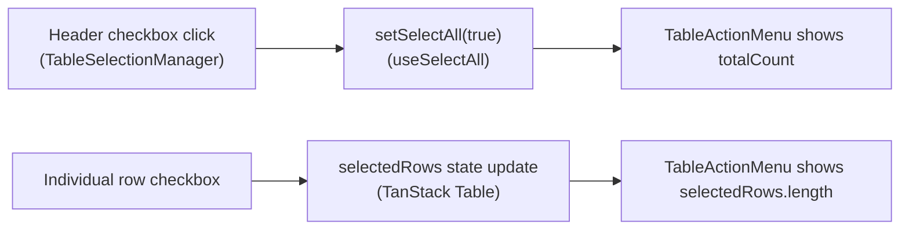
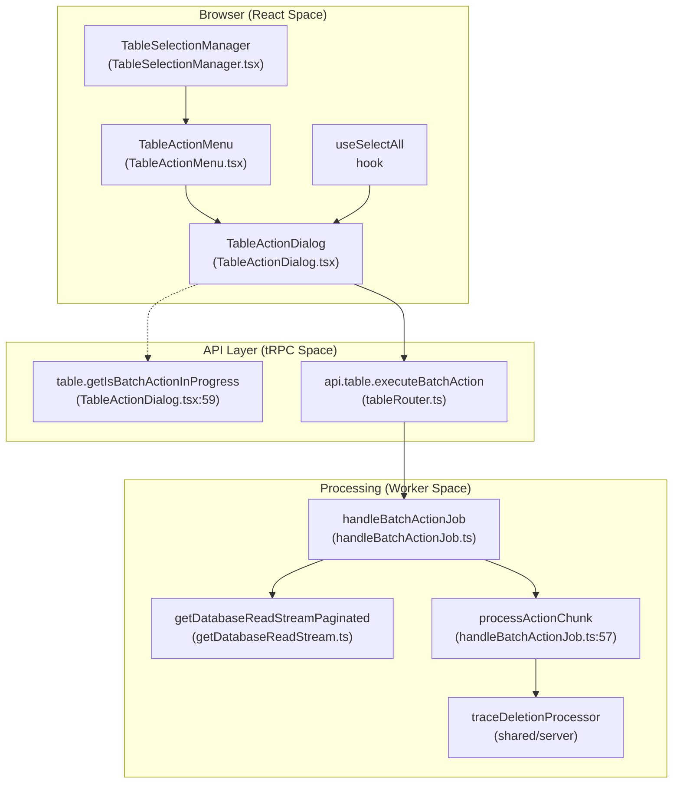
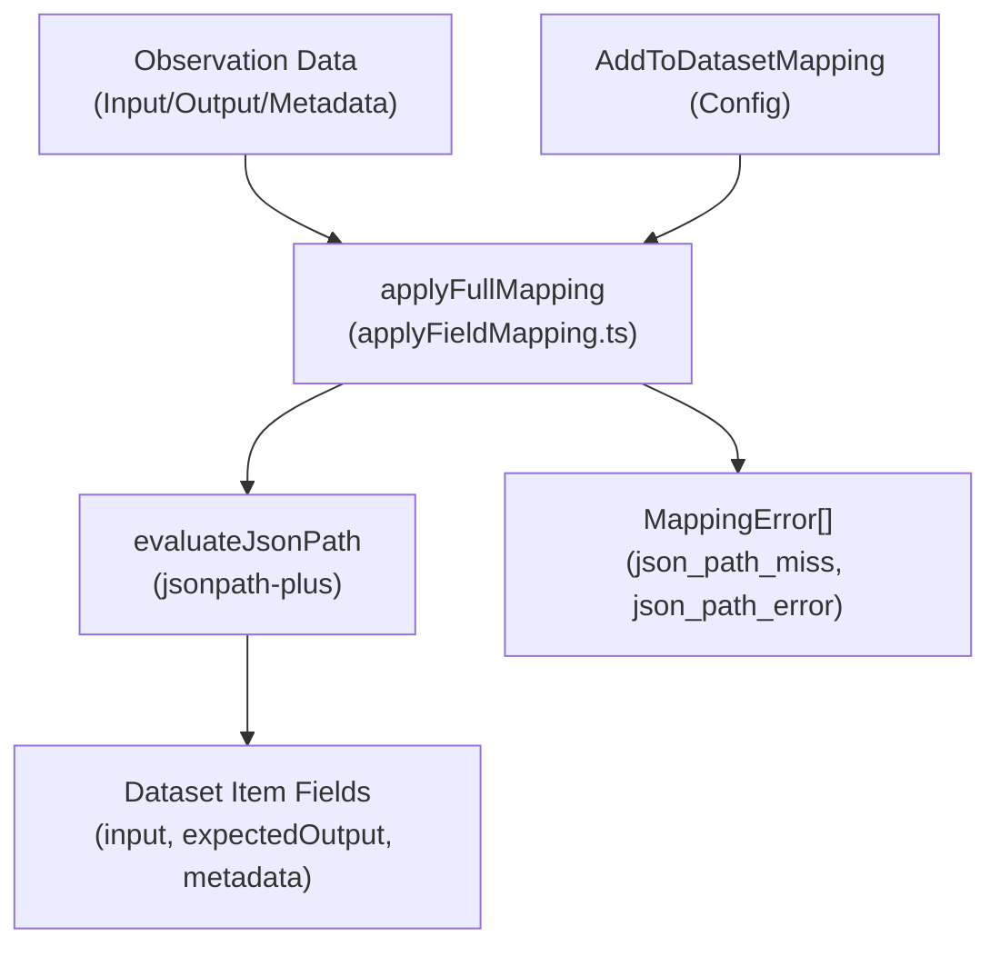
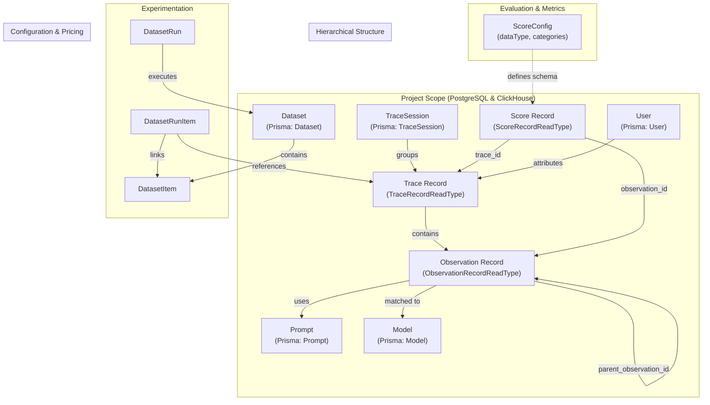
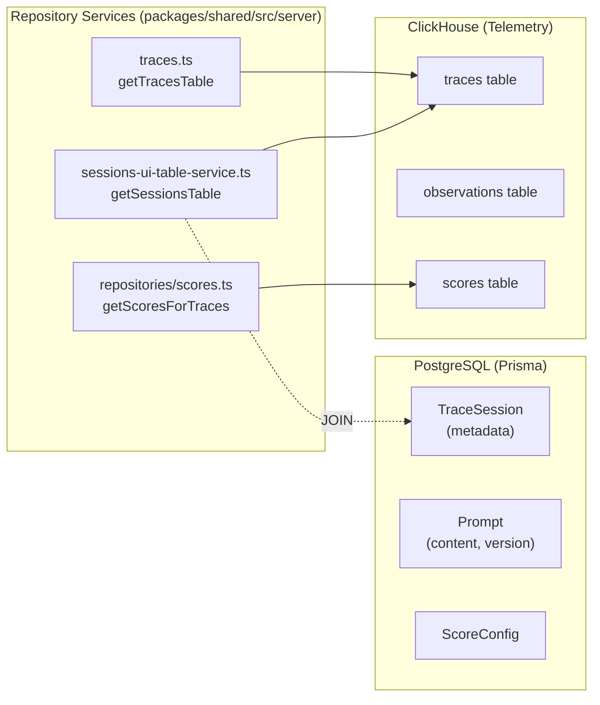
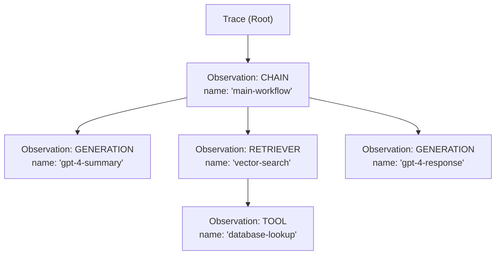
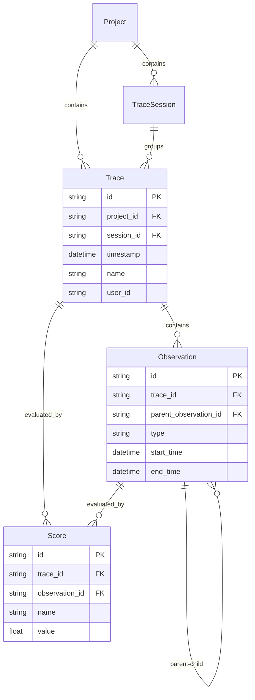
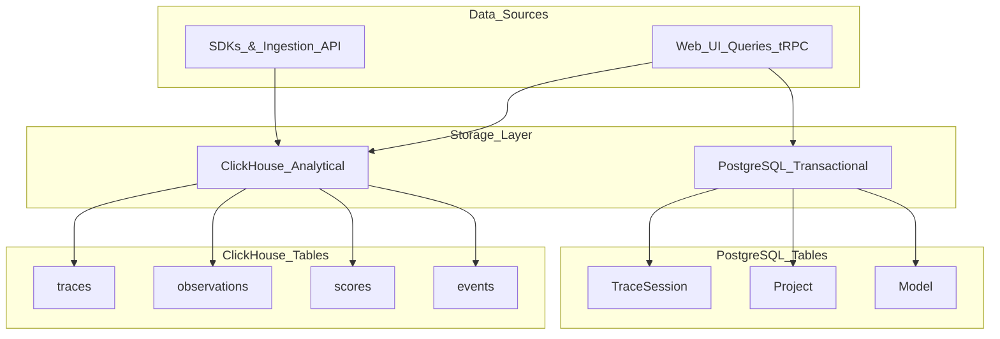
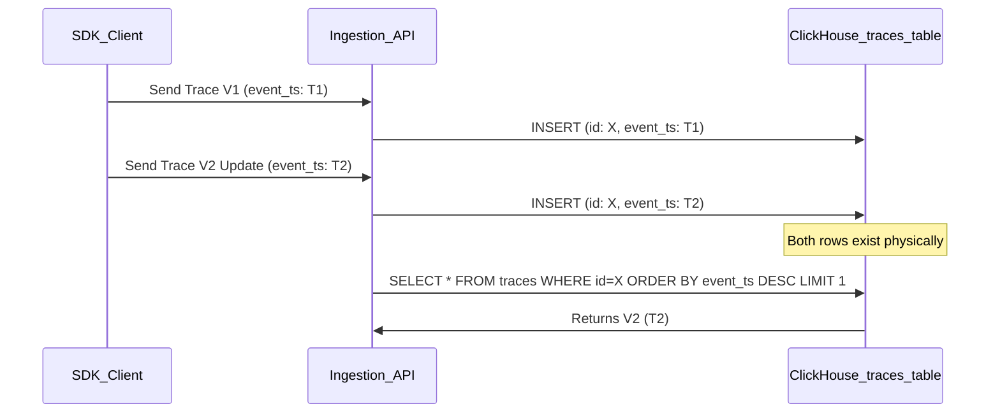
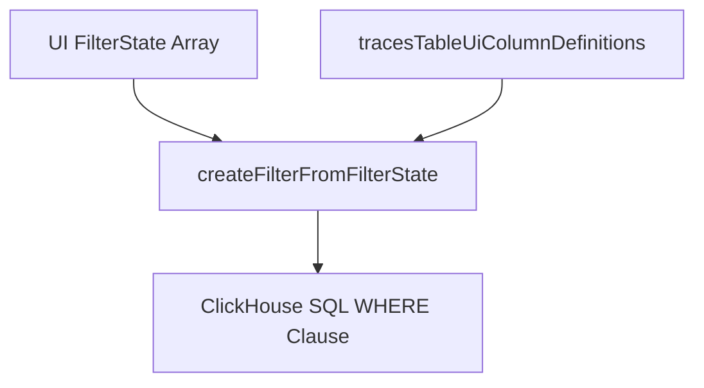

This page documents the batch action system used in Langfuse's data tables: row selection state management, the "select all" pattern, and bulk operations such as deletion, annotation, and adding items to datasets.

---

## Selection Model

Tables that support batch actions maintain two independent selection states to handle both local (page-level) and global (filter-level) selection.

| State | Type | Source | Scope |
|---|---|---|---|
| `selectedRows` | `RowSelectionState` | `useState` in table component | Explicitly checked rows on the current page. |
| `selectAll` | `boolean` | `useSelectAll` hook | All rows matching the current filter across all pages. |

`TableSelectionManager` is a generic component used in tables (Traces, Observations, Sessions, Experiments) to produce a selection checkbox column [web/src/features/table/components/TableSelectionManager.tsx:16-21](). It provides the `selectActionColumn` definition, which includes logic for toggling page-level rows and clearing global selection [web/src/features/table/components/TableSelectionManager.tsx:23-69]().

### Selection UI Components

- **`DataTableSelectAllBanner`**: Appears when all items on the current page are selected. It offers the user the option to "Select all X items across Y pages", which sets the `selectAll` state to `true` [web/src/components/table/data-table-multi-select-actions/data-table-select-all-banner.tsx:5-52]().
- **`TableActionMenu`**: A floating bar that appears when `selectedCount > 0`. It displays the count of selected items and renders available `TableAction` buttons [web/src/features/table/components/TableActionMenu.tsx:64-116]().

### Selection Data Flow

Title: Selection State Logic

Sources: [web/src/features/table/components/TableSelectionManager.tsx:30-51](), [web/src/components/table/data-table-multi-select-actions/data-table-select-all-banner.tsx:15-50](), [web/src/features/table/components/TableActionMenu.tsx:67-72]()

---

## Batch Action Pipeline

The system bridges UI selection to background processing via tRPC mutations and BullMQ workers. UI components like `TableActionMenu` and `TableActionDialog` manage the transition from user intent to execution.

Title: Batch Action Pipeline (Natural Language to Code Entities)

Sources: [web/src/features/table/components/TableActionMenu.tsx:35-42](), [web/src/features/table/components/TableActionDialog.tsx:44-51](), [worker/src/features/batchAction/handleBatchActionJob.ts:141-144](), [worker/src/features/batchAction/handleBatchActionJob.ts:65-67]()

### `TableAction` Type

Each table component assembles a `TableAction[]` array. `TableActionMenu` reads this to render the action buttons [web/src/features/table/components/TableActionMenu.tsx:83-113]().

| Field | Type | Purpose |
|---|---|---|
| `id` | `ActionId` | String identifying the operation (e.g., `trace-delete`, `score-delete`) [worker/src/features/batchAction/handleBatchActionJob.ts:64-95](). |
| `type` | `BatchActionType` | Determines UI styling (`create` or `delete`) [worker/src/features/batchAction/handleBatchActionJob.ts:172-174](). |
| `execute` | `async function` | Mutation trigger; receives `{ projectId, targetId? }`. |
| `accessCheck` | `object` | Defines required RBAC `scope` (e.g., `batchExports:create`) [web/src/components/BatchExportTableButton.tsx:53-56](). |

---

## Batch Exports

Batch exports utilize a streaming architecture to handle large datasets from ClickHouse or PostgreSQL.

### Export Pipeline
1. **Trigger**: `BatchExportTableButton` initiates a `create` mutation [web/src/components/BatchExportTableButton.tsx:60-71]().
2. **Job Handling**: `handleBatchExportJob` validates the job and transitions status to `PROCESSING` [worker/src/features/batchExport/handleBatchExportJob.ts:115-123]().
3. **Streaming**: Depending on the table, it calls `getTraceStream`, `getObservationStream`, or `getEventsStream` [worker/src/features/batchExport/handleBatchExportJob.ts:174-202]().
4. **Formatting**: Data is piped through format-specific transformers (CSV, JSONL) and uploaded to S3/Blob Storage [worker/src/features/batchExport/handleBatchExportJob.ts:220-223]().

### ClickHouse Streaming
`getObservationStream` and `getTraceStream` construct complex ClickHouse queries that join metadata with aggregated scores using CTEs [worker/src/features/database-read-stream/observation-stream.ts:130-177](). They use `queryClickhouseStream` to fetch data without loading the entire result set into memory [worker/src/features/database-read-stream/trace-stream.ts:183-225]().

Sources: [worker/src/features/batchExport/handleBatchExportJob.ts:34-40](), [worker/src/features/database-read-stream/observation-stream.ts:34-50](), [worker/src/features/database-read-stream/trace-stream.ts:29-44]()

---

## Add to Dataset Mapping

Adding items to datasets involves a mapping system that extracts specific fields from traces or observations using JSONPath.

### Field Mapping Configuration
The mapping logic is defined in `applyFieldMapping.ts` and supports three modes:
- **`full`**: Maps the entire source field (input, output, or metadata) [packages/shared/src/features/batchAction/applyFieldMapping.ts:138-139]().
- **`none`**: Sets the dataset item field to null [packages/shared/src/features/batchAction/applyFieldMapping.ts:141-143]().
- **`custom`**: Uses `root` extraction or `keyValueMap` [packages/shared/src/features/batchAction/applyFieldMapping.ts:145-208]().

### JSONPath Evaluation
The system uses `jsonpath-plus` to evaluate selectors against observation data [packages/shared/src/features/batchAction/applyFieldMapping.ts:1-62]().
- `evaluateJsonPath`: Extracts values from a JSON object [packages/shared/src/features/batchAction/applyFieldMapping.ts:62-72]().
- `testJsonPath`: Validates the syntax of a JSONPath string [packages/shared/src/features/batchAction/applyFieldMapping.ts:42-57]().

Title: Field Mapping Data Flow

Sources: [packages/shared/src/features/batchAction/applyFieldMapping.ts:101-105](), [packages/shared/src/features/batchAction/applyFieldMapping.ts:221-232]()

---

## Worker-Side Execution

When a batch action is triggered for a large set of data (via `selectAll`), the worker processes it in chunks.

1.  **Job Processing**: `handleBatchActionJob` receives the job payload containing the query and action type [worker/src/features/batchAction/handleBatchActionJob.ts:141-148]().
2.  **Streaming**: It initializes a `dbReadStream` using `getDatabaseReadStreamPaginated` or specialized streams for traces/observations [worker/src/features/batchAction/handleBatchActionJob.ts:176-202]().
3.  **Chunking**: The stream is read into batches of `CHUNK_SIZE` (default 1000) [worker/src/features/batchAction/handleBatchActionJob.ts:42, 214-216]().
4.  **Execution**: `processActionChunk` dispatches the batch to the specific processor (e.g., `traceDeletionProcessor` or `processClickhouseScoreDelete`) [worker/src/features/batchAction/handleBatchActionJob.ts:57-100]().
5.  **Idempotency**: All operations are designed to be idempotent to allow for safe retries in case of worker failure [worker/src/features/batchAction/handleBatchActionJob.ts:53-56]().

Sources: [worker/src/features/batchAction/handleBatchActionJob.ts:214-222](), [worker/src/features/database-read-stream/getDatabaseReadStream.ts:99-114](), [worker/src/features/batchAction/handleBatchActionJob.ts:64-91]()

# Core Domain Features

This page describes the core domain entities in Langfuse's observability platform. These entities form the foundation for tracing LLM applications, evaluating their outputs, and analyzing performance. For detailed information on each entity type, refer to the sub-pages [Traces & Observations](#9.1) through [Automation System](#9.8).

For information about how these entities are ingested and stored, see [Data Ingestion Pipeline](#6). For details on the database architecture, see [Data Architecture](#3).

## Domain Model Overview

The following diagram illustrates the relationships between the primary domain entities. It bridges the natural language concepts to the specific code entities used in the repository layer and database schemas.

**Sources:**
- [packages/shared/src/server/repositories/definitions.ts:18-20]()
- [packages/shared/src/server/repositories/traces.ts:198-204]()
- [packages/shared/src/server/repositories/observations.ts:11-105]()
- [packages/shared/src/server/repositories/scores.ts:151-166]()

## Entity Storage and Access Patterns

Langfuse utilizes a dual-database architecture. Metadata and configurations are stored in PostgreSQL via Prisma, while high-volume telemetry data (traces, observations, scores) is stored in ClickHouse for analytical performance. The UI layer fetches this data through specialized tRPC routers and repository services.

**Sources:**
- [packages/shared/src/server/repositories/traces.ts:1-50]()
- [web/src/server/api/routers/sessions.ts:172-198]()
- [packages/shared/src/server/repositories/scores.ts:168-182]()
- [packages/shared/src/server/services/sessions-ui-table-service.ts:65-86]()

## Traces

**Primary Entity:** `TraceRecordReadType` represents the raw ClickHouse trace record [packages/shared/src/server/repositories/definitions.ts:18]().

Traces represent the top-level execution unit. Each trace captures a complete workflow, such as a single user request or an autonomous agent run. Traces track latency, total cost, and token usage across all nested observations via the `getTracesTableMetrics` function [web/src/server/api/routers/traces.ts:225-237](). In the analytics engine, traces are queried via the `traceView` declaration [web/src/features/query/dataModel.ts:13-155]().

### Key Attributes
- `id`: Unique trace identifier [packages/shared/src/server/repositories/traces.ts:159]().
- `timestamp`: Start time of the trace [packages/shared/src/server/repositories/traces.ts:161]().
- `metadata`: Flexible JSON storage for custom attributes [packages/shared/src/server/repositories/traces.ts:26]().
- `tags`: Array of strings for categorization [web/src/features/query/dataModel.ts:31-36]().

**Detailed coverage:** See [Traces & Observations](#9.1)

## Observations

**Primary Entity:** `ObservationRecordReadType` represents the telemetry record in ClickHouse [packages/shared/src/server/repositories/observations.ts:11]().

Observations represent individual steps within a trace. They include generic spans and specific `GENERATION` types that track LLM usage. The `getObservationsForTrace` function retrieves the hierarchy for a specific trace [packages/shared/src/server/repositories/observations.ts:136-150]().

### Observation Types
- `SPAN`: Generic operation with duration.
- `GENERATION`: LLM completion calls, tracking `usage_details` and `cost_details` [packages/shared/src/server/repositories/observations.ts:168-172]().
- `EVENT`: Point-in-time event.
- `TOOL`: External tool or function execution.

**Detailed coverage:** See [Traces & Observations](#9.1)

## Scores

**Primary Entity:** `ScoreDomain` represents the score entity in the domain layer [packages/shared/src/domain/scores.ts:3]().

Scores represent evaluations of traces or observations. They are categorized by `dataType` (NUMERIC, CATEGORICAL, BOOLEAN) and `source` (API, ANNOTATION, EVAL) [packages/shared/src/server/repositories/scores.ts:1-10](). Scores are often aggregated by name to provide high-level metrics [web/src/server/api/routers/traces.ts:33-36](). Special scores like `CORRECTION_NAME` are used for output correction [web/src/server/api/routers/scores.ts:34-35]().

**Detailed coverage:** See [Scores & Scoring](#9.2)

## Sessions

**Dual Storage:** Metadata in PostgreSQL (`TraceSession` model) and aggregated trace data in ClickHouse.

Sessions group related traces (e.g., a multi-turn chat). The `getSessionsTable` function fetches metrics like `trace_count` and `min_timestamp` by aggregating trace data associated with a `session_id` [packages/shared/src/server/services/sessions-ui-table-service.ts:65-86](). In V4, session metrics can be derived from the events table via `getSessionMetricsFromEvents` [web/src/server/api/routers/sessions.ts:33-34]().

**Detailed coverage:** See [Sessions](#9.3)

## Users

**Primary Entity:** `User` (PostgreSQL) and `userId` (ClickHouse).

Langfuse tracks end-users of LLM applications. Users are identified by a `userId` string in traces [web/src/features/query/dataModel.ts:37-42](). The system aggregates metrics per user, including token usage and total cost, via functions like `getTracesGroupedByUsers` [web/src/server/api/routers/traces.ts:49]().

**Detailed coverage:** See [Sessions](#9.3) (User tracking is covered within the Sessions and User management context).

## Prompts & Templates

Langfuse provides a Prompt Management system where prompts are versioned and can be organized into folders.
- `Prompt`: PostgreSQL model storing the prompt string, type (`text` or `chat`), and version.
- `PromptLabel`: Used for version management (e.g., "production", "staging").
- `Folder`: Virtual organization of prompts based on name prefixes.

**Detailed coverage:** See [Prompts & Templates](#9.5)

## Models & Pricing

Models are defined in PostgreSQL to enable cost calculation. The system matches `provided_model_name` from observations to internal model definitions to calculate `usage_details` and `cost_details` [packages/shared/src/server/repositories/observations.ts:165-172](). Pricing calculations utilize `sumMap(cost_details)` in ClickHouse for efficient aggregation [packages/shared/src/server/repositories/traces.ts:117]().

**Detailed coverage:** See [Models & Pricing](#9.6)

## Dashboard & Analytics

The dashboard provides a high-level view of project performance. It uses the `QueryBuilder` [web/src/features/query/server/queryBuilder.ts:55]() to translate UI selections into ClickHouse SQL based on the `ViewDeclarationType` [web/src/features/query/types.ts:9](). It aggregates data across traces, observations, and scores to calculate metrics like `totalCost` and `latency` [web/src/features/query/dataModel.ts:112-136]().

**Detailed coverage:** See [Dashboard & Analytics](#9.7)

## Automation System

Automations allow for event-driven workflows, such as triggering webhooks or Slack notifications when specific criteria are met in traces or scores. These are managed via the `Automation` and `JobConfiguration` models.

**Detailed coverage:** See [Automation System](#9.8)

# Traces & Observations

## Purpose and Scope

This document describes the core observability data model in Langfuse, focusing on **Traces** and **Observations**. These are the primary entities that capture execution flows and function calls within applications being monitored.

- **Traces** represent complete execution contexts (e.g., a single API request, a batch job, or an agent session).
- **Observations** represent individual operations within a trace (e.g., LLM calls, function executions, tool invocations).

For information about how traces are ingested and processed, see [Data Ingestion Pipeline](#6). For scoring and evaluation of traces and observations, see [Scores & Scoring](#9.2). For grouping traces into conversations, see [Sessions](#9.3).

## Data Model

### Trace Structure

A trace is the top-level container for an execution flow. Traces are stored primarily in ClickHouse and have the following key attributes:

| Field | Type | Description |
|-------|------|-------------|
| `id` | String | Unique identifier |
| `project_id` | String | Project ownership |
| `timestamp` | DateTime | Trace start time |
| `name` | String (optional) | User-defined trace name |
| `user_id` | String (optional) | End-user identifier |
| `session_id` | String (optional) | Groups related traces |
| `input` | JSON (optional) | Trace input data |
| `output` | JSON (optional) | Trace output data |
| `metadata` | JSON (optional) | Custom metadata |
| `tags` | Array[String] | Classification tags |
| `release` | String (optional) | Application version |
| `version` | String (optional) | Trace version |
| `public` | Boolean | Public visibility flag |
| `bookmarked` | Boolean | User bookmark flag |
| `environment` | String | Environment identifier |

**Sources**: [packages/shared/src/server/repositories/traces.ts:198-206](), [packages/shared/src/server/services/traces-ui-table-service.ts:33-47](), [packages/shared/src/server/repositories/definitions.ts:127-143]()

### Observation Structure and Types

Observations are hierarchical spans within traces. Each observation has a type that defines its semantic meaning:

**Trace and Observation Hierarchy**

**Observation Types** ([packages/shared/src/domain/observations.ts:1-15]()):

| Type | Purpose | Typical Use Case |
|------|---------|------------------|
| `GENERATION` | LLM completions | OpenAI, Anthropic API calls |
| `SPAN` | Generic operations | Function execution, processing steps |
| `EVENT` | Point-in-time events | Logging, state changes |
| `TOOL` | Tool invocations | Function calling, API calls |
| `RETRIEVER` | Document retrieval | Vector search, database queries |

**Key Observation Fields**:

| Field | Type | Description |
|-------|------|-------------|
| `id` | String | Unique identifier |
| `trace_id` | String | Parent trace reference |
| `parent_observation_id` | String (optional) | Parent observation for nesting |
| `type` | ObservationType | Semantic type |
| `name` | String (optional) | Operation name |
| `start_time` | DateTime | Start timestamp |
| `end_time` | DateTime (optional) | Completion timestamp |
| `input` | JSON (optional) | Operation input |
| `output` | JSON (optional) | Operation output |
| `metadata` | JSON (optional) | Custom metadata |
| `level` | Enum | Log level: DEBUG, DEFAULT, WARNING, ERROR |
| `status_message` | String (optional) | Status or error message |
| `usage_details` | Map[String, Number] | Token/credit usage by type |
| `cost_details` | Map[String, Number] | Cost breakdown |
| `total_cost` | Decimal (optional) | Total calculated cost |

**Sources**: [packages/shared/src/server/repositories/observations.ts:151-182](), [packages/shared/src/server/repositories/definitions.ts:34-61](), [packages/shared/src/server/repositories/observations_converters.ts:150-220]()

### Relationships

**Core Entity Relationships**

**Key Relationships**:

1. **Trace → Session**: Traces can optionally belong to a session, enabling multi-turn conversation grouping ([web/src/server/api/routers/sessions.ts:92-95]()).
2. **Trace → Observations**: One-to-many relationship where observations are contained within traces ([packages/shared/src/server/repositories/observations.ts:151-185]()).
3. **Observation → Observation**: Parent-child hierarchy for nested operations ([packages/shared/src/server/repositories/observations.ts:156]()).
4. **Trace/Observation → Scores**: Both can be evaluated with multiple scores ([packages/shared/src/server/repositories/scores.ts:168-182]()).

**Sources**: [packages/shared/src/server/repositories/observations.ts:151-189](), [packages/shared/src/server/repositories/scores.ts:168-182]()

## Storage Architecture

### Dual-Database Design

Langfuse uses a hybrid storage approach optimized for different access patterns:

**Storage Layer and Table Association**

**ClickHouse (Primary Storage)**:
- **Purpose**: High-volume analytical queries, trace/observation data.
- **Tables**: `traces`, `observations`, `scores`, and `events` (for V4/OTel data).
- **Deduplication**: Uses `LIMIT 1 BY id, project_id ORDER BY event_ts DESC` to get the latest version ([packages/shared/src/server/repositories/observations.ts:187-188]()).
- **Performance**: Optimized for time-series queries with partition pruning.

**PostgreSQL (Metadata)**:
- **Purpose**: ACID-compliant metadata, relationships, and configuration.
- **Tables**: `TraceSession`, `Project`, `Model`.
- **Key Fields**: `bookmarked`, `public`, `environment` flags stored here for sessions ([web/src/server/api/routers/sessions.ts:200-213]()).

**Sources**: [packages/shared/src/server/repositories/traces.ts:1-40](), [packages/shared/src/server/repositories/observations.ts:1-49](), [web/src/server/api/routers/sessions.ts:200-213](), [packages/shared/src/server/repositories/definitions.ts:1-160]()

### Deduplication Strategy

ClickHouse tables support **upserts** through a deduplication pattern where multiple versions of a record are stored, but only the latest is queried:

**Deduplication Pattern**

**Optimization for OTel Projects**: Projects using OpenTelemetry produce immutable spans, so deduplication can be skipped entirely via `shouldSkipObservationsFinal()` ([packages/shared/src/server/repositories/observations.ts:148-188](), [packages/shared/src/server/services/traces-ui-table-service.ts:220]()).

**Sources**: [packages/shared/src/server/repositories/observations.ts:148-189](), [packages/shared/src/server/repositories/traces.ts:198-206]()

## Repository Layer

### Trace Repository Functions

The trace repository ([packages/shared/src/server/repositories/traces.ts]()) provides core CRUD operations:

| Function | Purpose | Return Type |
|----------|---------|-------------|
| `upsertTrace()` | Insert or update trace | `Promise<void>` |
| `checkTraceExistsAndGetTimestamp()` | Validate existence and get time | `{ exists: boolean, timestamp?: Date }` |
| `getTraceById()` | Fetch single trace | `TraceDomain \| undefined` |

**Timestamp Filtering Optimization**: Queries use time windows like `TRACE_TO_OBSERVATIONS_INTERVAL` (2 days) to scope searches and prune partitions ([packages/shared/src/server/repositories/traces.ts:166-168]()).

**Sources**: [packages/shared/src/server/repositories/traces.ts:58-192](), [packages/shared/src/server/repositories/traces.ts:198-206]()

### Observation Repository Functions

The observation repository ([packages/shared/src/server/repositories/observations.ts]()) manages the observation lifecycle:

| Function | Purpose | Key Features |
|----------|---------|--------------|
| `upsertObservation()` | Insert or update observation | Validates required core fields |
| `getObservationsForTrace()` | Get all observations in trace | Supports `includeIO` flag |
| `checkObservationExists()` | Validate observation presence | Filters with lookback window |

**Input/Output Handling**: Observations can be fetched with or without input/output fields to optimize payload size. The system enforces a size limit (`env.LANGFUSE_API_TRACE_OBSERVATIONS_SIZE_LIMIT_BYTES`) to prevent memory issues ([packages/shared/src/server/repositories/observations.ts:207-236]()).

**Sources**: [packages/shared/src/server/repositories/observations.ts:64-97](), [packages/shared/src/server/repositories/observations.ts:103-126](), [packages/shared/src/server/repositories/observations.ts:136-252]()

## UI Integration & Aggregations

### Table Services

Table views use specialized service functions that construct optimized ClickHouse queries with joins for metrics:

**`getTracesTableMetrics`** ([packages/shared/src/server/services/traces-ui-table-service.ts:65-84]()):
- Constructs a CTE `observations_agg` to aggregate metrics per trace ([packages/shared/src/server/repositories/traces.ts:102-126]()).
- **Latency**: Computed as `date_diff('millisecond', least(min(start_time), min(end_time)), greatest(max(start_time), max(end_time)))` ([packages/shared/src/server/repositories/traces.ts:115]()).
- **Cost/Usage**: Aggregated via `sumMap(usage_details)` and `sumMap(cost_details)` ([packages/shared/src/server/repositories/traces.ts:116-117]()).
- **Level Aggregation**: Uses `multiIf` to determine the highest severity level across all observations in a trace (`ERROR` > `WARNING` > `DEFAULT` > `DEBUG`) ([packages/shared/src/server/repositories/traces.ts:105-110]()).

**Sources**: [packages/shared/src/server/repositories/traces.ts:102-126](), [packages/shared/src/server/services/traces-ui-table-service.ts:65-84]()

### Filter System

The UI uses `FilterState` arrays that map to ClickHouse SQL filters via factory functions:

**Filter Transformation**

**Sources**: [packages/shared/src/server/repositories/traces.ts:82-94](), [packages/shared/src/server/services/traces-ui-table-service.ts:225-231]()

### Cost & Usage Aggregation

Langfuse aggregates costs and token usage from individual observations up to the trace level:

1. **Observation Level**: `usage_details` and `cost_details` are stored as maps in ClickHouse ([packages/shared/src/server/repositories/observations.ts:168-171]()).
2. **Aggregation**: ClickHouse `sumMap` aggregates these details across all observations linked to a `trace_id` ([packages/shared/src/server/repositories/traces.ts:116-117]()).
3. **UI Conversion**: `convertToUITableMetrics` transforms these maps into structured decimals and bigints for the frontend ([packages/shared/src/server/services/traces-ui-table-service.ts:105-145]()).

**Sources**: [packages/shared/src/server/repositories/traces.ts:116-117](), [packages/shared/src/server/services/traces-ui-table-service.ts:105-145](), [packages/shared/src/server/repositories/observations.ts:168-171]()