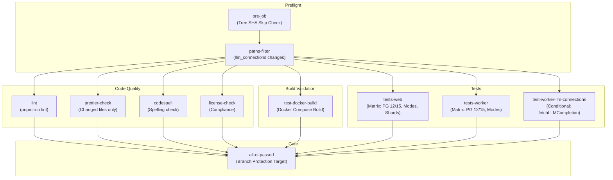
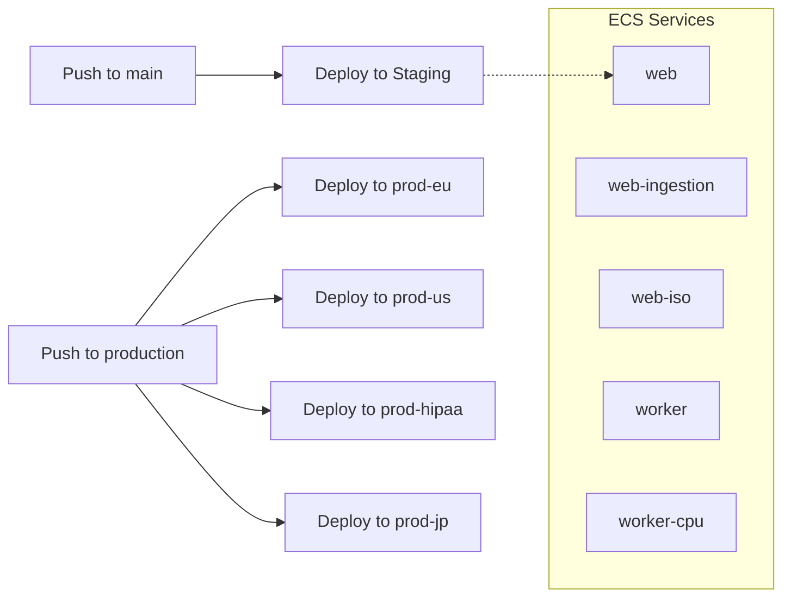
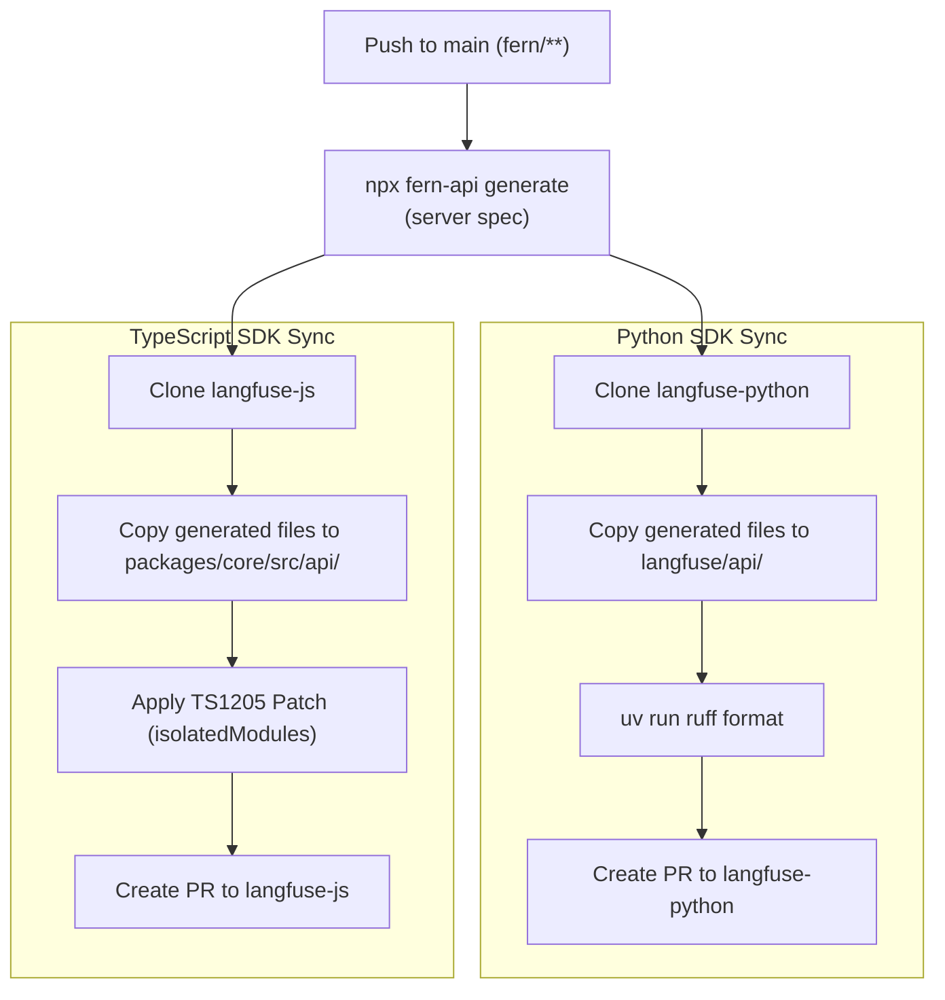
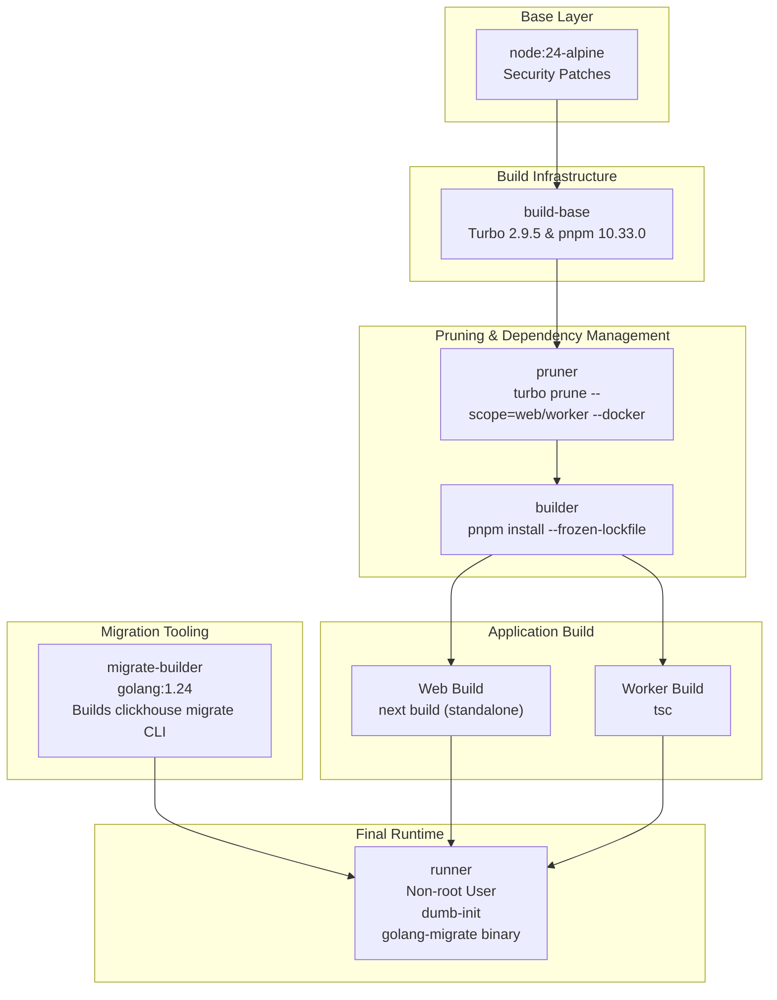
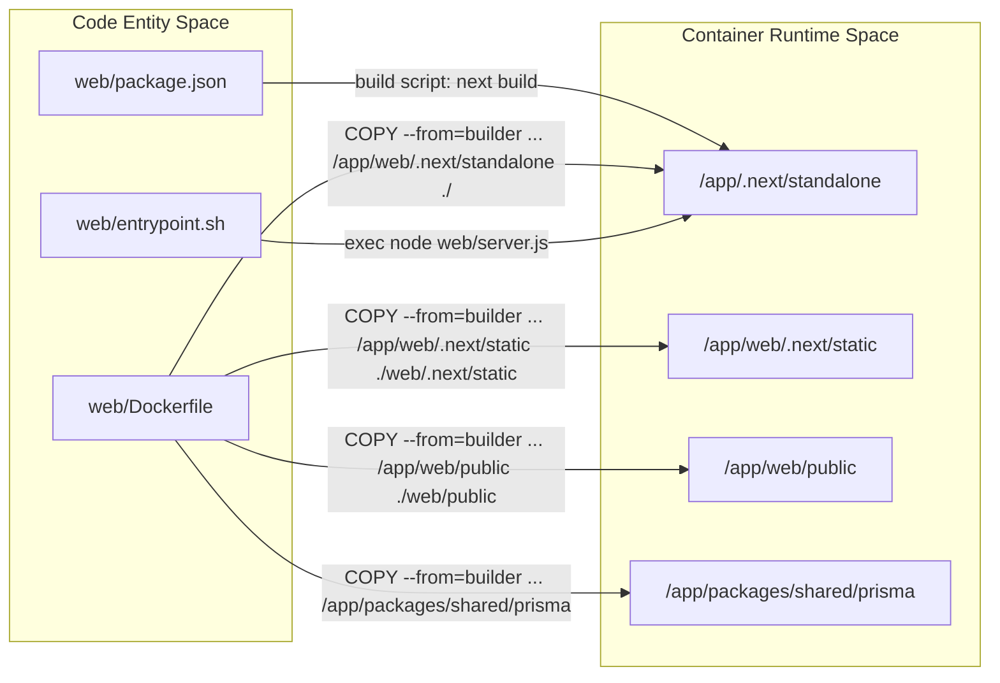
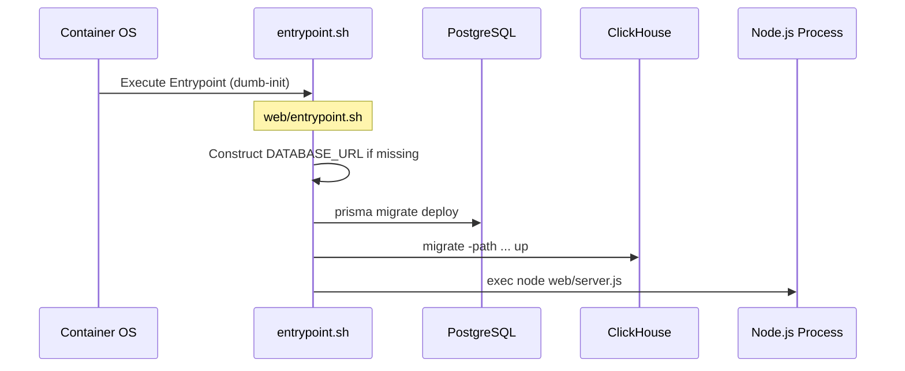

## Purpose and Scope

This document describes the continuous integration and continuous deployment (CI/CD) pipeline for the Langfuse monorepo. The pipeline is implemented using GitHub Actions and orchestrates building, testing, and releasing the web application, worker service, and associated SDKs.

The relevant workflow files are:

| File | Purpose |
|------|---------|
| `.github/workflows/pipeline.yml` | Main CI/CD pipeline: lint, test, Docker build validation, and image publish [ .github/workflows/pipeline.yml:1-15]() |
| `.github/workflows/deploy.yml` | Orchestrates deployment to AWS ECS across staging and production environments [ .github/workflows/deploy.yml:1-38]() |
| `.github/workflows/_deploy_ecs_service.yml` | Reusable workflow for building and pushing Docker images to ECR and updating ECS task definitions [ .github/workflows/_deploy_ecs_service.yml:1-22]() |
| `.github/workflows/release.yml` | Promotes the `main` branch to `production` upon semantic version tag pushes [ .github/workflows/release.yml:1-10]() |
| `.github/workflows/sdk-api-spec.yml` | Automatically generates and updates Python and TypeScript SDKs from Fern API specs [ .github/workflows/sdk-api-spec.yml:1-19]() |
| `.github/workflows/codeql.yml` | Semantic code analysis and security scanning [ .github/workflows/codeql.yml:12-21]() |
| `.github/workflows/snyk-web.yml` / `snyk-worker.yml` | Container vulnerability scanning for Web and Worker images [ .github/workflows/snyk-web.yml:1-10](), [ .github/workflows/snyk-worker.yml:1-10]() |

Sources: [ .github/workflows/pipeline.yml:1-15](), [ .github/workflows/deploy.yml:1-38](), [ .github/workflows/sdk-api-spec.yml:1-19]()

---

## Workflow Triggers and Concurrency Control

The main CI/CD workflow (`.github/workflows/pipeline.yml`) triggers on multiple events:

| Trigger Type | Branches/Conditions | Purpose |
|--------------|---------------------|---------|
| `workflow_dispatch` | Manual | On-demand execution |
| `push` | `main` branch, `v*` tags | Automated deployment and release |
| `merge_group` | All | Queue validation for merge queues |
| `pull_request` | All branches | Pre-merge validation |

**Concurrency Strategy:**
- Workflow runs are grouped by `${{ github.workflow }}-${{ github.ref }}` [ .github/workflows/pipeline.yml:19]()
- Pull request runs automatically cancel previous runs (`cancel-in-progress: true`) [ .github/workflows/pipeline.yml:20]()
- Non-PR runs (e.g., main branch) do not cancel previous runs to ensure deployment completion.

**Tree SHA Skip Check:**
The `pre-job` includes a custom optimization that checks if the current Git tree SHA has already been successfully tested in a prior run of `pipeline.yml`. If a match is found, the workflow sets `should_skip=true` to save compute resources [ .github/workflows/pipeline.yml:35-54]().

Sources: [ .github/workflows/pipeline.yml:3-20](), [ .github/workflows/pipeline.yml:35-54]()

---

## Pipeline Job Orchestration

The main pipeline is defined in `.github/workflows/pipeline.yml` and consists of multiple jobs that validate code quality, build artifacts, and run the test suite across a matrix of environments.

### Pipeline Job Dependency Graph

Sources: [ .github/workflows/pipeline.yml:22-148](), [ .github/workflows/codespell.yml:19-21]()

---

## Deployment Architecture

Langfuse uses a dual-track deployment strategy: internal cloud deployments via AWS ECS and open-source releases via Docker Hub/GHCR.

### Cloud Deployment Flow (AWS ECS)

The deployment is managed by `deploy.yml`, which maps GitHub branches to specific AWS environments. It uses a `workflow_call` to the reusable `_deploy_ecs_service.yml` [ .github/workflows/deploy.yml:101-102]().

**Service Matrix:**
The deployment matrix covers specialized instances of the web and worker services [ .github/workflows/deploy.yml:112-115]():
- `web`: Standard application server.
- `web-ingestion`: Optimized for high-throughput API ingestion.
- `web-iso`: Isolated environment for specific compliance needs.
- `worker`: Standard background job processor.
- `worker-cpu`: CPU-optimized worker for intensive evaluation tasks.

Sources: [ .github/workflows/deploy.yml:8-28](), [ .github/workflows/deploy.yml:82-89](), [ .github/workflows/deploy.yml:112-118]()

---

## SDK and API Specification Pipeline

The `sdk-api-spec.yml` workflow ensures that client SDKs remain synchronized with the server's API definitions. It triggers on changes to the `fern/` directory [ .github/workflows/sdk-api-spec.yml:7-8]().

### Automated SDK Generation Flow

**Key Code Entities:**
- `fern-api`: Tool used to generate SDKs from OpenAPI/Fern definitions [ .github/workflows/sdk-api-spec.yml:45]().
- `uv`: Used for Python dependency management and formatting in the `langfuse-python` repository [ .github/workflows/sdk-api-spec.yml:48-78]().
- `corepack`: Enables `pnpm` for TypeScript SDK formatting and installation in `langfuse-js` [ .github/workflows/sdk-api-spec.yml:133-136]().
- `ruff`: Python formatter used to ensure code quality in the generated SDK [ .github/workflows/sdk-api-spec.yml:77]().

Sources: [ .github/workflows/sdk-api-spec.yml:42-45](), [ .github/workflows/sdk-api-spec.yml:56-101](), [ .github/workflows/sdk-api-spec.yml:108-160]()

---

## Security and Compliance

### Vulnerability Scanning
- **Snyk Container Scanning**: Runs on every push to `main` and `production`. It tests the `web/Dockerfile` and `worker/Dockerfile` for OS-level and dependency vulnerabilities [ .github/workflows/snyk-web.yml:32-34](), [ .github/workflows/snyk-worker.yml:32-34]().
- **CodeQL**: Performs static analysis for `javascript-typescript` to identify common coding vulnerabilities. It is scheduled to run weekly on Sundays [ .github/workflows/codeql.yml:19-20](), [ .github/workflows/codeql.yml:46-47]().
- **Codespell**: Checks for spelling errors in the codebase on every push and pull request [ .github/workflows/codespell.yml:19-30]().

### Dependabot Configuration
Dependabot is configured for daily updates of `npm` dependencies and weekly updates for `github-actions` [ .github/dependabot.yml:12-13](), [ .github/dependabot.yml:55-56]().

**Dependency Groups:**
To reduce PR noise, dependencies are grouped [ .github/dependabot.yml:24-52]():
- `prisma`: Includes `prisma` and `@prisma/client`.
- `next`: Includes `next` and `eslint-config-next`.
- `observability`: Includes `dd-trace`, `@opentelemetry/*`, and `@sentry/*`.

**Auto-Rebase:**
The `dependabot-rebase-stale.yml` workflow automatically rebases open Dependabot PRs when `main` is updated to prevent merge conflicts [ .github/workflows/dependabot-rebase-stale.yml:1-21]().

Sources: [ .github/workflows/snyk-web.yml:1-10](), [ .github/workflows/codeql.yml:12-21](), [ .github/dependabot.yml:24-52](), [ .github/workflows/dependabot-rebase-stale.yml:1-21]()

---

## Docker Build Process

### Multi-Stage Builds
The project uses multi-stage Dockerfiles to minimize image size and security surface area.

**Web Build Strategy (`_deploy_ecs_service.yml`):**
1. **Build Arguments**: Injects environment-specific variables like `NEXT_PUBLIC_LANGFUSE_CLOUD_REGION`, `NEXT_PUBLIC_BUILD_ID` (set to `github.sha`), and `SENTRY_AUTH_TOKEN` [ .github/workflows/_deploy_ecs_service.yml:73-86]().
2. **Registry**: Images are pushed to AWS ECR (Elastic Container Registry) using the registry output from `aws-actions/amazon-ecr-login` [ .github/workflows/_deploy_ecs_service.yml:48-52](), [ .github/workflows/_deploy_ecs_service.yml:88]().
3. **Task Definition**: The workflow renders a new ECS task definition using `aws-actions/amazon-ecs-render-task-definition` and updates the service [ .github/workflows/_deploy_ecs_service.yml:91-102]().

**Test Build (`pipeline.yml`):**
The `test-docker-build` job uses `docker buildx bake` with a `docker-compose.build.yml` file to validate that the images are functional before they are considered for release. It specifically checks the health of the worker and server via `curl` to `/api/health` [ .github/workflows/pipeline.yml:171-183]().

Sources: [ .github/workflows/_deploy_ecs_service.yml:70-102](), [ .github/workflows/pipeline.yml:148-183]()

# Docker & Deployment

This document describes the containerization and deployment architecture for Langfuse's web and worker services, including multi-stage Docker builds, build optimization strategies, multi-architecture support (AMD64/ARM64), and container orchestration.

## Overview

Langfuse provides production-ready Docker images for two core services that form the backbone of the platform:
- **Web Service**: A Next.js application serving the UI, the public Ingestion API, and the internal tRPC API (port 3000) [[docker-compose.yml:71-76]]().
- **Worker Service**: An Express-based application handling asynchronous background job processing via BullMQ (port 3030) [[docker-compose.yml:7-20]]().

Both services utilize multi-stage builds to minimize image size and maximize security by running as non-root users (`nextjs` for web, `expressjs` for worker) [[web/Dockerfile:137-169]](), [[worker/Dockerfile:86-91]]().

Sources: [[docker-compose.yml:7-87]](), [[web/Dockerfile:1-176]](), [[worker/Dockerfile:1-101]]()

## Docker Build Architecture

### Multi-Stage Build Pipeline

Langfuse uses a sophisticated multi-stage pipeline to ensure that build tools like `pnpm` and `turbo` are not included in the final runtime image. The build process leverages `turbo prune` to create a subset of the monorepo for each service.

**Build Pipeline Visualization**

**Build Stages Description**

1.  **pruner**: Executes `turbo prune --scope=<service> --docker`. This command extracts only the code and `package.json` files necessary for the specific service (web or worker) and its internal workspace dependencies like `@langfuse/shared` [[web/Dockerfile:36-41]](), [[worker/Dockerfile:21-26]]().
2.  **builder**: Performs `pnpm install --frozen-lockfile`. It also bakes in build-time arguments (`ARG`) into environment variables (`ENV`) required for the Next.js frontend bundle, such as `NEXT_PUBLIC_POSTHOG_KEY` [[web/Dockerfile:43-79]]().
3.  **migrate-builder**: A Go-based stage that compiles the `migrate` CLI with ClickHouse support to avoid CVEs associated with prebuilt binaries [[web/Dockerfile:22-34]]().
4.  **runner**: The final production image. It copies only the standalone output (for Web) or the compiled `dist` folder (for Worker), installs runtime-only tools like `prisma`, and switches to a non-root user [[web/Dockerfile:111-169]](), [[worker/Dockerfile:67-91]]().

Sources: [[web/Dockerfile:1-176]](), [[worker/Dockerfile:1-101]](), [[package.json:100]]()

### Web Service Optimization

The Web service leverages Next.js "standalone" mode to significantly reduce the image size by only including files detected during the build's dependency tracing [[web/Dockerfile:156-158]]().

**Code to Container Mapping**

Key optimizations in the deployment flow:
- **Dependency Pruning**: The worker Dockerfile uses a specific `pnpm deploy --legacy --prod` step to isolate production dependencies [[worker/Dockerfile:51-65]]().
- **Multi-Arch Support**: Both Dockerfiles use `--platform=${TARGETPLATFORM:-linux/amd64}` to support building for multiple architectures like ARM64 [[web/Dockerfile:2]](), [[worker/Dockerfile:2]]().

Sources: [[web/Dockerfile:111-165]](), [[worker/Dockerfile:51-67]](), [[web/package.json:10]]()

## Container Orchestration & Configuration

### Docker Compose
The primary orchestration method for self-hosting is Docker Compose. The standard stack includes:
- `langfuse-web`: Main application (Next.js) [[docker-compose.yml:71]]().
- `langfuse-worker`: Background processor (Express/BullMQ) [[docker-compose.yml:7]]().
- `postgres`: Metadata storage [[docker-compose.yml:147]]().
- `clickhouse`: Observability data storage [[docker-compose.yml:90]]().
- `redis`: Queue backend (BullMQ) and caching [[docker-compose.yml:132]]().
- `minio`: S3-compatible blob storage for event bodies and exports [[docker-compose.yml:111]]().

Sources: [[docker-compose.yml:6-160]]()

### Environment Variable Management
Variables are split between build-time (static) and runtime (dynamic).

| Category | Key Variables | Purpose |
| :--- | :--- | :--- |
| **Database** | `DATABASE_URL`, `CLICKHOUSE_URL` | Connectivity to Postgres and ClickHouse [[docker-compose.yml:23-29]]() |
| **Security** | `NEXTAUTH_SECRET`, `SALT`, `ENCRYPTION_KEY` | JWT signing, password hashing, and data encryption [[docker-compose.yml:24-25]](), [[docker-compose.yml:79]]() |
| **Storage** | `LANGFUSE_S3_EVENT_UPLOAD_BUCKET` | S3/Minio bucket for ingestion events [[docker-compose.yml:36]]() |
| **Cloud Metering** | `NEXT_PUBLIC_LANGFUSE_CLOUD_REGION` | Enables cloud-specific features and Datadog tracing [[web/Dockerfile:141-145]]() |

Sources: [[docker-compose.yml:21-88]](), [[web/Dockerfile:58-92]]()

## Deployment Initialization Flow

When a Langfuse container starts, it follows a specific sequence defined in the entrypoint scripts to ensure the environment is ready.

**Key Implementation Details:**
- **PostgreSQL Migrations**: Executed via `prisma migrate deploy` (referenced in entrypoint flow) during the web container lifecycle to ensure the schema is up to date [[web/Dockerfile:176]]().
- **ClickHouse Migrations**: Managed via the `migrate` CLI compiled in the `migrate-builder` stage and copied to the runner [[web/Dockerfile:151]]().
- **Signal Handling**: Containers use `dumb-init` to properly handle signals and `NEXT_MANUAL_SIG_HANDLE=true` to allow Next.js to handle graceful shutdowns [[web/Dockerfile:176]](), [[web/package.json:19]]().
- **Cleanup**: A `cleanup.sql` script is provided for database maintenance tasks [[packages/shared/package.json:10]](), [[web/Dockerfile:166]]().

Sources: [[web/Dockerfile:151-176]](), [[worker/Dockerfile:96-101]](), [[web/package.json:19]](), [[packages/shared/package.json:10-11]]()