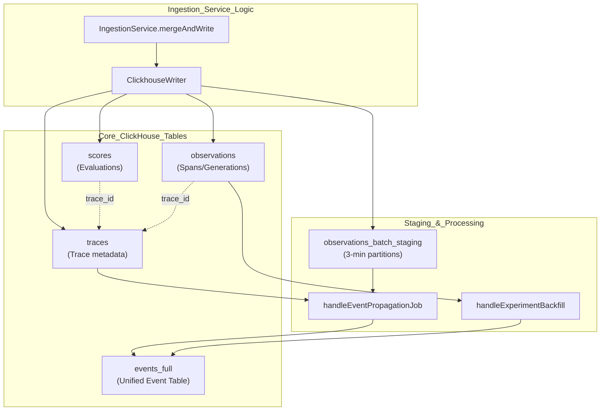
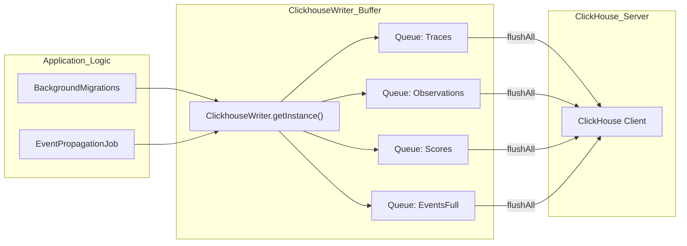

This document describes the ClickHouse schema used for storing high-volume observability data in Langfuse. ClickHouse serves as the analytical database for traces, observations, scores, and dataset run items, complementing PostgreSQL which stores configuration and metadata.

For information about the dual-database architecture and when each database is used, see [Database Overview](3.1). For details on the event-sourcing ingestion pattern and write paths, see [Events Table & Dual-Write Architecture](3.4).

---

## Core Tables Overview

ClickHouse stores four primary entity types as tables, each optimized for high-volume writes and analytical queries.

### Data Flow and Table Relationships

The following diagram illustrates how ingestion events flow into ClickHouse tables and the relationships between them, including the batch staging and event propagation path used for unified event construction.

**ClickHouse Ingestion and Propagation Flow**

**Table Engines and Strategy:**
- `traces`, `observations`, `scores`: Use `ReplacingMergeTree` with `event_ts` and `is_deleted` for deduplication and soft deletes.
- `observations_batch_staging`: Optimized for short-term storage with a 12-hour TTL and 3-minute partitioning to facilitate batch propagation. It uses `ReplacingMergeTree(event_ts, is_deleted)` [packages/shared/clickhouse/scripts/dev-tables.sh:81-120]().
- `events_full`: A unified table designed to replace the split traces/observations architecture, containing denormalized trace metadata alongside span data [packages/shared/clickhouse/scripts/dev-tables.sh:135-158]().

**Sources:** [packages/shared/clickhouse/scripts/dev-tables.sh:75-130](), [worker/src/features/eventPropagation/handleEventPropagationJob.ts:58-72]()

---

## The Unified Events Schema (`events_full`)

Langfuse is migrating toward a unified `events_full` table that combines trace-level context with observation-level data to eliminate expensive joins during analysis.

### Schema Structure

| Field | Type | Description |
|-------|------|-------------|
| `project_id` | String | Primary partition key |
| `trace_id` | String | Trace identifier |
| `span_id` | String | Unique identifier for this event/span |
| `parent_span_id` | String | Parent span identifier for tree structure |
| `start_time` | DateTime64(6) | Start of the event |
| `end_time` | Nullable(DateTime64(6)) | End of the event |
| `name` | String | Event/Span name |
| `type` | LowCardinality(String) | SPAN, GENERATION, EVENT, TOOL |
| `trace_name` | String | Denormalized name of the parent trace |
| `user_id` | String | Denormalized user identifier |
| `session_id` | String | Denormalized session identifier |
| `input` | String | Event input (ZSTD compressed) |
| `output` | String | Event output (ZSTD compressed) |
| `metadata_names` | Array(String) | Flattened metadata keys for optimized search |
| `metadata_values` | Array(String) | Flattened metadata values |

**Sources:** [packages/shared/clickhouse/scripts/dev-tables.sh:135-200]()

### Materialized Columns
The `events_full` table utilizes ClickHouse `MATERIALIZED` columns to calculate metrics at write-time, reducing query-time overhead:
- `calculated_input_cost`: Sum of costs filtered by 'input' key [packages/shared/clickhouse/scripts/dev-tables.sh:178-178]().
- `calculated_output_cost`: Sum of costs filtered by 'output' key [packages/shared/clickhouse/scripts/dev-tables.sh:179-179]().
- `calculated_total_cost`: Sum of both input and output costs [packages/shared/clickhouse/scripts/dev-tables.sh:180-180]().
- `input_length` / `output_length`: Character lengths of I/O strings [packages/shared/clickhouse/scripts/dev-tables.sh:193-195]().

---

## Partitioning and TTL Strategy

Langfuse uses a sophisticated partitioning strategy to manage high-volume ingestion and event propagation.

### Staging Partitioning
The `observations_batch_staging` table is partitioned by `toStartOfInterval(s3_first_seen_timestamp, INTERVAL 3 MINUTE)` [packages/shared/clickhouse/scripts/dev-tables.sh:121-121](). This allows the `handleEventPropagationJob` to process data in small, sequential chunks. The job tracks the `LAST_PROCESSED_PARTITION_KEY` in Redis to ensure sequential processing [worker/src/features/eventPropagation/handleEventPropagationJob.ts:15-24]().

### TTL Management
- **Staging Data**: Automatically expired after 12 hours via `TTL s3_first_seen_timestamp + INTERVAL 12 HOUR` [packages/shared/clickhouse/scripts/dev-tables.sh:129-129]().
- **Partition Cleanup**: The setting `ttl_only_drop_parts = 1` is used to ensure ClickHouse drops entire partitions efficiently rather than performing row-by-row deletes [packages/shared/clickhouse/scripts/dev-tables.sh:130-130]().

**Sources:** [packages/shared/clickhouse/scripts/dev-tables.sh:120-130](), [worker/src/features/eventPropagation/handleEventPropagationJob.ts:94-109]()

---

## Event Propagation and Backfill

The system provides mechanisms to populate the unified `events_full` table from existing staging data and historic records.

### Event Propagation Job
The `handleEventPropagationJob` performs a join between `observations_batch_staging` and the `traces` table to enrich span data with trace-level metadata (like `user_id` and `session_id`) before inserting into `events_full` [worker/src/features/eventPropagation/handleEventPropagationJob.ts:140-210](). Sequential processing is enforced via a global concurrency limit of 1 on the `EventPropagationQueue` [packages/shared/src/server/redis/eventPropagationQueue.ts:44-50]().

### Experiment Backfill
For data originating from experiments or dataset runs, `handleExperimentBackfill.ts` provides logic to fetch `DatasetRunItem` records and enrich relevant observations into the events schema [worker/src/features/eventPropagation/handleExperimentBackfill.ts:110-169](). This logic is also used by background migrations like `BackfillExperimentsHistoric` to process large volumes of historical experiment data [worker/src/backgroundMigrations/backfillExperimentsHistoric.ts:17-19]().

### Historic Backfill
Large-scale historic migrations are managed by the `ConcurrentQueryManager` which handles parallel ClickHouse queries. It uses a polling mechanism to monitor the status of long-running backfill queries in `system.query_log` [worker/src/backgroundMigrations/backfillEventsHistoric.ts:72-161](). Variations include backfilling from specific partitions or parts using `BackfillEventsHistoricFromParts` [worker/src/backgroundMigrations/backfillEventsHistoricFromParts.ts:149-181]().

**Sources:** [worker/src/features/eventPropagation/handleEventPropagationJob.ts:58-134](), [worker/src/features/eventPropagation/handleExperimentBackfill.ts:110-169](), [worker/src/backgroundMigrations/backfillEventsHistoric.ts:72-161](), [packages/shared/src/server/redis/eventPropagationQueue.ts:44-50]()

---

## ClickhouseWriter Implementation

The `ClickhouseWriter` class acts as a singleton buffer that batches inserts to ClickHouse to optimize throughput and handle transient errors.

**Writer Architecture**

### Batching and Flushing
- **Queues**: Maintains separate arrays for `Traces`, `Scores`, `Observations`, `ObservationsBatchStaging`, `DatasetRunItems`, and `EventsFull` [worker/src/services/ClickhouseWriter.ts:11-12]().
- **Background Migrations**: The `BackfillExperimentsHistoric` migration uses `writeEnrichedSpans` to push data into the `ClickhouseWriter` during large-scale operations [worker/src/backgroundMigrations/backfillExperimentsHistoric.ts:18-19]().

**Sources:** [worker/src/services/ClickhouseWriter.ts:11-12](), [worker/src/backgroundMigrations/backfillExperimentsHistoric.ts:18-19]()

---

## Best Practices and Constraints

The schema design follows strict ClickHouse best practices to ensure performance at scale:
- **Index Management**: Clustered migrations use `SETTINGS alter_sync = 2` and `mutations_sync = 2` to ensure metadata changes and data mutations are synchronized across the cluster [.agents/skills/clickhouse-best-practices/SKILL.md:35-41]().
- **Query Restrictions**: The `FINAL` keyword is prohibited on the `events` table as it is designed for high performance without requiring collapsing during query time [.agents/skills/clickhouse-best-practices/SKILL.md:33-34]().
- **Bloom Filters**: Bloom filters are applied to high-cardinality columns like `user_id` to accelerate point lookups [packages/shared/clickhouse/migrations/clustered/0006_add_user_id_index.up.sql:1-2]().

**Sources:** [.agents/skills/clickhouse-best-practices/SKILL.md:30-41](), [packages/shared/clickhouse/migrations/clustered/0006_add_user_id_index.up.sql:1-2]()