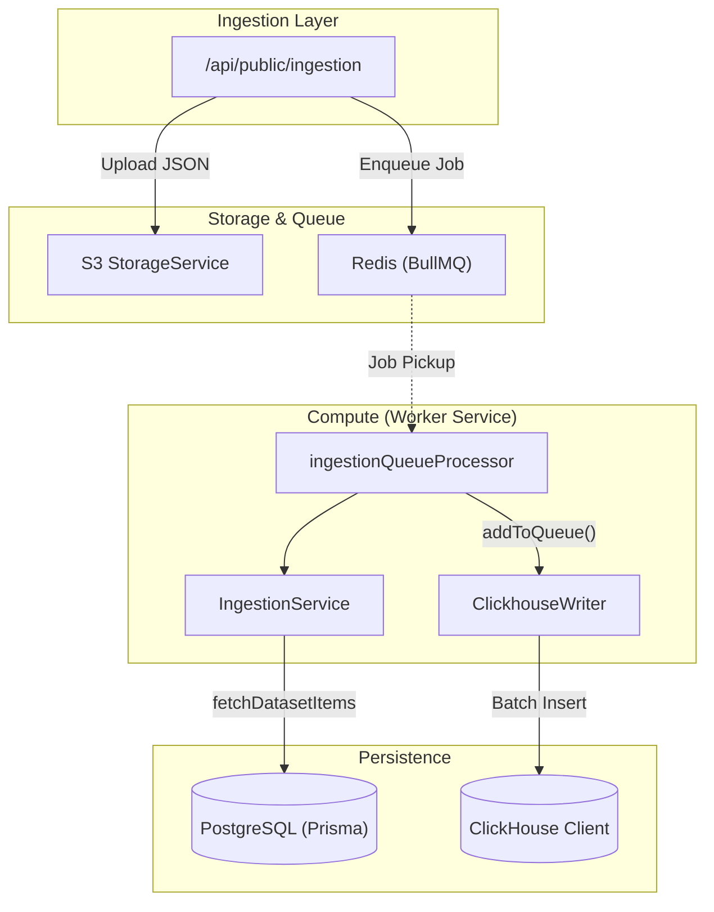
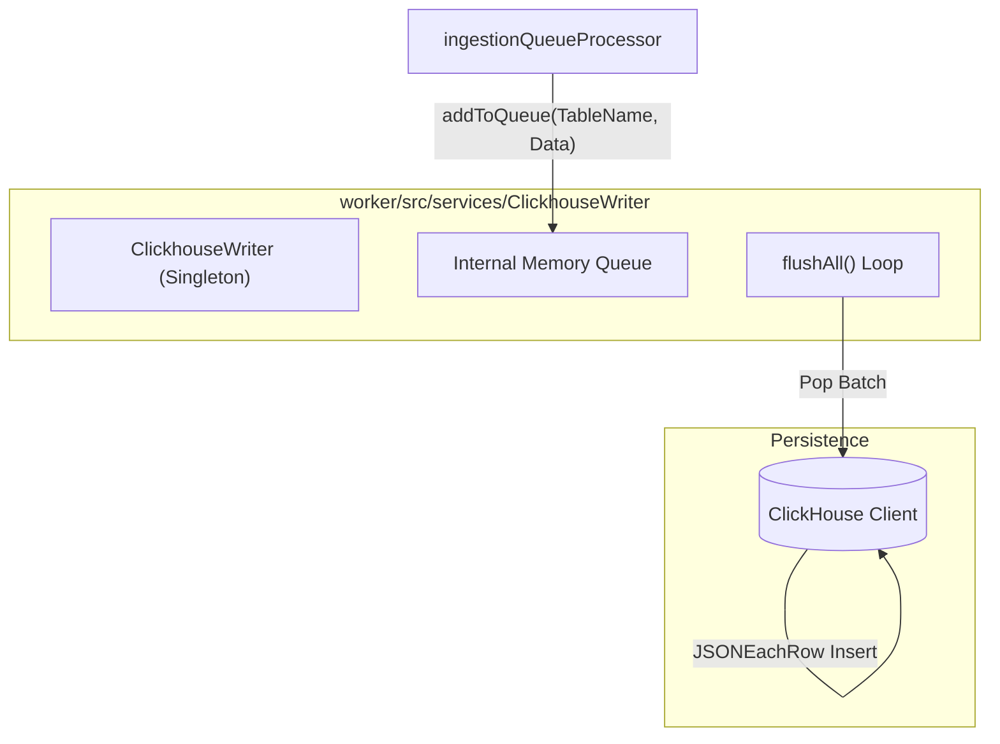

This page explains the dual-database architecture used in Langfuse, detailing the purpose and structure of PostgreSQL, ClickHouse, and Redis. It covers their respective schemas, data flow patterns, and how they interact to support high-volume LLM observability.

## Architecture Purpose

Langfuse employs a **split-database architecture** to optimize for different workload characteristics:

- **PostgreSQL**: The primary transactional store for relational metadata, configuration, and multi-tenant entity management. It is accessed via Prisma [web/src/features/datasets/server/dataset-router.ts:6-6]().
- **ClickHouse**: An OLAP database for high-volume observability data (traces, observations, scores) optimized for analytical queries and time-series aggregations. [packages/shared/src/server/repositories/clickhouse.ts:119-126]()
- **Redis**: An in-memory store used for BullMQ queue management, rate limiting, and deduplication caching. [worker/src/queues/ingestionQueue.ts:16-20]()
- **S3/Blob Storage**: Used as an intermediate buffer for ingestion events and for long-term storage of large trace payloads. [packages/shared/src/server/repositories/clickhouse.ts:87-101]()

### System Data Flow

The following diagram bridges the high-level ingestion flow to the specific code entities responsible for data persistence.

**Diagram: Data Flow from Ingestion to Code Persistence Entities**

Sources: [worker/src/queues/ingestionQueue.ts:29-80](), [packages/shared/src/server/repositories/clickhouse.ts:119-126](), [worker/src/services/ClickhouseWriter/index.ts:32-62](), [web/src/features/datasets/server/service.ts:58-93]()

## Database Responsibilities

### PostgreSQL (Transactional & Metadata)
PostgreSQL handles strongly-typed relational data. It is the source of truth for administrative entities and configuration.

| Category | Key Models/Tables | Purpose |
|----------|-------------------|---------|
| **Identity** | `User`, `Organization`, `Project` | Core multi-tenancy and auth hierarchy. |
| **Config** | `Prompt`, `Model`, `ScoreConfig` | Versioned templates, pricing metadata, and score definitions. |
| **Datasets** | `Dataset`, `DatasetItem` | Metadata and inputs for evaluation sets. [web/src/features/datasets/server/dataset-router.ts:154-161]() |
| **Orchestration**| `JobConfiguration`, `JobExecution` | State management for background eval jobs. |

### ClickHouse (Analytics & Observability)
ClickHouse stores the high-cardinality event stream. The architecture uses raw tables and optimized repositories to manage observability data.

| Table/View | Purpose |
|------------|---------|
| `events_full` | The primary destination for consolidated observability events. [worker/src/services/ClickhouseWriter/index.ts:58]() |
| `traces` | Stores trace-level metadata. [packages/shared/src/server/repositories/clickhouse.ts:122]() |
| `observations` | Stores spans, generations, and events. [packages/shared/src/server/repositories/clickhouse.ts:122]() |
| `scores` | Stores evaluation results. [packages/shared/src/server/repositories/clickhouse.ts:122]() |
| `blob_storage_file_log` | Tracks ingestion files in S3 for retention and deletion. [packages/shared/src/server/repositories/clickhouse.ts:151-171]() |
| `dataset_run_items_rmt` | Materialized view for dataset run item metrics. [packages/shared/src/server/repositories/dataset-run-items.ts:202-202]() |

### Redis (Coordination & Caching)
Redis is critical for background task coordination and ingestion performance.

- **Queue Management**: Stores job data for BullMQ processors like `ingestionQueueProcessor`. [worker/src/queues/ingestionQueue.ts:29-36]()
- **Deduplication Cache**: `langfuse:ingestion:recently-processed` prevents re-processing the same S3 event file within a short window. [worker/src/queues/ingestionQueue.ts:84-106]()
- **Connection Handling**: Supports standalone, Sentinel, and Cluster modes with TLS configuration. [packages/shared/src/server/redis/redis.ts:183-222]()

## Ingestion and Write Path

Langfuse uses a batched write strategy via the `ClickhouseWriter` to maintain high throughput and minimize the number of small inserts into ClickHouse.

**Diagram: ClickhouseWriter Batched Write Flow**

Sources: [worker/src/services/ClickhouseWriter/index.ts:32-62](), [worker/src/services/ClickhouseWriter/index.ts:111-132](), [worker/src/queues/ingestionQueue.ts:68-80]()

## Implementation Details

### ClickhouseWriter
The `ClickhouseWriter` is a singleton service that buffers records in memory and flushes them to ClickHouse based on `batchSize` or `writeInterval`. [worker/src/services/ClickhouseWriter/index.ts:32-62]()

- **Batching**: Managed via `batchSize` and `writeInterval` parameters (configurable via `LANGFUSE_INGESTION_CLICKHOUSE_WRITE_BATCH_SIZE`). [worker/src/services/ClickhouseWriter/index.ts:44-46]()
- **Error Handling**: Implements `handleStringLengthError` to split oversized batches that exceed Node.js string limits during JSON serialization. [worker/src/services/ClickhouseWriter/index.ts:172-206]()
- **Truncation**: `truncateOversizedRecord` automatically truncates fields exceeding 1MB to prevent insert failures. [worker/src/services/ClickhouseWriter/index.ts:208-213]()
- **Retry Logic**: Records are retried up to `maxAttempts` before being dropped. [worker/src/services/ClickhouseWriter/index.ts:134-141]()

### ClickHouse Client Management
The `ClickHouseClientManager` provides pooled connections, supporting different service URLs for read-write vs. read-only operations. [packages/shared/src/server/clickhouse/client.ts:21-38]()

- **Service Routing**: Routes queries to `ReadWrite`, `ReadOnly`, or `EventsReadOnly` endpoints to isolate ingestion traffic from UI analytical traffic. [packages/shared/src/server/clickhouse/client.ts:71-87]()
- **Async Inserts**: Configures `async_insert: 1` and `wait_for_async_insert: 1` to leverage ClickHouse's internal buffering while ensuring error visibility. [packages/shared/src/server/clickhouse/client.ts:158-159]()

### Repository Pattern
The repository layer abstracts complex SQL and provides a clean interface for data operations.

- **ClickHouse Repository**: The `upsertClickhouse` function provides a unified interface for writing to observability tables. It handles the generation of `eventId`, writes to the `blob_storage_file_log`, and uploads the raw event body to S3 before performing the ClickHouse insert. [packages/shared/src/server/repositories/clickhouse.ts:119-185]()
- **Dataset Repository**: Handles complex joins between PostgreSQL (dataset metadata) and ClickHouse (run metrics like latency and cost). [packages/shared/src/server/repositories/dataset-run-items.ts:231-250]()
- **Legacy Protection**: The system explicitly forbids reads from the legacy `events` table via `assertNoLegacyEventsRead`, requiring usage of `events_core` or `events_full`. [packages/shared/src/server/repositories/clickhouse.ts:111-117]()

Sources: [worker/src/services/ClickhouseWriter/index.ts:1-216](), [packages/shared/src/server/clickhouse/client.ts:1-204](), [packages/shared/src/server/repositories/clickhouse.ts:1-205](), [web/src/features/datasets/server/service.ts:58-93](), [packages/shared/src/server/redis/redis.ts:1-225]()