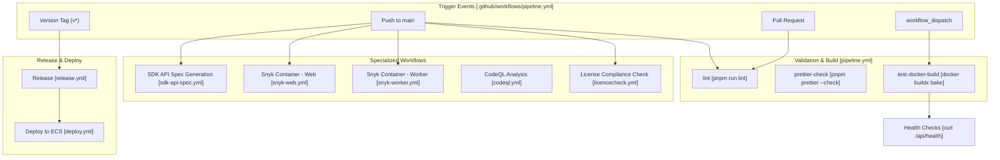
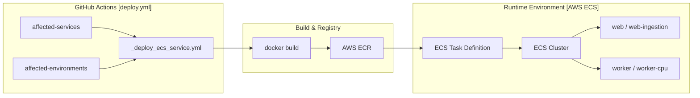

This page documents the development workflows, testing strategies, deployment processes, and operational monitoring for the Langfuse platform. It covers the CI/CD pipeline configuration, Docker containerization, test execution patterns, observability instrumentation, and database migration procedures.

For information about the monorepo structure and package organization, see [Monorepo Structure](#1.2). For technology stack details, see [Technology Stack](#1.3).

---

## CI/CD Pipeline

The CI/CD pipeline is implemented using GitHub Actions and executes comprehensive validation checks. The primary workflow is defined in `pipeline.yml`, which manages a complex matrix of tasks including linting, formatting checks, and service health validation within Docker environments.

### Pipeline Architecture

**Sources:** [.github/workflows/pipeline.yml:1-183](), [.github/workflows/sdk-api-spec.yml:1-9](), [.github/workflows/deploy.yml:1-38](), [.github/workflows/snyk-web.yml:1-4](), [.github/workflows/licencecheck.yml:1-10]()

### Automated SDK Generation
The pipeline includes an automated SDK generation step triggered by changes to the Fern API definitions in the `fern/` directory. The `sdk-api-spec.yml` workflow uses the `fern-api` CLI to generate updated TypeScript and Python SDKs and automatically opens Pull Requests in the respective `langfuse-js` and `langfuse-python` repositories. It also performs specific patches, such as fixing TypeScript re-export errors in the generated `AuthProvider` types.

**Sources:** [.github/workflows/sdk-api-spec.yml:42-101](), [.github/workflows/sdk-api-spec.yml:123-130]()

For details, see [CI/CD Pipeline](#11.1).

---

## Docker & Deployment

The system utilizes multi-stage Dockerfiles to optimize image size and security. Deployment is primarily targeted at AWS ECS via a reusable workflow architecture.

### Deployment Flow to AWS ECS

**Sources:** [.github/workflows/deploy.yml:38-118](), [.github/workflows/_deploy_ecs_service.yml:1-102]()

### Deployment Configuration
The `deploy.yml` workflow supports multiple environments (staging, prod-eu, prod-us, prod-hipaa, prod-jp) and services (web, worker, web-ingestion, web-iso, worker-cpu). It leverages `docker buildx bake` for local testing and standard `docker build` for ECS deployments, passing various build arguments for Sentry, PostHog, and Langfuse Cloud regions.

**Sources:** [.github/workflows/deploy.yml:19-28](), [.github/workflows/_deploy_ecs_service.yml:70-87]()

For details, see [Docker & Deployment](#11.2).

---

## Testing Strategy

Langfuse employs a multi-layered testing strategy. The `pipeline.yml` uses a `skip_check` step to avoid redundant testing of identical git trees by comparing the current tree SHA with prior successful runs.

### Test Environment
Local development and testing are supported via:
- **Docker Compose**: Running the full stack locally via `docker-compose.build.yml` for health check validation.
- **Turbo Cache**: Tasks like `test`, `typecheck`, and `lint` are optimized via `turbo.json` caching and global dependencies on `.env` files.
- **LLM Connection Tests**: Triggered specifically when `fetchLLMCompletion.ts` or related shared logic changes.
- **Playwright**: The `scripts/codex/setup.sh` includes `playwright:install` to ensure Chromium is available for frontend browser review and E2E testing.

**Sources:** [.github/workflows/pipeline.yml:35-54](), [.github/workflows/pipeline.yml:62-69](), [.github/workflows/pipeline.yml:154-183](), [turbo.json:3-69](), [scripts/codex/setup.sh:31-32]()

For details, see [Testing Strategy](#11.3).

---

## Observability & Monitoring

The platform is instrumented for deep observability using OpenTelemetry (OTEL) for distributed tracing and Snyk/CodeQL for security monitoring.

### Security Scanning
- **Snyk**: Scans Docker images for `web` and `worker` for vulnerabilities, outputting SARIF files to GitHub Code Scanning.
- **CodeQL**: Performs static analysis for JavaScript and TypeScript on every push to main and production.
- **Claude Review**: An automated workflow `claude-review-maintainer-prs.yml` triggers AI-powered reviews on maintainer Pull Requests.

**Sources:** [.github/workflows/snyk-web.yml:11-54](), [.github/workflows/codeql.yml:12-95](), [.github/workflows/claude-review-maintainer-prs.yml:1-17]()

For details, see [Observability & Monitoring](#11.4).

---

## Database Migrations

Database management involves dual schemas: PostgreSQL for relational metadata and ClickHouse for high-volume observability data.

### Migration Management
- **PostgreSQL**: Managed via Prisma. The `turbo.json` defines tasks like `db:migrate`, `db:deploy`, and `db:generate` for client synchronization.
- **ClickHouse**: Managed via specialized schema management scripts and migration helpers.
- **Release Promotion**: Changes are promoted from `main` to `production` branches via `release.yml`, which triggers the deployment of the updated schema and application code.

**Sources:** [turbo.json:14-51](), [.github/workflows/release.yml:1-25]()

For details, see [Database Migrations](#11.5).

---

## Version Management

Version synchronization is maintained across the monorepo using `pnpm` workspaces. The CI pipeline explicitly enforces specific versions of core tools to ensure reproducibility:
- **Node.js**: Version 24
- **pnpm**: Version 10.33.0

The `scripts/codex/setup.sh` script automates the environment setup by enabling `corepack`, preparing the specific `pnpm` version, and ensuring `.env` files exist before running `pnpm install`.

**Sources:** [.github/workflows/pipeline.yml:79-84](), [.github/workflows/sdk-api-spec.yml:28-36](), [scripts/codex/setup.sh:21-27]()