## Purpose and Scope

This document describes the evaluation system in Langfuse, which implements automated LLM-as-a-Judge evaluations for traces, observations, and dataset items. The system enables users to configure evaluation jobs that automatically score incoming data using LLM models.

For information about dataset management and experimentation workflows, see [Datasets & Experiments](#9.4). For details about the scoring data model and score configurations, see [Scores & Scoring](#9.2). For queue infrastructure and background job processing, see [Queue & Worker System](#7).

---

## System Overview

The evaluation system follows a three-stage pipeline: **Configuration → Job Creation → Job Execution**. Jobs are triggered by trace creation, dataset run item creation, or manual execution from the UI. The system uses BullMQ queues for asynchronous processing and supports multiple LLM providers through a unified adapter interface.

### Evaluation System Architecture

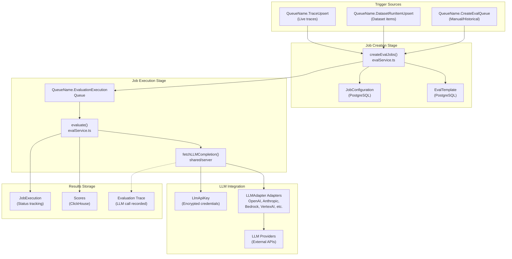

**Sources:** [worker/src/features/evaluation/evalService.ts:81-144](), [worker/src/queues/evalQueue.ts:25-116](), [worker/src/features/evaluation/evalService.ts:16-16]()

---

## Job Configuration Entities

Evaluation jobs are defined by two PostgreSQL entities: `JobConfiguration` and `EvalTemplate`.

### JobConfiguration

The `JobConfiguration` entity defines when and how evaluation jobs should be created.

| Field | Type | Purpose |
|-------|------|---------|
| `id` | string | Unique identifier |
| `projectId` | string | Project scope |
| `evalTemplateId` | string | References `EvalTemplate` |
| `status` | `JobConfigState` | ACTIVE/PAUSED/INACTIVE |
| `targetObject` | `EvalTargetObject` | TRACE/DATASET/EVENT/EXPERIMENT |
| `filter` | `singleFilter[]` | Filtering conditions (traces/dataset items) |
| `variableMapping` | JSON | Maps template variables to data sources |
| `timeScope` | `JobTimeScope[]` | NEW/EXISTING - controls historical execution |
| `sampling` | `Decimal` | Percentage of matching items to evaluate |
| `delay` | number | Milliseconds to wait before job execution |

**Sources:** [worker/src/features/evaluation/evalService.ts:3-9](), [worker/src/features/evaluation/evalService.ts:43-62](), [web/src/features/evals/server/router.ts:75-96]()

### EvalTemplate

The `EvalTemplate` entity defines the LLM evaluation prompt and scoring schema.

| Field | Type | Purpose |
|-------|------|---------|
| `id` | string | Unique identifier |
| `name` | string | Template name |
| `prompt` | string | Mustache template with variables |
| `outputDefinition` | JSON | `PersistedEvalOutputDefinitionSchema` |
| `provider` | string | LLM provider |
| `model` | string | Model name |
| `modelParams` | JSON | Model configuration (temperature, etc.) |

The `prompt` field uses Mustache syntax for variable substitution (e.g., `{{input}}`, `{{output}}`). The `outputDefinition` defines the expected structure of the LLM response, typically containing reasoning and score fields.

**Sources:** [worker/src/features/evaluation/evalService.ts:3-9](), [worker/src/features/evaluation/evalService.ts:44-62](), [worker/src/__tests__/evalService.test.ts:75-83](), [web/src/features/evals/server/router.ts:97-113]()

---

## Job Creation Pipeline

Job creation is triggered by three sources: trace upserts, dataset run item upserts, and manual execution from the UI. The `createEvalJobs` function handles all three cases.

### Job Creation Flow

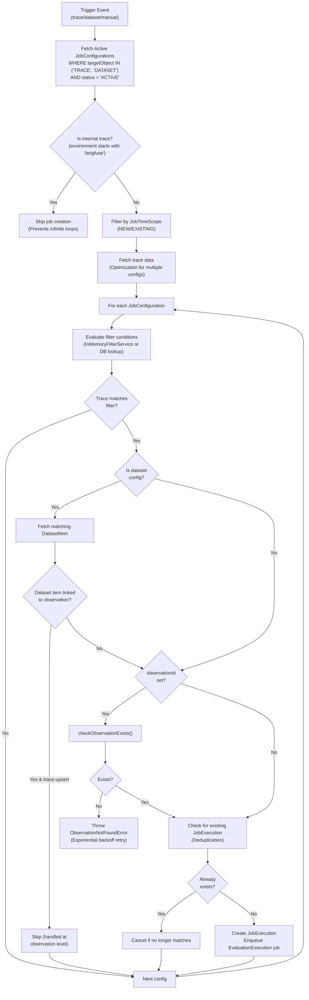

**Sources:** [worker/src/features/evaluation/evalService.ts:81-144](), [worker/src/queues/evalQueue.ts:25-116]()

### Trace Filter Evaluation

The system supports two filter evaluation strategies:

1. **In-memory filtering**: When all filter conditions can be checked against cached trace data, the system uses `InMemoryFilterService` for fast evaluation.
2. **Database lookup**: When filters reference fields requiring database joins (e.g., specific tags or complex metadata), the system falls back to `checkTraceExistsAndGetTimestamp()`.

The `requiresDatabaseLookup()` function determines which strategy to use based on the filter columns defined in `traceFilterUtils`.

**Sources:** [worker/src/features/evaluation/evalService.ts:23-41](), [worker/src/__tests__/evalService.test.ts:35-35]()

---

## Job Execution Pipeline

Job execution is handled by the `evaluate()` function, which processes `EvaluationExecution` queue jobs.

### Execution Flow

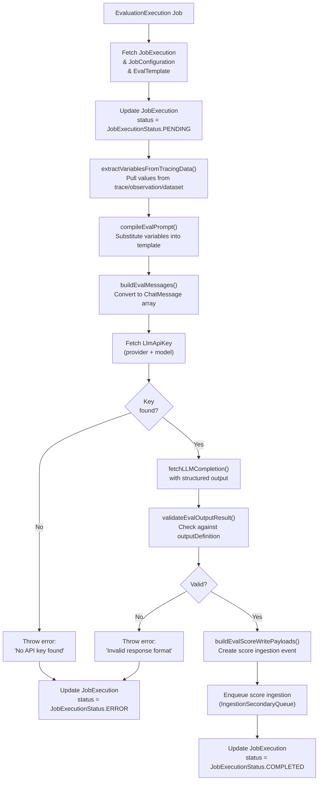

**Sources:** [worker/src/features/evaluation/evalService.ts:16-16](), [worker/src/features/evaluation/evalService.ts:60-74](), [worker/src/queues/evalQueue.ts:176-176]()

### Variable Extraction

The `extractVariablesFromTracingData()` function pulls values from multiple data sources based on `variableMapping`. It supports `trace`, `dataset_item`, and various observation types like `generation`, `span`, and `tool`.

**Variable Sources:**
- `trace.*`: Trace-level fields (input, output, metadata).
- `observation[name='x'].*`: Observation fields filtered by name.
- `dataset_item.*`: Dataset item fields (input, expected_output).

The system returns `ExtractedVariable` objects which are then used by `compileEvalPrompt` to populate the Mustache template.

**Sources:** [worker/src/features/evaluation/evalService.ts:33-34](), [worker/src/features/evaluation/evalService.ts:69-79](), [worker/src/__tests__/evalService.test.ts:33-34]()

---

## LLM Integration Layer

The evaluation system integrates with LLM providers through a unified abstraction, supporting encryption and structured outputs.

### LLM API Key Management

LLM credentials are stored in the `LlmApiKey` table with encryption. The system validates model configurations before job execution. If an LLM call fails with a non-retryable error, `blockEvaluatorConfigs` can be used to prevent further executions of that configuration.

**Sources:** [worker/src/features/evaluation/evalService.ts:34-36](), [worker/src/queues/evalQueue.ts:14-15]()

---

## Queue Architecture

The evaluation system uses a sharded queue architecture to handle high volumes of evaluations.

| Queue Name | Processor | Purpose |
|------------|-----------|---------|
| `QueueName.TraceUpsert` | `evalJobTraceCreatorQueueProcessor` | Triggers evals for live traces |
| `QueueName.DatasetRunItemUpsert` | `evalJobDatasetCreatorQueueProcessor` | Triggers evals for dataset items |
| `QueueName.CreateEvalQueue` | `evalJobCreatorQueueProcessor` | Triggers evals for historical data |
| `QueueName.EvaluationExecution` | `evalJobExecutorQueueProcessorBuilder` | Executes LLM calls |
| `QueueName.EvaluationExecutionSecondaryQueue` | Same as above | Secondary queue for specific projects |

**Sources:** [worker/src/queues/evalQueue.ts:25-155](), [worker/src/queues/evalQueue.ts:118-121]()

---

## Error Handling and Retries

The system implements sophisticated retry logic, distinguishing between rate limits, missing data, and unrecoverable configuration errors.

### Retry Logic

- **LLM Rate Limits**: If a 429 or 5xx error occurs, `retryLLMRateLimitError` reschedules the job with a manual delay if the job is less than 24 hours old.
- **Observation Not Found**: If an observation isn't yet available, `retryObservationNotFound` implements an exponential backoff.
- **Unrecoverable Errors**: Errors like invalid schemas or missing API keys mark the `JobExecution` as `ERROR` and stop retries.
- **Config Blocking**: Repeated failures can lead to the `JobConfiguration` being blocked via `blockEvaluatorConfigs` to prevent resource waste.

**Sources:** [worker/src/queues/evalQueue.ts:19-21](), [worker/src/queues/evalQueue.ts:178-223](), [worker/src/features/evaluation/evalService.ts:34-36]()

---

## Annotation Queues

Human-in-the-loop evaluations are managed via `AnnotationQueue` and `AnnotationQueueItem`. These allow manual scoring of traces and observations by assigned users. Items track status and can be filtered and managed through the web UI.

**Sources:** [web/src/components/session/index.tsx:35-41](), [web/src/features/evals/components/evaluator-table.tsx:132-145]()

# Evaluation Overview


The Langfuse evaluation system enables automated assessment of LLM outputs using the LLM-as-Judge pattern. The system allows users to define evaluation criteria, configure when evaluations run, and automatically execute evaluations against traces, observations, and dataset experiments.

This page provides a high-level overview of the evaluation workflow. For detailed information on specific components:
- Configuration settings and filters: see page 10.2 Job Configuration
- Job creation pipeline and deduplication: see page 10.3 Job Creation Pipeline
- Job execution lifecycle and error handling: see page 10.4 Job Execution
- LLM provider integration and calling logic: see page 10.5 LLM Integration
- Human-in-the-loop annotation workflows: see page 10.6 Annotation Queues
- LLM API key management and encryption: see page 10.7 LLM API Key Management
- Playground UI for testing evaluations: see page 10.8 LLM Playground

**Sources:** [worker/src/features/evaluation/evalService.ts:81-105](), [web/src/features/evals/server/router.ts:75-114]()

---

## Core Components

The evaluation system operates through three primary database entities defined in the Prisma schema and synchronized with ClickHouse for analytical scoring.

**Diagram: Database Entity Relationships**

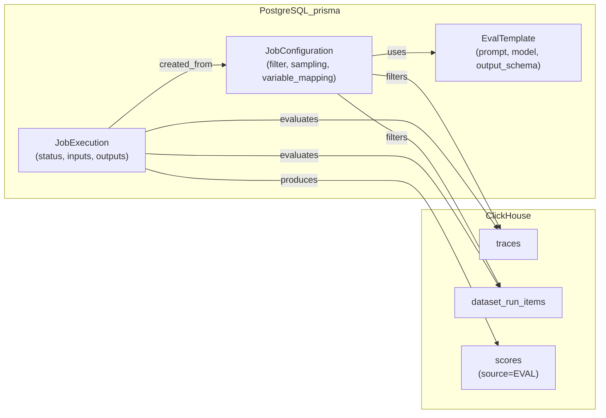

**Sources:** [worker/src/features/evaluation/evalService.ts:3-9](), [web/src/features/evals/server/router.ts:75-114]()

| Component | Purpose | Key Code Symbols |
|-----------|---------|------------|
| `EvalTemplate` | Defines the evaluation logic (LLM prompt, model parameters, and output schema) | `EvalTemplate` [worker/src/features/evaluation/evalService.ts:8]() |
| `JobConfiguration` | Defines when and how evaluations run (filters, sampling, mapping) | `JobConfiguration` [worker/src/features/evaluation/evalService.ts:7]() |
| `JobExecution` | Tracks individual evaluation instances and their status | `JobExecution` [worker/src/features/evaluation/evalService.ts:6]() |

The template defines *what* to evaluate, the configuration defines *when* and *where* to evaluate, and the execution tracks each evaluation run.

**Sources:** [worker/src/features/evaluation/evalService.ts:3-9](), [web/src/features/evals/server/router.ts:75-114]()

---

## Evaluation Workflow

The evaluation system follows a four-stage workflow: configuration → job creation → execution → scoring.

**Diagram: End-to-End Evaluation Workflow**

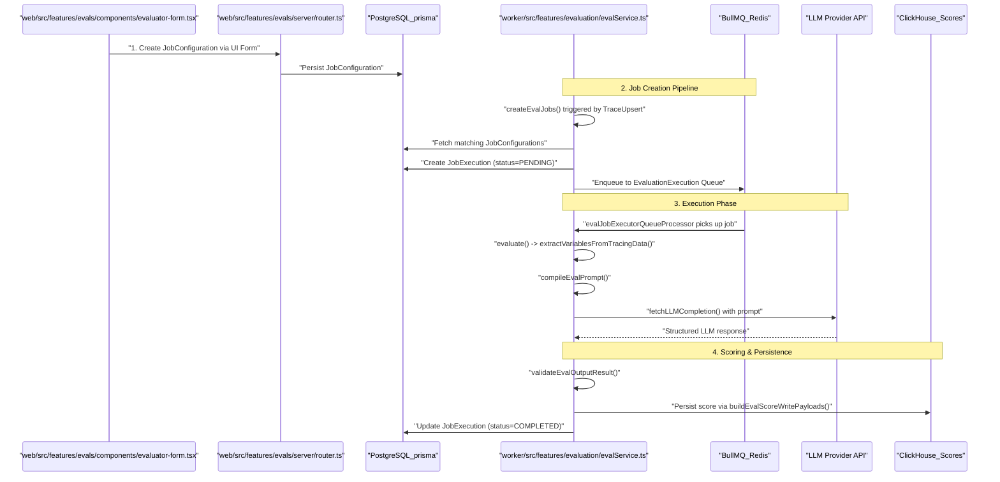

**Sources:** [worker/src/features/evaluation/evalService.ts:81-144](), [worker/src/queues/evalQueue.ts:127-176](), [web/src/features/evals/server/router.ts:155-170]()

### Stage 1: Configuration

Users create a `JobConfiguration` via the `EvaluatorForm` [web/src/features/evals/components/evaluator-form.tsx:53](). This configuration includes:
- **Target**: Whether to evaluate a `TRACE`, `DATASET`, `OBSERVATION`, or `EXPERIMENT` [web/src/features/evals/server/router.ts:28]().
- **Filters**: Criteria matching specific traces or observations [web/src/features/evals/server/router.ts:160]().
- **Variable Mapping**: Mapping trace/observation fields to prompt variables using `variableMapping` or `observationVariableMapping` [web/src/features/evals/server/router.ts:162-165]().
- **Sampling**: A value between 0 and 1 for randomized evaluation [web/src/features/evals/server/router.ts:166]().

**Sources:** [web/src/features/evals/server/router.ts:155-170](), [worker/src/features/evaluation/evalService.ts:44-51]()

### Stage 2: Job Creation

The `createEvalJobs` function [worker/src/features/evaluation/evalService.ts:29]() is the entry point for the pipeline. It is triggered by three main queue processors:
1. `evalJobTraceCreatorQueueProcessor`: Handles live trace ingestion (`QueueName.TraceUpsert`) [worker/src/queues/evalQueue.ts:25-34]().
2. `evalJobDatasetCreatorQueueProcessor`: Handles dataset run items (`QueueName.DatasetRunItemUpsert`) [worker/src/queues/evalQueue.ts:46-55]().
3. `evalJobCreatorQueueProcessor`: Handles manual/historical batch creation from the UI (`QueueName.CreateEvalQueue`) [worker/src/queues/evalQueue.ts:98-106]().

The pipeline performs filter matching and creates `JobExecution` records in PostgreSQL before enqueuing to the `EvaluationExecution` queue [worker/src/queues/evalQueue.ts:127]().

**Sources:** [worker/src/queues/evalQueue.ts:25-127](), [worker/src/features/evaluation/evalService.ts:81-144]()

### Stage 3: Job Execution

The `evalJobExecutorQueueProcessorBuilder` [worker/src/queues/evalQueue.ts:118]() generates processors for execution jobs. The core logic resides in the `evaluate` function [worker/src/features/evaluation/evalService.ts:176]():
1. **Data Extraction**: `extractVariablesFromTracingData` [worker/src/__tests__/evalService.test.ts:33]() retrieves the necessary inputs from tracing data.
2. **Prompt Compilation**: `compileEvalPrompt` [worker/src/features/evaluation/evalService.ts:69]() injects variables into the `EvalTemplate`.
3. **LLM Call**: Uses `fetchLLMCompletion` [worker/src/__tests__/evalService.test.ts:49]() to get a response from configured providers.
4. **Validation**: `validateEvalOutputResult` [worker/src/features/evaluation/evalService.ts:61]() ensures the LLM output conforms to the expected `ScoreDataTypeEnum` [worker/src/features/evaluation/evalService.ts:60]().

**Sources:** [worker/src/features/evaluation/evalService.ts:61-73](), [worker/src/queues/evalQueue.ts:118-177]()

### Stage 4: Scoring

Once evaluated, the system creates score payloads using `buildEvalScoreWritePayloads` [worker/src/features/evaluation/evalService.ts:74](). These scores are eventually written to ClickHouse and appear in the `EvalLogTable`.

**Sources:** [worker/src/features/evaluation/evalService.ts:74]()

---

## Integration with Traces and Datasets

The evaluation system supports multiple `EvalTargetObject` types to allow granular assessment:

| Target | Description | Code Constant |
|--------|-------------|---------------|
| `TRACE` | Evaluates an entire trace context | `EvalTargetObject.TRACE` [web/src/features/evals/server/router.ts:28]() |
| `DATASET` | Evaluates a single `dataset_item` | `EvalTargetObject.DATASET` [web/src/features/evals/server/router.ts:28]() |
| `OBSERVATION` | Evaluates individual spans/generations | `EvalTargetObject.OBSERVATION` [web/src/features/evals/server/router.ts:28]() |

### Live vs Historical Evaluation

The `timeScope` parameter determines the execution timing:
- **NEW**: Triggered immediately upon ingestion of new data (live evaluation) [worker/src/queues/evalQueue.ts:33]().
- **EXISTING**: Triggered manually via the UI for historical backfills [worker/src/queues/evalQueue.ts:103]().

**Sources:** [worker/src/queues/evalQueue.ts:33-103](), [web/src/features/evals/server/router.ts:168]()

---

## Error Handling & Reliability

The system implements robust error handling for LLM calls:
- **Retryable Errors**: `isLLMCompletionError` [worker/src/features/evaluation/evalService.ts:34]() identifies 429 (Rate Limit) and 5xx (Server Error) to trigger re-enqueuing with exponential backoff [worker/src/queues/evalQueue.ts:185-201]().
- **Unrecoverable Errors**: `UnrecoverableError` [worker/src/features/evaluation/evalService.ts:66]() marks the `JobExecution` as `ERROR` and stops retries.
- **Config Blocking**: If an evaluator consistently fails (e.g., due to invalid model parameters), it is blocked using `blockEvaluatorConfigs` [worker/src/features/evaluation/evalService.ts:35]() with a specific `EvaluatorBlockReason` [worker/src/features/evaluation/evalService.ts:55]().

**Sources:** [worker/src/queues/evalQueue.ts:178-201](), [worker/src/features/evaluation/evalService.ts:34-36](), [worker/src/features/evaluation/evalService.ts:55-57]()

# Job Configuration


## Purpose and Scope

Job configurations define when and how LLM-as-a-judge evaluations are triggered in response to traces, observations, and dataset runs. A job configuration specifies filtering criteria, variable mapping, sampling rates, execution delays, and target objects for automated evaluation.

The system uses a dual-service architecture where the Web service manages configuration via a tRPC API, and the Worker service orchestrates job creation and execution via BullMQ queues.

---

## Database Schema

### JobConfiguration Table

The `JobConfiguration` model in Prisma defines the structure for evaluation triggers. The configuration is validated and stored via the `evals` router:

| Field | Type | Description |
|-------|------|-------------|
| `id` | String | Unique identifier (cuid) |
| `projectId` | String | Project this config belongs to |
| `jobType` | JobType | Currently always `EVAL` |
| `status` | JobConfigState | `ACTIVE`, `INACTIVE`, or `PAUSED` [[web/src/features/evals/components/evaluator-table.tsx:133-133]]() |
| `evalTemplateId` | String | References the LLM prompt template |
| `scoreName` | String | Name of the resulting score in Langfuse [[web/src/features/evals/utils/evaluator-form-utils.ts:16-16]]() |
| `filter` | Json | Array of `singleFilter` objects [[web/src/features/evals/utils/evaluator-form-utils.ts:18-18]]() |
| `targetObject` | String | Entity to evaluate (e.g., "trace", "event") [[packages/shared/src/features/evals/types.ts:3-8]]() |
| `variableMapping` | Json | Maps trace/observation data to template variables [[packages/shared/src/features/evals/types.ts:63-84]]() |
| `sampling` | Decimal | Probability (0.0 to 1.0) [[web/src/features/evals/utils/evaluator-form-utils.ts:20-20]]() |
| `delay` | Int | Seconds to wait before execution (default 10s) [[web/src/features/evals/utils/evaluator-form-utils.ts:21-21]]() |
| `timeScope` | JobTimeScope[] | `NEW` (live) or `EXISTING` (backfill) [[packages/shared/src/features/evals/types.ts:199-202]]() |

**Sources:** [[packages/shared/src/features/evals/types.ts:3-13]](), [[web/src/features/evals/utils/evaluator-form-utils.ts:15-24]]()

---

## Target Objects

Job configurations specify which entity type to evaluate via the `EvalTargetObject` enum.

| Target | Description | Code Entity |
|--------|-------------|-------------|
| `trace` | Evaluates the entire trace context. | `EvalTargetObject.TRACE` [[packages/shared/src/features/evals/types.ts:4-4]]() |
| `dataset` | Evaluates dataset run items. | `EvalTargetObject.DATASET` [[packages/shared/src/features/evals/types.ts:5-5]]() |
| `event` | Evaluates specific observations (spans/generations). | `EvalTargetObject.EVENT` [[packages/shared/src/features/evals/types.ts:6-6]]() |
| `experiment` | Evaluates items within an experiment run. | `EvalTargetObject.EXPERIMENT` [[packages/shared/src/features/evals/types.ts:7-7]]() |

**Sources:** [[packages/shared/src/features/evals/types.ts:3-13]](), [[web/src/features/evals/utils/evaluator-form-utils.ts:53-66]]()

---

## Configuration Lifecycle

The following diagram maps the UI interaction in the "Natural Language Space" to the underlying "Code Entity Space" in the Web application, specifically focusing on the form validation and submission.

Title: Evaluator Configuration Data Flow
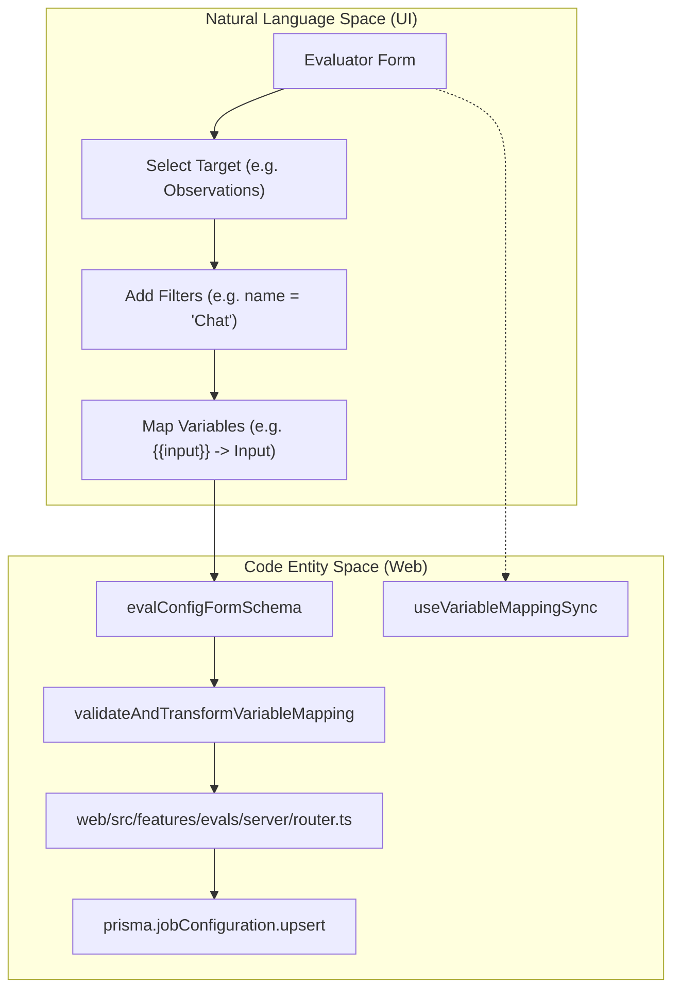

**Sources:** [[web/src/features/evals/utils/evaluator-form-utils.ts:15-24]](), [[web/src/features/evals/utils/variable-mapping-validation.ts:1-5]](), [[web/src/features/evals/hooks/useVariableMappingSync.ts:1-5]]()

---

## Variable Mapping

Variable mapping bridges Langfuse's internal data (traces/observations) and the input variables required by an `EvalTemplate`.

### Mapping Types
1.  **Standard Mapping (`variableMapping`):** Used for Traces and Datasets. Requires `langfuseObject` (e.g., "span", "generation") and `objectName` to identify which specific observation within a trace to extract from [[packages/shared/src/features/evals/types.ts:63-82]]().
2.  **Observation Mapping (`observationVariableMapping`):** Simplified for `EVENT` and `EXPERIMENT` targets. Since the observation is already targeted directly, `objectName` and `langfuseObject` are omitted [[packages/shared/src/features/evals/types.ts:207-211]]().

### Available Columns
Extraction columns are categorized by the source object:
- **Observation Columns:** `input`, `output`, `metadata` [[packages/shared/src/features/evals/types.ts:97-106]]().
- **Trace Columns:** `input`, `output`, `metadata` [[packages/shared/src/features/evals/types.ts:162-171]]().
- **Dataset Item Columns:** `input`, `expected_output`, `metadata` [[packages/shared/src/features/evals/types.ts:177-192]]().

JSON selectors can be used to extract nested fields from these columns [[packages/shared/src/features/evals/types.ts:71-71]]().

**Sources:** [[packages/shared/src/features/evals/types.ts:63-82]](), [[packages/shared/src/features/evals/types.ts:97-173]](), [[packages/shared/src/features/evals/types.ts:207-211]]()

---

## Filtering and Sampling

### Filter Implementation
Filters are defined using `singleFilter` and are applied to the target object [[web/src/features/evals/utils/evaluator-form-utils.ts:18-18]](). In the UI, `PopoverFilterBuilder` is used to configure these [[web/src/features/filters/components/filter-builder.tsx:81-100]](). Certain filters (like those requiring attribute propagation) show warnings if the project's SDK version is insufficient [[web/src/features/evals/components/inner-evaluator-form.tsx:110-144]]().

### Sampling Logic
Sampling is a number between 0 and 1 representing the probability of a match being evaluated [[web/src/features/evals/utils/evaluator-form-utils.ts:20-20]]().

Title: Evaluation Filtering and Sampling Pipeline
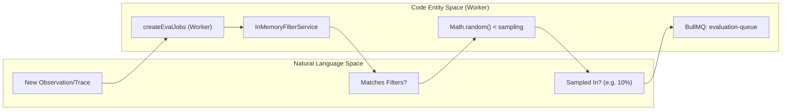

**Sources:** [[web/src/features/evals/utils/evaluator-form-utils.ts:20-20]](), [[web/src/features/evals/components/inner-evaluator-form.tsx:41-41]](), [[web/src/features/filters/components/filter-builder.tsx:137-142]]()

---

## Operational Controls

### Status and Callouts
Evaluators can be `ACTIVE`, `INACTIVE`, or `PAUSED`.
- **Legacy Callouts:** The UI displays `EvalVersionCallout` or `LegacyEvalCallout` to encourage users to migrate from trace-level evaluations to more granular observation-level evaluations [[web/src/features/evals/components/eval-version-callout.tsx:113-130]]() [[web/src/features/evals/components/legacy-eval-callout.tsx:1-5]]().
- **SDK Verification:** For `EVENT` targets, the system checks for SDK compatibility (JS SDK v4+, Python SDK v3+) [[web/src/features/evals/components/eval-version-callout.tsx:36-53]]().

### Time Scope
The `timeScope` determines if the job runs for:
- `NEW`: Live incoming data [[packages/shared/src/features/evals/types.ts:199-202]]().
- `EXISTING`: Historical data (backfill) [[packages/shared/src/features/evals/types.ts:199-202]]().

### UI Previews
The configuration form includes a `TracesPreview` or `ObservationsPreview` component that samples the last 24 hours of data matching the current filter state to help users verify their configuration before saving [[web/src/features/evals/components/inner-evaluator-form.tsx:158-204]]().

**Sources:** [[web/src/features/evals/components/eval-version-callout.tsx:1-130]](), [[packages/shared/src/features/evals/types.ts:199-202]](), [[web/src/features/evals/components/inner-evaluator-form.tsx:158-204]]()

# Job Creation Pipeline


This page documents how evaluation jobs are created when traces, observations, or dataset run items are ingested. It covers the queue processors that receive trigger events, the `createEvalJobs` function that determines which evaluators apply, the filtering and validation logic, and how `JobExecution` records are created and handed off to the execution queue.

For how evaluators are configured in the first place, see [Job Configuration](10.2). For how the created `JobExecution` records are actually run (LLM calls, score writing), see [Job Execution](10.4).

---

## Overview

The evaluation job creation pipeline activates whenever a new trace, observation, or dataset run item is processed. It answers the question: *given this new data, which active evaluator configurations should produce a job execution?*

The pipeline is fully asynchronous. It runs inside the worker process, driven by BullMQ queues. The main entry point is the `createEvalJobs` function in `worker/src/features/evaluation/evalService.ts` [[worker/src/features/evaluation/evalService.ts:81-93]]().

**Trigger sources**

| Source Queue | Event Type | Processor Function | Enforced Time Scope |
|---|---|---|---|
| `TraceUpsert` | `TraceQueueEventType` | `evalJobTraceCreatorQueueProcessor` | `NEW` |
| `DatasetRunItemUpsert` | `DatasetRunItemUpsertEventType` | `evalJobDatasetCreatorQueueProcessor` | `NEW` |
| `CreateEvalQueue` | `CreateEvalQueueEventType` | `evalJobCreatorQueueProcessor` | none |

The `CreateEvalQueue` is used when a user configures a new evaluator via the UI and selects "run on existing data" — this bypasses the `NEW`-only restriction [[worker/src/queues/evalQueue.ts:98-116]]().

Sources: [worker/src/queues/evalQueue.ts:25-116]()

---

## End-to-End Flow

**Diagram: Job Creation Pipeline — Queue to Database**

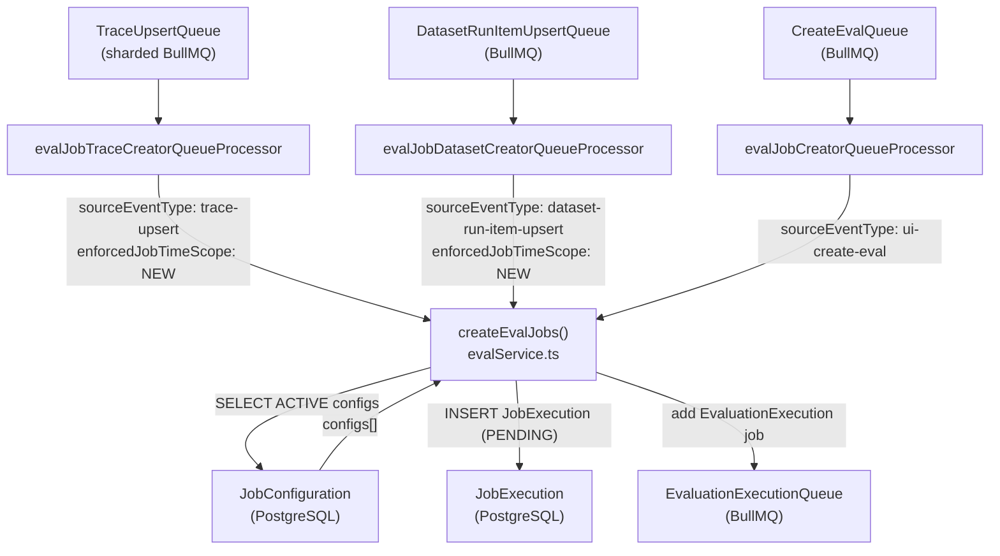

Sources: [worker/src/queues/evalQueue.ts:25-116](), [worker/src/features/evaluation/evalService.ts:81-685]()

---

## Queue Processors

Three processors in `worker/src/queues/evalQueue.ts` bridge the BullMQ jobs to the `createEvalJobs` function.

### `evalJobTraceCreatorQueueProcessor`

Consumes jobs from the `TraceUpsert` queue. Passes `enforcedJobTimeScope: "NEW"` so that evaluator configurations restricted to historical data (`EXISTING` only) are skipped [[worker/src/queues/evalQueue.ts:25-35]](). Any error is logged and re-thrown so BullMQ can retry [[worker/src/queues/evalQueue.ts:36-43]]().

### `evalJobDatasetCreatorQueueProcessor`

Consumes jobs from the `DatasetRunItemUpsert` queue. Also enforces `NEW` time scope [[worker/src/queues/evalQueue.ts:46-56]](). Includes special handling for `ObservationNotFoundError`: when an observation linked to a dataset item has not yet propagated to ClickHouse, the processor schedules a manual delayed retry via `retryObservationNotFound` rather than failing [[worker/src/queues/evalQueue.ts:59-86]]().

### `evalJobCreatorQueueProcessor`

Consumes jobs from the `CreateEvalQueue`. Does **not** enforce a time scope, allowing historical evaluations to proceed. This queue is triggered when a user saves a new evaluator configuration via the UI [[worker/src/queues/evalQueue.ts:98-116]]().

Sources: [worker/src/queues/evalQueue.ts:25-116]()

---

## `createEvalJobs` — Detailed Logic

The function signature accepts a union type covering all three source event types:

```typescript
createEvalJobs({
  event,
  sourceEventType,
  jobTimestamp,
  enforcedJobTimeScope?,
})
```

[[worker/src/features/evaluation/evalService.ts:81-172]]()

### Step 1: Fetch Active Configurations

A Kysely query fetches all `ACTIVE` `JobConfiguration` rows for the project with `job_type = 'EVAL'` and `target_object IN ('TRACE', 'DATASET', 'EXPERIMENT')` [[worker/src/features/evaluation/evalService.ts:179-205]]().

If `configId` is present on the event (UI-triggered path), only that specific configuration is fetched. If `enforcedJobTimeScope` is set, the query adds a filter for `time_scope @> ARRAY['NEW']` [[worker/src/features/evaluation/evalService.ts:218-220]]().

If no active configurations exist, the project ID is written to a Redis no-config cache (`setNoEvalConfigsCache`) to avoid redundant database lookups on subsequent events [[worker/src/features/evaluation/evalService.ts:211-217]]().

### Step 2: Skip Internal Traces

For `trace-upsert` events, any trace whose environment matches the `LangfuseInternalTraceEnvironment` (e.g., traces generated by the evaluation system itself) is skipped [[worker/src/features/evaluation/evalService.ts:240-250]](). This prevents infinite evaluation loops.

### Step 3: Batch Optimization Fetches

Before iterating over configurations, the function performs optional batch fetches to reduce per-config database queries:

| Condition | Fetch | Cache Variable |
|---|---|---|
| More than 1 config total | `getTraceById(traceId, projectId)` | `cachedTrace` [[worker/src/features/evaluation/evalService.ts:257-272]]() |
| More than 1 dataset config | `getDatasetItemIdsByTraceIdCh(traceId)` | `cachedDatasetItemIds` [[worker/src/features/evaluation/evalService.ts:303-317]]() |

It also fetches all existing `job_executions` for the trace across all config IDs in a single query, stored in `allExistingJobs` [[worker/src/features/evaluation/evalService.ts:322-351]]().

### Step 4: Per-Configuration Loop

For each active configuration, the following logic runs:

**Diagram: Per-Config Decision Tree**

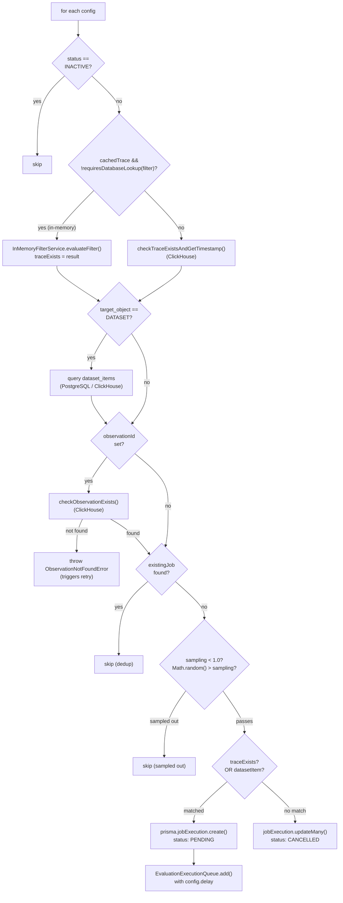

Sources: [worker/src/features/evaluation/evalService.ts:371-684]()

#### 4a. Trace Existence Check

For each config, the function verifies that the referenced trace exists and matches the config's filter conditions.

- **In-memory path**: If `cachedTrace` is available and all filter columns can be evaluated in memory (via `requiresDatabaseLookup()` in `worker/src/features/evaluation/traceFilterUtils.ts` [[worker/src/features/evaluation/traceFilterUtils.ts:35-41]]()), `InMemoryFilterService.evaluateFilter()` is called [[worker/src/features/evaluation/evalService.ts:391-419]]().
- **Database path**: Falls back to `checkTraceExistsAndGetTimestamp()`, a ClickHouse query that applies filter conditions and returns the trace timestamp [[worker/src/features/evaluation/evalService.ts:421-444]]().

#### 4b. Dataset Item Lookup (Dataset Configs Only)

If `target_object === 'DATASET'`:
- When the event contains a `datasetItemId`, the function queries `dataset_items` in PostgreSQL using filter conditions [[worker/src/features/evaluation/evalService.ts:474-508]]().
- Otherwise, it resolves from `cachedDatasetItemIds` or queries ClickHouse [[worker/src/features/evaluation/evalService.ts:510-532]]().

#### 4c. Observation Existence Check

When an `observationId` is present, `checkObservationExists()` queries ClickHouse. If not found, an `ObservationNotFoundError` is thrown, triggering a delayed retry in the processor [[worker/src/features/evaluation/evalService.ts:551-573]]().

#### 4d. Deduplication

The function checks `allExistingJobs` for a matching `(job_configuration_id, job_input_trace_id, job_input_dataset_item_id, job_input_observation_id)` tuple. If a match exists, the config is skipped [[worker/src/features/evaluation/evalService.ts:576-595]]().

#### 4e. Sampling

If the config's `sampling` value is less than `1.0`, a random number is drawn. If `Math.random() > sampling`, the job is skipped [[worker/src/features/evaluation/evalService.ts:598-607]]().

#### 4f. Job Execution Creation and Enqueueing

When all checks pass:
1. `prisma.jobExecution.create()` inserts a record with `status: "PENDING"` [[worker/src/features/evaluation/evalService.ts:613-633]]().
2. `EvaluationExecutionQueue.getInstance()?.add(...)` enqueues the job with `config.delay` [[worker/src/features/evaluation/evalService.ts:636-655]]().

Sources: [worker/src/features/evaluation/evalService.ts:371-684]()

---

## Variable Extraction for Observation Evaluations

When an evaluation is targeted at an individual observation (LLM-as-a-judge), the system must extract specific fields from the observation to populate the evaluation prompt. This is handled by `extractObservationVariables` [[worker/src/features/evaluation/observationEval/extractObservationVariables.ts:40-43]]().

### JSON Selector Logic
The system supports complex extraction using JSONPath selectors. This is particularly useful for extracting specific keys from `input`, `output`, or `metadata` blobs.
- **Lazy Parsing**: Fields are only parsed as JSON if a selector is present [[worker/src/features/evaluation/observationEval/extractObservationVariables.ts:47-53]]().
- **Multi-Encoded JSON**: The utility `extractValueFromObject` handles cases where data might be double-encoded as a JSON string [[packages/shared/src/features/evals/utilities.ts:35-53]]().
- **JSONPath Results**: If a selector matches a single element, it returns the unwrapped value; if it matches multiple (e.g., using a wildcard `[*].role`), it returns the full array [[packages/shared/src/features/evals/utilities.ts:71-73]]().

Sources: [worker/src/features/evaluation/observationEval/extractObservationVariables.ts:40-111](), [packages/shared/src/features/evals/utilities.ts:76-114]()

---

## Data Model: JobExecution Record

The `JobExecution` record created at the end of the pipeline contains:

| Field | Description |
|---|---|
| `id` | Random UUID [[worker/src/features/evaluation/evalService.ts:614]]() |
| `projectId` | From source event [[worker/src/features/evaluation/evalService.ts:615]]() |
| `jobConfigurationId` | Linked evaluator configuration [[worker/src/features/evaluation/evalService.ts:616]]() |
| `jobInputTraceId` | The trace being evaluated [[worker/src/features/evaluation/evalService.ts:617]]() |
| `status` | Initialized to `PENDING` [[worker/src/features/evaluation/evalService.ts:620]]() |
| `jobInputDatasetItemId` | Dataset item ID (if applicable) [[worker/src/features/evaluation/evalService.ts:626]]() |
| `jobInputObservationId` | Observation ID (if applicable) [[worker/src/features/evaluation/evalService.ts:627]]() |

Sources: [worker/src/features/evaluation/evalService.ts:613-633]()

---

## Relationship to Other Queues

**Diagram: Queue Topology Around Eval Job Creation**

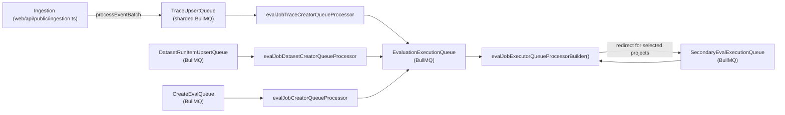

Sources: [worker/src/queues/evalQueue.ts:118-265](), [worker/src/features/evaluation/evalService.ts:636-655](), [worker/src/queues/evalQueue.ts:25-116]()

The `EvaluationExecutionQueue` consumer picks up the created `JobExecution` records and runs the actual LLM-as-judge logic. The `SecondaryEvalExecutionQueue` provides throughput isolation for high-volume projects [[worker/src/queues/evalQueue.ts:122-157]]().

---

## Error Handling Summary

| Error Type | Handling |
|---|---|
| No active configs | Cache miss written to Redis; returns early [[worker/src/features/evaluation/evalService.ts:211-217]]() |
| Internal Langfuse trace | Skipped silently [[worker/src/features/evaluation/evalService.ts:240-250]]() |
| Trace not found in ClickHouse | `traceExists = false`; existing job cancelled [[worker/src/features/evaluation/evalService.ts:657-679]]() |
| Observation not found | `ObservationNotFoundError` caught; scheduled for retry [[worker/src/queues/evalQueue.ts:59-86]]() |
| General error | Re-thrown to BullMQ for standard exponential backoff [[worker/src/queues/evalQueue.ts:42]]() |

Sources: [worker/src/queues/evalQueue.ts:36-96](), [worker/src/features/evaluation/evalService.ts:207-217](), [worker/src/features/evaluation/evalService.ts:240-250](), [worker/src/features/evaluation/evalService.ts:563-573]()

# Job Execution


This page documents the execution phase of evaluation jobs in Langfuse's LLM-as-a-judge evaluation system. It covers how queued evaluation jobs are processed, variables are extracted from tracing data, prompts are compiled, LLM calls are made, and errors are handled.

## Job Execution Lifecycle

Evaluation jobs progress through several states during their lifecycle, managed by the `JobExecution` model in PostgreSQL.

Title: Job Execution State Machine
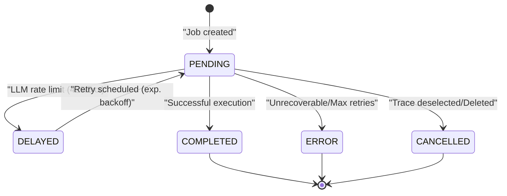

**Job Execution Lifecycle States**

| State | Description |
|-------|-------------|
| `PENDING` | Job is queued and waiting to be processed by a worker. |
| `DELAYED` | Job encountered a retryable error (e.g., LLM rate limit) and is scheduled for retry. |
| `COMPLETED` | Job executed successfully and the resulting score was persisted. |
| `ERROR` | Job failed with an unrecoverable error or exceeded maximum retry attempts. |
| `CANCELLED` | Job was cancelled, typically because the underlying trace no longer matches filters. |

Sources: `[worker/src/features/evaluation/evalService.ts:4-9]()`, `[worker/src/queues/evalQueue.ts:178-201]()`

## Queue Processors

The worker service uses BullMQ processors to handle the execution of evaluation jobs. The system differentiates between job creation (triggered by ingestion) and job execution (the LLM call).

Title: Evaluation Queue Processing Flow
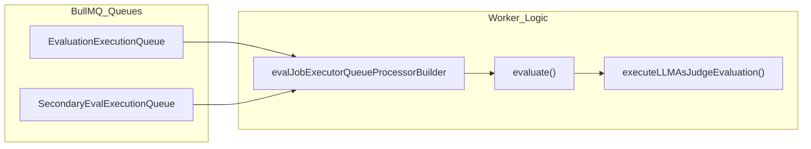

### Execution Routing
The `evalJobExecutorQueueProcessorBuilder` creates the processor for evaluation execution. It supports a secondary queue for high-volume projects to prevent "noisy neighbor" issues.

- **Redirection Logic**: If `enableRedirectToSecondaryQueue` is true and the `projectId` is in the `LANGFUSE_SECONDARY_EVAL_EXECUTION_QUEUE_ENABLED_PROJECT_IDS` environment variable, the job is moved to the `SecondaryEvalExecutionQueue` via `SecondaryEvalExecutionQueue.getInstance()`. `[worker/src/queues/evalQueue.ts:132-157]()`
- **Instrumentation**: Each job execution is wrapped in OpenTelemetry spans using `instrumentAsync`, capturing `jobExecutionId` and `projectId` as attributes. `[worker/src/queues/evalQueue.ts:159-174]()`, `[worker/src/features/evaluation/evalService.ts:26-26]()`

Sources: `[worker/src/queues/evalQueue.ts:118-157]()`, `[worker/src/queues/evalQueue.ts:176-177]()`, `[worker/src/features/evaluation/evalService.ts:26-26]()`

## Trace-Level Evaluation Execution

The `evaluate()` function in `evalService.ts` is the primary entry point for trace-level evaluations.

1.  **Validation**: It fetches the `JobExecution` and `JobConfiguration`. If the job is already cancelled or the configuration is no longer executable (e.g., missing model config), it stops execution. `[worker/src/features/evaluation/evalService.ts:57-58]()`
2.  **Variable Extraction**: It calls `extractVariablesFromTracingData()` to resolve all template variables defined in the job configuration. `[worker/src/__tests__/evalService.test.ts:33-34]()`
3.  **Core Execution**: It manages the interaction with LLM providers using compiled prompts and extracted data. `[worker/src/features/evaluation/evalService.ts:69-73]()`

Sources: `[worker/src/features/evaluation/evalService.ts:16-16]()`, `[worker/src/__tests__/evalService.test.ts:31-34]()`, `[worker/src/features/evaluation/evalService.ts:57-58]()`

## Observation-Level Evaluation (LLM-as-Judge)

In addition to trace-level evaluations, Langfuse supports `observationEval` (LLM-as-Judge on individual spans). This is handled by the `processObservationEval` function.

### Data Flow for Observation Eval
The system extracts variables specifically from observation data (like `input`, `output`, and `metadata`) using `extractObservationVariables`.

Title: Observation Evaluation System Mapping
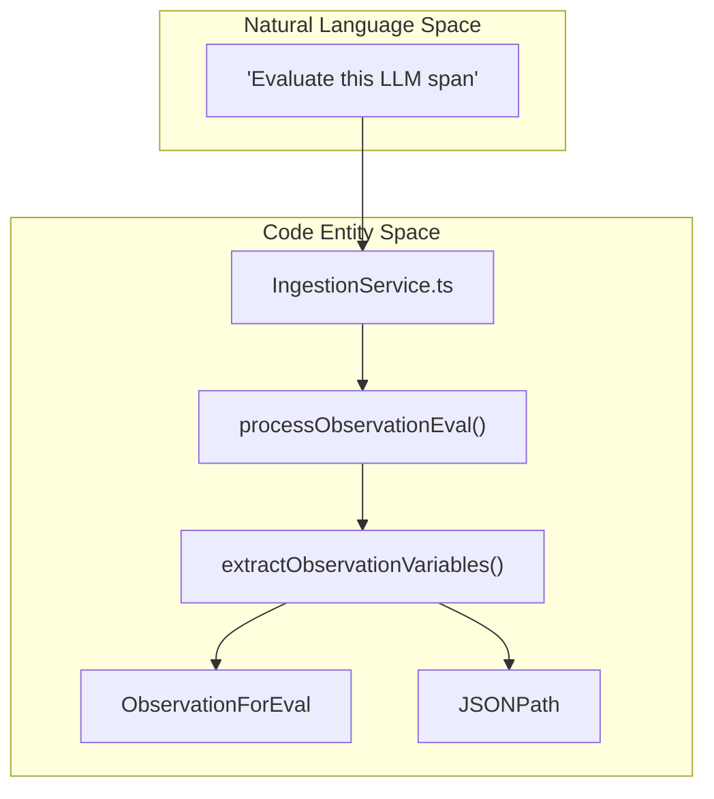

- **Variable Extraction**: `extractObservationVariables` uses `JSONPath` to pull specific fields from the observation's payload. It supports lazy JSON parsing where fields are only parsed if a `jsonSelector` is present. `[worker/src/features/evaluation/observationEval/extractObservationVariables.ts:40-67]()`, `[packages/shared/src/features/evals/utilities.ts:61-73]()`
- **Mapping**: Variables are extracted based on `ObservationVariableMapping`, which identifies the `selectedColumnId` (e.g., `input`, `output`, `metadata`) and an optional `jsonSelector`. `[worker/src/features/evaluation/observationEval/extractObservationVariables.ts:69-83]()`
- **OTEL Integration**: Spans ingested via OpenTelemetry are converted into `ObservationForEval` compatible records to support these evaluations. `[worker/src/queues/__tests__/otelToObservationForEval.test.ts:10-19]()`

Sources: `[worker/src/queues/evalQueue.ts:17-17]()`, `[worker/src/features/evaluation/observationEval/extractObservationVariables.ts:13-53]()`, `[packages/shared/src/features/evals/utilities.ts:76-84]()`, `[worker/src/queues/__tests__/otelToObservationForEval.test.ts:102-106]()`

## Variable Extraction

The `extractVariablesFromTracingData()` function pulls values from traces, observations, and dataset items based on the `variableMapping` defined in the `JobConfiguration`.

### Supported Object Types

| Target Object | Data Source | Extraction Method |
| :--- | :--- | :--- |
| `trace` | ClickHouse | JSONPath extraction from `input`, `output`, or `metadata`. |
| `observation` | ClickHouse | Matches by `objectName` (e.g., "MyRetriever") and extracts from `input`/`output`. |
| `dataset_item` | PostgreSQL | Direct lookup from the `DatasetItem` table for `input` or `expected_output`. |

### Performance Optimization
The system utilizes `InMemoryFilterService` for efficient matching of target objects. `[worker/src/features/evaluation/evalService.ts:23-23]()`. During extraction, `extractValueFromObject` handles multi-encoded JSON strings to ensure robust data retrieval. `[packages/shared/src/features/evals/utilities.ts:75-113]()`

Sources: `[worker/src/features/evaluation/evalService.ts:23-23]()`, `[packages/shared/src/features/evals/utilities.ts:75-113]()`

## Prompt Compilation

Prompts are compiled using a Mustache-style syntax. The `compileEvalPrompt` utility substitutes extracted variables into the `EvalTemplate`.

- **Logic**: The `compileTemplateString` function handles variable replacement. `[worker/src/__tests__/evalService.test.ts:76-83]()`
- **Data Types**: The compilation logic handles various data types via `parseUnknownToString`:
    - `null`/`undefined` are converted to empty strings. `[packages/shared/src/features/evals/utilities.ts:7-10]()`
    - Objects are stringified via `JSON.stringify`. `[packages/shared/src/features/evals/utilities.ts:18-20]()`
    - Arrays are joined by commas. `[worker/src/__tests__/evalService.test.ts:185-191]()`
    - Numbers and Booleans are converted to their string representations. `[packages/shared/src/features/evals/utilities.ts:11-17]()`

Sources: `[worker/src/features/evaluation/evalService.ts:69-73]()`, `[worker/src/__tests__/evalService.test.ts:76-199]()`, `[packages/shared/src/features/evals/utilities.ts:7-26]()`

## Core LLM-as-Judge Pipeline

The execution pipeline manages the flow from variable resolution to final score persistence.

Title: LLM Evaluation Execution Pipeline
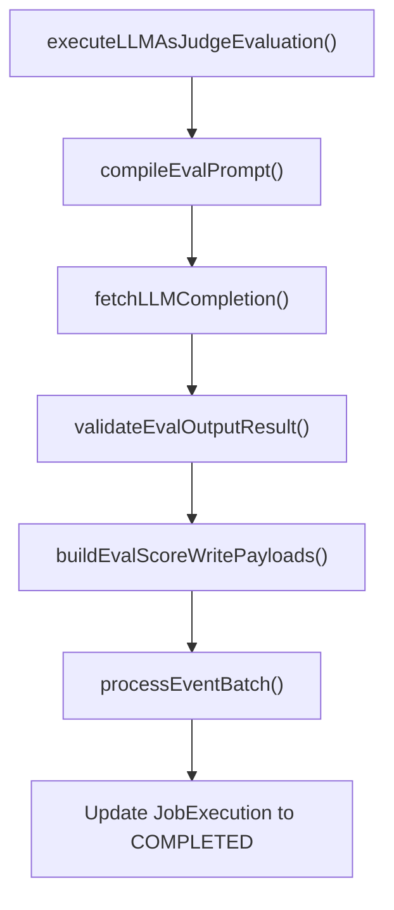

### LLM Response Validation
The LLM output is validated against the `PersistedEvalOutputDefinitionSchema`. This ensures the LLM returned the expected score type (numeric, categorical, or boolean). Validation is performed by `validateEvalOutputResult`. `[worker/src/features/evaluation/evalService.ts:61-61]()`

Sources: `[worker/src/features/evaluation/evalService.ts:69-74]()`, `[worker/src/features/evaluation/evalService.ts:61-61]()`

## Error Handling and Config Blocking

Langfuse implements a "fail-fast" mechanism for evaluators that consistently fail due to configuration issues to prevent resource waste.

### Automatic Blocking
If an evaluation job fails with a non-retryable error (e.g., invalid model parameters), the system blocks the `JobConfiguration`.
- **Reasoning**: Uses `getBlockReasonForInvalidModelConfig` to identify specific failure causes. `[worker/src/features/evaluation/evalService.ts:57-57]()`
- **Effect**: The `JobConfiguration` state is set to `DISABLED` via `blockEvaluatorConfigs`, preventing further job creation. `[worker/src/features/evaluation/evalService.ts:35-36]()`

### Retry Logic for Rate Limits
For `429` (Rate Limit) or `5xx` (Server Error) from LLM providers, the system implements specialized retry logic:
1. **Check Age**: If the job is < 24 hours old, it is scheduled for retry. `[worker/src/queues/evalQueue.ts:191-192]()`
2. **Backoff**: Uses exponential backoff (e.g., via `delayInMs`). `[worker/src/queues/evalQueue.ts:18-19]()`
3. **State**: Job is set to `DELAYED` or re-queued with a delay. `[worker/src/queues/evalQueue.ts:196-197]()`

Sources: `[worker/src/features/evaluation/evalService.ts:34-36]()`, `[worker/src/queues/evalQueue.ts:185-210]()`, `[worker/src/queues/evalQueue.ts:18-19]()`

## Score Persistence

Once the LLM returns a valid judgment, the worker creates a `score-create` event using `buildEvalScoreWritePayloads`. `[worker/src/features/evaluation/evalService.ts:74-74]()`
This event is processed by the standard ingestion pipeline, ensuring the score is written to ClickHouse and becomes visible in the Langfuse UI.

Sources: `[worker/src/features/evaluation/evalService.ts:74-74]()`, `[worker/src/features/evaluation/evalService.ts:61-61]()`

# LLM Integration


This page documents the LLM integration layer: the `fetchLLMCompletion` abstraction, the `LLMAdapter` enum and supported providers, the message type system, structured output and tool-call handling, and the internal tracing of evaluation and experiment executions.

- For how LLM-as-judge evaluation jobs *invoke* this layer, see [10.4]().
- For how LLM provider API keys are stored, encrypted, and managed through the UI, see [10.7]().

---

## Overview

All LLM calls within Langfuse (evaluations, playground, experiments) route through a single shared function, `fetchLLMCompletion`, defined in `packages/shared/src/server/llm/fetchLLMCompletion.ts` [packages/shared/src/server/llm/fetchLLMCompletion.ts:171-205](). It selects the appropriate [LangChain](https://js.langchain.com/) chat model class based on the adapter type, builds a normalized message list, and dispatches the call, returning a streaming byte stream, a plain string, a `CompletionWithReasoning`, a structured JSON object, or a `ToolCallResponse` depending on the overload called [packages/shared/src/server/llm/fetchLLMCompletion.ts:171-196]().

The following diagram shows the high-level call path:

**Diagram: LLM Integration Call Path**

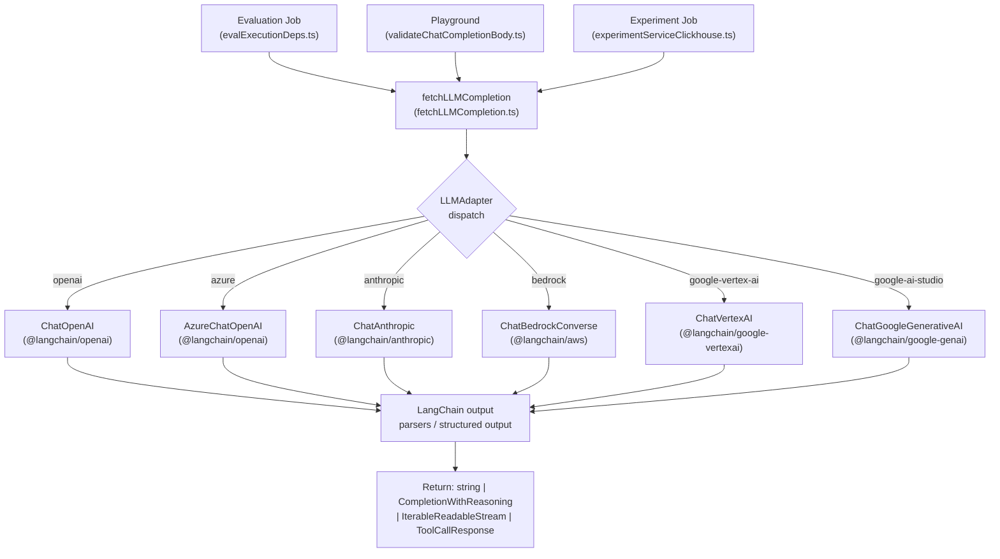

Sources: [packages/shared/src/server/llm/fetchLLMCompletion.ts:3-19](), [packages/shared/src/server/llm/fetchLLMCompletion.ts:171-205](), [packages/shared/src/server/llm/types.ts:335-343]()

---

## `LLMAdapter` and Supported Providers

The `LLMAdapter` enum in `packages/shared/src/server/llm/types.ts` is the discriminant used everywhere to select provider-specific behavior [packages/shared/src/server/llm/types.ts:335-343]():

| `LLMAdapter` value | LangChain class | Auth mechanism |
|---|---|---|
| `openai` | `ChatOpenAI` | API key (`secretKey`) |
| `azure` | `AzureChatOpenAI` | API key + deployment base URL |
| `anthropic` | `ChatAnthropic` | API key |
| `bedrock` | `ChatBedrockConverse` | AWS credentials or default provider chain |
| `google-vertex-ai` | `ChatVertexAI` | GCP service account JSON or ADC |
| `google-ai-studio` | `ChatGoogleGenerativeAI` | API key |

Each adapter has a hardcoded list of known model names in `types.ts` [packages/shared/src/server/llm/types.ts:384-550](). These drive the model dropdowns in the UI and the default model selection for connection testing in the `llmApiKeyRouter` [web/src/features/llm-api-key/server/router.ts:104-108](). 

Sources: [packages/shared/src/server/llm/types.ts:335-550](), [packages/shared/src/server/llm/fetchLLMCompletion.ts:3-19](), [web/src/features/llm-api-key/server/router.ts:100-169]()

---

## Type System

### Message Types

**Diagram: Chat Message Type Hierarchy**

```mermaid
classDiagram
    class "ChatMessageRole" {
        <<enum>>
        "System"
        "Developer"
        "User"
        "Assistant"
        "Tool"
        "Model"
    }
    class "ChatMessageType" {
        <<enum>>
        "System"
        "Developer"
        "User"
        "AssistantText"
        "AssistantToolCall"
        "ToolResult"
        "ModelText"
        "PublicAPICreated"
        "Placeholder"
    }
    class "SystemMessageSchema" {
        "type: system"
        "role: system"
        "content: string"
    }
    class "UserMessageSchema" {
        "type: user"
        "role: user"
        "content: string"
    }
    class "AssistantToolCallMessageSchema" {
        "type: assistant-tool-call"
        "role: assistant"
        "content: string"
        "toolCalls: LLMToolCall[]"
    }
    class "ToolResultMessageSchema" {
        "type: tool-result"
        "role: tool"
        "content: string"
        "toolCallId: string"
    }
    class "PlaceholderMessageSchema" {
        "type: placeholder"
        "name: string"
    }
    "ChatMessageSchema" --> "SystemMessageSchema"
    "ChatMessageSchema" --> "UserMessageSchema"
    "ChatMessageSchema" --> "AssistantToolCallMessageSchema"
    "ChatMessageSchema" --> "ToolResultMessageSchema"
    "ChatMessageSchema" --> "PlaceholderMessageSchema"
```

Sources: [packages/shared/src/server/llm/types.ts:126-233]()

The union type `ChatMessage` is the standard input to `fetchLLMCompletion` [packages/shared/src/server/llm/types.ts:214-235](). Messages are mapped to LangChain `BaseMessage` subclasses: `HumanMessage`, `SystemMessage`, `AIMessage`, and `ToolMessage` [packages/shared/src/server/llm/fetchLLMCompletion.ts:8-13]().

### Model Parameters

`ModelParams` is the combination of provider identity plus `ModelConfig` (inference parameters) [packages/shared/src/server/llm/types.ts:366-375]():

```typescript
ModelParams = {
  provider: string   // identifies the LLM API key record in the database
  adapter: LLMAdapter
  model: string
} & ModelConfig
```

`ModelConfig` contains fields like `max_tokens`, `temperature`, `top_p`, and `maxReasoningTokens` [packages/shared/src/server/llm/types.ts:352-364](). `UIModelParams` wraps each field in `{ value: T; enabled: boolean }` for the settings UI [packages/shared/src/server/llm/types.ts:378-382]().

Sources: [packages/shared/src/server/llm/types.ts:352-382](), [web/src/components/ModelParameters/index.tsx:40-55]()

---

## `fetchLLMCompletion` Implementation

The function is declared with several overloads to support different return types based on input parameters [packages/shared/src/server/llm/fetchLLMCompletion.ts:171-196]().

**Parameters:**

| Parameter | Type | Purpose |
|---|---|---|
| `messages` | `ChatMessage[]` | Normalized message list |
| `modelParams` | `ModelParams` | Provider/model/config |
| `llmConnection` | `{ secretKey, extraHeaders?, baseURL?, config? }` | Encrypted connection details |
| `structuredOutputSchema` | `ZodSchema \| LLMJSONSchema` | Forces structured output mode |
| `tools` | `LLMToolDefinition[]` | Tool definitions for function calling |
| `traceSinkParams` | `TraceSinkParams` | Controls internal trace ingestion |

The `secretKey` stored in the database is AES-encrypted. `fetchLLMCompletion` calls `decrypt(llmConnection.secretKey)` internally [packages/shared/src/server/llm/fetchLLMCompletion.ts:219]().

**Diagram: fetchLLMCompletion Dispatch Logic**

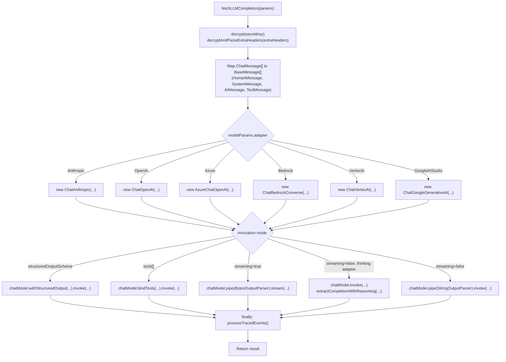

Sources: [packages/shared/src/server/llm/fetchLLMCompletion.ts:171-583]()

---

## Reasoning / Thinking Block Extraction

For `VertexAI` and `GoogleAIStudio` adapters, responses may include reasoning/thinking content blocks alongside the primary text [packages/shared/src/server/llm/fetchLLMCompletion.ts:69-72](). `fetchLLMCompletion` identifies these by `THINKING_BLOCK_TYPES` [packages/shared/src/server/llm/fetchLLMCompletion.ts:69-72]().

The return type `CompletionWithReasoning` is `{ text: string; reasoning?: string }` [packages/shared/src/server/llm/fetchLLMCompletion.ts:55](). Extraction is handled by `extractCompletionWithReasoning` which separates thinking blocks from standard text blocks in the `AIMessage` [packages/shared/src/server/llm/fetchLLMCompletion.ts:605-631]().

Sources: [packages/shared/src/server/llm/fetchLLMCompletion.ts:55-76](), [packages/shared/src/server/llm/fetchLLMCompletion.ts:605-631]()

---

## Structured Output

When `structuredOutputSchema` is passed (a Zod schema or a raw JSON schema object), the function calls `chatModel.withStructuredOutput(schema, options)` [packages/shared/src/server/llm/fetchLLMCompletion.ts:460-476](). This is the primary path used by the evaluation system — the eval template defines the expected output schema (e.g., `{ score: number, reasoning: string }`), and the result is directly parsed.

Sources: [packages/shared/src/server/llm/fetchLLMCompletion.ts:460-476](), [packages/shared/src/server/llm/types.ts:18-42]()

---

## Tool Calling

When `tools` is non-empty, `fetchLLMCompletion` converts each `LLMToolDefinition` to LangChain format and calls `chatModel.bindTools(langchainTools).invoke(...)` [packages/shared/src/server/llm/fetchLLMCompletion.ts:478-512](). The raw result is parsed with `ToolCallResponseSchema` [packages/shared/src/server/llm/types.ts:117-124]().

Sources: [packages/shared/src/server/llm/fetchLLMCompletion.ts:478-512](), [packages/shared/src/server/llm/types.ts:71-125]()

---

## Internal Tracing of Eval and Experiment Executions

When `traceSinkParams` is provided, `fetchLLMCompletion` calls `getInternalTracingHandler(traceSinkParams)` which returns a LangChain `BaseCallbackHandler` that ingests the LLM call as a Langfuse internal trace [packages/shared/src/server/llm/fetchLLMCompletion.ts:238-242](). 

A safeguard prevents infinite eval loops: the `environment` field in `traceSinkParams` must start with `"langfuse"` [packages/shared/src/server/llm/fetchLLMCompletion.ts:229-236](). This mechanism is used in:
- **Evaluations**: To trace the LLM-as-judge call.
- **Experiments**: In `worker/src/features/experiments/experimentServiceClickhouse.ts`, `processLLMCall` sets the environment to `LangfuseInternalTraceEnvironment.PromptExperiments` to trace experiment runs [worker/src/features/experiments/experimentServiceClickhouse.ts:181-185]().

Sources: [packages/shared/src/server/llm/fetchLLMCompletion.ts:225-243](), [packages/shared/src/server/llm/getInternalTracingHandler.ts:1-50](), [worker/src/features/experiments/experimentServiceClickhouse.ts:181-227]()

---

## LLM API Key Management

API keys for LLM providers are managed via the `llmApiKeyRouter` [web/src/features/llm-api-key/server/router.ts:192](). 

- **Creation**: `create` procedure encrypts the `secretKey` using the system `ENCRYPTION_KEY` before storing it in PostgreSQL [web/src/features/llm-api-key/server/router.ts:193-248]().
- **Testing**: The `testLLMConnection` function attempts a simple completion using `fetchLLMCompletion` to verify the provided credentials before they are saved [web/src/features/llm-api-key/server/router.ts:100-169]().
- **Sentinels**: For self-hosted deployments, sentinel strings like `BEDROCK_USE_DEFAULT_CREDENTIALS` and `VERTEXAI_USE_DEFAULT_CREDENTIALS` allow using environment-based authentication (IAM roles, ADC) instead of explicit keys [packages/shared/src/interfaces/customLLMProviderConfigSchemas.ts:26-27]().
- **Base URL Validation**: All custom base URLs are validated via `validateLlmConnectionBaseURL` to prevent SSRF and access to internal hostnames [web/src/features/llm-api-key/server/router.ts:171-190]().

Sources: [web/src/features/llm-api-key/server/router.ts:1-248](), [web/src/features/public-api/components/CreateLLMApiKeyForm.tsx:85-178](), [packages/shared/src/server/llm/utils.ts:33-103]()

# Annotation Queues


## Purpose and Scope

Annotation Queues provide a human-in-the-loop workflow system for manually reviewing and scoring traces, observations, or sessions in Langfuse. This system enables teams to organize items requiring manual review into named queues, assign specific users, and track progress through a structured lifecycle.

Key features include:
- **User Assignments**: Restrict queue access to specific team members via `AnnotationQueueAssignment`. [[packages/shared/prisma/schema.prisma:566-579]]()
- **Locking Mechanism**: Prevent concurrent editing by locking items during active review for a period (typically 5 minutes). [[web/src/features/annotation-queues/server/annotationQueueItemsRouter.ts:30-36]]()
- **Status Tracking**: Monitor progress with `PENDING` and `COMPLETED` states. [[packages/shared/prisma/schema.prisma:556-559]]()
- **Schema Standardization**: Associate `ScoreConfig` definitions with queues to ensure consistent manual evaluation criteria. [[packages/shared/prisma/schema.prisma:517-517]]()
- **Integrated Feedback**: Support for internal comments and mentions during the annotation process. [[web/src/server/api/routers/comments.ts:25-138]]()

**Sources:** [[packages/shared/prisma/schema.prisma:511-579]](), [[web/src/features/annotation-queues/server/annotationQueueItemsRouter.ts:30-36]]()

---

## Core Data Model

The annotation queue system consists of three primary models in PostgreSQL, managed via Prisma.

### Entity Relationship Diagram

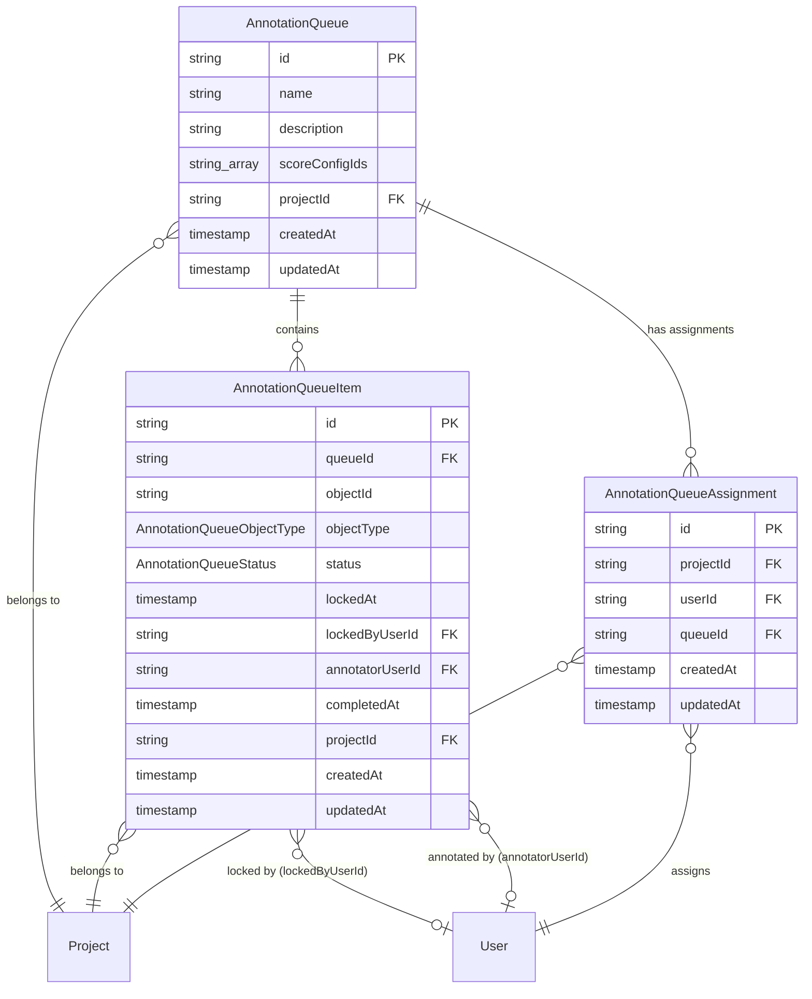

**Sources:** [[packages/shared/prisma/schema.prisma:511-579]]()

---

## AnnotationQueue Model

The `AnnotationQueue` table defines a named queue for organizing items that require annotation.

### Schema

| Field | Type | Description |
|-------|------|-------------|
| `id` | string (cuid) | Primary key |
| `name` | string | Queue name (unique per project) |
| `description` | string (nullable) | Optional description |
| `scoreConfigIds` | string[] | Array of `ScoreConfig` IDs defining the annotation schema |
| `projectId` | string | Foreign key to `Project` |
| `createdAt` | timestamp | Creation timestamp |
| `updatedAt` | timestamp | Last update timestamp |

### Key Characteristics

- **Unique Constraint**: `@@unique([projectId, name])` ensures queue names are unique within a project. [[packages/shared/prisma/schema.prisma:526-526]]()
- **Score Configuration**: The `scoreConfigIds` array defines which scores should be created during annotation, standardizing the evaluation process. [[packages/shared/prisma/schema.prisma:517-517]]()

**Sources:** [[packages/shared/prisma/schema.prisma:511-527]]()

---

## AnnotationQueueItem Model

The `AnnotationQueueItem` table represents individual items (traces, observations, or sessions) within a queue.

### Schema [[packages/shared/prisma/schema.prisma:529-553]]()

| Field | Type | Description |
|-------|------|-------------|
| `id` | string (cuid) | Primary key |
| `queueId` | string | Foreign key to `AnnotationQueue` |
| `objectId` | string | ID of the trace/observation/session being annotated |
| `objectType` | enum | Type of object: `TRACE`, `OBSERVATION`, or `SESSION` |
| `status` | enum | `PENDING` or `COMPLETED` (default: `PENDING`) |
| `lockedAt` | timestamp (nullable) | When the item was locked for annotation |
| `lockedByUserId` | string (nullable) | User who currently has the item locked |
| `annotatorUserId` | string (nullable) | User who completed the annotation |
| `completedAt` | timestamp (nullable) | When annotation was completed |
| `projectId` | string | Foreign key to `Project` |

### Status Flow

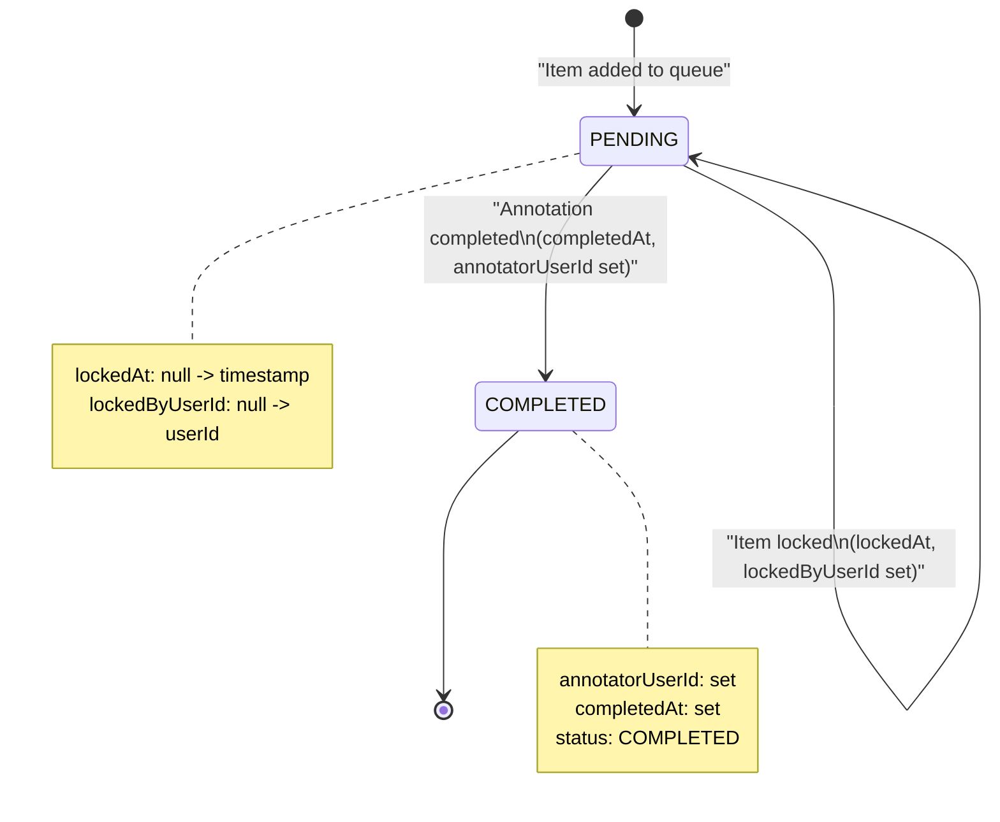

**Sources:** [[packages/shared/prisma/schema.prisma:529-553]](), [[packages/shared/prisma/schema.prisma:556-559]]()

---

## Annotation Workflow

### Implementation and Data Flow

The frontend implementation uses `AnnotationQueueItemPage` to manage the annotation lifecycle through various tRPC routers.

**Title: Annotation Workflow Code Interaction**

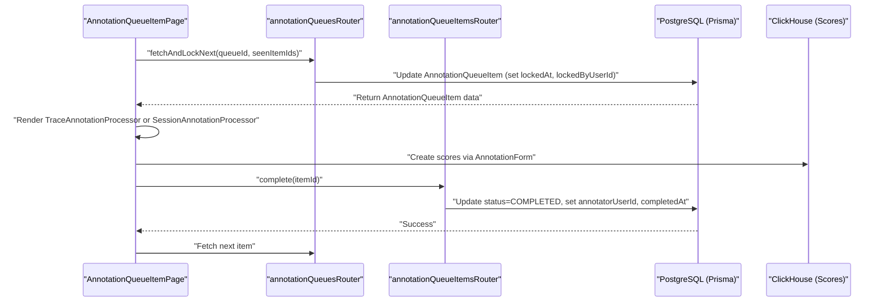

### Step-by-Step Process

1.  **Item Retrieval & Locking**: The UI calls `fetchAndLockNext` via the `annotationQueuesRouter`. This procedure finds a `PENDING` item and sets the `lockedByUserId`. [[web/src/features/annotation-queues/components/AnnotationQueueItemPage.tsx:51-66]]()
2.  **Object Data Fetching**: The `useAnnotationObjectData` hook resolves the underlying trace, observation, or session data based on the `objectType`. It supports both legacy ClickHouse paths and the V4 Beta `events` table. [[web/src/features/annotation-queues/components/shared/hooks/useAnnotationObjectData.ts:16-135]]()
3.  **Annotation UI**: Depending on the type, the system renders a `TraceAnnotationProcessor` or `SessionAnnotationProcessor`. [[web/src/features/annotation-queues/components/AnnotationQueueItemPage.tsx:213-225]]()
4.  **Scoring**: Users provide feedback via the `AnnotationForm`. Scores are persisted and associated with the `queueId` via the `scoreMetadata`. [[web/src/features/annotation-queues/components/shared/AnnotationDrawerSection.tsx:38-52]]()
5.  **Completion**: The `complete` mutation in `annotationQueueItemsRouter` updates the item status to `COMPLETED` and records the `annotatorUserId`. [[web/src/features/annotation-queues/components/AnnotationQueueItemPage.tsx:83-104]]()

**Sources:** [[web/src/features/annotation-queues/components/AnnotationQueueItemPage.tsx:22-188]](), [[web/src/features/annotation-queues/components/shared/AnnotationDrawerSection.tsx:25-71]](), [[web/src/features/annotation-queues/components/shared/hooks/useAnnotationObjectData.ts:16-135]]()

---

## Locking Mechanism

The locking mechanism prevents multiple users from annotating the same item concurrently.

### Lock States [[packages/shared/prisma/schema.prisma:529-553]]()

| State | `lockedAt` | `lockedByUserId` | `status` | Description |
| :--- | :--- | :--- | :--- | :--- |
| **Unlocked** | `null` | `null` | `PENDING` | Item is available for annotation |
| **Locked** | `timestamp` | `userId` | `PENDING` | Item is being annotated by a specific user |
| **Completed** | `timestamp` | `userId` | `COMPLETED` | Annotation finished |

A lock is considered valid if it was created within the last 5 minutes. [[web/src/features/annotation-queues/server/annotationQueueItemsRouter.ts:30-36]]() If an item is locked by another user, the `AnnotationDrawerSection` displays a `TriangleAlertIcon` warning identifying the current editor. [[web/src/features/annotation-queues/components/shared/AnnotationDrawerSection.tsx:53-61]]()

**Sources:** [[packages/shared/prisma/schema.prisma:529-553]](), [[web/src/features/annotation-queues/components/shared/AnnotationDrawerSection.tsx:53-61]](), [[web/src/features/annotation-queues/server/annotationQueueItemsRouter.ts:30-36]]()

---

## Integration with Score System

Annotation queues are integrated with the scoring system through the `scoreConfigIds` array and the `queueId` field on scores.

### Score Configuration Linkage

The `AnnotationQueue` defines which `ScoreConfig` objects are relevant. When an annotator submits a score, the `AnnotationForm` uses these configurations to define the UI fields. [[web/src/features/annotation-queues/components/shared/AnnotationDrawerSection.tsx:42-42]]()

### Score Fields for Annotation Queues

When creating scores from annotation queues, specific metadata is attached:

| Field | Value | Description |
| :--- | :--- | :--- |
| `source` | `ANNOTATION` | Indicates manual human input. [[packages/shared/prisma/schema.prisma:464-464]]() |
| `queueId` | `AnnotationQueue.id` | Tracks which queue generated the score. [[packages/shared/prisma/schema.prisma:469-469]]() |
| `authorUserId` | Annotator user ID | Identifies the human evaluator. [[packages/shared/prisma/schema.prisma:467-467]]() |

**Sources:** [[packages/shared/prisma/schema.prisma:439-470]](), [[packages/shared/prisma/schema.prisma:511-527]]()

---

## Session Annotation Processor

When `objectType = SESSION`, the system uses `SessionAnnotationProcessor` to handle multi-trace context.

- **Pagination**: To handle large sessions, it paginates trace rendering (default `PAGE_SIZE = 10`). [[web/src/features/annotation-queues/components/processors/SessionAnnotationProcessor.tsx:32-32]]()
- **V4 Beta Support**: It fetches traces separately via `api.sessions.tracesFromEvents` when the V4 events table path is enabled. [[web/src/features/annotation-queues/components/processors/SessionAnnotationProcessor.tsx:45-58]]()
- **Trace Visualization**: Uses `LazyTraceEventsRow` for deferred loading of traces and their associated comments. [[web/src/features/annotation-queues/components/processors/SessionAnnotationProcessor.tsx:159-171]]()
- **Contextual Data**: Displays session-level metadata, environment information, and total trace counts. [[web/src/features/annotation-queues/components/processors/SessionAnnotationProcessor.tsx:116-122]]()

**Sources:** [[web/src/features/annotation-queues/components/processors/SessionAnnotationProcessor.tsx:1-171]]()

---

## Comments and Mentions

During the annotation process, users can collaborate using the comment system integrated into the annotation processors.

- **Mention System**: Users can mention other project members using `@` prefix. [[web/src/features/comments/CommentList.tsx:50-50]]() The `useMentionAutocomplete` hook provides UI support for member selection. [[web/src/features/comments/CommentList.tsx:171-176]]()
- **Notification Queue**: Mentioning a user triggers a background job via `NotificationQueue` using `QueueJobs.NotificationJob` to alert the user. [[web/src/server/api/routers/comments.ts:113-136]]()
- **Validation**: Server-side validation ensures mentions are only permitted if the author has `projectMembers:read` permissions and the mentioned users are valid project members. [[web/src/server/api/routers/comments.ts:54-87]]()
- **Audit Logging**: Creating or deleting comments on objects within the queue triggers audit logs. [[web/src/server/api/routers/comments.ts:104-110]](), [[web/src/server/api/routers/comments.ts:179-185]]()

**Sources:** [[web/src/features/comments/CommentList.tsx:171-176]](), [[web/src/server/api/routers/comments.ts:113-136]](), [[web/src/server/api/routers/comments.ts:179-185]](), [[web/src/server/api/routers/comments.ts:54-87]]()