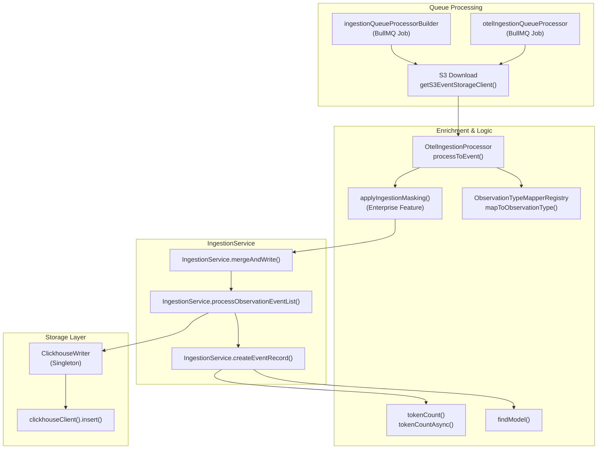
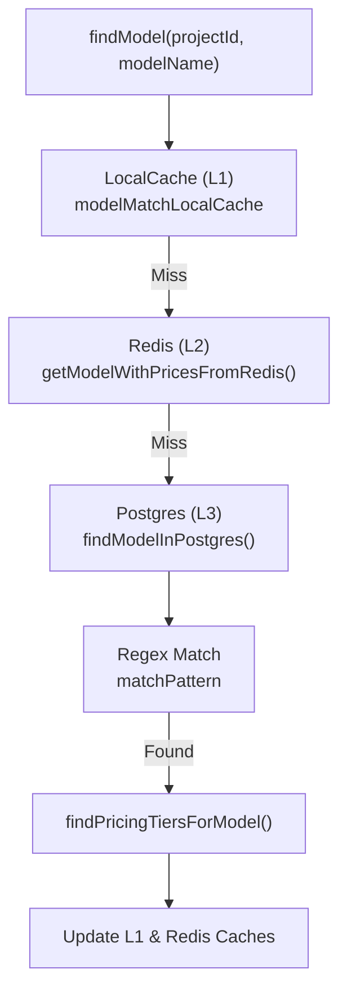

This page describes event processing, enrichment, and masking logic within the Langfuse ingestion pipeline. After events are ingested via the API and retrieved from S3, they undergo transformation, validation, and enrichment before being written to ClickHouse. This process is primarily handled by the `IngestionService` and specialized processors for OpenTelemetry data.

## Processing Flow Overview

Event processing transforms raw ingestion events into enriched records. The `ingestionQueueProcessorBuilder` (for standard API events) and `otelIngestionQueueProcessor` (for OpenTelemetry events) retrieve payloads from S3 and process them through the enrichment layer.

**Diagram: Event Processing Pipeline**

**Sources:**
- [worker/src/services/IngestionService/index.ts:149-195]()
- [worker/src/services/IngestionService/index.ts:212-236]()

## Ingestion Masking (Enterprise)

Langfuse supports masking sensitive data during the ingestion phase before it is persisted to ClickHouse.

1. **Header Propagation**: The API layer extracts specific headers defined in `LANGFUSE_INGESTION_MASKING_PROPAGATED_HEADERS` and propagates them to the worker via the queue payload.
2. **Execution**: If masking is enabled for a project, the `applyIngestionMasking` function (from `@langfuse/shared/src/server/ee/ingestionMasking`) is applied to the event body. This allows for redacting PII or sensitive inputs/outputs based on organization-level configurations before the data reaches the storage layer.

**Sources:**
- [packages/shared/AGENTS.md:59-60]()
- [worker/src/services/IngestionService/index.ts:155-156]()

## Event Record Enrichment

The `IngestionService.createEventRecord` function serves as the single point of transformation from loose `EventInput` to strict `EventRecordInsertType` [worker/src/services/IngestionService/index.ts:212-215](). It performs several critical enrichment steps:

*   **Prompt Lookup**: Resolves prompt references by name and version using the `PromptService` [worker/src/services/IngestionService/index.ts:221-233]().
*   **Model & Usage**: Resolves the model via `findModel` and calculates tokenization or cost if not provided by the SDK [worker/src/services/IngestionService/index.ts:235-236]().
*   **Metadata Flattening**: Metadata is converted to a string-record format for storage [worker/src/services/IngestionService/index.ts:60-61]().

**Sources:**
- [worker/src/services/IngestionService/index.ts:212-236]()
- [worker/src/services/IngestionService/utils.ts:26-43]()

## Model Matching & Pricing

The system resolves model names provided in events to internal `Model` definitions to calculate costs.

### Model Resolution Flow
`findModel` is the primary entry point for resolving a model name to a database record and its associated pricing tiers [packages/shared/src/server/ingestion/modelMatch.ts:45-157]().

1. **Local L1 Cache**: Uses `modelMatchLocalCache` (LRU) to store `ModelWithPrices` objects for a short duration (default 10s) [packages/shared/src/server/ingestion/modelMatch.ts:32-43]().
2. **Redis L2 Cache**: If not in L1, it checks Redis using `getModelWithPricesFromRedis` [packages/shared/src/server/ingestion/modelMatch.ts:179-200]().
3. **Postgres Lookup**: If both caches miss, it queries Postgres via `findModelInPostgres`, matching the model name against regex patterns [packages/shared/src/server/ingestion/modelMatch.ts:76-94]().

**Diagram: Model Matching Logic**

### Pricing Tiers & Cost Calculation
Models can have multiple `pricingTiers`. Each tier contains `prices` for different usage types (input, output, total) [packages/shared/src/server/ingestion/modelMatch.ts:222-230]().

The `IngestionService` calculates usage costs by comparing user-provided costs against calculated costs based on resolved pricing [worker/src/services/IngestionService/tests/calculateTokenCost.unit.test.ts:143-152](). User-provided costs (in `provided_cost_details`) always take precedence over system-calculated ones [worker/src/services/IngestionService/tests/calculateTokenCost.unit.test.ts:180-183]().

**Sources:**
- [packages/shared/src/server/ingestion/modelMatch.ts:45-157]()
- [packages/shared/src/server/ingestion/modelMatch.ts:179-200]()
- [worker/src/services/IngestionService/tests/calculateTokenCost.unit.test.ts:143-184]()

## Event Attribute Extraction

During enrichment, specific domain-level attributes are extracted and transformed:

- **Tool Extraction**: `extractToolsFromObservation` parses tool definitions and calls from the observation payload [worker/src/services/IngestionService/index.ts:49-49]().
- **JSON Deep Parsing**: `deepParseJson` and `deepParseJsonIterative` handle nested stringified JSON in inputs/outputs, including special handling for Python-style dictionaries (e.g., from LangChain) [packages/shared/src/utils/json.ts:61-134]().
- **Python Dict Parsing**: `tryParsePythonDict` converts Python literals (`True`, `False`, `None`) and single quotes to standard JSON format [packages/shared/src/utils/json.ts:9-41]().
- **Usage Schema Transformation**: The system handles various usage formats (OpenAI completion vs. OpenAI response vs. standard Langfuse) and maps them to a unified internal schema via Zod transforms [packages/shared/src/server/ingestion/types.ts:45-69]().

**Sources:**
- [worker/src/services/IngestionService/index.ts:47-53]()
- [packages/shared/src/utils/json.ts:7-41]()
- [packages/shared/src/server/ingestion/types.ts:45-215]()

## Data Normalization & Validation

Before insertion into ClickHouse, records are normalized to ensure strict type compatibility.

| Function | Role |
| :--- | :--- |
| `parseUInt16` | Ensures numeric values fit within ClickHouse `UInt16` range (0–65535) [worker/src/services/IngestionService/index.ts:72-77](). |
| `convertRecordValuesToString` | Flattens metadata objects into string records [worker/src/services/IngestionService/utils.ts:45-54](). |
| `overwriteObject` | Merges new event data with existing records while respecting `immutableEntityKeys` like `project_id` and `id` [worker/src/services/IngestionService/utils.ts:56-97](). |
| `Usage.transform` | Normalizes OpenAI-style token counts (`promptTokens`) into the standard `Usage` model [packages/shared/src/server/ingestion/types.ts:45-69](). |

**Sources:**
- [worker/src/services/IngestionService/index.ts:72-135]()
- [worker/src/services/IngestionService/utils.ts:45-97]()
- [packages/shared/src/server/ingestion/types.ts:45-69]()