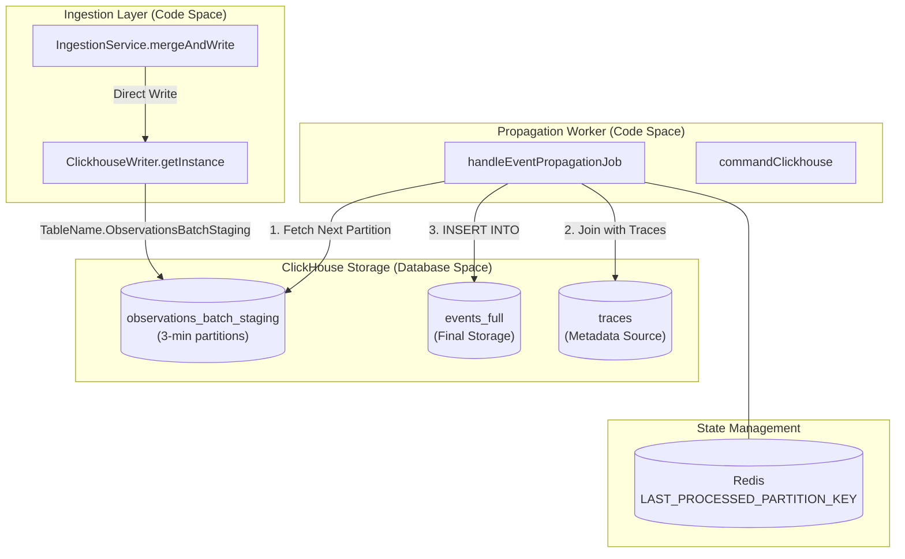
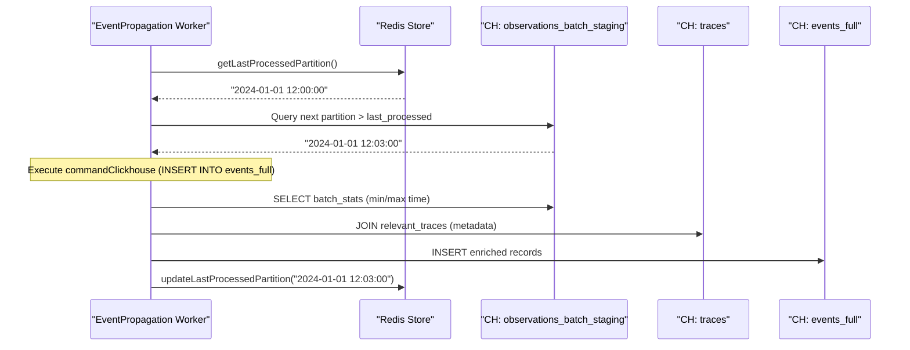

## Purpose and Scope

The Event Propagation System manages the flow of observability events from initial ingestion through validation, storage, and eventual persistence in the ClickHouse events table. This system implements a dual-write architecture that routes events through different paths based on SDK version compatibility and utilizes a staging-to-events propagation mechanism for high-volume data consistency.

In the V4 Beta events-first architecture, traces are no longer just static metadata; they can be synthetically derived from observations stored in the `events_full` table.

This document covers:
- Event flow from API ingestion to final storage.
- Dual write path architecture (staging tables vs. direct writes).
- The `observations_batch_staging` mechanism and the `EventPropagationQueue`.
- ClickHouse propagation logic and partition-based processing.
- Synthetic trace derivation in the events-first architecture.

Sources: [worker/src/features/eventPropagation/handleEventPropagationJob.ts:58-71](), [packages/shared/src/server/repositories/events.ts:84-93]()

## Architecture Overview

The following diagram bridges the natural language concepts of ingestion to the specific code entities responsible for propagation.

### Ingestion to Storage Data Flow

Sources: [packages/shared/clickhouse/scripts/dev-tables.sh:81-130](), [worker/src/features/eventPropagation/handleEventPropagationJob.ts:15-57]()

## Dual Write Architecture

Langfuse utilizes a dual-write pattern to transition from legacy observation structures to a unified, immutable events schema.

1.  **Direct Path**: Events can be written directly to the `events_full` table when SDK requirements are met. This is controlled by internal routing flags in the ingestion service.
2.  **Staging Path**: Events are written to the `observations_batch_staging` table in ClickHouse via `ClickhouseWriter`. This table acts as a buffer, allowing for high-throughput ingestion without immediate heavy joins.

### Staging Table Schema (`observations_batch_staging`)
The staging table is designed for temporary storage with the following characteristics:
- **Partitioning**: Partitioned by `s3_first_seen_timestamp` at a 3-minute interval using `toStartOfInterval(s3_first_seen_timestamp, INTERVAL 3 MINUTE)` [packages/shared/clickhouse/scripts/dev-tables.sh:121-121]().
- **TTL**: Data is automatically expired after 12 hours `TTL s3_first_seen_timestamp + INTERVAL 12 HOUR` with `ttl_only_drop_parts = 1` to ensure efficient partition drops [packages/shared/clickhouse/scripts/dev-tables.sh:129-130]().
- **Engine**: `ReplacingMergeTree(event_ts, is_deleted)` to handle potential deduplication during the staging phase [packages/shared/clickhouse/scripts/dev-tables.sh:120-120]().

Sources: [packages/shared/clickhouse/scripts/dev-tables.sh:81-130]()

## Propagation Mechanism

The `handleEventPropagationJob` is responsible for moving data from staging to the final `events_full` table.

### Sequential Partition Processing
To ensure consistency and avoid missing data, the system processes partitions sequentially using a cursor stored in Redis.

1.  **Cursor Retrieval**: The worker fetches the `LAST_PROCESSED_PARTITION_KEY` (`"langfuse:event-propagation:last-processed-partition"`) from Redis [worker/src/features/eventPropagation/handleEventPropagationJob.ts:15-29]().
2.  **Partition Discovery**: It queries `system.parts` for the next available partition in `observations_batch_staging` that is active and older than the configured delay `LANGFUSE_EXPERIMENT_EVENT_PROPAGATION_PARTITION_DELAY_MINUTES` [worker/src/features/eventPropagation/handleEventPropagationJob.ts:94-109]().
3.  **Data Propagation**: A complex `INSERT INTO events_full` query joins the staging data with the `traces` table to enrich events with trace-level metadata (user IDs, session IDs, tags, releases) [worker/src/features/eventPropagation/handleEventPropagationJob.ts:185-201]().
4.  **State Update**: Upon successful completion, the Redis cursor is updated to the processed partition timestamp via `updateLastProcessedPartition` [worker/src/features/eventPropagation/handleEventPropagationJob.ts:35-50]().

### Event Enrichment Logic
During propagation, the system performs a "Point-in-Time" join with the `traces` table. It limits the join scope by:
- Filtering traces within a time window relative to the observation's `start_time` (using `min_start_time` and `max_start_time` from `batch_stats`) [worker/src/features/eventPropagation/handleEventPropagationJob.ts:142-148]().
- Using a fallback condition that limits activity to the last 7 days to prevent unbounded scans [worker/src/features/eventPropagation/handleEventPropagationJob.ts:178-178]().
- Using `LIMIT 1 BY t.project_id, t.id` ordered by `event_ts DESC` to ensure only the latest version of trace metadata is propagated [worker/src/features/eventPropagation/handleEventPropagationJob.ts:181-182]().

Sources: [worker/src/features/eventPropagation/handleEventPropagationJob.ts:74-201]()

## V4 Beta: Events-First Architecture

In the updated architecture, the `events_full` table becomes the primary source of truth. This allows for **synthetic traces**, where trace data is derived directly from observation events if a dedicated trace record does not exist.

### Synthetic Trace Derivation
The `EventsQueryBuilder` and associated repository logic support querying traces directly from the events table.
- **Trace Aggregation**: Queries like `eventsTracesAggregation` and `eventsSessionsAggregation` compute trace-level metrics (total cost, latency, start/end times) by aggregating over events [packages/shared/src/server/repositories/events.ts:30-36]().
- **Denormalization**: The `events_full` table contains denormalized fields such as `trace_name`, `user_id`, `session_id`, and `tags` to allow these aggregations without constant joins [packages/shared/clickhouse/scripts/dev-tables.sh:151-154]().
- **Experiment Backfill**: The `handleExperimentBackfill` job identifies dataset run items that lack corresponding event records and performs a backfill by fetching relevant observations and traces, then inserting them into the events system [worker/src/features/eventPropagation/handleExperimentBackfill.ts:110-169]().

Sources: [packages/shared/src/server/repositories/events.ts:30-42](), [packages/shared/clickhouse/scripts/dev-tables.sh:135-210](), [worker/src/features/eventPropagation/handleExperimentBackfill.ts:19-93]()

## Event Consistency Guarantees

The system provides **eventual consistency** with the following parameters:

| Component | Guarantee / Behavior |
| :--- | :--- |
| **Ingestion Delay** | Configurable via `PARTITION_DELAY_MINUTES` (ensures ClickHouse has finished writing the partition) [worker/src/features/eventPropagation/handleEventPropagationJob.ts:100-100](). |
| **Ordering** | Guaranteed sequential processing via Redis cursor [worker/src/features/eventPropagation/handleEventPropagationJob.ts:102-102](). |
| **Deduplication** | Handled by `ReplacingMergeTree` in staging and `INSERT INTO events_full` logic [packages/shared/clickhouse/scripts/dev-tables.sh:120-120](). |
| **Trace Metadata** | Maximum propagation interval is 7 days; metadata older than this may not be joined [worker/src/features/eventPropagation/handleEventPropagationJob.ts:178-178](). |

### Propagation Sequence Diagram

Sources: [worker/src/features/eventPropagation/handleEventPropagationJob.ts:22-50](), [worker/src/features/eventPropagation/handleEventPropagationJob.ts:141-201]()

## Implementation Details

### Key Classes and Functions

-   **`handleEventPropagationJob`**: The BullMQ processor that executes the ClickHouse migration logic [worker/src/features/eventPropagation/handleEventPropagationJob.ts:58-60]().
-   **`EventsQueryBuilder`**: A repository-level utility for constructing queries against the `events_full` table, providing unified access to propagated data [packages/shared/src/server/queries/clickhouse-sql/event-query-builder.ts:65-72]().
-   **`enrichObservationsWithModelData`**: Enriches raw observation records from ClickHouse with model pricing data from PostgreSQL [packages/shared/src/server/repositories/events.ts:94-113]().
-   **`convertEventsObservation`**: Converter that maps ClickHouse records to the `EventsObservation` domain model, including user and session IDs [packages/shared/src/server/repositories/events.ts:63-63]().

### Background Migrations
For historical data, the system includes background migration scripts like `BackfillEventsHistoric` that use a `ConcurrentQueryManager` to manage parallel ClickHouse `INSERT INTO ... SELECT` operations across different data chunks [worker/src/backgroundMigrations/backfillEventsHistoric.ts:72-161](). These migrations track progress in the `background_migrations` table by storing state including processed chunks and active query IDs [worker/src/backgroundMigrations/backfillEventsHistoric.ts:182-212]().

Sources: [worker/src/features/eventPropagation/handleEventPropagationJob.ts:58-71](), [packages/shared/src/server/queries/clickhouse-sql/event-query-builder.ts:65-72](), [worker/src/backgroundMigrations/backfillEventsHistoric.ts:72-212](), [packages/shared/src/server/repositories/events.ts:94-113]()