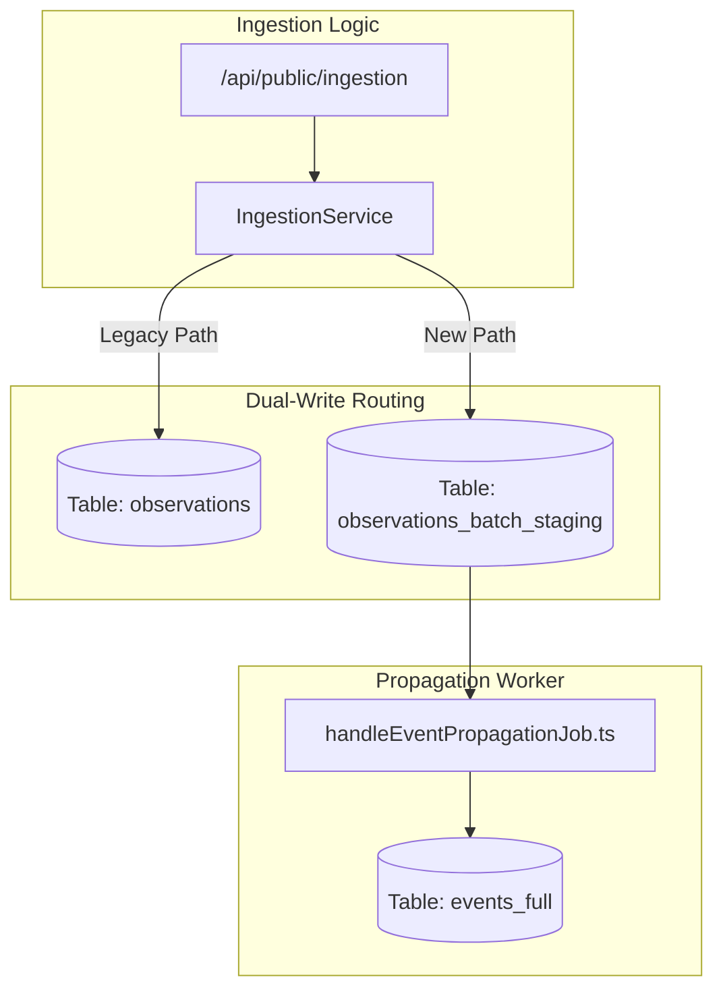
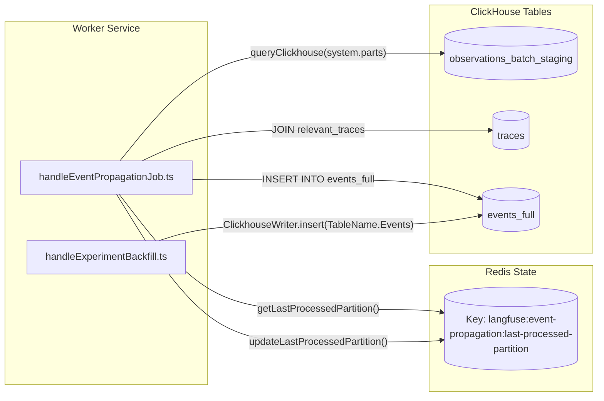

This page covers the design and implementation of the `events` table family in ClickHouse, the dual-write mechanism that populates it from the existing `observations` pipeline, real-time partition propagation via `EventPropagationQueue`, and the repository patterns used to query this data.

---

## Purpose and Context

Langfuse's traditional `observations` table stores spans and generations independently of their parent trace metadata. The `events` table architecture introduces a denormalized layer that merges observation data with trace properties (`user_id`, `session_id`, `tags`, `trace_name`, etc.) at write time. This allows for significantly faster analytical queries by eliminating expensive joins during read operations.

The system uses a **dual-write** approach to ensure backward compatibility:
1. Data is written to the legacy `observations` table.
2. Simultaneously, data is written to a staging table (`observations_batch_staging`).
3. An asynchronous worker propagates and denormalizes this data into the final `events_full` table.

Sources: [worker/src/features/eventPropagation/handleEventPropagationJob.ts:58-72](), [packages/shared/clickhouse/scripts/dev-tables.sh:75-80]()

---

## Table Family Overview

The architecture consists of several ClickHouse tables with specific roles defined in the development schema scripts.

| Table | Engine | Purpose |
| :--- | :--- | :--- |
| `observations_batch_staging` | `ReplacingMergeTree` | Short-lived buffer for raw observations; partitioned by 3-minute intervals. |
| `events_full` | `ReplacingMergeTree` | The primary denormalized table containing full I/O and trace metadata. |
| `events_core` | `ReplacingMergeTree` | A lightweight projection (via Materialized View) for high-performance list views. |

### `observations_batch_staging`
This table acts as a temporary landing zone. It uses a fine-grained partitioning strategy: `PARTITION BY toStartOfInterval(s3_first_seen_timestamp, INTERVAL 3 MINUTE)` [packages/shared/clickhouse/scripts/dev-tables.sh:121](). 

*   **TTL**: Data is automatically expired after 12 hours (`TTL s3_first_seen_timestamp + INTERVAL 12 HOUR`) [packages/shared/clickhouse/scripts/dev-tables.sh:129]().
*   **Settings**: `ttl_only_drop_parts = 1` ensures ClickHouse only drops complete partitions, maintaining data integrity during propagation [packages/shared/clickhouse/scripts/dev-tables.sh:130]().

### `events_full`
`events_full` is the source of truth for the denormalized event-sourcing pattern [packages/shared/clickhouse/scripts/dev-tables.sh:135-198](). It stores full `input` and `output` strings using `ZSTD(3)` compression [packages/shared/clickhouse/scripts/dev-tables.sh:192-195](). It also includes denormalized experiment fields such as `experiment_id` and `experiment_item_id` [packages/shared/src/server/queries/clickhouse-sql/event-query-builder.ts:121-135]().

Sources: [packages/shared/clickhouse/scripts/dev-tables.sh:81-130](), [packages/shared/clickhouse/scripts/dev-tables.sh:135-198](), [packages/shared/src/server/queries/clickhouse-sql/event-query-builder.ts:121-135]()

---

## Dual-Write Architecture

The system maintains a dual-write path where data is directed both to the historical observation tables and the new events-first staging tables.

### Ingestion Flow
When an event (Trace or Observation) arrives:
1.  **Staging Write**: Data is written to `observations_batch_staging`. This table uses `s3_first_seen_timestamp` for its partitioning logic [packages/shared/clickhouse/scripts/dev-tables.sh:121-122]().
2.  **Experiment Backfill**: A secondary process, `handleExperimentBackfill`, ensures that observations belonging to traces referenced by dataset run items are enriched with experiment metadata and inserted into the events table [worker/src/features/eventPropagation/handleExperimentBackfill.ts:80-93]().

### ClickhouseWriter
The `ClickhouseWriter` class (used in background jobs and ingestion) handles the physical batching of these writes into ClickHouse [worker/src/features/eventPropagation/handleExperimentBackfill.ts:11-12]().

**Diagram: Data Ingestion & Dual-Write Path**

Sources: [packages/shared/clickhouse/scripts/dev-tables.sh:81-130](), [worker/src/features/eventPropagation/handleEventPropagationJob.ts:58-72]()

---

## Real-Time Propagation: `EventPropagationQueue`

The `handleEventPropagationJob` moves data from the staging table to the final `events_full` table by performing the denormalization join.

### Propagation Logic
The worker executes a sequential, partition-based migration [worker/src/features/eventPropagation/handleEventPropagationJob.ts:53-57]():

1.  **Cursor Check**: It reads the `LAST_PROCESSED_PARTITION_KEY` (`langfuse:event-propagation:last-processed-partition`) from Redis to determine the last successful 3-minute window processed [worker/src/features/eventPropagation/handleEventPropagationJob.ts:15-29]().
2.  **Partition Selection**: It identifies partitions in `observations_batch_staging` older than a configurable delay (`LANGFUSE_EXPERIMENT_EVENT_PROPAGATION_PARTITION_DELAY_MINUTES`) [worker/src/features/eventPropagation/handleEventPropagationJob.ts:94-103]().
3.  **The Denormalization Join**: It executes an `INSERT INTO events_full` that joins `observations_batch_staging` with the `traces` table [worker/src/features/eventPropagation/handleEventPropagationJob.ts:140-182]().
    *   It selects the latest trace metadata for each `trace_id` in the batch using `limit 1 by t.project_id, t.id` [worker/src/features/eventPropagation/handleEventPropagationJob.ts:181-182]().
    *   It merges trace fields like `user_id`, `session_id`, and `tags` into the event record [worker/src/features/eventPropagation/handleEventPropagationJob.ts:185-198]().
4.  **Cursor Update**: Upon success, it updates the cursor in Redis via `updateLastProcessedPartition` [worker/src/features/eventPropagation/handleEventPropagationJob.ts:35-50]().

**Diagram: Propagation and Denormalization [Code Entity Space]**

Sources: [worker/src/features/eventPropagation/handleEventPropagationJob.ts:15-50](), [worker/src/features/eventPropagation/handleEventPropagationJob.ts:94-103](), [worker/src/features/eventPropagation/handleEventPropagationJob.ts:140-210](), [worker/src/features/eventPropagation/handleExperimentBackfill.ts:11-12]()

---

## Querying the Events Table

Data access is abstracted through the `events` repository and a dedicated query builder.

### Repository Pattern
The `events.ts` repository provides functions like `enrichObservationsWithModelData` to fetch hydrated event data [packages/shared/src/server/repositories/events.ts:94-105](). 
*   **V1/V2 API Support**: It handles different field groups requested by the Public API [packages/shared/src/server/repositories/events.ts:114-121]().
*   **Latency Calculation**: It prefers ClickHouse-calculated latency (calculated via `date_diff` in the query builder) over application-side calculations [packages/shared/src/server/repositories/events.ts:167-172]().

### EventsQueryBuilder
The `EventsQueryBuilder` defines the mapping between application-level field names and ClickHouse SQL expressions [packages/shared/src/server/queries/clickhouse-sql/event-query-builder.ts:53-141]().

*   **Field Sets**: Common query patterns use predefined sets like `base`, `calculated`, and `io` [packages/shared/src/server/queries/clickhouse-sql/event-query-builder.ts:147-225]().
*   **Calculated Expressions**: Latency and `time_to_first_token` are derived using `date_diff('millisecond', e.start_time, e.end_time)` [packages/shared/src/server/queries/clickhouse-sql/event-query-builder.ts:137-140]().

Sources: [packages/shared/src/server/repositories/events.ts:94-113](), [packages/shared/src/server/queries/clickhouse-sql/event-query-builder.ts:53-141](), [packages/shared/src/server/queries/clickhouse-sql/event-query-builder.ts:147-225]()