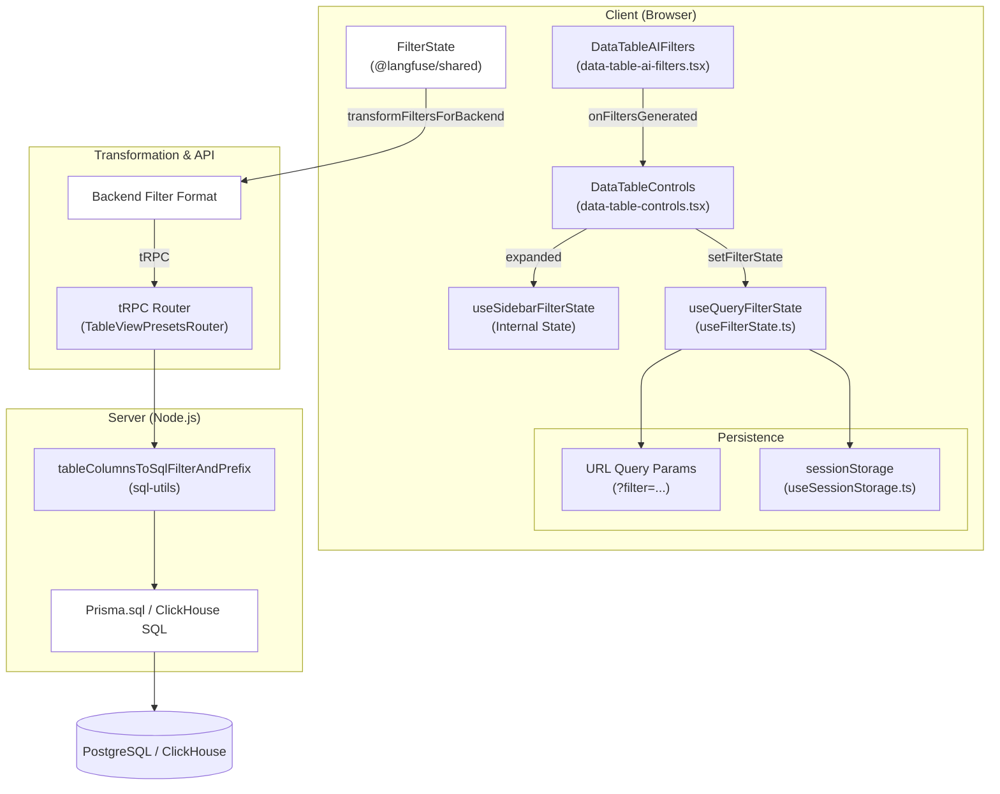
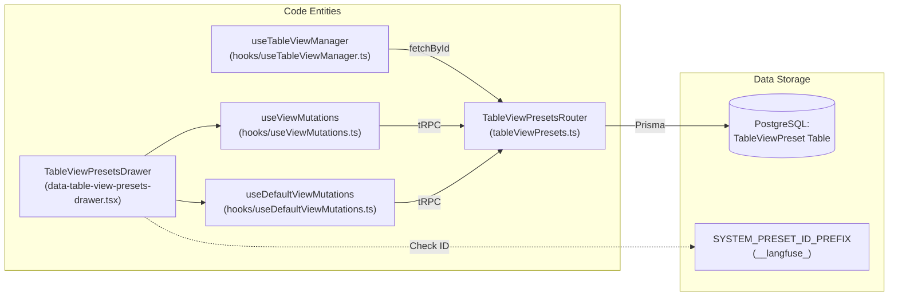

## Purpose & Scope

The Filter & View System provides a comprehensive filtering and view management infrastructure for all data tables in the Langfuse web application. It enables users to interactively filter table data, save filter configurations as reusable views (presets), and persist filter state across sessions. This system is used across traces, observations, scores, sessions, prompts, and user tables.

For information about the underlying table components that render filtered data, see [Table Components System](8.2). For state management patterns used by filters, see [UI State Management](8.3).

---

## Architecture Overview

The filter system operates as a coordinated client-server architecture where filter state is managed on the client, persisted to URLs and session storage, transformed for backend consumption, and executed as SQL queries on the server.

### System Data Flow

The following diagram bridges the Natural Language UI concepts to the Code Entities that implement them.

**Title: Filter Data Flow: UI to Database**

**Sources:** [web/src/features/filters/hooks/useFilterState.ts:127-171](), [web/src/features/filters/hooks/useSidebarFilterState.tsx:42-89](), [web/src/server/api/routers/tableViewPresets.ts:26-26]()

---

## Filter State Management

### Core State Hook: `useQueryFilterState`

The system's primary mechanism for filter persistence is the `useQueryFilterState` hook. It synchronizes the table's filter state across three locations:
1.  **React State**: For immediate UI reactivity.
2.  **URL Query Parameters**: Using `use-query-params` for shareable links via the `filter` key [web/src/features/filters/hooks/useFilterState.ts:157-160]().
3.  **Session Storage**: To preserve filters when navigating between pages within a project, using keys like `${table}FilterState-${projectId}` [web/src/features/filters/hooks/useFilterState.ts:134-138]().

### Encoding & Decoding
Filters are serialized into a semicolon-delimited format for the URL to keep them compact.
**Format**: `columnId;type;key;operator;value`
**Multiple Filters**: Separated by commas [web/src/features/filters/hooks/useFilterState.ts:40-76]().
**Array Values**: Joined with `|` (pipes) [web/src/features/filters/hooks/useFilterState.ts:63-63]().

The `decodeAndNormalizeFilters` function ensures that filters from URLs are validated against `columnDefinitions` and that legacy display names are normalized to canonical column IDs [web/src/features/filters/hooks/useSidebarFilterState.tsx:42-89](). To handle literal pipe characters within values (e.g., in tags), the system uses `escapePipeInValue` and `splitOnUnescapedPipe` [web/src/features/filters/lib/filter-query-encoding.ts:11-43]().

**Sources:** [web/src/features/filters/hooks/useFilterState.ts:39-124](), [web/src/features/filters/lib/filter-query-encoding.ts:11-43](), [web/src/features/filters/hooks/useSidebarFilterState.tsx:42-89]()

---

## Filter Components & Configuration

### Filter Types and Operators
The system supports several facet types defined in `FilterConfig` [web/src/features/filters/lib/filter-config.ts:52-59]():

| Type | Operators | Description |
| :--- | :--- | :--- |
| `categorical` | `any of`, `none of`, `all of` | Checkbox selection with counts [web/src/features/filters/hooks/useSidebarFilterState.tsx:137-178](). |
| `numeric` | `=`, `>`, `<`, `>=`, `<=` | Range sliders or direct input [web/src/features/filters/hooks/useSidebarFilterState.tsx:180-187](). |
| `string` | `contains`, `does not contain`, `=`, `!=` | Free text filtering [web/src/features/filters/hooks/useSidebarFilterState.tsx:189-193](). |
| `boolean` | `=` | Toggle for true/false values [web/src/features/filters/lib/filter-config.ts:18-23](). |
| `keyValue` | `any of`, `none of` | Key-based filtering for metadata/scores [web/src/features/filters/hooks/useSidebarFilterState.tsx:197-201](). |
| `numericKeyValue` | `=`, `>`, `<`, `>=`, `<=` | Numeric filtering for specific keys [web/src/features/filters/hooks/useSidebarFilterState.tsx:205-209](). |

### Filter Configurations
Each table defines its filterable facets via a `FilterConfig` object:
- **Observations/Events**: `observationEventsFilterConfig` defines facets for `latency`, `inputTokens`, `scores_avg`, and `metadata` [web/src/features/events/config/filter-config.ts:28-253]().
- **Observations**: `observationFilterConfig` maps UI columns to backend keys (e.g., `tags` to `traceTags`) [web/src/features/filters/config/observations-config.ts:15-191]().
- **Sessions**: `sessionFilterConfig` includes facets for `sessionDuration` and `bookmarked` status [web/src/features/filters/config/sessions-config.ts:16-134]().

**Sources:** [web/src/features/events/config/filter-config.ts:28-253](), [web/src/features/filters/config/observations-config.ts:15-191](), [web/src/features/filters/config/sessions-config.ts:16-134](), [web/src/features/filters/lib/filter-config.ts:52-67]()

---

## Natural Language Filter Generation (Cloud-Only)

On Langfuse Cloud, the `DataTableControls` component includes a `DataTableAIFilters` popover [web/src/components/table/data-table-controls.tsx:161-179](). This feature allows users to describe filters in natural language.

1. **Input**: User enters a prompt (e.g., "show me all traces with latency over 5s").
2. **Generation**: The AI generates a `FilterState` based on the query. This is handled by the `naturalLanguageFilters` tRPC router which uses LLMs to map text to structured filters [web/src/features/natural-language-filters/server/router.ts:1-50]().
3. **Application**: The `handleFiltersGenerated` callback applies the new filters and automatically expands the corresponding accordion sections in the sidebar [web/src/components/table/data-table-controls.tsx:115-134]().

**Sources:** [web/src/components/table/data-table-controls.tsx:115-179](), [web/src/features/natural-language-filters/server/router.ts:1-50]()

---

## Saved Views (TableViewPresets)

The View System allows users to save a specific combination of filters, sorting, and column visibility as a "Preset".

### View Preset Logic
**Title: View Preset Management Entities**

### TableViewPresetsDrawer
The `TableViewPresetsDrawer` component manages the UI for creating, updating, and selecting views [web/src/components/table/table-view-presets/components/data-table-view-presets-drawer.tsx:172-176]():
- **System Presets**: Identified by `SYSTEM_PRESET_ID_PREFIX` (`__langfuse_`). These are hardcoded (e.g., `__langfuse_default__`) and not stored in the database [web/src/components/table/table-view-presets/components/data-table-view-presets-drawer.tsx:93-97]().
- **System Filter Presets**: Page-specific presets can be injected via `systemFilterPresets` to provide quick filters for specific contexts [web/src/components/table/table-view-presets/components/data-table-view-presets-drawer.tsx:152-154]().
- **Default Views**: Users can set a specific view as the default for a project/table using `setViewAsDefault` [web/src/components/table/table-view-presets/components/data-table-view-presets-drawer.tsx:209-210](). This involves the `DefaultViewService` which manages user-level and project-level view assignments [packages/shared/src/server/services/DefaultViewService/DefaultViewService.ts:1-100]().

### View Lifecycle & Bootstrapping
The `useTableViewManager` hook coordinates the application of saved views upon page load [web/src/components/table/table-view-presets/hooks/useTableViewManager.ts:53-60](). It follows a strict priority list for bootstrapping:
1. **URL Parameters**: If `viewId` is present in the URL [web/src/components/table/table-view-presets/hooks/useTableViewManager.ts:73-77]().
2. **Session Storage**: Restores the last used view for that specific table and project via `useSessionStorage` [web/src/components/table/table-view-presets/hooks/useTableViewManager.ts:69-72]().
3. **Database Default**: Fetches the user's or project's designated default view via `api.TableViewPresets.getDefault` [web/src/components/table/table-view-presets/hooks/useTableViewManager.ts:84-91]().

**Sources:** [web/src/components/table/table-view-presets/components/data-table-view-presets-drawer.tsx:89-215](), [web/src/components/table/table-view-presets/hooks/useTableViewManager.ts:53-186](), [web/src/server/api/routers/tableViewPresets.ts:195-208](), [packages/shared/src/server/services/DefaultViewService/DefaultViewService.ts:1-100]()