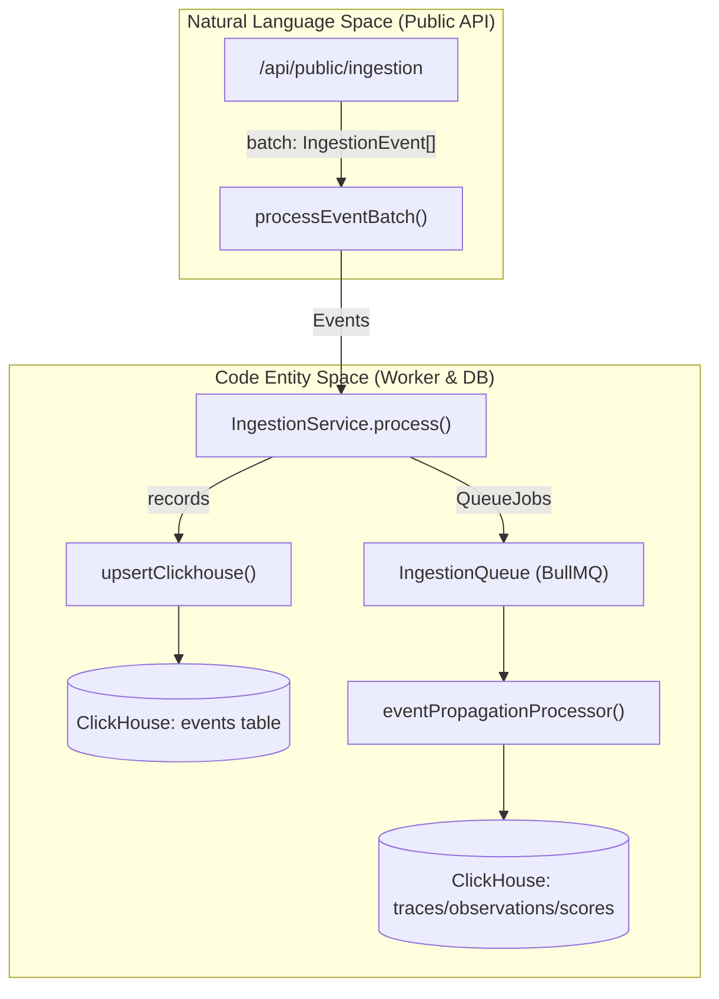
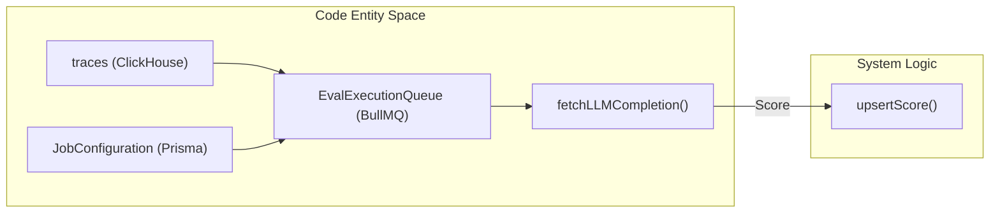

This page defines codebase-specific terms, abbreviations, and domain concepts used within the Langfuse platform. It serves as a technical reference for onboarding engineers to navigate the dual-database architecture and event-driven pipeline.

## Core Domain Entities

The primary data models are defined in the Prisma schema and mirrored in ClickHouse for high-performance analytics.

| Term | Definition | Key Code Reference |
| :--- | :--- | :--- |
| **Trace** | The top-level container for a single request or execution flow. It tracks the overall latency and metadata for an LLM interaction. | `TraceRecordReadType` [packages/shared/src/server/repositories/definitions.ts:18-18]() |
| **Observation** | A granular event within a trace. Types include `SPAN`, `GENERATION`, `EVENT`, and `TOOL`. | `ObservationRecordReadType` [packages/shared/src/server/repositories/definitions.ts:22-22]() |
| **Generation** | A specific type of Observation that tracks LLM calls, including prompt input, completion output, and token usage. | `ObservationType` [packages/shared/src/domain/observations.ts:14-14]() |
| **Score** | An evaluation metric attached to a Trace or Observation (e.g., accuracy, sentiment, user feedback). | `ScoreDomain` [packages/shared/src/domain/scores.ts:3-10]() |
| **Session** | A collection of multiple traces belonging to a single user interaction or conversation thread. | `getTracesGroupedBySessionId` [web/src/server/api/routers/traces.ts:50-50]() |
| **Prompt** | A versioned template for LLM inputs, supporting ChatML and text formats. | `prompt_id` [packages/shared/src/server/repositories/observations.ts:176-176]() |
| **Dataset** | A collection of items used for benchmarking and evaluation. | `DatasetService` [packages/shared/src/server/index.ts:17-17]() |

**Sources:** [packages/shared/src/server/repositories/definitions.ts:1-40](), [packages/shared/src/domain/observations.ts:1-20](), [web/src/server/api/routers/traces.ts:1-60](), [packages/shared/src/server/repositories/observations.ts:170-180]()

## Data Architecture Jargon

### Dual-Write / Event Sourcing
Langfuse uses an event-sourcing pattern where incoming data is first written to a staging area before being propagated to final analytical tables.

*   **Events Table**: The primary landing table in ClickHouse for all raw ingestion data. [packages/shared/src/server/repositories/events.ts:75-75]()
*   **Final Tables**: Tables like `traces`, `observations`, and `scores` in ClickHouse that use the `ReplacingMergeTree` engine to handle updates. [packages/shared/src/server/repositories/traces.ts:162-162](), [packages/shared/src/server/repositories/observations.ts:183-183]()
*   **Event Propagation**: The process of moving data from the `events` table to final analytical tables via the `eventPropagationProcessor`. [worker/src/app.ts:79-79]()

### ClickHouse Repository Pattern
The codebase abstracts complex ClickHouse SQL behind repository functions that handle deduplication (using `FINAL` or `LIMIT 1 BY id`) and time-window filtering.

*   **`checkTraceExistsAndGetTimestamp`**: A critical utility that validates if a trace exists within a window of a given timestamp to ensure eventual consistency during evaluation jobs. [packages/shared/src/server/repositories/traces.ts:58-72]()
*   **`upsertClickhouse`**: A shared utility to insert or update records in ClickHouse. [packages/shared/src/server/repositories/observations.ts:115-115]()
*   **`measureAndReturn`**: A wrapper used across repositories to instrument ClickHouse queries with OpenTelemetry and performance metrics. [packages/shared/src/server/repositories/traces.ts:128-155]()
*   **`queryClickhouseStream`**: Utility for streaming large datasets from ClickHouse, used in batch exports. [packages/shared/src/server/repositories/traces.ts:5-5]()

**Sources:** [packages/shared/src/server/repositories/traces.ts:58-192](), [packages/shared/src/server/repositories/observations.ts:64-126](), [worker/src/app.ts:70-80](), [packages/shared/src/server/repositories/events.ts:1-100]()

## Ingestion & Processing

### Ingestion Pipeline
The flow of data from external SDKs into the Langfuse storage layer.

**Diagram: Ingestion Data Flow**

**Sources:** [packages/shared/src/server/ingestion/processEventBatch.ts:1-20](), [worker/src/app.ts:47-47](), [worker/src/app.ts:79-79]()

### OTel (OpenTelemetry) Ingestion
Langfuse supports native OTel traces. The `OtelIngestionProcessor` maps OTel resource spans to Langfuse entities.

*   **`OtelIngestionProcessor`**: Handles the conversion of OTel spans, including extraction of attributes and mapping to Langfuse models. [packages/shared/src/server/otel/OtelIngestionProcessor.ts:142-169]()
*   **`ObservationTypeMapperRegistry`**: Registry that maps OTel span kinds and attributes to Langfuse observation types. [packages/shared/src/server/otel/OtelIngestionProcessor.ts:115-115]()
*   **`publishToOtelIngestionQueue`**: Uploads raw OTel spans to S3 and queues a job for asynchronous processing. [packages/shared/src/server/otel/OtelIngestionProcessor.ts:183-220]()

**Sources:** [packages/shared/src/server/otel/OtelIngestionProcessor.ts:1-200](), [packages/shared/src/server/otel/ObservationTypeMapper.ts:1-20]()

## Evaluation System

### Eval Jobs
Automated processes that run LLM-based evaluations on traces or dataset items.

**Diagram: Evaluation Lifecycle**

**Sources:** [packages/shared/src/server/repositories/traces.ts:58-72](), [worker/src/app.ts:42-44](), [packages/shared/src/server/repositories/scores.ts:151-166]()

## Pricing & Models

*   **Model Match Pattern**: A regex or string match used to link the `provided_model_name` from an ingestion event to a known model definition. [worker/src/constants/default-model-prices.json:5-5]()
*   **`UsageDetails`**: A record containing token counts (input, output, total) or other usage metrics. [packages/shared/src/server/repositories/observations.ts:169-169]()
*   **`PricingTier`**: A specific pricing configuration for a model, supporting different costs based on conditions. [worker/src/constants/default-model-prices.json:14-28]()

**Sources:** [worker/src/constants/default-model-prices.json:1-100](), [packages/shared/src/server/repositories/observations.ts:160-180]()

## Technical Abbreviations

| Abbreviation | Full Term | Description |
| :--- | :--- | :--- |
| **RBAC** | Role-Based Access Control | Managed via project and organization membership roles. [web/src/server/api/routers/traces.ts:3-3]() |
| **tRPC** | Typed RPC | Used for internal API communication between the Next.js frontend and backend routers. [web/src/server/api/routers/traces.ts:97-97]() |
| **CTE** | Common Table Expression | Used extensively in ClickHouse queries (e.g., `observations_agg`) to optimize aggregations. [packages/shared/src/server/repositories/traces.ts:102-126]() |
| **DLQ** | Dead Letter Queue | A BullMQ queue for failed jobs that require manual or automated retry. [worker/src/app.ts:74-74]() |
| **OTel** | OpenTelemetry | Standard for observability data ingestion. [packages/shared/src/server/otel/OtelIngestionProcessor.ts:1-20]() |

**Sources:** [web/src/server/api/routers/traces.ts:1-150](), [packages/shared/src/server/repositories/traces.ts:102-126](), [worker/src/app.ts:1-100]()