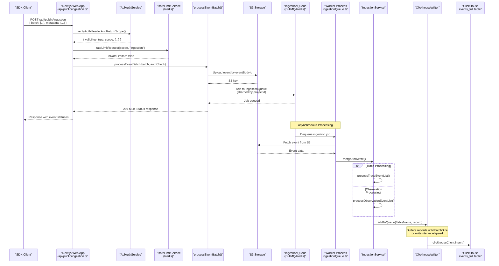
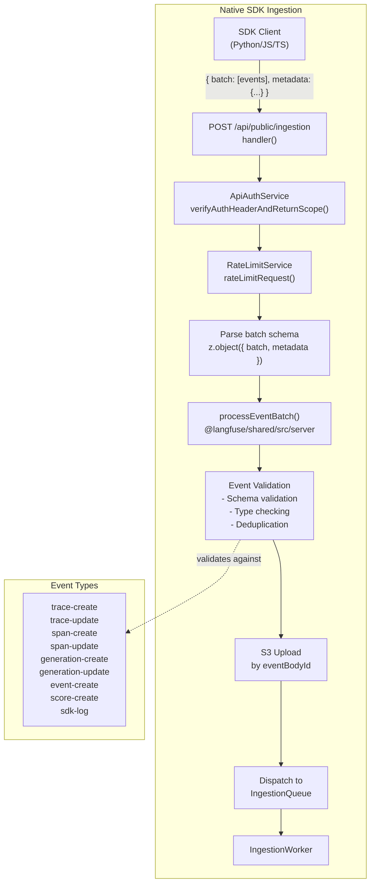
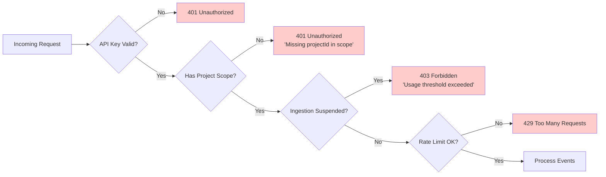
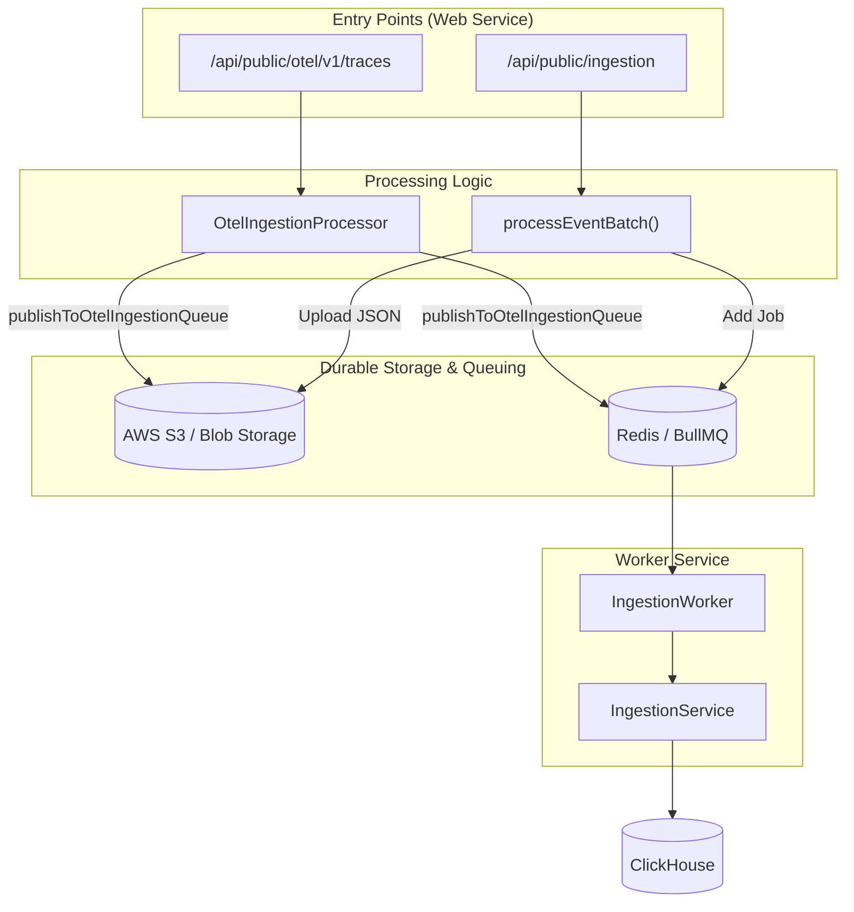
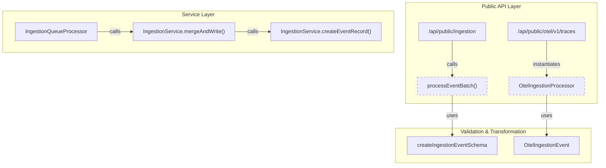
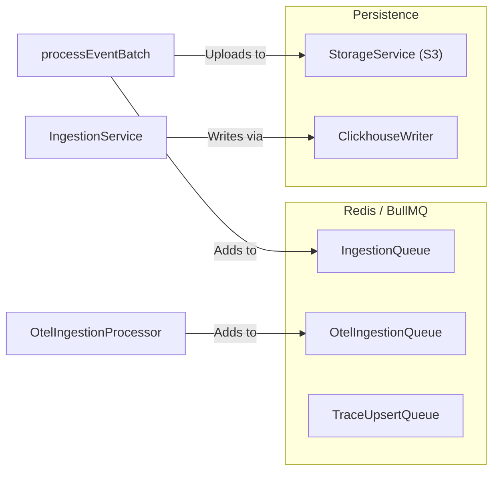

This document describes the high-level architecture of Langfuse's data ingestion system, which processes observability events from SDK clients and OpenTelemetry integrations. It covers the request flow from initial API authentication through asynchronous processing and eventual storage in ClickHouse.

## Purpose and Architecture

The ingestion system is designed to handle high-volume telemetry data with the following objectives:

- **Durability**: Events are persisted to S3 immediately upon receipt as an event cache and for long-term storage [web/src/pages/api/public/ingestion.ts:42-45]().
- **Scalability**: Asynchronous queue-based processing enables horizontal scaling via BullMQ and Redis [web/src/pages/api/public/ingestion.ts:44-44]().
- **Reliability**: The system supports fallback to synchronous processing on errors and utilizes a dual-write architecture for eventual consistency [web/src/pages/api/public/ingestion.ts:45-45]().
- **Flexibility**: Supports both native Langfuse SDK events and OpenTelemetry OTLP traces.

The system uses a **dual-database architecture** where PostgreSQL stores metadata and configuration, while ClickHouse stores high-volume event data.

## Ingestion Flow: Request to Storage

The following diagram associates high-level system components with specific code entities responsible for the ingestion flow.



**Sources:** [web/src/pages/api/public/ingestion.ts:50-139](), [worker/src/services/IngestionService/index.ts:149-195](), [web/src/pages/api/public/ingestion.ts:20-20]()

## Dual Ingestion Pathways

Langfuse supports two distinct ingestion mechanisms, each with its own endpoint and processing logic:

| Pathway | Endpoint | Event Format | Use Case |
|---------|----------|--------------|----------|
| **Native SDK** | `/api/public/ingestion` | Langfuse event schema (trace-create, span-create, score-create, etc.) | Applications using Langfuse Python/JS SDKs |
| **OpenTelemetry** | `/api/public/otel/v1/traces` | OTLP (OpenTelemetry Protocol) format | Applications using standard OpenTelemetry instrumentation |

### Native SDK Ingestion Path

The native path validates incoming batches against Zod schemas before persisting them to S3 and dispatching to the worker queue.



**Sources:** [web/src/pages/api/public/ingestion.ts:118-138](), [worker/src/services/IngestionService/index.ts:17-52](), [packages/shared/src/server/ingestion/types.ts:10-16]()

## Authentication and Rate Limiting

Before any event processing occurs, the ingestion endpoint enforces authentication and rate limiting using `ApiAuthService` and `RateLimitService`.



**Sources:** [web/src/pages/api/public/ingestion.ts:76-111](), [web/src/features/public-api/server/apiAuth.ts:86-198]()

## Core Component: processEventBatch

The `processEventBatch` function is the central orchestrator for event ingestion. It is imported from `@langfuse/shared/src/server` and handles:

1. **Event validation** - Schema validation for each event type.
2. **Deduplication** - Skip events that have already been processed.
3. **S3 persistence** - Upload each event to S3 for long-term storage and as an event cache [web/src/pages/api/public/ingestion.ts:43-43]().
4. **Queue dispatch** - Route events to the queue for async processing [web/src/pages/api/public/ingestion.ts:44-44]().

**Sources:** [web/src/pages/api/public/ingestion.ts:20-20](), [web/src/pages/api/public/ingestion.ts:134-137]()

## Storage and Processing: IngestionService

The `IngestionService` is responsible for transforming raw ingestion events into strict database records and performing necessary enrichments.

- **Merge and Write**: The entry point `mergeAndWrite` routes events to specific processors like `processTraceEventList`, `processObservationEventList`, or `processScoreEventList` [worker/src/services/IngestionService/index.ts:149-195]().
- **Enrichment**: The `createEventRecord` function performs complex lookups including prompt resolution (via `PromptService`) and model/usage enrichment (including tokenization and cost calculation) [worker/src/services/IngestionService/index.ts:212-236]().
- **Immutability**: The service enforces immutability for certain fields (e.g., `project_id`, `id`, `timestamp`) during updates to ensure data integrity [worker/src/services/IngestionService/index.ts:86-135]().

### Data Transformation Mapping

The system uses specific mapping functions to convert "read" schemas (what comes from the API) to "insert" schemas (what goes into ClickHouse):

| Entity | Mapping Function | Source |
|--------|------------------|--------|
| Trace | `convertTraceReadToInsert` | [worker/src/services/IngestionService/index.ts:15-15]() |
| Observation | `convertObservationReadToInsert` | [worker/src/services/IngestionService/index.ts:13-13]() |
| Score | `convertScoreReadToInsert` | [worker/src/services/IngestionService/index.ts:14-14]() |

**Sources:** [worker/src/services/IngestionService/index.ts:10-53](), [worker/src/services/IngestionService/index.ts:149-236]()

## The ClickhouseWriter Component

The `ClickhouseWriter` class manages buffered writes to ClickHouse to reduce connection overhead and improve throughput.

- **Batching**: It maintains internal queues for different tables (e.g., `traces`, `scores`, `observations`).
- **Flush Cycle**: It automatically flushes queues based on configurable batch sizes or time intervals.
- **Table Targets**: Common targets include `TableName.Traces`, `TableName.Scores`, and `TableName.Observations` [worker/src/services/IngestionService/index.ts:86-91]().

**Sources:** [worker/src/services/IngestionService/index.ts:57-57](), [worker/src/services/IngestionService/index.ts:86-91]()

## Error Handling and Retries

The ingestion pipeline implements multiple layers of error handling:
- **Request Validation**: Zod schemas catch malformed requests early [web/src/pages/api/public/ingestion.ts:123-131]().
- **Rate Limiting**: Redis-backed limits prevent API abuse; the system "fails open" if the rate limiter itself encounters an error [web/src/pages/api/public/ingestion.ts:103-116]().
- **API Error Responses**: The endpoint returns a `207 Multi-Status` response, allowing the caller to see individual successes and failures within a batch [web/src/pages/api/public/ingestion.ts:138-138]().
- **Exception Tracking**: Errors are captured and tracked via `traceException` and OpenTelemetry [web/src/pages/api/public/ingestion.ts:140-144](), [packages/shared/src/server/instrumentation/index.ts:141-188]().

**Sources:** [web/src/pages/api/public/ingestion.ts:140-173](), [packages/shared/src/server/instrumentation/index.ts:141-188]()

# Ingestion API Endpoints


This page documents the HTTP API endpoints that receive tracing data from external clients (SDKs, integrations, OpenTelemetry instrumentation). These endpoints serve as the entry point to Langfuse's data ingestion pipeline and are responsible for authentication, validation, and rate limiting before forwarding events to the asynchronous processing system.

For information about the internal processing logic after events are received, see [Ingestion Overview (6.1)]() and [Event Processing & Validation (6.3)]().

## Overview

The ingestion API provides two primary endpoints:

| Endpoint | Purpose | Auth Method | Max Body Size |
|----------|---------|-------------|---------------|
| `POST /api/public/ingestion` | Main batch ingestion endpoint for traces, spans, generations, and scores | Basic Auth (Public Key + Secret Key) | 4.5 MB |
| `POST /api/public/otel/v1/traces` | OpenTelemetry-specific ingestion endpoint | Basic Auth | 4.5 MB |

Both endpoints follow a similar authentication and rate-limiting pattern but handle different event formats. The main ingestion endpoint accepts Langfuse-native event schemas, while the OTel endpoint handles OpenTelemetry span data.

Sources: [web/src/pages/api/public/ingestion.ts:26-32](), [web/src/pages/api/public/ingestion.ts:50-53]()

## Main Ingestion Endpoint Architecture

The `/api/public/ingestion` endpoint is a high-throughput entry point designed for asynchronous processing. It performs minimal synchronous work (validation and auth) before offloading data to S3 and Redis-backed queues.

### Ingestion Request Flow

```mermaid
graph TB
    subgraph "Client Layer"
        "SDK"["SDK Client<br/>(Python/JS/TS)"]
        "CURL"["Direct HTTP Client<br/>(cURL/Postman)"]
    end
    
    subgraph "API Gateway (Next.js)"
        "Endpoint"["/api/public/ingestion<br/>POST only<br/>4.5 MB limit"]
        "CORS"["cors / runMiddleware()"]
    end
    
    subgraph "Validation & Auth"
        "Auth"["ApiAuthService<br/>verifyAuthHeaderAndReturnScope()"]
        "RateLimit"["RateLimitService<br/>rateLimitRequest()"]
        "Schema"["Zod Schema Validation<br/>batchType.safeParse()"]
    end
    
    subgraph "Shared Processing Layer"
        "Process"["processEventBatch()<br/>@langfuse/shared/src/server"]
        "S3Upload"["S3 Event Upload<br/>(EventBodyId partitioning)"]
        "QueueAdd"["BullMQ Dispatch<br/>(Ingestion Queue)"]
    end
    
    subgraph "Response"
        "MultiStatus"["207 Multi-Status Response<br/>Individual event results"]
        "ErrorResponse"["4xx/5xx Error Response"]
    end
    
    "SDK" --> "Endpoint"
    "CURL" --> "Endpoint"
    
    "Endpoint" --> "CORS"
    "CORS" --> "Auth"
    
    "Auth" -->|Invalid| "ErrorResponse"
    "Auth" -->|Valid| "RateLimit"
    
    "RateLimit" -->|Limited| "ErrorResponse"
    "RateLimit" -->|OK| "Schema"
    
    "Schema" -->|Invalid| "ErrorResponse"
    "Schema" -->|Valid| "Process"
    
    "Process" --> "S3Upload"
    "Process" --> "QueueAdd"
    "Process" --> "MultiStatus"
```

Sources: [web/src/pages/api/public/ingestion.ts:1-20](), [web/src/pages/api/public/ingestion.ts:34-49](), [web/src/pages/api/public/ingestion.ts:50-139]()

## Request Format

### HTTP Method and Headers
The ingestion endpoint only accepts `POST` requests. Authentication uses Basic Auth where the username is the `Public Key` and the password is the `Secret Key`.

Optional headers prefixed with `x-langfuse-` or `x_langfuse_` are captured and added to the OpenTelemetry span attributes for observability via `currentSpan?.setAttributes`.

Sources: [web/src/pages/api/public/ingestion.ts:73](), [web/src/pages/api/public/ingestion.ts:61-71]()

### Request Body Schema
The request body must contain a `batch` array and optional `metadata`.

```typescript
{
  batch: Array<IngestionEvent>,
  metadata?: any
}
```

The `batch` is validated using Zod at runtime to ensure it is an array of objects. Each object in the array is a discriminated union based on the `type` field.

Sources: [web/src/pages/api/public/ingestion.ts:118-131]()

### Event Types
The ingestion API supports several event types within a single batch.

| Type | Description |
|------|-------------|
| `trace-create` | Creates or updates a trace |
| `span-create` | Creates a new span observation |
| `span-update` | Updates an existing span |
| `generation-create` | Creates a generation (LLM call) |
| `generation-update` | Updates a generation |
| `score-create` | Creates a new evaluation score |
| `event-create` | Creates a basic event observation |
| `sdk-log` | SDK internal logging for debugging |

Sources: [web/src/pages/api/public/ingestion.ts:118-139](), [packages/shared/src/server/ingestion/validateAndInflateScore.ts:15]()

## Authentication and Rate Limiting

### API Key Verification
Authentication is handled by `ApiAuthService.verifyAuthHeaderAndReturnScope()`. This service validates the key against PostgreSQL (using `prisma`) and checks if the project has exceeded its usage threshold. The service utilizes `createShaHash` to compare provided credentials against stored `fastHashedSecretKey` values.

If `authCheck.scope.isIngestionSuspended` is true, the API returns a `403 Forbidden` error with the message "Ingestion suspended: Usage threshold exceeded. Please upgrade your plan."

Sources: [web/src/pages/api/public/ingestion.ts:76-94](), [web/src/features/public-api/server/apiAuth.ts:86-108](), [web/src/features/public-api/server/apiAuth.ts:186-197]()

### Rate Limit Enforcement
Rate limits are checked via `RateLimitService` using Redis as the backend. The service tracks "ingestion" specific limits per project. If a request is rate-limited, it returns a response via `sendRestResponseIfLimited`.

The system "fails open" for rate limiting: if the Redis check fails, the error is logged via `logger.error` but the request is allowed to proceed to ensure data availability.

Sources: [web/src/pages/api/public/ingestion.ts:103-116]()

## Processing and Response

### The 207 Multi-Status Response
Because a single request contains a batch of events, Langfuse uses HTTP `207 Multi-Status`. The response body contains two arrays: `successes` and `errors`, generated by `processEventBatch`.

```json
{
  "successes": [
    { "id": "event-1", "status": 201 }
  ],
  "errors": [
    { "id": "event-2", "status": 400, "message": "Invalid startTime" }
  ]
}
```

Sources: [web/src/pages/api/public/ingestion.ts:134-138]()

### Error Handling Flow

```mermaid
graph TD
    "Error"["Error Occurs"] --> "CheckType"["Check Error Type"]
    
    "CheckType" -->|UnauthorizedError| "E401"["401 Unauthorized"]
    "CheckType" -->|ForbiddenError| "E403"["403 Forbidden<br/>'Ingestion suspended'"]
    "CheckType" -->|ZodError| "E400"["400 Bad Request<br/>'Invalid request data'"]
    "CheckType" -->|BaseError| "EGeneric"["error.httpCode<br/>Structured JSON"]
    "CheckType" -->|PrismaException| "E500"["500 Internal Server Error"]
    
    "E401" --> "Return"
    "E403" --> "Return"
    "E400" --> "Return"
    "EGeneric" --> "Return"
    "E500" --> "Return"
    
    subgraph "Logging Side Effects"
        "E403" --> "Log"["logger.error() + traceException()"]
        "EGeneric" --> "Log"
        "E500" --> "Log"
    end
```

Sources: [web/src/pages/api/public/ingestion.ts:140-174](), [web/src/features/public-api/server/withMiddlewares.ts:114-164]()

## Score Ingestion Validation
When a `score-create` event is ingested, it undergoes specific validation via `validateAndInflateScore`. This ensures that scores comply with any linked `scoreConfig` (e.g., checking `maxValue`, `minValue`, or `categories`).

- **Annotation Scores**: If the source is `ANNOTATION`, a `configId` is mandatory.
- **Correction Scores**: `CORRECTION` type scores are mapped to a specific internal name and are restricted from being associated with sessions or dataset runs.
- **Data Type Inference**: If `dataType` is missing, it is inferred from the value (numeric vs categorical).

Sources: [packages/shared/src/server/ingestion/validateAndInflateScore.ts:23-81](), [packages/shared/src/server/ingestion/validateAndInflateScore.ts:130-151]()

## Technical Constraints

- **Batch Size Limit**: Requests are limited to **4.5 MB** via the Next.js `bodyParser` config in the API route.
- **Deduplication**: The system uses the `id` field within events to prevent duplicate processing.
- **Async Workflow**: The `processEventBatch` function uploads each event to S3 and adds the batch to a BullMQ queue for async processing.

Sources: [web/src/pages/api/public/ingestion.ts:26-32](), [web/src/pages/api/public/ingestion.ts:34-49]()

## Code Entity Reference

| Entity | Source File | Role |
|--------|-------------|------|
| `handler` | [web/src/pages/api/public/ingestion.ts:50]() | Entry point for `/api/public/ingestion` |
| `processEventBatch` | [web/src/pages/api/public/ingestion.ts:20]() | Orchestrates S3 upload and queue dispatch |
| `ApiAuthService` | [web/src/features/public-api/server/apiAuth.ts:29]() | Verifies Basic Auth and project scope |
| `validateAndInflateScore` | [packages/shared/src/server/ingestion/validateAndInflateScore.ts:23]() | Validates score events against configs |
| `instrumentAsync` | [packages/shared/src/server/instrumentation/index.ts:53]() | Wraps logic for OpenTelemetry tracing |

Sources: [web/src/pages/api/public/ingestion.ts:1-175](), [packages/shared/src/server/ingestion/validateAndInflateScore.ts:1-168](), [packages/shared/src/server/instrumentation/index.ts:53-93]()

# Event Processing & Validation


## Purpose and Scope

Event Processing & Validation is the critical entry stage of the Langfuse ingestion pipeline. It handles the transition of raw data from the Public API (REST or OpenTelemetry) into a structured, validated format suitable for storage and asynchronous processing. This stage is responsible for synchronous validation, deduplication using S3 as a durable buffer, and dispatching events to BullMQ queues.

This page details the implementation of `processEventBatch`, the event transformation logic in `IngestionService`, and the propagation system that ensures data consistency between staging tables and the modern ClickHouse events schema.

---

## Ingestion Flow Overview

The ingestion process follows two primary paths depending on the source: the standard Ingestion API and the OpenTelemetry (OTEL) collector. Both converge on S3 storage and BullMQ dispatch.

### High-Level Ingestion Architecture



**Sources:** [packages/shared/src/server/ingestion/processEventBatch.ts:104-125](), [web/src/pages/api/public/otel/v1/traces/index.ts:172-187](), [worker/src/app.ts:47-47]()

---

## Event Validation & Deduplication

### processEventBatch
The `processEventBatch` function is the core utility for handling incoming event arrays. It performs several critical steps:

1.  **Schema Validation**: It uses `createIngestionEventSchema` to validate every event in the batch. Invalid events are collected into an `errors` array and returned with a `207 Multi-Status` response. [packages/shared/src/server/ingestion/processEventBatch.ts:154-169]()
2.  **Authorization**: Checks if the API key scope permits the specific project ID referenced in the event. [packages/shared/src/server/ingestion/processEventBatch.ts:170-176]()
3.  **Grouping by eventBodyId**: Events are grouped by `eventBodyId` (typically the ID of the trace or observation). This allows Langfuse to batch multiple updates to the same entity into a single S3 object and queue job. [packages/shared/src/server/ingestion/processEventBatch.ts:192-209]()
4.  **S3 Upload**: Raw events are uploaded to S3. The path is constructed using the `eventBodyId` to ensure updates to the same entity are co-located. [packages/shared/src/server/ingestion/processEventBatch.ts:241-255]()
5.  **Queue Dispatch**: After successful upload, a job is added to the `IngestionQueue` via `IngestionQueue.getInstance().add()`. [packages/shared/src/server/ingestion/processEventBatch.ts:285-300]()

**Sources:** [packages/shared/src/server/ingestion/processEventBatch.ts:104-116](), [packages/shared/src/server/ingestion/types.ts:10-16]()

### OpenTelemetry Processing
The `OtelIngestionProcessor` handles the conversion of OTLP (OpenTelemetry Line Protocol) resource spans into Langfuse ingestion events.

-   **Parsing**: Supports both Protobuf and JSON formats for OTel traces. [web/src/pages/api/public/otel/v1/traces/index.ts:89-113]()
-   **Trace Deduplication**: It manages trace and observation mapping while ensuring that large payloads (up to 16MB) are logged and handled correctly. [web/src/pages/api/public/otel/v1/traces/index.ts:119-134]()
-   **Async Processing**: It uploads raw `resourceSpans` to S3 and triggers an `OtelIngestionJob`. [web/src/pages/api/public/otel/v1/traces/index.ts:187-187]()

**Sources:** [web/src/pages/api/public/otel/v1/traces/index.ts:33-47](), [packages/shared/src/server/queues.ts:30-47]()

---

## Implementation Details

### IngestionService Entity Routing
When a worker picks up an ingestion job, the `IngestionService.mergeAndWrite` method determines how to process the batch based on the `eventType`.

| Method | Role | Source |
| :--- | :--- | :--- |
| `processTraceEventList` | Merges trace updates and writes to `traces` table. | [worker/src/services/IngestionService/index.ts:163-169]() |
| `processObservationEventList` | Validates spans/generations and writes to staging. | [worker/src/services/IngestionService/index.ts:171-177]() |
| `processScoreEventList` | Validates and inflates scores (categorical/boolean). | [worker/src/services/IngestionService/index.ts:178-185]() |
| `processDatasetRunItemEventList` | Processes dataset run items for experiments. | [worker/src/services/IngestionService/index.ts:186-193]() |

### Event Record Creation & Enrichment
The `createEventRecord` method is the single point of transformation from loose `EventInput` to strict `EventRecordInsertType`. It performs:
-   **Prompt Lookup**: Resolves prompt IDs by name and version using `PromptService`. [worker/src/services/IngestionService/index.ts:223-233]()
-   **Model Enrichment**: Matches provided model names to calculate costs and token usage via `findModel` and `matchPricingTier`. [worker/src/services/IngestionService/index.ts:235-245]()
-   **Metadata Processing**: Metadata is processed using `convertPostgresJsonToMetadataRecord` to ensure compatibility with ClickHouse schemas. [worker/src/services/IngestionService/index.ts:60-60]()

### Usage and Cost Calculation
Langfuse supports both user-provided costs and automatic calculation based on model prices. The logic handles unit conversions (Tokens, Characters, Milliseconds, etc.) and prioritizes user-provided `costDetails` when available.

**Sources:** [worker/src/services/IngestionService/index.ts:212-220](), [packages/shared/src/server/ingestion/types.ts:20-41](), [worker/src/services/IngestionService/tests/IngestionService.integration.test.ts:108-125]()

---

## Code Entity Space Mapping

The following diagrams map the natural language concepts of "Processing" and "Storage" to specific code entities within the Langfuse repository.

### Processing Logic Mapping

**Sources:** [packages/shared/src/server/ingestion/processEventBatch.ts:104-107](), [web/src/pages/api/public/otel/v1/traces/index.ts:172-183](), [worker/src/services/IngestionService/index.ts:137-149]()

### Queue & Storage Mapping

**Sources:** [packages/shared/src/server/ingestion/processEventBatch.ts:21-22](), [worker/src/app.ts:35-38](), [worker/src/services/IngestionService/index.ts:57-57]()