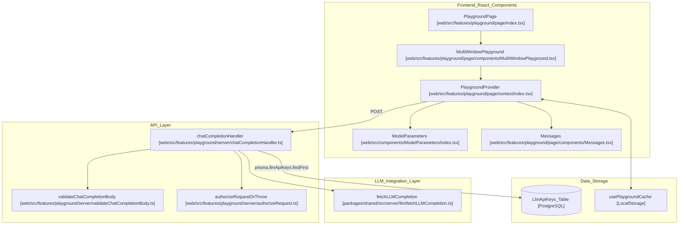
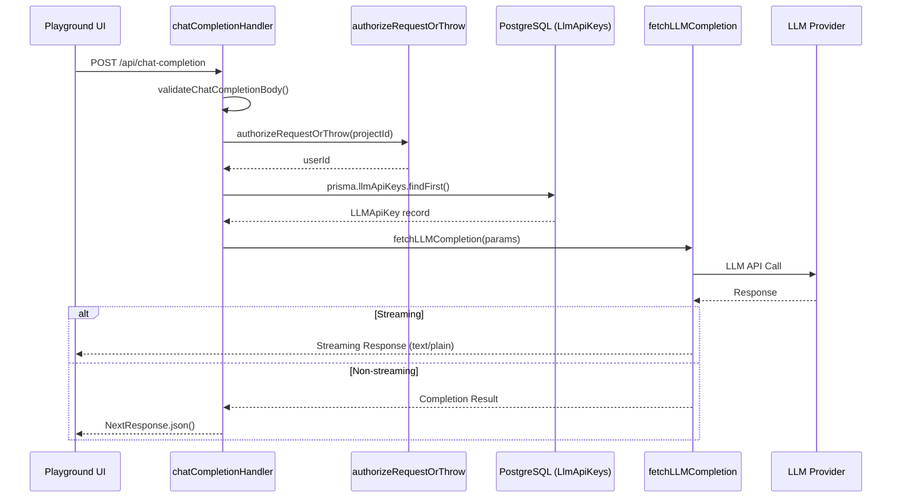

The LLM Playground is an interactive web interface for testing and experimenting with large language model (LLM) calls within Langfuse. It provides a multi-window chat-based UI where users can configure model parameters, send messages, and view responses in real-time. The playground supports multiple LLM providers (OpenAI, Anthropic, Azure, Bedrock, Vertex AI, Google AI Studio), advanced features like tool calling and structured output, and both streaming and non-streaming modes.

---

## Architecture Overview

The playground follows a client-server architecture where React components handle user interactions, a Next.js API route processes requests, and the shared `fetchLLMCompletion` function provides a unified interface to multiple LLM providers.

### System Components and Data Flow

The playground state is managed by the `PlaygroundProvider` which coordinates model parameters, chat messages, and tools across one or more windows.

**Diagram: Playground System Architecture**

Sources: `[web/src/features/playground/page/context/index.tsx:96-138]()`, `[web/src/features/playground/server/chatCompletionHandler.ts:24-55]()`, `[web/src/features/playground/page/components/MultiWindowPlayground.tsx:105-136]()`, `[web/src/features/playground/page/index.tsx:136-150]()`

---

## Request Flow

When a user submits a message in the playground, the following sequence occurs:

**Diagram: Playground Request Flow**

Sources: `[web/src/features/playground/server/chatCompletionHandler.ts:24-154]()`, `[web/src/features/playground/page/context/index.tsx:238-300]()`

---

## Chat Interface and Message Management

The playground utilizes a specialized chat interface that supports various message types, template variable highlighting, and placeholder management.

### Message Types and Roles
The playground supports standard LLM roles defined in `ChatMessageRole`: `System`, `Developer`, `User`, `Assistant`, and `Tool` `[web/src/features/playground/page/context/index.tsx:19-32]()`.

Messages are managed via the `MessagesContext` provided by `PlaygroundProvider` `[web/src/features/playground/page/context/index.tsx:78-82]()`. The system handles:
- **Assistant Tool Calls**: Specialized message types for representing model-generated tool requests `[web/src/utils/chatml/playgroundConverter.ts:105-111]()`.
- **Tool Results**: Messages containing the output of tool executions, linked via `toolCallId` `[web/src/utils/chatml/playgroundConverter.ts:115-132]()`.
- **Placeholder Messages**: Dynamic slots that can be filled with arrays of messages for testing complex prompt compositions `[web/src/features/playground/page/context/index.tsx:60-62]()`.

### Template Variables and Placeholders
The playground supports mustache-style variables (e.g., `{{variable_name}}`). 
- **Variable Extraction**: The `updatePromptVariables` callback in `PlaygroundProvider` uses `extractVariables` from `@langfuse/shared` to parse message content and identify active variables `[web/src/features/playground/page/context/index.tsx:210-217]()`.
- **Placeholder Management**: Users can define `messagePlaceholders` which allow injecting lists of `ChatMessage` objects into the prompt flow `[web/src/features/playground/page/context/index.tsx:105-107]()`.

Sources: `[web/src/features/playground/page/context/index.tsx:105-128]()`, `[web/src/utils/chatml/playgroundConverter.ts:52-140]()`

---

## Multi-Window Testing

The playground allows for side-by-side comparison of different models or prompts through a multi-window interface managed by `MultiWindowPlayground`.

- **State Isolation**: Each window is wrapped in its own `PlaygroundProvider` with a unique `windowId` `[web/src/features/playground/page/components/MultiWindowPlayground.tsx:124-132]()`.
- **Window Coordination**: Global actions like "Run All" are coordinated via the `useWindowCoordination` hook, which triggers execution across all active providers `[web/src/features/playground/page/index.tsx:51-56]()`.
- **Persistence**: Active window IDs are persisted in local storage via `usePersistedWindowIds` to maintain the workspace across page refreshes `[web/src/features/playground/page/hooks/usePersistedWindowIds.ts:1-50]()`.
- **Copying Windows**: Users can clone an existing window's state to a new window for rapid iteration on model parameters or prompt text `[web/src/features/playground/page/components/MultiWindowPlayground.tsx:94-99]()`.

Sources: `[web/src/features/playground/page/components/MultiWindowPlayground.tsx:47-138]()`, `[web/src/features/playground/page/index.tsx:136-230]()`

---

## Tool Calling and Structured Output

### Tool Calling Implementation
The playground supports complex tool-calling workflows. Tools are managed as `PlaygroundTool` objects `[web/src/features/playground/page/types.ts:21]()`.
- **Schema Management**: Tools can be selected from saved project tools (`api.llmTools.getAll`) or created via the `CreateOrEditLLMToolDialog` `[web/src/features/playground/page/components/PlaygroundTools/index.tsx:28-69]()`.
- **Request Handling**: If a message sequence contains `tool-result` types with missing IDs, the `chatCompletionHandler` attempts to "fix" them by mapping the result back to the most recent `assistant-tool-call` with a matching name `[web/src/features/playground/server/chatCompletionHandler.ts:91-116]()`.

### Structured Output
When a `structuredOutputSchema` is selected in the UI, it is passed to the backend. The `chatCompletionHandler` forces `streaming: false` when a schema is present, as structured output requires full completion parsing `[web/src/features/playground/server/chatCompletionHandler.ts:77-84]()`. Schemas are managed via the `StructuredOutputSchemaSection` component and can be persisted as `LlmSchema` records `[web/src/features/playground/page/components/StructuredOutputSchemaSection.tsx:154-195]()`.

Sources: `[web/src/features/playground/server/chatCompletionHandler.ts:86-125]()`, `[web/src/features/playground/page/components/PlaygroundTools/index.tsx:144-189]()`, `[web/src/features/playground/page/components/StructuredOutputSchemaSection.tsx:23-87]()`

---

## Testing Workflows

### Jump to Playground
Users can transition from existing tracing data to the playground using the `JumpToPlaygroundButton`. This feature normalizes data from different sources:

- **From Prompts**: Captures the prompt text and resolved variables `[web/src/features/playground/page/components/JumpToPlaygroundButton.tsx:127-128]()`.
- **From Generations**: Uses `normalizeInput` and `normalizeOutput` adapters (e.g., `openAIAdapter`, `langgraphAdapter`) to convert various framework formats into standard ChatML `[web/src/features/playground/page/components/JumpToPlaygroundButton.tsx:129-133]()`.
- **Format Conversion**: The `convertChatMlToPlayground` utility transforms normalized ChatML messages into the playground's internal `ChatMessage` or `PlaceholderMessage` types, handling nested tool calls and content parts like images or audio `[web/src/utils/chatml/playgroundConverter.ts:52-140]()`.

### LLM API Key Management
The playground utilizes keys stored in the `llmApiKeys` table. The `chatCompletionHandler` retrieves the appropriate key for the selected provider before making the external API call `[web/src/features/playground/server/chatCompletionHandler.ts:50-67]()`. It also filters available models based on the configured providers and custom model definitions `[web/src/features/playground/page/components/JumpToPlaygroundButton.tsx:102-120]()`.

Sources: `[web/src/features/playground/page/components/JumpToPlaygroundButton.tsx:73-186]()`, `[web/src/utils/chatml/playgroundConverter.ts:1-140]()`, `[web/src/features/playground/server/chatCompletionHandler.ts:50-75]()`