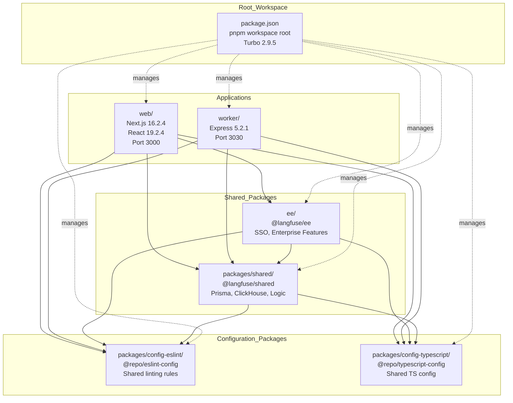
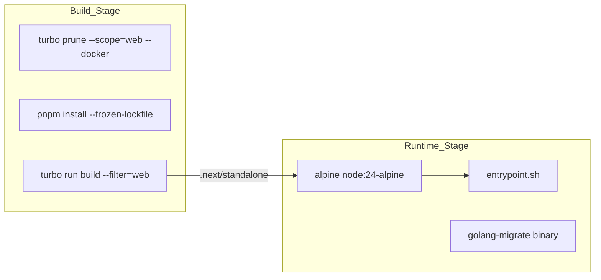

This document describes the pnpm workspace-based monorepo structure of the Langfuse codebase, including the organization of applications, shared packages, configuration packages, dependency management, and the `.agents/` AI agent skills system for developer tooling. For information about the overall system architecture and how these components interact at runtime, see [System Architecture]().

## Workspace Organization

The Langfuse repository is organized as a pnpm workspace monorepo managed by Turborepo for build orchestration. The workspace contains two primary deployable applications (`web` and `worker`) and several shared packages providing common functionality and configuration.

### Workspace Structure

The following diagram illustrates the dependency flow between workspace members and the central role of the root configuration.

Title: Langfuse Monorepo Dependency Graph

Sources: [package.json:1-52](), [pnpm-lock.yaml:24-132](), [web/package.json:1-170](), [worker/package.json:1-92](), [packages/shared/package.json:1-143](), [CONTRIBUTING.md:97-108]()

### Workspace Definition

The monorepo is defined using pnpm workspaces, configured in the root `package.json`. The workspace uses pnpm version 10.33.0 as the package manager and Turbo 2.9.5 for build orchestration.

| Workspace Member | Location | Package Name | Purpose |
|-----------------|----------|--------------|---------|
| Web Application | `web/` | `web` (private) | Next.js frontend and API routes [web/package.json:2-4]() |
| Worker Service | `worker/` | `worker` (private) | Express background job processor [worker/package.json:2-6]() |
| Shared Package | `packages/shared/` | `@langfuse/shared` | Prisma schemas, ClickHouse scripts, business logic [packages/shared/package.json:2-5]() |
| Enterprise Package | `ee/` | `@langfuse/ee` | SSO and enterprise-only features [ee/package.json:1-3]() |
| ESLint Config | `packages/config-eslint/` | `@repo/eslint-config` | Shared linting configuration [packages/config-eslint/package.json:1-3]() |
| TypeScript Config | `packages/config-typescript/` | `@repo/typescript-config` | Shared TypeScript compiler options [packages/config-typescript/package.json:1-3]() |

Sources: [package.json:51-100](), [pnpm-lock.yaml:24-132](), [CONTRIBUTING.md:97-108]()

## Applications

### Web Application (`web/`)

The web application is built with Next.js 16.2.4 and React 19.2.4. It serves as the primary entry point for the UI and public ingestion APIs.

**Key Dependencies:**
- `@langfuse/shared`: Core business logic and database access [web/package.json:45]()
- `@langfuse/ee`: Enterprise features [web/package.json:44]()
- `next`: Framework version 16.2.4 [web/package.json:127]()
- `prisma`: Database ORM [web/package.json:135]()
- `bullmq`: Queue management [web/package.json:102]()

Sources: [web/package.json:1-170](), [CONTRIBUTING.md:45-52]()

### Worker Service (`worker/`)

The worker service is an Express 5.2.1 application that processes background jobs from BullMQ queues.

**Key Dependencies:**
- `@langfuse/shared`: Shared business logic [worker/package.json:35]()
- `express`: HTTP server version 5.2.1 for health checks and metrics [worker/package.json:57]()
- `bullmq`: Queue processing [worker/package.json:50]()

**Build Configuration:**
- TypeScript compilation via `tsc` [worker/package.json:20]()
- Entrypoint: `dist/index.js` [worker/package.json:19]()

Sources: [worker/package.json:1-92]()

## Shared Packages

### @langfuse/shared

The core logic layer containing database schemas and shared server-side utilities. It acts as the "Single Source of Truth" for the data models used by both `web` and `worker`.

**Package Exports:**
- `.`: Main entry [packages/shared/package.json:18-21]()
- `./src/db`: Prisma client and DB utilities [packages/shared/package.json:22-25]()
- `./src/env`: Environment variable validation [packages/shared/package.json:26-29]()
- `./src/server`: Server-side logic [packages/shared/package.json:30-33]()
- `./encryption`: Encryption utilities [packages/shared/package.json:42-45]()

**Database Management:**
- Prisma schema and migrations [packages/shared/package.json:58-64]()
- ClickHouse scripts (`ch:up`, `ch:reset`, `ch:dev-tables`) [packages/shared/package.json:67-71]()

Sources: [packages/shared/package.json:1-143]()

### @langfuse/ee

Contains enterprise edition features like SSO and advanced billing. It depends on `@langfuse/shared` and is linked via the workspace protocol.

Sources: [pnpm-lock.yaml:50-54](), [CONTRIBUTING.md:107](), [ee/package.json:29]()

## AI Agent Skills System (`.agents/`)

The repository includes a dedicated `.agents/` directory that houses an AI agent skills system designed for developer tooling and automation. This system allows AI assistants (like Claude or OpenAI-based agents) to perform complex repository tasks using standardized instructions and scripts.

### Skill Structure
Each skill is contained within its own directory under `.agents/skills/` (e.g., `backend-dev-guidelines`, `debug-issue-with-datadog`) and typically includes documentation and implementation scripts [CONTRIBUTING.md:160-165]().

### Agent Tooling Integration
The repository provides scripts to sync agent "shims" and configurations:
- `pnpm run agents:sync`: Executes `node scripts/agents/sync-agent-shims.mjs` to synchronize agent tools [package.json:12]().
- `pnpm run agents:check`: Checks the status of agent shims [package.json:11]().

Sources: [package.json:11-12](), [CONTRIBUTING.md:160-165]()

## Dependency Management

### pnpm Workspace Configuration

The monorepo uses pnpm 10.33.0 with workspace protocols for internal dependencies and dependency overrides for security patches and consistency.

**Dependency Overrides:**
The root `package.json` defines overrides to ensure consistent and secure versions across all packages:

| Package | Override Version | Reason |
|---------|-----------------|--------|
| `zod` | `4.3.6` | Unified schema validation [package.json:103]() |
| `nanoid` | `^3.3.8` | Security patch [package.json:104]() |
| `katex` | `^0.16.21` | Security patch [package.json:105]() |
| `qs` | `6.14.1` | Security patch [package.json:111]() |
| `path-to-regexp` | `0.1.13` | Security patch [package.json:112]() |

**Patched Dependencies:**
- `next-auth@4.24.13`: Custom patch via `patches/next-auth@4.24.13.patch` [package.json:115]()

Sources: [package.json:101-117](), [pnpm-lock.yaml:7-22]()

### Node.js Version Pinning
The monorepo enforces Node.js 24 across all packages via the `engines` field and `.nvmrc`.
Sources: [package.json:8](), [web/package.json:7](), [worker/package.json:12](), [packages/shared/package.json:15](), [CONTRIBUTING.md:113]()

## Build System and Orchestration

### Turbo Configuration
Turbo 2.9.5 orchestrates builds, tests, and development tasks across the monorepo.

| Script | Command | Purpose |
|--------|---------|---------|
| `build` | `turbo run build` | Build all packages [package.json:26]() |
| `dev` | `turbo run dev` | Start all services [package.json:31]() |
| `db:generate` | `turbo run db:generate` | Generate Prisma clients [package.json:18]() |
| `db:migrate` | `turbo run db:migrate` | Run database migrations [package.json:19]() |
| `test` | `turbo run test` | Run tests across the workspace [package.json:39]() |

Sources: [package.json:10-51]()

### Docker Build Strategy
Both `web` and `worker` use multi-stage Dockerfiles utilizing `turbo prune` to optimize image size by isolating only the necessary dependencies for a specific target.

Title: Docker Build and Runtime Pipeline

Sources: [web/Dockerfile:36-176](), [worker/Dockerfile:21-101]()

## Version Management

Synchronized versioning is managed via `release-it` and the `@release-it/bumper` plugin, which updates version strings across the monorepo files.

| File | Entity |
|------|--------|
| `web/src/constants/VERSION.ts` | `VERSION` constant [web/src/constants/VERSION.ts:1]() |
| `worker/src/constants/VERSION.ts` | `VERSION` constant [worker/src/constants/VERSION.ts:1]() |
| `packages/shared/src/constants/VERSION.ts` | `VERSION` constant [package.json:68]() |
| `package.json` | Root version [package.json:3]() |

Sources: [package.json:53-99](), [web/src/constants/VERSION.ts:1](), [worker/src/constants/VERSION.ts:1]()