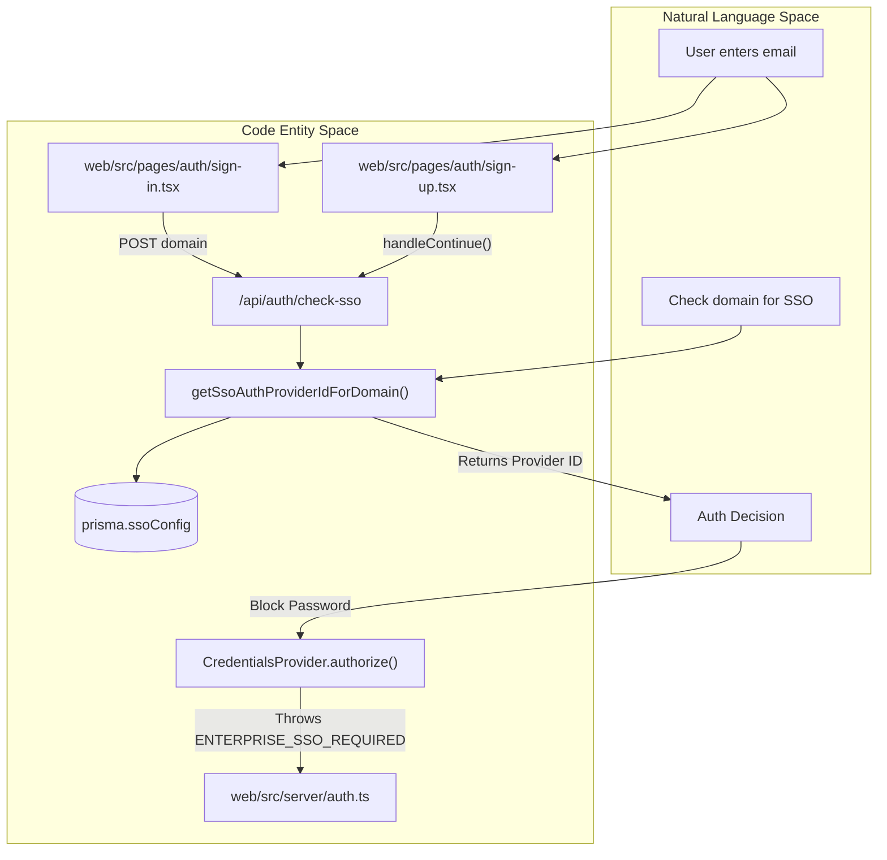
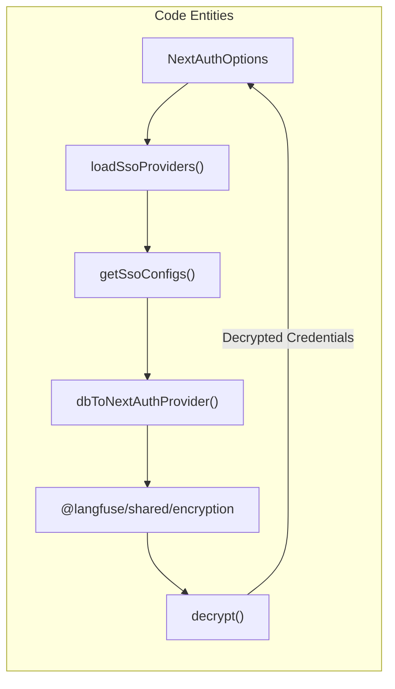
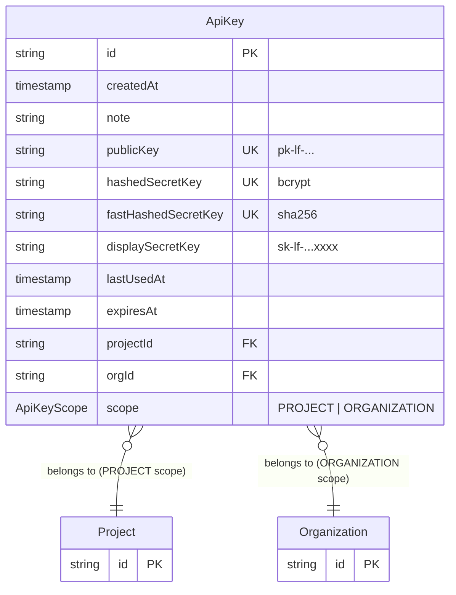
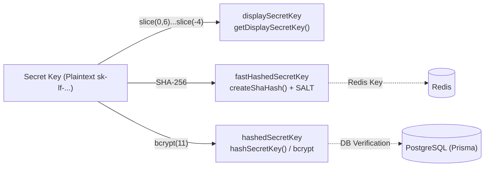
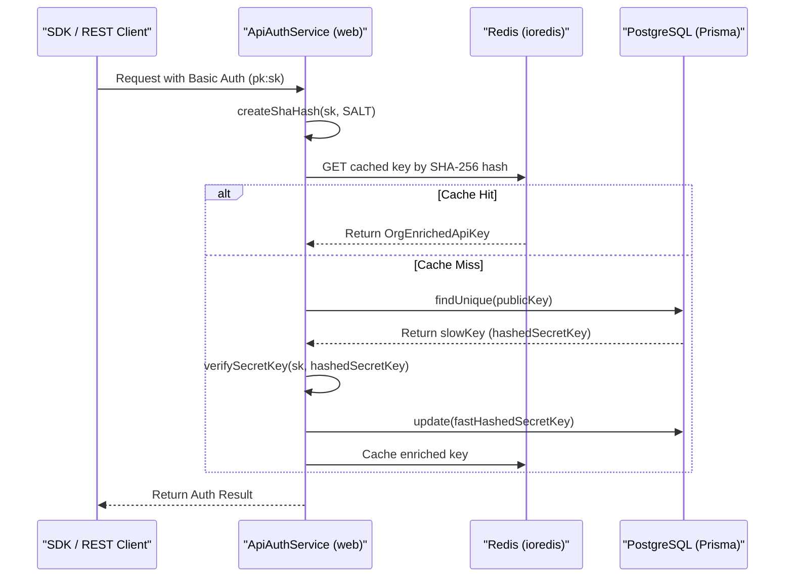

## Purpose and Scope

This page documents Langfuse's multi-tenant Single Sign-On (SSO) system, which allows organizations to configure domain-specific SSO providers that are dynamically detected and enforced at authentication time. This enables each organization to use their own identity provider (e.g., Okta, Azure AD, Keycloak) based on their email domain, without requiring global environment variables or application restarts.

For information about the general authentication system including NextAuth.js configuration and static SSO providers, see [Authentication System (4.1)](4.1). For details about role-based access control after authentication, see [RBAC & Permissions (4.4)](4.4).

---

## System Overview

The multi-tenant SSO system enables domain-based SSO provider routing. When a user enters their email address during sign-in or sign-up, the system:

1.  **Detection**: Extracts the email domain (e.g., `example.com`) and queries the `SsoConfig` table.
2.  **Routing**: If a configuration exists, it redirects the user to the organization-specific SSO provider.
3.  **Enforcement**: If configured, it blocks password-based login for that domain to ensure compliance with organization security policies.
4.  **Credential Management**: Stores OAuth credentials per-organization, encrypted at rest.

This functionality is gated by the enterprise edition license check in `multiTenantSsoAvailable`.

**Sources:** [web/src/ee/features/multi-tenant-sso/utils.ts:12-45](), [web/src/server/auth.ts:41-45]()

---

## Architecture Diagram

### Sign-in Flow and SSO Detection



**Sources:** [web/src/server/auth.ts:114-119](), [web/src/ee/features/multi-tenant-sso/utils.ts:132-142](), [web/src/pages/auth/sign-in.tsx:97-182](), [web/src/pages/auth/sign-up.tsx:113-131]()

---

## Database Schema: SsoConfig Table

The `SsoConfig` table stores domain-specific SSO configurations in PostgreSQL. Each record associates an email domain with an SSO provider and its encrypted credentials.

| Field | Type | Description |
| :--- | :--- | :--- |
| `domain` | `string` | Email domain (lowercase), primary key. |
| `authProvider` | `enum` | One of supported provider types (e.g., `google`, `okta`, `azure-ad`). |
| `authConfig` | `JSON` | Encrypted provider-specific configuration containing `clientId` and `clientSecret`. |

When `authConfig` is populated, it contains domain-specific OAuth credentials that override global environment variables defined in `env.mjs`.

**Sources:** [web/src/ee/features/multi-tenant-sso/utils.ts:13-15](), [web/src/ee/features/multi-tenant-sso/types.ts:3-7](), [web/src/env.mjs:113-182]()

---

## Supported SSO Provider Types

The system supports a wide array of SSO providers, each with a specific configuration schema defined in `SsoProviderSchema` using Zod discriminated unions:

| Provider | Type Literal | Required Config Fields |
| :--- | :--- | :--- |
| Google | `"google"` | `clientId`, `clientSecret` |
| GitHub | `"github"` | `clientId`, `clientSecret` |
| GitHub Enterprise | `"github-enterprise"` | `clientId`, `clientSecret`, `enterprise.baseUrl` |
| GitLab | `"gitlab"` | `clientId`, `clientSecret`, optional `issuer` |
| Azure AD | `"azure-ad"` | `clientId`, `clientSecret`, `tenantId` |
| Okta | `"okta"` | `clientId`, `clientSecret`, `issuer` (https required) |
| Authentik | `"authentik"` | `clientId`, `clientSecret`, `issuer` (regex validated) |
| OneLogin | `"onelogin"` | `clientId`, `clientSecret`, `issuer` |
| Auth0 | `"auth0"` | `clientId`, `clientSecret`, `issuer` |
| Cognito | `"cognito"` | `clientId`, `clientSecret`, `issuer` |
| Keycloak | `"keycloak"` | `clientId`, `clientSecret`, `issuer`, optional `name` |
| JumpCloud | `"jumpcloud"` | `clientId`, `clientSecret`, `issuer` |
| Custom OIDC | `"custom"` | `clientId`, `clientSecret`, `issuer`, `name` |

**Sources:** [web/src/ee/features/multi-tenant-sso/types.ts:38-226]()

---

## Dynamic Provider Loading System

### Provider Loading at Startup



The system loads custom SSO providers dynamically through the `loadSsoProviders()` function called during NextAuth initialization in `auth.ts`:

1.  **Fetch configurations**: `getSsoConfigs()` queries the `SsoConfig` table with aggressive caching [web/src/ee/features/multi-tenant-sso/utils.ts:38-95]().
2.  **Parse and validate**: Each record is validated against `SsoProviderSchema` using Zod [web/src/ee/features/multi-tenant-sso/utils.ts:70-85]().
3.  **Transform to NextAuth providers**: `dbToNextAuthProvider()` converts database configs to NextAuth `Provider` instances [web/src/ee/features/multi-tenant-sso/utils.ts:195-255]().
4.  **Decrypt credentials**: Client secrets are decrypted using `decrypt()` from `@langfuse/shared/encryption` [web/src/ee/features/multi-tenant-sso/utils.ts:203]().

### Configuration Caching

The caching strategy in `getSsoConfigs()` optimizes performance by avoiding database lookups on every request:

*   **Cache TTL**: 1 hour for successful fetches [web/src/ee/features/multi-tenant-sso/utils.ts:41]().
*   **Failure retry**: 1 minute for failed fetches [web/src/ee/features/multi-tenant-sso/utils.ts:42]().
*   **Database timeout**: 2-second max wait and 3-second timeout via Prisma `$transaction` [web/src/ee/features/multi-tenant-sso/utils.ts:55-61]().

**Sources:** [web/src/ee/features/multi-tenant-sso/utils.ts:38-95](), [web/src/server/auth.ts:41-45]()

---

## SSO Enforcement and Detection

### Domain-based Blocking

The `CredentialsProvider` in `auth.ts` actively blocks password authentication for SSO-enforced domains. If a matching configuration is found for the domain via `getSsoAuthProviderIdForDomain(domain)`, it throws an error to force the user to use SSO.

```typescript
// web/src/server/auth.ts:116-120
const multiTenantSsoProvider =
  await getSsoAuthProviderIdForDomain(domain);
if (multiTenantSsoProvider) {
  throw new Error(ENTERPRISE_SSO_REQUIRED_MESSAGE);
}
```

### Sign-in Flow Integration

In `sign-in.tsx`, the application determines which providers to show based on environment variables and the presence of any multi-tenant SSO configurations via `isAnySsoConfigured()` [web/src/pages/auth/sign-in.tsx:98-174]().

**Sources:** [web/src/server/auth.ts:116-120](), [web/src/pages/auth/sign-in.tsx:98-174](), [web/src/ee/features/multi-tenant-sso/utils.ts:132-142]()

---

## Credential Encryption and Management

### Encryption Logic
SSO provider credentials (OAuth client secrets) are encrypted before storage to protect sensitive organization data.

*   **Encryption Key**: The `ENCRYPTION_KEY` environment variable must be a 64-character hex string (256-bit) [web/src/env.mjs:40-75](), [.env.prod.example:26]().
*   **Implementation**:
    *   **Storage**: In `createNewSsoConfigHandler`, credentials are encrypted using `encrypt(authConfig.clientSecret)` before being saved to the `SsoConfig` table [web/src/ee/features/multi-tenant-sso/createNewSsoConfigHandler.ts:63-75]().
    *   **Retrieval**: Decryption occurs in `dbToNextAuthProvider` using `decrypt(provider.authConfig.clientSecret)` from the shared encryption package [web/src/ee/features/multi-tenant-sso/utils.ts:203]().

### SSO Configuration Creation
New configurations are created via an admin-only API handler `createNewSsoConfigHandler`. This endpoint:
1. Verifies `multiTenantSsoAvailable` [web/src/ee/features/multi-tenant-sso/createNewSsoConfigHandler.ts:15-20]().
2. Validates the `ADMIN_API_KEY` bearer token or administrative session [web/src/ee/features/multi-tenant-sso/createNewSsoConfigHandler.ts:33-39]().
3. Ensures no existing config for the domain exists [web/src/ee/features/multi-tenant-sso/createNewSsoConfigHandler.ts:49-61]().
4. Encrypts the `clientSecret` and persists the record [web/src/ee/features/multi-tenant-sso/createNewSsoConfigHandler.ts:63-76]().

**Sources:** [web/src/ee/features/multi-tenant-sso/utils.ts:203](), [.env.prod.example:26](), [web/src/ee/features/multi-tenant-sso/createNewSsoConfigHandler.ts:10-84](), [web/src/env.mjs:40-75]()

# API Key Management


## Purpose and Scope

This document describes the API key management system used for programmatic authentication in Langfuse. API keys provide an alternative to session-based authentication and enable SDK and REST API access.

API keys in Langfuse have two distinct scopes: **project-level** (`PROJECT`) for accessing data within a specific project, and **organization-level** (`ORGANIZATION`) for administrative operations across an organization. Each key pair consists of a public key (visible) and a secret key (hashed and stored securely).

---

## API Key Data Model

### Database Schema

The `ApiKey` table in PostgreSQL (managed via Prisma) stores all API key metadata and credentials.



**Key Fields:**

| Field | Type | Purpose |
|-------|------|---------|
| `publicKey` | string (unique) | Client-visible identifier, starts with `pk-lf-`. [packages/shared/src/server/auth/apiKeys.ts:19]() |
| `hashedSecretKey` | string (unique) | Slow hash (bcrypt) for verification, used on cache misses. [packages/shared/src/server/auth/apiKeys.ts:13]() |
| `fastHashedSecretKey` | string (unique) | Fast hash (SHA-256) for Redis cache lookups. [packages/shared/src/server/auth/apiKeys.ts:61]() |
| `displaySecretKey` | string | Partial key shown in UI (e.g., `sk-lf-...xxxx`). [packages/shared/src/server/auth/apiKeys.ts:8]() |
| `scope` | `ApiKeyScope` | Enum: `PROJECT` or `ORGANIZATION`. [packages/shared/src/server/auth/apiKeys.ts:42]() |
| `projectId` | string | Required for `PROJECT` scope; null for `ORGANIZATION`. [packages/shared/src/server/auth/apiKeys.ts:64]() |
| `orgId` | string | Required for both scopes to identify the owner organization. [packages/shared/src/server/auth/apiKeys.ts:64]() |

Sources: `packages/shared/src/server/auth/apiKeys.ts`, `web/src/features/public-api/server/projectApiKeyRouter.ts`

---

## API Key Security

### Triple-Hash Strategy

Langfuse employs a three-tier hashing strategy for API key security to balance performance and safety.



### Security Components

| Component | Logic | Purpose |
|-----------|-----------|---------|
| `SALT` | `env.SALT` | Mixed with secret keys before SHA-256 hashing to prevent rainbow table attacks. [packages/shared/src/server/auth/apiKeys.ts:49]() |
| `fastHashedSecretKey` | `createShaHash(secretKey, salt)` | Used for fast lookups in Redis. The system trusts this hash if found in the cache. [packages/shared/src/server/auth/apiKeys.ts:61]() |
| `hashedSecretKey` | `bcrypt.hash(key, 11)` | Secure verification used during the "Slow Path" (cache miss). [packages/shared/src/server/auth/apiKeys.ts:13]() |
| `displaySecretKey` | `getDisplaySecretKey()` | Shows enough of the key for users to identify it in the UI without exposing the full secret. [packages/shared/src/server/auth/apiKeys.ts:7-9]() |

Sources: `packages/shared/src/server/auth/apiKeys.ts`

---

## API Key Authentication Flow

The `ApiAuthService` class (invoked in API routes) handles the verification of credentials provided in the `Authorization` header.

### Authentication Service Logic



### Verification Steps

1. **Header Extraction**: The service extracts credentials from the `Authorization` header.
2. **Fast Path (Redis)**: It generates a SHA-256 hash of the provided secret and attempts to fetch the key from Redis. [packages/shared/src/server/auth/apiKeys.ts:29-37]()
3. **Slow Path (Postgres)**: On a cache miss, it fetches the record from Postgres and performs a secure bcrypt verification using `verifySecretKey`. [packages/shared/src/server/auth/apiKeys.ts:24-27]()
4. **Cache Warmup**: If the bcrypt check succeeds but the `fastHashedSecretKey` was missing (legacy key), the database is updated with the SHA-256 hash to enable the "Fast Path" for future requests. [packages/shared/src/server/auth/apiKeys.ts:72]()

Sources: `packages/shared/src/server/auth/apiKeys.ts`, `web/src/features/public-api/server/projectApiKeyRouter.ts`

---

## API Key Management Operations

### Creation and Scoping

API keys are created using `createAndAddApiKeysToDb`. This function generates a new `pk-lf-...` and `sk-lf-...` pair, hashes them, and stores the record with the appropriate `ApiKeyScope`.

- **Project Scope**: Created via `projectApiKeysRouter.create`. Requires `projectId` and grants access to project-specific data. [web/src/features/public-api/server/projectApiKeyRouter.ts:46-75]()
- **Organization Scope**: Created via `organizationApiKeysRouter.create`. Requires `orgId` and grants access to organization-level operations. [web/src/features/public-api/components/CreateApiKeyButton.tsx:86-101]()

### UI Implementation

The `ApiKeyList` component displays keys and provides management actions. [web/src/features/public-api/components/ApiKeyList.tsx:38]()
- **Visibility**: Secret keys are only shown once upon creation via the `ApiKeyRender` component. [web/src/features/public-api/components/CreateApiKeyButton.tsx:160-197]()
- **Permissions**: Access is controlled via RBAC hooks `useHasProjectAccess` (scope `apiKeys:CUD`) and `useHasOrganizationAccess` (scope `organization:CRUD_apiKeys`). [web/src/features/public-api/components/ApiKeyList.tsx:48-55]()

### Deletion and Invalidation

When an API key is deleted:
1. **Database Removal**: The `ApiAuthService.deleteApiKey` method is called. [web/src/features/public-api/server/projectApiKeyRouter.ts:131-135]()
2. **Audit Logging**: An audit log entry is created for the "delete" action. [web/src/features/public-api/server/projectApiKeyRouter.ts:124-129]()

### Initialization (Provisioning)

Langfuse supports provisioning an initial organization, project, and API key via environment variables during startup in `web/src/initialize.ts`.

- **Variables**: `LANGFUSE_INIT_PROJECT_PUBLIC_KEY` and `LANGFUSE_INIT_PROJECT_SECRET_KEY`. [web/src/initialize.ts:18-19]()
- **Logic**: If a key exists for a different project, it is deleted before the provisioned key is created for the correct project. [web/src/initialize.ts:119-127]()
- **Flow**: `createAndAddApiKeysToDb` is called with `predefinedKeys` to ensure consistency across deployments. [web/src/initialize.ts:134-144]()

Sources: `web/src/features/public-api/components/ApiKeyList.tsx`, `web/src/features/public-api/components/CreateApiKeyButton.tsx`, `web/src/initialize.ts`, `packages/shared/src/server/auth/apiKeys.ts`

---

## Role-Based Access Control (RBAC)

API key management is restricted based on user roles:

| Action | Required Project Scope | Required Org Scope |
|--------|------------------------|--------------------|
| View Keys | `apiKeys:read` | `organization:CRUD_apiKeys` |
| Create/Delete Keys | `apiKeys:CUD` | `organization:CRUD_apiKeys` |

The `projectApiKeysRouter` enforces these checks using `throwIfNoProjectAccess` before performing any database operations. [web/src/features/public-api/server/projectApiKeyRouter.ts:21-25]()

Sources: `web/src/features/public-api/server/projectApiKeyRouter.ts`, `web/src/features/public-api/components/ApiKeyList.tsx`