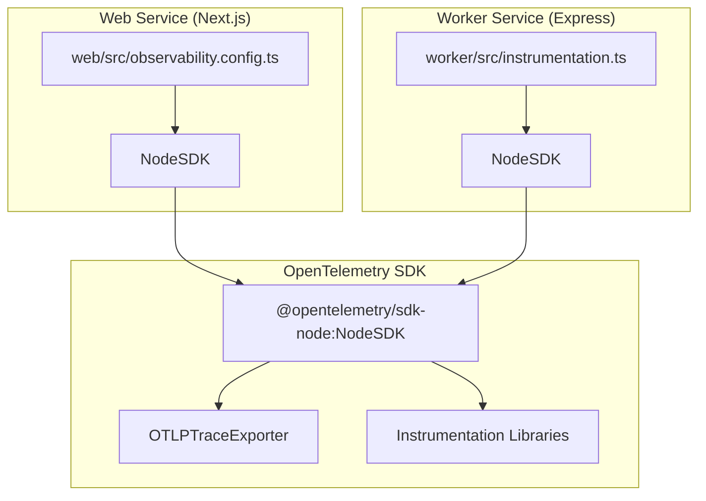
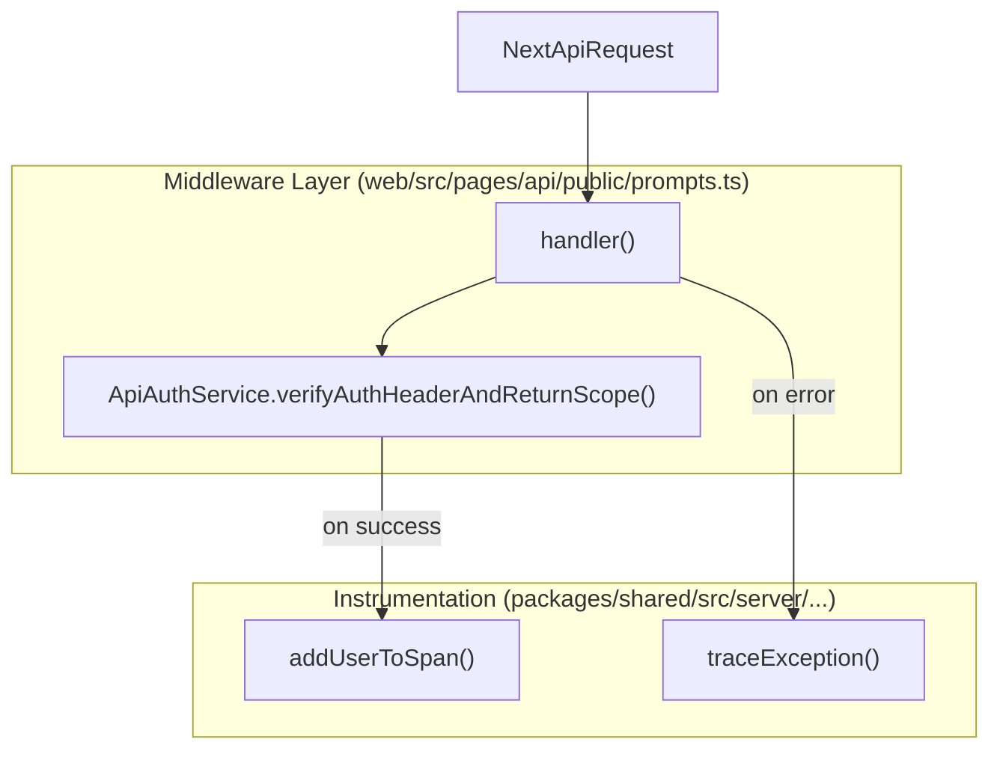
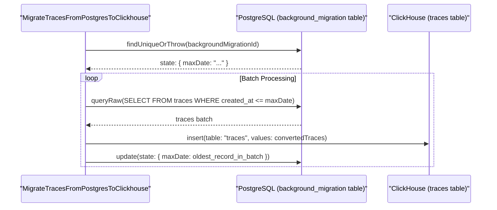
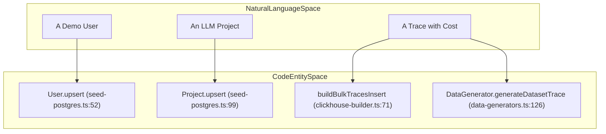

This document describes the observability and monitoring infrastructure in Langfuse, including distributed tracing, APM integration, error tracking, and metrics collection. This covers instrumentation for both the web and worker services.

For information about queue architecture and background processing, see [7. Queue & Worker System](). For deployment and infrastructure, see [11.2. Docker & Deployment]().

---

## Overview

Langfuse employs a multi-layered observability strategy:

1.  **OpenTelemetry** for distributed tracing and instrumentation.
2.  **DataDog APM** for application performance monitoring (Cloud deployments).
3.  **Sentry** for error tracking and monitoring (Web service).
4.  **PostHog** for product analytics and user behavior tracking.
5.  **Custom Metrics** for queue monitoring and operational metrics.
6.  **AWS CloudWatch** for metric publishing (optional).

Both the web and worker services are instrumented independently but follow similar patterns. The instrumentation is initialized at application startup before any other code runs.

---

## OpenTelemetry Instrumentation

### Initialization Flow

OpenTelemetry instrumentation is initialized at the earliest possible point in both services to ensure all subsequent modules are correctly wrapped. In the web service, this is handled via `observability.config.ts` [web/src/observability.config.ts:1-83](), while the worker uses a dedicated `instrumentation.ts` [worker/src/instrumentation.ts:1-79]().

**Title: OpenTelemetry Initialization Flow**

Sources: [web/src/observability.config.ts:2-26](), [worker/src/instrumentation.ts:2-26]()

### Configuration

Both services use identical OpenTelemetry SDK configuration with the following components:

| Component | Purpose | Configuration |
|-----------|---------|---------------|
| `NodeSDK` | Main SDK instance | Service name, version from `BUILD_ID` |
| `OTLPTraceExporter` | Exports traces via OTLP protocol | Endpoint from `OTEL_EXPORTER_OTLP_ENDPOINT` |
| Resource Detectors | Auto-detect deployment context | AWS ECS, Container, Process, Environment |
| Sampler (Web only) | Controls trace sampling rate | `TraceIdRatioBasedSampler` using `OTEL_TRACE_SAMPLING_RATIO` |

**Environment Variables:**

*   `OTEL_EXPORTER_OTLP_ENDPOINT`: OTLP endpoint URL (e.g., `http://localhost:4318/v1/traces`) [worker/src/instrumentation.ts:32-32]().
*   `OTEL_SERVICE_NAME`: Service identifier (e.g., "worker") [worker/src/instrumentation.ts:28-28]().
*   `OTEL_TRACE_SAMPLING_RATIO`: Sampling ratio 0.0-1.0 (web service only) [web/src/observability.config.ts:79-79]().
*   `BUILD_ID`: Used as service version for trace correlation [web/src/observability.config.ts:29-29]().

Sources: [web/src/observability.config.ts:26-80](), [worker/src/instrumentation.ts:26-78]()

### Instrumentation Libraries

The following OpenTelemetry instrumentation libraries are registered to capture telemetry from core dependencies:

*   **HttpInstrumentation**: Captures incoming and outgoing HTTP requests. It is configured to ignore health check endpoints (`/api/public/health`, `/api/public/ready`, `/api/health`) [web/src/observability.config.ts:38-42](), [worker/src/instrumentation.ts:38-42]().
*   **IORedisInstrumentation**: Instruments Redis operations. It includes a `requestHook` [packages/shared/src/server/instrumentation/index.ts:16-35]() that redacts sensitive credentials (AUTH/HELLO) and API key cache values [packages/shared/src/server/instrumentation/index.ts:23-33]().
*   **BullMQInstrumentation**: Configuration `{ useProducerSpanAsConsumerParent: true }` links consumer spans to producer spans across queue boundaries [web/src/observability.config.ts:71](), [worker/src/instrumentation.ts:68]().
*   **PrismaInstrumentation**: Instruments database queries, ignoring noisy span types like serialization [web/src/observability.config.ts:60-68](), [worker/src/instrumentation.ts:57-65]().
*   **WinstonInstrumentation**: Correlates logs with active traces while disabling direct log sending [web/src/observability.config.ts:70](), [worker/src/instrumentation.ts:67]().

Sources: [web/src/observability.config.ts:34-72](), [worker/src/instrumentation.ts:34-69](), [packages/shared/src/server/instrumentation/index.ts:16-35]()

---

## DataDog APM Integration

DataDog's `dd-trace` library is initialized for production monitoring in Langfuse Cloud deployments.

### Initialization

Both services initialize `dd-trace` before other modules to allow for automatic monkey-patching:

```javascript
// web/src/observability.config.ts & worker/src/instrumentation.ts
dd.init({
  runtimeMetrics: true,
  plugins: false, // OpenTelemetry handles standard instrumentations
});
```
Sources: [web/src/observability.config.ts:21-24](), [worker/src/instrumentation.ts:21-24]()

### Exception Tracing

Langfuse provides a `traceException` utility [packages/shared/src/server/instrumentation/index.ts:141-188]() that adds specific tags for DataDog error tracking, including `error.stack`, `error.message`, and `error.type` [packages/shared/src/server/instrumentation/index.ts:178-182]().

Sources: [packages/shared/src/server/instrumentation/index.ts:141-188]()

---

## PostHog Analytics

Langfuse uses PostHog for product analytics, capturing user interactions and system events.

### Client-side Implementation

The `usePostHogClientCapture` hook [web/src/features/posthog-analytics/usePostHogClientCapture.ts:227-240]() provides a type-safe wrapper for capturing events. It uses a predefined `events` object to restrict event names to an allowlist (e.g., `table:filter_builder_open`, `trace:delete`) [web/src/features/posthog-analytics/usePostHogClientCapture.ts:9-220]().

### Server-side Telemetry

Langfuse collects anonymous usage statistics from self-hosted instances via a periodic telemetry job [web/src/features/telemetry/index.ts:20-58](). This job is scheduled via `jobScheduler` [web/src/features/telemetry/index.ts:68-147]() using the `cron_jobs` table to ensure only one instance runs it at a time.

**Metrics collected include:**
*   Total counts for traces, scores, and observations via ClickHouse [web/src/features/telemetry/index.ts:168-198]().
*   Dataset and dataset item counts from PostgreSQL [web/src/features/telemetry/index.ts:201-215]().
*   Organization and project counts [web/src/features/telemetry/index.ts:161-165]().

Sources: [web/src/features/posthog-analytics/usePostHogClientCapture.ts:1-240](), [web/src/features/telemetry/index.ts:1-215]()

---

## Metrics & Instrumentation Utilities

Operational metrics are collected to monitor service health, cache performance, and system throughput.

### API & Request Monitoring

The API layer uses middleware to monitor and authenticate requests, often adding context to the active trace span.

**Title: API Request Observability (Code Entity Space)**


**Context Enrichment:**
*   **addUserToSpan**: Adds `user.id`, `user.email`, `langfuse.project.id`, and `langfuse.org.plan` to the current OpenTelemetry span and propagation baggage [packages/shared/src/server/instrumentation/index.ts:211-240]().
*   **instrumentAsync**: A utility function [packages/shared/src/server/instrumentation/index.ts:53-93]() that wraps asynchronous operations in a new span, automatically extracting baggage and handling exceptions.

### Feature-Specific Monitoring

*   **Prompt Cache**: `PromptService` tracks cache hits and misses via `incrementMetric` using `PromptServiceMetrics.PromptCacheHit` and `PromptServiceMetrics.PromptCacheMiss` [packages/shared/src/server/services/PromptService/index.ts:55-59]().
*   **Ingestion Monitoring**: The ingestion system captures headers and adds them as attributes to the current trace span.

Sources: [packages/shared/src/server/instrumentation/index.ts:53-93](), [packages/shared/src/server/instrumentation/index.ts:190-243](), [packages/shared/src/server/services/PromptService/index.ts:55-59](), [web/src/pages/api/public/prompts.ts:31-34]()

---

## Error Handling & UI Feedback

Langfuse uses standardized error tracking to ensure internal errors are logged and traced while providing safe feedback to users.

*   **tRPC Error Toasts**: The `trpcErrorToast` utility [web/src/utils/trpcErrorToast.tsx:71-102]() handles network and infrastructure errors (e.g., 429 Rate Limits, 524 Timeouts) and displays a standardized `ErrorNotification` [web/src/features/notifications/ErrorNotification.tsx:15-100]().
*   **Error Reporting**: When an error occurs in the UI, users can report it via the `ErrorNotification` component, which triggers a PostHog capture event `toast:report_issue` [web/src/features/notifications/ErrorNotification.tsx:66-69]().
*   **Public API Errors**: Handlers like `prompts.ts` [web/src/pages/api/public/prompts.ts:100-129]() use `traceException` to report errors to the backend monitoring system while returning appropriate HTTP status codes to the client.

Sources: [web/src/utils/trpcErrorToast.tsx:71-102](), [web/src/features/notifications/ErrorNotification.tsx:15-100](), [web/src/pages/api/public/prompts.ts:100-129]()

# Database Migrations


This document describes the database migration system for Langfuse, covering PostgreSQL schema migrations (managed via Prisma), ClickHouse schema management, background migrations for large-scale data transformations, and data seeding workflows.

## Migration Architecture Overview

Langfuse uses a dual-database architecture requiring separate migration strategies for each system:

- **PostgreSQL**: Stores metadata, configuration, and relational data. Migrations are managed through Prisma Migrate using declarative schema definitions in `schema.prisma`.
- **ClickHouse**: Stores high-volume event data, traces, and metrics. Schema changes are managed through SQL scripts and versioned migrations.
- **Background Migrations**: Long-running data backfills and transformations that cannot be executed in a single transaction. These are managed via a dedicated worker-based system to ensure system stability. [worker/src/backgroundMigrations/migrateTracesFromPostgresToClickhouse.ts:11-12]()

Title: Migration System Architecture
```mermaid
graph TB
    subgraph "MigrationSystems"
        ["PrismaSchema"] --> ["PrismaMigrate"]
        ["ClickhouseScripts"]
        ["BackgroundMigrations"]
    end
    
    subgraph "Databases"
        ["PostgreSQL"]
        ["ClickHouse"]
        ["Redis"]
    end
    
    ["PrismaMigrate"] --> ["PostgreSQL"]
    ["ClickhouseScripts"] --> ["ClickHouse"]
    
    ["BackgroundMigrations"] --> ["PostgreSQL"]
    ["BackgroundMigrations"] -.-> ["ClickHouse"]
    ["BackgroundMigrations"] -.-> ["Redis"]
```
**Sources:** [worker/src/backgroundMigrations/migrateTracesFromPostgresToClickhouse.ts:11-12](), [worker/src/backgroundMigrations/IBackgroundMigration.ts:1-10]()

## Background Migrations

For large-scale data moves or schema backfills, Langfuse uses an asynchronous background migration system defined by the `IBackgroundMigration` interface. [worker/src/backgroundMigrations/IBackgroundMigration.ts:1-10]()

### Migration State Management
Background migrations track their progress in the PostgreSQL `background_migration` table. This allows workers to resume interrupted tasks by storing state (e.g., `maxDate`) in a JSON field. [worker/src/backgroundMigrations/migrateObservationsFromPostgresToClickhouse.ts:18-38]()

Key implementations include:
- `MigrateObservationsFromPostgresToClickhouse`: Moves legacy observation data. It uses a `stateSuffix` to allow parallel migration runs and checks for the existence of ClickHouse tables before execution. [worker/src/backgroundMigrations/migrateObservationsFromPostgresToClickhouse.ts:70-91](), [worker/src/backgroundMigrations/migrateObservationsFromPostgresToClickhouse.ts:102-109]()
- `MigrateTracesFromPostgresToClickhouse`: Moves trace records from PostgreSQL to ClickHouse in batches. It validates ClickHouse credentials and table existence before starting. [worker/src/backgroundMigrations/migrateTracesFromPostgresToClickhouse.ts:23-58](), [worker/src/backgroundMigrations/migrateTracesFromPostgresToClickhouse.ts:100-147]()
- `MigrateScoresFromPostgresToClickhouse`: Orchestrates the transfer of score records from PostgreSQL to ClickHouse, updating the `maxDate` state after each successful batch insert. [worker/src/backgroundMigrations/migrateScoresFromPostgresToClickhouse.ts:100-136]()
- `AddGenerationsCostBackfill`: A PostgreSQL-specific backfill that calculates costs for generations using a temporary tracking column `tmp_has_calculated_cost`. [worker/src/backgroundMigrations/addGenerationsCostBackfill.ts:29-41]()

Title: Background Migration Logic (Postgres to ClickHouse)

**Sources:** [worker/src/backgroundMigrations/migrateTracesFromPostgresToClickhouse.ts:61-166](), [worker/src/backgroundMigrations/migrateObservationsFromPostgresToClickhouse.ts:122-166](), [worker/src/backgroundMigrations/migrateScoresFromPostgresToClickhouse.ts:100-147](), [worker/src/backgroundMigrations/addGenerationsCostBackfill.ts:82-154]()

## Seeding Data

Seeding is handled via scripts in `packages/shared/scripts/seeder/`, providing a reproducible environment for development and testing.

### PostgreSQL Seeding
The `seed-postgres.ts` script populates the relational database with essential demo data:
- **Auth**: Creates a "Demo User" (`demo@langfuse.com`) and "Seed Org". [packages/shared/scripts/seeder/seed-postgres.ts:52-97]()
- **Projects**: Creates a project `llm-app` with ID `7a88fb47-b4e2-43b8-a06c-a5ce950dc53a`. [packages/shared/scripts/seeder/seed-postgres.ts:99-110]()
- **API Keys**: Generates a default project-scoped API key (`pk-lf-1234567890`) with a hashed secret. [packages/shared/scripts/seeder/seed-postgres.ts:182-205]()
- **Prompts**: Seeds initial prompt versions like `summary-prompt`. [packages/shared/scripts/seeder/seed-postgres.ts:163-180]()

### ClickHouse Seeding
ClickHouse seeding uses the `DataGenerator` and `ClickHouseQueryBuilder` classes to generate and insert high-volume data. [packages/shared/scripts/seeder/utils/seeder-orchestrator.ts:39-48]()

- **Synthetic Data**: `ClickHouseQueryBuilder.buildBulkTracesInsert` uses ClickHouse's `numbers()` function to generate thousands of records with realistic distributions. [packages/shared/scripts/seeder/utils/clickhouse-builder.ts:71-117]()
- **Dataset Experiments**: `SeederOrchestrator.createDatasetExperimentData` creates traces, observations, and scores specifically for A/B testing scenarios using `SEED_DATASETS` constants. [packages/shared/scripts/seeder/utils/seeder-orchestrator.ts:118-174]()
- **Observations**: `DataGenerator.generateDatasetObservation` creates generations with variable token usage and cost details. [packages/shared/scripts/seeder/utils/data-generators.ts:173-211]()
- **Media**: `seedMediaTraces` provides specific data for testing media/blob storage integrations. [packages/shared/scripts/seeder/seed-postgres.ts:34]()

Title: Seeding Entity Space Mapping

**Sources:** [packages/shared/scripts/seeder/seed-postgres.ts:52-110](), [packages/shared/scripts/seeder/utils/data-generators.ts:126-167](), [packages/shared/scripts/seeder/utils/clickhouse-builder.ts:71-117](), [packages/shared/scripts/seeder/utils/seeder-orchestrator.ts:118-132]()

## Key Migration and Seeding Files

| Path | Purpose |
|------|---------|
| `worker/src/backgroundMigrations/migrateTracesFromPostgresToClickhouse.ts` | Migration logic for moving traces from PG to CH. [worker/src/backgroundMigrations/migrateTracesFromPostgresToClickhouse.ts:14-16]() |
| `worker/src/backgroundMigrations/migrateScoresFromPostgresToClickhouse.ts` | Migration logic for moving scores from PG to CH. [worker/src/backgroundMigrations/migrateScoresFromPostgresToClickhouse.ts:14-16]() |
| `worker/src/backgroundMigrations/addGenerationsCostBackfill.ts` | Backfills `calculated_cost` fields in PostgreSQL `observations`. [worker/src/backgroundMigrations/addGenerationsCostBackfill.ts:50]() |
| `packages/shared/scripts/seeder/seed-postgres.ts` | Main entry point for PostgreSQL data seeding. [packages/shared/scripts/seeder/seed-postgres.ts:42-112]() |
| `packages/shared/scripts/seeder/utils/data-generators.ts` | Logic for generating realistic ClickHouse observability data. [packages/shared/scripts/seeder/utils/data-generators.ts:48-57]() |
| `packages/shared/scripts/seeder/utils/clickhouse-builder.ts` | SQL builder for high-performance ClickHouse bulk inserts. [packages/shared/scripts/seeder/utils/clickhouse-builder.ts:22-30]() |
| `packages/shared/scripts/seeder/utils/postgres-seed-constants.ts` | Static data used for seeding (e.g., country datasets). [packages/shared/scripts/seeder/utils/postgres-seed-constants.ts:2-55]() |

**Sources:** [worker/src/backgroundMigrations/migrateTracesFromPostgresToClickhouse.ts:14-16](), [worker/src/backgroundMigrations/migrateScoresFromPostgresToClickhouse.ts:14-16](), [worker/src/backgroundMigrations/addGenerationsCostBackfill.ts:50](), [packages/shared/scripts/seeder/seed-postgres.ts:42-112](), [packages/shared/scripts/seeder/utils/data-generators.ts:48-57](), [packages/shared/scripts/seeder/utils/clickhouse-builder.ts:22-30](), [packages/shared/scripts/seeder/utils/postgres-seed-constants.ts:2-55]()