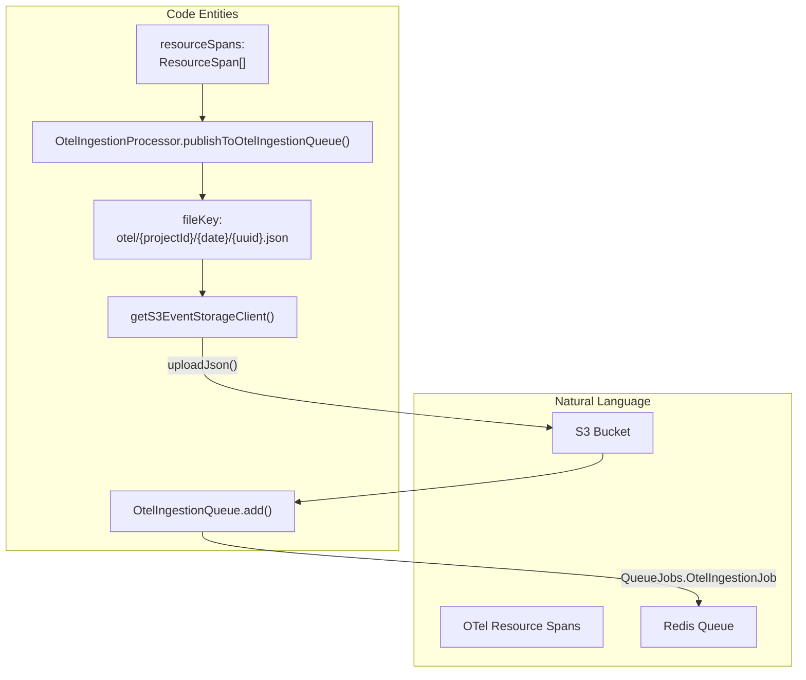

This document describes the OpenTelemetry (OTel) ingestion pipeline in Langfuse, which enables capturing traces and observations from any OpenTelemetry-instrumented application. The OTel ingestion system converts OpenTelemetry spans to Langfuse observations while preserving semantic information and supporting multiple instrumentation libraries.

For information about the general data ingestion pipeline that handles SDK-native events, see [Ingestion Overview](#6.1). For details on the observation type system, see [Traces & Observations](#9.1).

---

## Architecture Overview

The OpenTelemetry ingestion pipeline follows a two-phase architecture: an API endpoint that receives and stores raw OTel data, followed by asynchronous worker processing that transforms spans into Langfuse observations.

### End-to-End Flow

```mermaid
graph TB
    subgraph "Natural Language Space"
    Client["OTel Instrumented App"]
    IngestionAPI["OTel Ingestion Endpoint"]
    Storage["Blob Storage (S3)"]
    WorkerNode["Background Worker"]
    end

    subgraph "Code Entity Space"
    OtelClient["OpenTelemetry Client<br/>(Langfuse SDK, Vercel AI SDK, etc.)"]
    
    APIEndpoint["POST /api/public/otel/v1/traces<br/>(web/src/pages/api/public/otel/v1/traces/index.ts)"]
    AuthCheck["createAuthedProjectAPIRoute()"]
    S3Upload["OtelIngestionProcessor.publishToOtelIngestionQueue()"]
    QueueAdd["OtelIngestionQueue.add()"]
    
    Worker["otelIngestionQueueProcessor<br/>(worker/src/queues/otelIngestionQueue.ts)"]
    Download["getS3EventStorageClient().download()"]
    Processor["OtelIngestionProcessor<br/>(packages/shared/src/server/otel/OtelIngestionProcessor.ts)"]
    ProcessMethod["processToIngestionEvents()"]
    TypeMapper["ObservationTypeMapperRegistry<br/>.mapToObservationType()"]
    
    IngestionService["IngestionService.mergeAndWrite()"]
    EventBatch["processEventBatch()"]
    
    ClickHouse[("ClickHouse<br/>observations, traces")]
    
    OtelClient -->|"POST protobuf/json"| APIEndpoint
    APIEndpoint --> AuthCheck
    AuthCheck --> S3Upload
    S3Upload --> QueueAdd
    
    QueueAdd --> Worker
    Worker --> Download
    Download --> Processor
    Processor --> ProcessMethod
    ProcessMethod --> TypeMapper
    
    ProcessMethod --> IngestionService
    ProcessMethod --> EventBatch
    
    IngestionService --> ClickHouse
    EventBatch --> ClickHouse
    end
```

**Sources**: [web/src/pages/api/public/otel/v1/traces/index.ts:32-174](), [worker/src/queues/otelIngestionQueue.ts:192-230](), [packages/shared/src/server/otel/OtelIngestionProcessor.ts:183-220]()

---

## API Endpoint

The OTel traces endpoint at `/api/public/otel/v1/traces` accepts OpenTelemetry trace data in both Protobuf and JSON formats.

### Request Processing

The endpoint at [web/src/pages/api/public/otel/v1/traces/index.ts:32-174]() processes requests through the following steps:

| Step | Function/Method | Description |
|------|----------------|-------------|
| **Authentication** | `createAuthedProjectAPIRoute` | Validates API key and returns `authCheck` scope [web/src/pages/api/public/otel/v1/traces/index.ts:33-38]() |
| **Ingestion Suspension Check** | Scope validation | Blocks if `authCheck.scope.isIngestionSuspended` is true [web/src/pages/api/public/otel/v1/traces/index.ts:40-44]() |
| **Project Marking** | `markProjectAsOtelUser()` | Records project as OTel user for analytics [web/src/pages/api/public/otel/v1/traces/index.ts:47-47]() |
| **Body Reading** | Raw body promise | Reads raw request body as Buffer [web/src/pages/api/public/otel/v1/traces/index.ts:51-56]() |
| **Decompression** | `gunzip()` | Gunzips body if `content-encoding: gzip` header present [web/src/pages/api/public/otel/v1/traces/index.ts:63-75]() |
| **Format Detection** | Content-type check | Determines protobuf vs JSON from `content-type` header [web/src/pages/api/public/otel/v1/traces/index.ts:78-88]() |
| **Protobuf Parsing** | `$root.opentelemetry.proto.collector.trace.v1.ExportTraceServiceRequest.decode()` | Decodes binary protobuf [web/src/pages/api/public/otel/v1/traces/index.ts:91-98]() |
| **JSON Parsing** | `JSON.parse(body.toString())` | Parses JSON to extract `resourceSpans` [web/src/pages/api/public/otel/v1/traces/index.ts:106-108]() |
| **SDK Header Extraction** | `getLangfuseHeader()` | Extracts `x-langfuse-sdk-name`, `x-langfuse-sdk-version`, `x-langfuse-ingestion-version` [web/src/pages/api/public/otel/v1/traces/index.ts:136-144]() |
| **S3 Upload & Queue** | `processor.publishToOtelIngestionQueue()` | Uploads raw data to S3 and enqueues `OtelIngestionJob` [web/src/pages/api/public/otel/v1/traces/index.ts:187-187]() |

**Sources**: [web/src/pages/api/public/otel/v1/traces/index.ts:32-190]()

### S3 Upload and Queue Job Creation

The API endpoint does not process spans synchronously. Instead, it uploads the raw `resourceSpans` data to S3 and creates a job in `OtelIngestionQueue`:

The SDK headers (`sdkName`, `sdkVersion`, `ingestionVersion`) are included in the job payload so the worker can make write path decisions without re-parsing the spans [packages/shared/src/server/otel/OtelIngestionProcessor.ts:200-217]().

**Sources**: [packages/shared/src/server/otel/OtelIngestionProcessor.ts:183-220](), [web/src/pages/api/public/otel/v1/traces/index.ts:162-187]()

---

## OtelIngestionProcessor

The `OtelIngestionProcessor` class is the core component that converts OpenTelemetry `ResourceSpan` objects into Langfuse `IngestionEventType` objects.

### Class Structure

The `OtelIngestionProcessor` class at [packages/shared/src/server/otel/OtelIngestionProcessor.ts:142-169]() has the following structure:

| Property/Method | Type | Purpose |
|----------------|------|---------|
| `seenTraces` | `Set<string>` | Cache of trace IDs to prevent duplicate trace-create events [packages/shared/src/server/otel/OtelIngestionProcessor.ts:146-146]() |
| `projectId` | `string` | Project ID for the ingestion [packages/shared/src/server/otel/OtelIngestionProcessor.ts:153-153]() |
| `processToEvent()` | `sync` | Main conversion method producing enriched events [packages/shared/src/server/otel/OtelIngestionProcessor.ts:227-227]() |
| `publishToOtelIngestionQueue()` | `async` | Uploads raw resourceSpans to S3 and enqueues job [packages/shared/src/server/otel/OtelIngestionProcessor.ts:183-183]() |

**Sources**: [packages/shared/src/server/otel/OtelIngestionProcessor.ts:142-169]()

---

## Observation Type Mapping

The `ObservationTypeMapperRegistry` determines the Langfuse observation type (`GENERATION`, `SPAN`, `EMBEDDING`, `TOOL`, etc.) from OpenTelemetry span attributes.

### Mapper Registry Architecture

Mappers are evaluated in priority order (lower number = higher priority) at [packages/shared/src/server/otel/ObservationTypeMapper.ts:165-166]().

| Priority | Mapper Name | Key Attribute | Mapping Examples |
|----------|-------------|---------------|------------------|
| 0 | `PythonSDKv330Override` | `langfuse.observation.type: "span"` | Overrides to `GENERATION` if model attributes are present (fixes SDK bug) [packages/shared/src/server/otel/ObservationTypeMapper.ts:171-214]() |
| 1 | `LangfuseObservationTypeDirectMapping` | `langfuse.observation.type` | `"generation"` → `GENERATION`, `"span"` → `SPAN` [packages/shared/src/server/otel/ObservationTypeMapper.ts:217-226]() |
| 2 | `OpenInference` | `openinference.span.kind` | `"LLM"` → `GENERATION`, `"RETRIEVER"` → `RETRIEVER` [packages/shared/src/server/otel/ObservationTypeMapper.ts:229-238]() |
| 3 | `OTel_GenAI_Operation` | `gen_ai.operation.name` | `"chat"` → `GENERATION`, `"embeddings"` → `EMBEDDING` [packages/shared/src/server/otel/ObservationTypeMapper.ts:241-250]() |
| 6 | `GenAI_Tool_Call` | `gen_ai.tool.name` | Any value → `TOOL` [packages/shared/src/server/otel/ObservationTypeMapper.ts:376-382]() |

**Sources**: [packages/shared/src/server/otel/ObservationTypeMapper.ts:165-399]()

---

## Worker Processing

The `otelIngestionQueueProcessor` handles asynchronous processing of OTel data uploaded to S3.

### Direct Write Decision Logic

The worker determines whether to use direct event table writes based on SDK version headers:

| Header | Condition | Result |
|--------|-----------|--------|
| `x-langfuse-ingestion-version` | `>= 4` | Direct write eligible [worker/src/queues/otelIngestionQueue.ts:59-61]() |
| `x-langfuse-sdk-name: "python"` | `>= 4.0.0` | Direct write eligible [worker/src/queues/otelIngestionQueue.ts:74-76]() |
| `x-langfuse-sdk-name: "javascript"` | `>= 5.0.0` | Direct write eligible [worker/src/queues/otelIngestionQueue.ts:78-80]() |

The function `checkHeaderBasedDirectWrite()` at [worker/src/queues/otelIngestionQueue.ts:49-53]() implements this logic, normalizing pre-release versions (e.g., `4.0.0-rc.1`) via `extractBaseSdkVersion()` [worker/src/queues/otelIngestionQueue.ts:90-105]().

### Legacy SDK Fallback

For older SDKs, the worker extracts SDK info from `resourceSpans` via `getSdkInfoFromResourceSpans()` [worker/src/queues/otelIngestionQueue.ts:120-140]() and checks version requirements in `checkSdkVersionRequirements()` [worker/src/queues/otelIngestionQueue.ts:150-154]():
- **Python**: `>= 3.9.0` [worker/src/queues/otelIngestionQueue.ts:167-170]()
- **JS/JavaScript**: `>= 4.4.0` [worker/src/queues/otelIngestionQueue.ts:173-180]()

**Sources**: [worker/src/queues/otelIngestionQueue.ts:49-190](), [worker/src/queues/__tests__/otelDirectEventWrite.test.ts:10-149]()

---

## Trace Deduplication Logic

To prevent duplicate `trace-create` events when multiple spans from the same trace arrive in a batch, the processor uses an internal `seenTraces` Set.

1.  **Initialization**: The processor is initialized with a project ID and optional public key [packages/shared/src/server/otel/OtelIngestionProcessor.ts:161-169]().
2.  **Processing**: As spans are processed, the processor checks if a `trace-create` event has already been generated for that `traceId` [packages/shared/src/server/otel/OtelIngestionProcessor.ts:146-146]().
3.  **Caching**: Once a trace is "seen", subsequent spans in the same processing context will skip creating additional trace events.

**Sources**: [packages/shared/src/server/otel/OtelIngestionProcessor.ts:142-169](), [web/src/__tests__/server/api/otel/otelMapping.servertest.ts:8-24]()