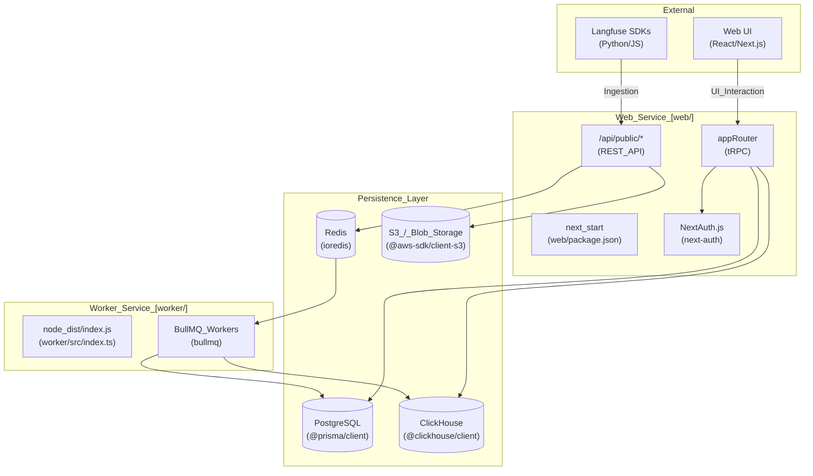
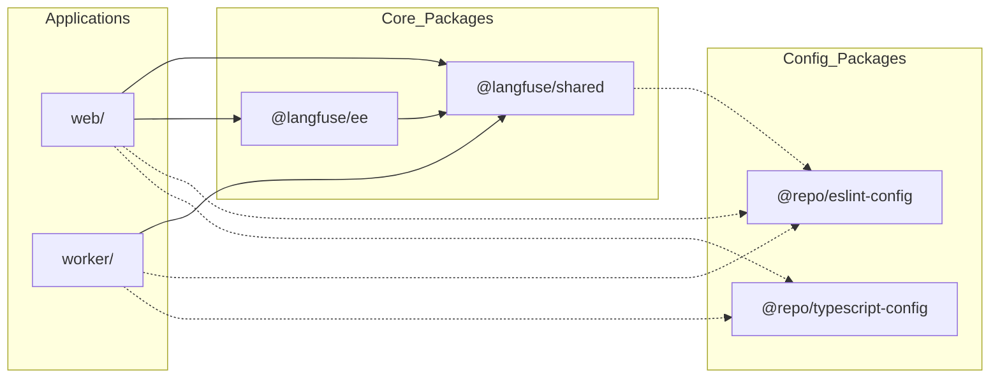

Langfuse is an open-source LLM (Large Language Model) engineering platform designed to help teams collaboratively develop, monitor, evaluate, and debug AI applications. It provides a unified interface for capturing traces of LLM interactions, managing prompts, performing automated evaluations (LLM-as-a-judge), and tracking costs and latency across complex LLM chains. [README.md:80-98]()

This document introduces the system architecture, monorepo organization, and technology stack. For detailed technical deep-dives, see the following child pages:
- [System Architecture](#1.1) — Details on the web/worker dual-service model and data persistence layers.
- [Monorepo Structure](#1.2) — Overview of the `pnpm` workspace and shared internal packages.
- [Technology Stack](#1.3) — Comprehensive list of core frameworks and libraries.

---

## System Architecture

Langfuse follows a distributed architecture centered around two primary services and a specialized data layer designed for both transactional and analytical workloads.

1.  **Web Service** (`web/`): A Next.js application that handles the user interface, internal tRPC APIs, and the public REST API for SDK ingestion. [web/package.json:2-130]()
2.  **Worker Service** (`worker/`): A dedicated Node.js service for background tasks, including ingestion processing, evaluation execution, and data maintenance jobs using BullMQ. [worker/package.json:2-50]()

### High-Level Architecture Diagram

This diagram maps system components to their respective code entities and data stores.

**Sources**: [web/package.json:1-170](), [worker/package.json:1-92](), [packages/shared/package.json:1-122](), [web/Dockerfile:141-171]()

For more details on service interaction and data flow, see [System Architecture](#1.1).

---

## Monorepo Structure

Langfuse is organized as a monorepo using `pnpm` workspaces and `turbo` for build orchestration. This allows for shared logic and type definitions across the web and worker services. [package.json:51-101](), [pnpm-lock.yaml:1-24]()

### Workspace Organization

| Package | Path | Role |
| :--- | :--- | :--- |
| **Web** | `web/` | Next.js frontend and API server. [web/package.json:1-170]() |
| **Worker** | `worker/` | Background task processor using BullMQ. [worker/package.json:1-92]() |
| **Shared** | `packages/shared/` | Core logic, Prisma schemas, and ClickHouse scripts. [packages/shared/package.json:1-143]() |
| **EE** | `ee/` | Enterprise features (e.g., advanced SSO, ingestion masking). [ee/package.json:1-48]() |

### Code Dependency Diagram

This diagram illustrates the internal dependency graph between workspace members.

**Sources**: [package.json:1-51](), [web/package.json:44-45](), [worker/package.json:35](), [packages/shared/package.json:1-3](), [pnpm-lock.yaml:50-135]()

For a detailed breakdown of shared packages and dependency management, see [Monorepo Structure](#1.2).

---

## Technology Stack

Langfuse utilizes a modern TypeScript stack optimized for high-throughput data ingestion and complex analytical queries.

### Core Technologies

*   **Runtime**: Node.js 24 [package.json:8]()
*   **Frontend**: Next.js 16.2.4, React 19.2.4, Tailwind CSS [web/package.json:127-140]()
*   **API**: tRPC (internal), REST (public), Model Context Protocol (MCP) [web/package.json:95-98](), [web/package.json:47]()
*   **Database (Transactional)**: PostgreSQL with Prisma ORM 6.19.3 [packages/shared/package.json:94]()
*   **Database (Analytical)**: ClickHouse for trace and observation storage [packages/shared/package.json:85]()
*   **Queuing**: BullMQ 5.73.5 backed by Redis [packages/shared/package.json:103]()
*   **Observability**: OpenTelemetry, Sentry, and Datadog (optional) [web/package.json:49-62](), [web/package.json:88]()

**Sources**: [web/package.json:28-170](), [worker/package.json:31-69](), [packages/shared/package.json:78-125]()

For the full list of libraries and tools, see [Technology Stack](#1.3).

---

## Version Information

Langfuse maintains synchronized versions across its core services.

*   **Current Version**: `v3.172.0` [web/src/constants/VERSION.ts:1](), [worker/src/constants/VERSION.ts:1]()
*   **Release Tooling**: `release-it` is used to manage versioning and GitHub releases, updating files across `packages/shared`, `web`, and `worker`. [package.json:53-95]()

**Sources**: [package.json:3](), [web/src/constants/VERSION.ts:1](), [worker/src/constants/VERSION.ts:1](), [packages/shared/src/constants/VERSION.ts:1]()