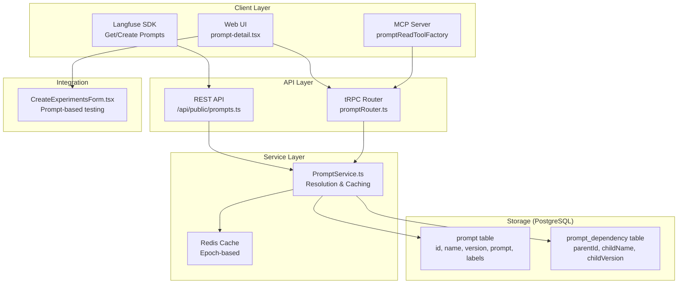
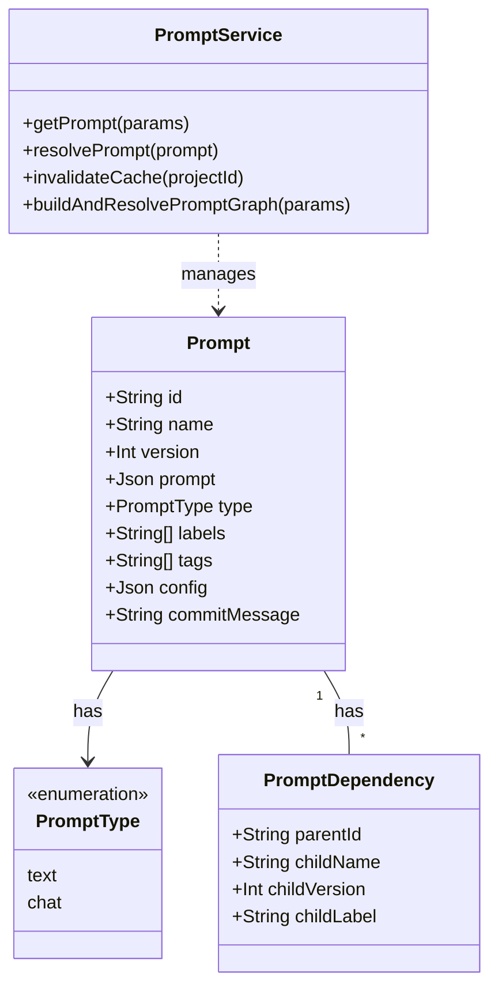
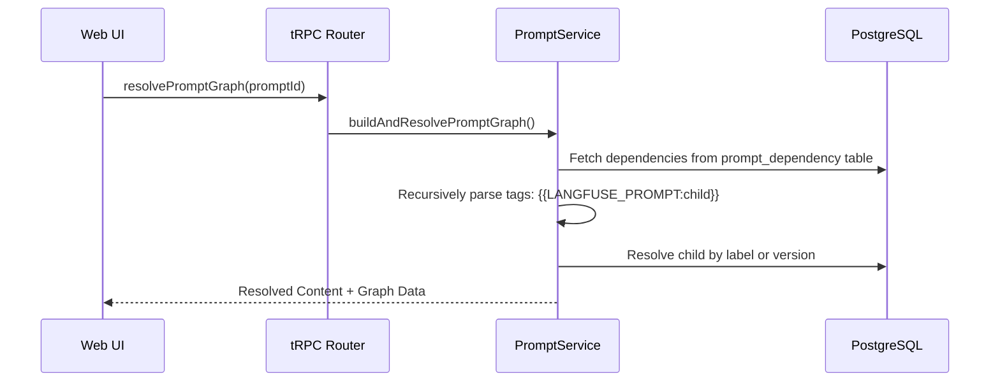
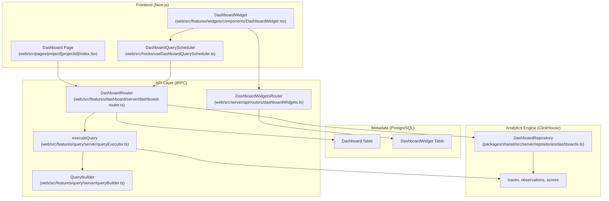
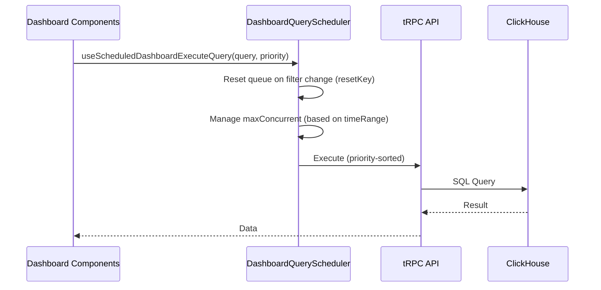
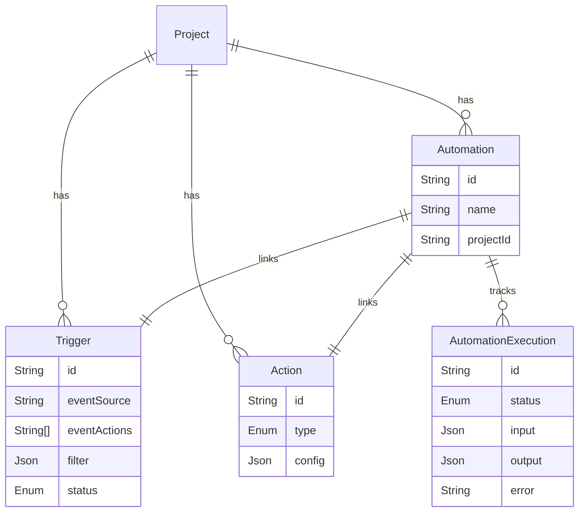
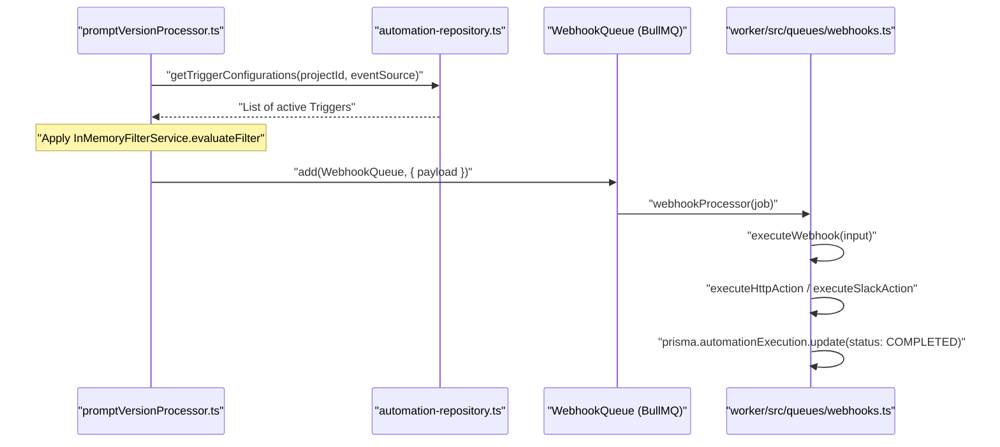

This document describes the prompt management system in Langfuse. Prompts are versioned templates (text or chat format) that can be organized in folders, labeled for deployment, and tracked for usage across observations. The system supports recursive prompt dependencies, protected labels for access control, and an epoch-based Redis caching strategy.

---

## System Architecture

The prompt management system consists of PostgreSQL storage for metadata and versioning, a service layer with Redis caching, dual API surfaces (REST and tRPC), and a folder-based UI.

### High-Level Component Diagram



**Sources:**
- [web/src/features/prompts/server/routers/promptRouter.ts:75-101]()
- [web/src/features/prompts/components/prompt-detail.tsx:109-142]()
- [packages/shared/src/server/services/PromptService/index.ts:30-50]()

---

## Data Model

Prompts are stored in PostgreSQL. Each record represents a specific version of a prompt. The `PromptService` acts as the primary orchestrator for lifecycle events.

### Code Entity Association



**Key Characteristics:**

| Field | Type | Description |
|-------|------|-------------|
| `name` | `string` | Unique identifier within a project. Supports folder paths (e.g., `folder/prompt-name`) [web/src/features/prompts/components/prompt-detail.tsx:116-120](). |
| `version` | `number` | Auto-incrementing integer per prompt name [web/src/features/prompts/components/prompt-detail.tsx:121-124](). |
| `type` | `PromptType` | Either `text` or `chat` [web/src/features/prompts/server/actions/createPrompt.ts:78-78](). |
| `labels` | `string[]` | Deployment targets (e.g., `production`). Managed via `SetPromptVersionLabels` [web/src/features/prompts/components/SetPromptVersionLabels/index.tsx:30-46](). |
| `tags` | `string[]` | Organizational tags consistent across all versions of a prompt [web/src/features/prompts/server/actions/createPrompt.ts:186-200](). |
| `config` | `json` | Model parameters (temperature, max_tokens) and metadata [web/src/features/prompts/server/actions/createPrompt.ts:153-153](). |
| `commitMessage` | `string` | Optional description of changes for a specific version [web/src/features/prompts/server/actions/createPrompt.ts:154-154](). |

**Sources:**
- [web/src/features/prompts/components/prompt-detail.tsx:155-163]()
- [web/src/features/prompts/server/actions/createPrompt.ts:74-115]()
- [web/src/features/prompts/components/SetPromptVersionLabels/index.tsx:84-96]()

---

## Prompt Resolution & Caching

The `PromptService` handles the logic of finding the correct prompt version and resolving its dependencies.

### Resolution Logic
1. **By Version**: Fetches a specific integer version [web/src/features/prompts/components/prompt-detail.tsx:155-158]().
2. **By Label**: Fetches the version tagged with a specific label (e.g., `production`). Newly created prompts are automatically labeled as `latest` [web/src/features/prompts/server/actions/createPrompt.ts:110-110]().
3. **Unresolved vs Resolved**: The UI allows toggling between `tagged` (raw template) and `resolved` (nested dependencies replaced) modes [web/src/features/prompts/components/prompt-detail.tsx:136-138]().

### Epoch-based Caching
To ensure consistency across distributed nodes, Langfuse uses an "Epoch" strategy in Redis:
- **Invalidation**: Rotating the cache epoch in Redis namespaces all subsequent lookups, effectively invalidating old entries after a successful database commit [web/src/features/prompts/server/actions/createPrompt.ts:208-209]().
- **Implementation**: The `PromptService` checks for a `prompt_cache_epoch:[projectId]` key. If missing, it generates a new 48-bit entropy token [packages/shared/src/server/services/PromptService/index.ts:208-231]().

**Sources:**
- [web/src/features/prompts/server/actions/createPrompt.ts:116-139]()
- [web/src/features/prompts/components/prompt-detail.tsx:165-173]()
- [packages/shared/src/server/services/PromptService/index.ts:177-190]()

---

## Prompt Dependencies

Langfuse supports recursive prompt templates. A prompt can include another prompt using the `{{LANGFUSE_PROMPT:name}}` syntax.

### Dependency Graph Resolution
The system performs a recursive search to construct a `ResolvedPromptGraph`. Dependencies are stored in the `PromptDependency` table, linking a parent version to a child by name and either a specific version or a label [web/src/features/prompts/server/actions/createPrompt.ts:157-168]().



**Sources:**
- [web/src/features/prompts/server/actions/createPrompt.ts:117-139]()
- [web/src/features/prompts/components/prompt-detail.tsx:165-173]()
- [packages/shared/src/server/services/PromptService/index.ts:234-255]()

---

## ChatPrompt vs TextPrompt

The system handles two primary prompt formats. `ChatPrompt` is specifically designed for chat completion models.

| Feature | `TextPrompt` | `ChatPrompt` |
|---------|--------------|--------------|
| **Data Type** | `string` | `Array<ChatMessage>` |
| **Structure** | Single template string | List of messages (System, User, Assistant, Tool) |
| **Validation** | String validation | `ChatMlArraySchema` [web/src/features/prompts/components/prompt-detail.tsx:35-35]() |
| **UI Editor** | `CodeMirrorEditor` | `PromptChatMessages` component [web/src/features/prompts/components/NewPromptForm/index.tsx:34-34]() |

**Variable Extraction:**
For `ChatPrompt`, variables and placeholders are extracted from all message contents. The system prevents naming collisions between variables (e.g., `{{name}}`) and placeholders (e.g., `{{chat_history}}`) [web/src/features/prompts/server/actions/createPrompt.ts:98-108]().

**Chat Message Roles:**
Supported roles include `User`, `System`, `Developer`, `Assistant`, and `Tool` [web/src/components/ChatMessages/ChatMessageComponent.tsx:50-56]().

**Sources:**
- [web/src/features/prompts/components/prompt-detail.tsx:175-189]()
- [web/src/features/prompts/server/actions/createPrompt.ts:52-72]()
- [web/src/components/ChatMessages/ChatMessageComponent.tsx:50-56]()

---

## Folder Organization & UI

### Folders
Prompts can be organized using a path-based naming convention (e.g., `marketing/emails/welcome`). The `PromptTable` uses `row_type: "folder"` metadata to render directory structures and `currentFolderPath` for navigation [web/src/features/prompts/components/prompts-table.tsx:160-176]().

### Metrics & Monitoring
Prompt usage is tracked via ClickHouse. The `PromptVersionTable` displays:
- **Median Latency** [web/src/pages/project/[projectId]/prompts/metrics.tsx:206-212]()
- **Token Usage** (Input/Output) [web/src/pages/project/[projectId]/prompts/metrics.tsx:38-39]()
- **Generation Count** [web/src/pages/project/[projectId]/prompts/metrics.tsx:41-41]()
- **Aggregated Scores** (Trace and Generation level) [web/src/pages/project/[projectId]/prompts/metrics.tsx:42-43]()

### Comparison & History
The `PromptHistoryNode` renders a timeline of all prompt versions, allowing users to view commit messages, creators, and timestamps [web/src/features/prompts/components/prompt-history.tsx:173-185](). Users can compare two versions using the `PromptVersionDiffDialog`, which highlights changes in both the template content and the JSON configuration [web/src/features/prompts/components/prompt-history.tsx:156-164]().

**Sources:**
- [web/src/features/prompts/components/prompts-table.tsx:104-123]()
- [web/src/pages/project/[projectId]/prompts/metrics.tsx:167-204]()
- [web/src/features/prompts/components/prompt-history.tsx:135-150]()

# Models & Pricing


This page documents the model definition and pricing system: how Langfuse stores model configurations, matches observation `model` fields to those configurations, applies pricing tiers to compute costs, and exposes management through the UI and API.

For how token counts are computed during ingestion, see [Data Ingestion Pipeline (6)](). For the PostgreSQL schema of the `Model`, `PricingTier`, and `Price` tables, see [Data Architecture (3)]().

---

## Overview

Langfuse maintains a library of model definitions. Each definition contains:
- A **regex match pattern** used to associate incoming observations with the model.
- A **tokenizer configuration** used for server-side token counting when counts are not provided.
- One or more **pricing tiers** that determine per-token cost for different usage types and usage conditions.

There are two categories of model definitions:

| Category | `projectId` in DB | Maintainer | Editable |
|---|---|---|---|
| Langfuse-managed (built-in) | `NULL` | Langfuse | Clone only |
| User-managed (custom) | Project UUID | User | Edit / Delete |

Sources: [web/src/components/table/use-cases/models.tsx:59-60](), [web/src/server/api/routers/models.ts:91-92]()

---

## Data Architecture & Code Entities

The model matching and pricing logic bridges the gap between raw ingestion strings and database entities.

**Model Entity Mapping:**

```mermaid
classDiagram
    class "IngestionEventType" {
        +string model
        +UsageDetails usage
    }
    class "findModel()" {
        <<Function>>
        +ModelMatchProps p
        +findModelInPostgres()
    }
    class "Model" {
        <<Prisma Entity>>
        +string modelName
        +string matchPattern
        +string tokenizerId
        +Json tokenizerConfig
    }
    class "PricingTier" {
        <<Prisma Entity>>
        +string name
        +boolean isDefault
        +PricingTierCondition[] conditions
        +int priority
    }
    class "Price" {
        <<Prisma Entity>>
        +string usageType
        +Decimal price
    }

    "IngestionEventType" ..> "findModel()" : "provides model string"
    "findModel()" --> "Model" : "matches via Regex"
    "Model" *-- "PricingTier" : "has many"
    "PricingTier" *-- "Price" : "has many"
```

Sources: [web/src/features/models/validation.ts:48-59](), [worker/src/constants/default-model-prices.json:1-28](), [worker/src/scripts/upsertDefaultModelPrices.ts:10-31]()

---

## Default Model Prices

Built-in model definitions are defined in a JSON file and seeded into the database. 

**Source of truth**: `worker/src/constants/default-model-prices.json` [worker/src/constants/default-model-prices.json:1]()

Each entry in the file includes `tokenizerConfig`, `matchPattern`, and `pricingTiers`. The script `upsertDefaultModelPrices.ts` is responsible for synchronizing this JSON with the PostgreSQL database, performing batched transactions to update outdated models [worker/src/scripts/upsertDefaultModelPrices.ts:81-140]().

### Pricing Tiers & Usage Types
Prices are expressed as cost-per-token in USD. A single model can have multiple `pricingTiers` [worker/src/constants/default-model-prices.json:14]().

| Provider | Common Usage Types |
|---|---|
| OpenAI | `input`, `output`, `input_cached_tokens`, `input_cache_read` |
| Anthropic | `input`, `output`, `input_cache_read`, `input_cache_creation` |
| Legacy | `total` |

Example tier for `gpt-4o`:
```json
{
  "name": "Standard",
  "isDefault": true,
  "prices": {
    "input": 0.0000025,
    "input_cached_tokens": 0.00000125,
    "output": 0.00001
  }
}
```
Sources: [worker/src/constants/default-model-prices.json:14-28](), [worker/src/scripts/upsertDefaultModelPrices.ts:10-17]()

---

## Model Matching Algorithm

When an observation is ingested (via REST or OTel), the pipeline resolves pricing by matching the `model` string against stored patterns.

### OTel Model Extraction
For OpenTelemetry ingestion, the `OtelIngestionProcessor` extracts model information from span attributes, specifically looking for the `langfuse.observation.model.name` attribute [web/src/__tests__/server/api/otel/otelMapping.servertest.ts:126-128](). The `ObservationTypeMapperRegistry` also handles legacy overrides, such as converting older Python SDK spans to `GENERATION` types if model parameters are present [packages/shared/src/server/otel/ObservationTypeMapper.ts:171-210]().

### Direct Write Logic
Modern SDKs (Python >= 4.0.0, JS >= 5.0.0) support a "direct write" path that bypasses some legacy transformation steps. The system checks headers like `x-langfuse-sdk-name` and `x-langfuse-ingestion-version` to determine eligibility [worker/src/queues/otelIngestionQueue.ts:49-61]().

### Backend Resolution
The `modelRouter` provides the `getById` and `getAll` procedures to fetch model data. Matching is performed using regex patterns. The `getAll` procedure uses a `DISTINCT ON (project_id, model_name)` query to ensure that project-specific models override global Langfuse models when they share the same name [web/src/server/api/routers/models.ts:121-168]().

### Cache Invalidation
- **Manual Clearing**: `clearModelCacheForProject` is called when models are updated via the UI or API to ensure the ingestion pipeline picks up changes immediately [web/src/server/api/routers/models.ts:18]().
- **Full Sync**: `clearFullModelCache` is triggered after the `upsertDefaultModelPrices` script finishes updating the global model list [worker/src/scripts/upsertDefaultModelPrices.ts:200]().

Sources: [web/src/server/api/routers/models.ts:44-106](), [web/src/server/api/routers/models.ts:108-192](), [worker/src/queues/otelIngestionQueue.ts:49-88]()

---

## UI Components & Management

Models are managed in the Langfuse Settings UI. The `ModelTable` component provides a searchable interface for both built-in and custom models [web/src/components/table/use-cases/models.tsx:64-88]().

### Table Columns
The model table displays key configuration attributes:
- **Maintainer**: Distinguishes between "Langfuse" (built-in) and "User" (custom) models using icons [web/src/components/table/use-cases/models.tsx:135-151]().
- **Match Pattern**: The regex used for ingestion matching [web/src/components/table/use-cases/models.tsx:156-170]().
- **Prices**: A breakdown of costs per usage type (e.g., input, output) [web/src/components/table/use-cases/models.tsx:172-192]().
- **Last Used**: The start time of the latest generation using that model, queried from ClickHouse [web/src/components/table/use-cases/models.tsx:92-101]().

### Actions
- **Clone**: Users can clone Langfuse-managed models to create custom versions [web/src/components/table/use-cases/models.tsx:16]().
- **Test Match**: A specialized button `TestModelMatchButton` to verify if a specific string will match a model's pattern [web/src/components/table/use-cases/models.tsx:30]().
- **Upsert**: `UpsertModelFormDialog` for creating or editing models, validated against the `UpsertModelSchema` [web/src/components/table/use-cases/models.tsx:29](), [web/src/features/models/validation.ts:63-90]().

Sources: [web/src/components/table/use-cases/models.tsx:110-212](), [web/src/server/api/routers/models.ts:194-222](), [web/src/features/models/validation.ts:93-115]()

# Dashboard & Analytics


## Purpose and Scope

The Dashboard & Analytics system in Langfuse provides a flexible infrastructure for visualizing and analyzing LLM observability data. It enables users to create custom dashboards composed of widgets that execute complex aggregations over traces, observations, and scores. The system is built on a dual-database architecture: PostgreSQL stores configuration (dashboards, widget definitions, and layouts), while ClickHouse serves as the high-performance engine for time-series and multi-dimensional analytics.

---

## System Architecture & Data Flow

The analytics engine bridges the gap between structured configuration in PostgreSQL and high-cardinality event data in ClickHouse. The system supports both a "Home" dashboard with fixed cards and custom user-defined dashboards.

### Dashboard Data Flow

Title: Dashboard Data Request Flow

**Sources:** [web/src/features/dashboard/server/dashboard-router.ts:1-41](), [web/src/pages/project/[projectId]/index.tsx:192-199](), [web/src/features/widgets/components/DashboardWidget.tsx:180-204](), [packages/shared/src/server/repositories/dashboards.ts:37-102](), [web/src/features/query/server/queryExecutor.ts:28-84]()

---

## Data Modeling & View Declarations

Langfuse uses "View Declarations" to abstract ClickHouse table complexities. A view defines available `dimensions` (grouping fields), `measures` (aggregatable metrics), and `tableRelations` [web/src/features/query/types.ts:9-81]().

### View Versioning (V1 vs V2)
The system supports two versions of the analytics engine. Components determine the `ViewVersion` ("v1" or "v2") based on feature flags or widget requirements [web/src/features/widgets/components/DashboardWidget.tsx:85-86]().
- **v1**: Standard views mapping to `traces`, `observations`, and `scores` tables.
- **v2**: Modern views often utilizing the `events` table aggregation for 100% API compatibility [web/src/features/query/dataModel.ts:157-160](). Widgets requiring `minVersion >= 2` automatically force the v2 engine [web/src/features/widgets/components/DashboardWidget.tsx:94-97]().

### Key Views
| View Name | Source Table / CTE | Primary Use Case |
| :--- | :--- | :--- |
| `traces` | `traces FINAL` | High-level request analytics, user/session tracking [web/src/features/query/dataModel.ts:13-155](). |
| `observations` | `observations FINAL` | Model usage, token costs, and latency per span [web/src/features/query/dataModel.ts:223-230](). |
| `scores-numeric` | `scores FINAL` | Evaluation trends and numeric feedback analysis [web/src/features/dashboard/server/dashboard-router.ts:193-201](). |
| `events_traces` | `events` (agg) | V2 implementation of traces view [web/src/features/query/dataModel.ts:157-160](). |

**Sources:** [web/src/features/query/dataModel.ts:13-155](), [web/src/features/query/dataModel.ts:223-230](), [web/src/features/query/types.ts:101-102](), [web/src/features/dashboard/server/dashboard-router.ts:193-201]()

---

## Custom Dashboard & Widget Model

Custom dashboards are defined by a `definition` JSON containing `WidgetPlacement` objects [web/src/pages/project/[projectId]/dashboards/[dashboardId]/index.tsx:37-45]().

### Widget Placement and Grid
Dashboards use a 12-column grid system. A `WidgetPlacement` defines:
- `x`, `y`: Position in the grid [web/src/pages/project/[projectId]/dashboards/[dashboardId]/index.tsx:40-41]().
- `x_size`, `y_size`: Dimensions of the widget [web/src/pages/project/[projectId]/dashboards/[dashboardId]/index.tsx:42-43]().
- `widgetId`: Foreign key to the `DashboardWidget` configuration [web/src/pages/project/[projectId]/dashboards/[dashboardId]/index.tsx:39]().

### Widget Types
The `WidgetForm` allows users to configure metrics and chart types:
- **Time-Series**: `LINE_TIME_SERIES`, `BAR_TIME_SERIES` [web/src/features/widgets/components/WidgetForm.tsx:111-123]().
- **Total Value**: `NUMBER` (Big Number), `HORIZONTAL_BAR`, `PIE`, `PIVOT_TABLE` [web/src/features/widgets/components/WidgetForm.tsx:102-110, 125-158]().
- **Statistical**: `HISTOGRAM` [web/src/features/widgets/components/WidgetForm.tsx:139-144]().

The `resolveAggregationAndChartType` function ensures consistency between selected measures and chart types (e.g., forcing `histogram` aggregation for HISTOGRAM charts) [web/src/features/widgets/components/WidgetForm.tsx:171-227]().

**Sources:** [web/src/pages/project/[projectId]/dashboards/[dashboardId]/index.tsx:37-45](), [web/src/features/widgets/components/WidgetForm.tsx:102-158, 171-227]()

---

## Filter Integration

Analytics queries integrate filters from multiple sources to provide scoped views.

### Filter Mapping
UI filters (e.g., "Trace Name") must be mapped to the correct database columns depending on the view being queried. This is handled by `mapLegacyUiTableFilterToView` using `viewFilterDefinitions` [web/src/features/query/dashboardUiTableToViewMapping.ts:61-206]().

### Common Filters
- **Time Range**: Applied to `startTime` or `timestamp` across all widgets [web/src/pages/project/[projectId]/index.tsx:147-160]().
- **Environment**: Handled specifically via `extractEnvironmentFilterFromFilters` to ensure ClickHouse consistency across joined `traces` and `observations` [packages/shared/src/server/repositories/dashboards.ts:17-35]().
- **Global Dashboard Filters**: Users can save persistent filters to a specific dashboard [web/src/pages/project/[projectId]/dashboards/[dashboardId]/index.tsx:122-136]().

**Sources:** [web/src/features/query/dashboardUiTableToViewMapping.ts:61-206](), [packages/shared/src/server/repositories/dashboards.ts:17-35](), [web/src/pages/project/[projectId]/index.tsx:147-160]()

---

## Query Scheduling & Performance

To prevent UI lag and database exhaustion during heavy dashboard loads, Langfuse implements a `DashboardQueryScheduler`.

Title: Dashboard Query Scheduling Logic


- **Concurrency Control**: `getDashboardQuerySchedulerMaxConcurrent` adjusts the limit based on the complexity/range of the dashboard [web/src/pages/project/[projectId]/index.tsx:192-195]().
- **Priority**: Critical metrics like "Model Usage" can be assigned specific priorities (e.g., 1001) to load before secondary charts [web/src/features/dashboard/components/ModelUsageChart.tsx:121]().
- **SSE Support**: For long-running queries, the system supports Server-Sent Events (SSE) via `shouldUseWidgetSSE` to provide progress updates [web/src/features/widgets/components/DashboardWidget.tsx:214-217]().

**Sources:** [web/src/pages/project/[projectId]/index.tsx:192-195](), [web/src/features/dashboard/components/ModelUsageChart.tsx:107-123](), [web/src/features/widgets/components/DashboardWidget.tsx:214-217]()

---

## Query Construction (QueryBuilder)

The `QueryBuilder` class is responsible for converting a `QueryType` object into valid ClickHouse SQL [web/src/features/query/server/queryBuilder.ts:55-65]().

### Aggregation Translation
The builder maps internal aggregation names (e.g., `p90`, `sum`, `histogram`) to ClickHouse functions [web/src/features/query/server/queryBuilder.ts:67-102]().
- **Quantiles**: `p90` maps to `quantile(0.9)(...)` [web/src/features/query/server/queryBuilder.ts:83-84]().
- **Histograms**: Uses `histogram(bins)(toFloat64(...))` [web/src/features/query/server/queryBuilder.ts:89-92]().

### Dimension and Metric Mapping
Dimensions and metrics are validated against the `ViewDeclarationType` before SQL generation [web/src/features/query/server/queryBuilder.ts:110-157](). If a measure requires a specific dimension (e.g., for `ARRAY JOIN` logic), it is automatically included [web/src/features/query/types.ts:53-56]().

**Sources:** [web/src/features/query/server/queryBuilder.ts:67-157](), [web/src/features/query/types.ts:53-56]()

---

## Specialized Analytics Views

### Scores & Evaluations
Scores are aggregated via `getScoreAggregate` [packages/shared/src/server/repositories/dashboards.ts:37-102](). The system handles both Numeric (histograms, averages) and Categorical scores [web/src/features/dashboard/server/dashboard-router.ts:165-212]().
- **Numeric Histograms**: `prepareScoresNumericV2Params` extracts time boundaries and maps legacy columns before executing the query [web/src/features/dashboard/server/dashboard-router.ts:104-128](). `clickhouseHistogramToChartData` converts the ClickHouse tuple array into chart-ready bins [web/src/features/dashboard/server/dashboard-router.ts:139-163]().

### Latency and Costs
- **Latency and Usage**: The `getObservationCostByTypeByTime` function performs complex `ARRAY JOIN` operations on `cost_details` to provide per-model or per-type cost breakdowns over time [packages/shared/src/server/repositories/dashboards.ts:104-200]().
- **Model Usage**: Aggregates `totalCost` and `totalTokens` grouped by `providedModelName` [web/src/features/dashboard/components/ModelUsageChart.tsx:76-105]().

**Sources:** [web/src/features/dashboard/server/dashboard-router.ts:104-212](), [web/src/features/dashboard/components/ModelUsageChart.tsx:76-105](), [packages/shared/src/server/repositories/dashboards.ts:37-200]()

# Automation System


This page documents the automation system, which enables event-driven actions triggered by changes to prompts and other domain entities. The system consists of triggers (event matchers with filters), actions (webhooks, Slack notifications, GitHub dispatches), and automations (trigger-action pairs). Executions are tracked for monitoring and debugging.

---

## Overview

The **automation system** implements an event-driven architecture where domain events (e.g., prompt updates) are matched against configured triggers, and when matched, execute associated actions. The system supports three action types: webhooks (HTTP POST to external URLs), Slack messages (channel notifications), and GitHub workflow dispatches.

**Key Components:**

- **Trigger**: Defines when an automation should fire (event source + event actions + optional filters). [packages/shared/prisma/schema.prisma:1476-1498]()
- **Action**: Defines what should happen (webhook, Slack, GitHub dispatch with configuration). [packages/shared/prisma/schema.prisma:1454-1474]()
- **Automation**: Links a trigger to an action with a user-friendly name. [packages/shared/prisma/schema.prisma:1500-1515]()
- **AutomationExecution**: Tracks individual execution instances with status, input/output, and errors. [packages/shared/prisma/schema.prisma:1531-1560]()

**Execution Flow:**

1. Domain event occurs (e.g., a new prompt version is created). [worker/src/features/entityChange/promptVersionProcessor.ts:27-29]()
2. System queries for active triggers matching the event source and status via `getTriggerConfigurations`. [worker/src/features/entityChange/promptVersionProcessor.ts:39-43]()
3. For each matching trigger, applies `InMemoryFilterService.evaluateFilter` conditions to the event payload. [worker/src/features/entityChange/promptVersionProcessor.ts:90-94]()
4. If filter matches, the system enqueues a job to the `WebhookQueue`. [worker/src/features/entityChange/promptVersionProcessor.ts:218-219]()
5. `webhookProcessor` in the worker service processes the action. [worker/src/queues/webhooks.ts:38-47]()
6. Execution status updated in the `AutomationExecution` table to `COMPLETED` or `ERROR`. [worker/src/queues/webhooks.ts:211-223]()

Sources: [worker/src/features/entityChange/promptVersionProcessor.ts:27-219](), [worker/src/queues/webhooks.ts:38-223](), [packages/shared/prisma/schema.prisma:1454-1560]()

---

## Data Model

The automation system stores configurations and execution history in PostgreSQL.

### Core Entities

**Diagram: Automation Entity Relationship**


Sources: [packages/shared/prisma/schema.prisma:1454-1560](), [packages/shared/src/domain/automations.ts:24-29]()

### Action Configuration

The `Action.config` field stores type-specific parameters. For security, sensitive fields like `secretKey` or `githubToken` are stored encrypted in the database. [packages/shared/src/domain/automations.ts:51-125]()

| ActionType | Key Config Fields | Code Entity |
|---|---|---|
| `WEBHOOK` | `url`, `apiVersion`, `secretKey`, `requestHeaders` | `WebhookActionConfigSchema` |
| `SLACK` | `channelId`, `channelName`, `messageTemplate` | `SlackActionConfigSchema` |
| `GITHUB_DISPATCH` | `url`, `eventType`, `githubToken` | `GitHubDispatchActionConfigSchema` |

Sources: [packages/shared/src/domain/automations.ts:51-125]()

---

## Execution Logic

Automations are executed asynchronously via the `webhookProcessor`. [worker/src/queues/webhooks.ts:38-47]()

### Webhook Execution
Webhooks use `fetchWithSecureRedirects` to ensure requests do not hit internal metadata services or unauthorized IPs. [worker/src/queues/webhooks.ts:152-165]()
- **Signatures**: Requests include an `x-langfuse-signature` header generated using the `secretKey`. [worker/src/queues/webhooks.ts:314-318]()
- **Payload**: Follows the `PromptWebhookOutboundSchema`. [packages/shared/src/domain/webhooks.ts:18-42]()
- **Headers**: Custom headers can be configured and marked as `secret` (encrypted at rest). [packages/shared/src/domain/automations.ts:46-50](), [web/src/features/automations/server/webhookHelpers.ts:165-166]()

### Slack Execution
Slack actions use the `SlackService` to send messages. [worker/src/queues/webhooks.ts:354-368]()
- **Templates**: Messages are built using `SlackMessageBuilder`, which supports Block Kit formatting for events like `prompt-version`. [worker/src/features/slack/slackMessageBuilder.ts:17-159]()
- **Security**: Special characters are escaped using `escapeSlackMrkdwn` to prevent injection (e.g., `<!channel>`). [worker/src/features/slack/slackMessageBuilder.ts:7-12]()
- **Integration Mapping**: Installations are stored in the `SlackIntegration` table, mapping a `projectId` to a Slack `teamId`. [packages/shared/src/server/services/SlackService.ts:143-158]()

### GitHub Dispatch Execution
Triggers a `repository_dispatch` event on a GitHub repository. [worker/src/queues/webhooks.ts:373-395]()
- **Auth**: Uses the encrypted `githubToken` provided in the action config. [worker/src/queues/webhooks.ts:379-381]()
- **Payload**: Sends the prompt details within the `client_payload` formatted according to `GitHubDispatchWebhookOutboundSchema`. [packages/shared/src/domain/webhooks.ts:46-49]()

### Execution Tracking & Auto-Disabling
Individual runs are tracked in the `AutomationExecution` table. [packages/shared/prisma/schema.prisma:1531-1560]()
The system tracks consecutive failures via `getConsecutiveAutomationFailures` to potentially disable unreliable automations. [packages/shared/src/server/repositories/automation-repository.ts:241-272]()

Sources: [worker/src/queues/webhooks.ts:38-395](), [worker/src/features/slack/slackMessageBuilder.ts:17-159](), [packages/shared/src/domain/webhooks.ts:18-49](), [packages/shared/src/server/services/SlackService.ts:143-158]()

---

## Trigger Matching

Triggers are matched against domain events using the `getTriggerConfigurations` repository function. [packages/shared/src/server/repositories/automation-repository.ts:105-135]()

**Diagram: Event to Execution Flow**


Sources: [worker/src/features/entityChange/promptVersionProcessor.ts:38-42](), [packages/shared/src/server/repositories/automation-repository.ts:105-135](), [worker/src/queues/webhooks.ts:38-102](), [worker/src/queues/webhooks.ts:211-223]()

---

## UI Components

The automation management interface is located in `web/src/features/automations`.

- **AutomationsPage**: Main container managing list/create/edit views and URL state via `useQueryParams`. [web/src/features/automations/components/automations.tsx:32-38]()
- **AutomationSidebar**: Displays the list of configured automations with their current status and event source. [web/src/features/automations/components/AutomationSidebar.tsx:57-116]()
- **AutomationForm**: Unified form for creating and updating triggers and actions. It uses `ActionHandlerRegistry` to handle type-specific logic. [web/src/features/automations/components/automationForm.tsx:109-115](), [web/src/features/automations/components/automationForm.tsx:173-174]()
- **WebhookActionForm**: Specialized form for webhook configuration, including header management and secret toggles. [web/src/features/automations/components/actions/WebhookActionForm.tsx:81-86]()
- **WebhookSecretRender**: Handles the one-time display of generated webhook secrets. [web/src/features/automations/components/WebhookSecretRender.tsx:1-5]()

**Diagram: Frontend Component Architecture**

```mermaid
graph TD
    "AutomationsPage" --> "AutomationSidebar"
    "AutomationsPage" --> "AutomationDetails"
    "AutomationsPage" --> "AutomationForm"
    "AutomationForm" --> "InlineFilterBuilder"
    "AutomationForm" --> "WebhookActionForm"
    "AutomationForm" --> "ActionHandlerRegistry"
    "WebhookActionForm" --> "WebhookSecretRender"
```
Sources: [web/src/features/automations/components/automations.tsx](), [web/src/features/automations/components/automationForm.tsx](), [web/src/features/automations/components/actions/WebhookActionForm.tsx]()

---

## Security

- **Encryption**: Sensitive credentials (secrets, tokens, `secretKey`) are encrypted before storage using `encrypt()` and decrypted only at execution time in the worker. [packages/shared/src/server/repositories/automation-repository.ts:47-60](), [web/src/features/automations/server/webhookHelpers.ts:165-166]()
- **URL Validation**: Webhook URLs are validated against SSRF and restricted IP ranges using `validateWebhookURL`. [packages/shared/src/server/webhooks/validation.ts:53-113]()
    - **DNS Resolution**: Resolves all A and AAAA records via `resolveHost`. [packages/shared/src/server/webhooks/validation.ts:7-29]()
    - **IP Blocking**: Checks IPs against `BLOCKED_CIDRS` (private, loopback, multicast, etc.) using `isIPBlocked`. [packages/shared/src/server/webhooks/ipBlocking.ts:4-86]()
    - **Hostname Blocking**: Blocks local variations (localhost, internal, docker internal) and cloud metadata endpoints. [packages/shared/src/server/webhooks/ipBlocking.ts:105-140]()
- **RBAC**: Access to view or modify automations is restricted by scopes `automations:read` and `automations:CUD`. [web/src/features/automations/server/router.ts:57-61](), [web/src/features/automations/server/router.ts:81-85]()
- **Audit Logs**: Changes to automation configurations, such as regenerating webhook secrets, are logged. [web/src/features/automations/server/router.ts:110-121]()

Sources: [packages/shared/src/server/repositories/automation-repository.ts](), [worker/src/queues/webhooks.ts](), [web/src/features/automations/server/router.ts](), [packages/shared/src/server/webhooks/validation.ts:53-113](), [packages/shared/src/server/webhooks/ipBlocking.ts:4-140]()