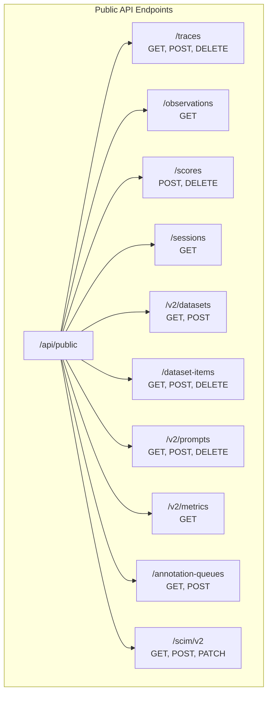
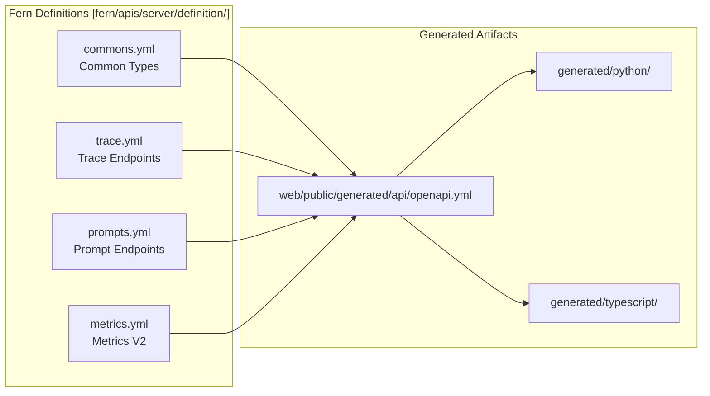
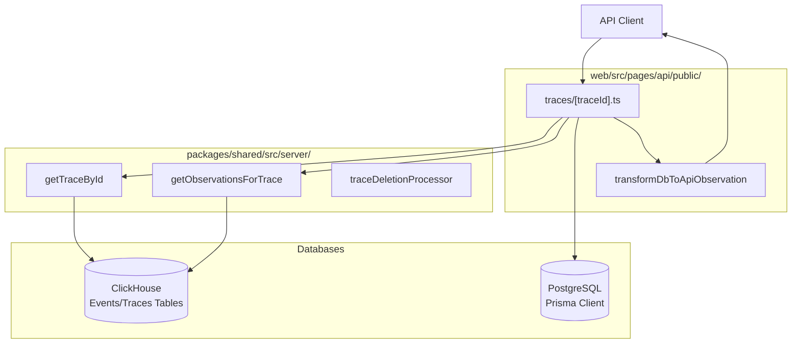
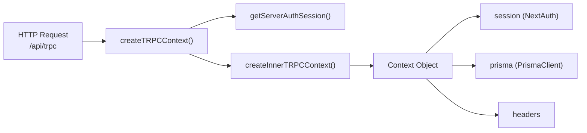
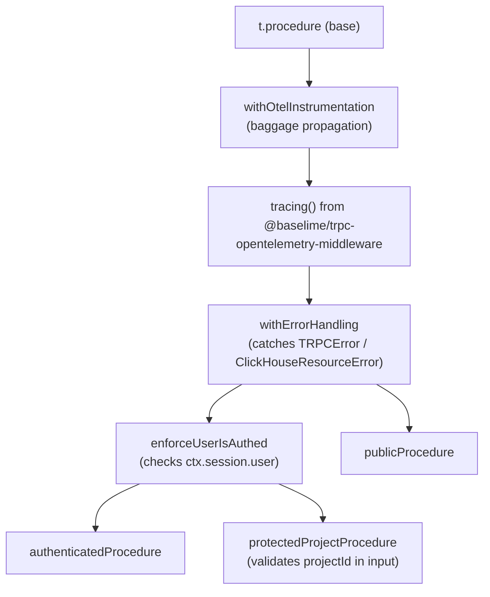
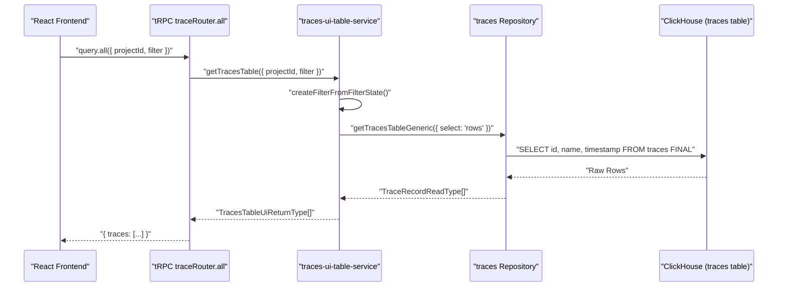

## Purpose and Scope

The Public REST API provides programmatic access to Langfuse functionality for external integrations, SDKs, and automation tools. This document covers the structure, authentication, and resource types exposed by the API at `/api/public/*` endpoints. It details the OpenAPI specification, data flow from request to storage, and the implementation of CRUD operations for core entities.

For internal web application APIs, see [tRPC Internal API](#5.2). For data ingestion specifically, see [Data Ingestion Pipeline](#6). For authentication mechanisms, see [Authentication & Authorization](#4).

---

## API Overview

### Base Path and Versioning

The Public REST API is served under the `/api/public` base path with selective versioning for breaking changes.

| Base Path | Description | Example |
|-----------|-------------|---------|
| `/api/public` | Main API endpoints (v1 implicit) | `/api/public/traces` |
| `/api/public/v2` | Version 2 endpoints with improvements | `/api/public/v2/prompts` |
| `/api/public/otel` | OpenTelemetry ingestion | `/api/public/otel/v1/traces` |

**Sources:** [web/public/generated/api/openapi.yml:23-25](), [fern/apis/server/definition/prompts.yml:8-8]()

### Authentication

The API uses HTTP Basic Authentication with API keys from project settings:

- **Username**: Langfuse Public Key
- **Password**: Langfuse Secret Key

```
Authorization: Basic base64(publicKey:secretKey)
```

API keys are validated through the authentication middleware, which resolves the key to a project scope with permissions. The `createAuthedProjectAPIRoute` wrapper ensures that requests are scoped to a valid `projectId`.

**Sources:** [web/public/generated/api/openapi.yml:6-18](), [web/src/pages/api/public/traces/[traceId].ts:29-33](), [web/src/pages/api/public/traces/index.ts:32-37]()

---

## API Structure

### Endpoint Organization

The API is organized into resource-based endpoints with standard REST operations.

Title: Public API Endpoint Map


**Sources:** [web/public/generated/api/openapi.yml:23-172](), [fern/apis/server/definition/trace.yml:5-32](), [fern/apis/server/definition/prompts.yml:6-83](), [fern/apis/server/definition/metrics.yml:5-113]()

### Resource Categories

| Category | Resources | Purpose |
|----------|-----------|---------|
| **Observability** | Traces, Observations, Sessions | Core telemetry data retrieval and management |
| **Evaluation** | Scores, Score Configs | Evaluation and scoring operations |
| **Datasets** | Datasets, Dataset Items | Test dataset management |
| **Prompts** | Prompts | Prompt versioning and label management |
| **Collaboration** | Annotation Queues | Team evaluation workflows |
| **Analytics** | Metrics (V2) | High-performance aggregated analytics |
| **Provisioning** | SCIM | Enterprise user and group provisioning |

**Sources:** [web/public/generated/api/openapi.yml:24-172](), [fern/apis/server/definition/metrics.yml:21-87](), [fern/apis/server/definition/scim.yml:1-10]()

---

## Schema Management with Fern

### Fern Build Pipeline

The API schema is defined using Fern, which generates OpenAPI specs and SDKs. Langfuse uses these definitions to maintain consistency across the Python and TypeScript SDKs.

Title: Fern Build Pipeline


**Sources:** [web/public/generated/api/openapi.yml:1-5](), [fern/apis/server/generators.yml:1-49]()

### Common Type Definitions

Core types shared across all endpoints are defined in `commons.yml`:

| Type | Description | Key Properties |
|------|-------------|----------------|
| `Trace` | Top-level execution trace | `id`, `timestamp`, `name`, `input`, `output`, `metadata`, `tags` |
| `Observation` | Execution unit (span/gen) | `id`, `traceId`, `type`, `name`, `startTime`, `usageDetails`, `costDetails` |
| `Prompt` | Managed prompt template | `name`, `version`, `prompt` (text/chat), `config`, `labels` |
| `Session` | Trace grouping | `id`, `createdAt`, `projectId`, `environment` |

**Sources:** [fern/apis/server/definition/commons.yml:4-208](), [fern/apis/server/definition/prompts.yml:142-208]()

---

## Core Resources

### Traces

#### GET /api/public/traces

List traces with advanced filtering. The endpoint supports a `filter` query parameter that accepts a JSON-encoded array of conditions for complex queries (e.g., filtering by metadata keys).

**Implementation Details:**
- Uses `getTracesFromEventsTableForPublicApi` when `useEventsTable` is enabled (V4 Beta architecture) [web/src/pages/api/public/traces/index.ts:130-140]().
- Otherwise falls back to `generateTracesForPublicApi` which queries ClickHouse directly with complex CTEs for metrics and score aggregations [web/src/pages/api/public/traces/index.ts:156-161]().
- Supports field selection via `fields` parameter (core, io, scores, observations, metrics) [web/src/pages/api/public/traces/index.ts:94-104]().

**Sources:** [fern/apis/server/definition/trace.yml:33-137](), [web/src/pages/api/public/traces/index.ts:64-182]()

#### GET /api/public/traces/{traceId}

Retrieves a single trace with its full tree.
- Fetches the trace via `getTraceById` [web/src/pages/api/public/traces/[traceId].ts:54-61]().
- Concurrently fetches observations and scores [web/src/pages/api/public/traces/[traceId].ts:69-87]().
- Enriches observations with model pricing from the `Model` table in PostgreSQL [web/src/pages/api/public/traces/[traceId].ts:97-129]().

**Sources:** [web/src/pages/api/public/traces/[traceId].ts:29-180](), [fern/apis/server/definition/trace.yml:9-23]()

### Observations

#### GET /api/public/v2/observations

The V2 observations endpoint provides high-performance retrieval using ClickHouse.
- Allows field selection groups (core, basic, time, io, metadata, model, usage, prompt, metrics) to minimize data transfer [fern/apis/server/definition/observations.yml:18-27]().
- Supports cursor-based pagination for efficient traversal of large datasets [fern/apis/server/definition/observations.yml:12-15]().

**Sources:** [fern/apis/server/definition/observations.yml:35-135]()

### Prompts

#### GET /api/public/v2/prompts/{promptName}

Retrieves a specific prompt version or the one associated with a label (defaults to `production`).
- Supports `resolve=true` (default) to return the prompt with all dependencies (e.g., variables) resolved via the `resolutionGraph` [fern/apis/server/definition/prompts.yml:29-31]().
- Returns either a `TextPrompt` or `ChatPrompt` union type [fern/apis/server/definition/prompts.yml:142-145]().

**Sources:** [fern/apis/server/definition/prompts.yml:10-32](), [packages/shared/prisma/schema.prisma:129-129]()

---

## Implementation Architecture

### Request Flow and Data Conversion

Title: Public API Data Retrieval Flow


**Sources:** [web/src/pages/api/public/traces/[traceId].ts:29-87](), [web/src/features/public-api/types/observations.ts:3-3]()

### Metrics V2 (Optimized Analytics)

The `/api/public/v2/metrics` endpoint provides a high-performance interface for querying aggregated data directly from ClickHouse. It supports three views: `observations`, `scores-numeric`, and `scores-categorical`.

- **Dimensions:** Grouping by `environment`, `type`, `name`, `model`, `promptName`, etc [fern/apis/server/definition/metrics.yml:26-40]().
- **Measures:** Aggregations like `sum`, `avg`, `p95`, and `histogram` on fields like `latency`, `inputTokens`, and `totalCost` [fern/apis/server/definition/metrics.yml:42-55]().
- **Constraints:** High cardinality fields (like `traceId` or `userId`) must be used in filters rather than dimensions to prevent performance degradation [fern/apis/server/definition/metrics.yml:88-105]().

**Sources:** [fern/apis/server/definition/metrics.yml:9-113]()

---

## SCIM Provisioning

Langfuse supports the SCIM 2.0 protocol for automated user provisioning from identity providers (e.g., Okta, Azure AD).

- **Endpoints:** `/api/public/scim/v2/Users` and `/api/public/scim/v2/Groups`.
- **Operations:** Create users, update user attributes (PATCH), and manage group memberships.
- **Service Config:** Metadata about supported features is available at `/api/public/scim/v2/ServiceProviderConfig`.

**Sources:** [web/src/pages/api/public/scim/Users/index.ts:1-20](), [web/src/pages/api/public/scim/ServiceProviderConfig.ts:1-10](), [fern/apis/server/definition/scim.yml:1-10]()

---

## Error Handling

The API uses standard HTTP status codes. For batch operations (like ingestion), a `207 Multi-Status` may be returned if some events failed validation while others succeeded.

| Status | Code Entity | Description |
|--------|-------------|-------------|
| 400 | `InvalidRequestError` | Validation failure or malformed JSON |
| 401 | `Unauthorized` | Invalid or missing API keys |
| 404 | `LangfuseNotFoundError` | Resource not found in the authorized project scope |
| 429 | `RateLimitError` | Project-level rate limit exceeded |

**Sources:** [web/src/pages/api/public/traces/[traceId].ts:64-67](), [web/src/pages/api/public/traces/index.ts:75-77](), [web/public/generated/api/openapi.yml:52-76]()

# tRPC Internal API


This page documents the tRPC-based internal API used for communication between the Next.js frontend and the server-side backend within the same web application process. This is distinct from the public REST API consumed by external SDK clients — for that, see [Public REST API](#5.1), and for API key authentication and rate limiting, see [API Authentication & Rate Limiting](#5.3).

---

## Overview

The tRPC internal API is defined entirely within the `web` package. It provides type-safe remote procedure calls that the React frontend invokes to read and mutate application data. All tRPC procedures run within the Next.js API route at `/api/trpc`, using the Pages Router adapter.

The API is structured as a tree of routers, each covering a domain entity (traces, observations, sessions, scores, generations, datasets, evaluations, dashboard, etc.). Procedures communicate with PostgreSQL via Prisma and with ClickHouse via repository functions and service layers from `packages/shared`.

---

## Context

Every tRPC request receives a **context** object constructed in `createTRPCContext` [web/src/server/api/trpc.ts:57-72]().

**Diagram: Context construction**



Sources: [web/src/server/api/trpc.ts:43-72]()

| Context Field | Type | Description |
|---|---|---|
| `session` | `Session \| null` | NextAuth session with user, org, and project data |
| `prisma` | `PrismaClient` | Shared Prisma instance from `@langfuse/shared/src/db` [web/src/server/api/trpc.ts:21]() |
| `headers` | `IncomingHttpHeaders` | Raw HTTP headers from the request |

The context is used to resolve user identity and project-level access before any procedure logic executes.

---

## tRPC Initialization

The tRPC instance is created at [web/src/server/api/trpc.ts:102-114]() using `initTRPC`:

- **Transformer**: `superjson` — allows serializing `Date`, `bigint`, `Decimal`, and other non-JSON-safe types across the wire [web/src/server/api/trpc.ts:103]().
- **Error formatter**: ZodErrors are flattened and attached to the response under `data.zodError` [web/src/server/api/trpc.ts:104-112]().

`createTRPCRouter` (`t.router`) is exported as the factory for all routers [web/src/server/api/trpc.ts:128]().

---

## Middleware Stack and Procedure Types

The middleware stack handles OpenTelemetry instrumentation, error normalization, and authorization.

**Diagram: Procedure types and their middleware chains**



Sources: [web/src/server/api/trpc.ts:157-211]()

### Procedure Types Reference

| Export | Auth Required | Project Check | Use Case |
|---|---|---|---|
| `publicProcedure` | No | No | Unauthenticated queries (e.g., public trace access) |
| `protectedProjectProcedure` | Yes | Yes (`projectId` in input) | Most common: project-scoped data fetching [web/src/server/api/trpc.ts:9](). |
| `protectedGetTraceProcedure` | Yes | Yes + trace access | Trace detail pages (supports public traces) [web/src/server/api/trpc.ts:8](). |
| `protectedGetSessionProcedure` | Yes | Yes + session access | Session detail pages (supports public sessions) [web/src/server/api/trpc.ts:7](). |

### `withErrorHandling` detail

[web/src/server/api/trpc.ts:157-191]()

- Catches `ClickHouseResourceError` → returns `UNPROCESSABLE_CONTENT` with a standard advice message [web/src/server/api/trpc.ts:161-168]().
- Catches other errors → normalizes to a `TRPCError`, hiding internal stack traces. 4xx errors expose the original message; 5xx errors return a generic message on Langfuse Cloud [web/src/server/api/trpc.ts:173-187]().

---

## Root Router Composition

The root router merges feature-specific sub-routers. Major routers include `traceRouter`, `observationsRouter`, `sessionRouter`, and `scoresRouter`.

Sources: [web/src/server/api/routers/traces.ts:97](), [web/src/server/api/routers/scores.ts:103](), [web/src/server/api/routers/sessions.ts:151]()

---

## Key Routers

### `traceRouter`

File: [web/src/server/api/routers/traces.ts]()

| Procedure | Type | Description |
|---|---|---|
| `all` | query | Paginated trace list with search and filters [web/src/server/api/routers/traces.ts:125-152](). |
| `countAll` | query | Total count for trace table pagination [web/src/server/api/routers/traces.ts:153-179](). |
| `metrics` | query | Aggregated metrics (cost, latency, tokens) for a set of traces [web/src/server/api/routers/traces.ts:180-260](). |
| `byId` | query | Single trace detail; uses `protectedGetTraceProcedure` [web/src/server/api/routers/traces.ts:261-282](). |

The `all` query uses `getTracesTable` from the shared repository to fetch data from ClickHouse [web/src/server/api/routers/traces.ts:139-150]().

### `sessionRouter`

File: [web/src/server/api/routers/sessions.ts]()

| Procedure | Type | Description |
|---|---|---|
| `all` | query | Lists sessions with trace counts and tags [web/src/server/api/routers/sessions.ts:170-232](). |
| `allFromEvents` | query | Lists sessions sourced from the events table [web/src/server/api/routers/sessions.ts:233-285](). |
| `byId` | query | Detailed session view including traces, scores, and total cost [web/src/server/api/routers/sessions.ts:71-149](). |

`handleGetSessionById` fetches the session from PostgreSQL and aggregates trace data (scores and costs) from ClickHouse in parallel chunks [web/src/server/api/routers/sessions.ts:97-124]().

### `scoresRouter`

File: [web/src/server/api/routers/scores.ts]()

| Procedure | Type | Description |
|---|---|---|
| `all` | query | Lists scores for a project, excluding metadata [web/src/server/api/routers/scores.ts:107-168](). |
| `byId` | query | Fetches a single score with stringified metadata [web/src/server/api/routers/scores.ts:169-188](). |
| `allFromEvents` | query | Fetches scores using the events-first architecture (v4) [web/src/server/api/routers/scores.ts:211-267](). |

Annotation scores are validated against the existence of traces or sessions in ClickHouse via `searchExistingAnnotationScore` before being upserted [packages/shared/src/server/repositories/scores.ts:63-114]().

---

## Data Fetching Patterns

The tRPC layer acts as an orchestrator between the frontend and the data repositories/services.

**Diagram: Trace Data Flow**



Sources: [web/src/server/api/routers/traces.ts:139-150](), [packages/shared/src/server/services/traces-ui-table-service.ts:206-217](), [packages/shared/src/server/repositories/traces.ts:198-212]()

### Filter and Pagination
Filters are converted from a UI `FilterState` into ClickHouse-compatible SQL fragments using `createFilterFromFilterState` [packages/shared/src/server/services/traces-ui-table-service.ts:225-230](). This pattern is consistent across traces, sessions [packages/shared/src/server/services/sessions-ui-table-service.ts:179-181](), and observations.

### ClickHouse Repositories
Repositories in `packages/shared/src/server/repositories/` handle the low-level ClickHouse communication:
- `queryClickhouse`: Executes read queries [packages/shared/src/server/repositories/traces.ts:173-181]().
- `upsertClickhouse`: Handles writes/updates via `upsertTrace` [packages/shared/src/server/repositories/traces.ts:203-211]().
- `measureAndReturn`: Instruments database calls for performance monitoring [packages/shared/src/server/repositories/traces.ts:128-154]().

---

## Error Handling and Validation

1.  **Input Validation**: Every procedure uses `zod` schemas (e.g., `TraceFilterOptions`) to validate incoming payloads [web/src/server/api/routers/traces.ts:69-76]().
2.  **Access Control**: Procedures use `throwIfNoProjectAccess` to verify RBAC permissions before execution [web/src/server/api/routers/traces.ts:3]().
3.  **Client-side Handling**: The frontend API client includes global error handlers that trigger UI feedback for failed mutations.

Sources: [web/src/server/api/trpc.ts:157-191](), [web/src/server/api/routers/traces.ts:1-10]()