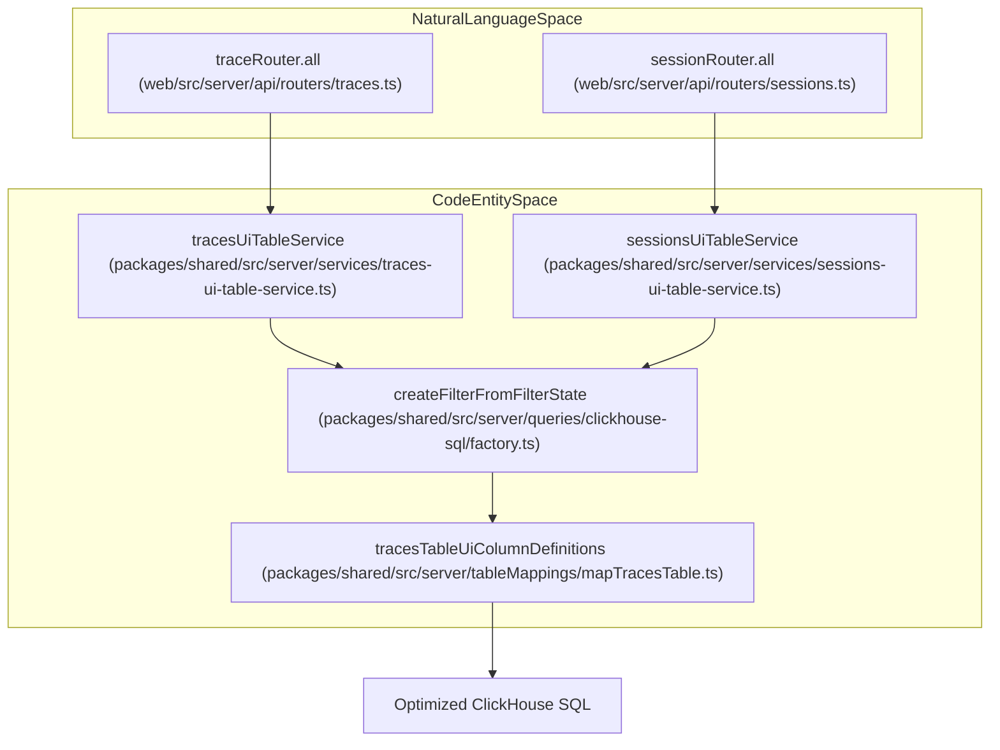
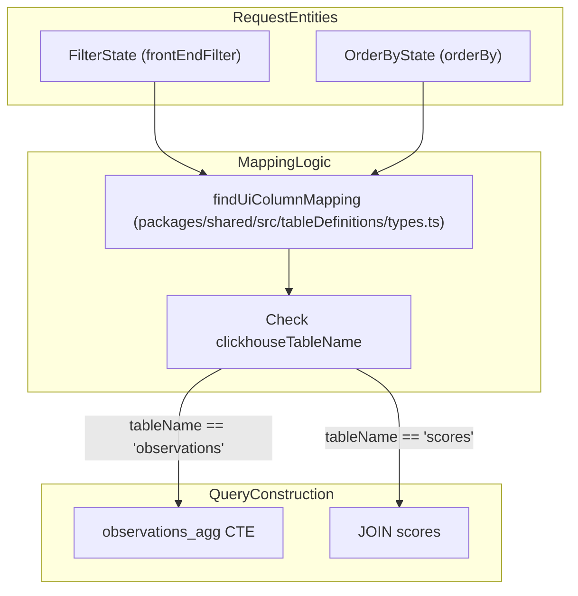

This page documents query optimization strategies employed throughout the Langfuse codebase to improve ClickHouse query performance. These optimizations focus on reducing table scans, minimizing expensive JOINs, and leveraging time-based partitioning through a structured Query Builder and specialized repository patterns.

## Overview

Langfuse implements several query optimization strategies to handle high-volume observability data efficiently:

- **Common Table Expressions (CTEs)**: Using CTEs for complex aggregations, such as calculating trace-level metrics (latency, cost, usage) from the `observations` table before joining with `traces` [packages/shared/src/server/repositories/traces.ts:102-126]().
- **Conditional JOINs**: Dynamically adding table joins only when filters or requested measures require them. For example, the `getSessionsTableGeneric` function only joins the `scores` table if a score-based filter or ordering is present [packages/shared/src/server/services/sessions-ui-table-service.ts:218-222]().
- **Time Window Constraints**: Using time-based filters to limit partition scans across related entities. The system often applies a ±2 day window lookback when checking for trace existence [packages/shared/src/server/repositories/traces.ts:166-168]().
- **Selective Column Loading**: Excluding large columns or metadata when unnecessary to reduce memory and CPU overhead during parsing [packages/shared/src/server/repositories/scores.ts:210-222]().
- **Deduplication Control**: Utilizing `FINAL` clauses for standard views or using `LIMIT 1 BY` for high-performance deduplication when the `FINAL` modifier is too costly [packages/shared/src/server/repositories/observations.ts:76-76]().
- **Final Skip Optimization**: OTel-based projects use immutable spans, allowing the system to skip expensive deduplication and `FINAL` clauses via `shouldSkipObservationsFinal` [packages/shared/src/server/services/traces-ui-table-service.ts:220-223]().

Sources: [packages/shared/src/server/repositories/traces.ts:102-126](), [packages/shared/src/server/services/sessions-ui-table-service.ts:218-222](), [packages/shared/src/server/repositories/scores.ts:210-222](), [packages/shared/src/server/services/traces-ui-table-service.ts:220-223]()

## Query Architecture

The repository layer bridges the internal tRPC API requests to optimized ClickHouse SQL. It uses `UiColumnMappings` to translate UI-friendly column names into precise ClickHouse table fields and prefixes.

### Data Flow Diagram
The following diagram illustrates how the repository layer and services bridge UI requests to the ClickHouse schema.

**Diagram: Relationship between API routers and the Query Generation logic.**

Sources: [web/src/server/api/routers/traces.ts:125-152](), [packages/shared/src/server/services/traces-ui-table-service.ts:206-223](), [packages/shared/src/server/queries/clickhouse-sql/factory.ts:51-170]()

## Complex Aggregation Patterns

Langfuse utilizes CTEs and specialized ClickHouse functions to aggregate data across hierarchical structures (Traces -> Observations -> Scores).

### Trace Metrics Aggregation
When fetching trace lists with metrics, the system uses an `observations_agg` CTE to calculate levels and usage details.

Key functions used:
- `multiIf`: Used to determine the `aggregated_level` (ERROR > WARNING > DEFAULT > DEBUG) across all observations in a trace [packages/shared/src/server/repositories/traces.ts:105-110]().
- `sumMap`: To aggregate `usage_details` and `cost_details` maps efficiently across observations [packages/shared/src/server/repositories/traces.ts:116-117]().
- `date_diff`: To calculate latency in milliseconds between the earliest and latest observation timestamps [packages/shared/src/server/repositories/traces.ts:115-115]().

Sources: [packages/shared/src/server/repositories/traces.ts:102-126]()

## Conditional JOIN Optimization

The system analyzes requested dimensions and filters to determine whether secondary table joins (like `observations` or `scores`) are necessary.

### Join Decision Logic
The repository services evaluate if a join is required based on the `clickhouseTableName` found in the column mapping.

**Diagram: Conditional JOIN decision tree based on UI Column Mappings.**

### Implementation Detail
In `getSessionsTableGeneric`, the variable `requiresScoresJoin` is set to true if any filter or the `orderBy` column maps to the `scores` table [packages/shared/src/server/services/sessions-ui-table-service.ts:218-221](). This prevents joining the large `scores` table when only session metadata is needed.

Sources: [packages/shared/src/server/services/sessions-ui-table-service.ts:218-248](), [packages/shared/src/tableDefinitions/types.ts:33-40]()

## ClickHouse Specific Optimizations

### FINAL vs. LIMIT 1 BY
To handle updates and deduplication in ClickHouse:
- **Standard Deduplication**: Many queries use `FINAL` to ensure they read the latest version of a trace or observation [packages/shared/src/server/repositories/traces.ts:162-162]().
- **Optimized Existence Checks**: Functions like `checkObservationExists` use `LIMIT 1 BY id, project_id` combined with `ORDER BY event_ts DESC` as a more performant alternative to `FINAL` for simple existence checks [packages/shared/src/server/repositories/observations.ts:75-76]().

### Filter Optimization
The `createFilterFromFilterState` function maps UI filters to specialized ClickHouse filter classes [packages/shared/src/server/queries/clickhouse-sql/factory.ts:76-168]().
- **Empty vs Null**: String filters handle `'' ≡ NULL` logic explicitly. If `emptyEqualsNull` is true, an equality operator matches both empty strings and NULLs: `(field = '' OR field IS NULL)` [packages/shared/src/server/queries/clickhouse-sql/clickhouse-filter.ts:51-63]().
- **Time Window Pruning**: Repository methods like `getObservationsForTrace` inject mandatory `start_time` filters based on the parent trace's timestamp to leverage partition pruning [packages/shared/src/server/repositories/observations.ts:186-186]().
- **Filter Type Validation**: The system validates that the filter type (e.g., `stringOptions`) is compatible with the underlying column type (e.g., `string`) to prevent runtime ClickHouse errors [packages/shared/src/server/queries/clickhouse-sql/factory.ts:64-74]().

Sources: [packages/shared/src/server/repositories/observations.ts:75-76](), [packages/shared/src/server/queries/clickhouse-sql/clickhouse-filter.ts:51-63](), [packages/shared/src/server/queries/clickhouse-sql/factory.ts:64-74]()

## Performance Patterns

### Selective Payload Limitation
To prevent high memory consumption when parsing large traces, the `getObservationsForTrace` function calculates the cumulative size of input, output, and metadata. If the payload exceeds a threshold (e.g., 5MB), it truncates the data [packages/shared/src/server/repositories/observations.ts:212-230]().

### Metadata Exclusion
When fetching lists (e.g., all scores for a project), the system often excludes the heavy `metadata` column by default using `* EXCEPT (metadata)` and instead provides a boolean `has_metadata` flag [packages/shared/src/server/repositories/scores.ts:210-222](). This significantly reduces the data transfer volume for table views.

### Batch Processing
For session-level metrics, the system chunks trace IDs into batches (e.g., 500) to avoid hitting ClickHouse query limits and to allow for more granular progress tracking [web/src/server/api/routers/sessions.ts:97-112]().

Sources: [packages/shared/src/server/repositories/observations.ts:212-230](), [packages/shared/src/server/repositories/scores.ts:210-222](), [web/src/server/api/routers/sessions.ts:97-112]()