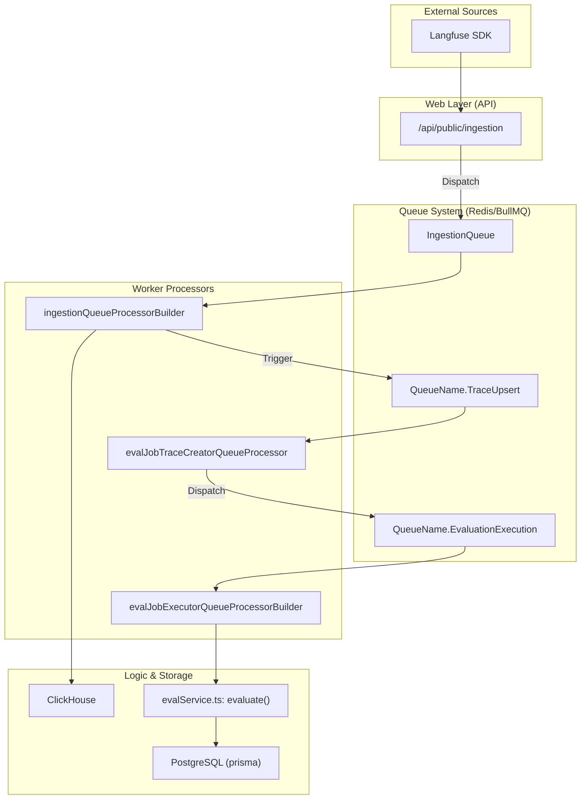
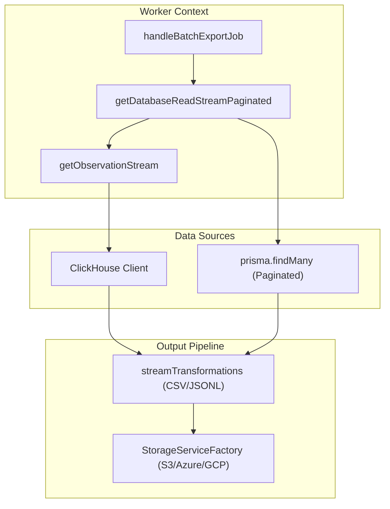

This page details the individual queue processors within the Langfuse worker service. These processors are BullMQ consumers responsible for background tasks including data ingestion, OpenTelemetry (OTel) processing, evaluation execution, large-scale data exports, and cloud usage metering.

For information about the queue architecture and sharding strategy, see **7.1 Queue Architecture**. For details on worker lifecycle management, see **7.2 Worker Manager**.

---

## Core Ingestion Processors

### Ingestion Queue Processor
**Purpose:** Processes standard SDK ingestion events (traces, spans, generations, scores) by downloading event batches from S3 and writing them to ClickHouse.

**Implementation Details:**
- **Registration:** The processor is initialized via `ingestionQueueProcessorBuilder` and registered with the `WorkerManager`.
- **Concurrency:** Concurrency is controlled via `LANGFUSE_INGESTION_QUEUE_PROCESSING_CONCURRENCY`.
- **Secondary Queue:** High-volume projects can be redirected to a `SecondaryIngestionQueue` based on the `LANGFUSE_SECONDARY_INGESTION_QUEUE_ENABLED_PROJECT_IDS` environment variable.

### OTel Ingestion Processor
**Purpose:** Converts OpenTelemetry `ResourceSpans` into Langfuse-native ingestion events.

**Implementation:**
- **Processor:** `otelIngestionQueueProcessor` is the entry point for processing jobs from the `OtelIngestionQueue`.
- **Mapping Logic:** The `OtelIngestionProcessor` class [packages/shared/src/server/otel/OtelIngestionProcessor.ts:142-142]() handles the conversion. It uses an `ObservationTypeMapperRegistry` [packages/shared/src/server/otel/OtelIngestionProcessor.ts:115-115]() to identify specific LLM spans (e.g., generations, spans, events).
- **Deduplication:** It maintains a `seenTraces` Set [packages/shared/src/server/otel/OtelIngestionProcessor.ts:146-146]() to ensure trace-level metadata is only created once per batch.
- **Storage:** Resource spans are first uploaded to S3 [packages/shared/src/server/otel/OtelIngestionProcessor.ts:187-190]() before being processed to handle large payloads.

**Sources:** [packages/shared/src/server/otel/OtelIngestionProcessor.ts:142-230](), [web/src/__tests__/server/api/otel/otelMapping.servertest.ts:8-24]()

---

## Evaluation Processors

The evaluation system uses a multi-stage pipeline to automate LLM-based scoring.

### Eval Job Creator
**Purpose:** Matches incoming traces or dataset items against `JobConfiguration` [worker/src/features/evaluation/evalService.ts:7-7]() filters to determine which evaluations should run.

| Processor Function | Trigger Source | Time Scope |
| :--- | :--- | :--- |
| `evalJobTraceCreatorQueueProcessor` | `TraceUpsert` | `NEW` [worker/src/queues/evalQueue.ts:33-33]() |
| `evalJobDatasetCreatorQueueProcessor` | `DatasetRunItemUpsert` | `NEW` [worker/src/queues/evalQueue.ts:54-54]() |
| `evalJobCreatorQueueProcessor` | `CreateEvalQueue` (Manual/UI) | All [worker/src/queues/evalQueue.ts:102-106]() |

**Logic:** These processors call `createEvalJobs` [worker/src/features/evaluation/evalService.ts:89-113](), which performs validation checks such as `traceExists` [worker/src/features/evaluation/evalService.ts:132-132]() and `observationExists` [worker/src/features/evaluation/evalService.ts:136-136]() before dispatching execution jobs to the `EvalExecutionQueue` [worker/src/features/evaluation/evalService.ts:16-16]().

### Evaluation Execution Processor
**Purpose:** Executes the LLM-as-a-judge logic.

**Implementation Details:**
- **Execution:** Calls `evaluate({ event: job.data.payload })` [worker/src/queues/evalQueue.ts:176-176]().
- **Variable Extraction:** Extracts values from trace data using mappings defined in the job configuration [worker/src/features/evaluation/evalService.ts:62-63]().
- **Redirection:** Supports a `SecondaryEvalExecutionQueue` [worker/src/queues/evalQueue.ts:142-142]() for specific project IDs to prevent high-volume projects from blocking the main queue [worker/src/queues/evalQueue.ts:132-157]().
- **Error Handling:** Classifies errors like `LLMCompletionError` [worker/src/queues/evalQueue.ts:14-14]() to decide between BullMQ retries or internal delayed retries [worker/src/queues/evalQueue.ts:185-201]().

**Sources:** [worker/src/queues/evalQueue.ts:25-201](), [worker/src/features/evaluation/evalService.ts:81-176]()

---

## Batch Export Processor

**Purpose:** Streams large datasets from ClickHouse or PostgreSQL to external blob storage (S3, Azure, GCP).

**Key Function:** `handleBatchExportJob` [worker/src/features/batchExport/handleBatchExportJob.ts:34-36]()
**Data Flow:**
1. **Query Parsing:** Validates the export query against `BatchExportQuerySchema` [worker/src/features/batchExport/handleBatchExportJob.ts:126-131]().
2. **Comment Filtering:** If filters on comments are applied, it uses `applyCommentFilters` [worker/src/features/batchExport/handleBatchExportJob.ts:145-150]() to resolve matching object IDs before starting the stream.
3. **Streaming:** Initializes a `DatabaseReadStream` based on the target table (Traces, Observations, Sessions, or Scores) [worker/src/features/batchExport/handleBatchExportJob.ts:174-202]().
4. **Transformation:** Uses `streamTransformations` to convert database rows into CSV or JSONL formats [worker/src/features/batchExport/handleBatchExportJob.ts:220-223]().
5. **Storage:** Uploads the resulting file to the configured blob storage using `StorageServiceFactory`.

**Specialized Streams:**
- `getObservationStream`: Specifically handles joining scores and model data for observation exports [worker/src/features/database-read-stream/observation-stream.ts:23-23]().
- `getDatabaseReadStreamPaginated`: Handles generic exports for tables like `scores` and `sessions` [worker/src/features/database-read-stream/getDatabaseReadStream.ts:99-114](). It includes logic to flatten scores into dynamic columns [worker/src/features/database-read-stream/getDatabaseReadStream.ts:68-97]().

**Sources:** [worker/src/features/batchExport/handleBatchExportJob.ts:34-231](), [worker/src/features/database-read-stream/getDatabaseReadStream.ts:99-140](), [worker/src/__tests__/batchExport.test.ts:34-118]()

---

## Batch Action Processor

**Purpose:** Performs bulk operations (delete, add to queue, add to dataset) on sets of records identified by filters.

**Logic:**
- **Implementation:** `handleBatchActionJob` [worker/src/features/batchAction/handleBatchActionJob.ts:141-144]() handles the execution.
- **Streaming Identifiers:** For actions like `trace-delete`, it uses `getTraceIdentifierStream` [worker/src/features/batchAction/handleBatchActionJob.ts:178-185]() to fetch only the necessary IDs.
- **Chunking:** Records are processed in chunks (default `CHUNK_SIZE = 1000`) [worker/src/features/batchAction/handleBatchActionJob.ts:42-42]() to avoid memory issues and database timeouts.
- **Idempotency:** Operations are designed to be idempotent to support retries [worker/src/features/batchAction/handleBatchActionJob.ts:53-56]().
- **Historical Evals:** For `eval-create` actions, it fetches historical data and dispatches jobs to the `CreateEvalQueue` [worker/src/features/batchAction/handleBatchActionJob.ts:224-227]().

**Sources:** [worker/src/features/batchAction/handleBatchActionJob.ts:57-227](), [worker/src/features/batchAction/handleBatchActionJob.ts:141-212]()

---

## Cloud Metering Processor

**Purpose:** Tracks and aggregates usage metrics for Langfuse Cloud billing.

**Implementation:**
- **Job Handler:** `handleCloudUsageMeteringJob` processes usage aggregation.
- **Queue:** `CloudUsageMeteringQueue` manages the scheduling of these metering tasks.

---

## System Integration Diagram

The following diagram bridges the natural language concepts of "Ingestion" and "Evaluation" to the specific code entities that process them.

### Ingestion to Evaluation Pipeline

**Sources:** [worker/src/queues/evalQueue.ts:25-35](), [worker/src/features/evaluation/evalService.ts:81-144]()

---

## Batch Export Data Flow

This diagram details the streaming architecture used for large data exports.

### Export Streaming Architecture

**Sources:** [worker/src/features/batchExport/handleBatchExportJob.ts:172-221](), [worker/src/features/database-read-stream/getDatabaseReadStream.ts:114-140]()