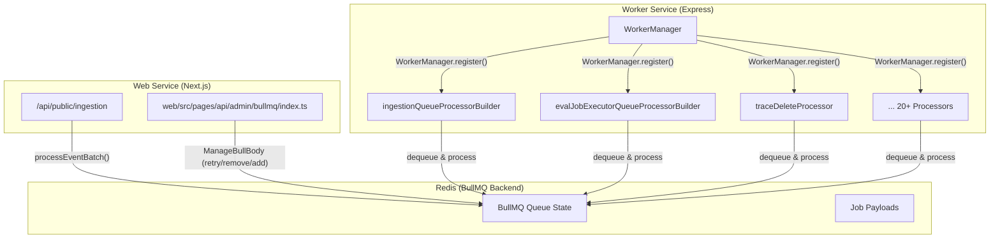
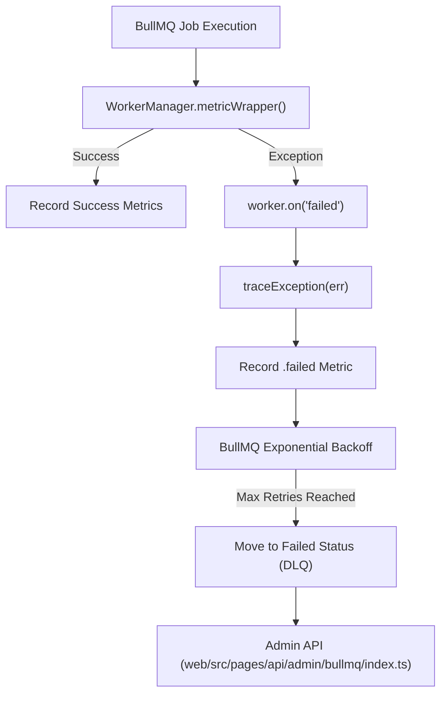
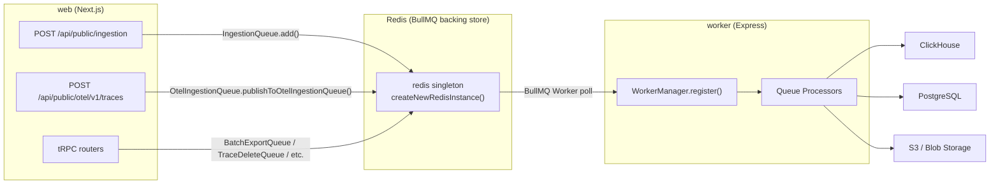

## Overview

The Queue & Worker System is the asynchronous processing infrastructure that handles all background tasks in Langfuse. It uses [BullMQ](https://optimalbits.github.io/bull/) on Redis to manage 20+ specialized queues that process events including data ingestion, evaluation execution, data deletion, exports, and integrations. The system is separate from the web service and runs in a dedicated worker service defined in `worker/src/app.ts` [worker/src/app.ts:1-107]().

This document covers the queue architecture, worker management, queue processors, error handling, and background services. For information about specific queue processing logic like ingestion or evaluation, see [Data Ingestion Pipeline](#6) and [Evaluation System](#10).

**Sources**: [worker/src/app.ts:1-107](), [packages/shared/src/server/queues.ts:1-250]()

## Queue Architecture

### BullMQ on Redis

The system uses BullMQ as the queue manager, backed by Redis. The configuration supports standalone Redis, Redis Cluster, and Redis Sentinel [packages/shared/src/server/redis/redis.ts:183-202](). Queue instances are created through singleton patterns and support features like:

- **Job delays**: Jobs can be delayed by a specified time (e.g., `LANGFUSE_INGESTION_QUEUE_DELAY_MS` [packages/shared/src/env.ts:99-102]()).
- **Concurrency control**: Each queue can limit concurrent job processing via worker registration [worker/src/app.ts:125-137]().
- **Global Rate limiting**: BullMQ limiters are used to throttle job processing globally across worker instances (e.g., for `CreateEvalQueue` [worker/src/app.ts:143-151]()).
- **Job retries**: Automatic exponential backoff for transient failures [packages/shared/src/server/redis/redis.ts:16-24]().
- **Dead letter management**: Failed jobs can be retried or cleaned via the Admin API [web/src/pages/api/admin/bullmq/index.ts:32-47]().

Title: BullMQ Queue Architecture


**Sources**: [worker/src/queues/workerManager.ts:20-160](), [packages/shared/src/server/redis/redis.ts:183-222](), [web/src/pages/api/admin/bullmq/index.ts:1-132]()

### Queue Types and Naming

Queues are defined in the `QueueName` enum [worker/src/app.ts:31-45](). Each queue has a corresponding Zod-validated payload in `packages/shared/src/server/queues.ts` [packages/shared/src/server/queues.ts:14-222]().

| Category | Queue Name | Job Schema | Sharded | Purpose |
|----------|------------|------------|---------|---------|
| **Ingestion** | `ingestion-queue` | `IngestionEvent` | Yes | Process legacy batch events [packages/shared/src/server/queues.ts:14-28]() |
| | `otel-ingestion-queue` | `OtelIngestionEvent` | Yes | Process OpenTelemetry spans [packages/shared/src/server/queues.ts:30-47]() |
| | `secondary-ingestion-queue` | `IngestionEvent` | No | High-priority project ingestion [worker/src/app.ts:36]() |
| **Evaluation** | `trace-upsert` | `TraceQueueEventSchema` | Yes | Trigger eval creation on trace upsert [packages/shared/src/server/queues.ts:56-61]() |
| | `create-eval-queue` | `CreateEvalQueueEventSchema` | No | Create eval jobs (batch & live) [packages/shared/src/server/queues.ts:204-217]() |
| | `evaluation-execution-queue` | `EvalExecutionEvent` | No | Execute LLM-as-Judge evals [packages/shared/src/server/queues.ts:96-100]() |
| | `llm-as-a-judge-execution-queue` | `LLMAsJudgeExecutionEventSchema`| No | Observation-level evals [packages/shared/src/server/queues.ts:103-107]() |
| **Deletion** | `trace-delete` | `TraceQueueEventSchema` | No | Delete traces and related data [worker/src/app.ts:52]() |
| | `project-delete` | `ProjectQueueEventSchema` | No | Cascade delete projects [worker/src/app.ts:53]() |
| **Integrations** | `posthog-integration-queue` | `PostHogIntegrationProcessingEventSchema` | No | Sync data to PostHog [packages/shared/src/server/queues.ts:108-110]() |
| | `blob-storage-integration-queue` | `BlobStorageIntegrationProcessingEventSchema` | No | Sync data to S3/Azure Blob [packages/shared/src/server/queues.ts:114-116]() |

For details, see [Queue Architecture](#7.1).

**Sources**: [packages/shared/src/server/queues.ts:14-222](), [worker/src/app.ts:25-86]()

### Sharded Queues

High-throughput queues use sharding to distribute load across Redis keys. Shard count is configured via environment variables like `LANGFUSE_INGESTION_QUEUE_SHARD_COUNT` [packages/shared/src/env.ts:103-111](). Jobs are distributed across shards using a hash of the project ID. Sharded queues are registered by iterating over shard names provided by the queue class, such as `TraceUpsertQueue.getShardNames()` [worker/src/app.ts:127-137]().

**Sources**: [packages/shared/src/env.ts:103-128](), [worker/src/app.ts:125-137]()

## Worker Manager

The `WorkerManager` class provides a unified interface for registering BullMQ workers with built-in instrumentation and centralized lifecycle management [worker/src/queues/workerManager.ts:20-160]().

### Worker Registration
Workers are registered in `worker/src/app.ts` using the `WorkerManager.register()` method. This method creates a `Worker` instance and wraps the processor in a metric collector.

```typescript
// Example from worker/src/app.ts:139-152
WorkerManager.register(
  QueueName.CreateEvalQueue,
  evalJobCreatorQueueProcessor,
  {
    concurrency: env.LANGFUSE_EVAL_CREATOR_WORKER_CONCURRENCY,
    limiter: {
      // Process at most `max` jobs per `duration` milliseconds globally
      max: env.LANGFUSE_EVAL_CREATOR_WORKER_CONCURRENCY,
      duration: env.LANGFUSE_EVAL_CREATOR_LIMITER_DURATION,
    },
  },
);
```

### Metrics Instrumentation
The `WorkerManager` automatically tracks metrics for every registered queue using a metric wrapper `metricWrapper` [worker/src/queues/workerManager.ts:41-110]():
- `request`: Job count [worker/src/queues/workerManager.ts:52]().
- `processing_time`: Duration of execution [worker/src/queues/workerManager.ts:99-101]().
- `wait_time`: Time spent in queue [worker/src/queues/workerManager.ts:50-51]().
- `length`, `dlq_length`, `active`: Sampled queue depth gauges [worker/src/queues/workerManager.ts:74-92]().

For details, see [Worker Manager](#7.2).

**Sources**: [worker/src/queues/workerManager.ts:20-186](), [worker/src/app.ts:139-152]()

## Queue Processors

Processors are specialized functions that handle job execution for specific queues.

- **Ingestion**: `ingestionQueueProcessorBuilder` handles event batch processing and ClickHouse writes [worker/src/app.ts:47]().
- **Evaluations**: `evalJobExecutorQueueProcessorBuilder` and `evalJobCreatorQueueProcessor` manage evaluation lifecycles [worker/src/app.ts:11-17]().
- **Exports**: `batchExportQueueProcessor` handles large-scale data exports from ClickHouse [worker/src/app.ts:18]().
- **Cloud Metering**: `cloudUsageMeteringQueueProcessor` calculates organization usage for billing [worker/src/app.ts:21]().

For details, see [Queue Processors](#7.3).

**Sources**: [worker/src/app.ts:11-80]()

## Error Handling & Retries

The system implements a multi-tier retry strategy:
1. **BullMQ Native Retries**: Configured with exponential backoff and custom retry strategies using `redisQueueRetryOptions` [packages/shared/src/server/redis/redis.ts:16-36]().
2. **Worker Error Logging**: The `WorkerManager` listens for `failed` and `error` events to record failures and trace exceptions [worker/src/queues/workerManager.ts:161-184]().
3. **Dead Letter Queue (DLQ)**: Failed jobs can be managed via the `DlqRetryService` or the Admin API [worker/src/app.ts:74](), [web/src/pages/api/admin/bullmq/index.ts:32-47]().
4. **Retry Service**: `DeadLetterRetryQueue` handles scheduled retries for failed jobs [worker/src/app.ts:34]().

Title: Queue Error Handling Flow


For details, see [Error Handling & Retries](#7.4).

**Sources**: [worker/src/queues/workerManager.ts:143-184](), [web/src/pages/api/admin/bullmq/index.ts:32-47](), [packages/shared/src/server/queues.ts:219-221]()

## Background Services

The worker service hosts several background managers that do not use the standard BullMQ flow:
- **Background Migration Manager**: Executes asynchronous database migrations `BackgroundMigrationManager.run()` without blocking queue workers [worker/src/app.ts:111-116]().
- **ClickHouseReadSkipCache**: Maintains a cache of project IDs that can skip ClickHouse reads during ingestion for performance [worker/src/app.ts:119-123]().
- **Cleanup Services**: Periodic tasks like `BatchProjectCleaner`, `MediaRetentionCleaner`, and various project blob/media cleaners [worker/src/app.ts:81-92]().

For details, see [Background Services](#7.5).

**Sources**: [worker/src/app.ts:81-123](), [worker/src/utils/shutdown.ts:30-53]()

## Scheduled Jobs

Langfuse uses repeatable jobs (cron-like) for periodic tasks:
- **Cloud Usage Metering**: Hourly sync for billing, enabled via `QUEUE_CONSUMER_CLOUD_USAGE_METERING_QUEUE_IS_ENABLED` [worker/src/app.ts:21](), [worker/src/env.ts:178-180]().
- **Core Data Export**: Scheduled S3 exports via `CoreDataS3ExportQueue` [worker/src/app.ts:154-161]().
- **Integration Jobs**: Periodic syncs for PostHog, Mixpanel, and Blob Storage [worker/src/app.ts:54-65]().
- **Data Retention**: Scheduled cleanup of aged data via `DataRetentionQueue` [worker/src/app.ts:68-71]().

For details, see [Scheduled Jobs](#7.6).

**Sources**: [worker/src/app.ts:54-181](), [worker/src/env.ts:178-191]()

# Queue Architecture


This page describes the BullMQ-based queue system: how queues are defined, named, typed, and how they relate to their workers. For the `WorkerManager` class and worker startup sequencing, see [7.2](). For the individual job processors, see [7.3](). For retry and error handling strategies, see [7.4](). For scheduled and repeating jobs, see [7.6]().

---

## BullMQ and Redis Foundation

All asynchronous work in Langfuse is coordinated through BullMQ backed by a Redis instance shared between the web server (producer) and the worker process (consumer).

Redis is configured via `packages/shared/src/env.ts` [packages/shared/src/env.ts:13-50](). Three connection modes are supported:

| Mode | Env Vars |
|---|---|
| Single-node | `REDIS_HOST`, `REDIS_PORT`, `REDIS_AUTH` |
| Connection string | `REDIS_CONNECTION_STRING` |
| Cluster | `REDIS_CLUSTER_ENABLED=true`, `REDIS_CLUSTER_NODES` |
| Sentinel | `REDIS_SENTINEL_ENABLED=true`, `REDIS_SENTINEL_NODES`, `REDIS_SENTINEL_MASTER_NAME` |

The module-level `redis` singleton is exported from `packages/shared/src/server/redis/redis.ts`. Each BullMQ queue creates its own dedicated Redis connection via `createNewRedisInstance()` [packages/shared/src/server/redis/redis.ts:183-228]() with `maxRetriesPerRequest: null` [packages/shared/src/server/redis/redis.ts:8]() and `redisQueueRetryOptions` (retries forever, capped at 20 seconds between attempts) [packages/shared/src/server/redis/redis.ts:16-23]().

**Cluster mode:** When `REDIS_CLUSTER_ENABLED=true`, the system ensures compatibility with Redis Cluster by using hash tags. BullMQ requires all keys for a specific queue to land on the same Redis cluster hash slot [packages/shared/src/env.ts:23-25]().

**High-level system diagram: Queue Data Flow**

Title: "System Queue Data Flow"

Sources: [packages/shared/src/server/redis/redis.ts:183-228](), [packages/shared/src/env.ts:13-50](), [worker/src/app.ts:95-104](), [web/src/pages/api/public/otel/v1/traces/index.ts:187]()

---

## Queue Names and Job Types

All queue names are defined in the `QueueName` enum [worker/src/app.ts:31](). Each job payload is validated by a Zod schema defined in `packages/shared/src/server/queues.ts`.

| Schema | Used By |
|---|---|
| `IngestionEvent` | `QueueName.IngestionQueue`, `QueueName.IngestionSecondaryQueue` [packages/shared/src/server/queues.ts:14-28]() |
| `OtelIngestionEvent` | `QueueName.OtelIngestionQueue` [packages/shared/src/server/queues.ts:30-47]() |
| `TraceQueueEventSchema` | `QueueName.TraceUpsert`, `QueueName.TraceDelete` [packages/shared/src/server/queues.ts:56-61]() |
| `EvalExecutionEvent` | `QueueName.EvaluationExecution`, `QueueName.EvaluationExecutionSecondaryQueue` [packages/shared/src/server/queues.ts:96-100]() |
| `CreateEvalQueueEventSchema` | `QueueName.CreateEvalQueue` [packages/shared/src/server/queues.ts:204-217]() |
| `BatchExportJobSchema` | `QueueName.BatchExport` [packages/shared/src/server/queues.ts:49-52]() |
| `BatchActionProcessingEventSchema` | `QueueName.BatchActionQueue` [packages/shared/src/server/queues.ts:127-202]() |
| `ProjectQueueEventSchema` | `QueueName.ProjectDelete` [packages/shared/src/server/queues.ts:85-88]() |
| `DatasetQueueEventSchema` | `QueueName.DatasetDelete` [packages/shared/src/server/queues.ts:70-84]() |
| `ExperimentCreateEventSchema` | `QueueName.ExperimentCreate` [packages/shared/src/server/queues.ts:117-122]() |
| `NotificationEventSchema` | `QueueName.NotificationQueue` [packages/shared/src/server/queues.ts:223-226]() |
| `LLMAsJudgeExecutionEventSchema` | `QueueName.LLMAsJudgeExecution` [packages/shared/src/server/queues.ts:103-107]() |

Sources: [packages/shared/src/server/queues.ts:14-226](), [worker/src/app.ts:25-45]()

---

## Queue Class Pattern

Each queue is wrapped in a static singleton class that holds a BullMQ `Queue` instance. Queue instances are looked up by name via the `getQueue()` factory [packages/shared/src/server/redis/getQueue.ts:33-44](). This function handles the logic for returning either standard or sharded queue instances. Standard queues are singletons, while sharded queues (e.g., `IngestionQueue`, `OtelIngestionQueue`, `TraceUpsertQueue`) are accessed via `getInstance({ shardName })` [web/src/pages/api/admin/bullmq/index.ts:85-109]().

**Diagram: Queue Class → Redis Queue Name → Processor mapping (code entity space)**

Title: "Queue Class to Code Entity Mapping"

```mermaid
flowchart TD
    subgraph "packages/shared/src/server/redis/"
        IQ["IngestionQueue\n(sharded)"]
        OIQ["OtelIngestionQueue\n(sharded)"]
        TUQ["TraceUpsertQueue\n(sharded)"]
        CEQ["CreateEvalQueue"]
        EEQ["EvalExecutionQueue\nSecondaryEvalExecutionQueue"]
        LAJ["LLMAsJudgeExecutionQueue"]
        BEQ["BatchExportQueue"]
        BAQ["BatchActionQueue"]
        TDQ["TraceDeleteQueue"]
        PDQ["ProjectDeleteQueue"]
        SDQ["ScoreDeleteQueue"]
        DDQ["DatasetDeleteQueue"]
        EXQ["ExperimentCreateQueue"]
        WQ["WebhookQueue"]
        ECQ["EntityChangeQueue"]
        NQ["NotificationQueue"]
        DLRQ["DeadLetterRetryQueue"]
        EPQ["EventPropagationQueue"]
    end

    subgraph "QueueName enum values (packages/shared/src/server/queues.ts)"
        IQN["ingestion-queue"]
        OIQN["otel-ingestion-queue"]
        TUQN["trace-upsert"]
        CEQN["create-eval-queue"]
        EEQN["evaluation-execution-queue"]
        LAJN["llm-as-a-judge-execution-queue"]
        BEQN["batch-export-queue"]
        BAQN["batch-action-queue"]
        TDQN["trace-delete"]
        PDQN["project-delete"]
        SDQN["score-delete"]
        DDQN["dataset-delete-queue"]
        EXQN["experiment-create-queue"]
        WQN["webhook-queue"]
        ECQN["entity-change-queue"]
        NQN["notification-queue"]
    end

    IQ --> IQN
    OIQ --> OIQN
    TUQ --> TUQN
    CEQ --> CEQN
    EEQ --> EEQN
    LAJ --> LAJN
    BEQ --> BEQN
    BAQ --> BAQN
    TDQ --> TDQN
    PDQ --> PDQN
    SDQ --> SDQN
    DDQ --> DDQN
    EXQ --> EXQN
    WQ --> WQN
    ECQ --> ECQN
    NQ --> NQN
```

Sources: [packages/shared/src/server/redis/getQueue.ts:46-99](), [web/src/pages/api/admin/bullmq/index.ts:71-122](), [packages/shared/src/server/index.ts:53-87]()

---

## Sharded Queues

Several queues support horizontal sharding to distribute load across multiple Redis keys. This is particularly important for high-throughput ingestion and cluster compatibility [packages/shared/src/env.ts:103-128]().

| Queue Class | Base `QueueName` | Shard Count Env Var | Default Shards |
|---|---|---|---|
| `IngestionQueue` | `ingestion-queue` | `LANGFUSE_INGESTION_QUEUE_SHARD_COUNT` | 1 |
| `SecondaryIngestionQueue` | `ingestion-secondary-queue` | `LANGFUSE_INGESTION_SECONDARY_QUEUE_SHARD_COUNT` | 1 |
| `OtelIngestionQueue` | `otel-ingestion-queue` | `LANGFUSE_OTEL_INGESTION_QUEUE_SHARD_COUNT` | 1 |
| `TraceUpsertQueue` | `trace-upsert` | `LANGFUSE_TRACE_UPSERT_QUEUE_SHARD_COUNT` | 1 |
| `EvalExecutionQueue`| `evaluation-execution-queue` | `LANGFUSE_EVAL_EXECUTION_QUEUE_SHARD_COUNT` | 1 |
| `LLMAsJudgeExecutionQueue` | `llm-as-a-judge-execution-queue` | `LANGFUSE_LLM_AS_JUDGE_EXECUTION_QUEUE_SHARD_COUNT` | 1 |

**Worker registration for shards:** In `worker/src/app.ts`, the worker iterates through `getShardNames()` and registers a separate BullMQ Worker for each shard [worker/src/app.ts:127-136]():

```typescript
// worker/src/app.ts:127-136
const traceUpsertShardNames = TraceUpsertQueue.getShardNames();
traceUpsertShardNames.forEach((shardName) => {
  WorkerManager.register(
    shardName as QueueName,
    evalJobTraceCreatorQueueProcessor,
    {
      concurrency: env.LANGFUSE_TRACE_UPSERT_WORKER_CONCURRENCY,
    },
  );
});
```

Sources: [worker/src/app.ts:125-137](), [packages/shared/src/env.ts:103-128](), [web/src/pages/api/admin/bullmq/index.ts:71-79]()

---

## Queue-to-Worker Registration

All queue workers are registered in `worker/src/app.ts` using `WorkerManager.register(queueName, processor, options)`. Each registration is typically guarded by a `QUEUE_CONSUMER_*_IS_ENABLED` environment flag [worker/src/env.ts:179-200]().

| `QueueName` | Processor | Default Concurrency | Env Var |
|---|---|---|---|
| `TraceUpsert` (shards) | `evalJobTraceCreatorQueueProcessor` | 25 | `LANGFUSE_TRACE_UPSERT_WORKER_CONCURRENCY` [worker/src/env.ts:112-115]() |
| `CreateEvalQueue` | `evalJobCreatorQueueProcessor` | 2 | `LANGFUSE_EVAL_CREATOR_WORKER_CONCURRENCY` [worker/src/env.ts:108-111]() |
| `TraceDelete` | `traceDeleteProcessor` | 1 | `LANGFUSE_TRACE_DELETE_CONCURRENCY` [worker/src/env.ts:116]() |
| `ScoreDelete` | `scoreDeleteProcessor` | 1 | `LANGFUSE_SCORE_DELETE_CONCURRENCY` [worker/src/env.ts:117]() |
| `BatchExport` | `batchExportQueueProcessor` | — | — [worker/src/app.ts:18]() |
| `IngestionQueue` | `ingestionQueueProcessorBuilder` | 20 | `LANGFUSE_INGESTION_QUEUE_PROCESSING_CONCURRENCY` [worker/src/env.ts:74-77]() |
| `OtelIngestionQueue` | `otelIngestionQueueProcessor` | 5 | `LANGFUSE_OTEL_INGESTION_QUEUE_PROCESSING_CONCURRENCY` [worker/src/env.ts:70-73]() |

Sources: [worker/src/app.ts:123-200](), [worker/src/env.ts:70-138]()

---

## Rate Limiters

Some queues use a BullMQ `limiter` to control global processing rates, preventing database or external API overload [worker/src/app.ts:145-150]().

| Queue | Limiter: max | Limiter: duration | Purpose |
|---|---|---|---|
| `CreateEvalQueue` | Concurrency | 500 ms | Throttle eval job creation [worker/src/app.ts:147-148]() |
| `TraceDelete` | Concurrency | `DURATION_MS` | Throttle ClickHouse deletes [worker/src/app.ts:189-191]() |
| `MeteringDataPostgresExportQueue` | 1 | 30 s | Avoid PG connection spikes [worker/src/app.ts:173-174]() |

Sources: [worker/src/app.ts:143-192](), [worker/src/env.ts:104-107]()

---

## Secondary Queues

Two queue pairs support a secondary/overflow pattern to isolate high-throughput projects or specific workloads:

**Ingestion:** `IngestionQueue` (primary, sharded) and `SecondaryIngestionQueue` (also sharded). Projects can be routed to the secondary queue via `LANGFUSE_SECONDARY_INGESTION_QUEUE_ENABLED_PROJECT_IDS` [worker/src/env.ts:82]().

**Evaluation Execution:** `EvaluationExecution` (primary) and `SecondaryEvalExecutionQueue`. Projects in `LANGFUSE_SECONDARY_EVAL_EXECUTION_QUEUE_ENABLED_PROJECT_IDS` are routed to the secondary queue [worker/src/env.ts:128-134]().

Sources: [worker/src/app.ts:35-43](), [worker/src/env.ts:78-134]()

---

## Event Propagation Queue

The `EventPropagationQueue` [worker/src/app.ts:41]() is responsible for propagating ingested events through the system, specifically moving data from staging areas to final tables. Its processor is registered in `worker/src/app.ts` as `eventPropagationProcessor` [worker/src/app.ts:79]().

Sources: [worker/src/app.ts:41](), [worker/src/app.ts:79]()