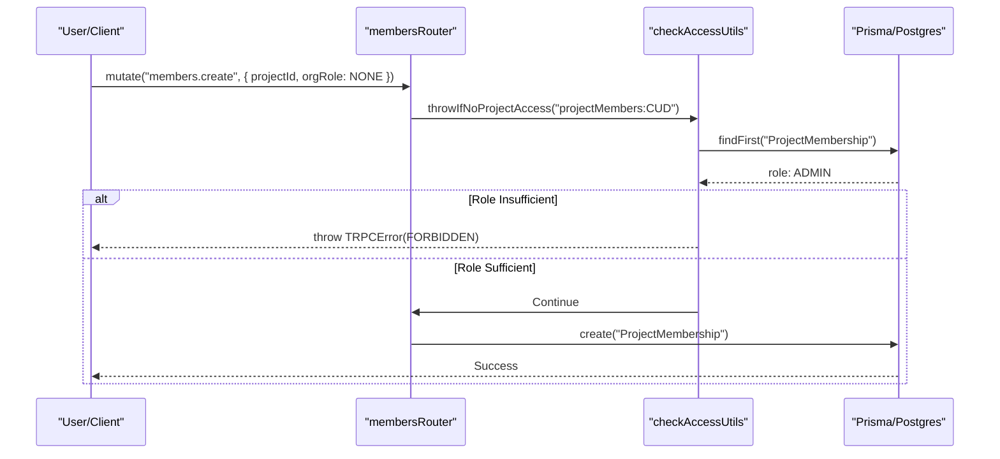
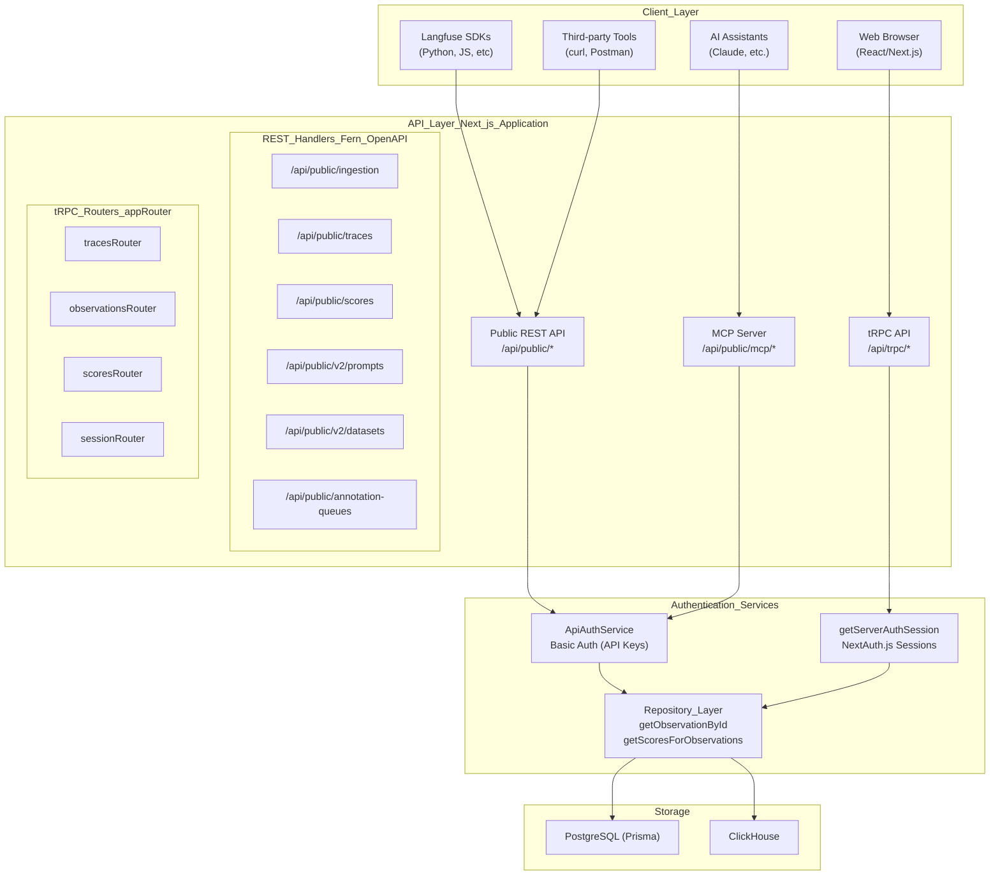

This document describes Langfuse's Role-Based Access Control (RBAC) system, which governs user and API key permissions across organizations and projects. The system implements a hierarchical dual-role model where organization-level roles can be inherited or overridden at the project level, with fine-grained permission scopes controlling access to specific operations.

## Overview

Langfuse implements a hierarchical RBAC system with two membership levels:

1.  **Organization-level memberships**: Each user has a role within each organization they belong to, tracked via the `OrganizationMembership` model in PostgreSQL [[web/src/features/rbac/server/allMembersRoutes.ts:80-82]]().
2.  **Project-level memberships**: Users can have project-specific role overrides via the `ProjectMembership` model [[web/src/features/rbac/server/membersRouter.ts:84-86]]() that supersede their organization role.

API keys are scoped to either an entire organization or a specific project, inheriting appropriate permissions based on their scope [[web/src/features/rbac/components/MembersTable.tsx:135-135]]().

Sources: [[web/src/features/rbac/server/membersRouter.ts:112-169]](), [[web/src/features/rbac/server/allMembersRoutes.ts:80-124]]()

## Role Hierarchy

### Role Enum

The system defines roles in descending order of privilege. The `Role` enum is imported from `@langfuse/shared` [[web/src/features/rbac/components/MembersTable.tsx:21-21]]():

| Role | Description |
| :--- | :--- |
| `OWNER` | Full administrative access, can manage members, billing, and delete projects/orgs [[web/src/features/rbac/constants/projectAccessRights.ts:86-139]](). |
| `ADMIN` | Administrative access; can manage most resources and members but not all org settings [[web/src/features/rbac/constants/projectAccessRights.ts:140-192]](). |
| `MEMBER` | Standard access; can create and manage resources (traces, prompts, etc.) [[web/src/features/rbac/constants/projectAccessRights.ts:193-232]](). |
| `VIEWER` | Read-only access; can view resources but cannot modify them [[web/src/features/rbac/constants/projectAccessRights.ts:233-250]](). |
| `NONE` | Explicitly denies access (used for organization-level roles to require project-specific overrides) [[web/src/features/rbac/constants/projectAccessRights.ts:251-251]](). |

Sources: [[web/src/features/rbac/server/membersRouter.ts:18-19]](), [[web/src/features/rbac/constants/projectAccessRights.ts:85-252]]()

### Role Ordering and Validation

The system uses an internal ordering to ensure users cannot grant or edit a role higher than their own. This is enforced in the `membersRouter` via `throwIfHigherRole` [[web/src/features/rbac/server/membersRouter.ts:53-60]]() and `throwIfHigherProjectRole` [[web/src/features/rbac/server/membersRouter.ts:66-107]]().

```typescript
function throwIfHigherRole({ ownRole, role }: { ownRole: Role; role: Role }) {
  if (orderedRoles[ownRole] < orderedRoles[role]) {
    throw new TRPCError({
      code: "FORBIDDEN",
      message: "You cannot grant/edit a role higher than your own",
    });
  }
}
```

Sources: [[web/src/features/rbac/server/membersRouter.ts:53-60]](), [[web/src/features/rbac/constants/orderedRoles.ts:30-30]]()

## Membership Models & Data Flow

### Entity Relationship

The following diagram bridges the natural language concepts of "Organizations" and "Projects" to the code entities used for RBAC as defined in the Prisma schema and the `membersRouter`.

**Langfuse RBAC Entity Relationships**
```mermaid
classDiagram
    class "User"["User"] {
        +String id
        +String email
        +OrganizationMembership[] OrganizationMemberships
    }
    class "Organization"["Organization"] {
        +String id
        +String name
        +Project[] projects
    }
    class "OrganizationMembership"["OrganizationMembership"] {
        +String id
        +Role role
        +String orgId
        +String userId
        +ProjectMembership[] ProjectMemberships
    }
    class "Project"["Project"] {
        +String id
        +String orgId
        +ProjectMembership[] projectMembers
    }
    class "ProjectMembership"["ProjectMembership"] {
        +String id
        +Role role
        +String projectId
        +String orgMembershipId
    }

    "User" "1" -- "*" "OrganizationMembership" : "has"
    "Organization" "1" -- "*" "OrganizationMembership" : "contains"
    "Organization" "1" -- "*" "Project" : "owns"
    "OrganizationMembership" "1" -- "*" "ProjectMembership" : "linked_to"
    "Project" "1" -- "*" "ProjectMembership" : "has_members"
```

Sources: [[web/src/features/rbac/server/membersRouter.ts:84-91]](), [[web/src/features/rbac/server/allMembersRoutes.ts:80-124]](), [[web/src/__tests__/server/members-trpc.servertest.ts:12-43]]()

### Role Resolution Logic

The effective role for a user in a specific project is determined by taking the maximum privilege between their `OrganizationMembership.role` and their `ProjectMembership.role` [[web/src/features/rbac/server/membersRouter.ts:94-99]]().

1.  If a `ProjectMembership` exists for the user and project, that role is fetched [[web/src/features/rbac/server/membersRouter.ts:84-91]]().
2.  The system calculates `ownRoleValue` by taking the `Math.max` of the `orderedRoles` values for both the project role and the organization role [[web/src/features/rbac/server/membersRouter.ts:94-99]]().
3.  If no project membership exists, it defaults to the organization role [[web/src/features/rbac/server/membersRouter.ts:99-99]]().

Sources: [[web/src/features/rbac/server/membersRouter.ts:94-99]](), [[web/src/features/rbac/constants/orderedRoles.ts:30-30]]()

## Access Scopes (Permissions)

Langfuse uses fine-grained "Scopes" to define what a role can actually do. These are defined as strings in the format `resource:action` [[web/src/features/rbac/constants/projectAccessRights.ts:82-83]]().

### Project Scopes

Project-level scopes control access to tracing data, prompts, and project settings. Examples include:
*   `projectMembers:CUD`: Create, Update, Delete project members [[web/src/features/rbac/constants/projectAccessRights.ts:7-7]]().
*   `llmTools:CUD`: Create or update LLM tools [[web/src/features/rbac/constants/projectAccessRights.ts:64-64]]().
*   `scoreConfigs:read`: Read score configurations [[web/src/features/rbac/constants/projectAccessRights.ts:21-21]]().
*   `prompts:CUD`: Create, Update, or Delete prompts [[web/src/features/rbac/constants/projectAccessRights.ts:36-36]]().
*   `auditLogs:read`: Access to view audit logs [[web/src/features/rbac/constants/projectAccessRights.ts:73-73]]().

The mapping of roles to these scopes is maintained in `projectRoleAccessRights` [[web/src/features/rbac/constants/projectAccessRights.ts:85-252]]().

Sources: [[web/src/features/rbac/constants/projectAccessRights.ts:5-80]](), [[web/src/features/rbac/constants/projectAccessRights.ts:85-252]]()

### Organization Scopes

Organization-level scopes control billing, SSO, and membership at the org level.
*   `organizationMembers:read`: View organization members [[web/src/features/rbac/server/allMembersRoutes.ts:149-149]]().
*   `organizationMembers:CUD`: Manage organization-wide membership [[web/src/features/rbac/server/membersRouter.ts:167-167]]().

Sources: [[web/src/features/rbac/server/allMembersRoutes.ts:143-152]](), [[web/src/features/rbac/server/membersRouter.ts:162-169]]()

## Enforcement Mechanisms

### Server-Side: tRPC Procedures

Permissions are enforced in the API layer using tRPC procedures and utility functions.

*   `throwIfNoProjectAccess`: Utility function called within procedures to check for a specific scope [[web/src/features/rbac/server/membersRouter.ts:157-161]]().
*   `throwIfNoOrganizationAccess`: Similar check for organization-level scopes [[web/src/features/rbac/server/membersRouter.ts:164-168]]().

**RBAC Enforcement via tRPC**


Sources: [[web/src/features/rbac/server/membersRouter.ts:112-169]](), [[web/src/features/rbac/server/allMembersRoutes.ts:143-185]]()

### Client-Side: UI Guards

The UI uses React hooks to conditionally show or hide elements based on permissions:

*   `useHasProjectAccess`: Returns a boolean indicating if the current user has a specific scope in the active project [[web/src/features/rbac/components/MembersTable.tsx:27-27]]().
*   `useHasOrganizationAccess`: Similar to project access, but for organization-level scopes [[web/src/features/rbac/components/MembersTable.tsx:17-17]]().
*   `useHasEntitlement`: Checks for feature availability (e.g., `cloud-billing`, `rbac-project-roles`) based on the organization's plan [[web/src/features/rbac/components/MembersTable.tsx:25-25]](), [[web/src/pages/project/[projectId]/settings/index.tsx:45-49]]().

Sources: [[web/src/features/rbac/components/MembersTable.tsx:73-81]](), [[web/src/features/rbac/components/MembersTable.tsx:138-147]](), [[web/src/pages/project/[projectId]/settings/index.tsx:42-62]]()

## Entitlements & Limits

The system enforces limits on memberships and feature access based on the organization's plan.

### Membership Limits
On certain plans (e.g., `cloud:hobby`), the number of organization members is capped. The `membersRouter` checks this before creating new memberships or invitations [[web/src/features/rbac/server/membersRouter.ts:223-228]]().

*   `throwIfExceedsLimit`: Enforces the `organization-member-count` limit [[web/src/features/rbac/server/membersRouter.ts:23-23]]().
*   This check includes both current members and pending invitations [[web/src/__tests__/server/members-trpc.servertest.ts:165-188]]().

Sources: [[web/src/features/rbac/server/membersRouter.ts:223-231]](), [[web/src/__tests__/server/members-trpc.servertest.ts:115-214]](), [[web/src/features/entitlements/constants/entitlements.ts:61-61]]()

### Feature Entitlements
Specific features are gated by entitlements defined in `entitlementAccess` [[web/src/features/entitlements/constants/entitlements.ts:51-171]]():
*   `rbac-project-roles`: Required to assign different roles per project [[web/src/features/rbac/server/membersRouter.ts:177-189]](). Enabled on `cloud:team`, `cloud:enterprise`, and `self-hosted:enterprise` [[web/src/features/entitlements/constants/entitlements.ts:95-155]]().
*   `admin-api`: Required to manage organization-level API keys [[web/src/pages/organization/[organizationId]/settings/index.tsx:33-33]]().
*   `audit-logs`: Required to view audit logs [[web/src/pages/organization/[organizationId]/settings/index.tsx:34-34]]().

Sources: [[web/src/features/rbac/server/membersRouter.ts:177-189]](), [[web/src/pages/organization/[organizationId]/settings/index.tsx:30-48]](), [[web/src/features/entitlements/constants/entitlements.ts:6-171]]()

## Audit Logging

Langfuse tracks administrative and security-relevant actions in an audit log [[web/src/features/audit-logs/auditLog.ts:80-80]]().

*   **Auditable Resources**: Includes `organization`, `orgMembership`, `projectMembership`, `membershipInvitation`, `apiKey`, and more [[web/src/features/audit-logs/auditLog.ts:7-46]]().
*   **Context**: Logs record the user ID, organization ID, project ID, and the specific action taken [[web/src/features/audit-logs/auditLog.ts:81-105]]().
*   **State Changes**: The `before` and `after` states of the resource can be stored for detailed change tracking [[web/src/features/audit-logs/auditLog.ts:113-114]]().

Sources: [[web/src/features/audit-logs/auditLog.ts:1-118]](), [[web/src/features/rbac/server/membersRouter.ts:1-1]]()

# API Layer


## Purpose and Scope

This document describes the dual API architecture that exposes Langfuse functionality to external clients and the web application. The API Layer consists of two distinct surfaces: the **Public REST API** for language-agnostic programmatic access (primarily used by SDKs), and the **tRPC API** for type-safe communication between the Next.js web application and server.

For details on authentication mechanisms and authorization checks, see [API Authentication & Rate Limiting](#5.3). For information on data ingestion processing that occurs after API requests are received, see [Data Ingestion Pipeline](#6).

## Dual API Architecture

Langfuse implements two parallel API architectures that serve different client types with different requirements:



**Key Architectural Decisions:**

| Aspect | Public REST API | tRPC API |
|--------|----------------|----------|
| **Primary Users** | SDKs, CLI tools, external integrations | Web application frontend |
| **Authentication** | HTTP Basic Auth (API keys) [web/src/features/public-api/server/apiAuth.ts:102-104]() | NextAuth.js sessions [web/src/server/api/trpc.ts:61-61]() |
| **Type Safety** | OpenAPI/Fern validation at runtime | Full TypeScript type inference |
| **Schema Definition** | Fern YAML definitions [fern/apis/server/definition/prompts.yml:1-6]() | Zod schemas in TypeScript [web/src/server/api/trpc.ts:22-22]() |
| **Code Generation** | Fern generates OpenAPI spec and SDKs [web/public/generated/api/openapi.yml:1-22]() | Generates types for Next.js client |
| **Base Path** | `/api/public/*` [web/public/generated/api/openapi.yml:23-24]() | `/api/trpc/*` |

**Sources:**
- [web/src/server/api/trpc.ts:102-114]()
- [web/public/generated/api/openapi.yml:1-23]()
- [web/src/features/public-api/server/apiAuth.ts:29-36]()
- [web/src/pages/api/public/ingestion.ts:76-79]()

## Public REST API

The Public REST API is the primary integration point for external systems. It is defined using Fern and exported as an OpenAPI specification. All endpoints require authentication via API keys (Public Key as username, Secret Key as password) [web/public/generated/api/openapi.yml:9-17]().

### Core Features
- **Ingestion**: High-volume endpoints for traces, spans, and generations via `/api/public/ingestion`. This handler supports asynchronous processing by uploading batches to S3 and dispatching to a queue [web/src/pages/api/public/ingestion.ts:34-49]().
- **CRUD Operations**: Management of traces [fern/apis/server/definition/commons.yml:4-44](), observations [fern/apis/server/definition/commons.yml:95-160](), and scores.
- **Prompts V2**: A modernized prompts API supporting versioning, labels (e.g., "production"), and dependency resolution via the `resolutionGraph` [fern/apis/server/definition/prompts.yml:9-32]().
- **Metrics V2**: High-performance metrics endpoint for querying observations and scores with support for aggregations like `p99` and `histogram` [fern/apis/server/definition/metrics.yml:9-113]().
- **Annotation Queues**: Endpoints to manage human-in-the-loop labeling workflows, including listing queues and adding items [web/public/generated/api/openapi.yml:24-81]().

For details, see [Public REST API](#5.1).

**Sources:**
- [web/public/generated/api/openapi.yml:1-23]()
- [fern/apis/server/definition/prompts.yml:9-32]()
- [fern/apis/server/definition/metrics.yml:9-113]()
- [web/src/pages/api/public/ingestion.ts:34-49]()

## tRPC Internal API

The tRPC API is used exclusively by the Langfuse web UI. It provides a type-safe bridge between the React frontend and the Node.js backend, ensuring that changes to the data model are immediately reflected in the UI code.

### Architecture
- **Router Structure**: A hierarchical tree of routers initialized via `createTRPCRouter` [web/src/server/api/trpc.ts:128-128](). Examples include the `observationsRouter` [web/src/server/api/routers/observations.ts:10-10]().
- **Context**: The `createTRPCContext` function injects the database client (`prisma`), user session, and request headers into every request handler [web/src/server/api/trpc.ts:57-72]().
- **Middleware**: Includes global error handling that surfaces specific advice for ClickHouse errors [web/src/server/api/trpc.ts:157-191](), and OpenTelemetry instrumentation for context propagation [web/src/server/api/trpc.ts:194-206]().
- **Data Fetching**: Routers abstract data retrieval from the repository layer. For example, `observationsRouter.byId` uses `getObservationById` to fetch detailed data for the UI [web/src/server/api/routers/observations.ts:33-45]().

For details, see [tRPC Internal API](#5.2).

**Sources:**
- [web/src/server/api/trpc.ts:43-72]()
- [web/src/server/api/trpc.ts:128-128]()
- [web/src/server/api/trpc.ts:157-211]()
- [web/src/server/api/routers/observations.ts:10-46]()

## API Authentication & Rate Limiting

Langfuse uses a robust authentication and rate-limiting system to protect its APIs and ensure fair usage, particularly in multi-tenant environments.

- **ApiAuthService**: Verifies API keys using Basic or Bearer auth [web/src/features/public-api/server/apiAuth.ts:86-88](). It leverages Redis for high-performance key caching [web/src/features/public-api/server/apiAuth.ts:109-112]() and supports both `PROJECT` and `ORGANIZATION` scopes [web/src/features/public-api/server/apiAuth.ts:181-182]().
- **Secret Verification**: Uses SHA hashing with a salt [web/src/features/public-api/server/apiAuth.ts:106-107]() to verify keys, with a transition mechanism to `fastHashedSecretKey` for performance [web/src/features/public-api/server/apiAuth.ts:149-156]().
- **Rate Limiting**: The `RateLimitService` enforces limits based on the API key scope, distinguishing between ingestion and general API operations [web/src/pages/api/public/ingestion.ts:103-111]().

For details, see [API Authentication & Rate Limiting](#5.3).

**Sources:**
- [web/src/features/public-api/server/apiAuth.ts:29-198]()
- [web/src/pages/api/public/ingestion.ts:76-111]()
- [packages/shared/src/server/instrumentation/index.ts:16-35]()

## MCP Server

The Model Context Protocol (MCP) server allows AI assistants (like Claude) to connect directly to Langfuse. It exposes tools for prompt management, enabling assistants to fetch, list, and update prompts stored in Langfuse.

- **Stateless Architecture**: Each request is authenticated independently using standard Langfuse API keys [web/public/generated/api/openapi.yml:6-17]().
- **Prompt Integration**: Leverages the Prompts API to allow AI models to retrieve the latest prompt versions and configurations [fern/apis/server/definition/prompts.yml:9-32]().

For details, see [MCP Server](#5.4).

**Sources:**
- [web/public/generated/api/openapi.yml:1-17]()
- [fern/apis/server/definition/prompts.yml:9-32]()