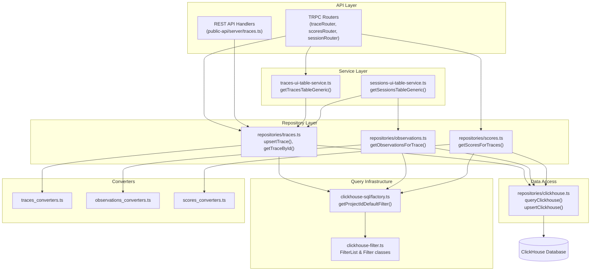
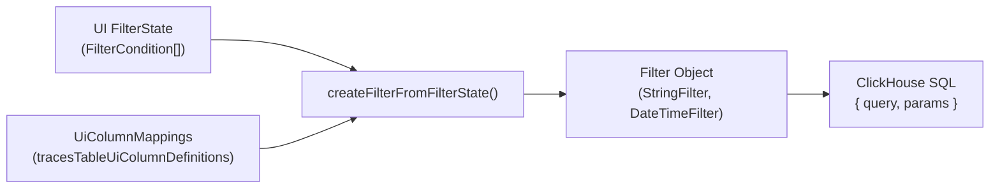

The repository pattern in Langfuse provides a structured data access layer for ClickHouse operations. Repositories encapsulate all queries for core domain entities (traces, observations, scores, sessions), offering a consistent interface for data retrieval, insertion, and deletion. This abstraction isolates business logic from database implementation details and provides a centralized location for query optimization and instrumentation.

For information about the ClickHouse schema and table structure, see [3.3](). For details on the events table architecture, see [3.4]().

---

## Repository Architecture

The repository layer sits between service/router code and the raw ClickHouse client, providing domain-specific query functions organized by entity type.

### Repository Data Flow

**Sources:**
- [packages/shared/src/server/repositories/traces.ts:1-40]()
- [packages/shared/src/server/repositories/observations.ts:1-40]()
- [packages/shared/src/server/repositories/scores.ts:1-40]()
- [web/src/server/api/routers/traces.ts:97-152]()
- [web/src/features/public-api/server/traces.ts:48-66]()

---

## Core Repository Structure

Each repository is implemented as a collection of exported functions that encapsulate specific query operations. Repositories follow a consistent naming convention and structure.

### Traces Repository

The traces repository provides functions for managing trace records in ClickHouse.

| Function | Purpose | Return Type |
|----------|---------|-------------|
| `checkTraceExistsAndGetTimestamp` | Validate trace existence with time window filtering | `Promise<{exists: boolean, timestamp?: Date}>` |
| `upsertTrace` | Insert or update a trace record | `Promise<void>` |
| `getTraceById` | Retrieve a single trace by ID | `Promise<TraceDomain \| undefined>` |

**Key Implementation Details:**

The `checkTraceExistsAndGetTimestamp` function uses a ±2 day window and CTE-based aggregation to validate traces before evaluation job creation [packages/shared/src/server/repositories/traces.ts:58-72](). It constructs an `observations_agg` CTE to calculate aggregated levels and latencies [packages/shared/src/server/repositories/traces.ts:102-126]().

**Sources:**
- [packages/shared/src/server/repositories/traces.ts:58-192]()
- [packages/shared/src/server/repositories/traces.ts:198-204]()

### Observations Repository

The observations repository manages observation records (spans, generations, events).

| Function | Purpose | Return Type |
|----------|---------|-------------|
| `checkObservationExists` | Validate observation existence | `Promise<boolean>` |
| `upsertObservation` | Insert or update an observation record | `Promise<void>` |
| `getObservationsForTrace` | Retrieve all observations for a trace | `Promise<ObservationRecordReadType[]>` |

**Key Implementation Details:**

`getObservationsForTrace` handles large payloads by limiting the size of input/output/metadata fields to the `LANGFUSE_API_TRACE_OBSERVATIONS_SIZE_LIMIT_BYTES` environment variable to prevent memory exhaustion [packages/shared/src/server/repositories/observations.ts:206-231](). It also supports skipping deduplication for OTel projects [packages/shared/src/server/repositories/observations.ts:148-149]().

**Sources:**
- [packages/shared/src/server/repositories/observations.ts:63-96]()
- [packages/shared/src/server/repositories/observations.ts:103-126]()
- [packages/shared/src/server/repositories/observations.ts:136-205]()

### Scores Repository

The scores repository manages score records attached to traces, observations, or sessions.

| Function | Purpose | Return Type |
|----------|---------|-------------|
| `searchExistingAnnotationScore` | Find existing annotation score by criteria | `Promise<ScoreDomain \| undefined>` |
| `getScoreById` | Retrieve a single score by ID | `Promise<ScoreDomain \| undefined>` |
| `upsertScore` | Insert or update a score record | `Promise<void>` |
| `getScoresForTraces` | Retrieve all scores for given trace IDs | `Promise<ScoreDomain[]>` |
| `getScoresForSessions` | Retrieve all scores for given session IDs | `Promise<ScoreDomain[]>` |

**Sources:**
- [packages/shared/src/server/repositories/scores.ts:63-114]()
- [packages/shared/src/server/repositories/scores.ts:116-131]()
- [packages/shared/src/server/repositories/scores.ts:151-166]()
- [packages/shared/src/server/repositories/scores.ts:224-249]()

---

## Query Patterns and Optimization Strategies

### Deduplication Pattern
ClickHouse's `ReplacingMergeTree` engine requires explicit deduplication in queries using `ORDER BY event_ts DESC` and `LIMIT 1 BY id, project_id` [packages/shared/src/server/repositories/observations.ts:75-76](). For OTel projects using immutable spans, deduplication is skipped via `shouldSkipObservationsFinal(projectId)` [packages/shared/src/server/repositories/observations.ts:148-149]().

### Time-Based Filtering
Repositories use standard time intervals to constrain queries for performance:
- `TRACE_TO_OBSERVATIONS_INTERVAL`: `INTERVAL 2 DAY` [packages/shared/src/server/repositories/observations.ts:39-41]().
- `OBSERVATIONS_TO_TRACE_INTERVAL`: `INTERVAL 5 MINUTE` [packages/shared/src/server/repositories/traces.ts:28-31]().

### CTE-Based Aggregations
Complex queries use Common Table Expressions (CTEs) for multi-step aggregations. For example, `checkTraceExistsAndGetTimestamp` defines `observations_agg` to calculate latency and aggregate levels before joining with the traces table [packages/shared/src/server/repositories/traces.ts:102-126](). In the Public API, `observation_stats` and `score_stats` CTEs are built conditionally to optimize retrieval of metrics and scores [web/src/features/public-api/server/traces.ts:132-175]().

### Conditional Metadata Loading
Repositories support selective metadata loading to reduce payload sizes. The `formatMetadataSelect` utility generates SQL to either exclude the metadata column or include a boolean `has_metadata` flag [packages/shared/src/server/repositories/scores.ts:210-222]().

---

## Filter and Search System

The repository layer integrates with a sophisticated filter system that translates UI state into ClickHouse SQL.

### Filter Mapping

**Key Filter Classes:**
- `StringFilter`: Handles equality and partial matches [packages/shared/src/server/repositories/traces.ts:88-93]().
- `DateTimeFilter`: Handles timestamp comparisons [packages/shared/src/server/repositories/traces.ts:77-80]().
- `StringOptionsFilter`: Handles "any of" or "none of" operations [packages/shared/src/server/services/traces-ui-table-service.ts:8-10]().

**Sources:**
- [packages/shared/src/server/repositories/traces.ts:73-101]()
- [packages/shared/src/server/services/traces-ui-table-service.ts:5-15]()

---

## Integration with Service Layer

Higher-level services use repositories to provide data for the web UI and Public API.

### Traces UI Table Service
The `getTracesTableGeneric` function in `traces-ui-table-service.ts` coordinates multiple filters (traces, scores, observations) and handles complex logic like OTel deduplication skipping [packages/shared/src/server/services/traces-ui-table-service.ts:206-230](). It can return counts, rows, metrics, or identifiers based on the `select` property [packages/shared/src/server/services/traces-ui-table-service.ts:163-182]().

### Sessions UI Table Service
The `getSessionsTableGeneric` function builds dynamic SQL based on whether the caller needs row counts, data rows, or full metrics [packages/shared/src/server/services/sessions-ui-table-service.ts:126-173](). It also determines if a join with the scores table is required based on the active filters or sort order [packages/shared/src/server/services/sessions-ui-table-service.ts:218-221]().

### Public API Services
The Public API utilizes repository-like functions to generate responses for traces, observations, and scores. For example, `generateObservationsForPublicApi` uses a nested `clickhouse_keys` CTE to handle pagination efficiently before fetching full observation records [web/src/features/public-api/server/observations.ts:39-90]().

**Sources:**
- [packages/shared/src/server/services/traces-ui-table-service.ts:163-230]()
- [packages/shared/src/server/services/sessions-ui-table-service.ts:126-250]()
- [web/src/features/public-api/server/observations.ts:29-121]()
- [web/src/features/public-api/server/scores.ts:87-164]()