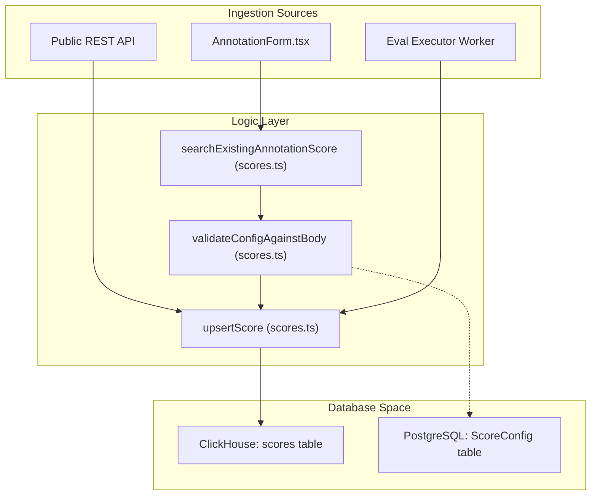
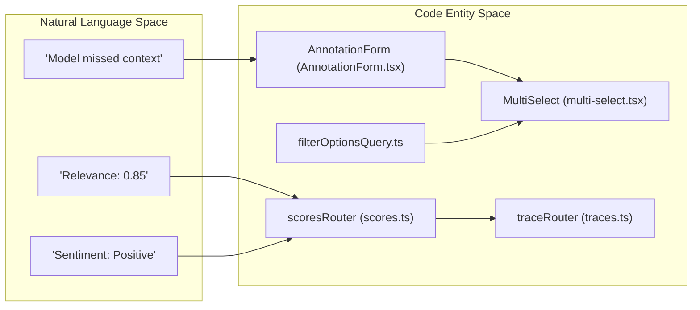

This page documents the scoring system in Langfuse: the score data model, creation flows (API, manual annotation, and automated evaluators), the ClickHouse repository layer, tRPC routers, and the UI components used for display and aggregation.

---

## Score Data Model

A score is a named measurement attached to a **trace**, **observation**, **session**, or **dataset run**. Scores are primarily stored in ClickHouse as `ScoreRecordReadType` rows and are converted to `ScoreDomain` objects for application use.

### Score Fields

| Field | Type | Description |
|---|---|---|
| `id` | string | UUID [packages/shared/src/server/repositories/scores.ts:149-149]() |
| `project_id` | string | Owning project [packages/shared/src/server/repositories/scores.ts:149-149]() |
| `timestamp` | DateTime64(3) | When the score was created [packages/shared/src/server/repositories/scores.ts:149-149]() |
| `trace_id` | string? | Associated trace [packages/shared/src/server/repositories/scores.ts:82-82]() |
| `observation_id` | string? | Associated observation (sub-span) [packages/shared/src/server/repositories/scores.ts:83-83]() |
| `session_id` | string? | Associated session [packages/shared/src/server/repositories/scores.ts:84-84]() |
| `name` | string | Score name (e.g. `relevance`) [packages/shared/src/server/repositories/scores.ts:149-149]() |
| `value` | float? | Numeric value for `NUMERIC` or `BOOLEAN` scores [packages/shared/src/server/repositories/scores.ts:82-82]() |
| `string_value` | string? | String value for `CATEGORICAL` scores [packages/shared/src/server/repositories/scores.ts:82-82]() |
| `data_type` | enum | `NUMERIC`, `BOOLEAN`, `CATEGORICAL` [packages/shared/src/domain/scores.ts:2-10]() |
| `source` | enum | `ANNOTATION`, `API`, `EVAL` [packages/shared/src/domain/scores.ts:4-4]() |
| `config_id` | string? | Reference to a `ScoreConfig` in PostgreSQL [packages/shared/src/server/repositories/scores.ts:69-69]() |
| `metadata` | map | Arbitrary key-value metadata [packages/shared/src/server/repositories/scores.ts:210-222]() |

### Data Types

| `data_type` | Description |
|---|---|
| `NUMERIC` | Numeric score (e.g. 0–1 range) [packages/shared/src/domain/scores.ts:2-10]() |
| `BOOLEAN` | Boolean score (stored as 0 or 1) [packages/shared/src/domain/scores.ts:2-10]() |
| `CATEGORICAL` | Named category (e.g. `positive`) [packages/shared/src/domain/scores.ts:2-10]() |

Langfuse also supports a special `CORRECTION` score name, which represents human corrections to model outputs [web/src/server/api/routers/scores.ts:34-34](). `AGGREGATABLE_SCORE_TYPES` specifically includes `NUMERIC`, `BOOLEAN`, and `CATEGORICAL` [packages/shared/src/domain/scores.ts:5-6]().

Sources: [packages/shared/src/server/repositories/scores.ts:1-150](), [packages/shared/src/domain/scores.ts:1-10](), [web/src/server/api/routers/scores.ts:32-35]()

---

## Score Configurations (ScoreConfig)

`ScoreConfig` objects define the schema and constraints for scores. They are stored in PostgreSQL and used to validate score creation in the UI.

The `validateConfigAgainstBody` function ensures that incoming score data adheres to the defined `ScoreConfig` (e.g., checking if a numeric value is within the `minValue` and `maxValue` range) [web/src/server/api/routers/scores.ts:64-64](). In the UI, the `AnnotationForm` component dynamically adjusts its inputs based on the configuration, providing sliders for numeric types and category selectors for categorical types [web/src/features/scores/components/AnnotationForm.tsx:209-230]().

Sources: [web/src/server/api/routers/scores.ts:64-64](), [web/src/features/scores/components/AnnotationForm.tsx:1-230]()

---

## Score Storage (ClickHouse Repository)

Scores are persisted in ClickHouse. The repository layer provides high-level functions to interact with the `scores` table.

**Score Persistence Diagram**

Sources: [packages/shared/src/server/repositories/scores.ts:151-166](), [web/src/server/api/routers/scores.ts:57-65]()

### Key Repository Functions

| Function | Description |
|---|---|
| `upsertScore` | Writes a score record to ClickHouse. Requires `id`, `project_id`, `name`, and `timestamp` [packages/shared/src/server/repositories/scores.ts:151-166](). |
| `getScoreById` | Fetches a single score by its UUID [packages/shared/src/server/repositories/scores.ts:116-131](). |
| `getScoresForTraces` | Retrieves scores for a list of trace IDs, with an optional lookback interval defined by `SCORE_TO_TRACE_OBSERVATIONS_INTERVAL` [packages/shared/src/server/repositories/scores.ts:168-182](). |
| `getScoresForSessions` | Retrieves scores associated with specific session IDs [packages/shared/src/server/repositories/scores.ts:224-250](). |
| `searchExistingAnnotationScore` | Used to find an existing manual annotation for a specific object (trace/observation/session) and name to allow updates instead of duplicates [packages/shared/src/server/repositories/scores.ts:63-114](). |

Sources: [packages/shared/src/server/repositories/scores.ts:63-250]()

---

## tRPC Scores Router (`scoresRouter`)

The `scoresRouter` in `web/src/server/api/routers/scores.ts` exposes scoring functionality to the frontend.

### Procedures

*   **`all`**: Fetches a paginated list of scores. It enriches the ClickHouse data with metadata from PostgreSQL, such as `authorUserName` from the `User` table and `jobConfigurationId` from `JobExecution` [web/src/server/api/routers/scores.ts:107-168]().
*   **`allFromEvents`**: A v4 procedure that retrieves scores from the events table, designed for higher performance in large datasets [web/src/server/api/routers/scores.ts:211-260]().
*   **`byId`**: Returns a single score, stringifying its metadata for client consumption [web/src/server/api/routers/scores.ts:169-188]().
*   **`countAll`**: Returns the total count of scores matching specific filters [web/src/server/api/routers/scores.ts:189-207]().

Sources: [web/src/server/api/routers/scores.ts:107-260]()

---

## Score Aggregation & Metrics

Scores are aggregated across traces and sessions to provide performance metrics.

### Traces Table Aggregation
The `getTracesTableMetrics` function calculates average scores for traces. It returns a `scores_avg` array containing `{ name, avg_value }` for each unique score name associated with the trace [packages/shared/src/server/services/traces-ui-table-service.ts:147-161]().

### Sessions Table Aggregation
The `getSessionsWithMetrics` function calculates session-level score aggregates. It computes `scores_avg` and `score_categories` for all traces within a session, enabling users to see the overall quality of a session [packages/shared/src/server/services/sessions-ui-table-service.ts:88-112]().

Sources: [packages/shared/src/server/services/traces-ui-table-service.ts:65-161](), [packages/shared/src/server/services/sessions-ui-table-service.ts:19-112]()

---

## UI Components & Annotations

Langfuse provides specialized components for manual scoring and viewing aggregated metrics.

**Score Rendering Entity Map**

### Manual Annotation (`AnnotationForm`)
The `AnnotationForm` is used for human-in-the-loop scoring [web/src/features/scores/components/AnnotationForm.tsx:213-230]().
*   **Form Logic**: It utilizes `useForm` with a schema to manage score data [web/src/features/scores/components/AnnotationForm.tsx:226-229]().
*   **Dynamic Inputs**: It renders different fields (sliders, toggles, or text areas) based on the `data_type` defined in the `ScoreConfig` [web/src/features/scores/components/AnnotationForm.tsx:161-171]().

### Filtering and Selection
*   **`MultiSelect`**: A generic component used in filters to select multiple score names or values [web/src/features/filters/components/multi-select.tsx:36-56]().
*   **`filterOptionsQuery`**: Fetches available numeric and categorical score names to populate filter dropdowns in the generations view [web/src/server/api/routers/generations/filterOptionsQuery.ts:68-83]().

Sources: [web/src/features/scores/components/AnnotationForm.tsx:1-230](), [web/src/features/filters/components/multi-select.tsx:36-190](), [web/src/server/api/routers/generations/filterOptionsQuery.ts:68-110]()