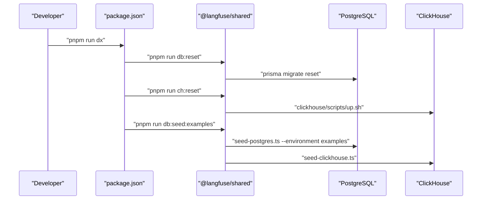
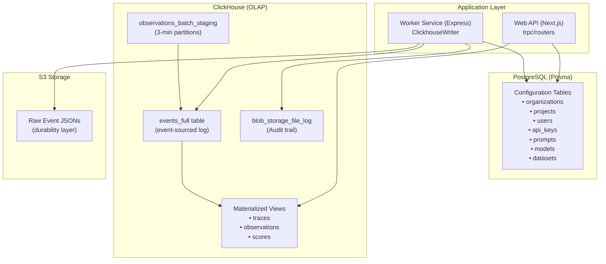
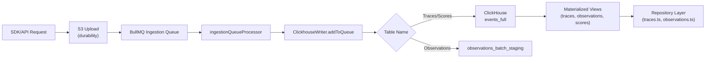
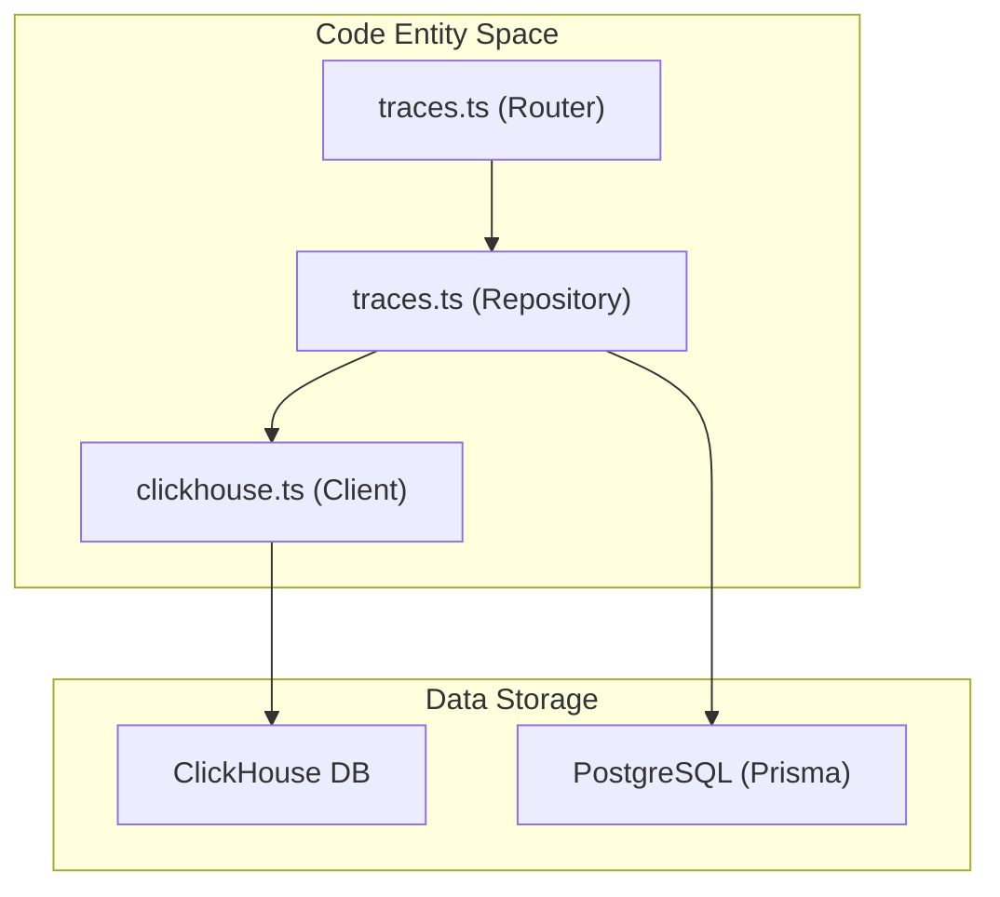

pnpm run db:seed:examples
```

The `SeederOrchestrator` manages data generation across both PostgreSQL and ClickHouse [packages/shared/scripts/seeder/utils/seeder-orchestrator.ts:39-48](). It uses a `DataGenerator` to create synthetic traces, dataset experiments, and evaluation data [packages/shared/scripts/seeder/utils/data-generators.ts:48-57]().

**Diagram: Migration and Seed Flow**



Sources: [package.json:23-25](), [packages/shared/package.json:58-72](), [packages/shared/scripts/seeder/seed-postgres.ts:42-115]()

---

### Starting Development Services

Langfuse uses a dual-service architecture. You can start them individually or together using Turbo.

| Service | Command | Purpose |
| :--- | :--- | :--- |
| **Full Stack** | `pnpm run dev` | Starts web, worker, and shared packages [package.json:31]() |
| **Web Only** | `pnpm run dev:web` | Starts Next.js frontend/API [package.json:33]() |
| **Worker Only** | `pnpm run dev:worker` | Starts BullMQ background worker [package.json:32]() |

The web service runs `next dev` [web/package.json:13](), while the worker service uses `tsx watch` to execute `src/index.ts` [worker/package.json:23]().

---

## Production Deployment

### Docker Image Architecture
Langfuse provides separate Dockerfiles for the web and worker services, both based on `node:24-alpine` [web/Dockerfile:2](), [worker/Dockerfile:2]().

1.  **Web Image**: Uses Next.js standalone output to minimize size [web/Dockerfile:158](). It includes `prisma` for database management and optionally `dd-trace` for Datadog APM [web/Dockerfile:139-145]().
2.  **Worker Image**: Prunes dev dependencies and deploys the production worker payload [worker/Dockerfile:58-65](). It listens on port 3030 [worker/Dockerfile:93-94]().

### Automated Entrypoint Execution
The `entrypoint.sh` scripts handle automatic database migrations and credential validation before starting the services.

*   **Web Entrypoint**: Runs `prisma migrate deploy` and the ClickHouse migration scripts before starting the Next.js server [web/Dockerfile:176]().
*   **Worker Entrypoint**: Prepares the environment and starts the Express-based worker [worker/Dockerfile:98-101]().

**Diagram: Production Service Communication**

```mermaid
graph LR
    subgraph "Application_Layer"
        [Web] --> ["web/dist/server.js (Next.js Standalone)"]
        [Worker] --> ["worker/dist/index.js (Express)"]
    end
    
    subgraph "Storage_Layer"
        [PG] --> ["PostgreSQL (Prisma Client)"]
        [CH] --> ["ClickHouse (@clickhouse/client)"]
        [Redis] --> ["Redis (BullMQ / ioredis)"]
    end
    
    [Web] --> [PG]
    [Web] --> [CH]
    [Web] --> [Redis]
    
    [Worker] --> [PG]
    [Worker] --> [CH]
    [Worker] --> [Redis]
```

Sources: [web/Dockerfile:111-180](), [worker/Dockerfile:67-101](), [web/package.json:127-128](), [worker/package.json:57-63]()

---

## Data Generation Details

The `DataGenerator` class provides methods for creating various types of data for testing and development:

| Method | Purpose | Code Entity |
| :--- | :--- | :--- |
| `generateDatasetRunItem` | Creates items for dataset runs [packages/shared/scripts/seeder/utils/data-generators.ts:79-120]() | `createDatasetRunItem` |
| `generateDatasetTrace` | Creates traces from dataset items for experiment runs [packages/shared/scripts/seeder/utils/data-generators.ts:126-167]() | `createTrace` |
| `generateDatasetObservation` | Creates generations with variable costs/latency [packages/shared/scripts/seeder/utils/data-generators.ts:173-211]() | `createObservation` |
| `createEvaluationData` | Orchestrates evaluation traces and observations [packages/shared/scripts/seeder/utils/seeder-orchestrator.ts:206-213]() | `SeederOrchestrator` |

Sources: [packages/shared/scripts/seeder/utils/data-generators.ts:48-211](), [packages/shared/scripts/seeder/utils/seeder-orchestrator.ts:39-213]()

# Data Architecture


This page describes the dual-database architecture underlying Langfuse's data storage and retrieval systems. It covers the separation between PostgreSQL (metadata/configuration) and ClickHouse (observability events), the event-sourcing pattern for trace data, and the repository layer that abstracts data access.

For information about the ingestion pipeline that feeds data into these databases, see [Data Ingestion Pipeline](#6). For details on the worker queues that process data asynchronously, see [Queue & Worker System](#7).

## Overview

Langfuse employs a **dual-database architecture** that separates concerns between transactional metadata and high-volume observability data. This split enables horizontal scalability for analytics workloads while maintaining ACID guarantees for configuration changes.

### Database Responsibilities

The system architecture bridges the gap between transactional application state and high-throughput analytical events.

**System Components and Data Storage**

Sources: [worker/src/services/ClickhouseWriter/index.ts:51-59](), [packages/shared/src/server/repositories/clickhouse.ts:151-171](), [packages/shared/src/server/repositories/traces.ts:40-41]()

The architecture uses:
- **PostgreSQL**: ACID-compliant storage for user accounts, project configuration, datasets, prompts, and API keys. Managed via Prisma. [packages/shared/src/server/repositories/traces.ts:40-41](), [web/src/features/datasets/server/dataset-router.ts:6-10]()
- **ClickHouse**: Column-oriented database optimized for analytical queries over traces, observations, and scores. [packages/shared/src/server/repositories/clickhouse.ts:119-126](), [worker/src/services/ClickhouseWriter/index.ts:51-59]()
- **Redis**: Used for rate limiting, job queuing via BullMQ, and caching recently processed events to prevent duplicates. [worker/src/queues/ingestionQueue.ts:84-91]()

### Data Flow Pattern

**Data Ingestion and Processing Flow**

Sources: [worker/src/queues/ingestionQueue.ts:135-181](), [worker/src/services/ClickhouseWriter/index.ts:111-132](), [packages/shared/src/server/repositories/clickhouse.ts:119-126]()

## PostgreSQL Schema

PostgreSQL stores configuration, user management, and metadata that requires transactional consistency. The schema is accessed via the Prisma client.

### Core Entity Groups

| Entity Group | Purpose |
|-------------|---------|
| Multi-tenancy | Hierarchical tenant isolation (Organizations, Projects). [web/src/server/api/routers/traces.ts:112-121]() |
| Datasets | Storage for dataset items and golden sets. [web/src/features/datasets/server/dataset-router.ts:154-161]() |
| Prompts | Versioned prompt management. [web/src/features/datasets/server/dataset-router.ts:68]() |
| Evaluations | Job configurations and execution tracking. [web/src/server/api/routers/scores.ts:124-137]() |

Sources: [web/src/features/datasets/server/dataset-router.ts:6-10](), [web/src/server/api/routers/scores.ts:124-137]()

## ClickHouse Schema

ClickHouse stores all observability data in an event-sourced architecture, optimized for analytical queries over high-cardinality dimensions.

### Events Table Structure

The `events_full` table is the primary destination for tracing data. It stores immutable event records. To maintain an audit trail for data retention and deletions, Langfuse also maintains a `blob_storage_file_log` table in ClickHouse. [worker/src/queues/ingestionQueue.ts:59-81](), [packages/shared/src/server/repositories/clickhouse.ts:148-171]()

### Batch Writing and Retries

The `ClickhouseWriter` class implements a singleton pattern to manage high-throughput writes. It buffers records in memory and flushes them to ClickHouse based on batch size or time intervals. [worker/src/services/ClickhouseWriter/index.ts:32-61]()

Key features include:
- **Batching**: Configurable via `LANGFUSE_INGESTION_CLICKHOUSE_WRITE_BATCH_SIZE`. [worker/src/services/ClickhouseWriter/index.ts:44-45]()
- **Error Handling**: Detects retryable network errors (e.g., "socket hang up") and Node.js "invalid string length" errors, implementing exponential backoff or batch splitting. [worker/src/services/ClickhouseWriter/index.ts:134-141](), [worker/src/services/ClickhouseWriter/index.ts:172-206]()
- **Size Management**: Handles oversized records by truncating fields to prevent write failures. [worker/src/services/ClickhouseWriter/index.ts:208-213]()

## Repository Pattern

The repository layer abstracts ClickHouse query construction and provides a bridge between raw database rows and application-level domain objects.

### Repository Architecture

Sources: [packages/shared/src/server/repositories/traces.ts:1-40](), [web/src/server/api/routers/traces.ts:30-53](), [packages/shared/src/server/repositories/clickhouse.ts:1-10]()

### Core Repository Functions

- **Standardized Access**: Functions like `queryClickhouse`, `upsertClickhouse`, and `queryClickhouseStream` provide a consistent interface. [packages/shared/src/server/repositories/clickhouse.ts:1-7]()
- **Trace Management**: `upsertTrace` and `checkTraceExistsAndGetTimestamp` handle the lifecycle of trace records in ClickHouse. [packages/shared/src/server/repositories/traces.ts:58-72](), [packages/shared/src/server/repositories/traces.ts:198-204]()
- **Observation Management**: `getObservationsForTrace` retrieves hierarchical span data, with built-in size limits to prevent memory exhaustion during parsing. [packages/shared/src/server/repositories/observations.ts:135-144](), [packages/shared/src/server/repositories/observations.ts:206-231]()
- **Score Management**: `searchExistingAnnotationScore` and `getScoresForTraces` allow retrieving score data linked to traces or sessions. [packages/shared/src/server/repositories/scores.ts:63-71](), [packages/shared/src/server/repositories/scores.ts:168-182]()
- **Query Optimization**: Repositories use CTEs for complex aggregations (e.g., calculating latency and cost across observations for a trace). [packages/shared/src/server/repositories/traces.ts:102-126]()
- **Conditional Lookups**: The system determines whether to query ClickHouse or PostgreSQL based on the requested filters. For example, `requiresClickhouseLookups` checks if filter columns belong to ClickHouse-backed metrics. [web/src/features/datasets/server/dataset-router.ts:107-115]()

---

**For details, see:**
- [Database Overview](#3.1) — Purpose of PostgreSQL, ClickHouse, and Redis.
- [PostgreSQL Schema](#3.2) — Prisma models for Organizations, Projects, and Users.
- [ClickHouse Schema](#3.3) — Document the events table structure, materialized views for traces/observations/scores, and partitioning strategy.
- [Events Table & Dual-Write Architecture](#3.4) — Explain the event-sourcing pattern, direct write path vs staging table path, and how SDK versions determine routing.
- [Repository Pattern](#3.5) — Describe the repository layer that abstracts ClickHouse queries for traces, observations, scores, and sessions.
- [Query Optimization](#3.6) — Cover CTEs for complex aggregations, filter optimization, conditional ClickHouse lookups, and query performance patterns.