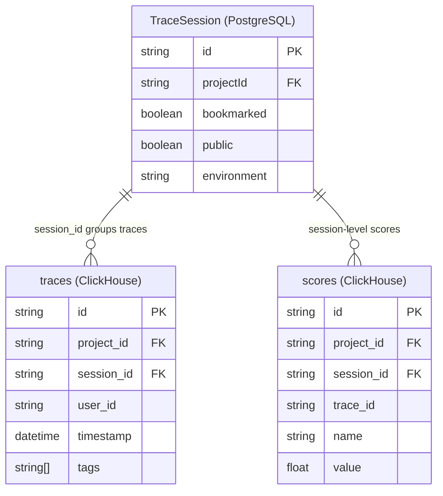
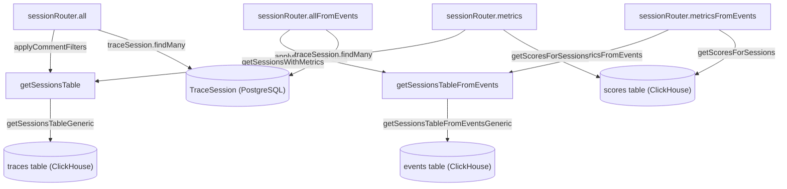
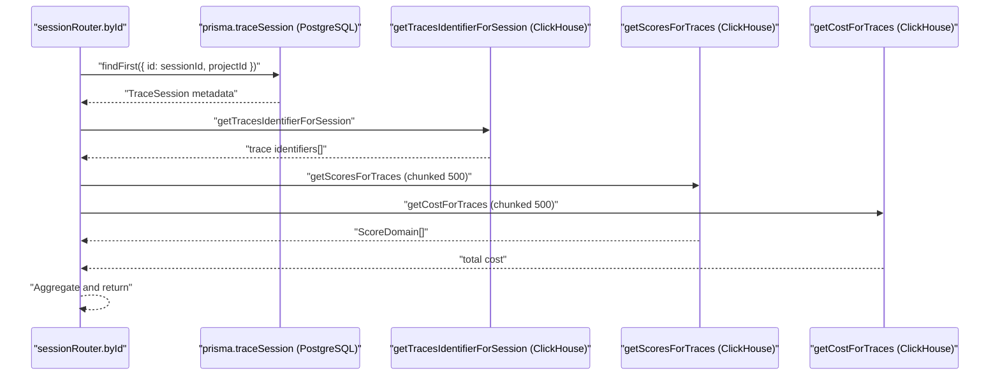
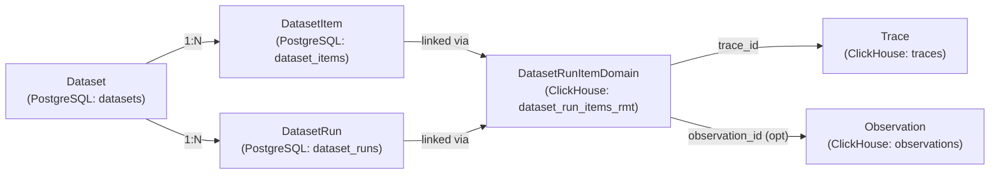
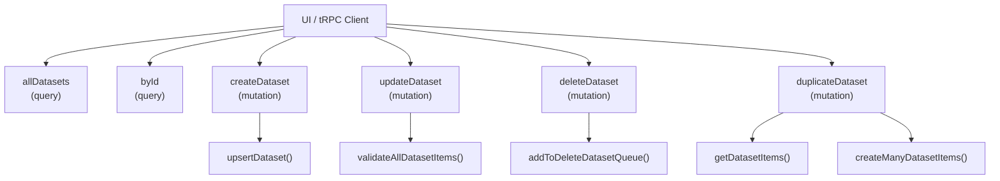
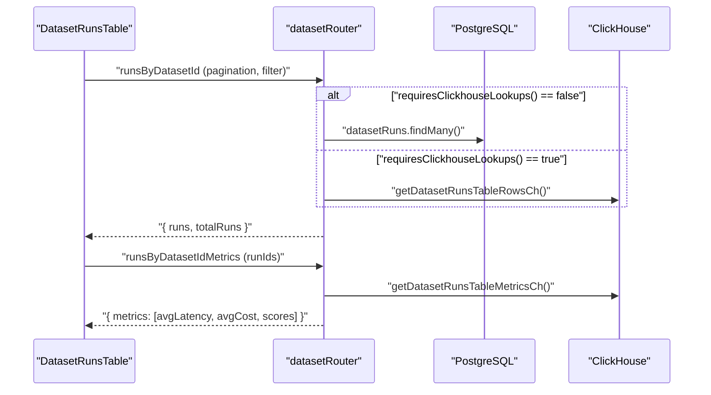

This page documents the session concept in Langfuse: how traces are grouped into sessions, the dual-database storage model, the service layer that queries session data, and the tRPC and public API endpoints. For trace and observation internals, see [9.1](). For the scores that can be attached to sessions, see [9.2](). For the events table architecture that backs the `*FromEvents` query variants, see [3.4]().

---

## What Is a Session?

A **session** is a grouping of one or more traces that share the same `session_id` string. There is no separate ClickHouse table for sessions; a session is a logical entity derived by grouping rows in the `traces` table or the `events` table. Mutable session metadata (bookmarked, public) is stored in a PostgreSQL `TraceSession` record.

**Session data model across both stores:**

| Field | Store | Notes |
|---|---|---|
| `id` / `session_id` | PostgreSQL (`TraceSession`) + ClickHouse (derived) | The grouping key on `traces.session_id` |
| `bookmarked` | PostgreSQL `TraceSession` | User-defined bookmark flag |
| `public` | PostgreSQL `TraceSession` | Controls public share access |
| `environment` | PostgreSQL `TraceSession` | Denormalized from traces |
| `createdAt`, `updatedAt` | PostgreSQL `TraceSession` | Managed by Prisma |
| Aggregated metrics | ClickHouse (computed at query time) | Trace count, user IDs, tags, cost, token usage, duration |
| Scores | ClickHouse `scores` table | Scores referencing `session_id` directly |

Traces are associated with a session at ingestion time by setting `session_id` on the trace event. The `TraceSession` row in PostgreSQL is created by the ingestion pipeline (see [6.3]()).

**Entity relationship:**

Sources: [web/src/server/api/routers/sessions.ts:71-149](), [packages/shared/src/server/repositories/scores.ts:221-260]()

---

## Session Table Services

Session list queries are served by two parallel service implementations: the original **traces-table** path and a newer **events-table** path (v4 architecture). Both expose the same logical interface and are selected at the tRPC router level based on feature flags or versioning.

### Traces-Table Service (`sessions-ui-table-service.ts`)

`getSessionsTableGeneric` is the internal workhorse function with three `select` modes:

| Mode | Returns | Called by |
|---|---|---|
| `"count"` | `{ count: string }` | `getSessionsTableCount` [packages/shared/src/server/services/sessions-ui-table-service.ts:45-63]() |
| `"rows"` | `SessionDataReturnType` | `getSessionsTable` [packages/shared/src/server/services/sessions-ui-table-service.ts:65-86]() |
| `"metrics"` | `SessionWithMetricsReturnType` | `getSessionsWithMetrics` [packages/shared/src/server/services/sessions-ui-table-service.ts:88-112]() |

The SQL query groups traces by `session_id` using CTEs:
- `deduplicated_traces` — deduplicates the `traces` ClickHouse table.
- `observations_stats` — joined when metrics are requested, aggregates cost, tokens, and duration across observations.
- `scores_agg` — joined when score columns are filtered or ordered.

**`SessionDataReturnType` fields:**
`session_id`, `max_timestamp`, `min_timestamp`, `trace_ids`, `user_ids`, `trace_count`, `trace_tags`, `trace_environment`, `scores_avg`, `score_categories` [packages/shared/src/server/services/sessions-ui-table-service.ts:19-30]().

Sources: [packages/shared/src/server/services/sessions-ui-table-service.ts:19-43](), [packages/shared/src/server/services/sessions-ui-table-service.ts:126-250]()

### Events-Table Service (`sessions-ui-table-events-service.ts`)

This service uses the `events` ClickHouse table via composable query builders. It replaces direct `traces` table scans with pre-aggregated event data.

Key functions:
- `getSessionsTableFromEvents`: List sessions using `eventsSessionsAggregation` CTE [web/src/server/api/routers/sessions.ts:31-31]().
- `getSessionsTableCountFromEvents`: Count sessions from events [web/src/server/api/routers/sessions.ts:32-32]().
- `getSessionTracesFromEvents`: Get individual traces for a session using `eventsTracesAggregation` [web/src/server/api/routers/sessions.ts:34-34]().

Sources: [web/src/server/api/routers/sessions.ts:31-34]()

### Query Architecture Diagram

**Session list query paths — data flow and code entities:**

Sources: [web/src/server/api/routers/sessions.ts:170-232](), [web/src/server/api/routers/sessions.ts:233-294](), [packages/shared/src/server/services/sessions-ui-table-service.ts:65-112]()

---

## tRPC Session Router

The `sessionRouter` is defined in `web/src/server/api/routers/sessions.ts` and handles session lifecycle and retrieval.

### Procedure Reference

| Procedure | Type | Key behavior |
|---|---|---|
| `hasAny` | query | `hasAnySession(projectId)` — checks ClickHouse `traces` table [web/src/server/api/routers/sessions.ts:152-160](). |
| `hasAnyFromEvents` | query | `hasAnySessionFromEventsTable(projectId)` — checks events table [web/src/server/api/routers/sessions.ts:161-169](). |
| `all` | query | Applies comment filters + `getSessionsTable`; merges bookmarked/public from PostgreSQL [web/src/server/api/routers/sessions.ts:170-232](). |
| `allFromEvents` | query | Same logic using `getSessionsTableFromEvents` [web/src/server/api/routers/sessions.ts:233-294](). |
| `byId` | query | `handleGetSessionById`: PostgreSQL lookup + `getTracesIdentifierForSession` + scores + costs [web/src/server/api/routers/sessions.ts:71-149](). |

### `handleGetSessionById` Internals

The `handleGetSessionById` helper function implements the dual-database fetch pattern:

Traces are chunked into groups of 500 before querying scores and costs to avoid ClickHouse parameter size limits [web/src/server/api/routers/sessions.ts:97-124]().

---

## Trace and Score Repository Integration

The session feature relies on specialized repository functions to bridge trace and score data:

| Function | File | Purpose |
|---|---|---|
| `getTracesIdentifierForSession` | `packages/shared/src/server/repositories/index.ts` (Imported) | Fetch identifiers for traces in a session [web/src/server/api/routers/sessions.ts:92-95](). |
| `getScoresForSessions` | `packages/shared/src/server/repositories/scores.ts` | Fetch scores where `session_id IN (...)` from the `scores` table [packages/shared/src/server/repositories/scores.ts:221-260](). |
| `searchExistingAnnotationScore` | `packages/shared/src/server/repositories/scores.ts` | Finds existing human annotations for a session to prevent duplicates [packages/shared/src/server/repositories/scores.ts:60-111](). |

`getScoresForSessions` specifically filters the `scores` table by `session_id` and `data_type` using `LISTABLE_SCORE_TYPES` [packages/shared/src/server/repositories/scores.ts:245]().

---

## Session Metrics and Aggregation

Session-level metrics are aggregated across all associated traces and observations.

- **Usage and Cost**: Aggregated in `getSessionsWithMetrics` via the `metrics` select mode which returns `session_usage_details`, `session_cost_details`, and totals [packages/shared/src/server/services/sessions-ui-table-service.ts:88-112]().
- **Scores**: Categorical and numeric scores are grouped by name for session-level analysis [web/src/server/api/routers/sessions.ts:46-47]().
- **Duration**: Calculated as a `duration` field in ClickHouse representing the delta between trace timestamps or observation boundaries within the session [packages/shared/src/server/services/sessions-ui-table-service.ts:34]().

Sources: [packages/shared/src/server/services/sessions-ui-table-service.ts:19-43](), [web/src/server/api/routers/sessions.ts:101-124]()

# Datasets & Experiments

This page covers the dataset management system in Langfuse: how datasets and their items are created and managed, how experiments (dataset runs) are executed and compared, and the API surface that supports these operations. For prompt management and linking prompts to experiments, see [9.5](). For the automated evaluation system that scores dataset runs, see [10]().

---

## Overview

A **dataset** is a named collection of input/output example pairs (`DatasetItem`s). Each item can optionally be linked back to the trace or observation it was derived from. An **experiment** is a `DatasetRun`: a named execution of a model or pipeline over a dataset where each item's processing produces a trace that is recorded as a `DatasetRunItem`. Multiple runs over the same dataset can then be compared on latency, cost, and score dimensions.

### Entity Relationship Diagram
This diagram bridges the natural language concepts to the specific code entities and database tables used in the implementation.

Sources: [web/src/features/datasets/server/dataset-router.ts:1-80](), [packages/shared/src/server/repositories/dataset-run-items.ts:1-100](), [packages/shared/src/server/repositories/dataset-items.ts:1-18]()

---

## Data Model

### PostgreSQL Entities
The metadata and configuration for datasets are stored in PostgreSQL via Prisma [packages/shared/src/server/repositories/dataset-items.ts:1-18]().

| Entity | Table | Key Fields |
|---|---|---|
| `Dataset` | `datasets` | `id`, `projectId`, `name`, `description`, `metadata`, `inputSchema`, `expectedOutputSchema`, `sortPriority` |
| `DatasetItem` | `dataset_items` | `id`, `projectId`, `datasetId`, `input`, `expectedOutput`, `metadata`, `sourceTraceId`, `sourceObservationId`, `status`, `validFrom` |
| `DatasetRun` | `dataset_runs` | `id`, `projectId`, `datasetId`, `name`, `description`, `metadata` |

`DatasetItem.validFrom` is a timestamp used for point-in-time versioning: querying items at a specific `version` date returns the state of the dataset as it existed at that moment [packages/shared/src/server/repositories/dataset-items.ts:132-135]().

`DatasetItem.status` is an enum of `ACTIVE` or `ARCHIVED`. Archived items are excluded from new experiment runs but remain queryable [packages/shared/src/server/repositories/dataset-items.ts:129]().

### ClickHouse Entity
`dataset_run_items_rmt` (ReplicatedMergeTree) stores the linkage between experiment runs and the traces/observations produced. It drives all latency, cost, and score aggregations for the experiment comparison view [packages/shared/src/server/repositories/dataset-run-items.ts:200-227]().

| Field | Description |
|---|---|
| `project_id` | Project scope |
| `dataset_id` | Parent dataset |
| `dataset_run_id` | Which run this item belongs to |
| `dataset_run_name` | Name of the run for UI display |
| `dataset_item_id` | Which dataset item was used |
| `trace_id` | Resulting trace in ClickHouse |
| `observation_id` | Optional observation within the trace |
| `dataset_run_created_at` | Timestamp of the run |

Sources: [packages/shared/src/server/repositories/dataset-run-items.ts:89-155](), [packages/shared/src/server/repositories/dataset-items.ts:123-157](), [worker/src/services/ClickhouseWriter/index.ts:57]()

---

## Folder Support

Datasets support hierarchical organization using `/` as a path separator in the dataset name (e.g., `experiments/qa/v2`). The `allDatasets` tRPC procedure uses Common Table Expressions (CTEs) in PostgreSQL to present a virtual folder tree at each path level. The `generateDatasetQuery` function in the router builds these CTEs dynamically [web/src/features/datasets/server/dataset-router.ts:143-213]().

- **Root level:** Returns individual datasets whose names contain no `/`, plus one representative row per unique top-level folder prefix [web/src/features/datasets/server/dataset-router.ts:154-161]().
- **Inside a folder (pathPrefix set):** Returns datasets whose relative name contains no further `/`, plus representatives for any deeper subfolders [web/src/features/datasets/server/dataset-router.ts:174-213]().

The search logic uses `ILIKE` for case-insensitive filtering [web/src/features/datasets/server/dataset-router.ts:89]() and `LIKE` with escaped path prefixes for folder isolation [web/src/features/datasets/server/dataset-router.ts:98]().

Sources: [web/src/features/datasets/server/dataset-router.ts:86-272]()

---

## tRPC API (`datasetRouter`)

Internal UI communication goes through `datasetRouter` in [web/src/features/datasets/server/dataset-router.ts](). Every procedure is a `protectedProjectProcedure`, requiring authenticated project access.

### Dataset CRUD Logic

### Key Procedures

| Procedure | Type | Description |
|---|---|---|
| `itemsByDatasetId` | query | Paginated item list with filter, search, and version support [web/src/features/datasets/server/dataset-router.ts:335]() |
| `listDatasetVersions` | query | All distinct version timestamps for a dataset [web/src/features/datasets/server/dataset-router.ts:468]() |
| `runsByDatasetId` | query | Paginated run list. Uses PostgreSQL or ClickHouse based on `requiresClickhouseLookups` [web/src/features/datasets/server/dataset-router.ts:553]() |
| `runsByDatasetIdMetrics` | query | Latency, cost, and score aggregates per run from ClickHouse [web/src/features/datasets/server/dataset-router.ts:608]() |
| `deleteDatasetRuns` | mutation | Batch delete runs from both PG and CH [web/src/features/datasets/server/dataset-router.ts:771]() |

Sources: [web/src/features/datasets/server/dataset-router.ts:274-1200](), [web/src/features/datasets/server/service.ts:1-233]()

---

## Ingestion & ClickHouse Writing

Dataset Run Items are ingested via the standard ingestion pipeline but routed to the ClickHouse `dataset_run_items` table.

### ClickhouseWriter
The `ClickhouseWriter` singleton manages buffered writes to ClickHouse to ensure high throughput and reliability [worker/src/services/ClickhouseWriter/index.ts:32-78]().

- **Batching:** Flushes queues based on `LANGFUSE_INGESTION_CLICKHOUSE_WRITE_BATCH_SIZE` or `LANGFUSE_INGESTION_CLICKHOUSE_WRITE_INTERVAL_MS` [worker/src/services/ClickhouseWriter/index.ts:44-45]().
- **Error Handling:** Implements retries for network issues and handles JS string length errors by splitting batches [worker/src/services/ClickhouseWriter/index.ts:134-206]().
- **Data Flow:** Ingestion events (like `dataset-run-item-create`) are processed in the `ingestionQueue` [worker/src/queues/ingestionQueue.ts:29-36](), which downloads payloads from S3 and adds them to the `ClickhouseWriter` queue [worker/src/queues/ingestionQueue.ts:60-81]().

Sources: [worker/src/services/ClickhouseWriter/index.ts:1-212](), [worker/src/queues/ingestionQueue.ts:1-180]()

---

## Dataset Items

### Schema Validation
Datasets can define `inputSchema` and `expectedOutputSchema` (JSON Schema). The `DatasetItemValidator` class compiles these schemas once per operation for performance [packages/shared/src/server/repositories/dataset-items.ts:33-36]().

The `NewDatasetItemForm` provides real-time validation using `useDatasetItemValidation` [web/src/features/datasets/components/NewDatasetItemForm.tsx:155-159](). It also generates example JSON placeholders based on the schema via `generateSchemaExample` [web/src/features/datasets/components/NewDatasetItemForm.tsx:172-215]().

### Versioning
Versioning is tracked via the `validFrom` timestamp.
- `listDatasetVersions`: Returns all distinct `validFrom` timestamps [packages/shared/src/server/repositories/dataset-items.ts:468]().
- `getDatasetItemById` with `version`: Returns the state of an item as it existed at that point in time [packages/shared/src/server/repositories/dataset-items.ts:111-159]().
- The UI allows browsing and selecting historical versions via the `useDatasetVersion` hook in `DatasetItemsTable` [web/src/features/datasets/components/DatasetItemsTable.tsx:86-101]().

Sources: [packages/shared/src/server/repositories/dataset-items.ts:49-217](), [web/src/features/datasets/components/NewDatasetItemForm.tsx:40-215](), [web/src/features/datasets/components/DatasetItemsTable.tsx:144-217]()

---

## Experiments (Dataset Runs)

### Metrics Pipeline
Run metrics are fetched in separate calls to avoid blocking the main UI on slow ClickHouse aggregations.

The ClickHouse metrics query in `getDatasetRunsTableInternal` uses a chain of CTEs to aggregate scores and compute latency/cost from observations [packages/shared/src/server/repositories/dataset-run-items.ts:231-255]().

### Compare View
The compare view uses `enrichAndMapToDatasetItemId` to build a matrix of dataset items vs. experiment runs [web/src/features/datasets/server/service.ts:199-233](). This service:
1. Groups run items by run ID [web/src/features/datasets/server/service.ts:204]().
2. Enriches them with scores and latency in parallel via `getRunItemsByRunIdOrItemId` [web/src/features/datasets/server/service.ts:207-218]().
3. Maps them back to `datasetItemId` for the side-by-side UI [web/src/features/datasets/server/service.ts:223-230]().

`getRunItemsByRunIdOrItemId` calculates recursive metrics (latency/cost) for observation-level run items using `calculateRecursiveMetricsForRunItems` [web/src/features/datasets/server/service.ts:137-140]().

Sources: [web/src/features/datasets/server/service.ts:95-233](), [packages/shared/src/server/repositories/dataset-run-items.ts:231-255](), [web/src/features/datasets/components/DatasetRunsTable.tsx:116-127]()

---

## UI Architecture

The UI is organized around specialized tables for Datasets, Items, and Runs.

| Component | File | Responsibility |
|---|---|---|
| `DatasetItemsTable` | `DatasetItemsTable.tsx` | Item listing, version selection, and source trace linking [web/src/features/datasets/components/DatasetItemsTable.tsx:54]() |
| `DatasetRunsTable` | `DatasetRunsTable.tsx` | Experiment metrics, comparison selection, and deletion [web/src/features/datasets/components/DatasetRunsTable.tsx:181]() |
| `NewDatasetItemForm` | `NewDatasetItemForm.tsx` | JSON editor for items with schema validation and example generation [web/src/features/datasets/components/NewDatasetItemForm.tsx:105]() |

### Experiment Management
Experiments can be created via `CreateExperimentsForm` [web/src/pages/project/[projectId]/datasets/[datasetId]/index.tsx:25](). The page supports an "Experiments Beta" switch which toggles between the legacy run list and the new experiments table [web/src/pages/project/[projectId]/datasets/[datasetId]/index.tsx:160-165]().

Sources: [web/src/features/datasets/components/DatasetItemsTable.tsx](), [web/src/features/datasets/components/DatasetRunsTable.tsx](), [web/src/pages/project/[projectId]/datasets/[datasetId]/index.tsx:46-168]()