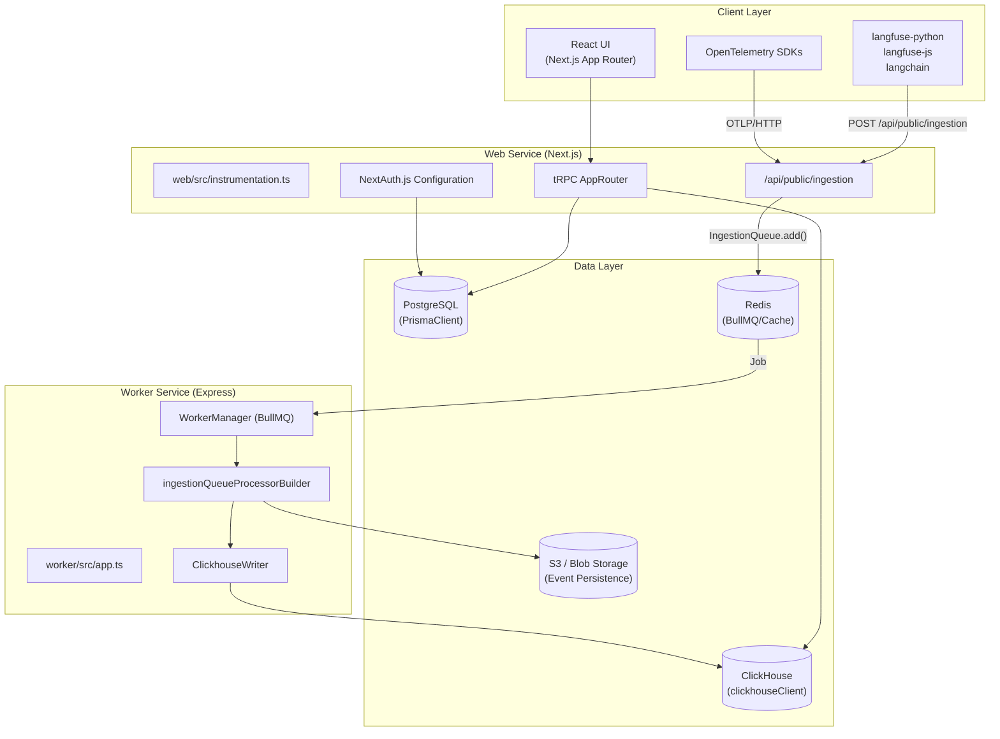
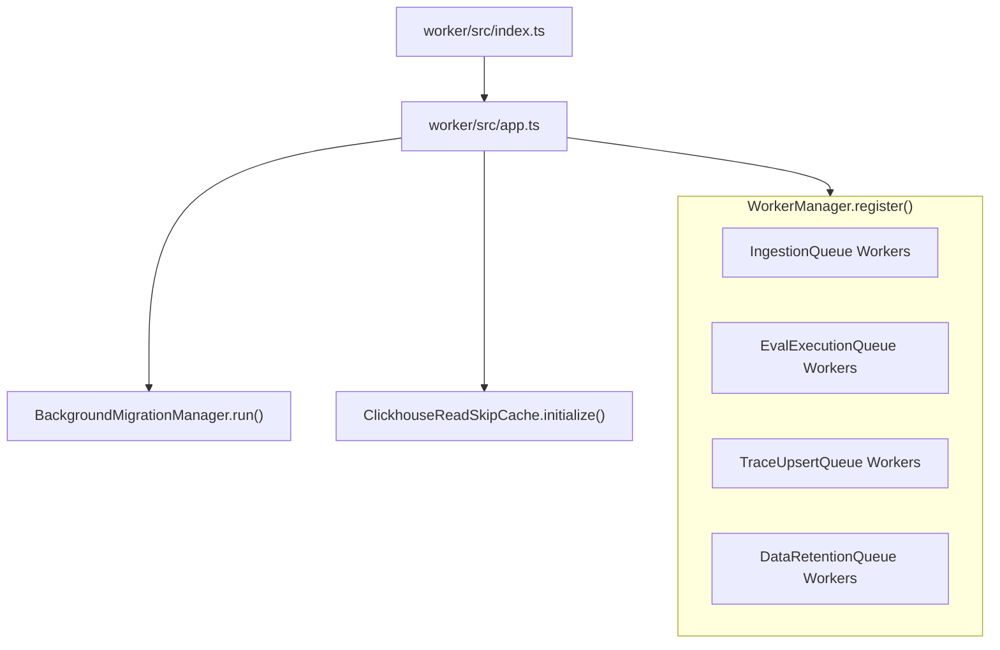

This document describes the overall system architecture of Langfuse, including the core services, data layer, communication patterns, and deployment architecture.

## Architecture Overview

Langfuse implements a **dual-service monorepo architecture** separating synchronous user-facing operations from intensive asynchronous processing. The **Web Service** (`web/`) is a Next.js application that handles the React UI and API ingestion, while the **Worker Service** (`worker/`) is an Express-based service dedicated to background job processing via BullMQ. Both services leverage a shared core logic layer in `packages/shared/`.

**High-Level System Diagram**

**Key Architectural Decisions:**

| Decision | Rationale | Implementation |
|----------|-----------|----------------|
| **Service Separation** | Isolate resource-intensive background tasks (evals, trace reconstruction) from user requests. | `web/` and `worker/` packages [worker/src/app.ts:95-107]() |
| **Shared Package** | Centralize DB schemas, environment validation, and core logic. | `@langfuse/shared` workspace [packages/shared/package.json:2-3]() |
| **Dual Database** | PostgreSQL for relational metadata; ClickHouse for high-throughput OLAP tracing data. | Prisma + ClickHouse Client [packages/shared/src/env.ts:74-80]() |
| **S3-First Ingestion** | Ensure durability of raw events before processing and allow for replay. | `LANGFUSE_S3_EVENT_UPLOAD_BUCKET` usage [packages/shared/src/env.ts:166]() |
| **Queue Sharding** | Enable horizontal scaling of workers by sharding BullMQ queues. | `LANGFUSE_INGESTION_QUEUE_SHARD_COUNT` [packages/shared/src/env.ts:103]() |

**Sources:**
- [worker/src/app.ts:95-107]()
- [packages/shared/package.json:1-13]()
- [packages/shared/src/env.ts:74-103]()

## Core Services

### Web Service

The Web Service handles the frontend UI, authentication, and the initial ingestion of tracing data. It is built with Next.js and uses `tRPC` for type-safe communication between the client and server.

**Core Code Components:**

| Component | Code Entity | Purpose |
|-----------|-------------|---------|
| **Ingestion API** | `/api/public/ingestion` | Primary entry point for SDKs to send tracing events. |
| **Internal API** | `AppRouter` | tRPC router for the Langfuse dashboard. |
| **Instrumentation** | `web/src/instrumentation.ts` | OpenTelemetry and Sentry setup for the web process [web/package.json:49-64](). |
| **Auth** | `next-auth` | Handles SSO, email/password, and RBAC [web/package.json:128](). |
| **Middleware** | `middleware.ts` | Edge-side routing and auth checks (often removed in self-hosted) [web/Dockerfile:98](). |

### Worker Service

The Worker Service is a long-running Express process that initializes queue consumers. It handles complex logic such as calculating LLM costs, running automated evaluations, and propagating events to ClickHouse.

**Service Initialization Flow**

**Critical Service Components:**

| Component | Code Entity | Purpose |
|-----------|-------------|---------|
| **Worker Manager** | `WorkerManager` | Central registry for BullMQ workers with standardized metrics [worker/src/app.ts:24]() |
| **Background Migrations** | `BackgroundMigrationManager` | Manages long-running data migrations without blocking the main process [worker/src/app.ts:48]() |
| **Clickhouse Cache** | `ClickhouseReadSkipCache` | Caches project metadata to skip redundant ClickHouse reads during ingestion [worker/src/app.ts:50]() |
| **Queue Sharding** | `TraceUpsertQueue.getShardNames()` | Dynamically registers workers for all configured queue shards [worker/src/app.ts:127-136]() |

**Sources:**
- [worker/src/app.ts:1-136]()
- [worker/src/index.ts:1-10]()
- [worker/package.json:31-69]()

## Data Layer

Langfuse utilizes a specialized stack to balance transactional integrity with analytical performance.

### PostgreSQL (Metadata)
PostgreSQL serves as the source of truth for all relational data.
- **ORM:** Prisma [packages/shared/package.json:94]().
- **Entities:** Organizations, Projects, Users, API Keys, Dataset items, and Prompt versions.
- **Migration:** Managed via Prisma Migrate [packages/shared/package.json:58-62]().

### ClickHouse (Analytics & Traces)
ClickHouse is the primary store for high-volume observability data.
- **Client:** `@clickhouse/client` [packages/shared/package.json:85]().
- **Optimization:** Supports `ASYNC_INSERT` to handle high write pressure and lightweight updates for score/trace modifications [packages/shared/src/env.ts:84-93]().
- **Clustering:** Supports clustered deployments via `CLICKHOUSE_CLUSTER_NAME` [packages/shared/src/env.ts:77]().

### Redis (Queues & Caching)
Redis acts as the backbone for service coordination.
- **BullMQ:** Manages all job state and concurrency [packages/shared/package.json:103]().
- **Caching:** Stores rate-limiting counters and `ClickhouseReadSkipCache` state [worker/src/app.ts:119]().
- **Configuration:** Supports `REDIS_CLUSTER_ENABLED` and `REDIS_SENTINEL_ENABLED` for high availability [packages/shared/src/env.ts:39-46]().

### S3 / Blob Storage (Durability)
Langfuse uses blob storage (AWS S3, Azure Blob, or Google Cloud Storage) for:
- **Event Persistence:** Raw ingestion batches are saved to S3 before processing [packages/shared/src/env.ts:166]().
- **Batch Exports:** Large CSV/JSONL exports are staged here for user download [worker/src/env.ts:27-28]().
- **Media:** Storage for images or audio associated with generations [packages/shared/src/env.ts:177]().

**Sources:**
- [packages/shared/src/env.ts:13-93]()
- [worker/src/env.ts:41-103]()
- [packages/shared/package.json:78-122]()

## Communication & Ingestion Pipeline

### The Ingestion Flow
1. **Receipt:** The Web service receives a POST request at `/api/public/ingestion`.
2. **Durability:** The raw payload is uploaded to S3 [packages/shared/src/env.ts:166]().
3. **Queueing:** A job containing the S3 reference is added to a shard of the `IngestionQueue` [packages/shared/src/env.ts:103]().
4. **Processing:** A Worker picks up the job, parses the events, applies masking/enrichment, and writes the results to ClickHouse.
5. **Post-Processing:** Successful trace updates trigger the `TraceUpsertQueue` for downstream tasks like automated evaluations [worker/src/app.ts:125-137]().

### Observability
The entire architecture is instrumented for production monitoring:
- **Metrics:** Published to AWS CloudWatch if enabled [packages/shared/src/env.ts:149]().
- **Tracing:** Distributed tracing via OpenTelemetry (`OTEL_EXPORTER_OTLP_ENDPOINT`) [worker/src/env.ts:151-152]().
- **Logging:** Structured JSON logging supported via `LANGFUSE_LOG_FORMAT` [packages/shared/src/env.ts:142]().

**Sources:**
- [packages/shared/src/env.ts:99-129]()
- [worker/src/app.ts:46-79]()
- [worker/src/env.ts:151-154]()