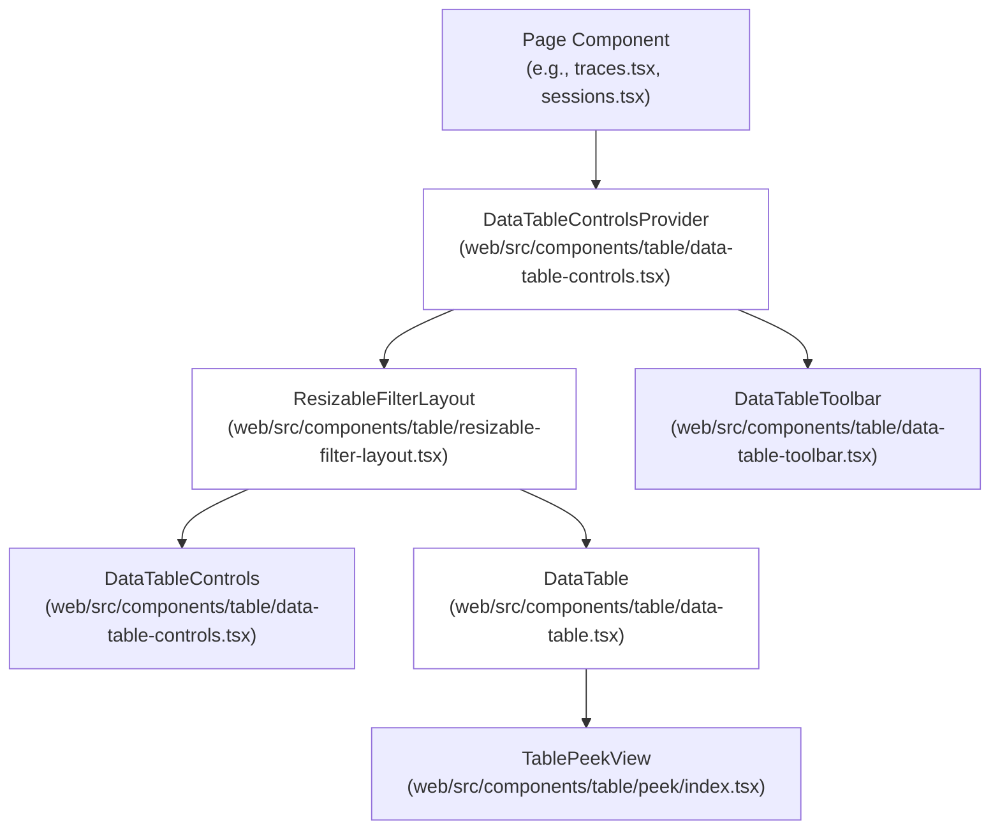
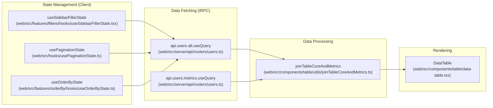

## Purpose and Scope

This document describes the **Table Components System** in Langfuse's web application — a reusable framework for building feature-rich data tables with filtering, sorting, pagination, column management, and batch actions. The system is built on top of TanStack Table (React Table) and provides consistent UX patterns across all table views in the application.

This page covers:
- Core table components and their composition
- Data flow patterns (fetch, join, transform)
- Column definition system
- State management hooks
- Common table features (filtering, sorting, pagination, selection)
- Advanced features (peek views, dynamic cells, table presets)

---

## System Architecture

### Component Hierarchy

The table system follows a hierarchical component structure where layout components wrap data components, and state providers enable cross-component communication.

Title: Table Component Hierarchy

**Component Roles**:
- **DataTableControlsProvider**: Provides shared context for sidebar visibility and collapse state [web/src/components/table/data-table-controls.tsx:54-81]().
- **ResizableFilterLayout**: Implements resizable split pane with filter sidebar and table content [web/src/components/table/use-cases/traces.tsx:13]().
- **DataTableToolbar**: Top toolbar with search, date range picker, export buttons, and action menus [web/src/components/table/use-cases/traces.tsx:3]().
- **DataTableControls**: Left sidebar with grouped filter controls and AI-powered filter generation [web/src/components/table/data-table-controls.tsx:108-208]().
- **DataTable**: Core table component that renders rows, columns, handles sorting/pagination [web/src/components/table/data-table.tsx:156-182]().
- **TablePeekView**: Optional drawer for inline detail views without navigation [web/src/components/table/data-table.tsx:76]().

Sources: [web/src/components/table/use-cases/traces.tsx:2-13](), [web/src/components/table/data-table-controls.tsx:54-108](), [web/src/components/table/data-table.tsx:156-182]()

---

## Core Table Components

### DataTable Component

The `DataTable` component is a wrapper around TanStack Table that provides standardized rendering, sorting, and pagination controls.

**Location**: `web/src/components/table/data-table.tsx` [web/src/components/table/data-table.tsx:156]()

**Key Features**:
- **Sticky Pinning**: Supports `isPinnedLeft` for fixed columns like IDs or selection checkboxes via sticky positioning and z-index management [web/src/components/table/data-table.tsx:127-140]().
- **Column Sizing**: Persists user-defined column widths to localStorage via the `useColumnSizing` hook [web/src/components/table/data-table.tsx:198]().
- **Group Headers**: Optional rendering of multi-level headers for complex data types like Usage or Cost [web/src/components/table/data-table.tsx:173]().
- **Row Click Handling**: Integrated support for opening detail views via `onRowClick` [web/src/components/table/data-table.tsx:174]().

Sources: [web/src/components/table/data-table.tsx:116-229]()

### TablePeekView Component

Provides an inline detail drawer to view trace or observation details without navigating away from the table.

**Implementation Details**:
- **Peek Detail Views**: Specialized wrappers like `TablePeekViewTraceDetail` [web/src/components/table/use-cases/traces.tsx:88]() and `TablePeekViewObservationDetail` [web/src/components/table/use-cases/observations.tsx:70]() render the content within the drawer.
- **Navigation**: Includes detail page navigation to cycle through items in the current table list using the `usePeekNavigation` hook [web/src/components/table/use-cases/traces.tsx:89]().

Sources: [web/src/components/table/use-cases/traces.tsx:88-90](), [web/src/components/table/use-cases/observations.tsx:70-71]()

---

## Data Flow Architecture

### Standard Data Flow Pattern

All table implementations follow a consistent data flow pattern with separate fetches for core data and metrics.

Title: Table Data Flow (Natural Language to Code Entities)

**Why Split Core and Metrics?**
The dual-query pattern exists because core metadata comes from primary PostgreSQL tables (V3) or initial ClickHouse scans (V4), while metrics (e.g., total cost, latency) often require aggregations. Splitting them allows the UI to render the table structure immediately while metrics load asynchronously. This is evident in the `UsersPage` metrics fetching [web/src/pages/project/[projectId]/users.tsx:197-222]().

Sources: [web/src/pages/project/[projectId]/users.tsx:197-222](), [web/src/components/table/use-cases/traces.tsx:54]()

---

## Column Definition System

### LangfuseColumnDef Type

Tables use the `LangfuseColumnDef<TRow>` type, which extends TanStack Table's `ColumnDef` with Langfuse-specific metadata [web/src/components/table/types.ts:15]().

**Extended Properties**:
- **isPinnedLeft**: Forces the column to the left of the scrollable area [web/src/components/table/data-table.tsx:203-205]().
- **Grouping**: Used for nested column groups (e.g., "Usage" grouping "Input", "Output", "Total") [web/src/components/table/data-table.tsx:186-196]().

### Dynamic Columns: Scores

Score columns are dynamically generated using the `useScoreColumns` hook, which fetches available score names for the project and creates column definitions for them [web/src/components/table/use-cases/traces.tsx:99](). This allows tables to adapt to custom scoring schemas.

Sources: [web/src/components/table/use-cases/traces.tsx:99](), [web/src/components/table/use-cases/observations.tsx:82](), [web/src/components/table/use-cases/sessions.tsx:64]()

---

## Specialized Table Implementations

### Traces Table
The primary view for LLM traces. It includes complex cell renderers like `MemoizedIOTableCell` for input/output [web/src/components/table/use-cases/traces.tsx:50]() and `LevelCountsDisplay` for nested observation statuses [web/src/components/table/use-cases/traces.tsx:68](). It also supports real-time refresh intervals [web/src/components/table/use-cases/traces.tsx:171-182]().

### Observations & Events Table
The `ObservationsTable` displays individual spans and generations [web/src/components/table/use-cases/observations.tsx:151](). The `ObservationsEventsTable` (v4 beta) uses the ClickHouse events table for high-performance retrieval [web/src/features/events/components/EventsTable.tsx:183](). It uses a specialized `observationEventsFilterConfig` for mapping UI facets to the ClickHouse schema [web/src/features/events/config/filter-config.ts:28]().

### Users Table
The `UsersPage` switches between V3 (Postgres-backed) and V4 (ClickHouse-backed) endpoints based on the `isBetaEnabled` flag [web/src/pages/project/[projectId]/users.tsx:197-233](). It uses `joinTableCoreAndMetrics` to combine user identity data with usage statistics [web/src/pages/project/[projectId]/users.tsx:25]().

Sources: [web/src/components/table/use-cases/traces.tsx:50-182](), [web/src/pages/project/[projectId]/users.tsx:197-233](), [web/src/features/events/components/EventsTable.tsx:183](), [web/src/features/events/config/filter-config.ts:28-253]()

---

## State Management & Persistence

### Persistence Strategy
The system uses a mix of URL parameters and Session/LocalStorage to persist table state:
- **Pagination/Filters**: Persisted in URL query strings via `usePaginationState` [web/src/hooks/usePaginationState.ts:23]() and `useSidebarFilterState` [web/src/features/filters/hooks/useSidebarFilterState.tsx:3]().
- **Visibility/Order**: Persisted in LocalStorage to maintain user preferences via `useColumnVisibility` [web/src/components/table/use-cases/traces.tsx:17]() and `useColumnOrder` [web/src/components/table/use-cases/traces.tsx:55]().
- **Refresh Intervals**: The user's selected refresh interval is stored in `SessionStorage` per project [web/src/components/table/use-cases/traces.tsx:171-176]().

### Filter Engine
The `useSidebarFilterState` hook manages the complex logic of categorical facets, numeric ranges, and key-value filters [web/src/features/filters/hooks/useSidebarFilterState.tsx:137-211](). It supports normalization of display names to column IDs to prevent duplicates when old URLs are used [web/src/features/filters/hooks/useSidebarFilterState.tsx:42-89]().

Sources: [web/src/components/table/use-cases/traces.tsx:171-182](), [web/src/features/filters/hooks/useSidebarFilterState.tsx:42-211]()

---

## Batch Actions & Selection

### TableSelectionManager
A specialized component providing "Select All" functionality. It handles:
- **Select All on Page**: Standard TanStack Table row selection [web/src/components/table/use-cases/traces.tsx:64]().
- **Select All in Project**: Uses the `useSelectAll` hook to apply batch actions to all records matching current filters [web/src/components/table/use-cases/traces.tsx:62]().

### TableActionMenu
The `TableActionMenu` renders operations like "Delete", "Add to Dataset", or "Run Evaluation" based on the context and selected rows [web/src/components/table/use-cases/traces.tsx:61]().

Sources: [web/src/components/table/use-cases/traces.tsx:61-64](), [web/src/features/events/components/EventsTable.tsx:67-69]()