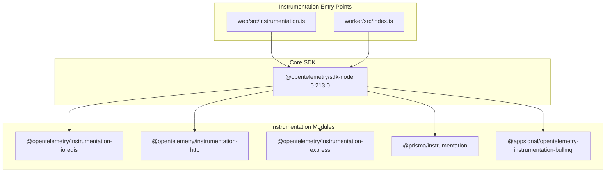

This document provides a comprehensive reference of the core technologies, frameworks, and libraries used throughout the Langfuse codebase. For information about how these components interact architecturally, see [1.1 System Architecture](). For details on the monorepo organization, see [1.2 Monorepo Structure]().

---

## Overview of Technology Layers

The Langfuse technology stack is organized into distinct layers, each using specialized technologies optimized for their specific responsibilities.

### System Components and Code Entities
The following diagram maps high-level system components to their respective implementation technologies and code entities.

```mermaid
graph TB
    subgraph "Frontend Layer"
        NextJS["Next.js 16.2.4<br/>App Router + Pages"]
        React["React 19.2.4<br/>UI Components"]
        TypeScript["TypeScript 5.9.2<br/>Type Safety"]
        TailwindCSS["Tailwind CSS<br/>Styling"]
        RadixUI["Radix UI<br/>Accessible Components"]
    end
    
    subgraph "API Layer"
        TRPC["tRPC 11.13.4<br/>Type-safe Internal API"]
        NextAuth["NextAuth.js 4.24.13<br/>Authentication"]
        PublicAPI["Public REST API<br/>Express/Next.js Routes"]
        Zod["Zod 4.3.6<br/>Schema Validation"]
        MCP["@modelcontextprotocol/sdk 1.29.0<br/>MCP Server"]
    end
    
    subgraph "Backend Services"
        Express["Express 5.2.1<br/>Worker HTTP Server"]
        BullMQ["BullMQ 5.73.5<br/>Queue Processing"]
        Node24["Node.js 24<br/>Runtime"]
    end
    
    subgraph "Data Access"
        Prisma["Prisma 6.19.3<br/>PostgreSQL ORM"]
        ClickHouseClient["@clickhouse/client 1.13.0<br/>ClickHouse Driver"]
        IORedis["ioredis 5.10.1<br/>Redis Client"]
        AWSSDK["AWS SDK v3<br/>S3 Storage"]
    end
    
    subgraph "Observability"
        OpenTelemetry["OpenTelemetry SDK 2.6.0<br/>Distributed Tracing"]
        DDTrace["dd-trace 5.97.0<br/>Datadog APM"]
        Sentry["@sentry/nextjs 10.46.0<br/>Error Tracking"]
    end
    
    subgraph "LLM Integration"
        Langchain["langchain 1.3.0<br/>LLM Framework"]
        LCAnthropic["@langchain/anthropic 1.3.26"]
        LCOpenAI["@langchain/openai 1.4.2"]
        LCAWS["@langchain/aws 1.3.4"]
        LCGoogle["@langchain/google-* 2.1.26"]
    end
    
    subgraph "Build Tools"
        pnpm["pnpm 10.33.0<br/>Package Manager"]
        Turbo["Turbo 2.9.5<br/>Monorepo Build"]
        Docker["Docker<br/>Containerization"]
        Prettier["Prettier 3.8.3<br/>Code Formatting"]
        ESLint["ESLint 9.39.4<br/>Linting"]
    end
    
    NextJS --> TRPC
    NextJS --> NextAuth
    React --> RadixUI
    React --> TailwindCSS
    TRPC --> Zod
    Express --> BullMQ
    BullMQ --> IORedis
    NextJS --> Prisma
    Express --> Prisma
    NextJS --> ClickHouseClient
    Express --> ClickHouseClient
    Express --> AWSSDK
    NextJS --> OpenTelemetry
    Express --> OpenTelemetry
    OpenTelemetry --> DDTrace
    Express --> Langchain
    Langchain --> LCAnthropic
    Langchain --> LCOpenAI
    
    pnpm -.manages.-> NextJS
    pnpm -.manages.-> Express
    Turbo -.builds.-> NextJS
    Turbo -.builds.-> Express
```

**Sources:** [package.json:1-118](), [web/package.json:1-167](), [worker/package.json:1-92](), [packages/shared/package.json:1-146]()

---

## Runtime Environment

### Node.js Version

Langfuse requires **Node.js 24** as specified across all package configurations and containerization.

The Node version is enforced through:
- **Package Management**: All `package.json` files declare `"engines": { "node": "24" }` [package.json:8-9](), [web/package.json:7-8](), [worker/package.json:12-13](), [packages/shared/package.json:15-16]().
- **Production**: Docker images use `node:24-alpine` base image [web/Dockerfile:2](), [worker/Dockerfile:2]().

**Sources:** [package.json:8-9](), [web/package.json:7-8](), [worker/package.json:12-13](), [packages/shared/package.json:15-16](), [web/Dockerfile:2](), [worker/Dockerfile:2]()

### Package Manager

**pnpm 10.33.0** is the required package manager, enforced through:
- Preinstall hook using `only-allow pnpm` [package.json:14]().
- Explicit version pinning in `packageManager` field [package.json:100]().
- Corepack activation in Docker builds [web/Dockerfile:13-14](), [worker/Dockerfile:13-14]().

**Sources:** [package.json:14,100](), [web/Dockerfile:13-14](), [worker/Dockerfile:13-14]()

---

## Web Service Technology Stack (Next.js)

The web service runs on **port 3000** by default and provides the UI, internal tRPC API, and public REST API [web/Dockerfile:172]().

### Core Framework

| Technology | Version | Purpose |
|------------|---------|---------|
| Next.js | 16.2.4 | Full-stack React framework with App Router and Pages Router |
| React | 19.2.4 | UI library for component-based interfaces |
| React DOM | 19.2.4 | React rendering layer for web |
| TypeScript | 5.9.2 | Static type checking |

**Configuration:** Next.js is configured in `web/next.config.mjs` with:
- **Output mode**: `"standalone"` for optimized production builds [web/next.config.mjs:89]().
- **Server externals**: Excludes observability and queue packages from bundling [web/next.config.mjs:57-64]().
- **Transpile packages**: Processes `@langfuse/shared` and `vis-network/standalone` [web/next.config.mjs:55]().
- **Turbopack**: Enabled for development with custom resolve aliases [web/next.config.mjs:67-71]().
- **Base path**: Configurable via `NEXT_PUBLIC_BASE_PATH` [web/next.config.mjs:66]().

**Sources:** [web/package.json:127,138,140](), [web/next.config.mjs:1-197](), [pnpm-lock.yaml:61-63]()

### UI Component Libraries

| Library | Version | Purpose |
|---------|---------|---------|
| Radix UI | Various | Unstyled, accessible component primitives |
| Tailwind CSS | 4.2.2 | Utility-first CSS framework |
| Lucide React | 0.552.0 | Icon library |
| React Hook Form | 7.72.0 | Form state management |
| Recharts | 3.8.0 | Chart library for analytics |
| @tanstack/react-virtual | 3.13.12 | List virtualization for performance |

The UI is built using Radix UI primitives (accordion, dialog, dropdown, popover, etc.) styled with Tailwind CSS [web/package.json:65-87,159-160]().

**Sources:** [web/package.json:65-87,92-93,125,143,150,159-160]()

### Data Fetching & State Management

| Technology | Version | Purpose |
|------------|---------|---------|
| tRPC | 11.13.4 | Type-safe API layer |
| @tanstack/react-query | 5.85.1 | Async state management |
| @tanstack/react-table | 8.20.5 | Table state management |
| SuperJSON | 2.2.2 | JSON serialization with type preservation |

tRPC provides end-to-end type safety between the Next.js server and React client [web/package.json:95-98]().

**Sources:** [web/package.json:91-92,95-98,158]()

---

## Worker Service Technology Stack (Express)

The worker service handles asynchronous background processing and runs on **port 3030** [worker/Dockerfile:94]().

### Core Framework

| Technology | Version | Purpose |
|------------|---------|---------|
| Express | 5.2.1 | HTTP server for health checks and metrics |
| Node.js | 24 | JavaScript runtime |
| TypeScript | 5.7.2 | Static type checking |

**Sources:** [worker/package.json:57,88](), [worker/Dockerfile:94]()

### Queue Processing

| Technology | Version | Purpose |
|------------|---------|---------|
| BullMQ | 5.73.5 | Redis-based job queue |
| ioredis | 5.10.1 | Redis client (used by BullMQ) |

BullMQ is used for high-throughput ingestion and background tasks [worker/package.json:50]().

**Sources:** [worker/package.json:50,59](), [packages/shared/package.json:103,108]()

---

## Database & Storage Technologies

### PostgreSQL with Prisma

| Technology | Version | Purpose |
|------------|---------|---------|
| Prisma Client | 6.19.3 | Type-safe PostgreSQL ORM |
| Prisma CLI | 6.19.3 | Database migrations and schema management |

Prisma manages the PostgreSQL schema for metadata and configuration. The shared package contains the central prisma client definition used by both web and worker services [packages/shared/package.json:94,137,181-183]().

**Sources:** [packages/shared/package.json:94,137,181-183](), [web/package.json:135]()

### ClickHouse

| Technology | Version | Purpose |
|------------|---------|---------|
| @clickhouse/client | 1.13.0 | Official ClickHouse Node.js client |
| golang-migrate | 4.19.1 | Migration tool for ClickHouse schema |

ClickHouse stores high-volume observability data. Migrations are handled via `golang-migrate` (v4.19.1) which is compiled during the Docker build process [web/Dockerfile:33-34,151]().

**Sources:** [packages/shared/package.json:85](), [web/Dockerfile:33-34,151]()

### Redis

| Technology | Version | Purpose |
|------------|---------|---------|
| ioredis | 5.10.1 | Redis client with cluster support |

Redis is used as the backend for BullMQ and for rate limiting via `rate-limiter-flexible` [web/package.json:118,137](), [worker/package.json:59]().

**Sources:** [web/package.json:118,137](), [worker/package.json:59]()

### Object Storage

| SDK | Version | Purpose |
|-----|---------|---------|
| @aws-sdk/client-s3 | 3.1024.0 | AWS S3 client for event storage |
| @azure/storage-blob | 12.26.0 | Azure Blob Storage support |
| @google-cloud/storage | 7.19.0 | Google Cloud Storage support |

**Sources:** [packages/shared/package.json:81,84,86](), [pnpm-lock.yaml:141,153,159]()

---

## Observability & Monitoring Stack

### OpenTelemetry Instrumentation

Langfuse uses OpenTelemetry for distributed tracing across services.

**Sources:** [web/package.json:29,49-62,64](), [worker/package.json:33,36-48](), [web/src/instrumentation.ts:1]()

### Monitoring Tools

| Technology | Version | Purpose |
|------------|---------|---------|
| dd-trace | 5.97.0 | Datadog APM integration |
| @sentry/nextjs | 10.46.0 | Error tracking |
| posthog-node | 5.8.4 | Product analytics |

**Sources:** [web/package.json:88,111,132](), [worker/package.json:53,64]()

---

## LLM Integration Stack

### Langchain Framework

| Technology | Version | Purpose |
|------------|---------|---------|
| langchain | 1.3.0 | Core LLM framework |
| @langchain/core | 1.1.39 | Langchain core abstractions |

**Sources:** [web/package.json:43,122](), [packages/shared/package.json:89,111]()

### LLM Provider SDKs

| Provider Package | Version | Purpose |
|-----------------|---------|---------|
| @langchain/anthropic | 1.3.26 | Claude models support |
| @langchain/openai | 1.4.2 | GPT models support |
| @langchain/aws | 1.3.4 | AWS Bedrock models support |
| @langchain/google-genai | 2.1.26 | Google AI Studio support |
| @langchain/google-vertexai | 2.1.26 | Google Vertex AI support |

**Sources:** [packages/shared/package.json:87-92](), [pnpm-lock.yaml:162,165,171,174,177]()

---

## Build & CI/CD Tools

### Monorepo Management

| Tool | Version | Purpose |
|------|---------|---------|
| pnpm | 10.33.0 | Package manager |
| Turbo | 2.9.5 | Monorepo build orchestration |

Turbo manages task execution and caching across the monorepo [package.json:51](). Docker builds leverage `turbo prune` to create minimal build contexts for services [web/Dockerfile:41](), [worker/Dockerfile:26]().

**Sources:** [package.json:51,100](), [web/Dockerfile:10,41](), [worker/Dockerfile:26]()

### Versioning

Langfuse uses `release-it` for automated versioning and release management [package.json:50-95](). Versions are synchronized across the monorepo via the `@release-it/bumper` plugin, targeting version files in `shared`, `web`, and `worker` [package.json:65-83]().

**Sources:** [package.json:50-95](), [web/src/constants/VERSION.ts:1](), [worker/src/constants/VERSION.ts:1]()