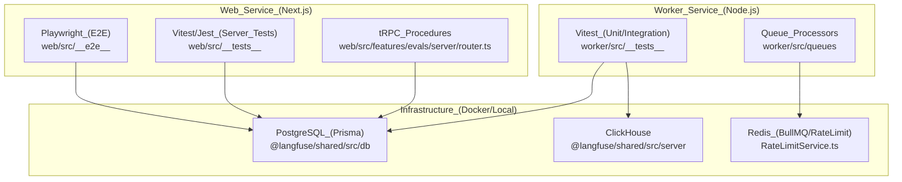
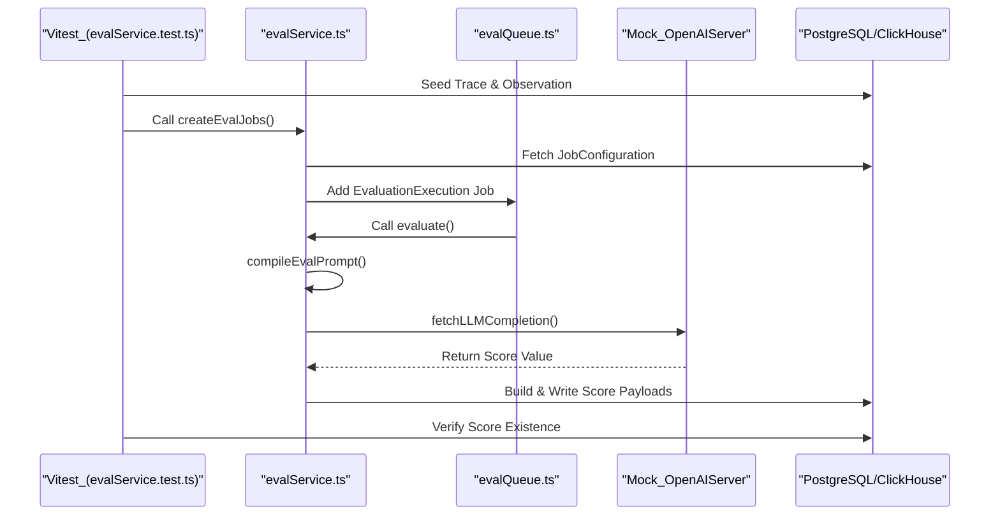

This document describes the comprehensive testing approach used in the Langfuse codebase, including test types, frameworks, execution patterns, and test utilities. The strategy ensures code quality through multiple layers of verification across the `web`, `worker`, and `packages/shared` workspace.

---

## Testing Philosophy and Scope

The Langfuse testing strategy employs a multi-layered approach with distinct test types targeting different aspects of the system:

- **Unit tests** verify isolated business logic and utilities, such as prompt template compilation [worker/src/__tests__/evalService.test.ts:76-82]() or rate limit logic [web/src/features/public-api/server/RateLimitService.ts:173-175]().
- **Integration tests** validate interactions between components, including PostgreSQL, ClickHouse, Redis, and S3. This includes verifying evaluation job creation [worker/src/features/evaluation/evalService.ts:111-125]() and prompt management via public APIs [web/src/__tests__/server/prompts.v2.servertest.ts:130-132]().
- **End-to-end (E2E) tests** ensure complete user workflows function correctly in a browser environment using Playwright [web/playwright.config.ts:1-10]().
- **LLM Connection tests** verify live connectivity and structured output parsing for various model providers, often using mocks like `OpenAIServer` for consistent local and CI testing [worker/src/__tests__/evalService.test.ts:29-31]().
- **Test Utilities** provide standardized methods for database setup (`createOrgProjectAndApiKey`), API mocking, and waiting for asynchronous events [web/src/__tests__/test-utils.ts:1-10]().

**Sources:** [worker/src/__tests__/evalService.test.ts:76-82](), [web/src/features/public-api/server/RateLimitService.ts:173-175](), [web/playwright.config.ts:1-10](), [worker/src/features/evaluation/evalService.ts:111-125]()

---

## Test Framework Overview

The following diagram illustrates the relationship between test runners, project structures, and the infrastructure requirements for execution.

### Test Architecture and Entity Mapping

**Sources:** [web/src/features/evals/server/router.ts:3-5](), [worker/src/queues/evalQueue.ts:25-27](), [web/src/features/public-api/server/RateLimitService.ts:35-37](), [worker/src/__tests__/evalService.test.ts:27-28]()

---

## Test Types and Organization

### Unit and Integration Tests

**Evaluation Logic Tests:**
Tests in `worker/src/__tests__/evalService.test.ts` verify the core evaluation engine.
- **Prompt Compilation:** Verifies `compileTemplateString` handles various variable types (strings, numbers, booleans, objects) and missing values [worker/src/__tests__/evalService.test.ts:76-191]().
- **Variable Extraction:** Tests `extractVariablesFromTracingData` to ensure variables are correctly pulled from trace and observation metadata [worker/src/__tests__/evalService.test.ts:33-34]().
- **Error Handling:** Mocks `fetchLLMCompletion` to simulate API errors and verify that `UnrecoverableError` or `LLMCompletionError` are handled correctly by the service [worker/src/__tests__/evalService.test.ts:38-50]().

**API & Auth Integration Tests:**
Server tests in `web/src/__tests__/server` verify the public API and authentication.
- **Prompt API (V2):** Verifies CRUD operations for prompts, including fetching by version, label, and handling special characters in prompt names [web/src/__tests__/server/prompts.v2.servertest.ts:130-215]().
- **Rate Limiting:** Tests the `RateLimitService` to ensure requests are limited based on organization plans and resource types (e.g., ingestion vs. management) [web/src/features/public-api/server/RateLimitService.ts:63-82]().

**Queue Processor Tests:**
- **Evaluation Creator:** Verifies `evalJobTraceCreatorQueueProcessor` correctly triggers `createEvalJobs` for incoming trace events [worker/src/queues/evalQueue.ts:25-34]().
- **Retry Logic:** Tests the `retryObservationNotFound` logic within the `evalJobDatasetCreatorQueueProcessor` to ensure eventual consistency when observations lag behind dataset items [worker/src/queues/evalQueue.ts:59-68]().

**Sources:** [worker/src/__tests__/evalService.test.ts:76-191](), [web/src/__tests__/server/prompts.v2.servertest.ts:130-215](), [worker/src/queues/evalQueue.ts:25-68](), [web/src/features/public-api/server/RateLimitService.ts:63-82]()

### End-to-End Tests (Web Service - Playwright)

E2E tests verify the frontend application and its integration with the backend services.

**Project Lifecycle:**
- **Project Creation:** Simulates a complete onboarding flow: signing in, creating an organization, and then a project [web/src/__e2e__/create-project.spec.ts:34-99]().
- **Navigation:** Iterates through core views (Tracing, Sessions, Observations, Scores) to ensure the `page-header-title` renders correctly [web/src/__e2e__/create-project.spec.ts:123-149]().

**UI Components:**
- **Evaluation Logs:** Verifies the `EvalLogTable` correctly displays job execution status and links to target traces or templates [web/src/features/evals/components/eval-log.tsx:47-190]().
- **Error States:** Uses `ErrorPage` and `ErrorPageWithSentry` to ensure the application fails gracefully and reports errors to Sentry [web/src/components/error-page.tsx:10-97]().

**Sources:** [web/src/__e2e__/create-project.spec.ts:34-149](), [web/src/features/evals/components/eval-log.tsx:47-190](), [web/src/components/error-page.tsx:10-97]()

---

## Evaluation System Verification Flow

The following diagram maps the logic for testing the evaluation pipeline, from job creation to execution.

**Sources:** [worker/src/features/evaluation/evalService.ts:111-176](), [worker/src/queues/evalQueue.ts:127-176](), [worker/src/__tests__/evalService.test.ts:31-34]()

---

## Scheduled Job & EE Verification

Testing strategies for enterprise features and background tasks:

- **Cloud Usage Metering:** The `handleCloudUsageMeteringJob` is tested to ensure it correctly aggregates `tracing_observations` and `events` from ClickHouse and reports them to Stripe [worker/src/ee/cloudUsageMetering/handleCloudUsageMeteringJob.ts:137-220]().
- **Batch Export:** The `batchExportQueueProcessor` is verified for handling export lifecycle, including status updates to `FAILED` and error logging [worker/src/queues/batchExportQueue.ts:14-53]().
- **Audit Logging:** TRPC procedures for evaluation templates and jobs include `auditLog` calls that are verified to ensure administrative actions are recorded [web/src/features/evals/server/router.ts:7-9]().

**Sources:** [worker/src/ee/cloudUsageMetering/handleCloudUsageMeteringJob.ts:137-220](), [worker/src/queues/batchExportQueue.ts:14-53](), [web/src/features/evals/server/router.ts:7-9]()