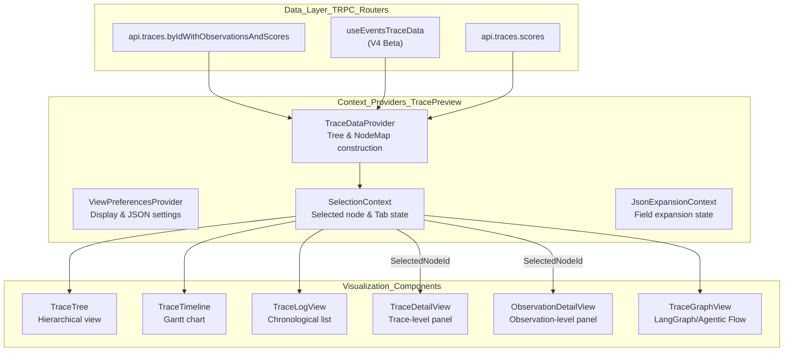
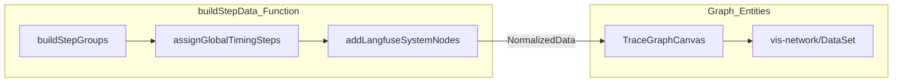

This page documents the implementation of the trace and session detail views in the Langfuse web application. These views provide deep inspection of individual execution graphs (traces) and collections of related traces (sessions).

## Trace View Architecture

The trace view is built on a modular architecture that separates data fetching, tree construction, and multiple visualization strategies (Tree, Timeline, Log, and Graph).

### Component & Data Flow

**Sources**: [web/src/components/trace2/components/TraceDetailView/TraceDetailView.tsx:39-41](), [web/src/components/trace2/components/ObservationDetailView/ObservationDetailView.tsx:80-87](), [web/src/components/trace2/TracePreview.tsx:42-47](), [web/src/components/trace2/TracePage.tsx:34-68]()

---

## Tree Visualization Implementation

The core of the trace view is the hierarchical tree structure. Langfuse uses an iterative algorithm to build this tree to prevent stack overflows on deep traces.

### Tree Data Construction
The `TraceDataProvider` transforms flat observation arrays into a `nodeMap` (for O(1) lookups) and a `roots` array.

- **Traditional Traces**: Fetched via `api.traces.byIdWithObservationsAndScores` [web/src/components/trace2/TracePage.tsx:34-39]().
- **Events-Based Traces (V4 Beta)**: If `isBetaEnabled` is true, data is fetched via `useEventsTraceData` from the events table [web/src/components/trace2/TracePage.tsx:54-59]().
- **Subtree Metrics**: For root observations, the system lazily computes subtree metrics (aggregated cost/usage) via `aggregateTraceMetrics` and `getDescendantIds` [web/src/components/trace2/components/ObservationDetailView/ObservationDetailView.tsx:103-112]().

### Virtualized Tree Rendering
To handle traces with thousands of nodes, the tree view and log view use `@tanstack/react-virtual`.
- **Thresholds**: Log view virtualization is triggered when observations exceed a threshold (default 150) [web/src/components/trace2/components/ObservationDetailView/ObservationDetailView.tsx:89-91]().
- **Flattening**: The log view uses `log-view-flattening.ts` to convert the tree structure into a flat list suitable for virtualization.

**Sources**: [web/src/components/trace2/components/TraceDetailView/TraceDetailView.tsx:177-178](), [web/src/components/trace2/components/ObservationDetailView/ObservationDetailView.tsx:88-90](), [web/src/components/trace2/TracePage.tsx:54-68]()

---

## Trace Graph View (Agentic Flows)

For agentic workflows (e.g., LangGraph), Langfuse provides a graph-based visualization using `vis-network`.

### Graph Construction Logic
The `TraceGraphView` processes observation data into nodes and edges. If explicit step data is missing, it uses `buildStepData` to infer steps based on timing and parent-child constraints [web/src/features/trace-graph-view/components/TraceGraphView.tsx:46-52]().

- **Step Normalization**: Observations are grouped into steps. A child observation must be at least `parent_step + 1`. If violations occur, the system iteratively pushes future steps forward [web/src/features/trace-graph-view/buildStepData.ts:153-175]().
- **System Nodes**: Synthetic nodes like `__start_lf__` and `__end_lf__` are added to represent the entry and exit of the trace [web/src/features/trace-graph-view/buildStepData.ts:191-211]().
- **Physics Optimization**: Physics-based layout is disabled for graphs with more than 500 nodes to maintain performance [web/src/features/trace-graph-view/components/TraceGraphView.tsx:24]().

**Sources**: [web/src/features/trace-graph-view/components/TraceGraphView.tsx:46-68](), [web/src/features/trace-graph-view/buildStepData.ts:116-120](), [web/src/features/trace-graph-view/components/TraceGraphCanvas.tsx:180-186]()

---

## Trace Detail & Observation Panels

When a node is selected, a detail panel opens. This panel is split into `TraceDetailView` (for the trace root) and `ObservationDetailView` (for spans, generations, etc.).

### Input/Output Preview (`IOPreview`)
The `IOPreview` component is a router that decides how to render the input, output, and metadata of an observation based on the user's `ViewMode` preference [web/src/components/trace2/components/IOPreview/IOPreview.tsx:87-98]().

| View Mode | Component | Characteristics |
|-----------|-----------|-----------------|
| `pretty` | `IOPreviewPretty` | Parses ChatML, renders Markdown, highlights tool calls. |
| `json` | `IOPreviewJSONSimple` | Standard JSON tree view. |
| `json-beta` | `IOPreviewJSON` | Advanced `AdvancedJsonViewer` with virtualization and inline comments [web/src/components/trace2/components/IOPreview/IOPreviewJSON.tsx](). |

### JSON Expansion and Parsing
- **Web Worker Parsing**: To keep the UI responsive, large trace inputs/outputs are parsed in a background web worker via the `useParsedTrace` and `useParsedObservation` hooks [web/src/hooks/useParsedTrace.ts:1-20](), [web/src/hooks/useParsedObservation.ts:1-10]().
- **JSON Expansion**: State is managed via `JsonExpansionContext`, tracking expansion for formatted, simple JSON, and advanced JSON views [web/src/components/trace2/contexts/JsonExpansionContext.tsx:1-20]().

**Sources**: [web/src/components/trace2/components/IOPreview/IOPreview.tsx:146-152](), [web/src/components/trace2/components/TraceDetailView/TraceDetailView.tsx:138-145](), [web/src/components/trace2/components/ObservationDetailView/ObservationDetailView.tsx:51-55]()

---

## Log View & Timeline

### Log View (`TraceLogView`)
The Log View provides a chronological or tree-ordered list of observations.
- **Virtualization**: Automatically enabled if observations exceed the `virtualizationThreshold` [web/src/components/trace2/components/ObservationDetailView/ObservationDetailView.tsx:88-90]().
- **Content**: Displays input/output previews directly in the list. It can be disabled for performance if observation counts are extremely high (>350) [web/src/components/trace2/TracePreview.tsx:166-173]().

### Timeline View (`TraceTimeline`)
A Gantt-style visualization of observation durations relative to the trace start time. It uses the same tree-building data to align bars horizontally.

**Sources**: [web/src/components/trace2/components/TraceLogView/TraceLogView.tsx](), [web/src/components/trace2/TracePreview.tsx:166-173]()

---

## Session Detail Page

The Session view aggregates multiple traces sharing a `sessionId`.

### Data Flow & Rendering
1. **Fetch**: Uses `api.sessions.byId` for metadata and session-level metrics.
2. **Virtualization**: Uses `useVirtualizer` from `@tanstack/react-virtual` to render traces within the session efficiently.
3. **Filtering**: Supports complex filters via `PopoverFilterBuilder`.

### Session Users
Sessions can involve multiple users. The `SessionUsers` component handles large user lists by paginating the display within a popover.

---

## V4 Beta Viewer & Synthetic Traces

The "Trace2" viewer (V4 Beta) introduces an events-first architecture where traces are derived from observation events.

### Synthetic Trace Construction
In V4 mode, the `useEventsTraceData` hook fetches raw observations from the events table. The `TraceDataProvider` then constructs a synthetic trace structure from these events, even if no explicit trace object exists [web/src/components/trace2/TracePage.tsx:54-68]().

### Inline Comments & Corrections
- **Inline Comments**: Users can add comments to specific JSON paths in the `json-beta` view [web/src/components/trace2/components/IOPreview/IOPreviewJSON.tsx:50-52]().
- **Corrections**: The viewer displays the `mostRecentCorrection` for generations, allowing users to see human-corrected outputs alongside model outputs [web/src/features/corrections/utils/getMostRecentCorrection.ts](), [web/src/components/trace2/components/IOPreview/IOPreview.tsx:139-140]().

### Star/Bookmark Toggles
Individual objects can be bookmarked using specialized toggles that handle optimistic UI updates and TRPC cache invalidation:
- `StarTraceDetailsToggle`: For the single trace view [web/src/components/star-toggle.tsx:124-134]().
- `StarSessionToggle`: For the session view [web/src/components/star-toggle.tsx:191-201]().

**Sources**: [web/src/components/trace2/TracePage.tsx:16-17](), [web/src/components/star-toggle.tsx:148-160]()

---

## Performance & Virtualization

| Feature | Implementation | File |
|---------|----------------|------|
| **Trace Tree/Log** | DFS flattening + `@tanstack/react-virtual` | [web/src/components/trace2/components/TraceLogView/TraceLogView.tsx]() |
| **Session List** | `useVirtualizer` for trace rows | [web/src/components/session/index.tsx]() |
| **Advanced JSON** | `AdvancedJsonViewer` with `VIRTUALIZATION_THRESHOLD` | [web/src/components/trace2/components/IOPreview/IOPreviewJSON.tsx]() |
| **Trace Parsing** | Background Web Worker via `useParsedTrace` | [web/src/hooks/useParsedTrace.ts]() |

**Sources**: [web/src/components/trace2/TracePreview.tsx:147-153](), [web/src/hooks/useParsedTrace.ts:1-10]()