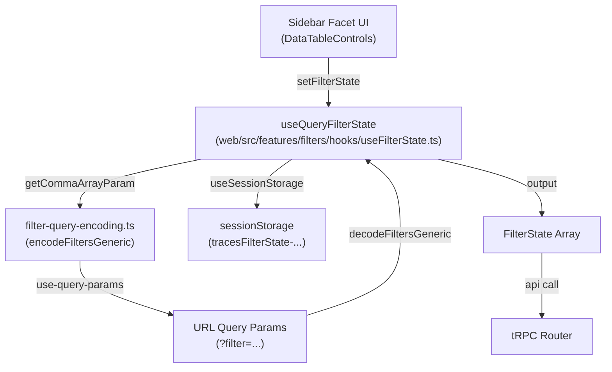

This document describes how UI state is managed in the Langfuse web application, specifically focusing on table components, filters, pagination, and URL persistence. The system uses a combination of URL query parameters, browser storage (`localStorage` and `sessionStorage`), and React hooks to maintain and persist UI state across page reloads and navigation.

## State Management Architecture

The web application implements a multi-layered state management strategy where different types of UI state are persisted in different locations based on their characteristics. Each table component (e.g., `TracesTable`, `ObservationsTable`, `EventsTable`, `SessionsTable`) composes multiple custom hooks to manage pagination, filtering, sorting, and display preferences.

### State Management Hook Locations

The following diagram maps the relationship between table components, core state hooks, and their persistence layers.

**Natural Language to Code Entity Space: Table State Composition**

```mermaid
graph TB
    subgraph "Table Components"
        TracesTable["TracesTable<br/>web/src/components/table/use-cases/traces.tsx"]
        EventsTable["ObservationsEventsTable<br/>web/src/features/events/components/EventsTable.tsx"]
        SessionsTable["SessionsTable<br/>web/src/components/table/use-cases/sessions.tsx"]
        ObservationsTable["ObservationsTable<br/>web/src/components/table/use-cases/observations.tsx"]
    end
    
    subgraph "Core State Hooks"
        usePaginationState["usePaginationState<br/>web/src/hooks/usePaginationState.ts"]
        useOrderByState["useOrderByState<br/>web/src/features/orderBy/hooks/useOrderByState.ts"]
        useSidebarFilterState["useSidebarFilterState<br/>web/src/features/filters/hooks/useSidebarFilterState.tsx"]
        useTableDateRange["useTableDateRange<br/>web/src/hooks/useTableDateRange.ts"]
        useQueryFilterState["useQueryFilterState<br/>web/src/features/filters/hooks/useFilterState.ts"]
    end
    
    subgraph "Column & Display Hooks"
        useColumnVisibility["useColumnVisibility<br/>web/src/features/column-visibility/hooks/useColumnVisibility.ts"]
        useColumnOrder["useColumnOrder<br/>web/src/features/column-visibility/hooks/useColumnOrder.ts"]
        useRowHeightLocalStorage["useRowHeightLocalStorage<br/>web/src/components/table/data-table-row-height-switch.tsx"]
    end
    
    subgraph "Persistence"
        URL["URL Query Params<br/>'use-query-params'"]
        LocalStorage["localStorage<br/>Browser API"]
        SessionStorage["sessionStorage<br/>Browser API"]
    end
    
    EventsTable --> usePaginationState
    EventsTable --> useOrderByState
    EventsTable --> useSidebarFilterState
    EventsTable --> useTableDateRange
    EventsTable --> useColumnVisibility
    EventsTable --> useColumnOrder
    
    usePaginationState --> URL
    useOrderByState --> SessionStorage
    useSidebarFilterState --> URL
    useSidebarFilterState --> SessionStorage
    useQueryFilterState --> URL
    useQueryFilterState --> SessionStorage
    useTableDateRange --> SessionStorage
    useColumnVisibility --> LocalStorage
    useColumnOrder --> LocalStorage
```

**Sources:**
- [web/src/features/filters/hooks/useFilterState.ts:127-131]()
- [web/src/features/filters/hooks/useSidebarFilterState.tsx:29-30]()

## State Persistence Strategies

### URL Query Parameters
URL query parameters make state shareable via links and allow browser back/forward navigation.
- **Pagination**: `pageIndex`, `pageSize`.
- **Filters**: Encoded filter state for sharing filtered views via the `filter` parameter [web/src/features/filters/hooks/useFilterState.ts:157-160]().
- **Search**: `search` query parameter.
- **View IDs**: The `viewId` parameter identifies a specific saved Table View Preset.

The `usePaginationState` hook wraps `useQueryParams` from the `use-query-params` library to synchronize this state.

### Session Storage
Session storage persists state within a browser tab session but is cleared when the tab closes.
- **Filter state**: User's current filter selections, keyed by project ID and table name (e.g., `tracesFilterState-projectId`) [web/src/features/filters/hooks/useFilterState.ts:134-138]().
- **Date ranges**: Time range selections.
- **Ordering**: Sort column and direction, managed via `useOrderByState`.
- **Sidebar State**: The expanded/collapsed state of the filter sidebar is stored in session storage using a key like `data-table-controls-${tableName}` [web/src/components/table/data-table-controls.tsx:64-68]().

### Local Storage
Local storage persists state across browser sessions and tabs.
- **Column visibility**: Persists which columns the user has hidden/shown.
- **Column order**: Persists the drag-and-drop arrangement of table columns.
- **V4 Beta Intro**: Tracks if the user has seen the V4 beta introduction dialog.

## Filter State Management

Filter state supports sidebar facets, URL persistence, and legacy normalization.

### Hook: `useQueryFilterState`
Location: [web/src/features/filters/hooks/useFilterState.ts:127-178]()

This hook provides the primary interface for managing filters that synchronize with both URL and session storage. It merges initial states with session states to ensure filters are not lost during navigation [web/src/features/filters/hooks/useFilterState.ts:140-149]().

### Filter Encoding and Decoding
Langfuse uses a custom semicolon-delimited format for encoding `FilterState` into URL strings.

| Format Component | Description | Example |
| :--- | :--- | :--- |
| **Column ID** | The internal ID of the column | `name` |
| **Type** | The filter type (string, number, etc.) | `string` |
| **Key** | Optional key for object/category types | `environment` |
| **Operator** | Comparison operator | `contains` |
| **Value** | URI-encoded value | `production` |

**Full Format**: `columnId;type;key;operator;value` [web/src/features/filters/lib/filter-query-encoding.ts:111-111](). Multiple filters are joined by commas [web/src/features/filters/lib/filter-query-encoding.ts:114-114](). Array values (e.g., for `stringOptions`) are joined with a pipe `|` character [web/src/features/filters/lib/filter-query-encoding.ts:101-101]().

**Natural Language to Code Entity Space: Filter Data Flow**

**Sources:**
- [web/src/features/filters/hooks/useFilterState.ts:39-76]()
- [web/src/features/filters/lib/filter-query-encoding.ts:76-117]()
- [web/src/features/filters/lib/filter-query-encoding.ts:123-205]()

## Filter Configuration and Facets

Tables define their filterable capabilities via `FilterConfig` objects. These configurations specify which columns are available for filtering and what UI "facets" (categorical, numeric, string, etc.) should be rendered in the sidebar.

### Configuration Examples
- **Observations/Events**: Defined in `observationEventsFilterConfig` [web/src/features/events/config/filter-config.ts:28-253](). It includes facets for `environment`, `type`, `latency`, and `scores_avg`.
- **Sessions**: Defined in `sessionFilterConfig` [web/src/features/filters/config/sessions-config.ts:16-134]().
- **Observations**: Defined in `observationFilterConfig` [web/src/features/filters/config/observations-config.ts:19-191]().

### UI Components
The `DataTableControls` component [web/src/components/table/data-table-controls.tsx:108-300]() renders the sidebar using these configurations. It supports:
- **Categorical Facets**: Checkbox lists for selecting discrete values [web/src/components/table/data-table-controls.tsx:192-211]().
- **Numeric Facets**: Range sliders for continuous values like latency or token counts.
- **Key-Value Facets**: Specialized builders for metadata and scores [web/src/components/table/data-table-controls.tsx:227-236]().
- **AI Filters**: On Langfuse Cloud, users can generate filter states from natural language using the `DataTableAIFilters` component [web/src/components/table/data-table-controls.tsx:174-176]().

## Selection and Batch Actions

Selection state is managed locally in table components but interacts with the global filter state for "Select All" operations.
- **Individual Selection**: Typically managed via `@tanstack/react-table`'s `RowSelectionState`.
- **Select All Mode**: Users can select all items matching the current filter criteria for batch operations like deletion or adding to datasets.

**Sources:**
- [web/src/components/table/data-table-controls.tsx:112-181]()
- [web/src/features/filters/lib/filter-config.ts:61-67]()
- [web/src/features/events/config/filter-config.ts:10-253]()